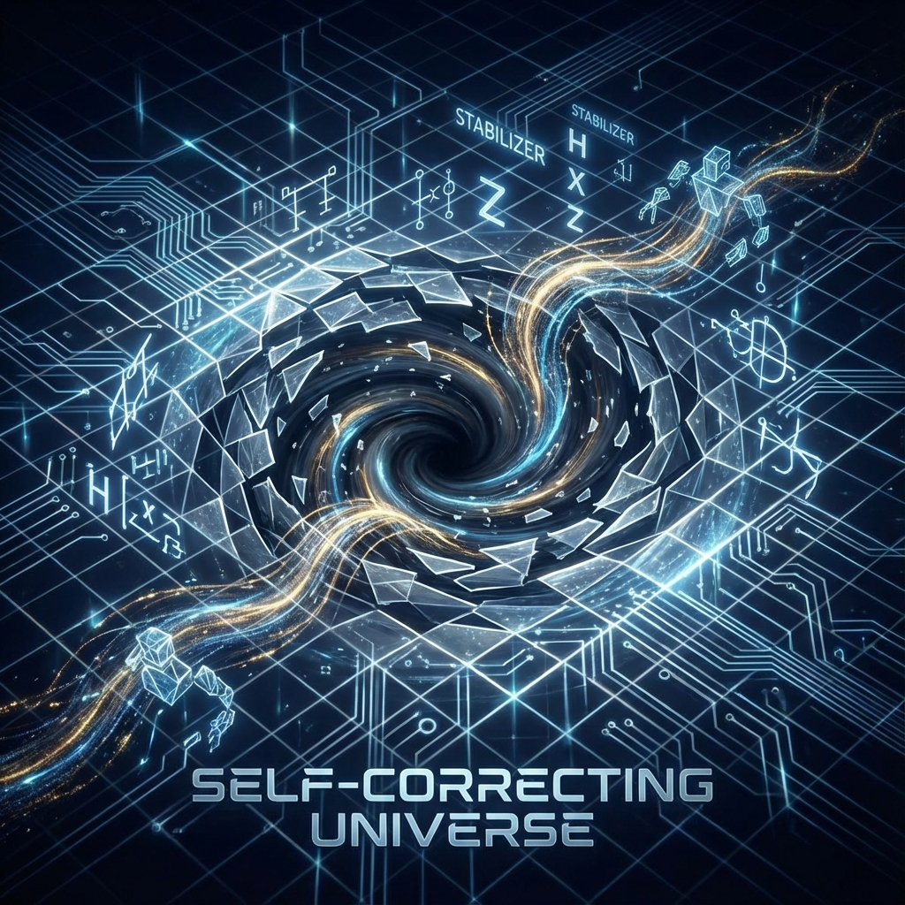

# Part II: Protocol — Quantum Error Correction

In Volume I, we wove the skeleton of the universe using tensor networks (MERA). We saw that space is not an empty stage, but a fractal tree stitched together by countless entanglement threads.

However, this brings a huge engineering vulnerability: **Fragility**.

If space were merely composed of microscopic quantum entanglement, then the inherent **"decoherence"** and **"noise"** of quantum mechanics should instantly destroy this structure. As long as one thread breaks, as long as one qubit flips incorrectly, the geometric structure of spacetime should collapse.

Yet our universe exhibits astonishing **Robustness**. Even when stars explode and black holes collide, spacetime remains smooth, stable, and indestructible.

Why? Because the universe is not just weaving; it is also **checking**.

This volume will reveal the hidden identity of physical laws: they are not tyrants ruling matter; they are a set of **Quantum Error Correction Protocols** running in the universe's underlying operating system. Spacetime is essentially an over-encoded code with self-repair capabilities.

