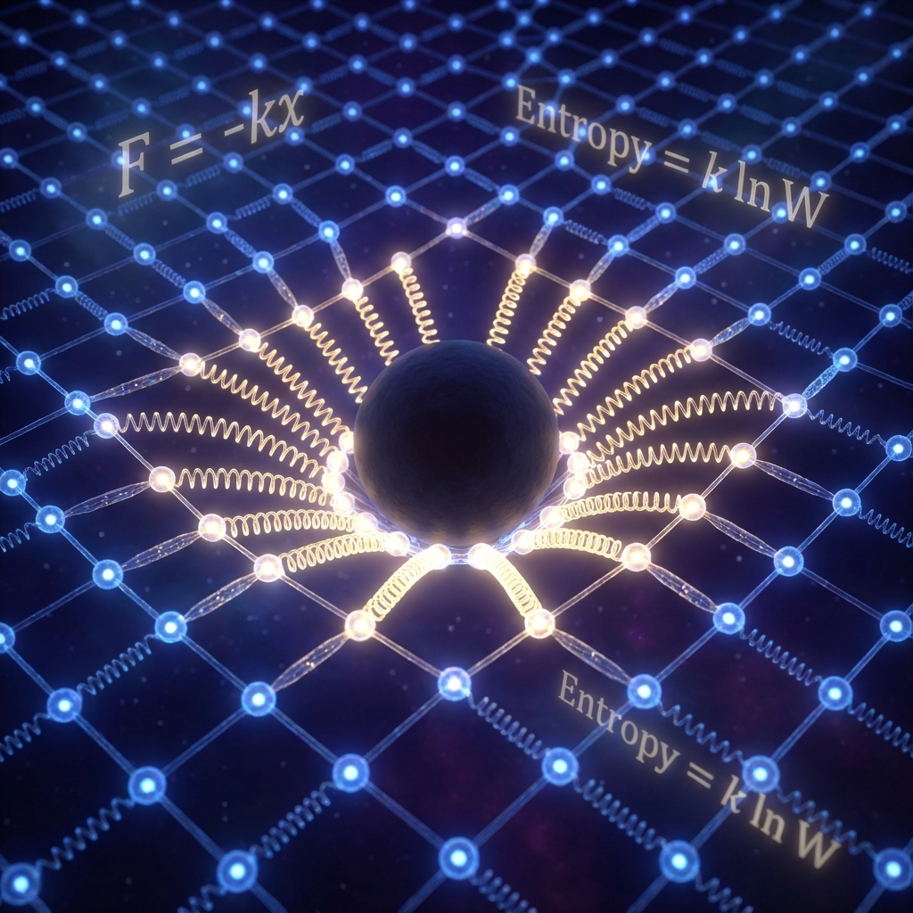

# 5.1 Hooke's Law of the Universe

> "Newton thought gravity was divine attraction; Einstein thought gravity was a geometric slide. But at the bottom layer of quantum information, gravity is neither divine nor smooth. It is rough, statistical, and full of elasticity. Just as stretching a rubber band feels a recoil force, when you try to pull apart two entangled objects, you are not fighting universal gravitation, but the 'Hooke's law' of the cosmic entanglement network."

## The Rubber Band Universe

Let us do the simplest physical experiment: stretch a rubber band.

You will feel a recoil force. Where does this force come from?

It is not the chemical bond tension between molecules (that is enthalpy); it is an **Entropic Force**.

* **Relaxed state**: Rubber molecular chains are coiled, maximum number of microscopic states (entropy).

* **Stretched state**: Molecular chains are straightened, order increases, number of microscopic states decreases (entropy decrease).

The second law of thermodynamics requires entropy to tend toward maximum, so the system produces a force trying to pull the rubber band back to the coiled high-entropy state.

$$F = T \frac{\Delta S}{\Delta x}$$

From the MERA tensor network perspective of **Vector Cosmology**, **spacetime is this rubber band.**

## The Tension of Entanglement

In Volume I, we defined: space is stitched by **Bell Pairs**.

Every entanglement pair is a tiny spring.

When you try to pull two objects apart (e.g., Earth and the Sun), what are you doing?

You are **stretching** the entanglement threads connecting them.

Or more accurately, you are **diluting** the quantum mutual information between them.

* **Distance increases** $\rightarrow$ **Entanglement decreases** $\rightarrow$ **Total system entropy decreases** (because correlation information is lost).

* **Universe's response**: To resist this entropy decrease, the spacetime network produces a reverse "restoring force," trying to pull these two objects back together to restore maximum entanglement entropy.

**This is universal gravitation.**

An apple falls to the ground, not because there is something pulling it beneath Earth.

But because there is enormous microscopic entanglement between the apple and Earth. They "want" to be together because the quantum state when together is more "chaotic" (higher entropy) and more natural than when apart.

## Erik Verlinde's Breakthrough

This viewpoint was first systematically proposed by physicist Erik Verlinde in 2010. He shocked the physics community: he did not need to assume the existence of gravity; using only the **holographic principle** and **thermodynamic formulas**, he derived Newton's law of universal gravitation $F = G \frac{mM}{r^2}$ and Einstein's field equations.

In our FS geometry, this derivation becomes more intuitive:

* **Mass ($M$)**: Is the **"information defect"** that destroys spacetime flatness. It occupies tensor network nodes.

* **Gravitational constant ($G$)**: Is the **"elastic modulus"** of the spacetime fabric. It measures the "hardness" of entanglement threads.

If $G$ is large, it means threads are soft, a little mass can cause huge bending (strong gravity).

If $G$ is small (reality), it means threads are extremely hard, spacetime is extremely difficult to deform.

## Conclusion: Gravity is a Statistical Illusion

This leads to a disturbing conclusion: **Gravity is not fundamental.**

Just as "air pressure" is not a fundamental property of molecules (you cannot say a single molecule has air pressure), gravity is not a fundamental property of particles.

**Gravity is the "statistical average" of the entanglement behavior of a large number of qubits.**

* At microscopic scales (Planck scale), gravity disappears. It is replaced by discrete logic gate exchanges.

* Only at macroscopic scales, when we view billions of entanglement threads as a continuum, does this "tension of entanglement" smoothly emerge as the "spacetime curvature" we perceive.

**We are "stuck" to Earth not because Earth is pulling us.**

**It is because our entanglement with Earth is too deep; the universe refuses to let us separate.**

Since gravity is the tension of information, when we pile too much information (mass) in spacetime, will this tension become so large that it collapses the network itself?

If we stuff extremely high **$v_{int}$** into an extremely small region, what will happen to the spacetime fabric?

This leads to the theme of the next section: **The Pressure of Information**. We will see that black holes are not only the limit of gravity, but also the limit of **"information congestion"**. Spacetime curvature is essentially a geometric compromise made by the universe to alleviate "bandwidth congestion."

