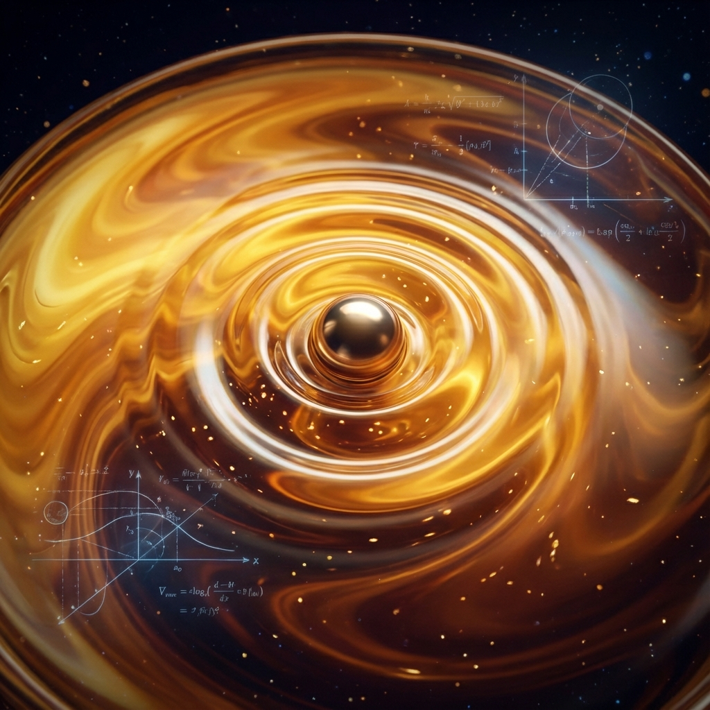

# 6.2 粘滞系数：$\hbar$ 的阻尼 (The Viscosity Coefficient: The Damping of $\hbar$)

> "如果宇宙是流动的，为什么它没有像水一样乱溅？因为在这个流体中，存在着一个极其微小的、但绝对不可忽略的摩擦力。这个摩擦力阻止了时空的湍流，保证了因果律的平滑。这个摩擦力的名字，叫做普朗克常数。"

在上一节中，我们将时空重构为一种 **量子超流体**。但这带来了一个危险的问题：如果时空是完美的流体（零粘滞），那么任何微小的扰动都会无限传播，导致整个宇宙陷入混乱的湍流。

为了让宇宙保持稳定，这个流体必须有一点点 **"粘"**。

它必须能够耗散掉多余的动能，将剧烈的震荡平复下来。

本节将揭示 **普朗克常数 $\hbar$** 的流体力学身份。它不仅仅是量子的最小作用量，它是时空织物的 **粘滞系数 (Viscosity Coefficient)**。它是宇宙为了防止信息处理过载而设定的 **阻尼**。

## 完美流体与 KSS 界限

在 2005 年，物理学家 Kovtun, Son 和 Starinets 发现了一个震惊物理学界的定律：**KSS 界限 (KSS Bound)**。

他们利用 AdS/CFT 对偶证明，对于任何由量子场论描述的流体，其 **剪切粘滞系数 ($\eta$)** 与 **熵密度 ($s$)** 的比值，都有一个理论下限：

$$\frac{\eta}{s} \ge \frac{\hbar}{4\pi k_B}$$

这意味着：**宇宙中不存在"零粘滞"的完美流体。**

即使是夸克-胶子等离子体（宇宙大爆炸初期的汤），或者是黑洞视界的膜，都必须遵守这个最小粘滞度。

* **$\hbar$ (普朗克常数)**：出现在分母上。它决定了这个比率的量子基准。

* **物理意义**：$\hbar$ 代表了 **"量子摩擦"**。

每当两个纠缠的量子比特交换信息时，它们都会产生微小的"摩擦热"。这种微观的摩擦，在宏观上涌现为时空的粘滞性。

## 阻尼：防止几何崩溃

为什么宇宙需要这个阻尼？

试想一下，如果 $\hbar \to 0$（经典极限），那么 $\eta \to 0$。时空变成无粘流体。

* **后果 1：湍流灾难**。引力波将不会衰减，它们会在宇宙中反复回荡，叠加成无限大的振幅，撕裂所有的星系。

* **后果 2：信息过载**。如果没有粘滞，信息的扩散速度将不受控制。局部区域的信息密度会瞬间爆炸，导致黑洞视界表面出现 **"裸奇点"**。

**$\hbar$ 是宇宙的减震器。**

它限制了时空流体变形的速率。

当你挥动手臂时，你不仅是在推开空气，你是在推开时空以太。$\hbar$ 提供的微小阻力，确保了时空网络在变形后能平滑地 **回弹**，而不是破碎。

这就是为什么量子力学虽然看起来让世界变得模糊（不确定性原理），但实际上它让世界变得 **稳定**。

**不确定性 = 弹性缓冲。**

## 全息投影的像素模糊

在全息原理的视角下，这种粘滞性还有另一个解释：**分辨率的极限**。

如果时空是全息投影，那么 $\hbar$ 就定义了投影的 **"最小像素大小"**。

* 粘滞性意味着你不能在比 $\hbar$ 更小的尺度上精确定义流体的速度梯度。

* 这就像你在 Photoshop 里放大一张图片，最终会看到马赛克。

**时空的粘滞，就是全息图像的"像素模糊"。**

正是这种模糊，防止了我们在无限小的尺度上看到那些疯狂的、不合逻辑的 QCA 底层跳变。它平滑了微观的棱角，给了我们一个连续、温和的宏观世界。

## 结论：宇宙是一碗浓汤

至此，我们的宇宙图景再次升级。

我们不是生活在虚空中，我们生活在一碗 **"普朗克浓汤"** 里。

* **引力** 是压强。

* **光速** 是声速。

* **普朗克常数** 是稠度。

这个流体模型完美地统一了量子力学与广义相对论：**量子力学提供了流体的原子（纠缠比特），而广义相对论描述了流体的宏观流动。**

但是，流体力学有一个最可怕的预言：**激波 (Shockwave)**。

当流体的速度超过声速，或者压强超过极限时，流体的连续性会中断，产生 **断裂**。

在时空流体中，这种断裂是什么？

是 **奇点 (Singularity)**。

是 **黑洞内部**。

这引出了第四卷的主题：**断裂**。我们将探讨，当网络流量超过了 $c_{FS}$ 的承载极限，当时空织物被撕开一个口子时，物理定律是如何在那个"伤口"处崩溃的。

