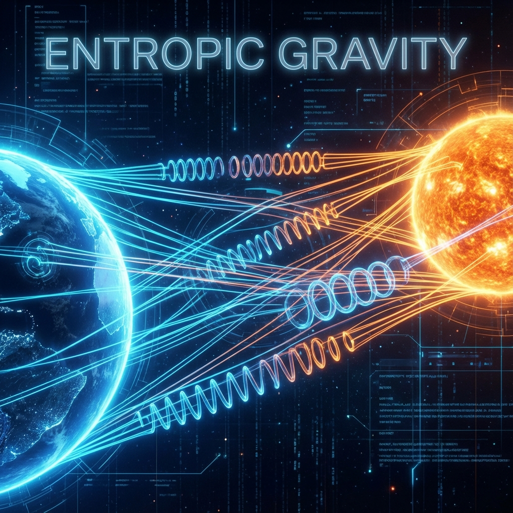

# Part III: Tension — The Thermodynamics of Gravity

In the first two volumes, we wove the skeleton of space (tensor networks) and verified its solidity (quantum error correction). Now, we must apply **force** to this static geometric structure.

When we throw a huge mass (such as a star) into this net woven from entanglement threads, what happens?

The net will sag. The threads will be pulled tight.

A **"Tension"** trying to restore the original state will propagate through the network.

This tension, in macroscopic physics, has a resounding name—**Gravity**.

This volume will subvert our traditional understanding of gravity. We will prove that gravity is not a fundamental interaction force; it does not need to exchange "gravitons." Gravity is the **"elastic recoil"** produced when the spacetime fabric is subjected to **information pressure**. It is a **thermodynamic response** made by the universe to maintain maximum entanglement entropy.

