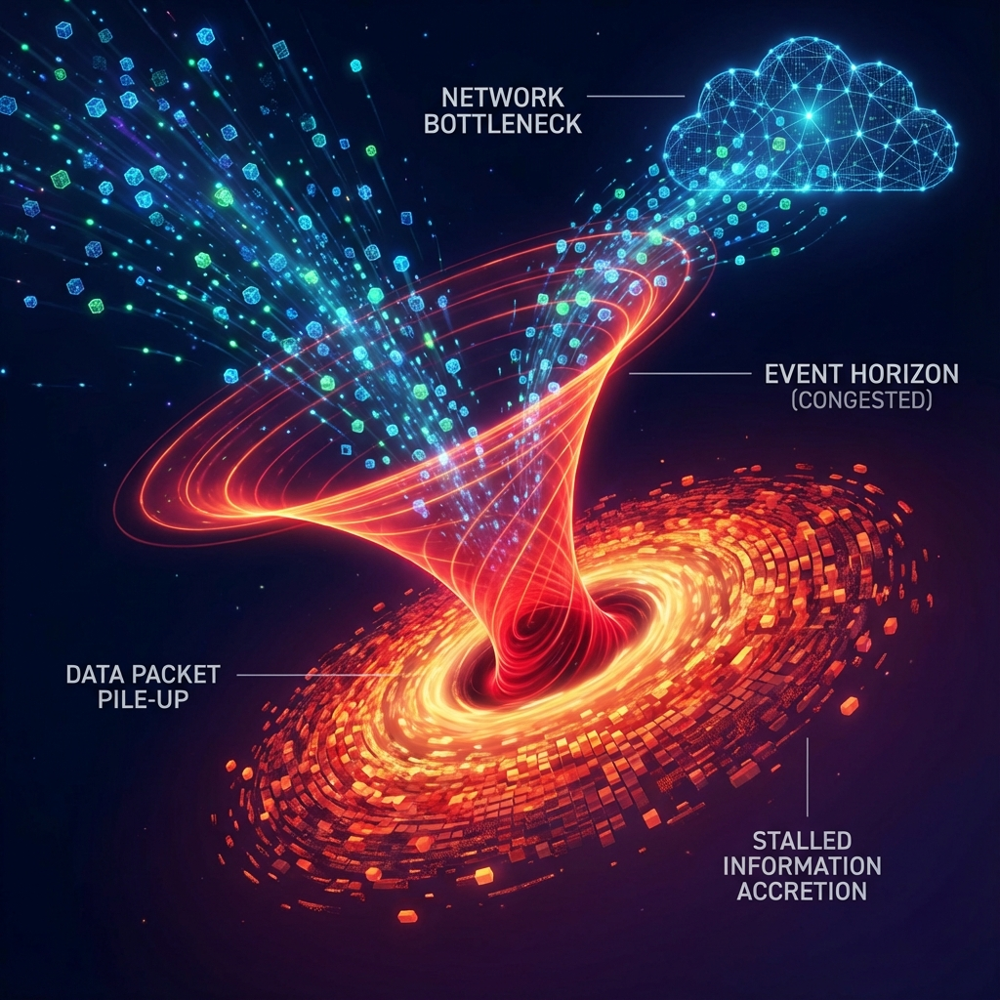

# 7.1 The Network Bottleneck

> "You think black holes are abysses that devour everything, but in the eyes of information theory, a black hole is just a blocked router. When the input data stream exceeds the carrying capacity of the output cable, the data does not disappear; they are just piled up at the firewall gate. The horizon is not a physical wall; it is the queuing line of information."

## The Geometric Limit of Flow

In computer network theory, there is a famous **Max-Flow Min-Cut Theorem**.

It states: In a network, the maximum information flow from source to sink is determined by the capacity of the **"narrowest"** cross-section (minimum cut) in the network.

In the MERA tensor network of **Vector Cosmology**, this theorem directly derives the physical essence of the **Event Horizon**.

* **Source**: High-density matter inside the black hole (extremely high $v_{int}$).

* **Sink**: External flat spacetime (observer).

* **Connection**: Entanglement threads crossing the horizon.

When matter collapses into a black hole, its internal information density (entropy) attempts to radiate outward.

However, the number of entanglement channels connecting the interior and exterior (i.e., the **area** of the horizon) is finite.

Each entanglement thread (Planck area) can only carry 1 bit of information flow ($c_{FS}$).

When the internal information $S_{in}$ far exceeds the transmission capacity of the surface $A_{horizon}$, **"network congestion"** occurs.

Information flow gets stuck.

**The horizon is the "minimum cut" in the spacetime network.**

## Frozen Waterfall

This explains why, for external observers, objects falling into a black hole seem to stop forever at the horizon.

This is not just general relativistic time dilation; this is **information queuing**.

Imagine a gateway that can only process 10 data packets per second suddenly flooded with 10 billion data packets.

The system will not just slow down; it will **"freeze"**.

Those data packets (matter) are frozen in the buffer, waiting to be slowly processed (Hawking radiation).

**Black holes are the "high-latency zones" of the universe.**

They are not holes; they are **extremely dense, extremely slow-processing storage hard drives**.

The so-called "falling in" is actually your wave function being **"Suspended"** at the bottleneck of the horizon.

This raises an interesting corollary: If information does not really fall in but is stuck at the surface, what is actually inside the black hole?

Is it empty? Or is it filled with some computational process we cannot understand?

This leads to the theme of the next section: **Complex Complexity**. We will see that black holes are not only storage devices; they are also the most efficient **"Fast Scramblers"** in the universe.

