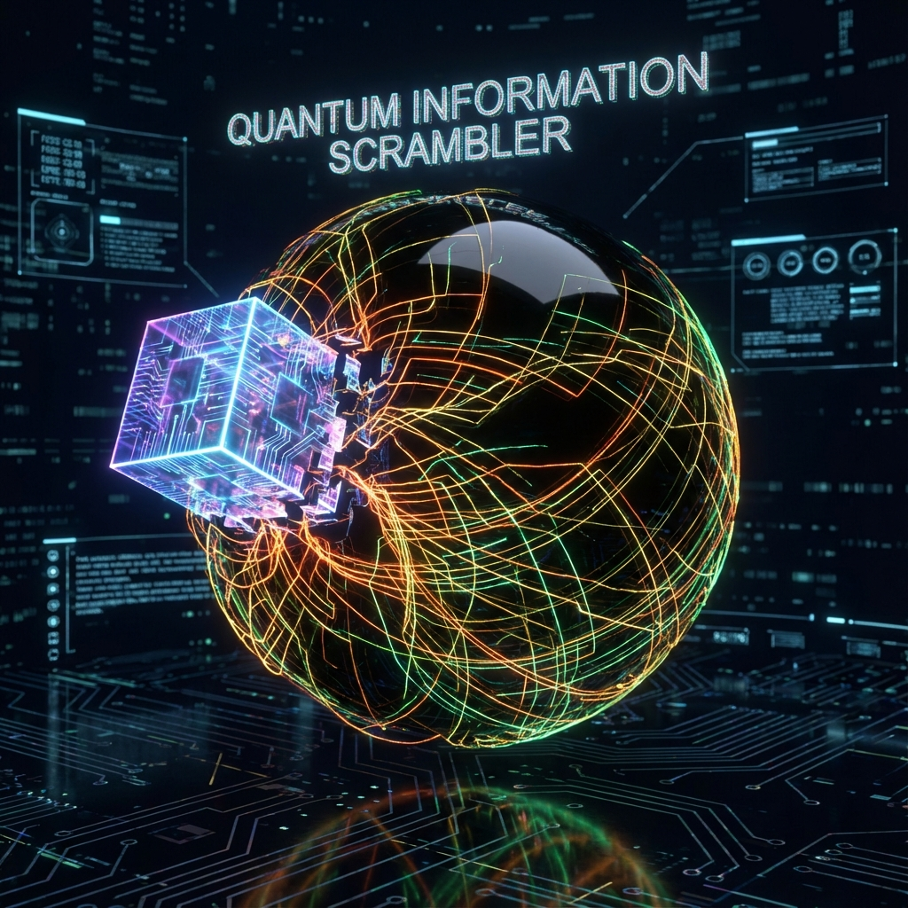

# 7.2 Complex Complexity: The Fast Scrambler

> "If you throw a book into a black hole, does the book's content disappear? No. It is torn apart, stirred, encrypted, turned into a string of completely random gibberish. But this gibberish contains every word of that book. Black holes are the most efficient paper shredders in the universe, and also the safest encryption locks. They do not destroy information; they just 'deeply fold' information."

In the previous section, we defined the black hole horizon as a "bottleneck" of network flow. When information flow (matter) gets stuck at this bottleneck, it is not stationary. Instead, to accommodate continuously incoming data on a limited surface area, the system must perform extreme **compression and reorganization** of this data.

This section will reveal another aspect of black holes as **quantum computers**. They not only store information; they are also frantically processing information. Physicists discovered that black holes are **"Fast Scramblers"** existing in nature.

## Extreme Encryption of Information

Since information is stuck at the horizon, what are they doing?

They are undergoing **Scrambling**.

In quantum information theory, scrambling refers to rapidly diffusing local quantum information into the many-body entanglement of the entire system.

Physicists (such as Patrick Hayden and John Preskill) proved that black holes are the systems with the **fastest information mixing speed** in the universe. They can "smear" the information of a falling particle onto the entire horizon in **logarithmic time** ($t \sim \log N$).

* **Before throwing in**: Information is local (this book is here).

* **After throwing in**: Information is non-local (every word of this book is diffused to every Planck pixel on the entire black hole surface).

In **FS geometry**, this is the **holographicization of $v_{int}$**.

Black holes break the "internal structure" of matter and transform it into **"global entanglement patterns"** on the horizon.

For external macroscopic observers, this looks like completely random **Hawking Radiation**, just as encrypted ciphertext looks like gibberish.

But for observers who master the entanglement key (such as the creator or higher-dimensional entities), this is a **highly compressed and interconnected encrypted file**.

## Interior Volume: Steps of Computation

This solves a geometric puzzle in general relativity: **How large is the black hole interior?**

From outside, the black hole size is fixed (horizon radius $R_s$ unchanged if mass is constant).

But from inside, general relativity predicts that the interior space of a black hole (Einstein-Rosen bridge) will **infinitely stretch** with time.

It is like a box that looks only the size of a suitcase from outside, but contains an infinitely long corridor inside.

To explain this paradox, Leonard Susskind proposed the famous **"Complexity = Volume (CV)"** conjecture.

From the tensor network perspective of **Vector Cosmology**, this conjecture gains physical intuition:

* **Horizon (surface)**: Represents the **current state** ($|\psi(t)\rangle$).

* **Interior (volume)**: Represents the **"computation steps" (Computational Complexity)** run to reach the current state.

The quantum circuit on the black hole horizon keeps running (continuously scrambling). Even when the black hole is in thermal equilibrium, the **"complexity"** of its quantum state still grows linearly with time (because it keeps exploring new corners of Hilbert space).

To store these continuously growing "historical computation records" or "logic gate operation sequences," the black hole's **interior volume** must continuously expand.

**Conclusion:**

The black hole interior is not a destructive abyss.

It is a **madly growing computational universe**.

It uses the intercepted $c_{FS}$ budget to construct an extremely deep **Inner Space** composed of pure logic gates stacked inside the horizon.

## The Geometrization of Time

This model directly transforms **time** into **spatial volume**.

The continuously growing space inside a black hole is actually **"frozen time"**.

Every cubic meter of interior volume corresponds to billions of quantum operations run on the horizon surface.

When we say "falling into a black hole," we are actually falling into the universe's **"historical archive"**.

The space we see there is not for living; it is for **storing computation processes**.

Since a black hole is a huge computational node, what happens if someone tries to read data from outside (collecting Hawking radiation) while simultaneously jumping in to read data (direct measurement)?

According to the **no-cloning principle** of quantum mechanics, information cannot be copied.

This will cause a fatal conflict in cosmic logic.

This leads to the theme of the next chapter: **The Firewall Paradox**. We will see that when the spacetime network faces logical contradictions, it will not hesitate to **"disconnect"**, raising a **high-energy firewall** at the horizon that burns everything.
