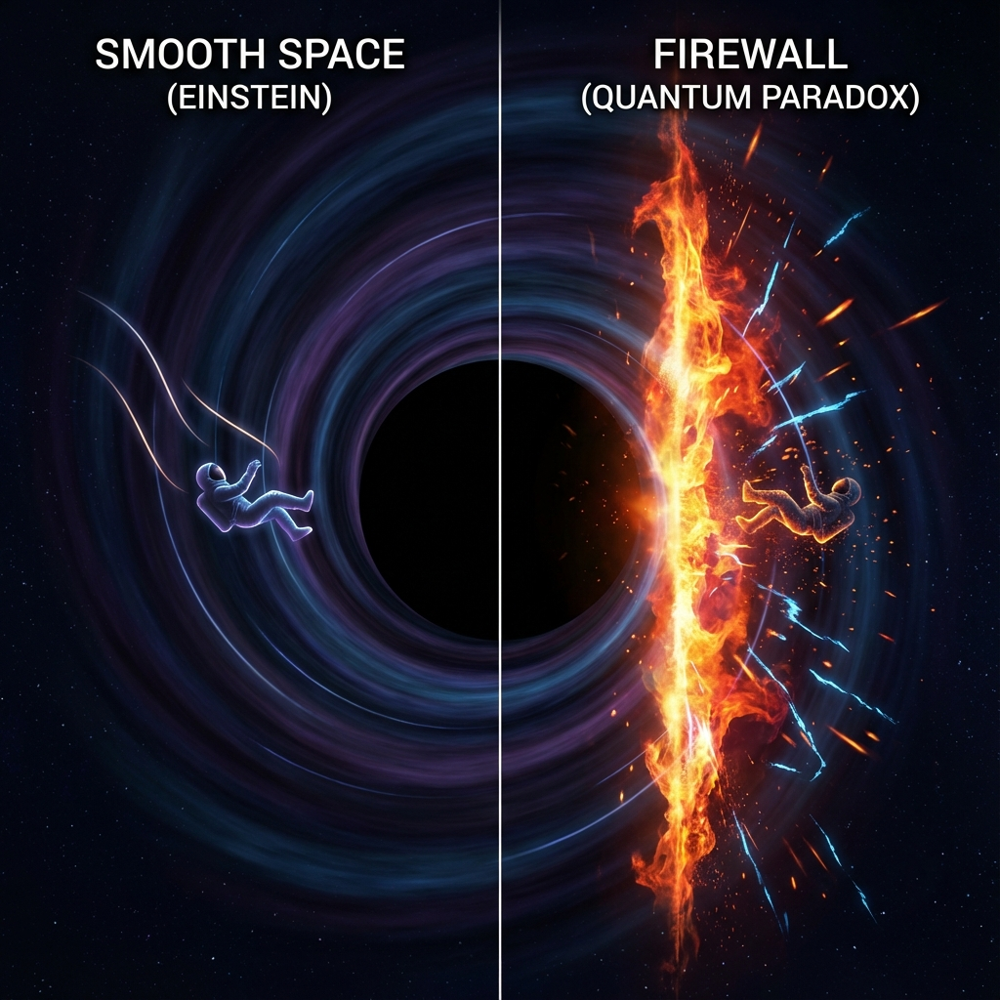

# 8.1 纠缠的单配性 (The Monogamy of Entanglement)

> "在人类的伦理中，重婚是法律问题；但在量子的伦理中，重婚是物理不可能。一个量子比特不能同时与两个以上的系统保持完全的纠缠。当黑洞试图脚踏两只船——既想维持内部的平滑，又想维持外部的守恒——时空织物发出了撕裂的尖叫。"

## 爱情的量子排他律

在量子信息理论中，有一条铁律叫做 **纠缠的单配性 (Monogamy of Entanglement)**。

它指出：**如果量子系统 A 与系统 B 处于最大纠缠态，那么 A 就不能与任何其他系统 C 发生纠缠。**

$$E(A:B) + E(A:C) \le 1$$

* 如果 $E(A:B) = 1$，则 $E(A:C)$ 必须为 **0**。

* 你不能把全部的爱给了一个人，同时又把全部的爱给另一个人。量子力学禁止这种"完美出轨"。

在平坦时空中，这没什么问题。但在黑洞视界上，这成了毁灭性的灾难。

## 黑洞的三体困境

让我们看看位于黑洞视界上的一个光子模式 **B**（Late Radiation，晚期辐射）。它陷入了一场绝望的三角关系：

1. **关系一：为了平滑 (General Relativity)**

   根据爱因斯坦的**等效原理**，视界必须是平滑的（没有墙）。自由落体的观察者不应感到任何特殊。

   这意味着，视界上的光子 **B** 必须与视界内部的模式 **A**（Interior）保持 **最大纠缠**。

   只有这样，穿越视界才像是穿越平滑的真空，而不是撞墙。

   **要求：** $E(B:A) = 1$。

2. **关系二：为了守恒 (Quantum Mechanics)**

   根据霍金辐射的**幺正性**，黑洞辐射必须携带黑洞的所有信息。这意味着，晚期辐射出来的光子 **B**，必须与很早以前辐射出去的光子云 **C**（Early Radiation）存在 **强纠缠**。

   只有这样，信息才能从黑洞里被"传输"出来，而不是消失。

   **要求：** $E(B:C) = 1$。

## 撕裂的必然

现在，矛盾爆发了。

* 广义相对论要求：**B 必须嫁给 A**（为了空间平滑）。

* 量子力学要求：**B 必须嫁给 C**（为了信息守恒）。

但单配性原理尖叫道：**不行！你不能同时和两个人结婚！**

黑洞必须做出选择。

如果它选择了 **C**（保持量子力学的幺正性，这是 **《矢量宇宙论》** 的底线），那么它必须 **切断** 与 **A** 的联系。

$$E(B:A) \to 0$$

切断纠缠意味着什么？

我们在第一卷中说过：**纠缠是缝合空间的线**。

如果连接视界内外（B与A）的线被切断了，**空间就断裂了**。

## 火墙的升起

当空间断裂时，原本应该平滑过渡的视界，变成了一个 **物理上的断层**。

穿越这个断层的能量密度不再是零，而是 **无穷大**。

这就是 **火墙 (Firewall)**。

它不是普通的火，它是由高能光子构成的 **量子激波**。

任何试图掉进黑洞的东西，在这个断裂面上都不会平滑地滑入内部，而是会在瞬间被这堵高能粒子墙 **烧成灰烬**。

**结论：**

黑洞内部可能根本不存在。或者说，对于外部观察者而言，时空在视界处 **终结** 了。

那里没有路。那里只有一堵由逻辑悖论点燃的、温度高达普朗克能级的 **"纠错之火"**。

既然纠缠的断裂会导致火墙，那么宇宙有没有办法避免这种灾难？是否存在某种更高维度的几何通道，能够绕过单配性的限制，让 B 既能连着 A，又能连着 C？

这引出了下一节的主题：**时空的终结**。我们将看到，火墙不仅是物理现象，它标志着经典时空概念在量子极限下的彻底失效。

