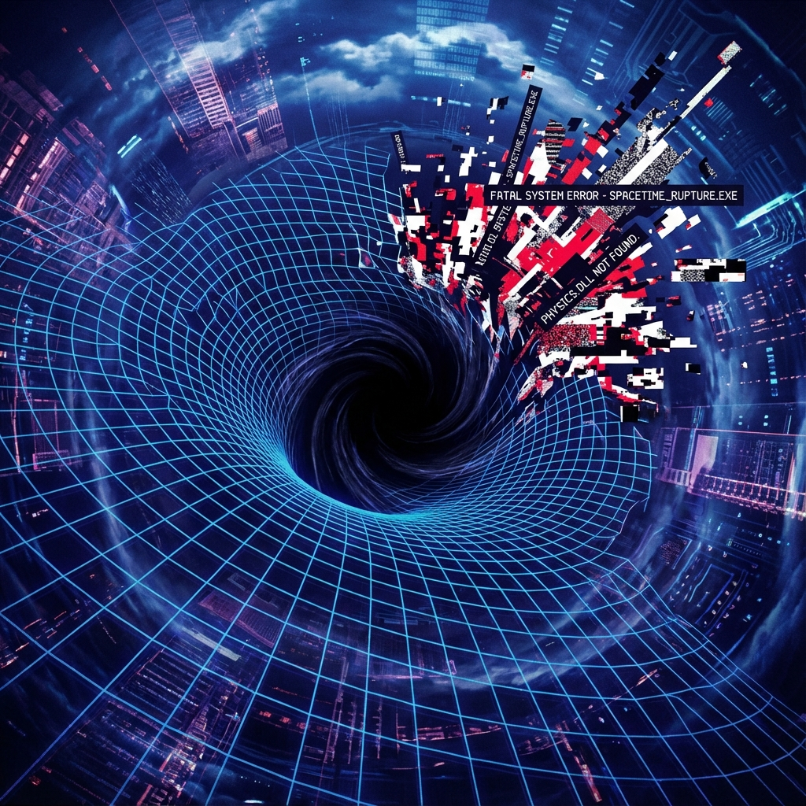

# Part IV: Rupture — Singularities and Firewalls

In the first three volumes, we depicted a spacetime woven from tensor networks, protected by error-correcting codes, and manifesting as a quantum superfluid. This sounds like a perfect, self-repairing system.

However, any physical material has its **Yield Strength**. Any network has its **Max Bandwidth**.

What happens when we stuff information (mass) exceeding the carrying limit of the spacetime fabric into an extremely small region?

The network will **congest**. Connections will **saturate**. Eventually, spacetime itself will **Rupture**.

This rupture is called a **Black Hole** in macroscopic physics.

This volume will reveal that black holes are not monsters; they are **traffic control valves** of the cosmic network. And that fearsome singularity is the **"blue screen of death"** thrown by physical laws when encountering uncomputable logical errors.

