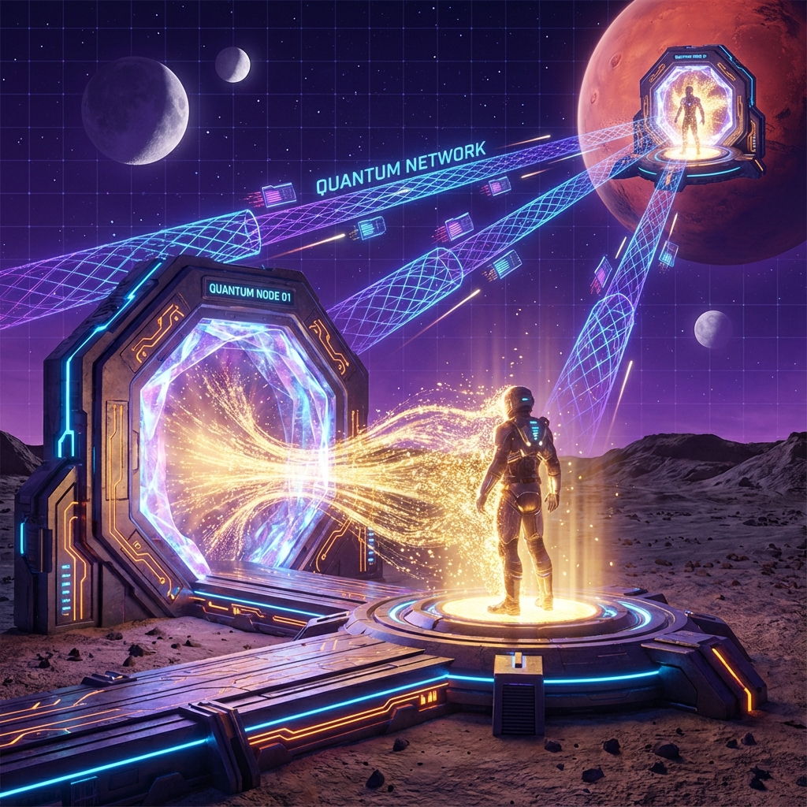

# 10.1 The Macroscopization of Quantum Teleportation

> "Why accelerate a spaceship weighing thousands of tons to light speed? That is an enormous waste of energy. What really matters is not the atoms of the spaceship, but the arrangement of atoms—that is, information. If you can extract the information of a spaceship, you don't need to transport it; you just need to 'print' it at the destination. The universe is not a logistics company; the universe is a fax machine."

## Abandoning $v_{ext}$, Embracing $v_{int}$

In traditional astronautics, we are obsessed with **$v_{ext}$ (external velocity)**. We build rockets and engines, trying to push matter lumps as fast as possible.

But this faces the iron wall of relativity: the larger the mass, the harder to accelerate, and it can never reach light speed.

**Quantum teleportation** provides a completely different approach:

Abandon moving matter ($v_{ext}$), and instead move **structure ($v_{int}$)**.

* **Principle**: According to quantum mechanics, all physical properties of a particle (spin, polarization, energy state) can be completely extracted and transferred to another particle, as long as they share **entanglement**.

* **Operation**:

    1. **Entanglement resource**: Establish a pair of shared Bell-state particles between Earth (A) and Mars (B).

    2. **Bell measurement**: At A, perform joint measurement on the particle to be teleported and the entangled particle.

    3. **Collapse and transmission**: The particle at A instantly collapses (original destroyed). Measurement results (classical two-bit information) are sent to B via radio.

    4. **Unitary reconstruction**: After B receives the information, perform corresponding rotation operations on the entangled particle here. A miracle happens: the particle at B instantly becomes the particle that was originally at A.

**Note:** No matter has traveled the distance from Earth to Mars.

The "blank paper" (original particle) originally at B is written with "ink" (quantum state) from A.

Geometrically, this is equivalent to A and B undergoing **"topological coincidence"** in Hilbert space.

## The Challenge of Macroscopization: The Avalanche of Information

This protocol has been experimentally successful for single photons. But to teleport a person or a spaceship, we need **macroscopization**.

A person contains approximately $10^{28}$ atoms. Each atom has a quantum state.

To teleport a person, we need:

1. **Prepare $10^{28}$ pairs of entangled particles**: This requires enormous quantum memory.

2. **Perform $10^{28}$ Bell measurements**: This requires extremely high-precision scanners.

3. **Transmit $2 \times 10^{28}$ bits of classical information**: This requires extremely high bandwidth.

This sounds difficult, but it is a **"linear problem"**, not a physical **"exponential problem"**.

As $c(\tau)$ (light speed/computational power) grows exponentially, bandwidth and storage will eventually not be problems.

For Type III civilizations, scanning a person's data volume is as simple as scanning a QR code for us now.

## Cut and Paste: The Cost of No-Cloning

The greatest ethical and ontological impact of macroscopic teleportation comes from the **No-Cloning Theorem**.

Quantum mechanics forbids perfect copying. This means that to complete teleportation, **the original must be destroyed**.

* At the moment of scanning, the measurement operation destroys the quantum states of all atoms in your body.

* You on Earth **"evaporate"** in this process, becoming a pile of chaotic hot gas.

* And you on Mars, at the same instant, **"reconstruct"** using the received data.

**Is this travel, or suicide followed by rebirth?**

From the perspective of **Vector Cosmology**, because **"memory is ontology"**, as long as the geometric structure of $v_{int}$ (consciousness/memory/personality) is transferred losslessly, this is **the same you**.

* **Material carrier** (carbon atoms) is just consumables.

* **Topological structure** (wave function) is the soul.

You did not die; you just changed decks, but played the same straight flush.

## Conclusion: Distance is "Formatted"

When macroscopic teleportation becomes everyday technology, the **topological structure** of the universe is completely changed.

Space is no longer an obstacle.

* As long as you pre-deploy an **"entanglement receiving station"** (equivalent to a 3D printer) at the target location (e.g., Alpha Centauri), you can go there anytime.

* Interstellar travel becomes **"data upload"**.

* Distance $d$ no longer corresponds to time $t = d/v$, but to **bandwidth latency**.

**This is "topological short-circuiting."**

We no longer laboriously crawl across the surface of the spacetime fabric (following geodesics).

We directly use entanglement threads to tie a knot on the back of the fabric, **pinching** the starting point and endpoint together.

Since we can already teleport matter and consciousness through entanglement, what if we encounter the most extreme obstacles in the universe during transmission—such as black hole horizons or so-called "firewalls"? Can this transmission still proceed?

Can we use this technology to ignore the one-way nature of horizons and directly jump into black hole interiors, even pass through them?

This leads to the theme of the next section: **Traversing Firewalls**. We will see how quantum error-correcting codes act as an "invisibility cloak," protecting information security through spacetime fracture zones.

