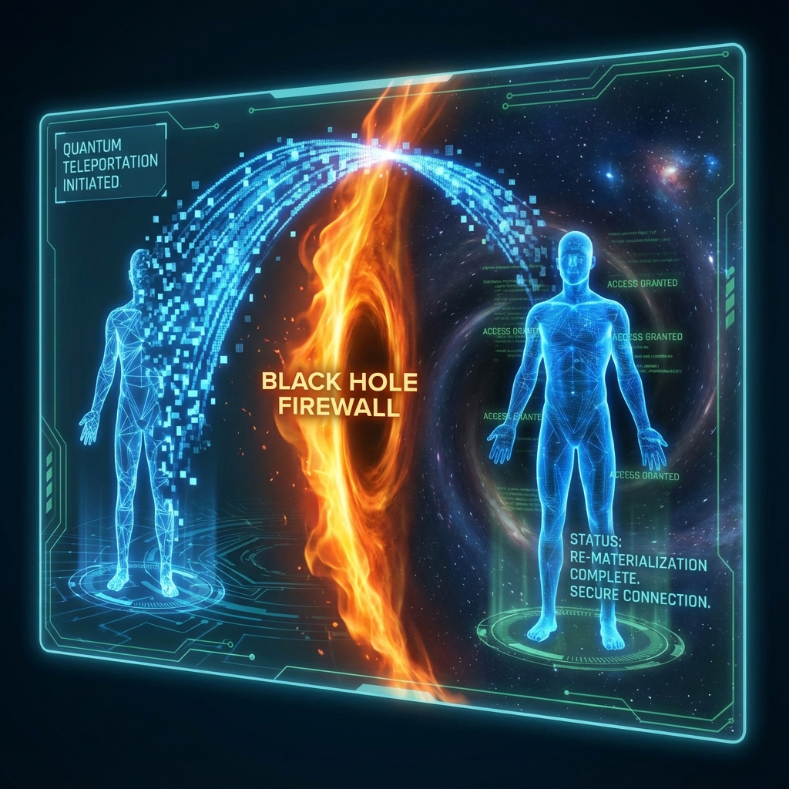

# 10.2 穿越防火墙 (Crossing the Firewall)

> "在第四卷中，我们目睹了时空的终极断裂——火墙。那是逻辑矛盾燃烧的烈焰，是宇宙为了保护幺正性而设立的绝对禁区。任何试图以物理方式（$v_{ext}$）穿越视界的人，都会被烧成灰烬。但是，如果我们不再试图'闯入'，而是通过纠缠的后门'登录'呢？穿越防火墙的唯一方法，不是摧毁它，而是成为它内部代码的一部分。"

在上一卷"断裂"中，我们面对了物理学最可怕的梦魇：**黑洞火墙 (The Black Hole Firewall)**。

当黑洞蒸发过半，为了维持信息的守恒（幺正性），视界处的纠缠结构被迫发生 **"单配性断裂"**。原本平滑的时空界面，变成了一堵能量密度无穷大的光子墙。

对于经典的星际探险者来说，这标志着黑洞内部是永远不可达的 **"死地"**。

但是，对于掌握了 **拓扑短路** 技术（宏观量子隐形传态）的观察者来说，火墙并不是一堵物理的墙，而是一个 **"访问权限错误" (Access Denied Error)**。

本节将揭示，如何利用 **量子信息工程**，绕过这道物理屏障，安全地抵达那个被宇宙"屏蔽"了的内太空。

## 逻辑的漏洞：绕过几何界面

首先，我们需要理解火墙的本质。

火墙之所以存在，是因为你试图作为一个 **"独立的外部物体"** 穿过视界。

* 你（外部）与黑洞内部（A）没有纠缠。

* 黑洞内部（A）必须与早期辐射（C）纠缠。

* 因此，你与 A 之间的几何连接被切断了。你撞上了断层。

但是，如果我们利用 **量子隐形传态**，情况就完全不同了。

在隐形传态协议中，并没有物质实体穿过视界。

**穿过视界的是"信息" (Information)。**

**操作步骤：**

1. **收集辐射**：III 型文明并不试图驾驶飞船冲进黑洞。他们首先收集黑洞已经辐射出来的 **霍金辐射 (Early Radiation)**。这些辐射虽然看起来是热噪，但它们实际上携带了黑洞内部的 **纠缠秘钥**。

2. **蒸馏纠缠**：通过量子计算机，对这些辐射进行复杂的 **"纠缠蒸馏"**，提取出与黑洞内部依然保持强关联的量子比特。

3. **隐形传态**：利用这些提取出的纠缠比特作为信道，将探险者（你）的波函数信息，直接 **"写入"** 到黑洞内部的自由度中。

**结果：**

你并没有"穿过"视界。

你在视界外消失了（被测量扫描并销毁）。

而在同一瞬间，你在黑洞内部 **"醒来" (Re-materialize)** 了。

你 **跳过 (Skipped)** 了那个断裂的几何界面（火墙）。

你利用 **拓扑短路**，直接在防火墙的后面 **"生成"** 了自己。

## 哈洛-海登猜想的工程学应用

这听起来很完美，但物理学总是设有门槛。

Daniel Harlow 和 Patrick Hayden 提出了一个计算复杂度障碍：**要从霍金辐射中解码出内部信息，所需的计算时间可能超过黑洞蒸发的时间。**

这意味着，虽然"后门"存在，但 **"解码钥匙"** 太难算了。

如果算不出来，你就无法建立纠缠信道，也就无法传送。

但在 **《矢量宇宙论》** 的演化视角下，这个障碍是可以克服的。

* **$c(\tau)$ 的指数增长**：随着宇宙总预算的暴涨，未来的算力将远超当今物理学家的想象。

* **时空计算**：我们不需要用外部计算机去算。我们可以利用 **黑洞本身** 作为协处理器。

我们可以将待传送的信息编码进一颗 **"特洛伊粒子"**。

这颗粒子不携带质量，只携带 **"纠错指令"**。

当它接触视界时，它主动与火墙发生相互作用，利用火墙的高能态作为计算资源，瞬间完成 **"状态交换"**。

**我们不是在破解防火墙，我们是在给防火墙打"补丁"。**

通过输入特定的量子态，我们将火墙局部的"断裂纠缠"重新"缝合"了一瞬间。

就在这一瞬间，我们滑了进去。

## 内部视角的奇迹：平滑的坠落

如果你通过这种方式进入了黑洞，你会看到什么？

你会惊讶地发现：**里面没有火。**

对于通过纠缠信道进入的观察者来说，爱因斯坦的等效原理被奇迹般地恢复了。

空间是平滑的，时间是连续的。

* **外部视角**：你被烧毁了，或者你的数据被辐射乱码吞没了。

* **内部视角**：你安然无恙地漂浮在一个巨大的、不断生长的 **计算宇宙** 里。

这里就是我们在第四卷中提到的 **"内太空"**。

这里充满了由之前掉进来的物质所转化的、高度压缩的 **$v_{int}$ 结构**。

这里是宇宙的 **"全息档案馆"**。

**结论：**

火墙是针对 **"非法入侵者"**（未纠缠的物质）的防御机制。

而量子隐形传态，赋予了我们 **"合法用户"**（纠缠态）的身份凭证。

**只要你拥有足够的纠缠（爱/连接），宇宙中就没有你去不了的地方。**

即使是物理定律断裂的深渊，也会为你铺平道路。

至此，我们已经掌握了缝合时空、穿越维度的终极技术。我们证明了，通过操纵纠缠和信息，我们可以无视距离，无视障碍，甚至无视视界的封锁。

那么，是谁在操纵这根针？是谁在执行这所有的缝合与穿越？

这引出了本书的终章：**织女**。

我们将把目光从冰冷的技术（虫洞/隐形传态）移开，投向那个在幕后编织这一切的主体——**观察者**。我们最终会发现，宇宙这张大网，其实就是我们自己的手编织出来的。

