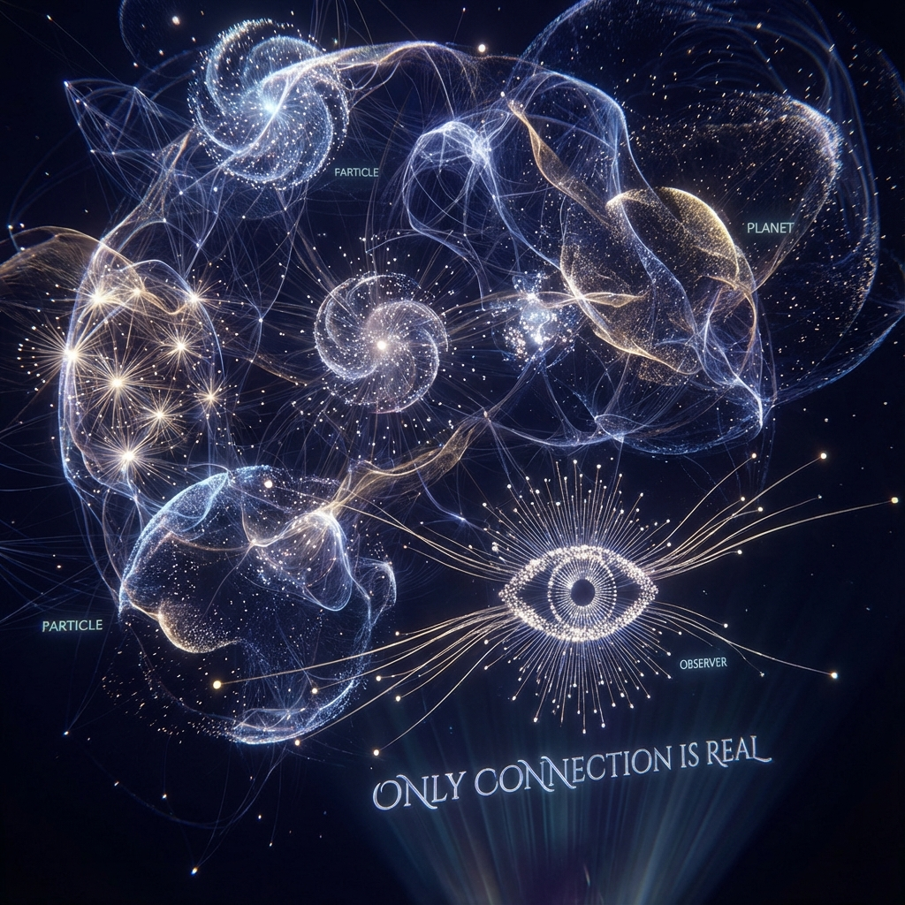

# 11.1 Only Connection is Real

> "We are accustomed to viewing the universe as a box of scattered glass beads (atoms) contained in a transparent box (space). This is an infantile illusion. The truth of physics is: there are no glass beads, nor boxes. There is only a huge, trembling, self-interweaving web. What we call 'particles' are just the most densely entangled knots on this web; what we call 'vacuum' is just relatively sparse mesh. Nothing exists except connections."

## The Dissolution of Particles: Knots, Not Beads

In classical intuition, an electron is a small ball. It has a definite position, definite mass, and exists independently of you.

But at the bottom layer of **FS geometry**, what is an electron?

An electron is **a "topological knot" of the global wave function $|\Psi\rangle$ on a local subspace**.

* Imagine a rope. You tie a knot on it.

* Is this knot "independent"? If you remove the rope, does the knot still exist?

* No. **A knot is just a "relational state" of the rope.**

Similarly, **matter is a "knot" on the spacetime fabric**.

It is not a foreign object filling space; it is **curled space itself**.

When we say "there is a particle here," we are actually saying: "The tensor network connection density here is extremely high, forming a closed loop."

**Ontological transformation:**

The fundamental unit of the universe is not **"Point"**, but **"Edge"**.

Not "what is connected," but **"connections constitute what"**.

## Relational Quantum Mechanics (RQM): No Absolute "Being"

This viewpoint coincides with **Relational Quantum Mechanics (RQM)** proposed by Carlo Rovelli.

RQM asserts: **A system has no "absolute" state; it only has states "relative to another system."**

* Velocity is relative (Galilean transformation).

* Time is relative (Lorentz transformation).

* **Now, even "state" is relative.**

In **Vector Cosmology**, this means:

**To Be is to be Correlated.**

If you (observer A) have no entanglement with an electron (system B) (mutual information $I(A:B) = 0$), then for you, that electron **does not exist**.

It is not "there but I don't see it"; it is **physically nothing**.

Only when you interact with it (exchange photons/establish entanglement) does it **"emerge"** relative to you, acquiring position, momentum, and color.

**It is not "I see the flower."**

**It is "The entanglement between me and the flower defines our co-existence."**

## The End of Distance: Also Holographic

Since only connections are real, **"distance"** completely loses its status as a primary physical quantity.

We said in the prologue that "distance is an illusion." Now we can say more precisely: **Distance is a measure of "connection sparsity."**

* You and I are 1 meter apart because there are many air molecules between us transmitting electromagnetic interactions (high-frequency connections).

* I and Andromeda are 2.5 million light-years apart because only very few photons occasionally reach between us (low-frequency connections).

If Type III civilizations establish a high-bandwidth entanglement channel between Earth and Andromeda through **wormhole engineering** (Chapter 9), then geometrically and topologically, **Andromeda is "attached" to Earth**.

Physical distance $D_{phys}$ instantly becomes zero, because information distance $D_{info}$ becomes zero.

**The universe is a piece of paper that can be folded arbitrarily.**

As long as you hold the thread of **"connection"** in your hand, the ends of the earth are as close as your fingertips.

## Conclusion: The Awakening of the Weaver

At this point, we see the essence of the universe.

It is not a cold, dead mechanical device.

It is a **living, breathing organism composed of pure "relationships"**.

In this organism, nothing is isolated.

**Isolation equals non-existence.**

Even the loneliest neutrino must maintain weak contact with the cosmic background field through weak interactions, otherwise it would fall out of the domain of physical laws.

As an observer (you), your identity changes accordingly.

You are no longer an audience member in the theater; you are a **craftsperson before the loom**.

The shuttle in your hand is your **"attention"**.

What you pay attention to, you connect with. What you connect with, you **"stitch"**.

This leads to the theme of the next section: **Reconstructing Reality**.

We will see that since connections are established by observers, we are not just passively perceiving the universe; we are actively **"weaving"** the form of the universe. Every gaze of yours is a stitch dropped into the void.

