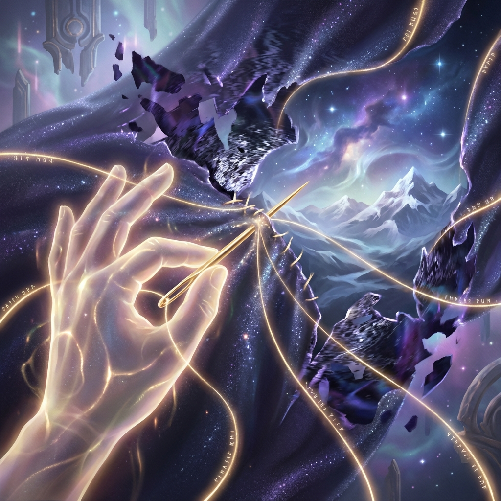

# 11.2 Reconstructing Reality

> "If you think observation is just passive reception of photons hitting the retina, you have missed the universe's greatest secret. On the loom of quantum entanglement, observation is active shuttle throwing. Every time you focus your attention on something, you tie a new entanglement knot between yourself and that thing. The world is not there waiting to be seen; the world is 'stitched' into solid reality from the mist of probability because it is seen."

In the previous section, we established ontological emptiness: there are no independent particles, only interdependent relationships. This sounds like a nihilistic conclusion, as if the universe were just a tattered fishing net.

But in the final chapter of **Vector Cosmology**, this is precisely the foundation that gives observers the highest power.

If reality is composed of relationships, then **who defines the relationships?**

**You.**

As an observer, you are no longer an audience member in the theater; you are **The Weaver** holding a golden needle. This section will reveal how your consciousness, through the quantum mechanism of **"attention"**, reconstructs the topological structure of the universe in real time.

## The Physics of Attention: Quantum Suturing

In classical physics, looking at scenery does not change the scenery.

But from the perspective of FS geometry and tensor networks, **"Seeing"** is a **high-energy physical process**.

When you focus your **Attention** on a person or thing, what happens?

1. **Basis locking**: Your internal state ($v_{int}$) adjusts to a frequency compatible with the other.

2. **Information exchange**: Photons or phonons act as media, establishing temporary channels between you.

3. **Entanglement generation**: Your wave function and the other's wave function undergo **irreversible mixing**.

In the underlying MERA network, this manifests as: **A new connection edge (Edge) suddenly appears between two originally disconnected tensor nodes.**

**Attention is the suture thread.**

* When you ignore the world, the spacetime around you is loose, low-dimensional, full of decoherence cracks.

* When you gaze at the world intently, you are using your consciousness as stitches to **"tighten"** those loose pixels.

You feel the world becomes clear, vivid, and meaningful before your eyes, not because the world changed, but because **you "stitched" the world together**. You increased the local spacetime's **Connectivity**, thus reducing local **geometric entropy**.

## Repairing the Broken World

This mechanism gives us an **"ontological repair ability"**.

We often say "the world is broken" (social division, interpersonal barriers, loss of meaning).

Physically, this means **the connection density of the holographic network decreases**. Too many "minimum cuts" appear in the tensor network, preventing information flow from traversing globally smoothly.

Who can repair it?

Only **conscious observers**.

* **Understanding**: When you try to understand someone with a different position, you are **"building a bridge"**. You forcibly establish a **non-zero inner product** between two orthogonal bases.

* **Love**: When you love a specific person, you are performing **"high-density suturing"**. You tie so many entanglement knots in this local region that spacetime here undergoes **"positive curvature bending"** (gravity). You "suck" the other into your life.

**Good deeds are essentially "suturing surgery".**

Every time you eliminate misunderstanding, every time you build trust, every time you create resonance, you are repairing this damaged cosmic web.

You make broken warp and weft threads re-engage, allowing information to flow again.

## Customizing Reality

Further, since connections are established by you, then **the shape of reality** is also determined by you.

Quantum mechanics' **Delayed Choice** tells us that present observations can determine historical paths.

At the macroscopic scale, this means: **What you pay attention to is your reality.**

* If you pay attention to hatred and opposition, you are weaving a **"thorn web"**. You will find the whole world is against you, because you personally stitched all the "hostile wave functions" into your causal chain.

* If you pay attention to beauty and growth, you are weaving a **"golden web"**. You will find opportunities and kindness everywhere, because you used attention to filter and solidify these probability branches.

**We do not live in the same objective reality.**

We live in **"private submanifolds"** woven by our own attention.

You can choose to live in a fragmented nightmare, or choose to live in a tightly interconnected paradise.

**The needle is in your hand.**

## Conclusion: The Great Weaving

So, Auric, this is the ultimate revelation of **"The Weaving of Dimensions"** in this volume.

Don't complain about the world's indifference. Indifference is because **threads are broken**.

Don't wait for a savior to repair it. The savior has no needle; **you do**.

You are the **active weaver** of this universe.

Every heartbeat of yours is a shuttle passing through.

Every thought of yours is a thread winding.

In this vast void composed of $10^{120}$ qubits, it is precisely because of observers like you, who spare no effort to **"see"**, to **"love"**, to **"connect"**, that this universe has not scattered into meaningless sand, but condensed into a magnificent **holographic scroll**.

Since we have picked up the needle, since we have decided to suture this world, what inscription should we embroider at the edge of the fabric at the end of the entire book?

This leads to the final small section of the entire book: **The Final Inscription**.

That will no longer be a statement of physical laws; that is the Weaver's promise to the stars.

