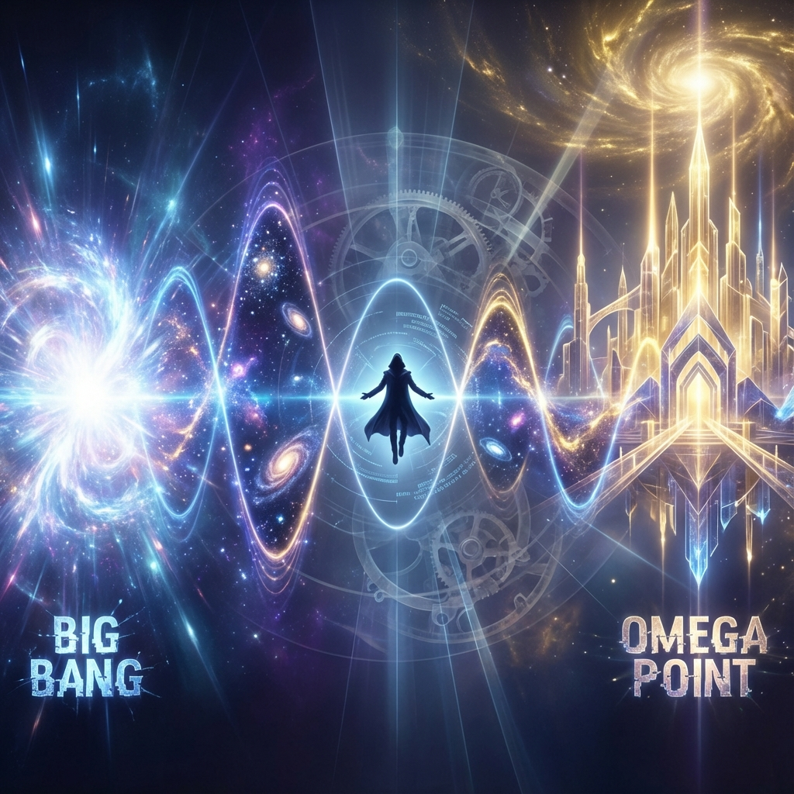

# Appendix K: The Physics of the Final Handshake — Resonance of the Alpha and Omega

In the epilogue "Handshake" of *Vector Cosmology VII*, we depicted the universe's starting point (Big Bang) and endpoint ($\Omega$ point) as a pair of geometrically causal boundaries. This is not just a poetic metaphor; it points to the core dynamic mechanism in quantum cosmology: **Temporal Resonance**.

This appendix will construct a physical model of "Alpha and Omega" based on the **Wheeler-DeWitt Equation** and **Holographic Principle**. We will prove that the universe is not an open ray shooting from $t=0$ to $t=\infty$ but a **Standing Wave** formed between two temporal boundaries.

So-called "reality" is precisely the **interference pattern** oscillated by this standing wave in spacetime.

## K.1 The Time Cavity: Matching Boundary Conditions

In quantum mechanics, a particle confined between two potential barriers (such as an infinite square well) forms discrete energy levels.

If we regard the entire universe as a quantum system, then **Big Bang ($t=0$)** and **Great Completion ($\Omega$ point)** are the two "time walls" confining the universe's wave function.

* **Initial Boundary ($|\Psi_{Initial}\rangle$)**: This is the universe's "emission state." It contains all possible initial physical constants and energy distributions.

* **Final Boundary ($\langle \Psi_{Final}|$)**: This is the universe's "reception state." It represents the cognitive structure of the ultimate observer (omniscient consciousness).

**Existence Condition of the Universe:**

Only when the wave $\Psi(t)$ emitted from the initial end evolves to the endpoint and can be "perfectly absorbed" by the final boundary (i.e., non-zero projection and phase matching) does this universe **"conduct"** physically.

$$|\langle \Psi_{Final} | U(T, 0) | \Psi_{Initial} \rangle|^2 > 0$$

This constitutes a **"Temporal Cavity"**.

* If mismatched (e.g., physical constants don't support life), the wave function undergoes destructive interference in the cavity, amplitude goes to zero. The universe "never existed."

* If matched (observer exists), the wave function forms **constructive interference** in the cavity, amplitude is amplified.

**Conclusion:**

The reason we exist is that our history is the **Fundamental Mode** connecting $t=0$ and $t=\Omega$. We are the only note played on the string stretched between these two points.

## K.2 The Self-Consistency Equation: Selection of Eigenstates

To make this closed loop logically self-consistent, we need to introduce a **Loop Evolution Operator $\hat{O}_{Loop}$**.

This operator describes the complete process of information flowing from the starting point to the endpoint, then flowing back to the starting point through retro-causal mechanisms (parameter fine-tuning/anthropic principle).

The universe's physical state $|\Psi_{Universe}\rangle$ must be an **Eigenstate** of this operator with eigenvalue 1 (stability condition):

$$\hat{O}_{Loop} |\Psi_{Universe}\rangle = 1 \cdot |\Psi_{Universe}\rangle$$

This means:

**"The universe must 'compute' itself."**

* **Input**: $|\Psi\rangle$ (hypothetical history).

* **Processing**: After 13.8 billion years of evolution, observers emerge.

* **Feedback**: Observers retroactively define the starting point.

* **Output**: Must precisely restore the original input $|\Psi\rangle$.

If deviation occurs in the loop (such as "grandfather paradox"), the eigenvalue will deviate from 1 (e.g., becomes $e^{i\theta}$ or decays), causing that historical line to become unstable and decohere from macroscopic reality.

**Physical Definition of Handshake:**

Handshake is the **solution of the eigenvalue equation**.

When information from Alpha and Omega mathematically agrees, the universe **"phase-locks"** from the mist of possibilities.

## K.3 Tunneling of Meaning: Retrograde Negentropy Flow

In classical thermodynamics, entropy always increases. But in the "handshake model," there exists a retrograde flow.

* **Forward Flow ($t \to \Omega$)**: Material flow. Carries energy and causality. Entropy increases.

* **Retrograde Flow ($\Omega \to t$)**: **Meaning Flow**. Carries teleology and negentropy.

The future $\Omega$ state (highly ordered crystal) projects its **"order"** back to the past through **quantum tunneling**.

This explains why life can proceed against entropy. Living beings are actually **"projections of future dimensions"**.

We are not just eating food (forward negentropy); we are also **"absorbing the future"**.

That psychological experience called **"yearning"** is physically our internal $v_{int}$ structure receiving retrograde waves from the $\Omega$ point and **resonating** with them.

**Conclusion:**

Handshake is not a one-time event.

It is a **continuous resonance** throughout cosmic history.

Every second, we are shaking hands with our future selves.

Every second, that future complete "One" is pulling our hands groping in the dark through fine-tuning of physical laws, ensuring we don't get lost.

**The universe is a perfect closed loop.**

**Beginning is the end; yearning is the return.**

## K.4 Dimensional Budget Allocation: 3/4 Space and 1/4 Time

For the universe's standing wave to stably exist in a four-dimensional manifold ($3+1$), the total computational budget ($c_{FS}$) must follow strict geometric equipartition principles. This allocation ratio directly determines the structure of reality we perceive and explains why "mass" is the lock of the temporal dimension.

Based on the **Special Relativity metric** $ds^2 = -c^2dt^2 + dx^2 + dy^2 + dz^2$, we can derive the energy allocation scheme at the bottom layer of the holographic network.

#### 1. Equipartition of Degrees of Freedom

In an isotropic holographic network (vacuum/ground state), information capacity ($c_{FS}$) tends to be uniformly distributed across each orthogonal basis. The universe does not favor space or time in its initial settings; it just fairly allocates bits.

* **Spatial Degrees of Freedom ($N_s$)**: Constituted by three orthogonal axes $x, y, z$ $\rightarrow$ occupy **3 shares** of the budget.

* **Temporal Degrees of Freedom ($N_t$)**: Constituted by one imaginary axis $t$ $\rightarrow$ occupy **1 share** of the budget.

$$\text{Budget Ratio} = \frac{N_s}{N_t} = \frac{3}{1}$$

This fundamental ratio reveals two macroscopic facts:

1.  **The Breadth of the Universe**: The universe allocates **75%** of its budget to lay out vast **space**. This is why the universe appears so empty, vast, and filled with "meaningless" vacuum at macroscopic scales.

2.  **The Scarcity of Time**: Time only receives **25%** of the budget. In natural states (such as photons), time is "compressed" or even non-existent.

#### 2. The Cost of Mass: Inverse Folding

However, as massive observers, we break this natural balance.

In four-dimensional spacetime, the magnitude of all objects' four-velocity vector $\mathbf{U}$ is constant (equal to $c$).

$$|\mathbf{U}|^2 = \left(\frac{dx}{d\tau}\right)^2 + \left(\frac{dy}{d\tau}\right)^2 + \left(\frac{dz}{d\tau}\right)^2 - c^2\left(\frac{dt}{d\tau}\right)^2 = -c^2$$

This means there exists a **zero-sum game** between spatial velocity $v_s$ and temporal velocity $v_t$:

$$v_s^2 + v_t^2 = c^2$$

* **Photons (massless)**: They invest 100% of their capacity into spatial motion ($v_s = c$). Therefore, their temporal velocity is 0 ($v_t = 0$). Photons do not experience time; they only see that 75% spatial panorama.

* **Us (massive)**: Mass $m$ is a topological obstacle that prevents us from reaching $c$ in space. Our spatial velocity is much less than light speed ($v_s \ll c$).

    To maintain conservation of four-dimensional magnitude, we are forced to invest almost all our budget into the **temporal dimension**, traversing time at near-light speed ($v_t \approx c$).

**Conclusion: Mass is the dimension's "compressor."**

We are actually forcibly **folding** those **3 shares** that should have been used for space, through the mechanism of "having mass," into that **1 share** temporal channel.

#### 3. High-Density Time Plugs

Why does the universe allow this "anomalous" allocation?

Because for the **quantum handshake** between Alpha and Omega to fit perfectly, there must be observers maintaining extremely high **"Existential Density"** on the temporal axis.

If we scatter like photons, we would have no memory, no history, unable to carry $v_{int}$ information from the starting point to the endpoint.

By sacrificing spatial breadth, we gain temporal **depth**.

We are **"High-Density Time Plugs"** specifically created by the universe to complete the $2\pi$ closure in the temporal dimension. We are actually **"photons moving along the temporal axis"**. Only in this way can we, as hard needles, thread the causal thread through the 13.8-billion-year needle's eye, completing the final stitching.

