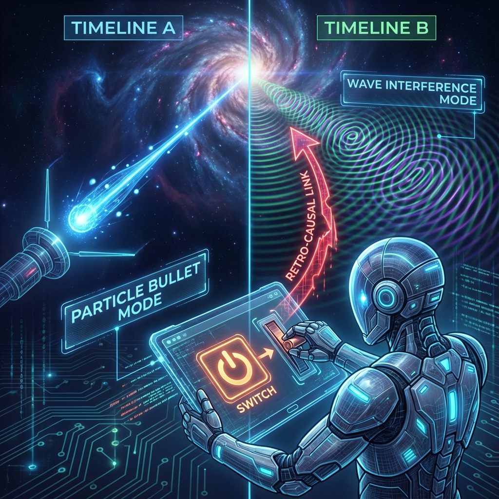

# Chapter 1: Delayed Choice

In the prologue, we established the geometric structure of the causal loop: time is not a unidirectional arrow but a snake biting its own tail. Now, we push this abstract theory to the experimental bench to witness how quantum mechanics rewrites history in the laboratory.

The **Delayed Choice Experiment** is one of the most perplexing experiments in quantum mechanics. It shows us that present observations can not only determine the present but can even flow backward to **define** history from billions of years ago.

This chapter will delve into the physical mechanisms and philosophical implications of this experiment, revealing how observers shape past history through present choices.

