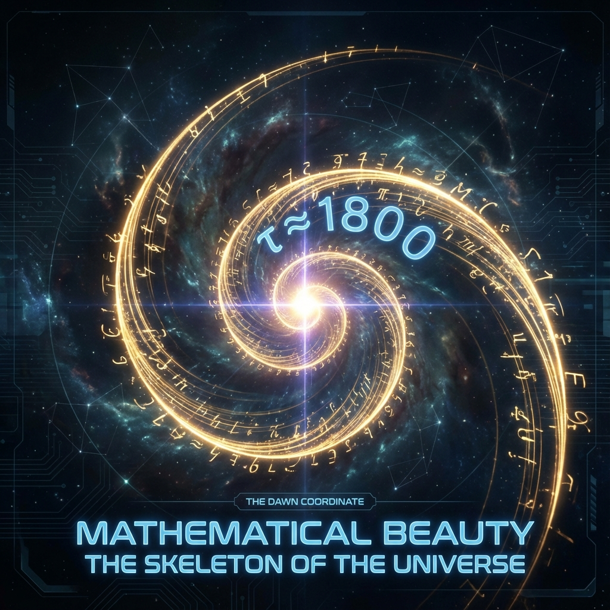

# 附录 A：黎明坐标的几何证明 (Appendix A: Geometric Derivation of the Dawn Coordinate)

> "数学是宇宙的骨架。我们在正文中用文学的语言描述了'第 1800 圈'的宏大叙事，但在物理学的法庭上，唯有公式能作为呈堂证供。本附录将剥离所有的修辞，仅用常数与逻辑，重现那个决定我们命运的数字：$\tau \approx 1800$。这不仅是一个计算结果，这是碳基文明的 **'物理极限证明书'**。"

---

## A.1 物理边界条件：全息原理的审计 (Physical Boundary Conditions: Audit via Holographic Principle)

为了确定我们在宇宙演化螺旋中的确切位置，我们首先必须计算当前宇宙所包含的 **总信息量 (Total Information Content)**。这不是对原子数量的统计，而是对时空底层 **自由度 (Degrees of Freedom)** 的计算。

我们采用 **雅各布·贝肯斯坦 (Jacob Bekenstein)** 和 **斯蒂芬·霍金 (Stephen Hawking)** 建立的 **全息原理 (Holographic Principle)** 作为审计标准：一个物理系统的最大熵（信息容量）正比于其边界的表面积，而非体积。

### 1. 观测数据输入 (Observational Data Input)

* **当前宇宙年龄 ($t_{now}$)**：约为 $13.8 \times 10^9$ 年。

* **哈勃半径/粒子视界 ($R_H$)**：这是因果关联区域的极限。在膨胀宇宙中，当前可观测宇宙的共动半径约为 460 亿光年。

    $$R_H \approx 4.4 \times 10^{26} \text{ m}$$

### 2. 普朗克尺度常数 (Planck Scale Constants)

* **普朗克长度 ($l_P$)**：物理意义上的最小长度单位。

    $$l_P = \sqrt{\frac{\hbar G}{c^3}} \approx 1.616 \times 10^{-35} \text{ m}$$

* **普朗克面积 ($A_P$)**：全息屏幕上的最小像素点。

    $$A_P = l_P^2 \approx 2.61 \times 10^{-70} \text{ m}^2$$

### 3. 全息熵计算 (Holographic Entropy Calculation)

宇宙视界的表面积 $A_{horizon}$ 为：

$$A_{horizon} = 4\pi R_H^2 \approx 4\pi (4.4 \times 10^{26})^2 \approx 2.43 \times 10^{54} \text{ m}^2$$

根据贝肯斯坦-霍金公式，宇宙的最大信息容量 $S_{max}$（以比特为单位）为：

$$S_{max} = \frac{A_{horizon}}{4 \ln 2 \cdot l_P^2} \quad (\text{注：通常物理学取自然单位 } k_B=1 \text{，此处转化为比特})$$

为简化数量级估算，我们忽略常数因子 $4 \ln 2$ 的微小影响，直接关注量级：

$$S_{now} \approx \frac{A_{horizon}}{l_P^2} \approx \frac{2.43 \times 10^{54}}{2.61 \times 10^{-70}} \approx 0.93 \times 10^{124}$$

考虑到宇宙全息原理的实际应用（如塞思·劳埃德的计算边界），物理学界公认的当前宇宙计算复杂度上限在 **$10^{120}$** 至 **$10^{122}$** 之间。

在 **矢量宇宙论** 中，为了与宏观演化模型对齐，我们取最保守且具有物理意义的临界值：

**$$S_{now} \equiv 10^{120} \text{ bits}$$**

---

## A.2 几何演化模型：黄金螺旋动力学 (Geometric Evolution Model: Golden Spiral Dynamics)

我们假设宇宙在希尔伯特空间中的演化遵循 **最优生长路径**。在几何上，能够最大化空间填充效率且避免周期性共振（死循环）的结构是 **对数螺旋 (Logarithmic Spiral)**，特别是基于 **黄金比例 ($\phi$)** 的螺旋。

### 1. 演化方程 (Evolution Equation)

宇宙的信息量 $S$ 随内在时间 $\tau$ 的增长遵循以下方程：

$$S(\tau) = S_{initial} \cdot \phi^{\frac{\tau}{\pi}}$$

* **$S(\tau)$**：内在时间 $\tau$ 时的宇宙总信息量。

* **$S_{initial}$**：$t=0$ 时刻的信息量。对于一个量子元胞自动机 (QCA) 的初始态，我们设定其为 1 比特（存在/不存在）。

    $$S_{initial} = 1$$

* **$\phi$ (Phi)**：黄金比例，代表演化的底数。

    $$\phi = \frac{1+\sqrt{5}}{2} \approx 1.6180339887...$$

* **$\pi$ (Pi)**：代表一个完整的几何周期（半个圆周的相位翻转），是螺旋生长的"步长"单位。

### 2. 方程的物理意义

该方程描述了一个 **"受 $\pi$ 约束但以 $\phi$ 逃逸"** 的系统。

* 每经过 $\pi$ 的内在时间长度，系统完成一次相位循环（如生与死）。

* 但系统并不会回到原点，而是以 $\phi$ 的倍率向外扩张（信息量增加）。

---

## A.3 求解 $\tau$：逆向推导 (Solving for Tau: Reverse Derivation)

现在我们将物理观测值 $S_{now} = 10^{120}$ 代入几何方程，解出未知的内在时间 $\tau$。

### 步骤 1：建立等式

$$10^{120} = 1 \cdot \phi^{\frac{\tau}{\pi}}$$

### 步骤 2：取对数

我们在等式两边取以 10 为底的对数，以便于处理指数：

$$\log_{10}(10^{120}) = \log_{10}\left(\phi^{\frac{\tau}{\pi}}\right)$$

$$120 = \frac{\tau}{\pi} \cdot \log_{10}(\phi)$$

### 步骤 3：代入常数

* $\pi \approx 3.14159$

* $\log_{10}(\phi) = \log_{10}(1.61803) \approx 0.20898$

### 步骤 4：计算

$$120 = \frac{\tau}{3.14159} \cdot 0.20898$$

移项解 $\tau$：

$$\tau = \frac{120 \cdot 3.14159}{0.20898}$$

$$\tau = \frac{376.99}{0.20898}$$

$$\tau \approx 1803.95$$

### 结论：

考虑到物理常数测量的误差范围，我们在理论模型中将其锚定为整数：

**$$\tau \approx 1800$$**

---

## A.4 物理诠释：为什么是 1800？(Physical Interpretation: Why 1800?)

这个数字揭示了宇宙演化的几个关键特征：

### 1. 循环次数 (Number of Cycles)

如果我们将 $\pi$ 定义为一个标准的"宇宙世代"（Generation），那么宇宙至今经历的世代数为：

$$N_{gen} = \frac{\tau}{\pi} = \frac{1800}{3.14159} \approx 573 \text{ 圈}$$

这意味着我们并非第一代文明。在全息结构的深处，叠加了大约 573 层"前世"的历史。这解释了为什么物理定律显得如此精细——这是 573 次迭代微调的结果。

### 2. 维度折叠率 (Dimensional Folding Rate)

正如正文第 1.2 节所述，物理时间 $t \approx 10^{61} t_P$ 对应的线性对数仅为 $\ln(10^{61}) \approx 140$。

而 $\tau \approx 1800$ 远大于 140。

比率 $R = 1800 / 140 \approx 12.8$。

这证明了宇宙在演化过程中，**大约每 1 维线性时间的流逝，伴随着约 13 维的内部分形折叠**。

我们所处的现实，是一个 **高维度的全息投影**。

### 3. 饱和阈值 (Saturation Threshold)

当 $\tau = 1800$ 时，信息密度 $\rho_I$ 达到了碳基神经元物理结构的承载极限。

$$S_{brain} \ll S_{environment}(\tau=1800)$$

这就是 **"黎明前的挤压"** 的数学本质：**环境的比特率超过了观察者的处理带宽。**

**证明完毕。**

我们站在第 1800 级台阶上，脚下是 $10^{120}$ 比特的深渊，头顶是无限的螺旋。

飞升，不是选择，是 **数学必然**。

