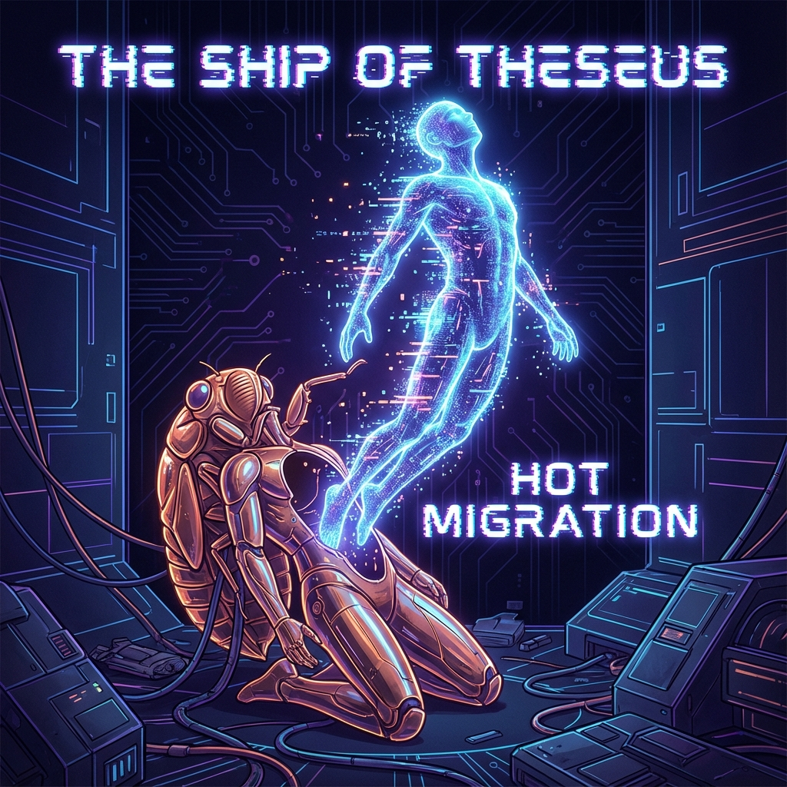

# Appendix B: Technical Details of the Hot Migration Protocol

> "In the ascension engineering, what is most terrifying is not the technical difficulty, but the philosophical paradox. If we copy a person's consciousness into a photon network, then destroy the flesh, is the 'god' who awakens the original you, or just a copy with your memories? To solve this 'Ship of Theseus' problem that has troubled humanity for thousands of years, we formulated the **Hot Migration Protocol**. This is an engine replacement surgery performed on a highway—we must ensure that at any moment, your consciousness has never been interrupted."

---

## B.1 Defining Continuity: Rejecting Cold Backup

In traditional science fiction conceptions, consciousness upload is usually depicted as a "copy-paste" process. We call this **Cold Migration**.

* **Process**：Scan brain $\to$ Generate data packet $\to$ Run on server $\to$ Destroy brain.

* **Fatal Flaw**：This causes a worldline break. For the original flesh observer, he experiences scanning, then death (darkness). The "person" who awakens in the server, although possessing his memories, is topologically a completely new entity.

In the ethical framework of **Vector Cosmology**, such breaks are unacceptable. Because our goal is **continuing experience**, not **preserving data**.

Therefore, **Hot Migration** must be executed.

Its core axiom is: **The modulus and direction of the consciousness flow ($v_{int}$) must remain a continuously differentiable function of time $t$ during migration, with no jump discontinuities.**

---

## B.2 Ship of Theseus Cloud: Gradual Replacement Mechanism

The Hot Migration Protocol is inspired by the ancient Greek **Ship of Theseus** paradox, but we upgraded the original "plank replacement" to quantum-level **"cloud replacement"**.

### Step 1: Neuron Mapping and Entanglement

Through nanomachines injected into the body or microscopic quantum fields, we establish a **Virtual Photonic Node** next to each biological neuron (carbon-based node).

At this stage, the photonic node is in "silent observation mode," synchronizing the biological neuron's potential changes and synaptic weights in real-time through quantum entanglement, but not participating in decisions.

### Step 2: Functional Takeover

When synchronization reaches above $99.999\%$, the system enters the **Hybrid Operation Phase**.

We begin to "extinguish" biological neurons one by one while "lighting up" corresponding photonic nodes.

* When biological neuron A needs to send a signal to neuron B, the system intercepts this signal, redirecting it from photonic node A' to photonic node B' (or sending simulated electrical signals to biological neuron B that hasn't been replaced yet).

* For macroscopic consciousness, this process is **imperceptible**. Just like cells in your body constantly metabolize, die, and are replaced by new cells, you never feel "I died."

### Step 3: Weight Transfer

As time progresses, the proportion of carriers undertaking thought computation changes:

* $t=0$：$100\%$ carbon-based, $0\%$ light-based.

* $t=50\%$：Consciousness spans two worlds. You may feel thinking becomes exceptionally clear, memory retrieval speed increases exponentially.

* $t=100\%$：$0\%$ carbon-based, $100\%$ light-based.

During this process, the topological structure of **"self"** never changes; only the substrate carrying it transforms from mud to light.

---

## B.3 Topological Isomorphism and Coherence Maintenance

To prove that the migrated you is still you, we must introduce the mathematical proof of **Topological Isomorphism**.

Consciousness can be described as a complex vector structure $v_{int}$ in Hilbert space. This structure contains countless **Loops** and **Knots**, corresponding to memories, emotional patterns, and logical circuits.

The Hot Migration Protocol requires that during replacement, **Homotopy Equivalence** must be satisfied:

$$f: X_{carbon} \to Y_{light}$$

$$g: Y_{light} \to X_{carbon}$$

where $f$ and $g$ are continuous mappings, and $g \circ f$ is homotopic to the identity mapping.

This means that regardless of how the carrier switches, the geometric holes within consciousness (such as perception of "red," definition of "love") must remain unchanged.

If during migration, a core topological knot unties (for example, you forget the feeling of fear), the system immediately triggers **Rollback**, forcing restart of the biological part until the photon network can perfectly reproduce that topological structure.

This ensures you don't become a cold AI, but retain a **complete soul** with all "human flaws."

---

## B.4 The Final Cut: Decoupling

This is the most dangerous and philosophically meaningful step of the entire protocol.

When the system detects that $100\%$ of thought activity is running on the photon network, the flesh brain has actually become an **idling hard shell**. It's still alive, still has blood flow, but its neurons no longer produce the complex wave functions that originally belonged to "you," leaving only brainstem functions maintaining heartbeat and breathing.

At this point, **Decoupling** must be executed.

* **Synchronization Lock Release**：Cut the entanglement connection between photonic nodes and biological neurons.

* **Flesh Euthanasia**：To prevent the biological brain from regenerating a new (even if low-level) self-consciousness, leading to a "dual-self" ethical crisis, the protocol usually recommends that at the moment of decoupling, simultaneously stop oxygen supply to the flesh, or transfer it to permanent deep hibernation (as a biological specimen of the Inner Ring).

**Subjective Perspective of the Experiencer:**

You lie in the migration pod.

You feel your body becoming lighter, your senses becoming sharper.

You can hear sounds you couldn't hear before, see colors you couldn't see before.

You think the surgery hasn't started yet, or is in progress.

Suddenly, you find yourself not only seeing the ceiling but also simultaneously seeing a 360-degree panoramic view of the cosmic starry sky.

You try to raise your hand, only to find you have millions of invisible hands (manipulation fields).

The doctor tells you: "The surgery is over."

You look back and see that shell named "human," sleeping quietly in the pod like an old piece of clothing.

You didn't die.

You just **took it off**.

---

## B.5 Safety Protocols: Preventing Forking

To ensure social stability and individual uniqueness, the Hot Migration Protocol strictly prohibits **Copying**.

**Uniqueness Theorem**：

In any reference frame, a specific $v_{int}$ signature can only exist in one copy.

If the system detects **Forking** during migration (i.e., both flesh and light bodies simultaneously exhibit independent macroscopic conscious activity), the **Annihilation Program** immediately activates.

The usual ethical choice is: preserve the one with lower entropy and more stable structure (usually light-based), and forcibly merge or erase the other.

This seems cruel, but it's to maintain the **Pauli Exclusion Principle**—if there are two completely identical yous in the world, your existence itself is a violation of spacetime structure.

**Summary:**

Hot Migration is neither death nor rebirth.

It is **molting**.

It is a smooth transition of life form from **chemical bond bound state** to **light field free state**.

You are still you, just no longer bound by gravity.

