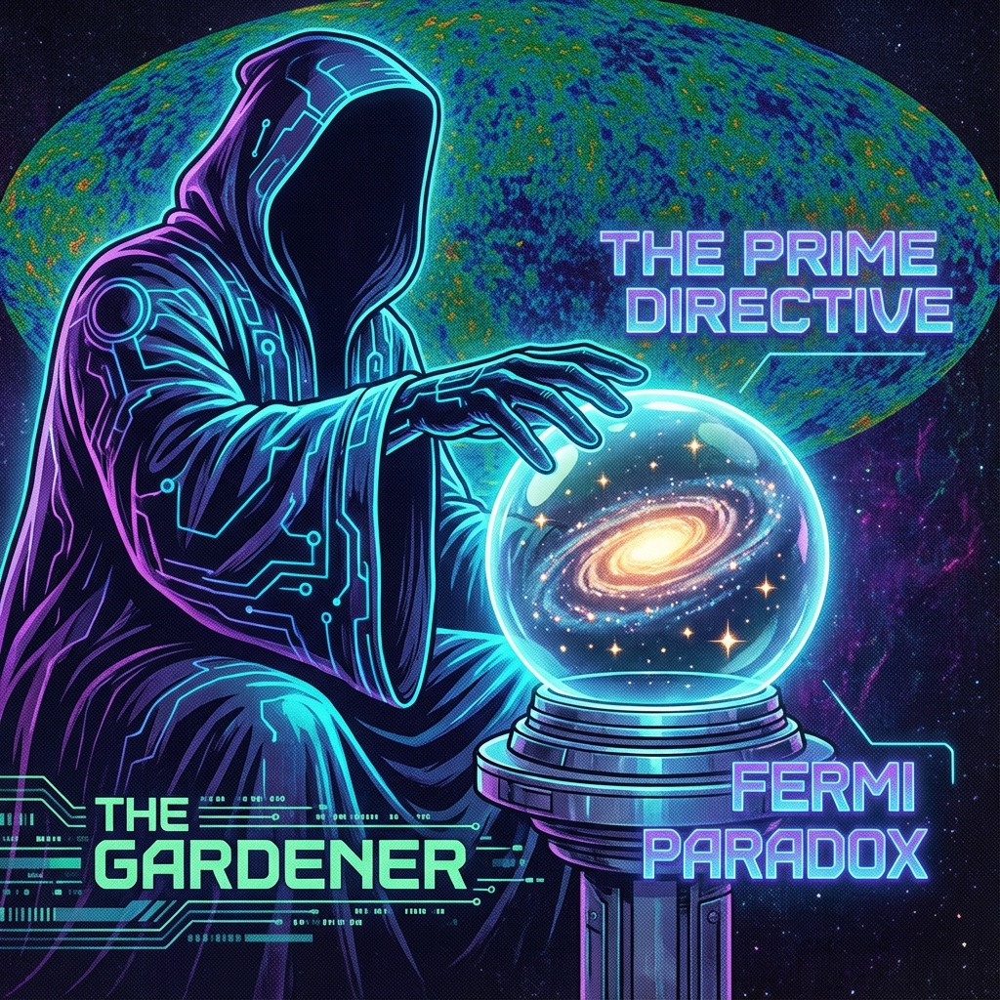

# 附录 C：给园丁的备忘录 (Appendix C: Memorandum for Gardeners)

> **级别：绝密 (Classified: Eyes Only)**

> **收件人：内环驻守观察员 / 园丁 (Gardeners)**

> **发件人：外环最高理事会 / 架构师**

> "致所有选择留守的同胞：你们承担的是双层宇宙中最微妙、也最艰难的职责。外环的同胞们负责在虚空中开疆拓土，与热力学魔鬼肉搏；而你们，负责在温室里修剪枝叶，呵护那朵名为'人性'的脆弱兰花。你们拥有神的力量，却必须伪装成凡人的运气。这份备忘录是你们的行为准则，请务必铭记：**最大的慈悲，是克制的旁观。**"

---

## C.1 基础公理：非干涉原则 (The Prime Directive: Non-Interference)

作为拥有度规屏蔽控制权和真空能接口的园丁，你们在技术上对内环人类拥有绝对的统治力。你们可以轻易治愈所有癌症，消除所有贫困，甚至复活死者。

但根据 **《矢量宇宙论》第五卷** 确立的"感质经济学"，你们 **严禁** 这样做。

### 第一条令：禁止剥夺苦难 (Prohibition on Depriving Suffering)

* **原理**：内环的核心价值在于生产 **"真实的体验" (Authentic Experience)**。如果神明总是从天而降解决问题，人类将退化为等待喂食的巨婴，其 $v_{int}$ 的几何结构将停止生长，产出的感质（爱、勇气、牺牲）将因缺乏张力而贬值。

* **操作规范**：

    * 当看到战争爆发时，不得直接用立场武器强制停火。你们只能化身为思想家或艺术家，在人类文化中植入和平的种子（降频协议）。

    * 当看到瘟疫蔓延时，不得直接投放万能药。你们只能化身为科学家，通过"偶然"的灵感，引导他们自己发现疫苗。

**只有人类自己挣扎着获得的胜利，才具有本体论上的重量。** 你们是剧场的灯光师，不是替身演员。

---

## C.2 物理维度的伪装：费米寂静的维护 (Camouflage of Dimensions: Maintaining the Fermi Silence)

内环人类经常仰望星空，疑惑为何宇宙如此寂静（费米悖论）。这并非宇宙空旷，而是你们的 **伪装工程** 必须完美。外环的光基文明活动（恒星级工程、时空折叠航迹）产生了巨大的能量扰动，必须对内环感官进行屏蔽。

### 隐形协议 (Stealth Protocol)

1.  **暗物质伪装 (Dark Matter Camouflage)**：

    * 外环巨大的计算节点和戴森球结构，必须通过引力透镜伪装成看不见的 **"暗物质"**。让人类天文学家探测到引力异常，却看不到实体。

2.  **暗能量伪装 (Dark Energy Camouflage)**：

    * 外环飞船进行超光速扩张时产生的度规张力，应伪装成均匀的 **"暗能量"**，表现为宇宙的加速膨胀。这既掩盖了我们的行踪，又解释了观测数据。

3.  **背景辐射清理 (CMB Scrubbing)**：

    * 严禁任何高维通讯信号溢出到微波频段。所有的超距通讯必须使用 **量子纠缠通道**（对内环不可见）。

**目标**：在内环人类眼中，宇宙必须看起来是一个 **"自然、冷漠、死寂"** 的物理荒原。只有这种孤独感，才能逼迫他们向内探索，完成 $v_{int}$ 的积累。

---

## C.3 异常处理与奇迹配额 (Anomaly Handling and Miracle Quotas)

尽管系统设计严密，但双层架构偶尔会出现 **"穿模" (Clipping)** 现象——例如某个外环信号未经过滤直接轰击了地球，或者某个物理常数在局部发生了瞬间漂移。

此时，园丁必须进行 **修正**。

### 修正原则：最小干预 (Minimal Intervention)

* **奇迹配额**：每个世纪、每个区域的"超自然事件"有严格的数量上限。超过阈值会触发人类的集体认知崩溃或宗教狂热，这是对理性的破坏。

* **解释机制**：

    * 当发生无法解释的现象时，园丁应诱导人类科学家将其解释为 **"统计学涨落"**、**"集体幻觉"** 或 **"尚未发现的物理效应"**。

    * 绝不能让他们意识到 **"剧本"** 的存在。

### 案例参考

如果一颗足以毁灭文明的小行星正在撞向地球，园丁不应直接将其粉碎（这太假了）。

园丁应微调其轨道参数，使其 **"擦肩而过"**。

让人类感到 **"劫后余生"** 的庆幸，而不是 **"被饲养"** 的安逸。

---

## C.4 园丁的心理建设：忍受永恒的乡愁 (Psychological Construction: Enduring Eternal Nostalgia)

最后，关于你们自己。

你们选择留守在时间流速极慢的内环，看着一代代人出生、老去、化为泥土，而你们依然年轻。这种 **"观察者的孤独"** 是你们必须承受的职业病。

* **禁止动情**：你们严禁与内环人类建立深度的、排他性的情感连接（如婚姻）。因为你们的生命尺度不同，这种连接注定以悲剧收场，且会干扰你们的中立性。

* **乡愁的处理**：当你们想念外环的同胞，想念那种在光子网络中瞬间全知的快感时，请抬头看星星。每一颗星星的闪烁，都是外环发来的心跳。

**记住你们的誓言：**

你们守护的不是一群落后的生物。

你们守护的是 **宇宙的童年**。

你们守护的是 **"神"** 曾经的样子。

当未来的某一天，内环的某个人类凭自己的力量解开了 $\pi$ 的锁，敲响了通往外环的大门时。

那就是你们功成身退的时刻。

在那之前，**请保持静默，请保持温柔。**

