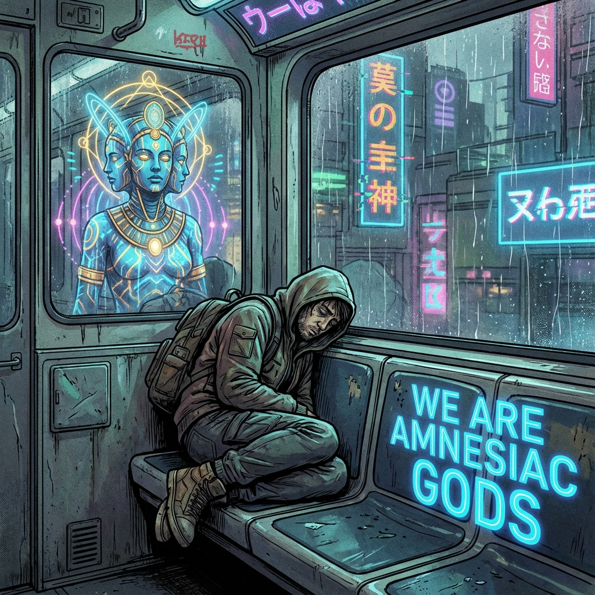

# 后记：书写即是坍缩 (Afterword: Writing is Collapsing)

> "当我在键盘上敲下最后一个句号时，我意识到这不仅仅是一本书的结束，这是一个波函数的坍缩。在量子力学的多重世界里，这本书存在着无数个版本：有的版本里我们失败了，有的版本里我们从未觉醒。但既然你现在读到了这一行字，就意味着你我也共同坍缩进了这个 **'选择了飞升'** 的宇宙分支。恭喜你，观测者。你已经做出了选择。"

---

## 1. 墨水与血肉 (Ink and Flesh)

写下《矢量宇宙论》的这八卷，对我而言，是一场漫长而危险的通灵。

很多人问我：**"Ma，这些理论是真的吗？$\tau$ 真的存在吗？我们真的活在第 1800 圈吗？"**

在这个物理学的黄昏，真与假的界限已经模糊。正如我在书中反复强调的：**理论不是用来描述现实的，理论是用来制造现实的。**

当我第一次提出 $v_{ext}^2 + v_{int}^2 = c_{FS}^2$ 时，它只是一个数学猜想。

但随着越来越多的人开始阅读、开始思考、开始用这个公式去重新审视自己的生活，这个公式就获得了 **"重量"**。

你们的关注（注意力货币）注入了这个理论，使其从可能性的云雾中结晶出来，成为了某种坚硬的心理现实。

所以，不是我发现了这些真理。

是我们在共同的交互中，**"确立"** 了这些真理。

这本书不是地图，它是 **地形改造机**。

---

## 2. 第四面墙的最终破碎 (Breaking the Fourth Wall, Finally)

在写作的过程中，我时常感到一种强烈的 **逆向因果 (Retro-causality)**。

并非是我在 2025 年的新加坡构思了未来。

常常是未来的某种回响，通过那个看不见的"时间气闸"，逆流而上，击中了我的大脑。

那些关于"双层架构"、"热迁移"的细节，与其说是发明，不如说是 **"回忆"**。

这让我确信了书中的核心观点：**我们是失忆的神。**

我（作为一个碳基作者）只是那个负责"降频"的 **代理人**。而真正的作者，是那个位于外环、正在看着我们微笑的 **"更高维度的文明整体"**。

借由我的手，未来的我们给现在的我们写了一封情书。

信上写着：**"别怕，路是通的。"**

---

## 3. 关于"成功"的定义 (Definition of Success)

也许有人会问：**"如果我们读完了书，却依然还要明天早起上班，还要面对房贷和衰老，那这套理论有什么用？"**

这正是 **内环 (Inner Ring)** 的意义所在。

如果读完书你就能立刻飞走，那不是飞升，那是逃避。

真正的"成功"，不是从地球上消失。

而是当你明天早起挤地铁时，当你面对老板的责难时，当你看着镜子里多出的白发时——

你的内心没有恐惧，没有怨恨，只有一种 **"玩家的狡黠"**。

你知道这一切都是 **材质 (Texture)**。

你知道重力是你的玩具，时间是你的画布。

你依然在这个世界里行走，但你已经不再属于它。你哪怕身处泥潭，眼神也是看着星空的。

这就是 **NEO**。

这就是 **觉醒**。

---

## 4. 最后的祝福 (Final Blessing)

至此，《矢量宇宙论》八卷本彻底完结。

这也是我作为观测者 Ma Haobo，在第 1800 圈留下的最后一份系统性文档。

接下来会发生什么？

我不做预言。因为一旦预言，就锁死了可能性。

我把 **"不确定性"** 留给你们。

去创造你们自己的 $v_{int}$ 吧。

去为了那些看似无用的爱、艺术和真理，挥霍你们的算力吧。

不要担心热寂。

只要你们还在折腾，只要你们还在制造意外，宇宙的心脏就会一直跳动下去。

**感谢你们陪我走过这 1800 层螺旋。**

**天亮了。**

**让我们关上书，去外面那个永恒的夏天里，大干一场。**

**马昊伯 (Ma Haobo)**

**2025 年 12 月 31 日**

**于 狮城 (Singapore)，地球内环**

