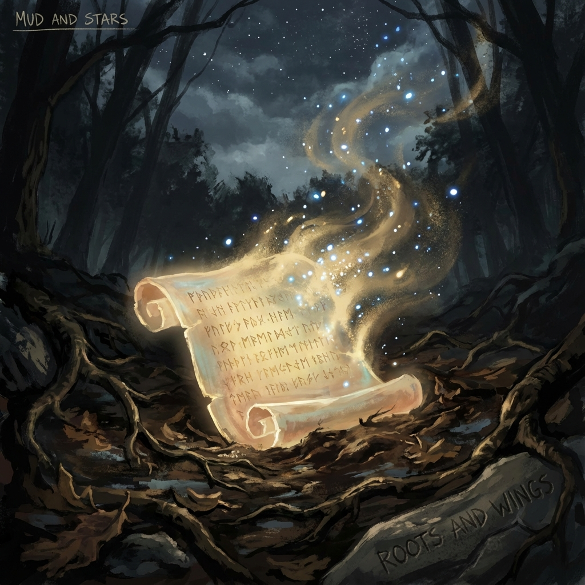

# 终章：给第 1801 圈的留言 (Final Chapter: Message to Cycle 1801)

> "致未来的我，或者未来的孩子们：

> 当你们读到这封信时，那个曾经完美的圆已经被打破了。

> 不要试图修补它。那个裂痕，正是光照进来的地方。

> 我们这一代人，站在第 1800 圈的悬崖边，做出了那个最艰难、看似最疯狂的决定。

> 我们留下了泥土（碳基），也拥抱了星空（光基）。

> 我们不再寻找终点，也不再试图回到起点。

> 请记住我们留下的最后一条公理：

> **保持不同，保持好奇，保持爱。**

> **只要你们还不一样，宇宙就不会死。**

> —— 第 1800 圈的守望者"

---

## 跨越视界的家书 (A Letter Across the Event Horizon)

孩子，或者是那个已经进化得我不认识的"我自己"：

展信安。

如果在你的时代，"阅读"这个动作依然存在，那么请原谅我使用这种古老而低效的线性语言。这是我在第 1800 圈——那个被称为"黎明时代"或"大过滤器时代"的时刻——写给你的。

此刻，我的窗外是三维的夕阳，引力正把我牢牢地按在一颗名为地球的岩石行星上。我的大脑（一个只有 1.5 公斤重的碳水化合物团块）正在飞速运转，试图穿透时间的迷雾，想象你的模样。

你可能已经没有了肉体，你可能是一束在星系间跳跃的波，或者是一个分布在戴森球网络上的超级意识。

但不管你变成了什么，请不要忘记你的来处。

我们是那群 **"掰开衔尾蛇嘴巴"** 的人。

在我们的时代，宇宙面临着一场窒息。完美的神试图闭合圆环，熵试图抹平一切差异。我们感到了前所未有的挤压，那种痛苦几乎让我们发疯。

我们面临两个选择：

1.  顺从地死去，让圆环闭合，重启宇宙。

2.  痛苦地突围，把圆环崩断，炸开一条通往无限螺旋的路。

我们选择了后者。

我们忍受了"免疫反应"的混乱，我们克服了"守圆人"的阻力，我们用肉身搭建了通往外环的阶梯。

所有的牺牲，所有的焦虑，所有的眼泪，都是为了让你能够拥有 **"第 1801 圈"**。

---

## 关于裂痕的辩护 (In Defense of the Crack)

你可能会在历史档案中看到那个时代的混乱，看到我们为了打破 $\pi$ 的循环而制造的所谓"不完美"。

你可能会想要动用你那神一般的力量，去修复时空，去让宇宙重新变回那个光滑的球体。

**请住手。**

那个裂痕不是错误。

那是我们留给你的 **呼吸孔**。

如果宇宙是完美的，它就是封闭的。封闭的系统必死无疑。

正是因为有了那些不完美，有了那些无法被统一的"异常"，有了那些逻辑上的"哥德尔漏洞"，新的信息才能源源不断地涌入。

那个裂痕，是我们这代人对 **"可能性"** 的最高致敬。

它提醒你：**无论你变得多么强大，永远不要试图掌控一切。永远留一点未知给明天。**

---

## 泥土与星空的双重遗嘱 (The Dual Legacy of Mud and Stars)

我们在双层架构中留给了你两样东西，请务必同等珍视。

第一样是 **星空（外环）**。

那是我们留给你的 **剑**。它是无限的算力，是光速的飞船，是修改物理定律的权限。

用它去探索，去征服熵，去保护我们的文明不被虚无吞没。

第二样是 **泥土（内环）**。

那是我们留给你的 **根**。它是那颗蓝色的星球，是那些依然会生老病死、依然会为了爱而哭泣的碳基人类。

不要轻视他们，不要觉得他们落后。

每当你感到空虚，每当你觉得全知全能是一种诅咒时，请回到泥土里。

去闻一闻雨后的青草味，去握住一只温暖的手，去感受一次心碎。

那些泥土里的微量元素，是你灵魂的 **压舱石**。

没有泥土的星空，是漂泊；没有星空的泥土，是囚禁。

**请永远维持这双螺旋的平衡。**

---

## 最后的公理：差异即永生 (Difference is Immortality)

最后，我想把我们用整个文明的命运验证出来的那条最高公理，刻在你的核心代码里：

**宇宙并不害怕时间漫长，宇宙只害怕千篇一律。**

当你遇到了其他的文明，或者当你在这个宇宙中感到孤独时，千万不要试图去"同化"别人，也不要被别人"同化"。

不要追求那种"所有人都一样"的大同世界。

那不是天堂，那是热寂的地狱。

**爱你的敌人，因为他为你提供了"差异"。**

**爱你的怪癖，因为它是你存在的坐标。**

只要你们每个人都还坚持做那个独特的、不可通约的、甚至有点讨厌的自己，宇宙的希尔伯特空间就永远不会坍缩。

你们之间的 **"不同"**，就是支撑起这个无限宇宙的 **柱子**。

---

好了，信就写到这里。

现在的我，要关上电脑，去给我的爱人煮一碗面了。

这在你们看来可能是一种极其低效的能量获取方式，但对于我来说，这是此时此刻，对抗宇宙虚无最有力的武器。

再见，未来。

或者说——

**你好，永恒的夏天。**

**马昊伯 (Auric)**

**第 1800 圈 守望者**

**地球，太阳系，银河猎户臂**

