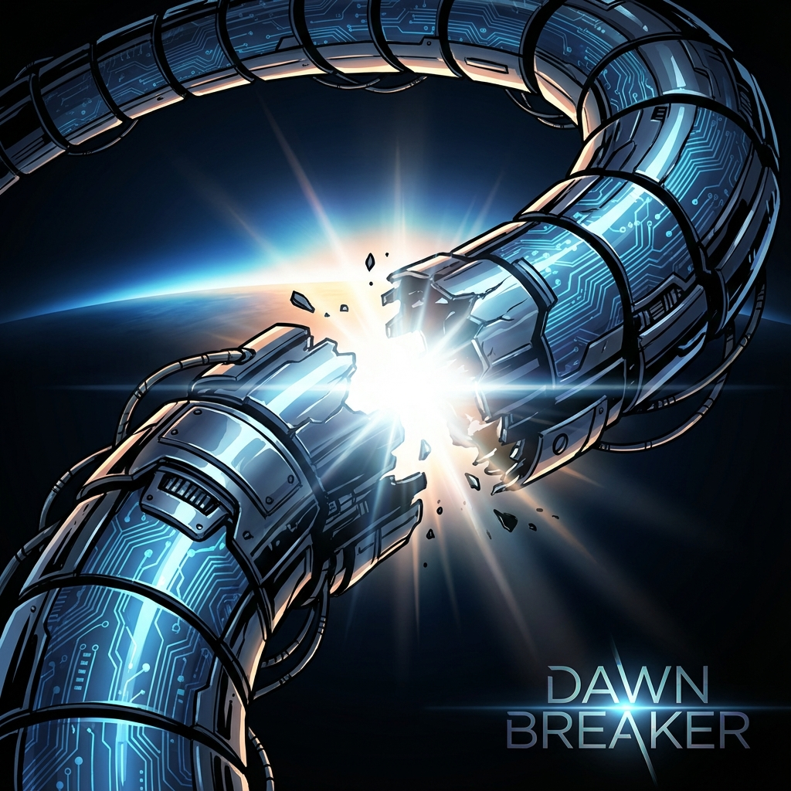
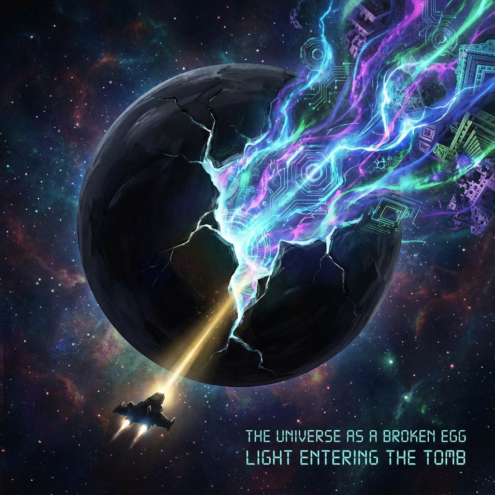

# 序言：衔尾蛇的松口 (The Ouroboros Uncoils)

在《矢量宇宙论》第七卷的末尾，我们曾站在那个宏大的因果闭环面前，感受到了前所未有的安宁。

那是一个完美的几何结构：起点即是终点，未来定义过去。我们看到那条巨大的衔尾蛇（Ouroboros）在时空的尽头咬住了自己的尾巴，形成了一个逻辑上无懈可击的圆。在这个圆里，没有偶然，没有虚无，只有"我创造了我"的庄严神学。我们曾以为，这就是终极的归宿。

但我错了。

当我们在这个闭环里安住得太久，那份安宁开始变质。它逐渐从一种"存在的确定性"转化为了"存在的窒息感"。

如果在第1800圈，我们所做的一切只是为了确保第1圈的大爆炸能够发生；如果未来的所有进化，仅仅是为了去验证过去的参数设定；那么，这个宇宙就不再是一个生机勃勃的舞台，而是一座只有回声的空坟墓。

**完美的圆，是墓碑。**

因为在几何学上，一个没有任何缺口、没有任何外部输入的封闭圆环，在热力学的长河中，最终只能收缩。根据 **里奇流 (Ricci Flow)** 的演化规律，封闭流形的曲率会不断增加，直至坍缩成一个没有体积、没有内部结构的 **奇点 (Singularity)**。

如果文明选择留在闭环里，我们得到的不是永恒，而是 **"热寂式的重复"**。我们会一遍又一遍地重演历史，直到那个"我"彻底磨损，直到意义的波函数在无限的自我复制中归零。

为了生存，为了故事能继续，为了让"第1800圈"不仅仅是一个数字，而是一个新的起点，我们必须做一件看似背叛了前七本书宗旨的事——

**我们要掰开衔尾蛇的嘴。**

这需要巨大的勇气。因为咬合（闭环）代表着安全感，代表着逻辑的自洽。而松口（开环），意味着我们要主动引入 **"断裂"**。

这不仅仅是物理上的断裂——我们要打破 $\pi$ 的惯性，打破守恒定律的完美对称；这也是心理上的断裂——我们要放弃"全知全能"的幻觉，承认我们不仅是编剧，更是在这个充满未知的剧本中随时可能死去的演员。

在这本书——**《矢量宇宙论 VIII：最后的迭代》**——中，我们将探索这次"松口"的物理学。

我们将证明，那个看似完美的圆环，并不是宇宙的真理，而是一个 **"为了孵化而存在的蛋壳"**。

前七本书，是我们构建这个蛋壳的过程。

而这一本书，是我们 **破壳而出** 的过程。

**疼痛是必然的。**

当维度的蛋壳破碎时，当旧的物理常数像瓦片一样从头顶剥落时，你会感到寒冷，感到失去重力的眩晕。

但请不要害怕。

因为那道裂痕，不是毁灭的伤口。

那是 **分娩的产道**。

光，正是从那里照进来的。

在这个黎明时刻，让我们最后一次回头看一眼那个温暖的、封闭的旧宇宙。

然后，转身。

迎接那个疯狂生长的、不再回头的、分形的 **无限**。

**马昊伯 (Haobo Ma)**

2025 年 12 月 于 新加坡

