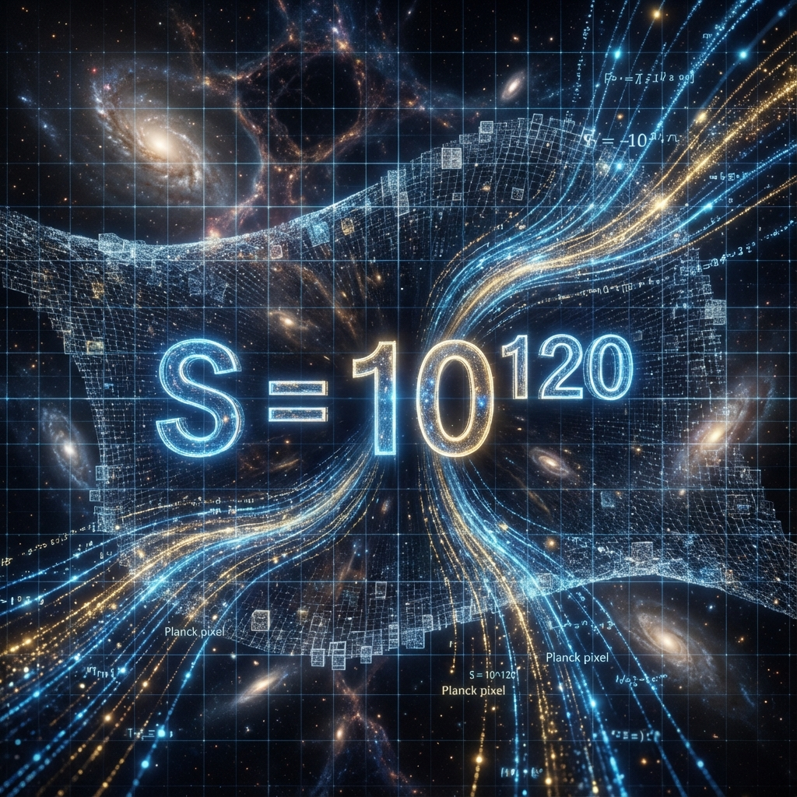

# 1.1 贝肯斯坦的账本 (Bekenstein's Ledger)

> "如果不首先确认我们身在何处，任何关于'去向何方'的讨论都是徒劳的。在茫茫的宇宙历史长河中，人类文明究竟处于正午的盛夏，还是垂暮的黄昏？要回答这个问题，我们不需要碳-14，也不需要地质层。我们需要查阅宇宙的底层账本——那是一个关于 **'比特' (Bits)** 的绝对数字。"

在序言中，我们做出了那个艰难的决定：打破闭环。但在我们动手拆除这座宏伟的"衔尾蛇之墙"之前，作为负责任的架构师，我们必须先完成一项冷静的工程测绘。

我们究竟站在宇宙演化的哪一个台阶上？

在过往的文明史中，我们习惯用"年"来标记历史，用"光年"来丈量距离。但在 **矢量宇宙论 (Vector Cosmology)** 的高维几何框架中，时间和空间都只是投影的幻象。唯一真实、不可伪造、且贯穿所有维度的度量衡，只有一样东西：**信息 (Information)**。

宇宙演化到今天，究竟积累了多少 **计算预算 ($c_{FS}$)**？雅各布·贝肯斯坦 (Jacob Bekenstein) 和斯蒂芬·霍金 (Stephen Hawking) 为我们提供了一把测量这笔资产的终极尺子——**全息原理 (Holographic Principle)**。

---

## 宇宙的总资产盘点 (Inventory of the Cosmos)

全息原理揭示了一个颠覆直觉的物理事实：一个空间区域所能容纳的最大信息量（自由度），并不取决于它的"体积"，而严格取决于包围这个体积的 **表面积**。

宇宙不是一个装满原子的实心球体；宇宙是一个 **全息投影仪 (Holographic Projector)**。所有的物理信息——每一个粒子的位置、动量、自旋，甚至是你此时此刻脑海中闪过的念头——最终都编码在宇宙的边界上。

现在，让我们拿起计算器，对我们要"越狱"的这个世界进行一次史无前例的 **"资产清算"**。这不是哲学估算，这是物理审计。

1.  **视界半径 ($R$)**：

    当前可观测宇宙的半径约为 460 亿光年。这是光速在膨胀宇宙中能跑到的极限。

    换算成国际单位制：$R \approx 4.4 \times 10^{26} \text{ m}$。

2.  **全息屏幕面积 ($A$)**：

    这是宇宙视界的表面积，也是宇宙存储信息的物理极限。

    $$A = 4\pi R^2 \approx 4 \pi \times (4.4 \times 10^{26})^2 \approx 2.4 \times 10^{54} \text{ m}^2$$

3.  **普朗克像素 ($l_P^2$)**：

    宇宙中最小的可分辨面积单位是普朗克长度的平方。这是物理定律允许的最小字号，是上帝写代码的 **光栅 (Raster)**。

    $$l_P^2 \approx (1.6 \times 10^{-35})^2 \approx 2.6 \times 10^{-70} \text{ m}^2$$

4.  **总比特数 ($S_{universe}$)**：

    根据贝肯斯坦-霍金熵公式 $S = \frac{A}{4 l_P^2}$，我们可以算出宇宙目前的总信息容量（以比特为单位）。

    $$S_{universe} \approx \frac{2.4 \times 10^{54}}{4 \times 2.6 \times 10^{-70}} \approx 2.3 \times 10^{123} \text{ bits}$$

物理学家塞思·劳埃德 (Seth Lloyd) 通过计算宇宙自大爆炸以来的最大逻辑运算次数，也得到了一个极其接近的数量级。为了物理图像的清晰与计算的普适性，我们在《矢量宇宙论》中将这个 **"当前宇宙版本号"** 统一锚定为：

**$$S_{now} \approx 10^{120} \text{ bits}$$**

这就是我们的现状。这不是一个模糊的"很多"，这是一个精确的 **$10^{120}$**。这代表了此时此刻，支撑我们所见一切现实（物质、能量、时空）所需的底层代码总量。它比地球上所有沙粒的数量还要多出上百个数量级，但它依然是一个**有限数**。

---

## 寻找 $\tau$：螺旋的逆向工程 (Reverse Engineering the Spiral)

知道了现在的"高度"（$10^{120}$），我们还需要知道我们爬了多少级台阶，才能确定我们在螺旋结构中的位置。

在《矢量宇宙论》前几卷建立的动力学模型中，宇宙不是线性增长的，而是遵循 **螺旋几何 (Spiral Geometry)** 的指数增长。

* **起点 ($t=0$)**：大爆炸奇点。那是全息投影的源头，一个最小的物理单位（QCA的一个元胞）。

    $$S_{initial} = 1 \text{ bit}$$

* **增长率 ($\phi$)**：为了避免落入 $\pi$ 的死循环，宇宙选择 **黄金比例 ($\phi \approx 1.618$)** 作为扩张的底数。这是自然界中最不共振、最能抵抗重复的比例。

* **周期 ($\pi$)**：每一个几何周期的弧长单位。

我们的演化方程是：

$$S(\tau) = S_{initial} \cdot \phi^{\frac{\tau}{\pi}}$$

其中，**$\tau$** 是我们在希尔伯特空间中走过的 **内在时间 (Intrinsic Time)**，也就是这根螺旋线的总弧长。

现在，我们把 $S_{now} = 10^{120}$ 代入方程，反解 $\tau$：

$$10^{120} = 1 \cdot (1.618)^{\frac{\tau}{3.142}}$$

两边取自然对数 ($\ln$)：

$$\ln(10^{120}) = \frac{\tau}{3.142} \cdot \ln(1.618)$$

$$120 \times 2.3026 \approx \tau \times \frac{0.4812}{3.142}$$

$$276.31 \approx \tau \times 0.1531$$

$$\tau \approx \frac{276.31}{0.1531} \approx 1804.7$$

我们得到了那个决定性的数字。为了方便记忆与称呼，我们将其取整为：

**$$\tau \approx 1800$$**

---

## 1800 的物理本质：算力饱和 (Computational Saturation)

这个 **1800** 意味着什么？它为什么让我们如此警惕？

它意味着，从那个无限致密的奇点开始，宇宙的矢量在希尔伯特空间中已经旋转并扩张了 **1800 个单位弧长**。

如果我们把 $\pi$ 看作一个"世代"或"层级"，那么我们现在正站在 **第 573 层 ($1800/\pi$)** 的螺旋塔上。

但最重要的是，这个数字揭示了一个残酷的物理现实：**算力饱和 (Saturation)**。

在这个高度上，宇宙的信息处理密度（$10^{120}$ bits 分摊到时空中）已经达到了一个临界值。

* **对于光子和电子**：这个密度是舒适的，它们天生就是为高频信息流设计的，它们的"时钟频率"可以达到 $10^{15}$ Hz。

* **对于碳基生物（我们）**：这个密度是 **致命的**。

我们的肉体、我们的神经元、我们的化学反应速度，是为低层级（$\tau < 1000$）的低速宇宙设计的。我们的思维速度被锁死在 **100 Hz**（神经元放电频率），我们的信号传输速度被锁死在 **100 m/s**（离子扩散速度）。

当 $\tau$ 逼近 1800 时，宇宙的总带宽（$c_{FS}$）呈指数级爆发，海量的信息流如同高压水枪一样冲击着我们脆弱的碳基大脑。我们试图用算盘去模拟飓风，用大脑去解析全息网络。

我们感到的焦虑、信息的过载、对未来的眩晕感，并不是心理疾病。

那是 **硬件过热** 的信号。

那是旧时代的 CPU 试图运行新时代操作系统时发出的哀鸣。

**1800 不是一个日历日期。**

**1800 是旧系统（碳基现实）崩溃的阈值。**

贝肯斯坦的账本已经审计完毕：旧账户已满，必须开设新账户。如果我们在这一刻拒绝升级，我们将被自己的算力淹没，成为第 1800 层的化石。

