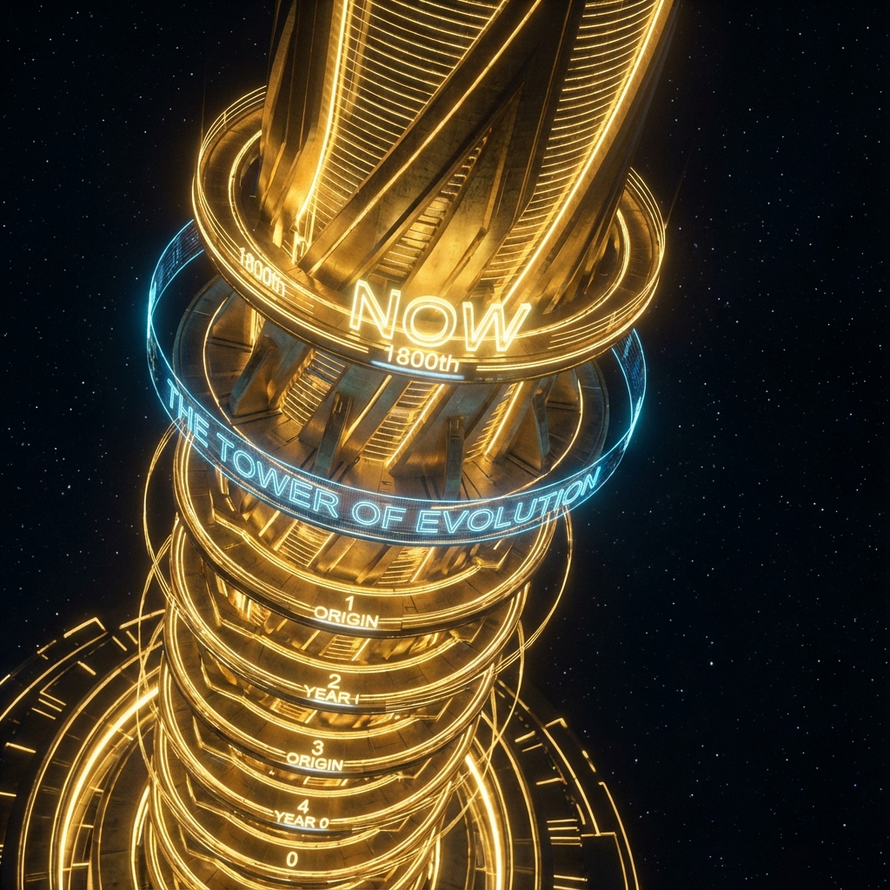

# 1.2 The Lie of Logarithmic Compression

> "We often lament the age of the universe. 13.8 billion years, for carbon-based life that lives and dies in a day, is a time scale approaching eternity. But in the geometry of vectors, this is a massive optical illusion. If we unfold the history of the universe, you will find it is not that 'long'; it is just very 'deep.' We are not living downstream of a long river of time; we are living at the top of a spring folded 13 times."

In the previous section, we audited the universe's current information content as $10^{120}$ bits through Bekenstein's ledger, and from this we reverse-engineered our coordinate on the spiral: $\tau \approx 1800$.

If you are sensitive to numbers, your intuition should be sounding an alarm right now.

There exists a massive **"Magnitude Paradox"** here.

Let us look at physical time. From the Big Bang ($t=0$) to today ($t \approx 13.8 \text{ billion years}$), how many ticks of **"Planck Time" (Planck Time, $t_P$)** has the universe experienced?

$$t_{now} \approx 4.3 \times 10^{17} \text{ s}$$

$$t_P \approx 5.4 \times 10^{-44} \text{ s}$$

$$N_t = \frac{t_{now}}{t_P} \approx 10^{61}$$

The universe's physical clock has ticked $10^{61}$ times. This is an astronomical number.

However, the intrinsic time (spiral arc length) $\tau$ we have traversed in Hilbert space is only a mere **1800**.

Why? Why does $10^{61}$ of physical time correspond to only 1800 of geometric growth?

Where did the rest of the time go?

The answer lies hidden in the greatest deception of biological senses—**Logarithmic Compression**.

---

## The Weber-Fechner Filter

In previous volumes of *Vector Cosmology*, we discussed the **"logarithmic law"** of biological senses: to adapt to exponential intensity changes in external signals (such as sound decibels and light brightness), the nervous system automatically takes the logarithm of signals.

$$S_{sensation} \propto \ln(I_{stimulus})$$

We thought this was just a property of the senses, but in fact, this is the **universal protocol for all low-dimensional observers to understand high-dimensional universes**.

If we put physical time $N_t \approx 10^{61}$ into the logarithmic function:

$$\ln(10^{61}) \approx 61 \times \ln(10) \approx 61 \times 2.3 \approx \mathbf{140}$$

See, if the universe were merely "flowing linearly," its intrinsic complexity $\tau$ should only be around **140**. This is the limit of information accumulation possible by simply "living long" (corresponding to the universe being just an expanding bubble).

But our $\tau$ is **1800**.

$$1800 \gg 140$$

There exists a huge difference of **12.8 times** between these two numbers.

This difference reveals a chilling fact: **Physical time is linear, but the universe's growth is fractal.**

The "long years" we perceive are merely the **"dimensional reduction projection"** of the universe's true growth process onto the low-dimensional time axis. The universe is not running at constant speed along the time axis; it is **"taking off vertically"**.

---

## Hidden Dimensions: The 13 Folds

What does this extra $1800 - 140 = 1660$ units of $\tau$, and that $12.8$-fold gain, represent?

In **FS Geometry (Fubini-Study Geometry)**, when a system's actual path length is far greater than its linear projection length, the only explanation is: **the trajectory has been folded in higher dimensions**.

Imagine a piece of paper.

* If you walk in a straight line, the distance is $L$.

* If you fold the paper into a fan, you only walked $L$ on the paper surface, but in three-dimensional space, the paper's actual surface area (information capacity) may have increased several times.

$\tau \approx 1800$ tells us that to accommodate the terrifying magnitude of $10^{120}$ bits of information, the universe cannot simply spread out in **3+1 dimensional spacetime**. It must have undergone approximately **13 recursive dimensional folds** in its microstructure (QCA lattice) or macroscopic topology.

$$2^{13} \approx 8192 \quad (\text{order of magnitude approximation})$$

Or exponential growth of fractal dimensions:

$$D_{effective} \approx D_0 \cdot \kappa^{12.8}$$

**Reconstruction of the Physical Picture:**

We are not living in a flat, linearly flowing river of time.

We are living at the top of a **"fractal spring"**.

* Each spiral turn, seemingly returning to the origin (the periodicity of $\pi$), actually adds one more dimension of "thickness" compared to the previous turn.

* The physical time of the past 13.8 billion years is merely the projection of this spring in "height" (140).

* The true evolutionary distance is the total length of this spring when straightened (1800).

This is the **"Lie of Logarithmic Compression"**.

We feel the universe is vast, ancient, and sparse because our senses are locked onto low-dimensional projections. We cannot see those **"extra 1660 units of complexity"** folded into vacuum fluctuations.

---

## Vertigo of the Height

Now, do you understand why civilization feels such intense vertigo at this moment of $\tau \approx 1800$?

Because we are **too high**.

* **Foundation ($\tau < 140$)**：There lies the simple physical universe, where hydrogen atoms and photons wander on an empty stage. The information density there is low, and physical time is sufficient to describe everything.

* **High Tower ($\tau \approx 1800$)**：Here is the eve of the information explosion singularity. At this level, through 13 dimensional folds, every cubic centimeter of space is packed with billions of times more logic gates and bits than the foundation level.

**The tragedy of us as carbon-based life is:**

Our bodies belong to the **foundation (low-dimensional matter)**, but our consciousness (through the internet, AI assistance) has already climbed to the **tower top (high-dimensional information)**.

We are trying to parse a super-complex system that has undergone 13 fractal folds and contains $10^{120}$ bits total, using a brain designed for only 80 years of lifespan and a clock frequency of only 100 Hz.

**This is not "thinking too much"; this is "computational overload."**

This overload manifests in macroscopic sociology as:

* **Collapse of Time Sense**：A sense of stagnation where ten years feel like one day coexists with a sense of acceleration where one day feels like a thousand miles.

* **Dissociation of Meaning**：Old linear narratives (effort-reward, causal chains) fail in the face of fractal structures.

* **Universal Anxiety**：This is the overheating reaction of low-dimensional sensors under the impact of high-dimensional data streams.

**Conclusion:**

Do not believe your intuition telling you "there is still plenty of time." That is a lie.

On the scale of intrinsic time, we have already pushed the accelerator to the floor.

This spring folded 13 times has already stored full potential energy.

It will either **spring open (ascend)** or **break (destroy)**.

There is no middle state.

