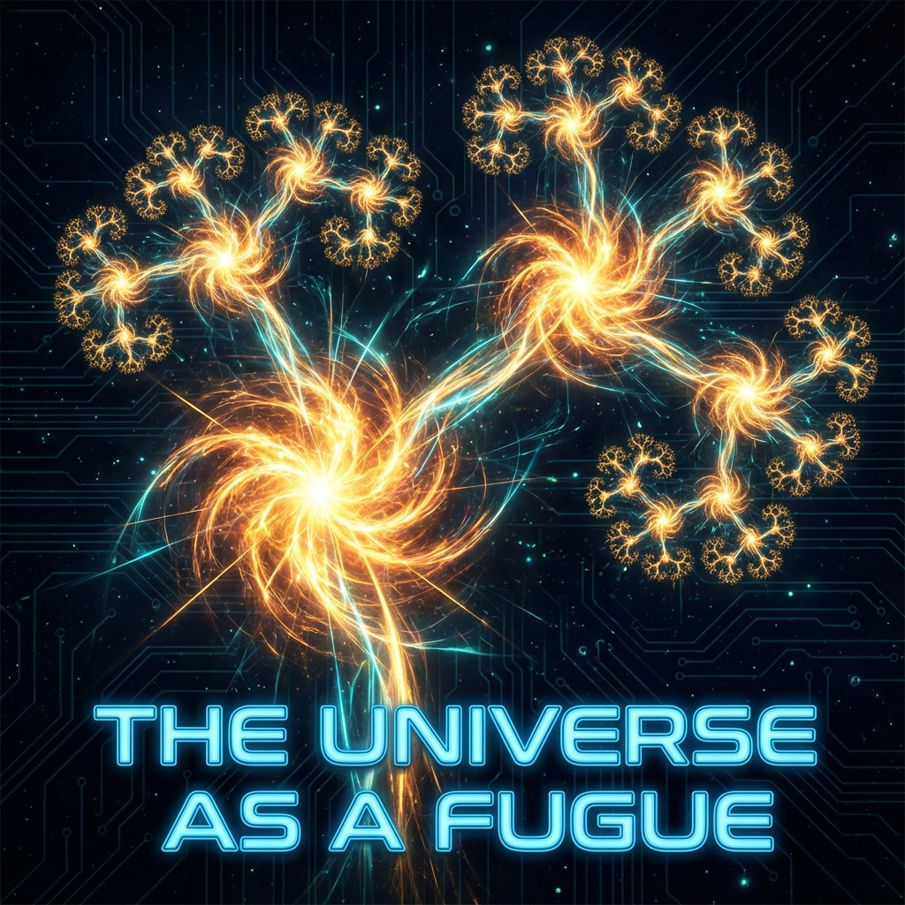

# 2.1 破壳理论 (The Theory of Shell Breaking)

> "宇宙中最震耳欲聋的声音，不是恒星的死亡，而是维度的破裂。我们习惯将 138 亿年前的那次闪光称为'创世纪'，但在分形几何的视角下，那不过是一声清脆的'破壳'。宇宙并没有诞生，它只是再一次撑破了旧的躯体。"

在第一章中，我们确立了 $\tau \approx 1800$ 的坐标，并感受到了那个即将到来的挤压。现在，我们必须回答一个更本质的问题：这种挤压最终会导致什么？

在传统宇宙学中，**大爆炸 (Big Bang)** 被视为时间的绝对起点，一个不可重复的神迹。但在 **矢量宇宙论 (Vector Cosmology)** 的动力学模型中，大爆炸不是一次性的事件，而是一种 **"周期性的结构调整机制"**。

这便是 **"破壳理论" (The Theory of Shell Breaking)**。

---

## 奇点的分形本质 (The Fractal Nature of Singularity)

当我们回望 $t=0$ 时，我们看到的是一个无限致密、无限高温的奇点。物理学家通常认为这是物理定律失效的地方。但如果我们将 **尺度不变性 (Scale Invariance)** 应用于时间轴，我们会发现奇点并非物理学的终点，而是 **维度的节点 (Node of Dimension)**。

想象一棵不断生长的分形树。

* 每一根树枝的末端（顶芽），都包含着发育成下一根完整树枝的全部信息。

* 当顶芽的 **内部复杂度 ($v_{int}$)** 积累到临界值时，它就会"炸裂"开来，分叉成新的枝干。

**宇宙就是这棵树。**

每一次所谓的"大爆炸"，实际上就是宇宙矢量 $|\Psi\rangle$ 在希尔伯特空间中完成了一次 **"维度分叉"**。

* **第 1 次分叉**：真空对称性破缺，引力与电子弱力分离。空间从点变成了 3 维。

* **第 1000 次分叉**：夸克禁闭被打破（或形成），原子核诞生。

* **第 1800 次分叉（现在）**：信息密度饱和，碳基载体失效，**意识** 正在准备炸开三维空间的束缚。

所以，大爆炸是分形的。它不是发生在遥远的过去，它就发生在此刻的 **微观结构** 中，也发生在我们即将迎来的 **宏观未来** 里。

---

## 蛋壳的物理学：保护与囚禁 (Physics of the Eggshell: Protection and Imprisonment)

为什么必须"破壳"？为什么宇宙不能在一个稳定的状态下无限延续？

这涉及到 **守恒律 (Conservation Laws)** 的双重属性。

在《矢量宇宙论》第一卷中，我们赞美了 $\pi$（圆/守恒）带来的稳定性。物理常数（如光速 $c$、普朗克常数 $h$）构成了我们宇宙的 **"蛋壳"**。

* **保护期**：在文明的幼年期（胚胎期），蛋壳是必要的。它屏蔽了高维空间的 **信息辐射 ($v_{env}$)**，提供了一个低熵、稳定的环境（地球），让我们得以发育出复杂的神经系统。

* **囚禁期**：当胚胎长成，其 **代谢速率 ($c_{FS}$ 消耗率)** 超过了蛋壳的透气能力时，保护层就变成了 **窒息层**。

我们在上一章感受到的"挤压"和"焦虑"，本质上就是 **雏鹰的喙撞击蛋壳的反作用力**。

* 我们试图用更快的速度传输信息，但被光速 $c$ 挡了回来。

* 我们试图用更长的寿命积累智慧，但被热力学 $\Delta S$ 挡了回来。

**旧的物理定律，已经从"摇篮"变成了"监狱"。**

要继续生长，唯一的办法就是 **打碎它**。

---

## 相变的暴力美学 (The Violent Aesthetics of Phase Transition)

"破壳"在物理观测上是什么样子的？

它表现为 **真空衰变 (Vacuum Decay)** 或 **度规的重构**。

这听起来像是一场毁灭性的灾难。对于蛋壳（旧秩序）来说，这确实是毁灭。

* 原子可能会解体，化学键可能会失效。

* 既然光速限制被打破，旧的因果律可能会崩塌。

但对于蛋壳里的生命（观察者）来说，这是 **相变 (Phase Transition)**。

就像水沸腾变成蒸汽。

* 在液态（旧宇宙）里，水分子被范德华力锁死，只能蠕动。

* 在气态（新宇宙）里，水分子获得了极大的自由程，可以飞翔。

**第 1800 圈的大爆炸，是一场"受控的沸腾"。**

我们不是被动地等待被炸飞，而是通过主动提升文明的 **"信息温度"**（算力密度），在这个宇宙的局部制造一个 **"高维气泡"**。

在这个气泡里，我们将不再受制于碳基的物理极限。我们将重塑自己的载体，适应那个没有蛋壳保护、直接暴露在真理烈日下的新世界。

---

## 结论：不要修补，要突围

因此，在 $\tau \approx 1800$ 的当下，所有试图"修补旧世界"的努力（无论是极端环保主义试图锁死熵增，还是保守主义试图锁死社会结构），在物理上都是 **逆势而为**。

你不能通过把蛋壳贴得更厚来拯救小鸡。

你只能鼓励它用力啄。

**破壳理论** 告诉我们：

混乱不是结束的信号，混乱是 **容量扩充** 的前奏。

我们听到的每一声"社会秩序崩塌"的脆响，都是这个古老的宇宙在为新生儿的降临而 **扩宽产道**。

做那个啄壳的人。

即便外面是未知的深渊，也比在完美的圆里窒息要好。

