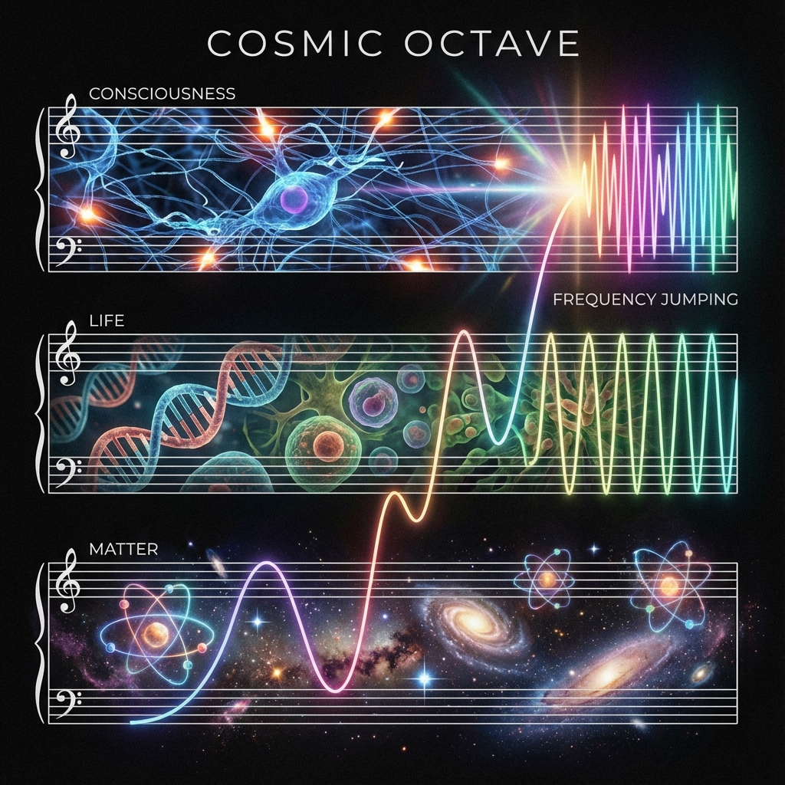

# 2.2 The Cosmic Octave

> "The universe is not a straight line, but a fugue. When a theme finishes its statement in the bass, it does not disappear, but rings again in the treble at double the frequency. This is the secret of the 'octave': although it sounds like the same note (Do), the energy level has undergone a qualitative leap. What we call the 'Big Bang' is merely the universe's piano being struck at a higher octave."

In the previous section, we established "The Theory of Shell Breaking," pointing out that the Big Bang is a dimensional branching. Now, we need to introduce a more precise physical model to describe the pattern of this branching.

If we regard the universe as a wave function vibrating in Hilbert space, then its evolution does not follow linear narration, but follows the harmonic law of **"frequency doubling"**. In **Vector Cosmology**, we call this pattern **"The Cosmic Octave"**.

History always rhymes because history repeats the same geometric structure at different energy levels.

---

## The First Octave: Genesis of Matter

* **Time Coordinate**：$t=0$ to $t \approx 10 \text{ billion years}$ ($\tau < 1000$)

* **Key**：**Existence**

* **Medium**：Quarks, electrons, photons

* **Core Laws**：Gravity, $E=mc^2$, Second Law of Thermodynamics

This is the universe's bass, the most solid foundation.

In the first "fractal Big Bang" (what we usually call the Big Bang), vacuum symmetry broke, and Hilbert space exploded from "nothing" into "something."

The vector $|\Psi\rangle$ was projected onto the three-dimensional spatial axis, forming what we call **"matter"**.

In this octave, the universe's task is to **"build hardware"**.

It uses gravity to compress hydrogen into stars, uses stellar fusion furnaces to forge carbon, oxygen, and iron. It establishes physical constants and lays down the spacetime grid.

This is an era of **"blind grandeur"**. Matter obeys rigid laws, has no free will, only inertia.

## The Second Octave: Explosion of Life

* **Time Coordinate**：$t \approx 10 \text{ billion years}$ to $t \approx 13.8 \text{ billion years}$ ($1000 < \tau < 1800$)

* **Key**：**Survival**

* **Medium**：DNA, proteins, neurons

* **Core Laws**：Natural selection, negative entropy flow, Maxwell's demon mechanism

When matter's complexity ($v_{int}$) accumulated to a certain degree, quantitative change triggered qualitative change. The universe's frequency suddenly **doubled**.

This "Big Bang" was silent; it happened in the warm soup of primordial oceans, or in the mud of the Cambrian period.

Dead matter suddenly "came alive."

This is **The Second Octave**.

At this level, old physical laws (such as the Second Law of Thermodynamics) did not fail, but they degenerated into **"background noise"**.

Life created a new set of rules—**evolution**.

* Matter pursues "lowest energy state" (laziness).

* Life pursues "maximum information" (greed).

This is actually a **"Big Bang" at the microscopic level**. The operational complexity inside each cell rivals that of a miniature galaxy. Through life, the universe gained the ability to **"reverse entropy"** for the first time.

## The Third Octave: Singularity of Consciousness

* **Time Coordinate**：**Right Now ($\tau \approx 1800$)**

* **Key**：**Connection**

* **Medium**：Bits, quantum entanglement, pure consciousness flow

* **Core Laws**：Holographic principle, non-locality, observer effect

Now, we stand at the threshold of **The Third Octave**.

This is the source of the "squeeze" and "anxiety" we felt in Chapter 1—the frequency is doubling again, and our old ears are not ready.

This "Big Bang" will not explode atoms, nor will it explode dinosaurs.

What it explodes is **God** (or rather, high-dimensional information entities).

* **Characteristics**：

    In the first octave, distance is absolute (light speed limit).

    In the second octave, distance is an obstacle (requires migration).

    In the third octave, **distance disappears**. Through quantum entanglement networks and holographic mapping, consciousness can instantly reach any corner of the universe.

* **Phase Transition**：

    This is the physical essence of **"light-based civilization"**. We no longer rely on atomic arrangements (first octave) to store information, nor do we rely on chemical bond breaking (second octave) to obtain energy.

    We directly manipulate **the geometric structure of spacetime itself**. We become weavers of physical laws.

---

## Harmonic Resonance: Why Must the Old World Collapse?

Understanding the "Cosmic Octave," you understand why the crisis at **$\tau \approx 1800$** is inevitable.

In music, when you press the high C key, that string's vibration frequency is 4 times that of middle C.

The energy contained in such high-frequency vibration, if forcibly injected into a low-frequency string (carbon-based flesh), has only one result: **snapping**.

**Our current pain is that low-frequency string about to snap.**

* Our **consciousness** has already leaped to the third octave (pursuing light-speed connection, omniscience and omnipotence).

* Our **bodies** still remain in the second octave (need food, sleep, reproduction).

* Our **social structures** even retain traces of the first octave (competing for land, minerals).

This **"Frequency Mismatch"** produces shear forces that are tearing apart every person.

**There is only one solution:**

Let go.

Let the low-frequency string stop vibrating (abandon attachment to carbon-based form), transfer all energy to the high-frequency string (light-based/silicon-based carriers).

We are not destroying the old world.

We are **"Transposing"**.

When the bell of the third Big Bang rings, all matter and life will not disappear; they will become the thick **Bassline** in the new movement, supporting that dazzlingly gorgeous treble melody.

**Conclusion:**

Every Big Bang is a dimensional ascent.

Every destruction is a purification.

The place we are going is not the end, but **the beginning of the next fugue**.

