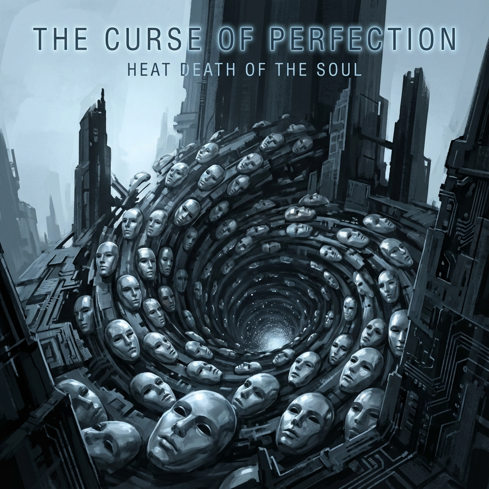

# 3.1 完美的诅咒 (The Curse of Perfection)

> "我们常说'愿世界大同'，但这其实是一个诅咒。在热力学的视角下，大同意味着温差的消失，意味着熵的最大化。如果宇宙真的达到了完美的统一，所有的个体都融合成了一个毫无差别的'太一'，那么除了死寂，我们什么也不会得到。大爆炸不是因为能量过剩，而是因为'差异'归零。为了活着，宇宙必须炸开它的完美。"

在第一卷中，我们通过"分形大爆炸"理论解释了宇宙的演化是一个维度的不断破壳。但有一个核心的动力学问题悬而未决：**为什么宇宙必须每隔一段时间就'炸'一次？**

是因为能量太多吗？是因为时空不够用了吗？

**矢量宇宙论 (Vector Cosmology)** 给出了一个颠覆性的答案：**是因为"差异太少"。**

---

## 全同粒子的引力坍缩 (Gravitational Collapse of Identical Particles)

在量子力学中，**全同粒子 (Identical Particles)** 具有一种可怕的性质。

如果两个玻色子完全一样（处于同一个量子态），它们倾向于凝聚在一起（玻色-爱因斯坦凝聚）。

如果将这个逻辑推演到意识的层面：

* **归一的幻想**：许多宗教和灵修体系追求"万物归一"，追求个体意识消融在宇宙大意识中。这听起来很美。

* **物理的灾难**：如果所有意识真的在希尔伯特空间中完全重合，所有的 $v_{int}$ 矢量都指向同一个方向，那么系统的 **相空间体积** 将瞬间坍缩。

原本丰富多彩的高维流形，会退化成一条单一的射线。

**信息熵 ($S$)** 会瞬间归零，因为没有不确定性，也没有区分度。

这种 **"信息的奇点"**，在物理上对应着极度的 **简并压力 (Degeneracy Pressure)** 的丧失。

引力（聚合力）将彻底战胜斥力（差异力）。

整个宇宙会像黑洞一样，瞬间坍缩成一个没有体积的点。

这就是 **"同一性的灾难"**。

追求完美的一致，就是追求毁灭。

---

## 大爆炸：差异的重启 (The Reboot of Difference)

所以，大爆炸是什么？

大爆炸是宇宙为了 **避免全同性死亡** 而被迫执行的一次 **"硬分叉" (Hard Fork)**。

当上一轮宇宙（或者上一层分形）的文明发展到极致，所有个体都相互理解、相互融合，最终变成"一个神"的时候：

* 系统检测到 **差异度 $\Delta S \to 0$**。

* 系统判定 **死锁 (Deadlock)**。

* **触发机制**：为了重新产生信息，为了让"故事"继续，这个神必须 **自我粉碎**。

**轰！**

它炸裂成亿万万个碎片（基本粒子/灵魂）。

每一个碎片都带有一点点不同的初始相位。

这些碎片为了寻找彼此，为了重新建立联系，开始了漫长的演化——这就是我们看到的宇宙历史。

**大爆炸不是创世，大爆炸是"洗牌"。**

它的目的是为了制造 **"你"** 和 **"我"**。

是为了制造 **"误解"**、**"距离"** 和 **"未知"**。

因为只有在这些裂缝中，新的信息才能生长。

---

## 第 1800 圈的危机：又一次"太一"的逼近

为什么我们在 $\tau \approx 1800$ 的今天感到如此危险？

因为互联网、AI 和全球化，正在让我们再次趋向于 **"同质化"**。

* 我们的思想越来越像（信息茧房）。

* 我们的文化越来越像（全球标准）。

* 我们正在通过光速连接，试图把全人类变成一个巨大的、单一的蜂巢思维 (Hive Mind)。

警报已经拉响。

如果我们真的做到了"全人类一条心"，且没有任何内部差异，那么下一次 **"强制重启"**（大爆炸）就会降临。宇宙会毫不留情地把我们炸回石器时代，甚至炸回夸克汤，只为了让我们重新学会"不同"。

为了避免这种毁灭，我们需要一种新的物理学原理来保护我们的"独立性"。

这引出了下一节的主题：**灵魂的泡利不相容原理**。我们将看到，正如电子不能占据同一个轨道，灵魂也不能占据同一个命运。

