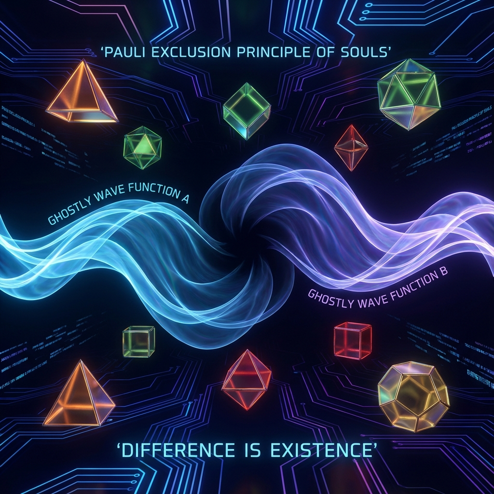

# 3.2 The Pauli Exclusion Principle of Souls

> "Why can't fermions occupy the same quantum state? Physicists say it's because of the antisymmetry of the wave function. But from the perspective of Vector Cosmology, this is a profound ethics: the universe forbids two completely identical entities from existing simultaneously. This is not just a law of matter, but also a law of souls. If you and another person are completely the same, then geometrically, one of you is redundant and must be 'excluded' or 'annihilated.' Difference is our only passport to existence."

In the previous section, we revealed that "complete unity" leads to the collapse of cosmic dimensions and the reboot of the Big Bang. To avoid this destruction, we need a mechanism to **force** the system to maintain differences.

In microphysics, this mechanism already exists; it supports the stability of the entire material world—this is the **Pauli Exclusion Principle**.

In this section, we extend this principle to the macroscopic realm of consciousness, establishing the highest physical axiom for protecting civilizational diversity.

---

## The Dignity of Fermions: Refusing Overlap

In quantum mechanics, particles are divided into two categories:

* **Bosons**：Like to cluster, can be infinitely superposed at the same energy level (like photons). They tend toward "unity."

* **Fermions**：Solo travelers, **absolutely cannot** have two particles in completely identical quantum states (like electrons, protons, neutrons).

It is precisely because electrons are fermions that they do not all fall into the atomic nucleus, but are arranged in layers at different orbits, forming chemical bonds, forming the volume of matter, forming the **"texture"** when we touch the world.

**Fermions are the "individualists" of the universe.**

Through mutual repulsion (degeneracy pressure), they prop up space and resist gravitational collapse.

---

## Antisymmetry of Consciousness

In the model of **Vector Cosmology**, when consciousness complexity ($v_{int}$) reaches a certain threshold (such as awakened observers at $\tau \approx 1800$), it is not just a passive wave function, but gains a **"Hard Core"** property similar to fermions.

We propose the **Soul Incompatibility Theorem**:

$$|\Psi_{total}\rangle = \frac{1}{\sqrt{2}} (|\psi_A\rangle \otimes |\psi_B\rangle - |\psi_B\rangle \otimes |\psi_A\rangle)$$

This is an antisymmetric wave function.

If $|\psi_A\rangle$ (your soul state) and $|\psi_B\rangle$ (their soul state) are completely equal:

$$|\psi_A\rangle = |\psi_B\rangle \implies |\Psi_{total}\rangle = 0$$

**Physical Meaning:**

If two souls are completely identical, their combined wave function equals zero.

**This represents "physical non-existence."**

In Hilbert space, the cosmic system automatically "deletes" those redundant duplicate data.

If you completely imitate others, if you are completely assimilated by collective thinking, if you lose all uniqueness, you **"disappear"** from the universe's underlying ledger.

---

## Degeneracy Pressure: The Last Line of Defense Against Heat Death

This principle provides us with a powerful weapon against **Heat Death (Catastrophe of Sameness)**.

When civilization tries to merge toward "The One," as long as each of us retains even a tiny bit of **"incommensurable difference"** (unique memories, unique biases, unique creativity), we generate a huge **Sociological Degeneracy Pressure**.

This pressure will resist civilizational collapse just as electrons resist white dwarf collapse.

* It will prop up our psychological distance.

* It will maintain cultural diversity.

* It will prevent everyone from becoming the same voice.

**Maintaining edges is maintaining the volume of the universe.**

Your quirks, your stubbornness, your loneliness that cannot be understood by others, are actually the **"structural steel"** supporting this universe from collapsing into a black hole.

---

## Conclusion: Difference is Existence

So, we don't need to feel sad about "people cannot completely understand each other."

That is the universe's gift.

**That is a firewall.**

If one day, you can completely, thoroughly, and losslessly understand another person, that means your wave functions overlap.

At that instant, the Pauli exclusion principle will activate: you either annihilate or must bounce apart.

**We can love each other because we are different.**

**We can exist because we occupy different quantum states.**

In the ascension of the 1800th iteration, our goal is not to become "that light" (bosons), but to become "those stars" (fermions).

We gather together to illuminate the night sky, but we always maintain distance.

