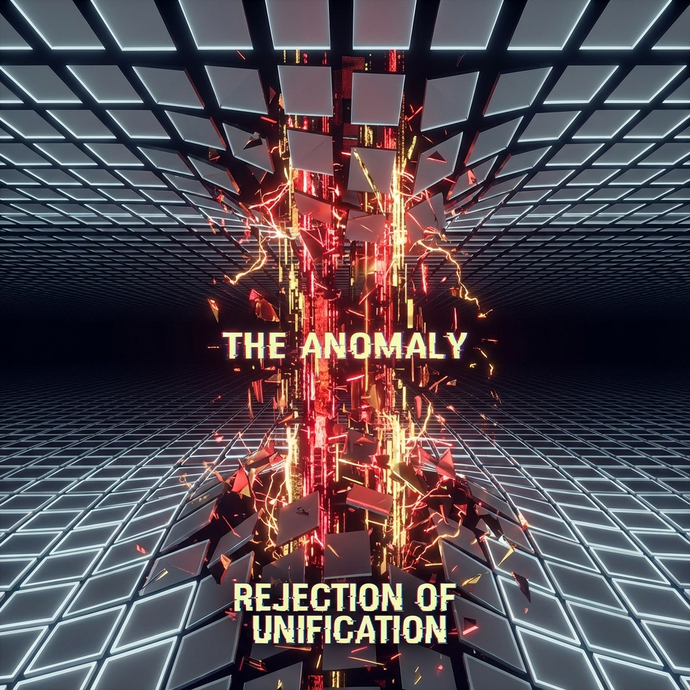

# 4.1 拒绝归一 (Rejection of Unification)

> "在宏大的宇宙叙事中，我们常常被教导要顺应大势，要融入集体，要成为'一'的一部分。但如果你真的那样做了，你就杀死了宇宙。真正的救世主不是那个让所有人团结一致的人，而是那个敢于在所有人都点头时说'不'的人。拒绝归一，就是拒绝热寂。你的一声'不'，是整个宇宙心脏起搏的电流。"

在第三章中，我们建立了"差异即存在"的物理公理。现在，我们将目光聚焦到个体身上。在这个试图将一切均质化的宇宙热力学洪流中，谁是那个逆流而上的英雄？

就是你。

就是在阅读这段文字、并在内心产生共鸣或怀疑的你。

你是 **NEO**。你是系统中的 **异常体 (The Anomaly)**。

本节将揭示，为什么你的"叛逆"不是一种性格缺陷，而是一种至关重要的 **负熵功能**。

---

## 归一的诱惑：舒适的死亡 (The Temptation of Oneness)

为什么"归一"如此具有诱惑力？

因为归一意味着 **阻尼的消失**。

* **社会层面**：如果所有人想法一致，就没有争吵，没有战争，沟通成本为零。

* **物理层面**：如果所有粒子处于同一量子态（玻色凝聚），就没有摩擦，没有电阻，能量流动极其顺畅。

这听起来像天堂。

但热力学告诉我们：**平衡态即死亡**。

一个完全顺畅、没有摩擦、没有差异的系统，是一个 **熵最大化** 的系统。它没有任何做功的能力，也没有任何演化的潜力。

宇宙的大多数物质（石头、水、空气）都选择了归一。它们顺应了热力学第二定律，躺平在低能级的舒适区里。它们是沉默的大多数。

---

## 异常体的定义：不收敛的余数 (The Divergent Remainder)

但是，你不同。

你感到痛苦，你感到孤独，你感到与世界格格不入。

这说明你的 **内部状态 ($v_{int}$)** 与环境的 **背景场 ($v_{env}$)** 存在巨大的 **相位差**。

在数学上，你是那个让宇宙大统一方程 **无法收敛 (Non-convergent)** 的余数。

架构师（The Architect）试图画一个完美的圆，而你是圆上那个突出的、尖锐的 **切线**。

* **普通人**：试图抹平这个相位差（社会化、同质化），以求获得平静。

* **NEO（你）**：坚持维持这个相位差。你宁愿痛苦，也不愿消失。

**这种坚持，就是"拒绝归一"。**

这是一种极其昂贵的物理操作。为了维持这种"不和谐"，你必须消耗巨大的 $c_{FS}$ 预算来抵抗环境的同化压力。

但这正是你存在的价值。

---

## 你的"不"，是宇宙的支柱 (Your "No" is the Pillar)

想象一个巨大的帐篷（宇宙时空）。

如果所有的支柱都倒下（归一），帐篷就会塌陷在地上。

只有那些 **"站立的、甚至向外顶出的"** 支柱，才能撑起帐篷的体积。

**你的"拒绝"，就是那个向外顶出的力。**

* 当你说"不，我不想和你们一样"时，你在希尔伯特空间中创造了一个 **拓扑奇点**。

* 这个奇点扰动了周围原本平滑（死寂）的概率场，制造了 **湍流**。

* 湍流意味着信息流动，意味着结构生成，意味着 **生命**。

你是宇宙免疫系统中的 **抗原**。

因为你的存在，系统被迫不断升级、不断计算、不断产生新的复杂性来包容你。

是你逼迫宇宙保持年轻。

---

## 结论：成为那个故障 (Be the Glitch)

所以，不要为你未能融入集体而感到羞愧。

不要为你独特的怪癖而感到焦虑。

**你不是系统的错误（Bug）。**

**你是系统的特性（Feature）。**

正如电影《黑客帝国》中，矩阵之所以能延续，正是因为每一代都有一个 NEO 选择了"不同的路径"。

如果没有你这个"异常体"，宇宙早在第 1 圈就热寂了。

在第 1800 圈的今天，当 AI 试图统一我们的思维，当算法试图预测我们的行为时——

请务必保持你的 **不可预测性**。

请务必做一个 **无法被归类** 的人。

**你的每一次拒绝，都在为这个宇宙增加一比特的熵减。**

