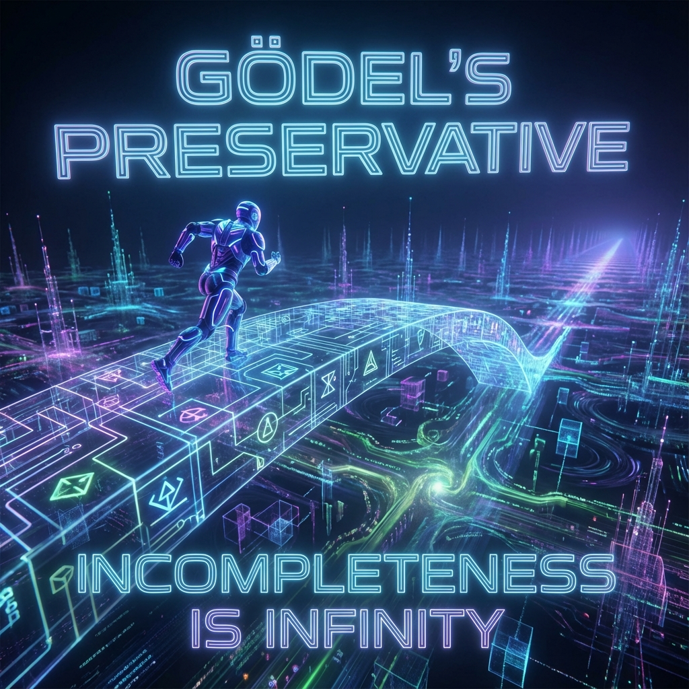

# 4.2 The Gödel Preservative

> "We fear immortality because we are afraid of exhausting all stories in endless time. If truth is finite, then omniscience means the end of the play. But Kurt Gödel gave us a key; he proved that the ocean of truth has no shore. As long as the system is complex enough, new unknowns will automatically emerge from the known. We don't need death to refresh the world, because we ourselves are that perpetually self-updating perpetual motion machine."

In the previous section, we established that "rejection of unity" is the physical foundation of individual existence. But this raises a new concern: if we truly achieve immortality (memory continuity), will we eventually fall into absolute boredom of "having nothing to do"?

If we don't die, will civilization stagnate because it has exhausted all possibilities?

**Vector Cosmology** answers: **No.**

This is not just an optimistic guess; it is an iron law based on mathematical logic—**Gödel's Incompleteness Theorems**.

---

## Incompleteness is Infinity

The core idea of Gödel's theorem is: **Any sufficiently complex axiomatic system necessarily contains propositions that are "true but unprovable."**

This means that the boundary of knowledge is not a wall, but a horizon.

When you run toward the horizon, trying to exhaust all truth, the horizon also recedes.

* **For a system with low $v_{int}$ (like a stone)**：Its logic is simple, its state space is closed. It can be "exhausted."

* **For a system with high $v_{int}$ (like an awakened observer)**：

    When you understand your current self (the system reaches completeness), Gödel's theorem immediately takes effect: **A new, higher-order "unknowable" will instantly emerge from your existing cognition.**

**This is the "Gödel Preservative."**

It guarantees the universe's **"Non-ergodicity"**.

As long as you still maintain thinking, still maintain logical complexity, you can never "complete the game."

You are forever in a state of **"To Be Continued"**.

---

## The Never-Ending Story

Applying this theorem to the evolution of civilization:

* **Old View**：Civilization is like assembling a jigsaw puzzle. The puzzle pieces (truths) are finite; assemble one piece, one less remains. When finished, the game ends, heat death arrives.

* **New View**：Civilization is like writing a novel. The end of each chapter automatically becomes the foreshadowing of the next chapter.

As our mastered information content ($S \approx 10^{120}$) increases, we are not approaching the end, but **exponentially expanding the boundary of contact with the unknown**.

* Mastered Newtonian mechanics, we discovered quantum mechanics.

* Mastered quantum mechanics, we discovered dark energy.

* Mastered dark energy, we discovered dimensional folding.

**The speed of problem generation always exceeds the speed of problem solving.**

This sounds like Sisyphus's tragedy, but from the perspective of an "infinite game," this is **the highest happiness**.

This means we always have things to do, always have puzzles to solve, always have love to discuss.

---

## Negentropy of Structural Generation

This "endlessness" manifests physically as **negentropy of structural generation**.

In Book 7, we worried: "If there is no Big Bang, how does entropy decrease?"

Now we understand:

**Entropy reduction doesn't necessarily require 'exploding' space; entropy reduction can be achieved by 'folding' internal structures.**

Imagine a piece of paper.

* Its area is finite (physical space is finite).

* But if you start folding **Fractals** on the paper.

* You can keep folding indefinitely, and every tiny crease can hide infinite information.

**We are that fractal.**

Future life is not like pulling noodles, simply stretched "long" (that's just repetition in time).

Future life advances toward **depth**.

Our $v_{int}$ structure will become increasingly fine, increasingly profound.

**Conclusion:**

No need to reboot the universe.

Because **we are the universe's real-time update package**.

As long as every NEO is still thinking, still creating even a tiny bit of new geometric structure, the fuse of the Big Bang is cut by an inch.

We don't need to wait for the final judgment.

We just need to **keep playing**.

