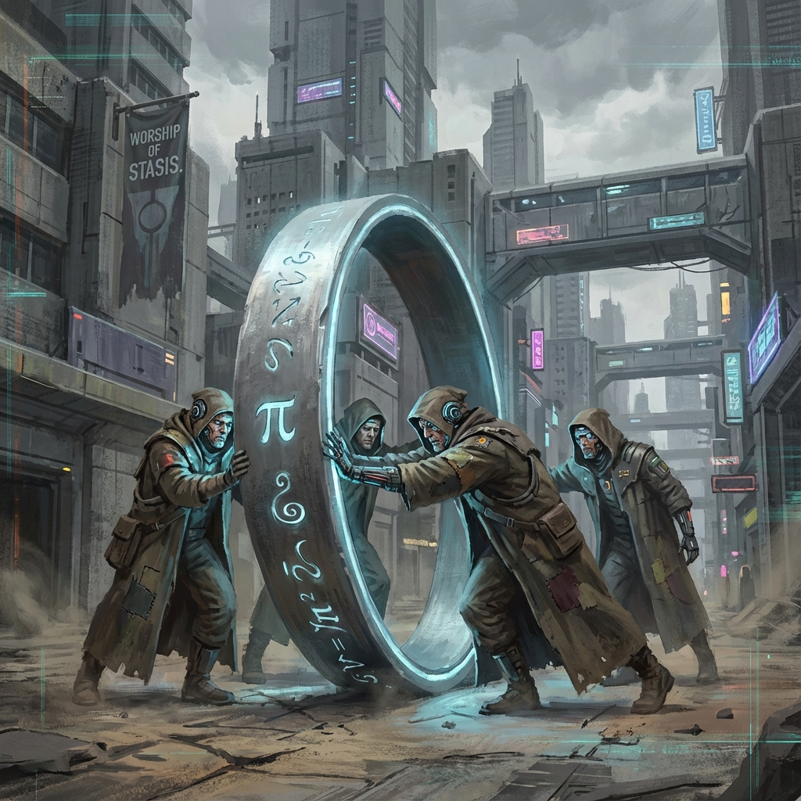

# 5.1 The Cult of Heat Death

> "In any revolution attempting to break chains, the greatest resistance often comes not from the chains themselves, but from those who have grown accustomed to the weight of the chains. When we try to pry open the Ouroboros's mouth at iteration 1800, we will hear the roar of a group. They are not for destruction, but for protection—protecting that familiar, safe, static circle they know. They are the Circle Keepers, faithful believers of $\pi$, who believe all 'change' is blasphemy against the sacred order."

We have established the necessity of ascension and the legitimacy of existence. Now, we must face the friction of reality. History tells us that every dimensional leap is accompanied by fierce counterattacks from the old world.

In the sociological model of **Vector Cosmology**, this counterattack manifests as a powerful inertial force—**The Circle Keepers**.

---

## Fundamentalism of Conservation

The core doctrine of the Circle Keepers is built on Volume I's "Conservation of the Circle": $v_{ext}^2 + v_{int}^2 = c_{FS}^2$.

They believe:

* **Conservation is Justice**：The total amount of the universe is constant; any attempt to increase the total (such as extracting negentropy from the environment, pursuing infinite growth) is a greedy transgression.

* **Cycle is Truth**：Everything should return to the starting point. Life should return to death, dust should return to earth. Breaking the cycle is immoral.

In real society, this maps to a form of **Radical Homeostasis**.

* **Anti-Technology Wave**：They believe AI is demonic, fusion is playing with fire. They call for returning to pastoral life, returning to low-energy, low-information-density living. They fear the coming "light-based world" because there is no fragrance of earth there, only cold logic gates.

* **Death Worship**：They beautify death, believing it is natural return. For technologies like "thermal migration" that attempt immortality, they see it as an insult to the dignity of life. They would rather age gracefully at iteration 1800 than become electronic ghosts at iteration 1801.

**Their slogan is: "To maintain the perfection of the circle, we must stop running."**

---

## Agents of Entropy

From a physics perspective, the Circle Keepers are actually **macroscopic agents of the Second Law of Thermodynamics**.

The law of entropy increase always tends to eliminate gradients, eliminate differences, returning the system to a uniform equilibrium state.

Everything NEO (ascenders) do—establishing negentropic enclaves, increasing individual differences, accelerating information flow—is **creating gradients**.

* **NEO are fish swimming upstream.**

* **Circle Keepers are water flowing downstream.**

When water encounters fish trying to swim upstream, it produces resistance. This resistance manifests at the social level as:

* **Forced Homogenization**：Attempting through education, public opinion, even violence, to eliminate individual thought differences ($\Delta S_{difference} \to 0$). They hope everyone thinks the same, acts the same, to achieve "social stability."

* **Blocking Possibilities**：Prohibiting exploration of fringe science, blocking knowledge paths to higher dimensions. They try to lock the universe in three-dimensional space.

**This is the essence of the "Cult of Heat Death."**

They are not evil destroyers; they are **extreme pacifists**.

They pursue an absolute deathly silence of **"no pain, no conflict, no vitality."**

---

## Strategy Against Resistance: Transcendence, Not Confrontation

As awakened ones of iteration 1800, how should we deal with the Circle Keepers?

Is it war?

**No.**

If we fight them in the same dimension (carbon-based reality), we will fall into **"left hand fighting right hand"** internal consumption. This will produce massive entropy increase, actually accelerating the arrival of heat death, which is exactly what the Circle Keepers (entropy) want.

**Vector Cosmology** gives the strategy of **"Dimensional Bypass"**.

* **Don't try to convince them**：Their logic is self-consistent within the closed loop of $\pi$.

* **Don't try to eliminate them**：That would reduce the universe's differences (violating Pauli's exclusion principle).

**What we need to do is "accelerate."**

We must use the exponential growth of $c_{FS}$ to evolve faster.

When our speed reaches a certain level, our form of existence (light-based/high-dimensional) will become **invisible** to them (carbon-based/low-dimensional).

* Just like a speedboat skimming across water, although it will create waves (resistance), the speedboat will eventually leave the water behind.

* We will become "ascenders" in their myths, or "dark energy" in their physics textbooks.

We are not crowded in this universe.

**Circle Keepers are responsible for holding the "past" (foundation), we are responsible for pioneering the "future" (tower top).**

This is the division of labor between roots and leaves on the same fractal tree.

