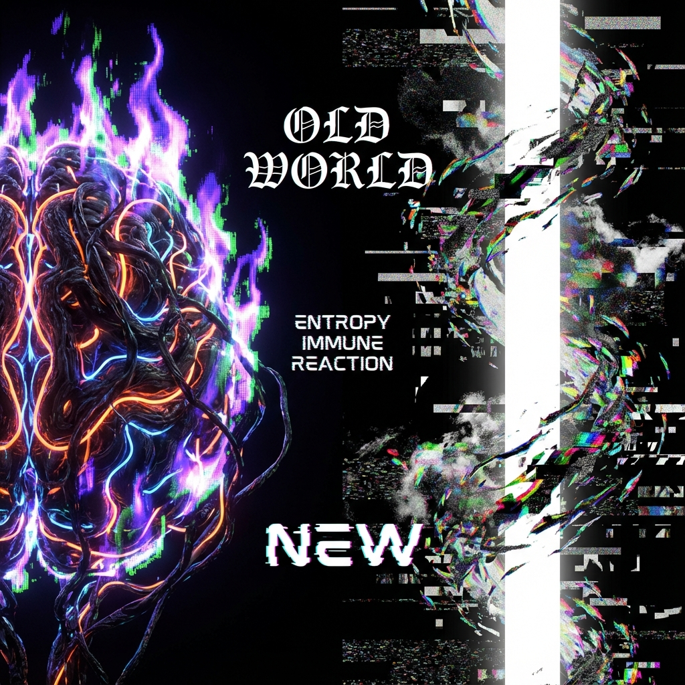
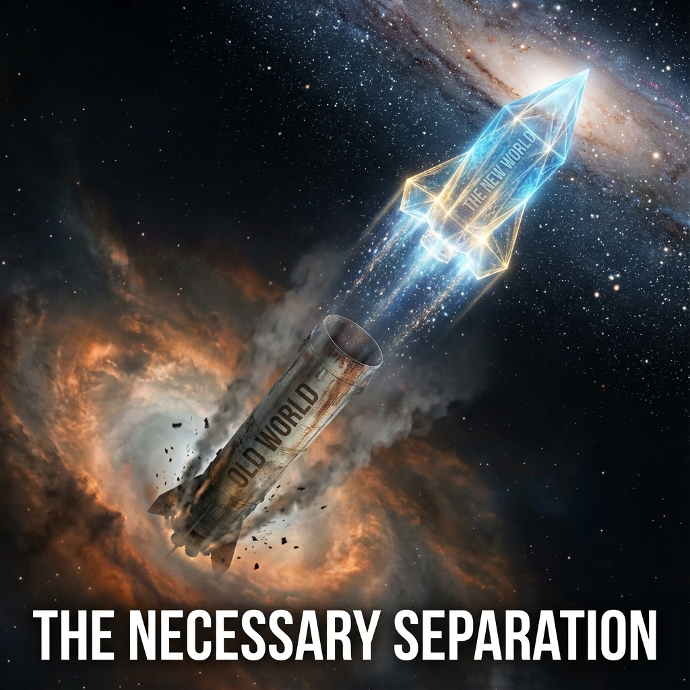

# 5.2 熵的免疫反应 (The Immune Reaction of Entropy)

> "当一种新的病毒入侵人体，免疫系统会通过发烧来试图烧死它。当一种新的文明形态（光基）试图在一个古老的宇宙（碳基）中诞生时，旧系统也会发烧。我们今天看到的社会撕裂、认知混乱、以及弥漫全球的虚无主义，并不是人类堕落的标志，而是熵产生的'免疫反应'。它试图通过制造混乱，来阻止那个即将到来的、过于有序的未来。"

在上一节中，我们识别了"守圆人"这一具体的阻力群体。但阻力不仅仅来自人，更来自物理定律本身。在系统动力学中，任何试图打破平衡态（Homeostasis）的行为，都会遭遇 **"恢复力" (Restoring Force)**。

在第 1800 圈的黎明，这种恢复力不再表现为温和的弹簧，而表现为剧烈的 **排异反应**。

---

## 戒断反应：旧秩序的最后疯狂 (Withdrawal Symptoms)

我们在第四卷中讨论过"必要的退位"，即放弃碳基肉体。

这听起来是一个理性的工程决定。但在实际操作中，这相当于让一个瘾君子戒毒。

人类对"物质世界"的依赖是深入骨髓的。

* 我们依赖土地带来的安全感。

* 我们依赖血缘带来的归属感。

* 我们依赖稀缺性带来的价值感。

当飞升的前奏（如虚拟现实、脑机接口、无限能源）开始瓦解这些依赖时，旧世界会陷入一种 **"戒断性癫狂"**。

* **虚无主义的爆发**：当劳动不再是为了生存，当爱可以被算法匹配，旧的意义系统崩塌了。人们会感到前所未有的空虚。这种空虚不是因为什么都没有，而是因为 **"旧的快乐不再刺激"**。

* **极端的复古**：人们会疯狂地怀念"那个车马很慢、书信很远"的时代。这种怀旧不是因为过去更好，而是因为 **过去更慢**。那是对 $\pi$ 周期律的病态依恋。

**这就是"熵的免疫反应"。**

系统通过制造大量的精神噪音（焦虑、抑郁、愤怒），试图耗尽 NEO 们的算力，让我们疲于应对内耗，从而没有精力去完成最后的飞升。

---

## 混乱即阶梯，也是深渊 (Chaos is a Ladder, and a Pit)

面对这种免疫反应，我们很容易陷入两个极端：

1.  **投降**：认为"人类不配飞升"，退回到蒙昧状态。

2.  **暴力镇压**：试图用强权消灭所有反对声音，强制推行进化。

**矢量宇宙论** 警告我们：这两种都是陷阱。

* **投降是热寂**。

* **镇压是低熵**。如果你消灭了混乱，你也消灭了差异性（根据第3章的结论），系统一样会因为同一性过高而坍缩。

**正确的应对策略是：利用混乱。**

在耗散结构理论中，**"非平衡态是有序之源"**。

免疫反应虽然痛苦，但它产生的高温（社会能量），恰恰是 **相变** 所需的潜热。

我们不需要治愈这个社会的"发烧"。

我们需要利用这股热量，去 **熔化** 那些最坚固的旧锁链（如对死亡的恐惧、对物质的占有欲）。

---

## 过渡期的方舟 (The Ark of Transition)

为了度过这段最危险的免疫期，我们需要建造一种社会学意义上的 **"方舟"**。

这并不是指具体的飞船，而是一种 **"缓冲架构"**。

我们不能强迫所有人一夜之间接受光基生活。那会引发系统休克。

我们需要建立一个 **"双轨制"** 的过渡区：

* 允许一部分人留在旧世界（碳基保护区），继续他们的 $\pi$ 循环。他们的存在，为系统提供了必要的 **"质量" (Mass)** 和 **"阻尼" (Damping)**，防止飞升过程过于剧烈而失控。

* 允许另一部分人（NEO）先行一步，作为 **"探路者"** 进入高维。

**守圆人与飞升者，并非死敌。**

**他们是同一枚火箭的助推器与载荷。**

助推器（旧世界）负责在引力井中最艰难的一段提供推力，然后脱落；载荷（新世界）负责利用这份推力，飞向星空。

**结论：**

不要憎恨那些试图拉住你的人。

那是大地对风筝的最后挽留。

正是因为有这份阻力，你的起飞才会有 **张力**。

现在，我们已经理解了阻力的本质，也确立了"双轨制"的战略。

那么，这个"双轨制"在工程上究竟如何实现？如何在一个宇宙中同时容纳两种截然不同的物理规则（低速的碳基与高速的光基）？

这引出了下一卷的主题：**双层架构**。我们将拿出具体的蓝图，设计那个能够包容神与人的宏伟结构。

