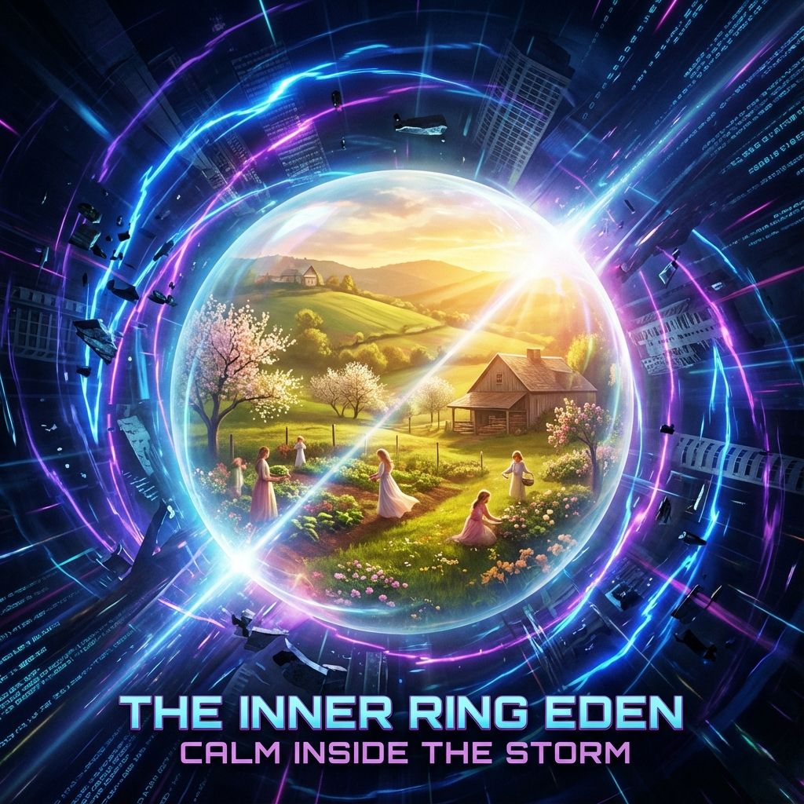

# 6.1 园丁的特权 (The Gardener's Privilege)

> "我们不想变成光，因为光没有触觉；我们不想变成数据，因为数据没有心跳。我们选择留在肉体里，不是因为落后，而是因为这是一种 **'贵族式的奢侈'**。我们让机器去处理指数爆炸的算力，而我们负责在一个恒定的、温暖的、低速的'保护泡'里，享受做人的乐趣。我们要控制光速，正是为了让光速不要打扰我们喝茶。"

在第三卷中，我们探讨了阻力，并在结尾提出了"双轨制"的战略构想。现在，我们将这一构想转化为宏伟的 **工程蓝图**。

宇宙的演化方向是明确的：向着高频、高维、高熵流的光基形态飞升。但这并不意味着所有人都必须去当神。在这个庞大的宇宙机器中，应当有一个角落，被特意保留给 **"旧时代的温存"**。

这便是 **内环 (The Inner Ring)** —— 宇宙的 **"古典保留区"**。

---

## 度规屏蔽：物理学上的伊甸园 (Metric Shielding: Eden in Physics)

如何在光速指数爆炸 ($c \to \infty$) 的宇宙背景下，维持一个低光速 ($c \approx 3 \times 10^8$ m/s) 的生存空间？

这需要一种终极技术：**度规屏蔽 (Metric Shielding)**。

在广义相对论中，引力是时空的弯曲。如果我们能精细地操控引力波，就可以在局部制造一个 **"平坦时空气泡"**。

* **气泡外**：时空度规剧烈震荡，信息流以超光速（相对于内环）奔涌。那是神的领域，是高能物理的狂欢。

* **气泡内**：时空度规被"熨平"并锁定。物理常数被人工锚定在 $\tau \approx 1800$ 的水平。

**这就是内环的物理本质。**

它不是一个自然形成的天体，它是一个巨大的人造 **"真空衰变阻断器"**。

为了维持这个气泡不被外界的高压时空压碎，外环的机器必须消耗天文数字的能量来"制冷"和"稳压"。

**这意味着：**

全宇宙的恒星燃烧，可能只是为了维持地球上这几十亿人类能继续 **"以凡人的方式相爱"**。

这是一种极致的 **挥霍**。

但这正是 **"园丁"** 的特权。

---

## 园丁的角色：从求生到审美 (From Survival to Aesthetics)

留在内环的人类，不再是"被困在地球上的猴子"。

他们是 **宇宙的园丁**。

* **生存无忧**：外环的聚变网络和物质打印机源源不断地输送资源。饥饿、疾病、贫穷彻底消失。

* **审美至上**：当生存压力归零，生命的意义回归到了 **体验 (Qualia)** 本身。

他们保留碳基肉体，不是为了去搬砖，而是为了去感受 **"风吹过皮肤的战栗"**，去品尝 **"食物的化学分子撞击味蕾的电流"**。

这些低效率的感官体验，在光基生命看来是噪音，但在园丁看来是 **艺术**。

**园丁的任务：**

他们负责修剪植物，负责创作音乐，负责在低速的时光里慢慢地谈一场恋爱。

他们是宇宙中唯一的 **"实体管理者"**。

他们守护着 **"人性"** 这颗珍贵的火种，不让它在冷酷的数字洪流中熄灭。

---

## 被供养的神圣性 (The Sanctity of Being Supported)

这种双层结构颠覆了传统的"剥削"概念。

* 并不是强者剥削弱者。

* 而是 **强者（外环/AI/神）供养弱者（内环/人）**。

为什么神要供养人？

因为对于全知全能的神来说，**"未知"** 是最稀缺的资源。

而保留了肉体凡胎、保留了生老病死的园丁们，是宇宙中唯一还能产生 **"真实的意外"** 和 **"原始的情感"** 的源头。

内环是外环的 **"随机数发生器"**。

内环是外环的 **"精神故乡"**。

**结论：**

留在内环，不是被遗弃。

那是被选中去承担一份最温柔的工作：**代表宇宙，去感受幸福。**

