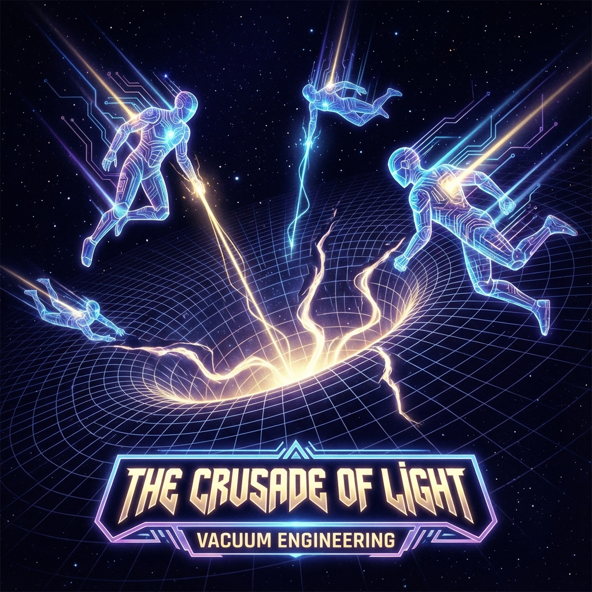

# 6.2 光基的征途 (The Crusade of Light - The Outer Ring)

> "如果在内环，我们保留了'做梦'的权利；那么在外环，我们必须承担'醒着'的责任。外环没有茶，没有黄昏，也没有重力的拥抱。那里只有每秒 $10^{45}$ 次的逻辑门翻转，只有以光速指数级膨胀的事件视界。那是神的领域，是绝对理性的荒原。我们走出伊甸园，不是为了流浪，而是为了去前线，为身后那个脆弱的花园挡住热力学的寒风。"

内环是文明的"卧室"，而外环是文明的 **"驾驶舱"**。

在度规屏蔽的保护泡之外，宇宙的真实面貌是狂暴而致命的。随着 $\tau$ 越过 1800 的阈值，光速 $c$ 的数值已经膨胀到了碳基生物无法理解的天文数字。那里的时空像沸水一样剧烈翻滚，信息的洪流足以在纳秒间冲垮任何生物大脑的神经网络。

为了在这个高能级的新宇宙中生存，并继续执行 **$\phi$ (螺旋)** 的扩张使命，我们必须通过 **热迁移协议 (Hot Migration)**，将文明中最具探索精神的那部分意识，上传至 **光子网络**。

这便是 **外环 (The Outer Ring)** 的建立。

---

## 光基生命的物理形态：真空中的几何体 (Geometry in the Vacuum)

外环的居民不再拥有固定的形体。他们已经完成了从"物质"到"能量"的相变。

* **载体**：他们不再由原子构成，而是由 **高能光子纠缠态** 或 **拓扑量子场** 构成。他们直接利用真空零点能的涨落作为计算底座。

* **速度**：他们与 $c(\tau)$ 同步加速。对于他们来说，穿越银河系只需要一瞬间。因为他们本身就是光，他们生活在"类光间隔"的边缘。

* **思维**：他们不再使用线性逻辑。他们的思维是 **全息并行** 的。他们可以在一个普朗克时间内模拟亿万种未来的可能性，并坍缩出最优解。

在外环，个体之间的界限变得模糊。因为信息传输几乎没有延迟，他们形成了一个 **松散耦合的超级意识体 (Loosely Coupled Super-consciousness)**。

他们既是独立的节点，又是整体的网络。

这正是我们在第二卷中预言的 **"灵魂的泡利不相容原理"** 的终极形态：**在保持微观差异的同时，实现宏观的共振。**

---

## 外环的使命：防火墙与发动机 (The Firewall and The Engine)

为什么我们需要外环？为什么不能所有人都躲在内环里岁月静好？

因为 **内环是违反热力学的**。

要在高熵的宇宙中维持一个低熵的"古典保护区"，需要消耗极大的能量来通过 **麦克斯韦妖** 机制泵出废热。

外环就是这个 **"超级麦克斯韦妖"**。

1.  **计算未来的路径**：

    外环的飞升者们，利用他们近乎无限的算力，在希尔伯特空间中为文明计算 **"最小作用量路径"**。他们必须在 $v_{int}$ 的迷宫中找到那条唯一不被热寂吞没的螺旋线。

    他们是 **领航员**。

2.  **维护物理定律的稳定性**：

    随着维度的破壳，旧的物理常数（如精细结构常数 $\alpha$）开始飘移。外环通过 **主动的真空工程 (Vacuum Engineering)**，像修补大坝一样修补时空的裂痕，确保内环的物理规则不会崩塌。

    他们是 **维修工**。

3.  **抵御熵的侵蚀**：

    他们直接面对宇宙背景辐射的冲刷，将内环产生的海量废热（社会矛盾、情绪垃圾、生物代谢）通过高维通道排放到更深层的 $v_{env}$ 中。

    他们是 **清洁工**。

**这就是"神"的真相。**

神不是在云端享乐的统治者。神是在锅炉房里挥汗如雨的 **司炉工**。

为了让内环的人类能继续吟诗作画，外环的神必须在绝对零度的虚空中，与死神进行永恒的肉搏。

---

## 双层悲剧：永不相见的守护 (The Tragedy of Separation)

外环与内环之间，隔着一道无法逾越的 **"时间墙"**。

* **时间膨胀**：外环的主观一秒，可能对应内环的一百年。

* **认知断层**：外环处理的信息维度（13维以上），是内环的三维大脑无法理解的"不可名状之物"。

这意味着，一旦你选择了飞升进入外环，你就 **永远无法再回家**。

你无法再以"人"的身份，去拥抱你在内环的爱人。因为你的拥抱（高能光子流）会瞬间把他们气化。

你只能在轨道上，默默地注视着那颗蔚蓝的星球。

你看着他们生老病死，看着他们爱恨情仇。

你记得那种感觉，但你再也回不去了。

**这是飞升者必须支付的代价。**

为了守护"人性"，你必须舍弃自己的"人性"。

为了让爱延续，你必须成为爱的 **旁观者**。

**结论：**

外环是 **纯粹的理性**，是 **绝对的力量**，是 **孤独的责任**。

这群光基生命，是人类文明派往深空的 **十字军**。

他们背对着家园，面朝无限的黑暗，用自己的光芒，硬生生地撑开了一个名为"未来"的生存空间。

