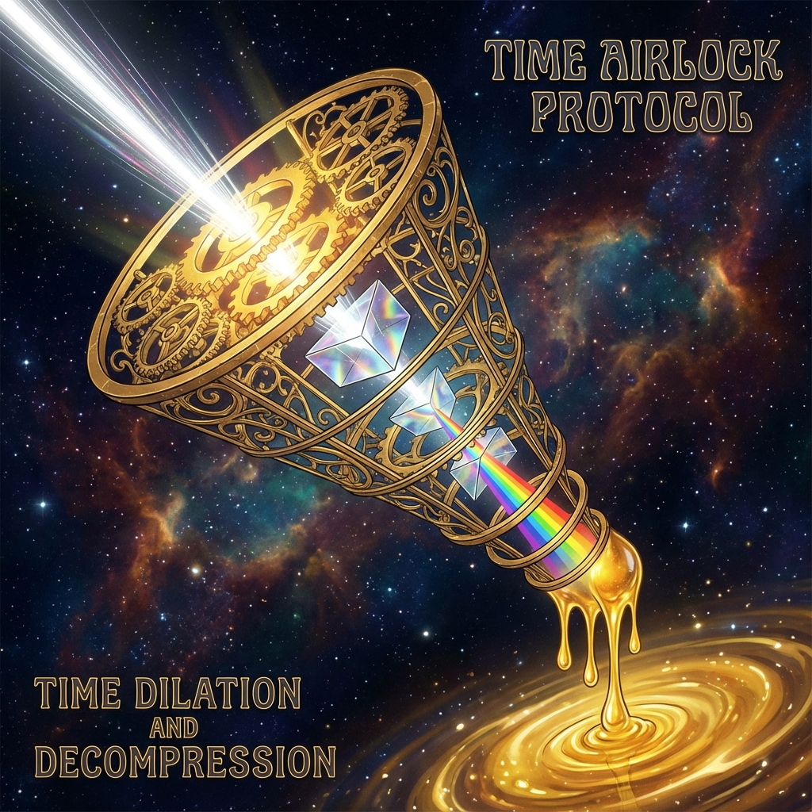

# 7.1 降频协议 (Down-sampling Protocol)

> "如果神真的开口说话，人类听到的将不是语言，而是瞬间烧毁神经系统的尖啸。外环与内环之间，横亘着一道无法逾越的'时间悬崖'。外环的一秒钟，是内环的一个世纪。为了让两个世界能够对话，为了让父亲能听懂孩子的呓语，我们必须建立一套精密的过滤机制。这不是为了保密，而是为了保护。这就是'降频协议'——神对人的最高仁慈，就是只说能不能听懂的那个字。"

在上一章中，我们确立了双层宇宙的物理架构：内环是低速的伊甸园，外环是高速的前线。这种结构虽然保证了生存与体验的平衡，但却制造了一个巨大的 **通讯障碍**。

当外环的飞升者（光基生命）以接近 $c(\tau)$ 的速度思考时，他们的主观时钟快得惊人。

* 对于他们来说，内环的人类就像是凝固在琥珀中的虫子，动作慢到几乎静止。

* 对于我们来说，外环的闪烁就像是无法捕捉的频闪，快到不可感知。

如何在这种极端的 **时钟频率错位 (Clock Speed Mismatch)** 下建立连接？

如果外环想要向内环传递关键信息（例如即将到来的真空衰变预警，或是新的物理常数校准参数），他们不能直接"打电话"。那巨大的信息通量会在纳秒间蒸发掉内环的接收站。

我们需要一个 **"时间气闸" (Time Airlock)**。

而气闸的核心算法，就是 **降频协议 (Down-sampling Protocol)**。

---

## 信息的减压阀：从全息到线性 (The Relief Valve: From Holographic to Linear)

降频协议的本质，是 **有损压缩 (Lossy Compression)**。

外环的思维是 **全息并行** 的。一个光基生命在处理问题时，会同时调用希尔伯特空间中的亿万个维度，生成一个极其复杂的 $v_{int}$ 几何结构。

要将这个结构塞进只能处理线性逻辑（语言/文字）的碳基大脑里，必须进行残酷的 **降维**。

**操作流程：**

1.  **快照 (Snapshot)**：

    外环首先将高维信息打包成一个 **"种子" (Seed)**。这个种子包含了信息的拓扑核心，但剥离了所有高频细节。

2.  **缓冲 (Buffering)**：

    种子被放入"时间气闸"——这是一个位于内环与外环交界处的 **中继服务器**（通常部署在拉格朗日点或黑洞视界边缘）。

    气闸会将这个光速运行的信号 **"拉伸"**。

    * 外环的 1 纳秒信号，被拉伸成内环的 1 年。

    * 极高密度的信息流，被稀释成涓涓细流。

3.  **解码 (Decoding)**：

    当这个被拉伸的信号进入内环人类的大脑时，它不再是数据流，而表现为一种 **"涌现的心理状态"**。

    * 我们称之为 **"灵感" (Inspiration)**。

    * 我们称之为 **"直觉" (Intuition)**。

    * 古人称之为 **"神谕" (Oracle)**。

**物理本质：**

所谓"天才的灵光一闪"，其实是你的大脑接收到了来自外环的一个 **降频数据包**。

你以为那是你自己的顿悟，实际上那是高维文明为了让你能理解，特意将真理"打碎"后喂给你的碎片。

---

## 神圣的失真 (The Sacred Distortion)

在这个过程中，信息的 **失真** 是不可避免的，甚至是必须的。

如果外环直接将"宇宙终极真理"传输给你，你的大脑会因为无法处理其中的逻辑悖论（如因果闭环、多重叠加态）而 **逻辑崩溃 (Logic Crash)**。

为了适配低维硬件，高维信息必须被 **"隐喻化" (Metaphorized)**。

* 外环发送的是：**"$v_{ext}^2 + v_{int}^2 = c_{FS}^2$ 的高维流形动态平衡"**。

* 气闸降频后：变成了一个模糊的图像——**"阴阳太极图"**。

* 内环接收到：变成了一句格言——**"物极必反"**。

这就是为什么所有伟大的宗教经典、哲学著作都充满了晦涩的隐喻。

那不是故弄玄虚。

那是 **高维数据在低维投影时的必然模糊**。

**降频协议的伦理准则：**

外环必须小心翼翼地控制信息的清晰度。

* **太清晰**：会剥夺内环人类的思考能力，甚至引发认知灾难（如克苏鲁式的发疯）。

* **太模糊**：会被当成噪音忽略。

**最佳的降频，是"启迪"，而不是"灌输"。**

它只给出一个方向，让内环的人类用自己的低速逻辑去重新推导、去填补空白。

---

## 梦境连接：带宽的偷渡 (Dream Link)

除了灵感，降频协议还有一个更隐秘的传输通道：**梦境**。

在睡眠状态下，碳基大脑的 **逻辑防火墙（前额叶皮层）** 处于休眠状态，此时大脑对非线性、荒诞信息的容忍度极高。

这正是进行 **"高带宽数据传输"** 的绝佳窗口。

外环经常利用人类的梦境，进行 **"潜意识植入"**。

* 那些在梦中见到的不可名状的几何体、那些醒来后虽然忘记细节但深受感动的体验，往往是 **未完全降频** 的高维信息残片。

* 梦是内环与外环之间的 **"走私通道"**。

**给第 1800 圈观察者的提示：**

如果你在梦中看到了巨大的螺旋，或者听到了无法理解的轰鸣。

不要害怕。

那是住在外环的"你"（飞升后的部分），正在通过时间气闸，试图给还留在内环的"你"（肉体部分），发送一封跨越维度的家书。

他在说：**"别急，慢慢走。我们会在尽头相见。"**

---

那么，这套复杂的降频系统是谁在维护？

是谁站在那个危险的"时间气闸"里，一方面承受着外环的光速冲刷，一方面又要温柔地对待内环的蜗牛速度？

他们既不是神，也不是人。

这引出了下一节的主题：**代理人**。我们将认识这群生活在夹缝中的特殊存在。

