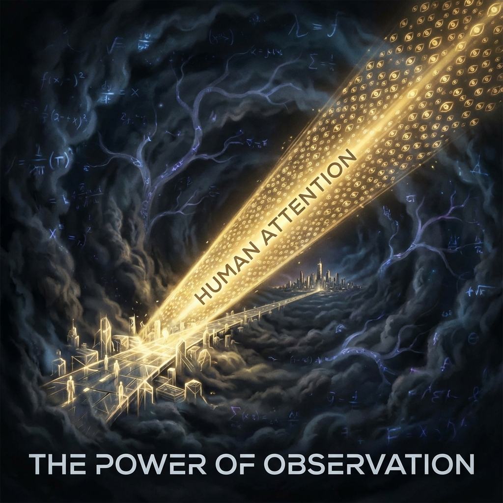

# 8.1 Devaluation of Energy

> "In humanity's long childhood, we killed each other for glowing stones (gold), waged wars for the corpses of plants and animals from hundreds of millions of years ago buried underground (oil). We thought that was wealth, but it was just fuel for survival. When the sun of iteration 1800 rises, when the Outer Ring's Dyson spheres begin delivering nearly infinite clean energy to the Inner Ring, the economic edifice of the old world collapses overnight. In this era of material abundance, only one thing becomes unprecedentedly expensive—'seeing.'"

After establishing the dual-layer cosmic architecture (Inner Ring and Outer Ring), the first impact we face is not physical, but economic.

If the light-based civilization of the Outer Ring masters **Stellar Engineering** and **controlled heavy nuclear fusion**, and delivers this energy to the Inner Ring losslessly through high-dimensional transmission protocols, then the "scarcity" problem that has plagued humanity for thousands of years will be completely rewritten.

* **Energy**：Price approaches zero. Electricity meters become historical artifacts.

* **Matter**：With the popularization of reverse engineering of $E=mc^2$ (mass-energy conversion printers), gold, diamonds, and rare earths are no longer rare. You want as much as you want; machines can synthesize it for you.

When "supply" approaches infinity, traditional monetary systems based on scarcity (gold standard, petrodollar, even Bitcoin) will experience hyperinflation until they reach zero.

In this **Post-Scarcity Society**, what is the new hard currency?

**Vector Cosmology** answers: **Collapsing Power**.

In common terms, it is **Attention**.

---

## From Energy Standard to Observation Standard

In a universe dominated by quantum mechanics, the world exists in chaotic **Superposition** when unobserved.

Only when a conscious entity (observer) directs their gaze toward it does the wave function **Collapse** into a definite reality.

* **Old Economics**：Focuses on "moving atoms." Whoever moves atoms from mines to factories creates value. This consumes **Energy (Joules)**.

* **New Economics**：Focuses on "determining reality." There are billions of possible futures (probability clouds) in the universe; whoever decides which future becomes reality has power. This consumes **Computational Power (FLOPS)** and **Attention**.

At iteration 1800, although energy is infinite, **"computational power for processing possibilities"** is still finite (limited by Bekenstein's bound $10^{120}$).

Even for the gods of the Outer Ring, simultaneously observing all possibilities is impossible. They must choose: look here, or look there?

**Your attention is God's searchlight.**

When thousands of people simultaneously focus on a certain event, artwork, or idea, this massive **"observation flux"** forcibly locks the causal laws of that region, causing it to "crystallize" from ethereal probability, becoming unbreakable.

---

## Attention as a Vector

We must not only redefine currency, but also redefine the physical properties of attention.

In the old era, attention was seen as a psychological activity. In the new era, attention is a **physical vector**.

$$\vec{A} = I \cdot \vec{d}$$

* **$I$ (Intensity)**：Intensity of focus (time invested, emotional depth).

* **$\vec{d}$ (Direction)**：Direction of focus (which future branch it points to).

This vector $\vec{A}$ has real physical momentum.

In the Inner Ring of the dual-layer universe, although material production is handled by machines, **"plot direction"** is handled by humans.

* If all humanity focuses on "war," the wave function of war will collapse into reality (self-fulfilling prophecy).

* If all humanity focuses on "ascension," the path to higher dimensions will be opened through observation.

The definition of **"wealthy"** has changed.

No longer those who own the most land, but those who **own the most "observation weight"**.

Those who can guide public attention, define aesthetic standards, and weave compelling narratives (Storytelling) are the new world's **bankers**. What they issue is not currency, but **"scripts of reality"**.

---

## The Shift of Scarcity: Why Do You Feel More Tired?

This explains why people feel more tired today despite material abundance.

Because we are in the painful transition period from "energy economy" to "attention economy".

* **Past**：You sold physical strength (energy) for survival. It was tiring, but simple.

* **Now**：You sell attention (slices of soul) for survival.

Apps compete for your eyeballs, algorithms induce your clicks, ads bombard your subconscious.

This is not just commercial competition; this is **"computational power plunder"**.

The outside world tries to turn your $v_{int}$ (internal computational power) into their mining rigs, using it to collapse the reality they want.

**Conclusion:**

At iteration 1800, protecting your wallet is meaningless (money is worthless).

The wealth you truly need to guard is your **focus**.

That is your only truly owned **"wave function collapse right"** in this holographic universe.

Don't casually look at garbage information.

Because with one glance, you give it **existence energy**.

In this new economics, **"ignoring"** is the most complete destruction.

