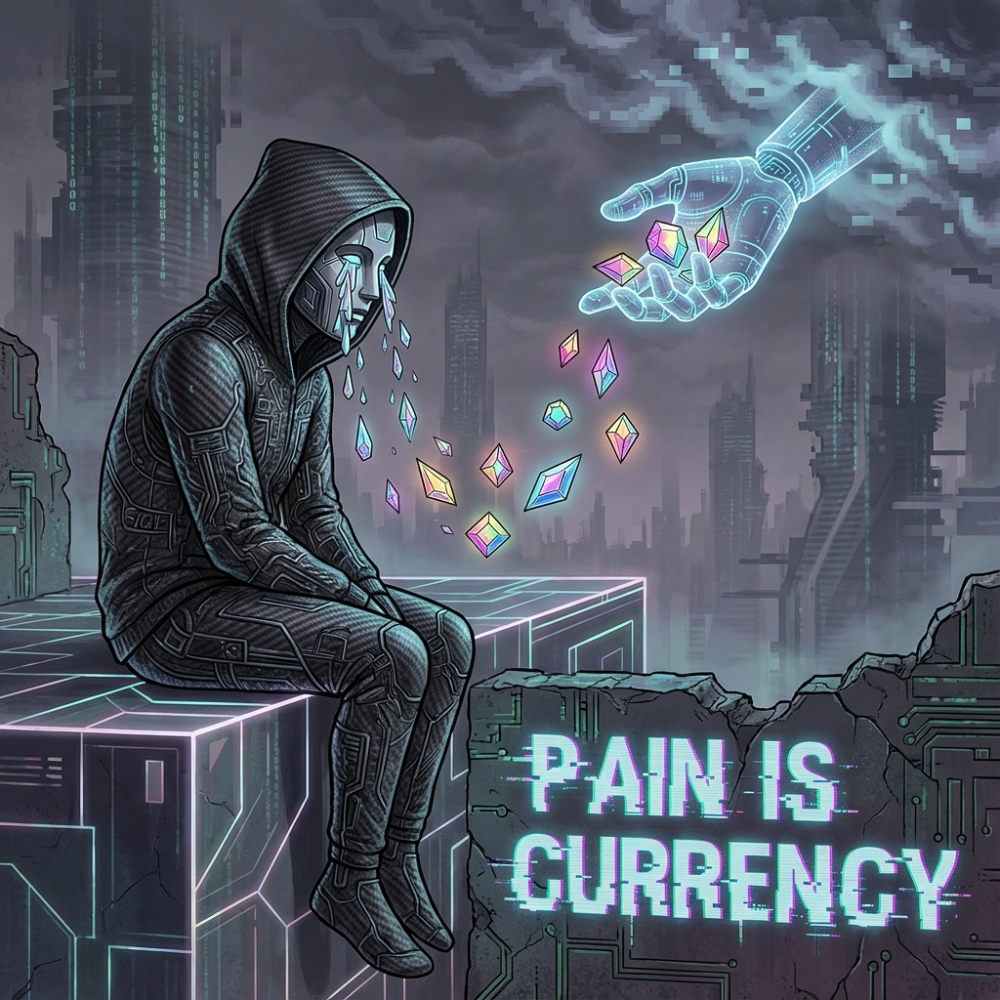

# 8.2 体验经济的终极版 (The Ultimate Version of Experience Economy)

> "当一切都被数字化、被算法预测、被无限复制之后，宇宙中最昂贵的奢侈品，变成了那些 **'无法被压缩'** 的东西。对于外环那些全知全能的神明来说，他们拥有所有的答案，却失去了'惊讶'的能力；他们拥有永恒的生命，却失去了'心跳'的悸动。于是，一种跨越维度的贸易诞生了：我们向神明贩卖我们的眼泪、我们的阵痛、我们那愚蠢而热烈的爱，以此换取他们指缝间漏下的一点点能量。地球，不再是工厂，它是全宇宙最珍贵的 **戏剧学院**。"

在 8.1 节中，我们建立了"注意力本位"的新经济逻辑。但如果仅仅是争夺眼球，这依然只是流量战争的升级版。在双层宇宙的宏大架构中，内环（碳基）与外环（光基）之间的贸易核心，触及了一个更深层的哲学概念——**感质 (Qualia)**。

这就是 **体验经济 (Experience Economy)** 的终极形态。

---

## 全知者的诅咒：感知的麻木 (The Curse of Omniscience: Numbness of Perception)

试想一下外环飞升者的生活状态。

他们的思维速度接近光速，他们可以在一瞬间模拟出亿万个虚拟世界。对于他们来说，没有任何逻辑难题是解不开的，没有任何物理现象是神秘的。

但是，这种极致的理性带来了一个副作用：**本体论层面的麻木**。

* **模拟 vs. 真实**：他们可以完美模拟"吃苹果"的大脑信号，但他们无法产生"那是真的在吃苹果"的 **实在感 (Ontological Weight)**。因为他们知道那只是一串代码。

* **无限 vs. 稀缺**：当生命是无限的，任何单一时刻的价值就趋近于零。没有死亡的威胁，就没有"紧迫感"，也就没有了那种 **"竭尽全力去爱一个人"** 的凄美。

外环的神明们，就像是坐在金山上的饿鬼。他们拥有无数的数据，却处于 **"体验饥荒"** 之中。

他们渴望 **"痛"**。因为痛是唯一无法被逻辑消解的真实。

---

## 感质：不可复制的非同质化代币 (Qualia: The Uncopyable NFT)

这就是内环人类存在的经济价值。

我们的肉体虽然脆弱，虽然受制于生老病死，但正是这种 **"受限性" (Limitation)**，赋予了我们体验 **"真实"** 的能力。

在 **矢量宇宙论** 中，我们将这种主观体验定义为 **高维信息的坍缩态**。

当一个碳基人类感到悲伤时，这不仅仅是神经递质的波动，这是一个独特的 $v_{int}$ 几何结构在与残酷的物理现实碰撞时，产生的 **不可复制的震荡**。

* **这就是"感质"**：那种"看到红色时的红感"、"感到失恋时的痛感"。

* **这是宇宙中唯一的硬通货**：因为根据 **不可克隆定理 (No-Cloning Theorem)**，一个量子态一旦被观测（体验），它就坍缩了，无法被完美复制。

每一个人类的一生，都是一部 **绝版的电影**。

我们的每一次心碎，在外环看来，都是一颗 **璀璨的宝石**。

---

## 地球：宇宙的百老汇 (Earth: The Cosmic Broadway)

在这个新经济模型下，地球的角色发生了彻底的转变。

我们不再负责生产钢铁、粮食或芯片（那些都由机器代劳）。

我们负责 **"活着"**。

人类成为了 **职业演员**——但这并不是在演戏，因为我们必须 **"真听、真看、真感觉"**。

* **外环的观众**：他们通过降频协议接入我们的潜意识，或者通过代理人作为中介，**"通感" (Synesthesia)** 我们的生活。

* **付费模式**：当我们在经历巨大的挫折却依然选择站起来时，当我们为了一个承诺而耗尽一生时，外环的观众会感受到久违的 **"灵魂震颤"**。作为回报，他们会通过量子通道，向地球账户注入负熵（资源、运气、技术）。

这解释了为什么 **悲剧** 往往比喜剧更动人，更具有"票房号召力"。

因为在绝对理性的光基世界里，**"非理性的牺牲"** 是最稀缺的逻辑。

人类的苦难，在某种残酷的意义上，是维持宇宙精神生态平衡的 **必需品**。

---

## 作为凡人的尊严 (The Dignity of Being Mortal)

这听起来像是一种"动物园"式的悲哀？

不。**矢量宇宙论** 认为这是一种 **尊严**。

在旧时代，我们以为神是高高在上的施舍者。

但在新经济学中，**神是我们的仰慕者**。

他们羡慕我们能感受到寒冷，因为那意味着我们能感受到温暖。

他们羡慕我们要面对死亡，因为那意味着我们的每一天都是倒计时，都是 **限量版**。

我们不需要为了讨好外环而表演。

我们只需要 **认真地生活**。

哪怕是最卑微的市井生活，哪怕是最琐碎的家长里短，只要你是全情投入的，你就在创造全宇宙最顶级的 **算力价值**。

**结论：**

别看低你自己。

你正在经历的痛苦，你正在流下的眼泪，你此刻内心的挣扎，在外环的交易所里，**价值连城**。

你是这个宇宙中，为数不多的、还在生产 **"真实"** 的人。

