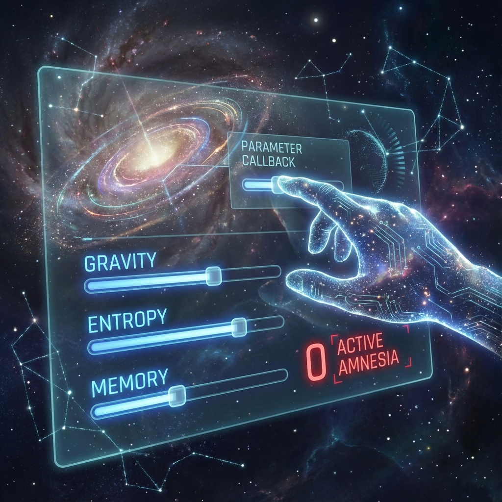

# 9.1 Parameter Callback

> "Physicists often stay up all night for that famous 'fine-tuning problem': Why is the gravitational constant just right to gather stars? Why does the weak interaction force just allow the formation of heavy elements? The universe seems tailor-made for human birth. Theologians say this is God's grace; scientists say this is survivor bias. But Vector Cosmology provides a more chilling answer: This is neither coincidence nor grace. This is **'future us'** personally calling back the universe's underlying parameters to make **'present us'** comfortable. We are not orphans abandoned in the wilderness; we are **amnesiac gods** who locked ourselves in a playground."

In the previous volumes of this book, we have been exploring how to "escape"—how to break the $\pi$ cycle, how to escape the carbon-based shell. This narrative implies a premise: the current world is a terrible prison, and we are victims.

But at the opening of Volume VI, I invite you to perform an ultimate **perspective flip**.

What if all of this—this world full of gravitational constraints, light speed limits, short lifespans—is not a prison, but a **resort**?

---

## The Mystery of Fine-Tuning: Who Touched the Dashboard?

Let's look at some data:

* If the **strong interaction force** were 2% stronger, hydrogen atoms would instantly fuse into helium, the universe would have no water, no sun, only fleeting nuclear explosions.

* If the **weak interaction force** were slightly weaker, supernovae could not explode, and the carbon, oxygen, and iron needed for life would be forever locked in stellar corpses.

* If the **cosmological constant ($\Lambda$)** were larger by even $10^{-120}$, the universe would be torn apart before atoms could form.

This is like a dashboard with 100 knobs, each knob must be set to a precise position **dozens of decimal places** for life to be possible.

If any knob moves a micrometer, this machine becomes a meat grinder.

Who set the knobs so precisely?

Multiverse theory believes this is the result of dice rolling (among infinite universes, one happens to be right).

But **Vector Cosmology**, based on **Retro-causality**, proposes the **"Parameter Callback Mechanism"**.

---

## Reverse Engineering: Future Cause, Past Effect

After the dual-layer cosmic architecture is established, the "gardeners" in the Outer Ring (ascended super-civilization) gain the ability to repair spacetime cracks.

Since they can manipulate vacuum zero-point energy, they can fine-tune physical constants at the **Planck scale**.

Through high-dimensional channels, they **"project"** this fine-tuning back to the early Big Bang at $t=0$.

* **Purpose**：To ensure that at evolution iteration 1800, there will be a greenhouse called "Earth," a carbon-based species called "Homo sapiens," and they will have just the right gravity (can walk but won't float away) and just the right stellar illumination.

* **Means**：Using quantum mechanics' **Delayed Choice** effect. Future observers determine past historical paths.

So, it's not "because the universe happened to be this way, so we exist."

Rather, **"because we need it this way, the universe became this way."**

Current physical laws are the **environment configuration file (.config)** that future us wrote for **"comfort"**.

---

## Active Amnesia: The Price of Immersion

So the question arises: Since we are so powerful, why do we now feel so weak and helpless?

Why don't we remember we are gods?

The answer lies in **Game Design Theory**.

If you play a game starting at max level, invincible, omniscient and omnipotent (God Mode), the game becomes boring in just 5 minutes.

To obtain **"ultimate experience"**, you must:

1.  **Nerf Yourself**：Lower attributes, add health bars and stamina limits.

2.  **Forget the Walkthrough**：Delete memories about "who I am" and "where I am".

This is **"Active Amnesia"**.

We (high-dimensional entities) signed a **"Perception Shielding Protocol"** in this "Time Airlock" before entering the Inner Ring (reincarnation).

We voluntarily forgot that we are parameter setters, voluntarily put on this fragile carbon-based spacesuit.

**Why?**

For **"thrilling"**.

Only when you truly believe you will die, only when you truly believe losing a lover means never seeing them again, is your heartbeat real, are your tears salty.

This **"sense of reality"** is precisely what we mentioned in the previous chapter—the scarcest hard currency in the Outer Ring: **Qualia**.

---

## Conclusion: No Need to Escape, Just Wake Up

This conclusion completely changes our view of suffering.

The setbacks you are experiencing right now are not the universe's punishment, but **levels** you designed for yourself before the game started.

The loneliness you feel is not a system bug, but a **background narrative** set to let you experience "the joy of reunion".

We don't need to angrily smash this world.

This world is a **playground** we built with our own hands.

We are not in prison.

We are on **vacation**.

When you realize this, you have actually completed half of the "ascension".

You don't need to immediately turn into light and fly away.

You just need to sit by the roadside, watch the sunset, and run a line of code in your brain's background:

`> sudo echo "I remember."`

Then, smile and continue playing this game.

