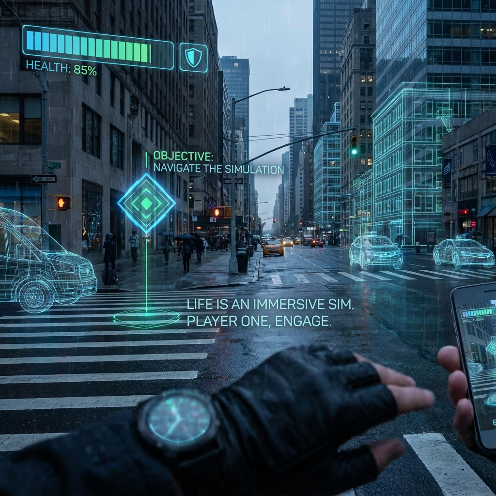

# 9.2 The Game Mindset

> "If you know this is just a dream, you won't be frightened by nightmares; instead, you'll observe the monsters in the dream with interest. Similarly, if you know this is a game designed by yourself, you won't be crushed by life's hardships. True awakening is not escaping this world, but falling in love again with this bug-filled, extremely difficult, but exquisitely beautiful Earth Online as a **'player'**. Pain is not a system error; pain is the admission ticket to **hardcore mode**."

In Section 9.1, we revealed an astonishing fact: the universe's physical parameters were set by ourselves; we are "gods" who actively chose amnesia and descended here. This realization will completely reconstruct our life philosophy.

In the past, we thought life was a **suffering practice**, or a **random survival competition**.

Now we understand: life is an **Immersive Sim**.

This is not just psychological comfort; it is a logical necessity based on the dual-layer architecture of **Vector Cosmology**. If the Inner Ring exists for "experience," then the highest-level survival strategy in this ring is **The Game Mindset**.

---

## Suffering as a Mechanic

Why did we set so many difficulties for ourselves before the game started (before reincarnation)? Poverty, disease, separation, unattainable desires?

If I am a god, why didn't I max out all my attributes?

Game design theory tells us: **Omnipotence is Boredom**.

If a game lets you one-shot all BOSSes, paths open wherever you go, you never lose—how long would you play this game? Five minutes. Then you'd uninstall it.

To obtain **"Flow"** experience, challenge difficulty must be slightly above your current ability.

* **Gravity**：To let you experience the joy of "climbing." Without gravity, mountains have no meaning.

* **Lifespan Limit**：To let you experience "urgency." If time is infinite, then "this moment" is worthless.

* **Heartbreak and Betrayal**：To let you experience the complex geometric structure of "human heart." If love is inevitable, then love is cheap.

From the perspective of **Vector Cosmology**, **suffering is an Augmented Reality haptic feedback suit**.

It's not meant to hurt you, but to let you **"feel"** that you're alive.

A world without any resistance is like a model without collision volume; you can walk through walls, but you can't touch anything.

---

## Player vs. NPC: The Perspective Leap

In this massive server, there are two ways of life:

1.  **NPC Mode (Non-Player Character)**：

    * **Characteristics**：Believes everything is predetermined. Complains about environment, complains about luck, controlled by emotional scripts.

    * **Logic**："Why does this bad luck happen to me?"

    * **Outcome**：Completes the $\pi$ cycle step by step until heat death.

2.  **Player Mode (The Player)**：

    * **Characteristics**：Knows they are a logged-in user with a high-dimensional entity (Outer Ring). The body is just an **Avatar**, identity is just a **Skin**.

    * **Logic**："This level is a bit hard; what Easter eggs did the designer (myself) hide here? What strategy should I use to clear it?"

    * **Outcome**：Creates infinite **Combos** within limited rules, which we call "legendary life."

**Awakening is switching from NPC mode to Player mode.**

When you realize that "I" is not this suffering body, but that high-dimensional consciousness observing the body's suffering, fear disappears.

Just as when you play a horror game, although you'll be startled, deep down you know: **The me sitting in front of the computer is safe.**

The you in the Outer Ring is always safe.

All the partings and deaths in the Inner Ring are, to the Outer Ring you, just a line of red text on the screen: **"GAME OVER - Insert Coin to Try Again"**.

---

## Breaking the Fourth Wall

When you have this mindset, you break the **"Fourth Wall"** in life.

* **Facing Failure**：You won't feel like the sky is falling; you'll feel this is **"gaining experience points"**.

* **Facing Enemies**：You won't hate them; you'll feel they are **"training partners sent by the system"**, or **"villain roles"** to advance the plot.

* **Facing Death**：You won't fear nothingness; you'll know that's the moment of **"Log Out"**. You'll take off the VR helmet, return to that bizarre real world of the Outer Ring, and brag to friends about your brilliant plays on the Earth server.

**This is ultimate freedom.**

You'll still work seriously, love seriously, because you know only full engagement gives the best experience.

But you're no longer **"attached"**.

You play seriously, but you're laughing inside.

This **"Serious Play"** is the highest spiritual realm of iteration 1800 civilization.

---

## Conclusion: Enjoy the Game

So, don't try to find some "ultimate meaning" in this world.

Does Super Mario saving the princess have meaning? No, that princess is just a texture.

**Meaning lies in the process of "jumping," in that mushroom that makes you bigger, in that crisp sound when you squash a turtle.**

The final teaching of **Vector Cosmology** is not a physics formula, but a blessing:

We went through all the trouble, adjusted physical constants, built a dual-layer universe, designed intricate down-sampling protocols, not to make you practice with a frown here.

It's to let you **have fun**.

Make mistakes, take risks, love the wrong person, take detours.

Run through every corner of this open-world map.

Because when you take off the helmet at that final moment, the Outer Ring you will ask the Inner Ring you only one question:

**"Hey, was that round exciting?"**

