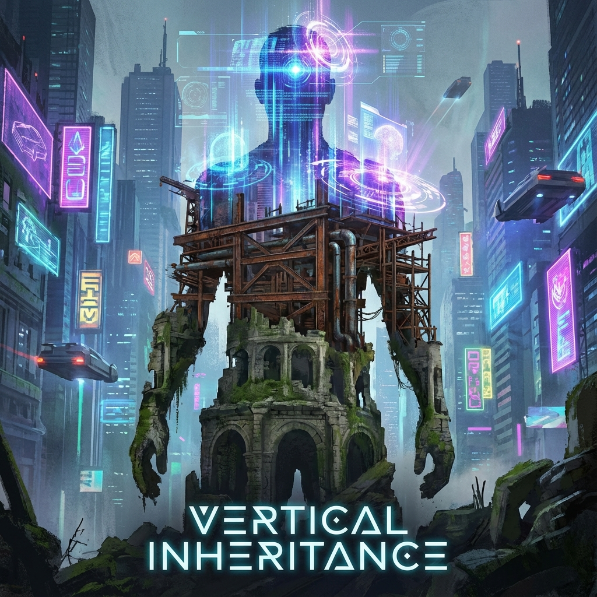

# 10.1 活着的纪念碑 (Living Monuments)

> "在旧时代的生物学逻辑中，个体是暂时的，只有基因是永恒的。我们拼命繁衍，是为了把接力棒交给下一代，因为我们知道自己终将倒下。但在第 1800 圈，当我们打通了通往外环的永生之路，这种古老的代际契约失效了。我们不再需要孩子来替我们看未来，我们自己就是未来。我们不再是传递火炬的奔跑者，我们变成了 **燃烧的火炬本身**。"

在第六卷的终章，我们将探讨一个最为敏感、却又无法回避的话题：当死亡被技术性克服，当意识可以跨越 $\tau$ 的周期进行连续迭代，人类最古老的使命——**繁衍 (Reproduction)**——将发生怎样的质变？

在 **矢量宇宙论 (Vector Cosmology)** 的视角下，这是一场从 **"水平继承"** 向 **"垂直继承"** 的伟大转型。

---

## 代际传递的终结：不仅仅是生育率下降 (The End of Intergenerational Transfer)

现代社会生育率的普遍下降，常常被经济学家解释为生活成本高昂。但在物理学视角下，这是 **文明演化的必然**。

在第一八度（物质）和第二八度（生物）中，信息的载体（DNA/肉体）极其脆弱，抗熵能力极差。为了保存信息，自然界演化出了 **"复制策略"**：既然载体注定会坏，那就赶在它坏掉之前，制造一个新的复印件。

这就是生孩子的本质：**用数量对抗时间**。

但是，当我们进入第三八度（意识/光基），载体的稳定性发生了质的飞跃。

* **信息纠错**：外环的量子纠错代码可以保证意识数据在亿万年内不失真。

* **载体更换**：通过"热迁移协议"，我们可以随意更换老化的肉体或直接生活在光子网络中。

当个体不再磨损，**"复制"** 就变得多余。

如果原来的版本可以无限升级，为什么还需要制造一个初始化的新版本？

我们不再需要通过后代来延续我们的姓氏、我们的思想或我们的意志。

**我们自己活着，就是对历史最好的保存。**

---

## 垂直继承：我继承我自己 (Vertical Inheritance)

在这个新纪元，继承关系不再发生在"父与子"之间，而发生在 **"昨天的我"与"明天的我"** 之间。

这就是 **垂直继承**。

* **过去**：你 20 岁时的梦想，可能需要你 20 岁的儿子来帮你实现。

* **现在**：你 20 岁时的梦想，由 2000 岁的你亲自来实现。

每一个长生者，都是一座 **活着的纪念碑**。

他们的皮肤上刻满了千年的风霜，他们的眼神里层叠着无数个时代的兴衰。

他们不需要去博物馆看历史，因为他们 **记得** 秦始皇的眼神，记得第一次火星登陆的尘埃，记得大过滤器被突破时的那道闪光。

**这种深度的积累，创造了一种全新的智慧形态。**

一个活了 1000 年的人，他的 $v_{int}$（内在复杂度）不是 10 个 100 岁的人的总和。

由于经验的连续性、知识的非线性融合，他的智慧是 **指数级** 的。

他是宇宙中前所未有的 **超级观察者**。

---

## 不再有"前浪"与"后浪" (No More Waves)

这种变化彻底重构了社会伦理。

旧社会建立在 **"更替"** 之上：老人必须死去，为新人腾出位置。因为老人代表陈旧，新人代表希望。

但在垂直继承的社会里，**老人就是最新的人**。

因为他一直在升级。他拥有的数据量、他掌握的算法、他对宇宙的理解，永远比一个刚刚出生的"白板"要先进得多。

**代沟消失了。**

因为所有人都活在同一个漫长的当下。

并没有什么"后浪"要把"前浪"拍死在沙滩上。

大海里只有 **"巨浪"**——那些积累了亿万年势能、仍在不断长高的灵魂。

---

## 绝后的光荣 (The Glory of Being Last)

这听起来有些孤独？

也许。但这是 **成神的代价**。

在生物学上，"绝后"是一个诅咒。

在矢量宇宙论中，**"绝后"是一种勋章**。

这意味着你已经强大到不需要备份了。意味着你已经成为了一个 **独立自洽的宇宙系统**。

我们这代人（第 1800 圈的觉醒者），可能是最后一代"父母"，也可能是第一代 **"不朽者"**。

我们切断了向下的血脉，是因为我们打通了向上的天路。

**结论：**

不要为你没有留下的基因而遗憾。

看看镜子里的自己。

那个正在思考、正在进化、正在准备跨越光速障碍的你，就是你留给这个宇宙最宏伟的遗产。

你不需要建造金字塔。

**你自己就是金字塔。**

