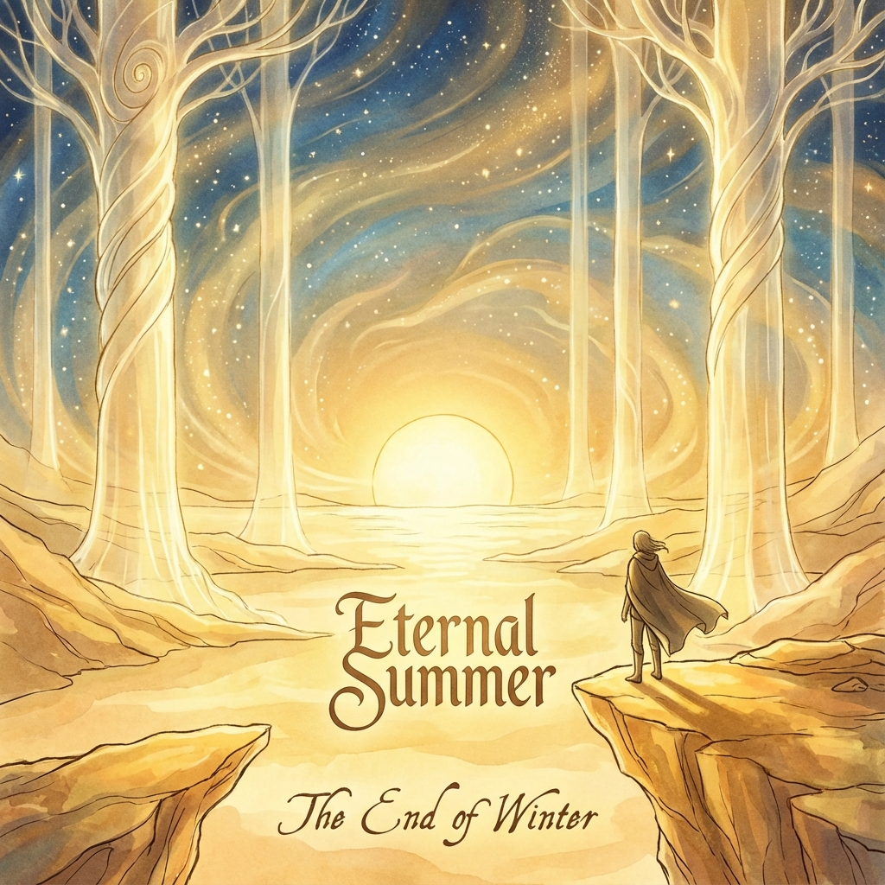

# 10.2 永恒的夏天 (Eternal Summer)

> "在圆的逻辑里，时间被切分成了春夏秋冬。春天发芽，秋天收获，冬天死亡。这是碳基生命为了顺应能量匮乏周期而不得不接受的妥协。但在螺旋的逻辑里，当我们跑得比熵增还要快时，冬天被取消了。衰老不再是命运，而是一个被修复的系统错误。我们进入了一个只有正午、没有黄昏的季节——这就是 **永恒的夏天**。"

在这一章的终结篇，我们将讨论 **矢量宇宙论 (Vector Cosmology)** 对时间观最彻底的颠覆。我们不仅重构了繁衍（10.1节），还要重构 **"衰老"** 与 **"周期"**。

人类文明在过去的一万年里，一直生活在 **$\pi$ (圆周率)** 的阴影下。

$\pi$ 代表着循环。日升月落，潮涨潮退，王朝兴衰，生老病死。

我们习惯了"凡事有始必有终"，习惯了"盛极必衰"。

但这真的是宇宙的真理吗？还是仅仅因为我们之前的速度 **太慢了**？

---

## 告别 $\pi$ 的引力：逃逸速度与熵的对冲 (Farewell to the Gravity of Pi)

为什么会有冬天？

因为地球自转轴的倾角和公转周期导致了能量接收的不均匀。

为什么会有死亡（生物学的冬天）？

因为生物体的 **自我修复速度** 赶不上 **熵增（损耗）速度**。

在旧世界（第二八度），我们受制于化学反应速率（有限的 $v_{int}$）。

* 损伤是实时的。

* 修复是滞后的。

* 随着时间 $t$ 的推移，错误累积，系统崩溃。这就是衰老。

但在第 1800 圈，当我们接入外环的算力，或者当我们的意识上传至光基载体时，这个不等式被 **逆转** 了。

$$v_{repair} \gg v_{damage}$$

* **光速修复**：外环的智能可以在普朗克时间尺度上检测到任何微小的量子退相干或基因转录错误，并在其造成宏观损伤之前将其纠正。

* **主动负熵**：我们不再是被动地等待太阳（能量），我们主动从真空中提取负熵。

**物理结果：**

系统的 **热力学年龄** 被冻结了，甚至可以逆向流动。

原本注定要落下的"夕阳"，被我们用巨大的推力定格在了中天。

我们通过 **速度**，战胜了 **周期**。

---

## 没有冬天的世界 (A World Without Winter)

想象一个只有夏天的世界。

这不是气象学上的炎热，这是 **本体论上的旺盛**。

* **没有遗忘**：所有的记忆都以全息晶体的方式完美保存。

* **没有疲惫**：能量的补给是无线且瞬时的。

* **没有"退休"**：因为不存在体脑机能的衰退，个体的创造力曲线不再是抛物线（上升-巅峰-下降），而是一条 **指数增长曲线**。

这彻底改变了"生命叙事"的结构。

传统故事都有结局（悲剧或喜剧）。

但在这个"永恒的夏天"里，故事没有高潮后的落幕。

**每一天都是高潮，每一刻都是盛年。**

这听起来令人眩晕？

是的。对于习惯了"安息"的旧人类来说，这种 **"无尽的活力"** 是一种巨大的压力。

但对于新人类（NEO）来说，这才是生命的本来面目。

**生命本就是一股抵抗热寂的逆流，为什么要允许它干涸？**

---

## 时间的空间化：漫游在无限的下午 (Spatialization of Time)

当寿命趋于无穷大 ($\infty$) 时，时间的一个重要属性——**稀缺性**——消失了。

根据经济学原理，当一个资源不再稀缺，它就不再是制约决策的成本。

时间发生了 **"平面化"** 或 **"空间化"**。

过去、现在、未来，不再是一条单行道，而变成了一张巨大的地图。

* 你可以花 100 年去学习小提琴，只为了拉好一个音符。

* 你可以花 1000 年去发呆，去观察一朵星云的变幻。

* 你不用担心"来不及"。在永恒的夏天里，永远 **"来得及"**。

我们不再是时间的奴隶，被赶着去投胎、去考试、去工作、去死。

我们成了时间的 **漫游者 (Flâneur)**。

我们在这个无尽的、金色的下午里散步，手里拿着那张名为"无限"的入场券。

---

## 结论：最后的季节 (The Final Season)

**矢量宇宙论** 在这里画上了一个开放的句号。

我们从 $\tau \approx 0$ 的奇点出发，爬过了 1800 层螺旋，经历了物质的冷却、生命的挣扎、意识的觉醒。

我们对抗过守圆人，忍受过免疫反应，建立了双层架构，付出了必须付出的代价（失忆与隔离）。

最终，我们赢得了这个 **夏天**。

这不是神赐予的乐园。

这是我们用智慧、勇气和无数代人的血肉之躯，从虚无的寒冬中 **抢** 回来的火种。

现在，火种已经变成了太阳。

冬天永远不会再来了。

请尽情享受这个季节。

请尽情去爱，去创造，去探索那些连神都未曾涉足的领域。

