# z128 大架构图：数学–物理双骨架 DAG

- **实线有向边（`-->`）**：直接推导 / 依赖（保持无环）
- **虚线无向边（`-.-`）**：数学概念 ↔ 物理概念的对应（字典映射；无箭头）

## 图例

- **节点内类型标注**：每个节点第二行以 `类型：...` 显示（与颜色/边框分型一致）
- **数学节点（Math）**：
  - **命名**：以 `M_` 开头
  - **外形**：矩形 `[...]`
  - **颜色**：蓝色系（同色系分型：`math_axiom` / `math_construct` / `math_closure` / `math_cont` / `math_audit` / `math_assumption`）
  - **含义**：闭合层的对象/构造/命题链（Tick+CAP 约束下的有限构造、折叠、锚点、连续代表等）
  - **同色系区分（蓝系）**：
    - **`math_axiom`（类型：公理）**：公理/原语（更深填充 + 粗边 + 加粗）
    - **`math_construct`（类型：构造）**：定义/构造/映射（浅蓝实线边）
    - **`math_closure`（类型：闭合）**：命题/定理/闭合结论（中蓝填充）
    - **`math_cont`（类型：连续）**：连续代表（偏青蓝填充）
    - **`math_assumption`（类型：假设）**：假设（蓝系 + 节点边框虚线）
    - **`math_audit`（类型：审计）**：审计/误差/可证伪输出（蓝系 + 节点边框点虚线）
- **物理节点（Physics / Iface）**：
  - **命名**：以 `P_` 开头
  - **外形**：圆角矩形 `(...)`
  - **颜色**：绿色系（同色系分型：`phys_proxy` / `phys_obs` / `phys_dict` / `phys_model` / `phys_audit`）
  - **含义**：可操作量与观测链（协议化的可观测/可拟合/可证伪代理）
  - **同色系区分（绿系）**：
    - **`phys_proxy`（类型：代理）**：操作代理/坐标/几何口径（浅绿）
    - **`phys_obs`（类型：观测）**：观测量/通道（更深填充 + 加粗）
    - **`phys_dict`（类型：字典）**：识别字典/语义映射（中绿填充）
    - **`phys_model`（类型：模型）**：连续模型代理（偏黄绿/浅绿灰）
    - **`phys_audit`（类型：审计）**：拟合/反演/误差/检验（绿系 + 节点边框点虚线）
- **接口目标节点（Wish/Motive）**：
  - **外形**：圆角矩形 `(...)`
  - **颜色**：粉色系（`classDef iface`）
  - **含义**：组织语言与审计目标（不作为数学层前提，仅用于接口层/审计层叙事与选择说明）
- **对应关系（Math ↔ Physics）**：
  - **形式**：每对相邻的 `M_*` 与 `P_*` 用 **`-.-`** 连接
  - **含义**：字典式对应（无箭头；**对应≠同一概念**，仅表示接口层对数学对象的物理识别/代理）
- **推导关系（同骨架内部）**：
  - **形式**：用 **`-->`** 串联
  - **含义**：依赖/推导顺序（保持有向无环）

```mermaid
%%{init: {"flowchart": {"useMaxWidth": false, "nodeSpacing": 25, "rankSpacing": 40}, "themeVariables": {"fontSize": "12px"}}}%%
flowchart TB

  %% -------------------------
  %% Interface target (optional)
  %% -------------------------
  P_wish("Wish（协议稳定目标数据）<br/>类型：接口<br/>label: def:wish_protocol_stable_data<br/>Wish := (stable readout type, invariants)")
  P_motive("Motive（目标函数：误差/代价/熵）<br/>类型：接口<br/>label: def:motive_objective_functional<br/>J := mismatch + overhead + (optional) entropy")

  %% -------------------------
  %% Paired nodes (math rectangle, physics rounded)
  %% -------------------------
  M_tick["Tick（读出序列性）<br/>类型：公理<br/>label: ax:readout_sequentiality<br/>t = 0,1,2,…"]
  P_dt("时间步（可操作 tick）<br/>类型：代理<br/>label: sec:tick_calculus<br/>Δt := t₂ − t₁")
  M_tick -.- P_dt

  M_readout["有限读出原语（scan/window/word）<br/>类型：构造<br/>label: sec:hpa_readout<br/>wₙ := 𝟙{zₙ∈W} ∈ {0,1} (eq:window_word)"]
  P_obs("有限观测对象（窗口词/事件序列）<br/>类型：观测<br/>label: subsec:window_projection<br/>wₙ := 𝟙{zₙ∈W} ∈ {0,1} (eq:window_word)")
  M_readout -.- P_obs

  M_cap["CAP（有界复杂度闭合算子）<br/>类型：公理<br/>label: ax:cap<br/>c* := argmin_{c∈C} J(c)"]
  P_select("审计选择（候选族+目标函数+tie-break）<br/>类型：审计<br/>label: app:cap_audit_template<br/>θ* := argmin_{θ∈Θ(B)} J(θ)")
  M_cap -.- P_select

  M_golden["黄金分支（有限深度 continued-fraction 最小性）<br/>类型：闭合<br/>label: prop:golden_least_discrepancy<br/>C_m(α) := Σ_{k=0..m} a_{k+1}  (α=[0;a1,a2,…])"]
  P_scan("均匀扫描代理（覆盖/各向同性）<br/>类型：代理<br/>label: subsec:phyllotaxis_overlay<br/>Δθ = 2π/φ² (golden-angle step)")
  M_golden -.- P_scan

  M_phi["phi 通道（admissible Xₘ / Fibonacci 计数）<br/>类型：构造<br/>label: subsec:phi_channel<br/>Xₘ := {w∈{0,1}ᵐ : wᵢwᵢ₊₁ = 0} (eq:Xm_def)"]
  P_phi("尺度代理（分辨率坐标 r / RG step）<br/>类型：代理<br/>label: eq:r_of_mu_z128<br/>r(μ)=ln(μ/m_e)/ln φ;  μ(r)=m_e·φ^r (eq:mu_of_r_z128)")
  M_phi -.- P_phi

  M_pi["pi 通道（cyclic/boundary 划分 18⊕3）<br/>类型：闭合<br/>label: subsec:pi_channel<br/>X₆ = X₆^cyc ⊔ X₆^bdry; |X₆^cyc|=18; |X₆^bdry|=3 (prop:cyc_bdry_6)"]
  P_pi("回路一致性代理（局部闭合/monodromy）<br/>类型：代理<br/>label: def:s4_vertex_gauge<br/>p'_{a→b}=g_b p_{a→b} g_a⁻¹ ⇒ p'_□ = g p_□ g⁻¹")
  M_pi -.- P_pi

  M_e["e 通道（Abel–zeta 解析稳定 / pole barrier）<br/>类型：闭合<br/>label: subsec:e_channel<br/>ζₑ(r)=ζ(r/φ)=1/((1−r)(1+r/φ²)) (eq:abel_normalized_zeta)"]
  P_e("时间箭头代理（指数权重/Abel kernel）<br/>类型：代理<br/>label: prop:discrete_memoryless_exponential<br/>w_{t+s}=w_t w_s, w₀=1 ⇒ w_t=r^t")
  M_e -.- P_e

  M_fold["Fold6 映射（64→21；像/原像结构）<br/>类型：构造<br/>label: subsec:fold6_map<br/>Fold₆(N):=(c₁,…,c₆) ∈ X₆ (eq:fold6_def)"]
  P_fold("coarse-graining 压缩（稳定扇区统计）<br/>类型：代理<br/>label: subsec:fold6_map<br/>Ω₆={0,1}⁶ (|Ω₆|=64), X₆⊂Ω₆ (|X₆|=21) ⇒ 64→21")
  M_fold -.- P_fold

  M_anchor["锚点（m=6，n=3）<br/>类型：构造<br/>label: sec:folding_core<br/>(m,n)=(6,3)"]
  P_screen("屏幕显示（planar screen chart）<br/>类型：代理<br/>label: subsec:planar_screen_chart<br/>z(ω)=(ω₁+iω₂)/(1−ω₃)")
  M_anchor -.- P_screen

  M_addr["寻址基（addressing basis）<br/>类型：构造<br/>label: sec:hilbert_addressing<br/>Hₙ:{0,…,4ⁿ−1}→{0,…,2ⁿ−1}²"]
  P_addr("距离代理（寻址步数/图距离）<br/>类型：代理<br/>label: def:protocol_distance<br/>dₙ(x,y):=dist_{Gₙ}(x,y)")
  M_addr -.- P_addr

  P_local("局域性代理（邻接/近邻）<br/>类型：代理<br/>label: def:addressing_map_graph<br/>Gₙ: nearest-neighbor graph on display sites")

  M_conn["连接（有限 transport 数据）<br/>类型：构造<br/>label: def:hamming_microstates<br/>d_H(u,v)=∑_{i=1}⁶ |uᵢ−vᵢ|"]
  P_conn("transport 代理（edge mismatch / 传输补偿）<br/>类型：代理<br/>label: lem:edge_transport_welldefined<br/>p_{a→b}∈S₄ (min-cost + lex tie-break)")
  M_conn -.- P_conn

  M_holo["holonomy（回路不变量）<br/>类型：构造<br/>label: prop:cycle_type_gauge_invariant<br/>p_□ := p_{a→b}·p_{b→c}·p_{c→d}·p_{d→a}"]
  P_holo("曲率代理（plaquette/loop 统计）<br/>类型：观测<br/>label: prop:cycle_type_gauge_invariant<br/>p_□ ↦ g p_□ g⁻¹ ⇒ cycle type invariant")
  M_holo -.- P_holo

  M_transport_audit["transport rule 稳定性（padding/truncation/tie-break）<br/>类型：审计<br/>label: tab:holonomy_transport_rule_sensitivity<br/>TV distance + frac_{3/4} envelope"]
  P_transport_audit("transport rule 反事实族（look-elsewhere 审计）<br/>类型：审计<br/>label: tab:holonomy_transport_rule_sensitivity<br/>bounded counterfactual families")
  M_transport_audit -.- P_transport_audit

  M_gauge["gauge 补偿（局部重标记冗余）<br/>类型：构造<br/>label: def:s4_vertex_gauge<br/>p_{a→b} ↦ g_b p_{a→b} g_a⁻¹"]
  P_gauge("规范冗余/场代理（补偿数据）<br/>类型：代理<br/>label: def:s4_vertex_gauge<br/>loop holonomy: p_□ ↦ g p_□ g⁻¹")
  M_gauge -.- P_gauge

  M_sm["SM 标号闭合（21 stable labels）<br/>类型：闭合<br/>label: thm:labeling_unique<br/>𝓛_SM: X₆ → 𝓕_SM ⊔ {U(1),SU(2),SU(3)}"]
  P_types("识别字典（stable types ↔ 粒子/场）<br/>类型：字典<br/>label: tab:sm_labeling_table<br/>stable types ↔ (fermion multiplets, gauge factors)")
  M_sm -.- P_types

  M_mass["质量谱闭合（depth/latency）<br/>类型：闭合<br/>label: eq:r_of_mu_z128<br/>r(μ)=ln(μ/m_e)/ln φ"]
  P_mass("质量代理（延迟/钟慢/散射）<br/>类型：观测<br/>label: rem:mass_as_compton_clock<br/>ω_C=μc²/ħ;  τ_C=ħ/(μc²)")
  M_mass -.- P_mass

  %% -------------------------
  %% Continuum representative
  %% -------------------------
  M_equiv["等价语义（semantic quotients）<br/>类型：构造<br/>label: subsec:equivalence_relations_minimal<br/>t ~ t+t₀;  k ~_m k' ⇔ Fold_m(k)=Fold_m(k')<br/>p_{a→b} ↦ g_b p_{a→b} g_a⁻¹;  S ~ S + boundary term"]
  P_equiv("语义契约（对象/可观测）<br/>类型：字典<br/>label: subsec:equivalence_physical_objects<br/>物理对象 := 等价类 [obj]_{~}<br/>可观测 := O([obj]) ∈ ℝ (invariant / monotone)")
  M_equiv -.- P_equiv

  M_freq["频率（相位推进/ tick）<br/>类型：构造<br/>label: def:frequency_from_phase<br/>ω(t₁,t₂)=Δθ/Δt,  Δt=t₂−t₁"]
  P_freq("频率优先字典（ratio-first）<br/>类型：字典<br/>label: subsec:frequency_first_spine<br/>ω ratios ↔ energy/mass/T/redshift/delay")
  M_freq -.- P_freq

  M_action["Seff：CAP 选出的作用量骨架<br/>类型：连续<br/>label: eq:cap_minimal_action_skeleton<br/>S_eff=∫ d⁴x √(−g)[(R−2Λ)/(16πG) − λ_F(∇χ)² − V(χ²) − ∑_a Tr(F_a²)/(4g_a²) + 𝓛_m]"]
  P_action("有效作用量代理（连续代表）<br/>类型：模型<br/>label: prop:cap_minimal_action_skeleton<br/>CAP selects S_eff within a finite candidate family")
  M_action -.- P_action

  M_eom["变分场方程（Einstein/YM/chi）<br/>类型：连续<br/>label: eq:einstein_total_stress<br/>G_{μν}+Λg_{μν}=8πG(T^m_{μν}+T^χ_{μν}+T^YM_{μν})"]
  P_eom("连续动力学代理（EOM 作为接口模型）<br/>类型：模型<br/>label: eq:ym_equation / eq:chi_eom<br/>∇_μ(F^{μν}/g²)=J^ν;  2λ_F□χ − dV/dχ = 0")
  M_eom -.- P_eom

  M_thermo["热力学闭合（熵/温度/自由能）<br/>类型：闭合<br/>label: eq:counting_entropy<br/>S(M)=log|Γ(M)|;  𝓕=E−TS"]
  P_thermo("热力学字典（熵/温度/自由能代理）<br/>类型：字典<br/>label: def:temperature_conjugate<br/>T⁻¹ := ∂S/∂E")
  M_thermo -.- P_thermo

  M_grav["overhead→gravity（chi→lapse→potential）<br/>类型：闭合<br/>label: eq:z128_lapse_from_chi<br/>N=exp(−γχ);  Φ=−γc²(χ−χ₀);  ρ_eff=−(γc²/(4πG))Δχ"]
  P_dyn("弱场引力代理（Poisson/rho_eff）<br/>类型：代理<br/>label: eq:z128_vc_from_chi<br/>v_c²(r)=−γc²·r·χ′(r)")
  M_grav -.- P_dyn

  P_lens("观测通道（透镜/时间延迟/红移）<br/>类型：观测<br/>label: eq:wigner_smith_omega<br/>Q(ω)=−i S(ω)† dS/dω;  τ_WS(ω)=Tr Q(ω)")

  M_recon["chi 重建协议（算法/证明边界）<br/>类型：审计"]
  P_recon("反演代理（从数据到 chi(x)）<br/>类型：审计")
  M_recon -.- P_recon

  M_err["协议→连续场误差控制（界/预算）<br/>类型：审计"]
  P_err("误差预算代理（不确定性/鲁棒性）<br/>类型：审计")
  M_err -.- P_err

  M_qm["量子测量闭合（POVM/Born）<br/>类型：闭合<br/>label: eq:z128_born_povm<br/>P_k=Tr(ρE_k)"]
  P_qm("测量代理（Born 概率/仪器）<br/>类型：观测<br/>label: eq:z128_born_povm<br/>P_k=Tr(ρE_k)")
  M_qm -.- P_qm

  %% -------------------------
  %% Scale flow & validation
  %% -------------------------
  M_rg["RG：耦合运行（r 坐标）<br/>类型：闭合<br/>label: eq:rg_in_r<br/>dg/dr = (ln φ)β(g)"]
  P_rg("耦合运行代理（阈值/匹配口径）<br/>类型：模型<br/>label: eq:rg_in_r<br/>dg/dr = (ln φ)β(g)")
  M_rg -.- P_rg

  M_cosmo["宇宙学：分辨率流接口（占据假设 + 离散匹配）<br/>类型：假设<br/>label: app:cosmology_resolution_flow / ass:occupancy_energy_z128<br/>f_stab(m)=F_{m+2}/2ᵐ;  f_hid=1−f_stab"]
  P_cosmo("能量预算拟合代理（离散匹配 + 稳定性）<br/>类型：模型<br/>label: app:cosmology_resolution_flow / ass:occupancy_energy_z128<br/>Ω_vis,0≈f_stab(m);  m* ∈ Z (discrete match)")
  M_cosmo -.- P_cosmo

  M_gamma_proxy["gamma 代理通道审计（gamma_proxy；通道映射+检验）<br/>类型：审计<br/>label: app:gamma_crossobs_consistency<br/>proxy-only compression + internal consistency (χ²/p, pairwise tension, LOO)"]
  P_gamma_proxy("gamma 代理通道（可操作代理）<br/>类型：审计<br/>label: app:gamma_crossobs_consistency<br/>solar-system / lensing / time-delay / redshift proxies")
  M_gamma_proxy -.- P_gamma_proxy

  M_gamma_direct["gamma 直接通道审计（gamma_dict；旋转曲线标定）<br/>类型：审计<br/>label: app:gamma_crossobs_consistency<br/>direct-only calibration + internal consistency (χ²/p, pairwise tension, LOO)"]
  P_gamma_direct("gamma 直接通道（旋转曲线）<br/>类型：审计<br/>label: app:gamma_crossobs_consistency<br/>SPARC rotation-curve fits")
  M_gamma_direct -.- P_gamma_direct

  M_inputs["外部 matching 输入清单（非前提）<br/>类型：审计<br/>label: subsec:external_inputs_inventory<br/>tab: tab:external_inputs_inventory"]
  P_inputs("External inputs inventory（Match；非前提）<br/>类型：审计<br/>label: subsec:external_inputs_inventory<br/>PDG/CODATA/Planck/NuFIT + vendored subsets")
  M_inputs -.- P_inputs

  M_test["可证伪输出（预测与审计）<br/>类型：审计"]
  P_test("可证伪检验（跨观测一致性）<br/>类型：审计")
  M_test -.- P_test

  %% -------------------------
  %% Derivation edges (solid arrows)
  %% -------------------------
  P_wish --> P_motive --> P_select

  M_tick --> M_readout
  P_dt --> P_obs

  M_cap --> M_golden
  M_readout --> M_golden
  P_select --> P_scan
  P_obs --> P_scan

  M_golden --> M_phi
  P_scan --> P_phi

  M_phi --> M_pi
  M_phi --> M_e
  M_phi --> M_fold
  P_phi --> P_pi
  P_phi --> P_e
  P_pi --> P_fold

  M_pi --> M_fold
  M_fold --> M_anchor
  P_fold --> P_screen

  M_anchor --> M_addr
  P_screen --> P_addr

  P_addr --> P_local
  M_addr --> M_conn
  P_local --> P_conn

  M_conn --> M_holo
  P_conn --> P_holo

  M_holo --> M_gauge
  P_holo --> P_gauge

  M_conn --> M_transport_audit
  M_holo --> M_transport_audit
  P_conn --> P_transport_audit
  P_holo --> P_transport_audit

  M_gauge --> M_sm
  P_gauge --> P_types

  M_sm --> M_mass
  P_types --> P_mass

  M_mass --> M_rg
  P_mass --> P_rg
  P_rg --> P_cosmo

  M_tick --> M_equiv
  M_cap --> M_equiv
  M_equiv --> M_freq
  M_equiv --> M_action --> M_eom --> M_grav --> M_recon --> M_err
  M_equiv --> M_thermo
  M_equiv --> M_qm

  M_grav --> M_gamma_proxy
  M_grav --> M_gamma_direct
  M_err --> M_test
  M_cosmo --> M_test
  M_qm --> M_test
  M_gamma_proxy --> M_test
  M_gamma_direct --> M_test
  M_transport_audit --> M_test
  M_inputs --> M_test
  M_e --> M_test

  P_equiv --> P_freq
  P_freq --> P_mass
  P_freq --> P_thermo
  P_freq --> P_lens
  P_equiv --> P_action --> P_eom --> P_dyn --> P_lens
  P_lens --> P_gamma_proxy --> P_test
  P_dyn --> P_gamma_direct --> P_test
  P_lens --> P_recon --> P_err --> P_test
  P_equiv --> P_thermo --> P_test
  P_equiv --> P_qm --> P_test
  P_cosmo --> P_test
  P_transport_audit --> P_test
  P_inputs --> P_test

  %% -------------------------
  %% Styling (Material Design palette; math vs physics)
  %% -------------------------
  classDef iface fill:#FCE4EC,stroke:#D81B60,color:#880E4F,stroke-width:2px;
  %% Math (blue family)
  classDef math_axiom fill:#BBDEFB,stroke:#1565C0,color:#0D47A1,stroke-width:3px,font-weight:700;
  classDef math_construct fill:#E3F2FD,stroke:#1E88E5,color:#0D47A1,stroke-width:2px;
  classDef math_closure fill:#90CAF9,stroke:#1976D2,color:#0D47A1,stroke-width:2px;
  classDef math_cont fill:#E1F5FE,stroke:#039BE5,color:#01579B,stroke-width:2px;
  classDef math_assumption fill:#E3F2FD,stroke:#1E88E5,color:#0D47A1,stroke-width:2px,stroke-dasharray: 6 3;
  classDef math_audit fill:#E3F2FD,stroke:#0D47A1,color:#0D47A1,stroke-width:2px,stroke-dasharray: 2 2;
  %% Physics (green family)
  classDef phys_proxy fill:#E8F5E9,stroke:#43A047,color:#1B5E20,stroke-width:2px;
  classDef phys_obs fill:#C8E6C9,stroke:#2E7D32,color:#1B5E20,stroke-width:2px,font-weight:700;
  classDef phys_dict fill:#A5D6A7,stroke:#388E3C,color:#1B5E20,stroke-width:2px;
  classDef phys_model fill:#F1F8E9,stroke:#558B2F,color:#1B5E20,stroke-width:2px;
  classDef phys_audit fill:#F1F8E9,stroke:#33691E,color:#1B5E20,stroke-width:2px,stroke-dasharray: 2 2;

  class P_wish,P_motive iface;
  %% Math node groups
  class M_tick,M_cap math_axiom;
  class M_readout,M_phi,M_fold,M_anchor,M_addr,M_conn,M_holo,M_gauge,M_equiv,M_freq math_construct;
  class M_golden,M_pi,M_e,M_sm,M_mass,M_thermo,M_grav,M_qm,M_rg math_closure;
  class M_action,M_eom math_cont;
  class M_cosmo math_assumption;
  class M_recon,M_err,M_gamma_proxy,M_gamma_direct,M_transport_audit,M_inputs,M_test math_audit;
  %% Physics node groups
  class P_dt,P_scan,P_phi,P_pi,P_e,P_fold,P_screen,P_addr,P_local,P_conn,P_gauge,P_dyn phys_proxy;
  class P_obs,P_holo,P_mass,P_lens,P_qm phys_obs;
  class P_types,P_equiv,P_freq,P_thermo phys_dict;
  class P_action,P_eom,P_rg,P_cosmo phys_model;
  class P_select,P_recon,P_err,P_gamma_proxy,P_gamma_direct,P_transport_audit,P_inputs,P_test phys_audit;

  style M_test stroke-width:4px;
  style P_test stroke-width:4px;
```

## 节点—标签对照（主标签 + 核心公式）

> 表中“标签”均为本文 LaTeX `\label{...}`；可在全文或 `main.aux` 中直接检索定位。  
> “核心公式”使用 Unicode 记号给出（便于在表格/图中展示；严格式以论文原式为准）。

| 节点 | 标签 | 核心公式（Unicode） | 文件 |
|---|---|---|---|
| `P_wish` | `\label{def:wish_protocol_stable_data}` | `Wish := (stable readout type, invariants)` | `sections/appendices/00_wish_motive_definitions.tex` |
| `P_motive` | `\label{def:motive_objective_functional}` | `J := mismatch + overhead + (optional) entropy` | `sections/appendices/00_wish_motive_definitions.tex` |
| `M_tick` | `\label{ax:readout_sequentiality}` | `t = 0,1,2,… (tick index; sequential readout)` | `sections/I_00_introduction.tex` |
| `P_dt` | `\label{sec:tick_calculus}` | `Δt := t₂ − t₁` | `sections/I_05_tick_calculus.tex` |
| `M_readout` | `\label{sec:hpa_readout}` | `eq:window_word — wₙ := 𝟙{zₙ∈W} ∈ {0,1}` | `sections/C_10_hpa_readout_dynamics.tex` |
| `P_obs` | `\label{subsec:window_projection}` | `eq:window_word — wₙ := 𝟙{zₙ∈W} ∈ {0,1}` | `sections/C_10_hpa_readout_dynamics.tex` |
| `M_cap` | `\label{ax:cap}` | `c* = argmin_{c∈C} J(c) (deterministic tie-break)` | `sections/I_00_introduction.tex` |
| `P_select` | `\label{app:cap_audit_template}` | `θ* = argmin_{θ∈Θ(B)} J(θ) (deterministic tie-break)` | `sections/appendices/13_cap_audit_template.tex` |
| `M_golden` | `\label{prop:golden_least_discrepancy}` | `C_m(α) := Σ_{k=0..m} a_{k+1} (finite-depth continued-fraction digit-sum proxy);  mismatch certificates: eq:star_discrepancy_def — D*ₙ` | `sections/C_10_hpa_readout_dynamics.tex` |
| `P_scan` | `\label{subsec:phyllotaxis_overlay}` | `Δθ = 2π/φ² (golden-angle step)` | `sections/I_04_golden_angle_phyllotaxis_overlay.tex` |
| `M_phi` | `\label{subsec:phi_channel}` | `eq:Xm_def — Xₘ := {w∈{0,1}ᵐ : wᵢwᵢ₊₁=0}` | `sections/C_11_resolution_folding_64_to_21.tex` |
| `P_phi` | `\label{tab:three_channels_definitions}` | `eq:r_of_mu_z128 — r(μ)=ln(μ/m_e)/ln φ; μ(r)=m_e·φʳ` | `sections/C_11_resolution_folding_64_to_21.tex` |
| `M_pi` | `\label{subsec:pi_channel}` | `prop:cyc_bdry_6 — X₆ = X₆^cyc ⊔ X₆^bdry; card(X₆^cyc)=18; card(X₆^bdry)=3` | `sections/C_11_resolution_folding_64_to_21.tex` |
| `P_pi` | `\label{tab:three_channels_definitions}` | `def:s4_vertex_gauge — p'_{a→b}=g_b p_{a→b} g_a⁻¹ ⇒ p'_□ = g p_□ g⁻¹` | `sections/C_11_resolution_folding_64_to_21.tex` |
| `M_e` | `\label{subsec:e_channel}` | `eq:abel_normalized_zeta — ζₑ(r)=ζ(r/φ)=1/((1−r)(1+r/φ²))` | `sections/C_11_resolution_folding_64_to_21.tex` |
| `P_e` | `\label{app:arrow_of_time_semigroup_notes}` | `prop:discrete_memoryless_exponential — w_{t+s}=w_t w_s, w₀=1 ⇒ w_t=rᵗ;  prop:continuous_semigroup_exponential — w(t)=exp(λt)` | `sections/F_00_arrow_of_time_semigroup.tex` |
| `M_fold` | `\label{subsec:fold6_map}` | `eq:fold6_def — Fold₆(N):=(c₁,…,c₆) ∈ X₆` | `sections/C_11_resolution_folding_64_to_21.tex` |
| `P_fold` | `\label{subsec:fold6_map}` | `Ω₆={0,1}⁶ (card=64), X₆⊂Ω₆ (card=21) ⇒ 64→21` | `sections/C_11_resolution_folding_64_to_21.tex` |
| `M_anchor` | `\label{tab:addressing_selection}` | `anchor: (m,n)=(6,3)` | `sections/I_10_hilbert_addressing_chirality.tex` |
| `P_screen` | `\label{subsec:planar_screen_chart}` | `z(ω)=(ω₁+iω₂)/(1−ω₃)` | `sections/I_09_planar_screen_chart.tex` |
| `M_addr` | `\label{sec:hilbert_addressing}` | `Hₙ:{0,…,4ⁿ−1}→{0,…,2ⁿ−1}² (Hilbert addressing)` | `sections/I_10_hilbert_addressing_chirality.tex` |
| `P_addr` | `\label{subsubsec:space_from_ticks_dictionary}` | `def:protocol_distance — dₙ(x,y)=shortest-path distance in Gₙ` | `sections/I_10_hilbert_addressing_chirality.tex` |
| `P_local` | `\label{subsubsec:space_from_ticks_dictionary}` | `def:addressing_map_graph — Gₙ is a nearest-neighbor graph on the display sites` | `sections/I_10_hilbert_addressing_chirality.tex` |
| `M_conn` | `\label{sec:protocol_connections_holonomy}` | `def:hamming_microstates — d_H(u,v)=∑_{i=1}⁶ abs(uᵢ−vᵢ)` | `sections/I_21_protocol_connections_holonomy.tex` |
| `P_conn` | `\label{sec:protocol_connections_holonomy}` | `lem:edge_transport_welldefined — p_{a→b}∈S₄ (min-cost + lex tie-break)` | `sections/I_21_protocol_connections_holonomy.tex` |
| `M_holo` | `\label{sec:protocol_connections_holonomy}` | `p_□ := p_{a→b}·p_{b→c}·p_{c→d}·p_{d→a} (plaquette product)` | `sections/I_21_protocol_connections_holonomy.tex` |
| `P_holo` | `\label{app:holonomy_sweeps_extended}` | `prop:cycle_type_gauge_invariant — cycle type of p_□ is invariant under conjugation` | `sections/appendices/15_holonomy_sweeps_extended.tex` |
| `M_gauge` | `\label{sec:protocol_connections_holonomy}` | `def:s4_vertex_gauge — p_{a→b} ↦ g_b p_{a→b} g_a⁻¹` | `sections/I_21_protocol_connections_holonomy.tex` |
| `P_gauge` | `\label{sec:protocol_connections_holonomy}` | `p_□ ↦ g p_□ g⁻¹ (gauge conjugation on loops)` | `sections/I_21_protocol_connections_holonomy.tex` |
| `M_sm` | `\label{sec:sm_labeling_closure}` | `thm:labeling_unique — 𝓛_SM:X₆→𝓕_SM⊔{U(1),SU(2),SU(3)} (order-preserving)` | `sections/V_30_sm_field_labeling_closure.tex` |
| `P_types` | `\label{sec:sm_interface}` | `tab:sm_labeling_table — stable types ↔ (fermion multiplets, gauge factors)` | `sections/I_20_standard_model_interface.tex` |
| `M_mass` | `\label{sec:mass_spectrum_closure}` | `eq:r_of_mu_z128 — r(μ)=ln(μ/m_e)/ln φ; μ(r)=m_e·φʳ` | `sections/V_31_mass_spectrum_closure.tex` |
| `P_mass` | `\label{sec:mass_latency_coordinate}` | `ω_C(μ)=μc²/ħ, τ_C(μ)=ħ/(μc²) (Compton clock)` | `sections/I_25_mass_latency_coordinate.tex` |
| `M_equiv` | `\label{subsec:equivalence_relations_minimal}` | `t ~ t+t₀;  k ~_m k' ⇔ Fold_m(k)=Fold_m(k');  p_{a→b} ↦ g_b p_{a→b} g_a⁻¹;  S ~ S + boundary term` | `sections/F_10_equivalence_semantics.tex` |
| `P_equiv` | `\label{subsec:equivalence_physical_objects}` | `物理对象 := 等价类 [obj]_{~};  可观测 := O([obj]) ∈ ℝ (invariant / monotone)` | `sections/F_10_equivalence_semantics.tex` |
| `M_freq` | `\label{def:frequency_from_phase}` | `ω(t₁,t₂)=Δθ/Δt,  Δt=t₂−t₁` | `sections/F_10_equivalence_semantics.tex` |
| `P_freq` | `\label{subsec:frequency_first_spine}` | `ω ratios ↔ energy/mass/T/redshift/delay` | `sections/F_10_equivalence_semantics.tex` |
| `M_action` | `\label{app:cap_continuum_action_closure}` | `eq:cap_minimal_action_skeleton — S_eff=∫ d⁴x √−g[(R−2Λ)/(16πG) − λ_F(∇χ)² − V(χ²) − ∑_a Tr(F_a²)/(4g_a²) + 𝓛_m]` | `sections/F_20_cap_continuum_action_closure.tex` |
| `P_action` | `\label{app:cap_continuum_action_closure}` | `S_eff is a continuum proxy selected by CAP within a finite candidate family` | `sections/F_20_cap_continuum_action_closure.tex` |
| `M_eom` | `\label{app:variational_field_equations}` | `eq:einstein_total_stress — G_{μν}+Λg_{μν}=8πG(T^m_{μν}+T^χ_{μν}+T^YM_{μν})` | `sections/F_21_variational_field_equations.tex` |
| `P_eom` | `\label{app:variational_field_equations}` | `eq:ym_equation — ∇_μ(F^{μν}/g²)=J^ν; eq:chi_eom — 2λ_F□χ − dV/dχ=0` | `sections/F_21_variational_field_equations.tex` |
| `M_thermo` | `\label{app:thermodynamics_from_equivalence}` | `eq:counting_entropy — S(M)=log(card Γ(M));  F=E−TS` | `sections/appendices/27_thermodynamics_from_equivalence.tex` |
| `P_thermo` | `\label{app:thermodynamics_from_equivalence}` | `T⁻¹=∂S/∂E; CAP objective can be read as weighted (E−TS)` | `sections/appendices/27_thermodynamics_from_equivalence.tex` |
| `M_grav` | `\label{app:overhead_to_gravity_closure}` | `eq:z128_lapse_from_chi — N(x)=exp(−γχ); eq:z128_phi_from_chi — Φ=−γc²(χ−χ₀); eq:z128_rho_eff_from_chi — ρ_eff=−(γc²/(4πG))Δχ` | `sections/F_40_overhead_to_gravity_closure.tex` |
| `P_dyn` | `\label{app:overhead_to_gravity_closure}` | `eq:z128_vc_from_chi — v_c²(r)=−γc² r χ′(r)` | `sections/F_40_overhead_to_gravity_closure.tex` |
| `P_lens` | `\label{app:time_mass_delay}` | `eq:wigner_smith_omega — Q(ω)=−i S(ω)† dS/dω; eq:tau_ws_trace_omega — τ_WS(ω)=Tr Q(ω)` | `sections/appendices/34_unified_delay_closure.tex` |
| `M_recon` | `\label{app:chi_reconstruction_protocol}` | `protocol stats → χ(x) (reconstruction algorithm; audit-bounded)` | `sections/F_41_chi_reconstruction_protocol.tex` |
| `P_recon` | `\label{app:chi_reconstruction_protocol}` | `data → χ(x) (inverse proxy)` | `sections/F_41_chi_reconstruction_protocol.tex` |
| `M_err` | `\label{app:protocol_to_continuum_error_control}` | `error decomposition + propagation bounds (protocol → continuum)` | `sections/appendices/33_protocol_to_continuum_error_control.tex` |
| `P_err` | `\label{app:protocol_to_continuum_error_control}` | `uncertainty/robustness budget for fitted proxies (audit)` | `sections/appendices/33_protocol_to_continuum_error_control.tex` |
| `M_qm` | `\label{app:quantum_measurement_born}` | `eq:z128_born_povm — P_k=Tr(ρE_k)` | `sections/appendices/30_quantum_measurement_born.tex` |
| `P_qm` | `\label{app:quantum_measurement_born}` | `eq:z128_born_povm — P_k=Tr(ρE_k)` | `sections/appendices/30_quantum_measurement_born.tex` |
| `M_rg` | `\label{app:running_couplings_resolution_flow}` | `eq:rg_in_r — dg/dr = (ln φ)β(g)` | `sections/appendices/31_running_couplings_resolution_flow.tex` |
| `P_rg` | `\label{app:running_couplings_resolution_flow}` | `dg/dr = (ln φ)β(g) (running in resolution coordinate)` | `sections/appendices/31_running_couplings_resolution_flow.tex` |
| `M_cosmo` | `\label{app:cosmology_resolution_flow}` | `ass:occupancy_energy_z128 — f_stab(m)=Fₘ₊₂/2ᵐ, f_hid=1−f_stab` | `sections/appendices/32_cosmology_resolution_flow.tex` |
| `P_cosmo` | `\label{app:cosmology_resolution_flow}` | `Ω_vis,0≈f_stab(m), Ω_dark,0≈1−f_stab(m)` | `sections/appendices/32_cosmology_resolution_flow.tex` |
| `M_gamma_proxy` | `\label{app:gamma_crossobs_consistency}` | `gamma_proxy: proxy-only compression + internal consistency diagnostics` | `sections/appendices/35_gamma_cross_observation_consistency.tex` |
| `P_gamma_proxy` | `\label{app:gamma_crossobs_consistency}` | `proxy channels: solar system / lensing / time-delay / redshift (vendored audit subset)` | `sections/appendices/35_gamma_cross_observation_consistency.tex` |
| `M_gamma_direct` | `\label{app:gamma_crossobs_consistency}` | `gamma_dict: rotation-curve calibration + internal consistency diagnostics` | `sections/appendices/35_gamma_cross_observation_consistency.tex` |
| `P_gamma_direct` | `\label{app:gamma_crossobs_consistency}` | `direct channel: SPARC rotation-curve fits (vendored audit subset)` | `sections/appendices/35_gamma_cross_observation_consistency.tex` |
| `M_transport_audit` | `\label{tab:holonomy_transport_rule_sensitivity}` | `transport rule sensitivity envelope: TV(p,q)=0.5·Σ_k |p_k−q_k|;  frac_{3/4} range` | `sections/appendices/15_holonomy_sweeps_extended.tex` |
| `P_transport_audit` | `\label{tab:holonomy_transport_rule_sensitivity}` | `bounded counterfactual families for padding/truncation/tie-break (audit)` | `sections/appendices/15_holonomy_sweeps_extended.tex` |
| `M_inputs` | `\label{subsec:external_inputs_inventory}` | `MatchTag external inputs inventory (non-premises)` | `sections/appendices/11_inference_ledger.tex` |
| `P_inputs` | `\label{subsec:external_inputs_inventory}` | `external targets: PDG/CODATA/Planck/NuFIT + vendored subsets (audit)` | `sections/appendices/11_inference_ledger.tex` |
| `M_test` | `\label{sec:falsifiability}` | `P1–P6 falsifiable statements (audited thresholds/calibrations)` | `sections/V_40_falsifiability_predictions.tex` |
| `P_test` | `\label{sec:falsifiability}` | `protocolized tests + error budgets (cross-checks)` | `sections/V_40_falsifiability_predictions.tex` |

