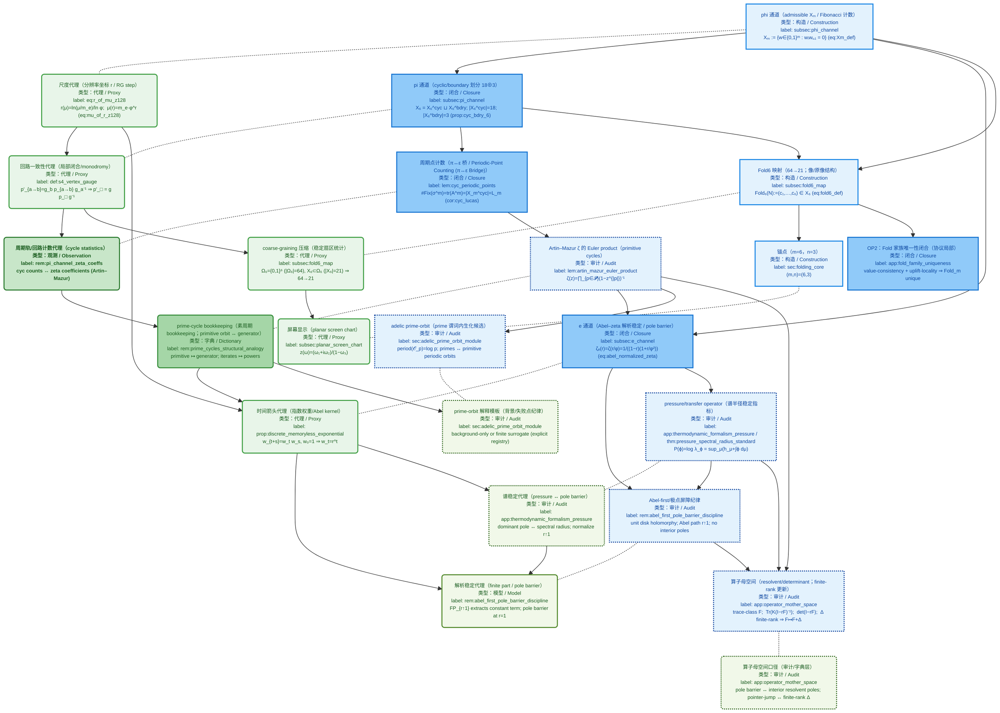
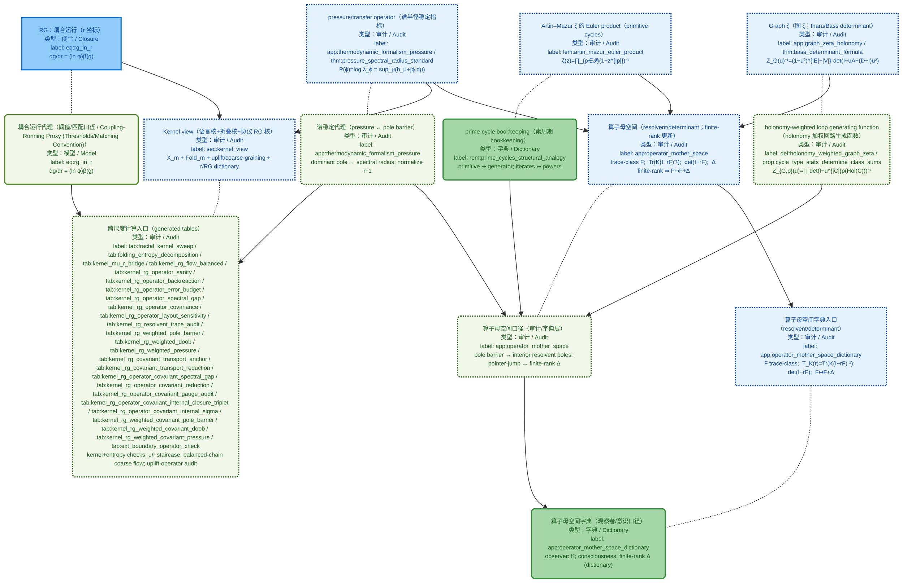
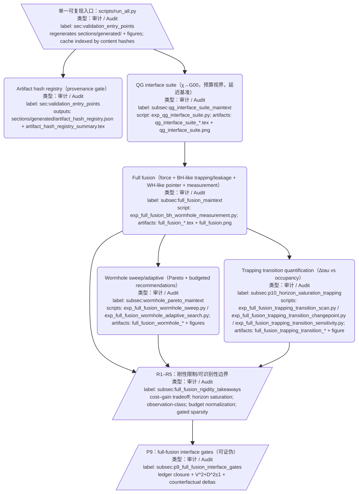

# z128 大架构图：数学–物理双骨架 DAG / z128 Architecture: Math–Physics Dual-Skeleton DAG

- **实线有向边（`-->`）**：直接推导 / 依赖（保持无环）
- **虚线无向边（`-.-`）**：数学概念 ↔ 物理概念的对应（字典映射；无箭头）

## 图例

- **节点内类型标注**：每个节点第二行以 `类型：...` 显示（与颜色/边框分型一致）
- **数学节点（Math）**：
  - **命名**：以 `M_` 开头
  - **外形**：矩形 `[...]`
  - **颜色**：蓝色系（同色系分型：`math_axiom` / `math_construct` / `math_closure` / `math_cont` / `math_audit` / `math_assumption`）
  - **含义**：闭合层的对象/构造/命题链（Tick+CAP 约束下的有限构造、折叠、锚点、连续代表等）
  - **同色系区分（蓝系）**：
    - **`math_axiom`（类型：公理 / Axiom）**：公理/原语（更深填充 + 粗边 + 加粗）
    - **`math_construct`（类型：构造 / Construction）**：定义/构造/映射（浅蓝实线边）
    - **`math_closure`（类型：闭合 / Closure）**：命题/定理/闭合结论（中蓝填充）
    - **`math_cont`（类型：连续 / Continuum）**：连续代表（偏青蓝填充）
    - **`math_assumption`（类型：假设 / Assumption）**：假设（蓝系 + 节点边框虚线）
    - **`math_audit`（类型：审计 / Audit）**：审计/误差/可证伪输出（蓝系 + 节点边框点虚线）
- **物理节点（Physics / Iface）**：
  - **命名**：以 `P_` 开头
  - **外形**：圆角矩形 `(...)`
  - **颜色**：绿色系（同色系分型：`phys_proxy` / `phys_obs` / `phys_dict` / `phys_model` / `phys_audit`）
  - **含义**：可操作量与观测链（协议化的可观测/可拟合/可证伪代理）
  - **同色系区分（绿系）**：
    - **`phys_proxy`（类型：代理 / Proxy）**：操作代理/坐标/几何口径（浅绿）
    - **`phys_obs`（类型：观测 / Observation）**：观测量/通道（更深填充 + 加粗）
    - **`phys_dict`（类型：字典 / Dictionary）**：识别字典/语义映射（中绿填充）
    - **`phys_model`（类型：模型 / Model）**：连续模型代理（偏黄绿/浅绿灰）
    - **`phys_audit`（类型：审计 / Audit）**：拟合/反演/误差/检验（绿系 + 节点边框点虚线）
- **接口目标节点（Wish/Motive）**：
  - **外形**：圆角矩形 `(...)`
  - **颜色**：粉色系（`classDef iface`）
  - **含义**：组织语言与审计目标（不作为数学层前提，仅用于接口层/审计层叙事与选择说明）
- **输入节点（Input）**：
  - **外形**：I/O 倾斜平行四边形（Lean Left）`@{ shape: lean-l, label: "..." }`
  - **含义**：基础输入（公理/假设/外部 matching 输入/可选候选族输入等）。倾斜平行四边形仅用于视觉标记“输入”属性；其类型/颜色仍按节点内 `类型：...` 与 class 分型显示。
- **可证伪预测节点（Predictions）**：
  - **外形**：I/O 倾斜平行四边形（Lean Right）`@{ shape: lean-r, label: "..." }`
  - **含义**：论文 `\label{sec:falsifiability}` 中逐条列出的可证伪陈述（P1–P7）。每个节点绑定其自身的 `\label{subsec:p*_...}`，并通过少量关键依赖边指向其所需的观测通道/字典/审计协议。
- **对应关系（Math ↔ Physics）**：
  - **形式**：每对相邻的 `M_*` 与 `P_*` 用 **`-.-`** 连接
  - **含义**：字典式对应（无箭头；**对应≠同一概念**，仅表示接口层对数学对象的物理识别/代理）
- **推导关系（同骨架内部）**：
  - **形式**：用 **`-->`** 串联
  - **含义**：依赖/推导顺序（保持有向无环）

### 图 1：接口目标与读出/扫描骨架（Tick → Readout → CAP → golden scan → φ 通道） / Fig. 1: Interface Goals and Readout/Scan Skeleton (Tick → Readout → CAP → golden scan → φ channel)

```mermaid
%%{init: {"maxTextSize": 100000, "flowchart": {"useMaxWidth": false, "nodeSpacing": 10, "rankSpacing": 50}, "themeVariables": {"fontSize": "10px"}}}%%
flowchart TB

  P_wish("Wish（协议稳定目标数据）<br/>类型：接口 / Interface<br/>label: def:wish_protocol_stable_data<br/>Wish := (stable readout type, invariants)")
  P_motive("Motive（目标函数：误差/代价/熵）<br/>类型：接口 / Interface<br/>label: def:motive_objective_functional<br/>J := mismatch + overhead + (optional) entropy")

  M_tick@{ shape: lean-l, label: "Tick（读出序列性）<br/>类型：公理 / Axiom<br/>label: ax:readout_sequentiality<br/>t = 0,1,2,…" }
  P_dt("时间步（可操作 tick）<br/>类型：代理 / Proxy<br/>label: sec:tick_calculus<br/>Δt := t₂ − t₁")
  M_tick -.- P_dt

  M_readout["有限读出原语（scan/window/word）<br/>类型：构造 / Construction<br/>label: sec:hpa_readout<br/>wₙ := 𝟙{zₙ∈W} ∈ {0,1} (eq:window_word)"]
  P_obs("有限观测对象（窗口词/事件序列 / Finite Observables (Window-Word/Event Sequence)）<br/>类型：观测 / Observation<br/>label: subsec:window_projection<br/>wₙ := 𝟙{zₙ∈W} ∈ {0,1} (eq:window_word)")
  M_readout -.- P_obs

  M_embed_gap["嵌入+投影读出（加法=投影；gap 失败点）<br/>类型：审计 / Audit<br/>label: sec:embedding_gap_projection<br/>Z(n)=ρ(n)e^{iθ×(n)};  πσ(c|v) ∝ exp(−|v−Z(c)|²/σ²)"]
  P_embed_gap("投影读出代理（gap/上同调失败点；协议声明）<br/>类型：审计 / Audit<br/>label: sec:embedding_gap_projection<br/>δ=v−Z(π(v));  H¹≠0 ⇒ residual not removable")
  M_embed_gap -.- P_embed_gap

  M_cut_project["cut-and-project（窗口→模型集 Λ(W)）<br/>类型：审计 / Audit<br/>label: sec:cut_and_project_bridge<br/>Λ(W)={π∥(ℓ): ℓ∈Z², π⊥(ℓ)∈W}"]
  P_cut_project("模型集/tiling 代理（staircase 证书母语）<br/>类型：审计 / Audit<br/>label: sec:cut_and_project_bridge<br/>S_N=Σ_{k< N} w_k ≈ ⌊Nα+β⌋")
  M_cut_project -.- P_cut_project

  M_cyclic_calc["cyclic calculus（Θ-差分/轨道 trace/Abel finite part）<br/>类型：审计 / Audit<br/>label: app:cyclic_calculus_theta_fp<br/>Δ_Θ; Tr_Θ; FP_Θ"]
  P_cyclic_calc("有限差分/有限部统一模板（更新步微积分）<br/>类型：审计 / Audit<br/>label: app:cyclic_calculus_theta_fp<br/>finite differences + Abel-first")
  M_cyclic_calc -.- P_cyclic_calc

  M_morita["Weyl pair 对偶/等价（Fourier exchange / Morita）<br/>类型：审计 / Audit<br/>label: rem:weyl_morita_fourier_exchange<br/>U↔V (Fourier);  α'=(aα+b)/(cα+d) (Morita)"]
  P_morita("scan↔readout 对偶代理（频率/谱读出）<br/>类型：审计 / Audit<br/>label: rem:weyl_morita_fourier_exchange<br/>translation ↔ phase; representation exchange")
  M_morita -.- P_morita

  M_cap@{ shape: lean-l, label: "CAP（有界复杂度闭合算子）<br/>类型：公理 / Axiom<br/>label: ax:cap<br/>c* := argmin_{c∈C} J(c)" }
  P_select("审计选择（候选族+目标函数+tie-break）<br/>类型：审计 / Audit<br/>label: app:cap_audit_template<br/>θ* := argmin_{θ∈Θ(B)} J(θ)")
  M_cap -.- P_select

  M_selupd["Sel/Upd/gap（分岔/切换的有限数学载体）<br/>类型：审计 / Audit<br/>label: sec:unified_spine<br/>Sel(F,J,≺), Upd: (F,J,≺)→(F',J',≺')"]
  P_selupd("分岔/切换统一词汇（prefix/fiber + gap-stability）<br/>类型：审计 / Audit<br/>label: app:branching_selection_rigidity<br/>prefix projection π; Ext_m(u); gap-stability")
  M_selupd -.- P_selupd

  M_ref_state["参考态/投影极限（window-word→投影测量）<br/>类型：审计 / Audit<br/>label: app:reference_state_and_cuts<br/>⟨ω_{x0,δ}, Π_W Θ^n ω_{x0,δ}⟩ → 1_W(x0+nα)"]
  P_ref_state("cut 顺序敏感与谱模板（对易→实谱；非对易→复谱）<br/>类型：审计 / Audit<br/>label: app:reference_state_and_cuts<br/>PHQ spectrum template")
  M_ref_state -.- P_ref_state

  M_zeck_primecycles["Zeckendorf shift primitive cycles（Möbius/ζ/det）<br/>类型：审计 / Audit<br/>label: app:zeckendorf_shift_prime_cycles<br/>P_n=tr(A^n); π_n via Möbius"]
  P_zeck_primecycles("primitive-cycle 细化模板（prime cycles bookkeeping）<br/>类型：审计 / Audit<br/>label: app:zeckendorf_shift_prime_cycles<br/>Euler product over primitive cycles")
  M_zeck_primecycles -.- P_zeck_primecycles

  M_jordan_triality["Jordan/triality 候选（为何三）<br/>类型：审计 / Audit<br/>label: app:jordan_triality_candidate<br/>J_3(O); triality as template"]
  P_jordan_triality("三扇区候选本体（仅登记，不入闭合）<br/>类型：审计 / Audit<br/>label: app:jordan_triality_candidate<br/>registry/MDL gate if invoked")
  M_jordan_triality -.- P_jordan_triality

  M_alpha_geo["α_geo 三通道阻抗候选（仅对照）<br/>类型：审计 / Audit<br/>label: app:alpha_geo_impedance_candidate<br/>α_geo^{-1}=V_bulk+V_boundary+V_line"]
  P_alpha_geo("α 候选族/匹配对照（显式有限族门禁）<br/>类型：审计 / Audit<br/>label: app:alpha_geo_impedance_candidate<br/>Sel(Fα,J,≺) + MDL registry")
  M_alpha_geo -.- P_alpha_geo

  M_golden["黄金分支（有限深度 continued-fraction 最小性）<br/>类型：闭合 / Closure<br/>label: prop:golden_least_discrepancy<br/>C_m(α) := Σ_{k=0..m} a_{k+1}  (α=[0;a1,a2,…])"]
  P_scan("均匀扫描代理（覆盖/各向同性 / Uniform-Scan Proxy (Coverage/Isotropy)）<br/>类型：代理 / Proxy<br/>label: subsec:phyllotaxis_overlay<br/>Δθ = 2π/φ² (golden-angle step)")
  M_golden -.- P_scan

  M_sturmian_persist["Sturmian 持续性证书族（complexity/return scales）<br/>类型：审计 / Audit<br/>label: app:sturmian_return_times_qk / app:sturmian_entropy / app:sturmian_uniform_recurrence<br/>p(n)=n+1; h_top=0; τ≤q_k+q_{k+1}; bounded-type: τ≤(A+2)m (golden: 3m)"]
  P_sturmian_persist("持续性/回归尺度代理（persistence / return-time proxies）<br/>类型：审计 / Audit<br/>label: app:sturmian_return_times_qk<br/>bounded gaps; q_k-scales; joint-minimax at A=1")
  M_sturmian_persist -.- P_sturmian_persist

  M_golden --> M_sturmian_persist

  M_gauss["Gauss map 重整化（黄金分支固定点）<br/>类型：审计 / Audit<br/>label: rem:gauss_map_fixed_point<br/>G(ξ)={1/ξ};  α=1/φ is a fixed point"]
  P_gauss("扫描参数重整化代理（renormalization-stable）<br/>类型：审计 / Audit<br/>label: rem:gauss_map_fixed_point<br/>α=[0;1,1,1,…] (all CF digits minimal)")
  M_gauss -.- P_gauss

  M_phi["phi 通道（admissible Xₘ / Fibonacci 计数）<br/>类型：构造 / Construction<br/>label: subsec:phi_channel<br/>Xₘ := {w∈{0,1}ᵐ : wᵢwᵢ₊₁ = 0} (eq:Xm_def)"]
  P_phi("尺度代理（分辨率坐标 r / RG step）<br/>类型：代理 / Proxy<br/>label: eq:r_of_mu_z128<br/>r(μ)=ln(μ/m_e)/ln φ;  μ(r)=m_e·φ^r (eq:mu_of_r_z128)")
  M_phi -.- P_phi

  P_wish --> P_motive --> P_select

  M_tick --> M_readout
  P_dt --> P_obs
  M_readout --> M_morita
  P_obs --> P_morita

  M_readout --> M_embed_gap
  P_obs --> P_embed_gap
  M_readout --> M_cut_project
  P_obs --> P_cut_project
  M_readout --> M_cyclic_calc
  M_cyclic_calc --> M_embed_gap
  M_embed_gap --> M_alpha_geo
  M_embed_gap --> M_jordan_triality

  M_cap --> M_golden
  M_readout --> M_golden
  M_cap --> M_selupd
  P_select --> P_selupd
  M_selupd --> M_embed_gap
  M_selupd --> M_cut_project
  M_selupd --> M_alpha_geo
  M_selupd --> M_jordan_triality
  P_select --> P_scan
  P_obs --> P_scan
  P_obs --> P_ref_state
  M_readout --> M_ref_state
  M_zeck_primecycles --> M_morita
  M_golden --> M_gauss
  P_scan --> P_gauss

  M_golden --> M_phi
  P_scan --> P_phi

  classDef iface fill:#FCE4EC,stroke:#D81B60,color:#880E4F,stroke-width:2px;
  classDef open_problem fill:#FFEBEE,stroke:#C62828,color:#B71C1C,stroke-width:2px,font-weight:700;
  classDef not_closed fill:#FFF3E0,stroke:#EF6C00,color:#E65100,stroke-width:2px;
  classDef scope_gap fill:#EEEEEE,stroke:#616161,color:#212121,stroke-width:2px,stroke-dasharray: 2 2;
  classDef math_axiom fill:#BBDEFB,stroke:#1565C0,color:#0D47A1,stroke-width:3px,font-weight:700;
  classDef math_construct fill:#E3F2FD,stroke:#1E88E5,color:#0D47A1,stroke-width:2px;
  classDef math_closure fill:#90CAF9,stroke:#1976D2,color:#0D47A1,stroke-width:2px;
  classDef math_cont fill:#E1F5FE,stroke:#039BE5,color:#01579B,stroke-width:2px;
  classDef math_assumption fill:#E3F2FD,stroke:#1E88E5,color:#0D47A1,stroke-width:2px,stroke-dasharray: 6 3;
  classDef math_audit fill:#E3F2FD,stroke:#0D47A1,color:#0D47A1,stroke-width:2px,stroke-dasharray: 2 2;
  classDef phys_proxy fill:#E8F5E9,stroke:#43A047,color:#1B5E20,stroke-width:2px;
  classDef phys_obs fill:#C8E6C9,stroke:#2E7D32,color:#1B5E20,stroke-width:2px,font-weight:700;
  classDef phys_dict fill:#A5D6A7,stroke:#388E3C,color:#1B5E20,stroke-width:2px;
  classDef phys_model fill:#F1F8E9,stroke:#558B2F,color:#1B5E20,stroke-width:2px;
  classDef phys_audit fill:#F1F8E9,stroke:#33691E,color:#1B5E20,stroke-width:2px,stroke-dasharray: 2 2;

  class P_wish,P_motive iface;
  class M_tick,M_cap math_axiom;
  class M_readout,M_phi math_construct;
  class M_golden math_closure;
  class M_morita,M_gauss,M_embed_gap,M_cut_project math_audit;
  class P_dt,P_scan,P_phi phys_proxy;
  class P_obs phys_obs;
  class P_morita,P_gauss,P_select,P_embed_gap,P_cut_project phys_audit;
```



### 图 2：三通道与折叠锚点（φ/π/ε → Fold → Anchor） / Fig. 2: Three Channels and Folding Anchor (φ/π/ε → Fold → Anchor)



### 图 3：显示预算与空间寻址（6-DoF coarse-lock → bulk d=3 → addressing/local） / Fig. 3: Display Budget and Spatial Addressing (6-DoF coarse-lock → bulk d=3 → addressing/local)

```mermaid
%%{init: {"maxTextSize": 100000, "flowchart": {"useMaxWidth": false, "nodeSpacing": 10, "rankSpacing": 50}, "themeVariables": {"fontSize": "10px"}}}%%
flowchart TB

  %% === Shared upstream audit bridges referenced below (avoid unlabeled ID boxes) ===
  M_input_planck@{ shape: lean-l, label: "Planck（CMB/宇宙学参数）<br/>类型：审计 / Audit<br/>label: subsec:external_inputs_inventory" }
  P_input_planck@{ shape: lean-l, label: "Planck（目标 / targets；Match）<br/>类型：审计 / Audit<br/>label: subsec:external_inputs_inventory" }
  M_input_planck -.- P_input_planck

  M_pressure["pressure/transfer operator（谱半径稳定指标）<br/>类型：审计 / Audit<br/>label: app:thermodynamic_formalism_pressure / thm:pressure_spectral_radius_standard<br/>P(ϕ)=log λ_ϕ = sup_μ(h_μ+∫ϕ dμ)"]
  P_pressure("谱稳定代理（pressure ↔ pole barrier）<br/>类型：审计 / Audit<br/>label: app:thermodynamic_formalism_pressure<br/>dominant pole ↔ spectral radius; normalize r↑1")
  M_pressure -.- P_pressure

  M_operator_mother["算子母空间（resolvent/determinant；finite-rank 更新）<br/>类型：审计 / Audit<br/>label: app:operator_mother_space<br/>trace-class F;  Tr(K(I−rF)⁻¹);  det(I−rF);  Δ finite-rank ⇒ F↦F+Δ"]
  P_operator_mother("算子母空间口径（审计/字典层）<br/>类型：审计 / Audit<br/>label: app:operator_mother_space<br/>pole barrier ↔ interior resolvent poles; pointer-jump ↔ finite-rank Δ")
  M_operator_mother -.- P_operator_mother

  M_cap@{ shape: lean-l, label: "CAP（有界复杂度闭合算子）<br/>类型：公理 / Axiom<br/>label: ax:cap<br/>c* := argmin_{c∈C} J(c)" }
  P_select("审计选择（候选族+目标函数+tie-break）<br/>类型：审计 / Audit<br/>label: app:cap_audit_template<br/>θ* := argmin_{θ∈Θ(B)} J(θ)")
  M_cap -.- P_select

  M_anchor["锚点（m=6，n=3）<br/>类型：构造 / Construction<br/>label: sec:folding_core<br/>(m,n)=(6,3)"]
  P_screen("屏幕显示（planar screen chart）<br/>类型：代理 / Proxy<br/>label: subsec:planar_screen_chart<br/>z(ω)=(ω₁+iω₂)/(1−ω₃)")
  M_anchor -.- P_screen

  M_min_coarse_lock["最小 coarse-lock：每独立参数至少 1 bit（单窗）<br/>类型：审计 / Audit<br/>label: lem:minimal_one_bit_per_parameter<br/>|Ω_m|=2^m ≥ 2^k ⇒ m≥k"]
  P_min_coarse_lock("最小 coarse-lock（接口约定；审计）<br/>类型：审计 / Audit<br/>label: lem:minimal_one_bit_per_parameter<br/>single-window binning lower bound")
  M_min_coarse_lock -.- P_min_coarse_lock

  M_6dof_lock["6-DoF coarse-lock（刚体帧显示预算）<br/>类型：审计 / Audit<br/>label: subsec:6dof_lock / rem:6dof_lock_scope<br/>m ≥ dim SE(d)=d(d+1)/2 (two-bin/DoF)"]
  P_6dof_lock("6-DoF coarse-lock（接口：局域显示阈值）<br/>类型：字典 / Dictionary<br/>label: subsec:6dof_lock<br/>m=6 anchors single-window coarse localization")
  M_6dof_lock -.- P_6dof_lock

  M_bulk_dim["由锚点预算选出 bulk 维度<br/>类型：审计 / Audit<br/>label: prop:bulk_dimension_from_anchor<br/>m=6 ⇒ CAP selects d=3 (max admissible)"]
  P_bulk_dim("bulk dimension d=3（接口输出）<br/>类型：代理 / Proxy<br/>label: prop:bulk_dimension_from_anchor<br/>d=3 selected at anchor")
  M_bulk_dim -.- P_bulk_dim

  M_geometric_vacuum["几何真空/协议拒绝（m<6）<br/>类型：审计 / Audit<br/>label: subsubsec:geometric_vacuum<br/>sub-geometric modes treated as non-local background"]
  P_geometric_vacuum("sub-geometric vacuum / ghost-sector（接口）<br/>类型：代理 / Proxy<br/>label: subsubsec:geometric_vacuum<br/>below anchor: non-local background modes")
  M_geometric_vacuum -.- P_geometric_vacuum

  M_addr["寻址基（addressing basis）<br/>类型：构造 / Construction<br/>label: sec:hilbert_addressing<br/>Hₙ:{0,…,4ⁿ−1}→{0,…,2ⁿ−1}²"]
  P_addr("距离代理（寻址步数/图距离 / Distance Proxy (Addressing Steps/Graph Distance)）<br/>类型：代理 / Proxy<br/>label: def:protocol_distance<br/>dₙ(x,y):=dist_{Gₙ}(x,y)")
  M_addr -.- P_addr

  P_local("局域性代理（邻接/近邻 / Locality Proxy (Adjacency/Nearest Neighbor)）<br/>类型：代理 / Proxy<br/>label: def:addressing_map_graph<br/>Gₙ: nearest-neighbor graph on display sites")

  M_anchor --> M_6dof_lock --> M_bulk_dim --> M_geometric_vacuum
  M_min_coarse_lock --> M_6dof_lock
  M_cap --> M_bulk_dim

  P_screen --> P_6dof_lock
  P_min_coarse_lock --> P_6dof_lock
  P_6dof_lock --> P_bulk_dim --> P_geometric_vacuum
  P_select --> P_bulk_dim

  M_anchor --> M_addr
  P_screen --> P_addr

  P_addr --> P_local

  classDef iface fill:#FCE4EC,stroke:#D81B60,color:#880E4F,stroke-width:2px;
  classDef open_problem fill:#FFEBEE,stroke:#C62828,color:#B71C1C,stroke-width:2px,font-weight:700;
  classDef not_closed fill:#FFF3E0,stroke:#EF6C00,color:#E65100,stroke-width:2px;
  classDef scope_gap fill:#EEEEEE,stroke:#616161,color:#212121,stroke-width:2px,stroke-dasharray: 2 2;
  classDef math_axiom fill:#BBDEFB,stroke:#1565C0,color:#0D47A1,stroke-width:3px,font-weight:700;
  classDef math_construct fill:#E3F2FD,stroke:#1E88E5,color:#0D47A1,stroke-width:2px;
  classDef math_closure fill:#90CAF9,stroke:#1976D2,color:#0D47A1,stroke-width:2px;
  classDef math_cont fill:#E1F5FE,stroke:#039BE5,color:#01579B,stroke-width:2px;
  classDef math_assumption fill:#E3F2FD,stroke:#1E88E5,color:#0D47A1,stroke-width:2px,stroke-dasharray: 6 3;
  classDef math_audit fill:#E3F2FD,stroke:#0D47A1,color:#0D47A1,stroke-width:2px,stroke-dasharray: 2 2;
  classDef phys_proxy fill:#E8F5E9,stroke:#43A047,color:#1B5E20,stroke-width:2px;
  classDef phys_obs fill:#C8E6C9,stroke:#2E7D32,color:#1B5E20,stroke-width:2px,font-weight:700;
  classDef phys_dict fill:#A5D6A7,stroke:#388E3C,color:#1B5E20,stroke-width:2px;
  classDef phys_model fill:#F1F8E9,stroke:#558B2F,color:#1B5E20,stroke-width:2px;
  classDef phys_audit fill:#F1F8E9,stroke:#33691E,color:#1B5E20,stroke-width:2px,stroke-dasharray: 2 2;

  class M_cap math_axiom;
  class M_anchor,M_addr math_construct;
  class M_min_coarse_lock,M_6dof_lock,M_bulk_dim,M_geometric_vacuum math_audit;
  class P_screen,P_addr,P_local,P_bulk_dim,P_geometric_vacuum phys_proxy;
  class P_6dof_lock phys_dict;
  class P_select,P_min_coarse_lock phys_audit;
```



### 图 4：手性/反物质/CPT 协议几何（χ_H、SCL、mirror protocol） / Fig. 4: Protocol Geometry for Chirality/Antimatter/CPT (χ_H, SCL, mirror protocol)

```mermaid
%%{init: {"maxTextSize": 100000, "flowchart": {"useMaxWidth": false, "nodeSpacing": 10, "rankSpacing": 50}, "themeVariables": {"fontSize": "10px"}}}%%
flowchart TB

  M_tick@{ shape: lean-l, label: "Tick（读出序列性）<br/>类型：公理 / Axiom<br/>label: ax:readout_sequentiality<br/>t = 0,1,2,…" }
  P_dt("时间步（可操作 tick）<br/>类型：代理 / Proxy<br/>label: sec:tick_calculus<br/>Δt := t₂ − t₁")
  M_tick -.- P_dt

  M_readout["有限读出原语（scan/window/word）<br/>类型：构造 / Construction<br/>label: sec:hpa_readout<br/>wₙ := 𝟙{zₙ∈W} ∈ {0,1} (eq:window_word)"]
  P_obs("有限观测对象（窗口词/事件序列 / Finite Observables (Window-Word/Event Sequence)）<br/>类型：观测 / Observation<br/>label: subsec:window_projection<br/>wₙ := 𝟙{zₙ∈W} ∈ {0,1} (eq:window_word)")
  M_readout -.- P_obs

  M_addr["寻址基（addressing basis）<br/>类型：构造 / Construction<br/>label: sec:hilbert_addressing<br/>Hₙ:{0,…,4ⁿ−1}→{0,…,2ⁿ−1}²"]
  P_addr("距离代理（寻址步数/图距离 / Distance Proxy (Addressing Steps/Graph Distance)）<br/>类型：代理 / Proxy<br/>label: def:protocol_distance<br/>dₙ(x,y):=dist_{Gₙ}(x,y)")
  M_addr -.- P_addr

  M_d4_layouts["D4 布局族与取向类（rotation/reflection）<br/>类型：审计 / Audit<br/>label: lem:d4_layouts<br/>8 layouts split into 2 orientation classes"]
  P_d4_layouts("D4 layout family（D4 布局族；interface dictionary）<br/>类型：字典 / Dictionary<br/>label: lem:d4_layouts<br/>orientation class is the nontrivial discrete choice")
  M_d4_layouts -.- P_d4_layouts

  M_chi_def["离散 Hilbert 手性指标 χ_H（定义）<br/>类型：构造 / Construction<br/>label: eq:hilbert_chi_def<br/>signed turning / orientation datum"]
  P_chi_def("chirality index χ_H（手性指标 χ_H；audit-visible sign datum）<br/>类型：字典 / Dictionary<br/>label: eq:hilbert_chi_def<br/>parity-odd protocol observable")
  M_chi_def -.- P_chi_def

  M_chi_flip["Parity 与 traversal reversal 翻转 χ_H<br/>类型：闭合 / Closure<br/>label: prop:chi_flip<br/>reflection or path reversal ⇒ χ_H↦−χ_H"]
  P_chi_flip("χ_H sign flip law（χ_H 符号翻转律；protocol parity/time reversal proxy）<br/>类型：审计 / Audit<br/>label: prop:chi_flip<br/>rotation preserves χ_H; reflection reverses")
  M_chi_flip -.- P_chi_flip

  M_ptc_defs["protocol P/T/C definitions（协议 P/T/C 定义）<br/>类型：构造 / Construction<br/>label: subsec:ptc_definitions / def:ptc_protocol<br/>P_prot,T_prot,C_prot defined on finite readout"]
  P_ptc_defs("protocol P/T/C definitions（协议 P/T/C 定义；interface）<br/>类型：字典 / Dictionary<br/>label: subsec:ptc_definitions<br/>auditable finite-resolution operations")
  M_ptc_defs -.- P_ptc_defs

  M_scl["Scan–chirality locking（SCL：取向类 bit + CAP tie-break）<br/>类型：审计 / Audit<br/>label: subsec:scl / def:scl<br/>canonical class chosen; mirror flips sgn(χ_H)"]
  P_scl("SCL（取向类 bit；mirror protocol）<br/>类型：字典 / Dictionary<br/>label: def:scl<br/>mirror protocol swap ↔ χ_H sign flip")
  M_scl -.- P_scl

  M_orientation_min["取向类是最小离散协议 datum（仅一比特可辨）<br/>类型：闭合 / Closure<br/>label: prop:orientation_class_minimal<br/>physically distinguishable choice = orientation class"]
  P_orientation_min("orientation class minimality（取向类最小性；interface）<br/>类型：审计 / Audit<br/>label: prop:orientation_class_minimal<br/>rotations are conventions; reflection is distinct")
  M_orientation_min -.- P_orientation_min

  M_conj_reversal["共轭=反向（初相位翻转 / Conjugation = Reversal (Initial-Phase Flip)）<br/>类型：闭合 / Closure<br/>label: lem:conjugation_reversal<br/>conjugation ↔ n↦−n up to x0 flip"]
  P_conj_reversal("conjugation-as-reversal（共轭=反向；scan layer）<br/>类型：审计 / Audit<br/>label: lem:conjugation_reversal<br/>finite protocol avatar of C_prot")
  M_conj_reversal -.- P_conj_reversal

  M_conj_readout_rev["匹配窗口下：共轭读出诱导 scan reversal<br/>类型：闭合 / Closure<br/>label: lem:conjugation_readout_reversal<br/>w'_n = w_{−n}"]
  P_conj_readout_rev("matched-window conjugation induces readout reversal（匹配窗口：共轭诱导读出反转）<br/>类型：审计 / Audit<br/>label: lem:conjugation_readout_reversal<br/>auditable word-level duality")
  M_conj_readout_rev -.- P_conj_readout_rev

  M_antimatter_dual["反物质=共轭读出（word reversal dual）<br/>类型：构造 / Construction<br/>label: subsec:antimatter_duality / def:word_reversal_dual<br/>w ↦ w_rev"]
  P_antimatter_dual("antimatter as conjugate readout（反物质=共轭读出；interface）<br/>类型：字典 / Dictionary<br/>label: subsec:antimatter_duality<br/>word reversal dual within matched protocol")
  M_antimatter_dual -.- P_antimatter_dual

  M_cp_sign_anchor["CP-odd 符号锚定：sgn(J_CP)=sgn(χ_H)<br/>类型：审计 / Audit<br/>label: def:chi_cp_sign / rem:cp_sign_convention<br/>fix sign within fixed PDG convention"]
  P_cp_sign_anchor("chirality-anchored CP sign convention（手性锚定的 CP 符号约定；interface）<br/>类型：审计 / Audit<br/>label: def:chi_cp_sign<br/>resolves δ ↔ π−δ ambiguity")
  M_cp_sign_anchor -.- P_cp_sign_anchor

  M_cpt_protocol["scan 层 CPT vs 协议层对称破缺（接口解释）<br/>类型：审计 / Audit<br/>label: subsec:cpt_protocol<br/>P/T may be protocol swaps; CPT as consistency reference"]
  P_cpt_protocol("CPT at scan layer vs protocol layer（扫描层 vs 协议层；audit-facing）<br/>类型：审计 / Audit<br/>label: subsec:cpt_protocol<br/>no continuum axioms used as premises")
  M_cpt_protocol -.- P_cpt_protocol

  M_mirror_universe["mirror protocol / right-handed universe（取向类翻转）<br/>类型：审计 / Audit<br/>label: subsec:mirror_universe<br/>global χ_H sign flip; domain walls ⇒ P2"]
  P_mirror_universe("mirror protocol domains（镜像协议域；prediction-facing）<br/>类型：审计 / Audit<br/>label: subsec:mirror_universe<br/>domain boundaries are protocol defects")
  M_mirror_universe -.- P_mirror_universe

  P_p2@{ shape: lean-r, label: "P2：手性域缺陷与大尺度奇偶统计签名<br/>类型：审计 / Audit<br/>label: subsec:p2_domain_walls" }
  P_p5@{ shape: lean-r, label: "P5：离散混合预测与量化鲁棒性（CKM/PMNS）<br/>类型：审计 / Audit<br/>label: subsec:p5_quantified_predictions" }

  M_tick --> M_readout
  P_dt --> P_obs

  M_addr --> M_d4_layouts --> M_chi_def --> M_chi_flip --> M_scl --> M_mirror_universe
  M_chi_flip --> M_orientation_min --> M_scl
  M_d4_layouts --> M_ptc_defs
  M_tick --> M_ptc_defs
  M_ptc_defs --> M_cpt_protocol

  M_readout --> M_conj_reversal --> M_conj_readout_rev --> M_antimatter_dual
  M_scl --> M_cp_sign_anchor

  P_addr --> P_d4_layouts --> P_chi_def --> P_chi_flip --> P_scl --> P_mirror_universe
  P_chi_flip --> P_orientation_min --> P_scl
  P_ptc_defs --> P_cpt_protocol
  P_conj_reversal --> P_conj_readout_rev --> P_antimatter_dual
  P_cp_sign_anchor --> P_p5
  P_mirror_universe --> P_p2

  P_scl --> P_cp_sign_anchor

  P_addr --> P_p2

  classDef iface fill:#FCE4EC,stroke:#D81B60,color:#880E4F,stroke-width:2px;
  classDef open_problem fill:#FFEBEE,stroke:#C62828,color:#B71C1C,stroke-width:2px,font-weight:700;
  classDef not_closed fill:#FFF3E0,stroke:#EF6C00,color:#E65100,stroke-width:2px;
  classDef scope_gap fill:#EEEEEE,stroke:#616161,color:#212121,stroke-width:2px,stroke-dasharray: 2 2;
  classDef math_axiom fill:#BBDEFB,stroke:#1565C0,color:#0D47A1,stroke-width:3px,font-weight:700;
  classDef math_construct fill:#E3F2FD,stroke:#1E88E5,color:#0D47A1,stroke-width:2px;
  classDef math_closure fill:#90CAF9,stroke:#1976D2,color:#0D47A1,stroke-width:2px;
  classDef math_cont fill:#E1F5FE,stroke:#039BE5,color:#01579B,stroke-width:2px;
  classDef math_assumption fill:#E3F2FD,stroke:#1E88E5,color:#0D47A1,stroke-width:2px,stroke-dasharray: 6 3;
  classDef math_audit fill:#E3F2FD,stroke:#0D47A1,color:#0D47A1,stroke-width:2px,stroke-dasharray: 2 2;
  classDef phys_proxy fill:#E8F5E9,stroke:#43A047,color:#1B5E20,stroke-width:2px;
  classDef phys_obs fill:#C8E6C9,stroke:#2E7D32,color:#1B5E20,stroke-width:2px,font-weight:700;
  classDef phys_dict fill:#A5D6A7,stroke:#388E3C,color:#1B5E20,stroke-width:2px;
  classDef phys_model fill:#F1F8E9,stroke:#558B2F,color:#1B5E20,stroke-width:2px;
  classDef phys_audit fill:#F1F8E9,stroke:#33691E,color:#1B5E20,stroke-width:2px,stroke-dasharray: 2 2;

  class M_tick math_axiom;
  class M_readout,M_addr,M_chi_def,M_ptc_defs,M_antimatter_dual math_construct;
  class M_chi_flip,M_orientation_min,M_conj_reversal,M_conj_readout_rev math_closure;
  class M_d4_layouts,M_scl,M_cp_sign_anchor,M_cpt_protocol,M_mirror_universe math_audit;
  class P_dt,P_addr phys_proxy;
  class P_obs phys_obs;
  class P_d4_layouts,P_chi_def,P_ptc_defs,P_scl,P_antimatter_dual phys_dict;
  class P_chi_flip,P_orientation_min,P_conj_reversal,P_conj_readout_rev,P_cp_sign_anchor,P_cpt_protocol,P_mirror_universe,P_p2,P_p5 phys_audit;

  style P_p2 stroke-width:4px;
  style P_p5 stroke-width:4px;
```



### 图 5：连接、holonomy 与 Z128 相位提升（phase-lift CP bridge） / Fig. 5: Connections, Holonomy, and Z128 Phase Lift (phase-lift CP bridge)

```mermaid
%%{init: {"maxTextSize": 100000, "flowchart": {"useMaxWidth": false, "nodeSpacing": 10, "rankSpacing": 50}, "themeVariables": {"fontSize": "10px"}}}%%
flowchart TB

  M_cap@{ shape: lean-l, label: "CAP（有界复杂度闭合算子）<br/>类型：公理 / Axiom<br/>label: ax:cap<br/>c* := argmin_{c∈C} J(c)" }
  P_select("审计选择（候选族+目标函数+tie-break）<br/>类型：审计 / Audit<br/>label: app:cap_audit_template<br/>θ* := argmin_{θ∈Θ(B)} J(θ)")
  M_cap -.- P_select

  M_capinv_local["CAP 在等价类上良定义（合法性门槛）<br/>类型：审计 / Audit<br/>label: prop:cap_on_equiv_classes<br/>J,κ invariants ⇒ CAP output well-defined"]

  M_anchor["锚点（m=6，n=3）<br/>类型：构造 / Construction<br/>label: sec:folding_core<br/>(m,n)=(6,3)"]
  P_screen("屏幕显示（planar screen chart）<br/>类型：代理 / Proxy<br/>label: subsec:planar_screen_chart<br/>z(ω)=(ω₁+iω₂)/(1−ω₃)")
  M_anchor -.- P_screen

  M_conn["连接（有限 transport 数据）<br/>类型：构造 / Construction<br/>label: def:hamming_microstates<br/>d_H(u,v)=∑_{i=1}⁶ |uᵢ−vᵢ|"]
  P_conn("transport 代理（edge mismatch / 传输补偿）<br/>类型：代理 / Proxy<br/>label: lem:edge_transport_welldefined<br/>p_{a→b}∈S₄ (min-cost + lex tie-break)")
  M_conn -.- P_conn

  M_holo["holonomy（回路不变量）<br/>类型：构造 / Construction<br/>label: prop:cycle_type_gauge_invariant<br/>p_□ := p_{a→b}·p_{b→c}·p_{c→d}·p_{d→a}"]
  P_holo("曲率代理（plaquette/loop 统计）<br/>类型：观测 / Observation<br/>label: prop:cycle_type_gauge_invariant<br/>p_□ ↦ g p_□ g⁻¹ ⇒ cycle type invariant")
  M_holo -.- P_holo

  M_z128_label["Z128 相位寄存器（dyadic register）<br/>类型：审计 / Audit<br/>label: subsec:z128_label<br/>phase ∈ Z_{2^p}, baseline p=7 at m=6"]
  P_z128_label("Z128 phase-register dictionary（Z128 相位寄存器字典；dyadic）<br/>类型：字典 / Dictionary<br/>label: subsec:z128_label<br/>p=m+1=7 at anchor; bounded sweeps audited")
  M_z128_label -.- P_z128_label

  M_tau_family["相位映射 τ 的有界族（bit-level maps）<br/>类型：审计 / Audit<br/>label: rem:tau_family_bounded<br/>τ ∈ {id, gray, bitrev, not} (CAP tie-break)"]
  P_tau_family("phase-map family τ（相位映射族 τ；audit-bounded）<br/>类型：审计 / Audit<br/>label: rem:tau_family_bounded<br/>explicit finite family + CAP tie-break")
  M_tau_family -.- P_tau_family

  M_dyadic_phase_register["dyadic 相位寄存器与 denom=2^p（含 Z128）<br/>类型：审计 / Audit<br/>label: rem:dyadic_phase_register<br/>denom=2^p; p=7 ↔ Z128"]
  P_dyadic_phase_register("dyadic phase register（dyadic 相位寄存器；audit）<br/>类型：审计 / Audit<br/>label: rem:dyadic_phase_register<br/>nested refinement chain 2^p")
  M_dyadic_phase_register -.- P_dyadic_phase_register

  M_cosmo_pin@{ shape: lean-r, label: "cosmology pin（m*≈15 与 dyadic baseline）<br/>类型：审计 / Audit<br/>label: sec:rigidity_bridge_spine / cor:dyadic_cosmology_consistency_pin<br/>m* matches m_b*=2p+1 at p=7" }

  M_phase_lift_cp["相位寄存器提升：edge transport → unitary holonomy<br/>类型：审计 / Audit<br/>label: subsec:holonomy_phase_lift_cp<br/>U_{a→b} ∈ U(4) (phase-weighted)"]
  P_phase_lift_cp("phase-lift holonomy（CP-odd 可检验代理）<br/>类型：审计 / Audit<br/>label: subsec:holonomy_phase_lift_cp<br/>extract mixing angles/δ (PDG diagnostic)")
  M_phase_lift_cp -.- P_phase_lift_cp

  M_cp_odd_J["CP-odd 不变量 J（phase-lift holonomy）<br/>类型：审计 / Audit<br/>label: tab:holonomy_phase_lift_j / tab:holonomy_phase_lift_family<br/>J := Im(U11 U22 U12* U21*)"]
  P_cp_odd_J("CP-odd Jarlskog-type proxy J（CP 奇 Jarlskog 型代理 J；audit output）<br/>类型：观测 / Observation<br/>label: tab:holonomy_phase_lift_j / tab:holonomy_phase_lift_family<br/>bounded denom sweeps + failures")
  M_cp_odd_J -.- P_cp_odd_J

  M_graphzeta["Graph ζ（图 ζ；Ihara/Bass determinant）<br/>类型：审计 / Audit<br/>label: app:graph_zeta_holonomy / thm:bass_determinant_formula<br/>Z_G(u)⁻¹=(1−u²)^{|E|−|V|}·det(I−uA+(D−I)u²)"]
  P_graphzeta("holonomy-weighted loop generating function（holonomy 加权回路生成函数）<br/>类型：审计 / Audit<br/>label: def:holonomy_weighted_graph_zeta / prop:cycle_type_stats_determine_class_sums<br/>Z_{G,ρ}(u)=∏ det(I−u^{|C|}ρ(Hol(C)))⁻¹")
  M_graphzeta -.- P_graphzeta

  M_op3_yang_mills["OP3：holonomy→YM/EFT（代表闭合 + 小环定理桥）<br/>类型：连续 / Continuum<br/>label: app:continuum_yang_mills_from_holonomy<br/>finite holonomy → Wilson proxy → Tr(F^2) + O(a^6) (thm:wilson_small_plaquette_expansion)"]
  P_wilson("Wilson-loop 代理（W,1-W）<br/>类型：观测 / Observation<br/>label: tab:holonomy_balanced_chain_wilson<br/>W := Re(tr(Q))/3;  A := 1 - W")
  M_op3_yang_mills -.- P_wilson

  M_cl1["CL1：refinement compatibility（跨尺度兼容）\n类型：审计 / Audit\nlabel: app:discrete_connection_family_and_refinement"]
  P_cl1("CL1 audit（balanced-chain TV/MaxΔ）\n类型：审计 / Audit\nlabel: tab:holonomy_balanced_chain_convergence_audit")
  M_cl1 -.- P_cl1

  M_cl2["CL2：scale map family（尺度映射有限族）\n类型：审计 / Audit\nlabel: app:scale_map_and_small_loop_regularity_contract"]
  P_cl2("CL2 table（scale-map family, normalized）\n类型：审计 / Audit\nlabel: tab:scale_map_balanced_chain_family")
  M_cl2 -.- P_cl2

  M_cl3["CL3：small-loop regularity（正则性 bundle）\n类型：假设 / Assumption\nlabel: ass:small_loop_regularity_bundle"]
  M_cl4["CL4：variational convergence（Gamma-limit bridge）\n类型：假设 / Assumption\nlabel: app:gamma_convergence_wilson_to_yang_mills"]

  M_holo --> M_cl1 --> M_cl2 --> M_cl3 --> M_cl4 --> M_op3_yang_mills

  P_wilson_residual("Wilson residual 缩放审计（commuting SU(2) toy）<br/>类型：审计 / Audit<br/>label: tab:curvature_bridge_wilson<br/>residual := |(1−ReTr/N) − (a^4/(2N))Tr(F^2)|;  residual/a^6")
  M_op3_yang_mills -.- P_wilson_residual

  M_transport_audit["transport rule 稳定性（padding/truncation/tie-break）<br/>类型：审计 / Audit<br/>label: tab:holonomy_transport_rule_sensitivity<br/>TV distance + frac_{3/4} envelope"]
  P_transport_audit("transport rule 反事实族（look-elsewhere 审计）<br/>类型：审计 / Audit<br/>label: tab:holonomy_transport_rule_sensitivity<br/>bounded counterfactual families")
  M_transport_audit -.- P_transport_audit

  M_gauge["gauge 补偿（局部重标记冗余）<br/>类型：构造 / Construction<br/>label: def:s4_vertex_gauge<br/>p_{a→b} ↦ g_b p_{a→b} g_a⁻¹"]
  P_gauge("规范冗余/场代理（补偿数据 / Gauge-Redundancy/Field Proxy (Compensation Data)）<br/>类型：代理 / Proxy<br/>label: def:s4_vertex_gauge<br/>loop holonomy: p_□ ↦ g p_□ g⁻¹")
  M_gauge -.- P_gauge

  M_action["Seff：CAP 选出的作用量骨架<br/>类型：连续 / Continuum<br/>label: eq:cap_minimal_action_skeleton<br/>S_eff=∫ d⁴x √(−g)[(R−2Λ)/(16πG) − λ_F(∇χ)² − V(χ²) − ∑_a Tr(F_a²)/(4g_a²) + 𝓛_m]"]
  P_action("有效作用量代理（连续代表 / Effective Action Proxy (Continuous Representative)）<br/>类型：模型 / Model<br/>label: prop:cap_minimal_action_skeleton<br/>CAP selects S_eff within a finite candidate family")
  M_action -.- P_action

  M_conn --> M_holo
  P_conn --> P_holo

  M_anchor --> M_z128_label --> M_dyadic_phase_register
  M_cap --> M_tau_family
  M_conn --> M_phase_lift_cp --> M_cp_odd_J
  M_holo -.-> M_phase_lift_cp
  M_dyadic_phase_register --> M_phase_lift_cp
  M_tau_family --> M_phase_lift_cp
  M_dyadic_phase_register -.-> M_cosmo_pin

  P_screen --> P_z128_label --> P_dyadic_phase_register
  P_select --> P_tau_family
  P_conn --> P_phase_lift_cp --> P_cp_odd_J
  P_dyadic_phase_register --> P_phase_lift_cp
  P_tau_family --> P_phase_lift_cp
  P_dyadic_phase_register -.-> P_cosmo_pin

  M_capinv_local -.-> M_tau_family
  M_capinv_local -.-> M_transport_audit
  M_capinv_local -.-> M_phase_lift_cp

  M_holo --> M_op3_yang_mills
  M_action --> M_op3_yang_mills
  P_holo --> P_wilson

  M_holo --> M_gauge
  P_holo --> P_gauge
  M_holo --> M_graphzeta
  P_holo --> P_graphzeta

  M_conn --> M_transport_audit
  M_holo --> M_transport_audit
  P_conn --> P_transport_audit
  P_holo --> P_transport_audit

  classDef iface fill:#FCE4EC,stroke:#D81B60,color:#880E4F,stroke-width:2px;
  classDef open_problem fill:#FFEBEE,stroke:#C62828,color:#B71C1C,stroke-width:2px,font-weight:700;
  classDef not_closed fill:#FFF3E0,stroke:#EF6C00,color:#E65100,stroke-width:2px;
  classDef scope_gap fill:#EEEEEE,stroke:#616161,color:#212121,stroke-width:2px,stroke-dasharray: 2 2;
  classDef math_axiom fill:#BBDEFB,stroke:#1565C0,color:#0D47A1,stroke-width:3px,font-weight:700;
  classDef math_construct fill:#E3F2FD,stroke:#1E88E5,color:#0D47A1,stroke-width:2px;
  classDef math_closure fill:#90CAF9,stroke:#1976D2,color:#0D47A1,stroke-width:2px;
  classDef math_cont fill:#E1F5FE,stroke:#039BE5,color:#01579B,stroke-width:2px;
  classDef math_assumption fill:#E3F2FD,stroke:#1E88E5,color:#0D47A1,stroke-width:2px,stroke-dasharray: 6 3;
  classDef math_audit fill:#E3F2FD,stroke:#0D47A1,color:#0D47A1,stroke-width:2px,stroke-dasharray: 2 2;
  classDef phys_proxy fill:#E8F5E9,stroke:#43A047,color:#1B5E20,stroke-width:2px;
  classDef phys_obs fill:#C8E6C9,stroke:#2E7D32,color:#1B5E20,stroke-width:2px,font-weight:700;
  classDef phys_dict fill:#A5D6A7,stroke:#388E3C,color:#1B5E20,stroke-width:2px;
  classDef phys_model fill:#F1F8E9,stroke:#558B2F,color:#1B5E20,stroke-width:2px;
  classDef phys_audit fill:#F1F8E9,stroke:#33691E,color:#1B5E20,stroke-width:2px,stroke-dasharray: 2 2;

  class M_cap math_axiom;
  class M_anchor,M_conn,M_holo,M_gauge math_construct;
  class M_action,M_op3_yang_mills math_cont;
  class M_graphzeta,M_transport_audit,M_z128_label,M_tau_family,M_dyadic_phase_register,M_phase_lift_cp,M_cp_odd_J,M_cl1,M_cl2,M_capinv_local,M_cosmo_pin math_audit;
  class M_cl3,M_cl4 math_assumption;
  class P_screen,P_conn,P_gauge phys_proxy;
  class P_holo,P_wilson,P_cp_odd_J phys_obs;
  class P_z128_label phys_dict;
  class P_action phys_model;
  class P_graphzeta,P_select,P_transport_audit,P_tau_family,P_dyadic_phase_register,P_phase_lift_cp phys_audit;
```



### 图 6：三因子字典与 SM 标号闭合（含耦合/CKM/PMNS 审计） / Fig. 6: Three-Factor Dictionary and SM Label Closure (incl. couplings/CKM/PMNS audits)

```mermaid
%%{init: {"maxTextSize": 100000, "flowchart": {"useMaxWidth": false, "nodeSpacing": 10, "rankSpacing": 50}, "themeVariables": {"fontSize": "10px"}}}%%
flowchart TB

  M_cap@{ shape: lean-l, label: "CAP（有界复杂度闭合算子）<br/>类型：公理 / Axiom<br/>label: ax:cap<br/>c* := argmin_{c∈C} J(c)" }

  M_cp_sign_anchor["CP-odd 符号锚定：sgn(J_CP)=sgn(χ)<br/>类型：审计 / Audit<br/>label: def:chi_cp_sign / rem:cp_sign_convention<br/>fix sign within fixed PDG convention"]
  P_cp_sign_anchor("chirality-anchored CP sign convention（手性锚定的 CP 符号约定；interface）<br/>类型：审计 / Audit<br/>label: def:chi_cp_sign<br/>resolves δ ↔ π−δ ambiguity")
  M_cp_sign_anchor -.- P_cp_sign_anchor

  M_cp_odd_J["CP-odd 不变量 J（phase-lift holonomy）<br/>类型：审计 / Audit<br/>label: tab:holonomy_phase_lift_j / tab:holonomy_phase_lift_family<br/>J := Im(U11 U22 U12* U21*)"]
  P_cp_odd_J("CP-odd Jarlskog-type proxy J（CP 奇 Jarlskog 型代理 J；audit output）<br/>类型：观测 / Observation<br/>label: tab:holonomy_phase_lift_j / tab:holonomy_phase_lift_family<br/>bounded denom sweeps + failures")
  M_cp_odd_J -.- P_cp_odd_J

  M_gauge["gauge 补偿（局部重标记冗余）<br/>类型：构造 / Construction<br/>label: def:s4_vertex_gauge<br/>p_{a→b} ↦ g_b p_{a→b} g_a⁻¹"]
  P_gauge("规范冗余/场代理（补偿数据 / Gauge-Redundancy/Field Proxy (Compensation Data)）<br/>类型：代理 / Proxy<br/>label: def:s4_vertex_gauge<br/>loop holonomy: p_□ ↦ g p_□ g⁻¹")
  M_gauge -.- P_gauge

  M_gauge3["三因子 gauge 因子闭合（条件闭合）<br/>类型：审计 / Audit<br/>label: prop:channel_to_gauge<br/>output: U(1)×SU(2)×SU(3) within stated family"]
  P_gauge3("三因子 gauge 因子识别（接口）<br/>类型：字典 / Dictionary<br/>label: prop:channel_to_gauge<br/>three channels -> U(1), SU(2), SU(3) (conditional)")
  M_gauge3 -.- P_gauge3

  M_g1@{ shape: lean-l, label: "G1：三通道因子化（独立冗余立场）<br/>类型：审计 / Audit<br/>label: lem:three_channel_factorization" }
  P_g1@{ shape: lean-l, label: "G1：三通道因子化（接口审计）<br/>类型：审计 / Audit<br/>label: lem:three_channel_factorization" }
  M_g1 -.- P_g1

  M_g2@{ shape: lean-l, label: "G2：概率保持冗余 ⇒ 紧致性（connected）<br/>类型：审计 / Audit<br/>label: prop:unitary_implies_compact_redundancy" }
  P_g2@{ shape: lean-l, label: "G2：紧致冗余（建模字典前提）<br/>类型：审计 / Audit<br/>label: prop:unitary_implies_compact_redundancy" }
  M_g2 -.- P_g2

  M_g4@{ shape: lean-l, label: "G4：复杂度标号与 tie-break（族敏感性审计）<br/>类型：审计 / Audit<br/>label: app:gauge_complexity_sensitivity / prop:gauge_label_robustness" }
  P_g4@{ shape: lean-l, label: "G4：复杂度标号与 tie-break（接口审计）<br/>类型：审计 / Audit<br/>label: app:gauge_complexity_sensitivity / prop:gauge_label_robustness" }
  M_g4 -.- P_g4

  M_holonomy_diag@{ shape: lean-l, label: "G3c：holonomy/phase-lift 诊断→候选族闭合（接口规则）<br/>类型：审计 / Audit<br/>label: app:gauge3_holonomy_candidate_closure / def:holonomy_to_candidate_family_rule" }
  P_holonomy_diag@{ shape: lean-l, label: "G3c：holonomy/phase-lift 诊断（接口审计）<br/>类型：审计 / Audit<br/>label: app:gauge3_holonomy_candidate_closure" }
  M_holonomy_diag -.- P_holonomy_diag

  M_consensus_p2@{ shape: lean-l, label: "P2：三因子规范结构（接口）<br/>类型：假设 / Assumption<br/>label: ass:consensus_three_factor_gauge" }
  P_consensus_p2@{ shape: lean-l, label: "P2：三因子规范结构（Match）<br/>类型：审计 / Audit<br/>label: ass:consensus_three_factor_gauge" }
  M_consensus_p2 -.- P_consensus_p2

  M_consensus_p3@{ shape: lean-l, label: "P3：匹配尺度 μ* 与 RG 字典<br/>类型：假设 / Assumption<br/>label: ass:consensus_matching_scale_rg" }
  P_consensus_p3@{ shape: lean-l, label: "P3：匹配尺度 μ* 与 RG 字典（Match）<br/>类型：审计 / Audit<br/>label: ass:consensus_matching_scale_rg" }
  M_consensus_p3 -.- P_consensus_p3

  M_internal_fiber_g2@{ shape: lean-l, label: "内部纤维：守范数组合律→Hurwitz→三通道最小性⇒八元数 O；G2=Aut(O)（可选）<br/>类型：假设 / Assumption<br/>label: app:internal_fiber_g2_optional / ass:m2star_internal_fiber_g2 / cor:octonion_three_channel_minimality" }
  P_internal_fiber_g2@{ shape: lean-l, label: "内部纤维微观路线（Hurwitz+最小性；Match）<br/>类型：审计 / Audit<br/>label: app:internal_fiber_g2_optional" }
  M_internal_fiber_g2 -.- P_internal_fiber_g2

  M_sm["SM 标号闭合（21 stable labels）<br/>类型：闭合 / Closure<br/>label: thm:labeling_unique<br/>𝓛_SM: X₆ → 𝓕_SM ⊔ {U(1),SU(2),SU(3)}"]
  P_types("识别字典（stable types ↔ 粒子/场）<br/>类型：字典 / Dictionary<br/>label: tab:sm_labeling_table<br/>stable types ↔ (fermion multiplets, gauge factors)")
  M_sm -.- P_types

  M_alpha_geo["α_em^{-1} 的三层几何阻抗闭合<br/>类型：审计 / Audit<br/>label: subsec:alpha_impedance / eq:alpha_geo / thm:alpha_three_channel<br/>α_em^{-1} = 4π^3 + π^2 + π"]
  P_alpha_geo("α_em^{-1}（CODATA/PDG 对照；mismatch 作为 matching）<br/>类型：审计 / Audit<br/>label: subsec:alpha_impedance<br/>audit: bounded-family closure + log mismatch")
  M_alpha_geo -.- P_alpha_geo

  M_ew_weinberg["电弱归一化与 Weinberg 角闭合<br/>类型：审计 / Audit<br/>label: subsec:weinberg_angle / thm:weinberg_angle<br/>sin^2θ_W(μ_Z)=3/13;  α^{-1}(μ_Z)=13π^2"]
  P_ew_weinberg("Weinberg angle / α(μ_Z)（PDG 对照）<br/>类型：审计 / Audit<br/>label: subsec:weinberg_angle<br/>bounded rigidity + mismatch")
  M_ew_weinberg -.- P_ew_weinberg

  M_cp_volume["CP 破坏：CP-odd 相空间体积刚性目标<br/>类型：审计 / Audit<br/>label: subsec:cp_jarlskog / eq:j_geo / prop:jarlskog_rigidity_stmt<br/>J_geo = 1/(11π^7)"]
  P_cp_volume("CP violation rigidity target（CKM Jarlskog 对照）<br/>类型：审计 / Audit<br/>label: subsec:cp_jarlskog<br/>data channel: CKM fits; fail criterion explicit")
  M_cp_volume -.- P_cp_volume

  M_ckm_mag["CKM 混合幅度：bounded-complexity 深度闭合<br/>类型：审计 / Audit<br/>label: subsec:ckm_mixing_depths / prop:ckm_mixing_rigidity<br/>r_mix(x):= -log x / log φ (candidate family)"]
  P_ckm_mag("CKM magnitudes（PDG 参考目标）<br/>类型：审计 / Audit<br/>label: subsec:ckm_mixing_depths<br/>finite family + deterministic tie-break + gaps")
  M_ckm_mag -.- P_ckm_mag

  M_ckm_matrix["CKM 矩阵重建（PDG 参数化；诊断）<br/>类型：审计 / Audit<br/>label: subsec:ckm_matrix_closure<br/>angles+δ extracted; unitarity diagnostics"]
  P_ckm_matrix("CKM matrix reconstruction（CKM 矩阵重建；audit output）<br/>类型：审计 / Audit<br/>label: subsec:ckm_matrix_closure<br/>tables: |V_ij|, angles, unitarity")
  M_ckm_matrix -.- P_ckm_matrix

  M_pmns_mag["PMNS 混合幅度闭合（bounded family）<br/>类型：审计 / Audit<br/>label: subsec:pmns_mixing_depths / prop:pmns_mixing_rigidity<br/>targets: s12, s23, s13"]
  P_pmns_mag("PMNS mixing targets（NuFIT/PDG 对照）<br/>类型：审计 / Audit<br/>label: subsec:pmns_mixing_depths<br/>table: tab:pmns_mixing")
  M_pmns_mag -.- P_pmns_mag

  M_pmns_matrix["PMNS 矩阵与 Dirac δ 离散闭合<br/>类型：审计 / Audit<br/>label: subsec:pmns_matrix_closure / tab:pmns_delta_sweep<br/>bounded-denominator δ selection + unitarity diagnostics"]
  P_pmns_matrix("PMNS matrix/δ closure（PMNS 矩阵/δ 闭合；audit output）<br/>类型：审计 / Audit<br/>label: subsec:pmns_matrix_closure<br/>tables: tab:pmns_matrix; tab:pmns_delta_sweep")
  M_pmns_matrix -.- P_pmns_matrix

  M_input_pdg@{ shape: lean-l, label: "PDG（粒子数据）<br/>类型：审计 / Audit<br/>label: subsec:external_inputs_inventory" }
  P_input_pdg@{ shape: lean-l, label: "PDG（目标 / targets；Match）<br/>类型：审计 / Audit<br/>label: subsec:external_inputs_inventory" }
  M_input_pdg -.- P_input_pdg

  M_input_codata@{ shape: lean-l, label: "CODATA（基本常数）<br/>类型：审计 / Audit<br/>label: subsec:external_inputs_inventory" }
  P_input_codata@{ shape: lean-l, label: "CODATA（目标 / targets；Match）<br/>类型：审计 / Audit<br/>label: subsec:external_inputs_inventory" }
  M_input_codata -.- P_input_codata

  M_input_nufit@{ shape: lean-l, label: "NuFIT（中微子振荡全局拟合）<br/>类型：审计 / Audit<br/>label: subsec:external_inputs_inventory" }
  P_input_nufit@{ shape: lean-l, label: "NuFIT（目标 / targets；Match）<br/>类型：审计 / Audit<br/>label: subsec:external_inputs_inventory" }
  M_input_nufit -.- P_input_nufit

  M_input_bhplanck@{ shape: lean-l, label: "BH/Planck（面积律/熵界/普朗克单位）<br/>类型：审计 / Audit<br/>label: subsec:external_inputs_inventory" }
  P_input_bhplanck@{ shape: lean-l, label: "BH/Planck（目标 / targets；Match）<br/>类型：审计 / Audit<br/>label: subsec:external_inputs_inventory" }
  M_input_bhplanck -.- P_input_bhplanck

  M_bh_planck_calib["边界–普朗克容量校准（BH 信息→(m,n)）<br/>类型：审计 / Audit<br/>label: app:bh_planck_capacity_calibration<br/>output: (m*,n*), n(m), mismatch"]
  P_bh_planck_calib("边界容量校准代理（BH 信息↔协议容量）<br/>类型：审计 / Audit<br/>label: app:bh_planck_capacity_calibration<br/>I_BH vs I_prot(m,n); finite-family CAP; generated fragments")
  M_bh_planck_calib -.- P_bh_planck_calib

  M_mass_flow_uplift["质量流（window uplift pooled depth）<br/>类型：审计 / Audit<br/>label: app:mass_flow_under_uplift<br/>output: rhat_CAP(u;m), rhat_FE(u;m)"]
  P_mass_flow_uplift("uplift pooled depth（代表态池化：CAP vs free-energy）<br/>类型：审计 / Audit<br/>label: app:mass_flow_under_uplift")
  M_mass_flow_uplift -.- P_mass_flow_uplift

  M_cp_odd_J --> M_cp_sign_anchor

  P_cp_odd_J --> P_cp_sign_anchor

  M_gauge --> M_gauge3 --> M_sm
  M_g1 --> M_gauge3
  M_g2 --> M_gauge3
  M_g4 --> M_gauge3
  M_holonomy_diag --> M_gauge3

  P_gauge --> P_gauge3 --> P_types
  P_g1 --> P_gauge3
  P_g2 --> P_gauge3
  P_g4 --> P_gauge3
  P_holonomy_diag --> P_gauge3

  %% BH/Planck capacity calibration and uplift-mass-flow audits (attach to main chain via CAP)
  M_cap --> M_bh_planck_calib
  M_input_bhplanck --> M_bh_planck_calib --> M_mass_flow_uplift
  P_input_bhplanck --> P_bh_planck_calib --> P_mass_flow_uplift

  M_cap --> M_alpha_geo
  M_gauge3 --> M_alpha_geo
  M_input_codata --> M_alpha_geo

  M_cap --> M_ew_weinberg
  M_gauge3 --> M_ew_weinberg
  M_sm --> M_ew_weinberg
  M_input_pdg --> M_ew_weinberg

  M_cap --> M_cp_volume
  M_cp_odd_J --> M_cp_volume
  M_input_pdg --> M_cp_volume

  M_cap --> M_ckm_mag --> M_ckm_matrix
  M_input_pdg --> M_ckm_mag
  M_cp_volume --> M_ckm_matrix

  M_cap --> M_pmns_mag --> M_pmns_matrix
  M_sm --> M_pmns_mag
  M_input_nufit --> M_pmns_mag
  M_input_pdg --> M_pmns_mag
  M_cp_sign_anchor --> M_pmns_matrix

  P_input_codata --> P_alpha_geo
  P_input_pdg --> P_ew_weinberg
  P_input_pdg --> P_cp_volume
  P_cp_odd_J --> P_cp_volume
  P_input_pdg --> P_ckm_mag --> P_ckm_matrix
  P_cp_volume --> P_ckm_matrix

  P_input_nufit --> P_pmns_mag --> P_pmns_matrix
  P_input_pdg --> P_pmns_mag
  P_cp_sign_anchor --> P_pmns_matrix

  M_consensus_p2 -.-> M_gauge3
  M_internal_fiber_g2 -.-> M_gauge3
  P_consensus_p2 -.-> P_gauge3
  P_internal_fiber_g2 -.-> P_gauge3

  classDef iface fill:#FCE4EC,stroke:#D81B60,color:#880E4F,stroke-width:2px;
  classDef open_problem fill:#FFEBEE,stroke:#C62828,color:#B71C1C,stroke-width:2px,font-weight:700;
  classDef not_closed fill:#FFF3E0,stroke:#EF6C00,color:#E65100,stroke-width:2px;
  classDef scope_gap fill:#EEEEEE,stroke:#616161,color:#212121,stroke-width:2px,stroke-dasharray: 2 2;
  classDef math_axiom fill:#BBDEFB,stroke:#1565C0,color:#0D47A1,stroke-width:3px,font-weight:700;
  classDef math_construct fill:#E3F2FD,stroke:#1E88E5,color:#0D47A1,stroke-width:2px;
  classDef math_closure fill:#90CAF9,stroke:#1976D2,color:#0D47A1,stroke-width:2px;
  classDef math_cont fill:#E1F5FE,stroke:#039BE5,color:#01579B,stroke-width:2px;
  classDef math_assumption fill:#E3F2FD,stroke:#1E88E5,color:#0D47A1,stroke-width:2px,stroke-dasharray: 6 3;
  classDef math_audit fill:#E3F2FD,stroke:#0D47A1,color:#0D47A1,stroke-width:2px,stroke-dasharray: 2 2;
  classDef phys_proxy fill:#E8F5E9,stroke:#43A047,color:#1B5E20,stroke-width:2px;
  classDef phys_obs fill:#C8E6C9,stroke:#2E7D32,color:#1B5E20,stroke-width:2px,font-weight:700;
  classDef phys_dict fill:#A5D6A7,stroke:#388E3C,color:#1B5E20,stroke-width:2px;
  classDef phys_model fill:#F1F8E9,stroke:#558B2F,color:#1B5E20,stroke-width:2px;
  classDef phys_audit fill:#F1F8E9,stroke:#33691E,color:#1B5E20,stroke-width:2px,stroke-dasharray: 2 2;

  class M_cap math_axiom;
  class M_gauge math_construct;
  class M_sm math_closure;
  class M_consensus_p2,M_consensus_p3,M_internal_fiber_g2 math_assumption;
  class M_input_pdg,M_input_codata,M_input_nufit,M_input_bhplanck,M_bh_planck_calib,M_mass_flow_uplift,M_g1,M_g2,M_g4,M_cp_odd_J,M_cp_sign_anchor,M_alpha_geo,M_ew_weinberg,M_cp_volume,M_ckm_mag,M_ckm_matrix,M_pmns_mag,M_pmns_matrix math_audit;
  class M_gauge3,M_holonomy_diag math_audit;
  class P_gauge phys_proxy;
  class P_cp_odd_J phys_obs;
  class P_types phys_dict;
  class P_input_pdg,P_input_codata,P_input_nufit,P_input_bhplanck,P_bh_planck_calib,P_mass_flow_uplift,P_consensus_p2,P_consensus_p3,P_internal_fiber_g2,P_g1,P_g2,P_g4,P_holonomy_diag,P_cp_sign_anchor,P_alpha_geo,P_ew_weinberg,P_cp_volume,P_ckm_mag,P_ckm_matrix,P_pmns_mag,P_pmns_matrix phys_audit;
  class P_gauge3 phys_dict;
```



### 图 7：质量谱与中微子机制审计闭合链（Majorana/Weinberg/seesaw） / Fig. 7: Mass Spectrum and Neutrino-Mechanism Audit Closure Chain (Majorana/Weinberg/seesaw)

```mermaid
%%{init: {"maxTextSize": 100000, "flowchart": {"useMaxWidth": false, "nodeSpacing": 10, "rankSpacing": 50}, "themeVariables": {"fontSize": "10px"}}}%%
flowchart TB

  M_consensus_p1@{ shape: lean-l, label: "P1：低能 EFT 共识（SM+GR）<br/>类型：假设 / Assumption<br/>label: ass:consensus_sm_gr_eft" }
  P_consensus_p1@{ shape: lean-l, label: "P1：低能 EFT 共识（SM+GR；Match）<br/>类型：审计 / Audit<br/>label: ass:consensus_sm_gr_eft" }
  M_consensus_p1 -.- P_consensus_p1

  M_neutrino_majorana["中微子质量机制与 Majorana 相位（条件闭合：机制注册表 + 相位闭合）<br/>类型：审计 / Audit<br/>label: sec:pmns_neutrino_closure<br/>status: bounded candidate families + deterministic CAP/tie-break; external channels as feasibility/audit"]
  P_neutrino_majorana("中微子机制/相位接口（条件闭合 / Neutrino-Mechanism/Phase Interface (Conditional Closure)）<br/>类型：审计 / Audit<br/>label: sec:pmns_neutrino_closure<br/>mechanism registry + Majorana-phase closure under mββ bound")
  M_neutrino_majorana -.- P_neutrino_majorana

  M_neutrino_external_audit["中微子外部审计通道（0νββ, Σmν, mβ, sterile）<br/>类型：审计 / Audit<br/>label: app:neutrino_external_audit_channels / tab:neutrino_external_audit_ledger<br/>status: Match/Audit only; not used in CAP selection"]
  P_neutrino_external_audit("外部通道账本与失败条件（审计 / External-Channel Ledger and Failure Criteria (Audit)）<br/>类型：审计 / Audit<br/>label: app:neutrino_external_audit_channels<br/>inputs: data/neutrino_external_audit/inputs.json")
  M_neutrino_external_audit -.- P_neutrino_external_audit

  M_neutrino_mech_registry["中微子质量机制候选族注册表（C1--C4；审计）<br/>类型：审计 / Audit<br/>label: app:neutrino_mass_mechanism_candidates / tab:neutrino_mechanism_candidates / tab:neutrino_mechanism_scoreboard<br/>status: bounded registry + deterministic selection + audit scoreboard"]
  P_neutrino_mech_registry("机制候选族与失败点计分板（审计 / Mechanism Candidate Families and Failure-Point Scoreboard (Audit)）<br/>类型：审计 / Audit<br/>label: app:neutrino_mass_mechanism_candidates<br/>inputs: data/neutrino_mass_mechanisms/registry.json")
  M_neutrino_mech_registry -.- P_neutrino_mech_registry

  M_neutrino_majorana_phase_closure["Majorana 相位闭合（bounded family；审计）<br/>类型：审计 / Audit<br/>label: app:neutrino_majorana_phase_closure / tab:neutrino_majorana_phase_closure<br/>status: finite phase family + feasibility under mββ bound + deterministic key"]
  P_neutrino_majorana_phase_closure("Majorana 相位离散闭合输出（审计）<br/>类型：审计 / Audit<br/>label: app:neutrino_majorana_phase_closure<br/>outputs: neutrino_majorana_phase_closure_rows/summary")
  M_neutrino_majorana_phase_closure -.- P_neutrino_majorana_phase_closure

  M_neutrino_splitting_depth_closure["中微子分裂（Δm²）的有界有理 r-offset 尝试（审计）<br/>类型：审计 / Audit<br/>label: app:neutrino_splitting_depth_closure / tab:neutrino_splitting_depth_closure<br/>status: protocol-only CAP-min vs match-min; bounded rationals q≤12"]
  P_neutrino_splitting_depth_closure("Δm² 压缩/失败点计分板（审计）<br/>类型：审计 / Audit<br/>label: app:neutrino_splitting_depth_closure<br/>outputs: neutrino_splitting_depth_closure_rows/summary")
  M_neutrino_splitting_depth_closure -.- P_neutrino_splitting_depth_closure

  M_neutrino_weinberg_operator_closure["Weinberg 维五算符尺度（审计/接口）<br/>类型：审计 / Audit<br/>label: app:neutrino_weinberg_operator_closure / tab:neutrino_weinberg_scale<br/>status: Λ_W from mν,max; compare to staircase thresholds"]
  P_neutrino_weinberg_operator_closure("Weinberg 尺度输出（审计）<br/>类型：审计 / Audit<br/>label: app:neutrino_weinberg_operator_closure<br/>outputs: neutrino_weinberg_scale_rows/summary")
  M_neutrino_weinberg_operator_closure -.- P_neutrino_weinberg_operator_closure

  M_neutrino_typeI_seesaw_closure["Type-I seesaw 尺度（审计）<br/>类型：审计 / Audit<br/>label: app:neutrino_typeI_seesaw_closure / tab:neutrino_seesaw_scale<br/>M_R from mν,max and yν,eff (cap vs match)"]
  P_neutrino_typeI_seesaw_closure("Seesaw 尺度输出（审计）<br/>类型：审计 / Audit<br/>label: app:neutrino_typeI_seesaw_closure<br/>outputs: neutrino_seesaw_scale_rows/summary")
  M_neutrino_typeI_seesaw_closure -.- P_neutrino_typeI_seesaw_closure

  M_op5["OP5：标量/Yukawa 与 β 系数闭合（接口假设内）<br/>类型：审计 / Audit<br/>label: app:yukawa_beta_protocol_closure<br/>outputs: Yukawa spectrum/mixings; one-loop β coefficients"]
  P_op5("OP5：Yukawa/β 系数接口闭合（审计输出）<br/>类型：审计 / Audit<br/>label: app:yukawa_beta_protocol_closure<br/>beta functions as outputs, not inputs")
  M_op5 -.- P_op5

  M_sm["SM 标号闭合（21 stable labels）<br/>类型：闭合 / Closure<br/>label: thm:labeling_unique<br/>𝓛_SM: X₆ → 𝓕_SM ⊔ {U(1),SU(2),SU(3)}"]
  P_types("识别字典（stable types ↔ 粒子/场）<br/>类型：字典 / Dictionary<br/>label: tab:sm_labeling_table<br/>stable types ↔ (fermion multiplets, gauge factors)")
  M_sm -.- P_types

  M_pmns_matrix["PMNS 矩阵与 Dirac δ 离散闭合<br/>类型：审计 / Audit<br/>label: subsec:pmns_matrix_closure / tab:pmns_delta_sweep<br/>bounded-denominator δ selection + unitarity diagnostics"]
  P_pmns_matrix("PMNS matrix/δ closure（PMNS 矩阵/δ 闭合；audit output）<br/>类型：审计 / Audit<br/>label: subsec:pmns_matrix_closure<br/>tables: tab:pmns_matrix; tab:pmns_delta_sweep")
  M_pmns_matrix -.- P_pmns_matrix

  M_neutrino_mass_iface["中微子质量尺度接口（nearest-integer depth）<br/>类型：审计 / Audit<br/>label: subsec:neutrino_mass_interface / tab:neutrino_mass_interface<br/>r(μ)=ln(μ/m_e)/ln φ → r_hat ∈ ℤ"]
  P_neutrino_mass_iface("neutrino mass-scale interface（NuFIT/PDG 对照）<br/>类型：审计 / Audit<br/>label: subsec:neutrino_mass_interface<br/>table: tab:neutrino_mass_interface")
  M_neutrino_mass_iface -.- P_neutrino_mass_iface

  M_neutrino_smallness_iface["中微子微小性接口假说（不入证明链 / Neutrino Smallness Interface Hypothesis (Not in Proof Chain)）<br/>类型：假设 / Assumption<br/>label: subsec:neutrino_interface_hypothesis<br/>smallness ≈ protocol-decoupling maintenance cost"]

  M_mass["质量谱闭合（depth/latency）<br/>类型：闭合 / Closure<br/>label: eq:r_of_mu_z128<br/>r(μ)=ln(μ/m_e)/ln φ"]
  P_mass("质量代理（延迟/钟慢/散射 / Mass Proxy (Delay/Time Dilation/Scattering)）<br/>类型：观测 / Observation<br/>label: rem:mass_as_compton_clock<br/>ω_C=μc²/ħ;  τ_C=ħ/(μc²)")
  M_mass -.- P_mass

  M_mass_flow_uplift["质量流（window uplift 下的 pooled depth）<br/>类型：审计 / Audit<br/>label: app:mass_flow_under_uplift / tab:mass_flow_uplift<br/>output: rhat_CAP(u;m), rhat_FE(u;m)"]
  P_mass_flow_uplift("uplift pooled depth（代表态池化：CAP vs free-energy）<br/>类型：审计 / Audit<br/>label: app:mass_flow_under_uplift<br/>Ext_m(u) fiber pooling + deterministic tie-break")
  M_mass_flow_uplift -.- P_mass_flow_uplift

  M_proj["分辨率提升（projective semantics / inverse limit）<br/>类型：构造 / Construction<br/>label: subsec:resolution_projective_semantics<br/>π_{m→k}(w_m)=w_k;  objects ∈ lim← X_m"]
  P_proj("跨分辨率同一对象（兼容族 / Cross-Resolution Same Object (Compatible Family)）<br/>类型：字典 / Dictionary<br/>label: subsec:resolution_projective_semantics<br/>deterministic forgetting (π) ⊂ Markov coarse graining")
  M_proj -.- P_proj

  M_qm["量子测量（Born 规则 / POVM）<br/>类型：闭合 / Closure<br/>label: app:quantum_measurement_born<br/>eq:z128_born_povm — P_k=Tr(ρE_k)"]
  P_qm("Born rule / POVM（量子测量）<br/>类型：观测 / Observation<br/>label: app:quantum_measurement_born<br/>eq:z128_born_povm — P_k=Tr(ρE_k)")
  M_qm -.- P_qm

  M_hecke_like["Hecke-like refinement（矩阵/递推骨架）<br/>类型：审计 / Audit<br/>label: lem:trace_recurrence_2x2 / rem:extension_counts_matrix_view<br/>|Ext_m(u)| = e_{u6}^T A^{m-6} 1;  tr(M^{n+1})=tr(M)tr(M^n)−det(M)tr(M^{n-1})"]
  P_hecke_like("跨尺度算子模板（结构类比 / Cross-Scale Operator Template (Structural Analogy)）<br/>类型：审计 / Audit<br/>label: rem:hecke_trace_recurrence_skeleton<br/>Hecke: T_{p^{r+1}}=T_pT_{p^r}−p^{k−1}T_{p^{r−1}} (skeleton)")
  M_hecke_like -.- P_hecke_like

  M_input_pdg@{ shape: lean-l, label: "PDG（粒子数据）<br/>类型：审计 / Audit<br/>label: subsec:external_inputs_inventory" }
  P_input_pdg@{ shape: lean-l, label: "PDG（目标 / targets；Match）<br/>类型：审计 / Audit<br/>label: subsec:external_inputs_inventory" }
  M_input_pdg -.- P_input_pdg

  M_input_nufit@{ shape: lean-l, label: "NuFIT（中微子振荡全局拟合）<br/>类型：审计 / Audit<br/>label: subsec:external_inputs_inventory" }
  P_input_nufit@{ shape: lean-l, label: "NuFIT（目标 / targets；Match）<br/>类型：审计 / Audit<br/>label: subsec:external_inputs_inventory" }
  M_input_nufit -.- P_input_nufit

  M_mass --> M_neutrino_mass_iface
  M_input_nufit --> M_neutrino_mass_iface
  M_input_pdg --> M_neutrino_mass_iface
  M_pmns_matrix --> M_neutrino_external_audit
  M_neutrino_mass_iface --> M_neutrino_external_audit
  M_neutrino_mass_iface --> M_neutrino_smallness_iface
  M_neutrino_external_audit --> M_neutrino_mech_registry --> M_neutrino_majorana_phase_closure --> M_neutrino_majorana
  M_neutrino_mech_registry --> M_neutrino_splitting_depth_closure --> M_neutrino_majorana
  M_pmns_matrix --> M_neutrino_mech_registry
  M_neutrino_mass_iface --> M_neutrino_mech_registry
  M_mass_flow_uplift --> M_neutrino_mech_registry
  M_pmns_matrix --> M_neutrino_majorana_phase_closure
  M_neutrino_external_audit --> M_neutrino_majorana_phase_closure
  M_input_nufit --> M_neutrino_splitting_depth_closure
  M_mass --> M_neutrino_splitting_depth_closure

  M_consensus_p1 --> M_neutrino_weinberg_operator_closure
  M_op5 --> M_neutrino_weinberg_operator_closure
  M_neutrino_mech_registry --> M_neutrino_weinberg_operator_closure --> M_neutrino_majorana
  M_neutrino_weinberg_operator_closure --> M_neutrino_typeI_seesaw_closure --> M_neutrino_majorana
  M_consensus_p1 --> M_neutrino_typeI_seesaw_closure
  M_op5 --> M_neutrino_typeI_seesaw_closure

  M_mass --> M_mass_flow_uplift
  M_proj --> M_mass_flow_uplift
  M_hecke_like --> M_mass_flow_uplift

  P_mass --> P_mass_flow_uplift
  P_proj --> P_mass_flow_uplift
  P_hecke_like --> P_mass_flow_uplift

  P_input_nufit --> P_neutrino_mass_iface
  P_input_pdg --> P_neutrino_mass_iface
  P_pmns_matrix --> P_neutrino_external_audit
  P_neutrino_mass_iface --> P_neutrino_external_audit
  P_neutrino_external_audit --> P_neutrino_mech_registry --> P_neutrino_majorana_phase_closure --> P_neutrino_majorana
  P_neutrino_mech_registry --> P_neutrino_splitting_depth_closure --> P_neutrino_majorana
  P_pmns_matrix --> P_neutrino_mech_registry
  P_neutrino_mass_iface --> P_neutrino_mech_registry
  P_mass_flow_uplift --> P_neutrino_mech_registry
  P_pmns_matrix --> P_neutrino_majorana_phase_closure
  P_neutrino_external_audit --> P_neutrino_majorana_phase_closure
  P_input_nufit --> P_neutrino_splitting_depth_closure
  P_mass --> P_neutrino_splitting_depth_closure

  P_consensus_p1 --> P_neutrino_weinberg_operator_closure
  P_op5 --> P_neutrino_weinberg_operator_closure
  P_neutrino_mech_registry --> P_neutrino_weinberg_operator_closure --> P_neutrino_majorana
  P_neutrino_weinberg_operator_closure --> P_neutrino_typeI_seesaw_closure --> P_neutrino_majorana
  P_consensus_p1 --> P_neutrino_typeI_seesaw_closure
  P_op5 --> P_neutrino_typeI_seesaw_closure

  M_sm --> M_mass
  P_types --> P_mass

  M_sm --> M_neutrino_majorana
  M_qm --> M_neutrino_majorana

  classDef iface fill:#FCE4EC,stroke:#D81B60,color:#880E4F,stroke-width:2px;
  classDef open_problem fill:#FFEBEE,stroke:#C62828,color:#B71C1C,stroke-width:2px,font-weight:700;
  classDef not_closed fill:#FFF3E0,stroke:#EF6C00,color:#E65100,stroke-width:2px;
  classDef scope_gap fill:#EEEEEE,stroke:#616161,color:#212121,stroke-width:2px,stroke-dasharray: 2 2;
  classDef math_axiom fill:#BBDEFB,stroke:#1565C0,color:#0D47A1,stroke-width:3px,font-weight:700;
  classDef math_construct fill:#E3F2FD,stroke:#1E88E5,color:#0D47A1,stroke-width:2px;
  classDef math_closure fill:#90CAF9,stroke:#1976D2,color:#0D47A1,stroke-width:2px;
  classDef math_cont fill:#E1F5FE,stroke:#039BE5,color:#01579B,stroke-width:2px;
  classDef math_assumption fill:#E3F2FD,stroke:#1E88E5,color:#0D47A1,stroke-width:2px,stroke-dasharray: 6 3;
  classDef math_audit fill:#E3F2FD,stroke:#0D47A1,color:#0D47A1,stroke-width:2px,stroke-dasharray: 2 2;
  classDef phys_proxy fill:#E8F5E9,stroke:#43A047,color:#1B5E20,stroke-width:2px;
  classDef phys_obs fill:#C8E6C9,stroke:#2E7D32,color:#1B5E20,stroke-width:2px,font-weight:700;
  classDef phys_dict fill:#A5D6A7,stroke:#388E3C,color:#1B5E20,stroke-width:2px;
  classDef phys_model fill:#F1F8E9,stroke:#558B2F,color:#1B5E20,stroke-width:2px;
  classDef phys_audit fill:#F1F8E9,stroke:#33691E,color:#1B5E20,stroke-width:2px,stroke-dasharray: 2 2;

  class M_proj math_construct;
  class M_sm,M_mass,M_qm math_closure;
  class M_consensus_p1,M_neutrino_smallness_iface math_assumption;
  class M_hecke_like,M_input_pdg,M_input_nufit,M_pmns_matrix,M_neutrino_mass_iface,M_mass_flow_uplift,M_neutrino_external_audit,M_neutrino_mech_registry,M_neutrino_majorana_phase_closure,M_neutrino_splitting_depth_closure,M_neutrino_weinberg_operator_closure,M_neutrino_typeI_seesaw_closure,M_neutrino_majorana math_audit;
  class M_op5 math_audit;
  class P_mass,P_qm phys_obs;
  class P_types,P_proj phys_dict;
  class P_hecke_like,P_input_pdg,P_input_nufit,P_consensus_p1,P_pmns_matrix,P_neutrino_mass_iface,P_mass_flow_uplift,P_neutrino_external_audit,P_neutrino_mech_registry,P_neutrino_majorana_phase_closure,P_neutrino_splitting_depth_closure,P_neutrino_weinberg_operator_closure,P_neutrino_typeI_seesaw_closure,P_neutrino_majorana phys_audit;
  class P_op5 phys_audit;
```



### 图 8：等价语义与连续代表（action/EOM/gravity/thermo/QM） / Fig. 8: Equivalence Semantics and Continuous Representatives (action/EOM/gravity/thermo/QM)

```mermaid
%%{init: {"maxTextSize": 100000, "flowchart": {"useMaxWidth": false, "nodeSpacing": 10, "rankSpacing": 50}, "themeVariables": {"fontSize": "10px"}}}%%
flowchart TB

  M_tick@{ shape: lean-l, label: "Tick（读出序列性）<br/>类型：公理 / Axiom<br/>label: ax:readout_sequentiality<br/>t = 0,1,2,…" }

  M_cap@{ shape: lean-l, label: "CAP（有界复杂度闭合算子）<br/>类型：公理 / Axiom<br/>label: ax:cap<br/>c* := argmin_{c∈C} J(c)" }
  P_select("审计选择（候选族+目标函数+tie-break）<br/>类型：审计 / Audit<br/>label: app:cap_audit_template<br/>θ* := argmin_{θ∈Θ(B)} J(θ)")
  M_cap -.- P_select

  M_equiv["等价语义（semantic quotients）<br/>类型：构造 / Construction<br/>label: subsec:equivalence_relations_minimal<br/>t ~ t+t₀;  k ~_m k' ⇔ Fold_m(k)=Fold_m(k')<br/>p_{a→b} ↦ g_b p_{a→b} g_a⁻¹;  S ~ S + boundary term"]
  P_equiv("语义契约（对象/可观测 / Semantic Contract (Objects/Observables)）<br/>类型：字典 / Dictionary<br/>label: subsec:equivalence_physical_objects<br/>物理对象 := 等价类 [obj]_{~}<br/>可观测 := O([obj]) ∈ ℝ (invariant / monotone)")
  M_equiv -.- P_equiv

  M_quotient["可观测商（K_m/~_m ≅ X_m）<br/>类型：构造 / Construction<br/>label: prop:omega_quotient_equals_Xm<br/>K_m={0,…,2^m−1};  K_m/~_m ≅ X_m;  P(w)=Fold_m⁻¹(w)"]
  P_quotient("对象=等价类标签（finite observability）<br/>类型：字典 / Dictionary<br/>label: rem:fold_fibers_residual_uncertainty<br/>w ↦ fiber P(w);  entropy ~ log|P(w)|")
  M_quotient -.- P_quotient

  M_proj["分辨率提升（projective semantics / inverse limit）<br/>类型：构造 / Construction<br/>label: subsec:resolution_projective_semantics<br/>π_{m→k}(w_m)=w_k;  objects ∈ lim← X_m"]
  P_proj("跨分辨率同一对象（兼容族 / Cross-Resolution Same Object (Compatible Family)）<br/>类型：字典 / Dictionary<br/>label: subsec:resolution_projective_semantics<br/>deterministic forgetting (π) ⊂ Markov coarse graining")
  M_proj -.- P_proj

  M_capinv["CAP 在等价类上良定义<br/>类型：审计 / Audit<br/>label: prop:cap_on_equiv_classes<br/>J,κ invariants ⇒ CAP output is representation independent"]
  P_capinv("审计清单：tie-break 必须不变量<br/>类型：审计 / Audit<br/>label: rem:cap_equiv_audit_failure<br/>κ coordinate-dependent ⇒ violates equivalence semantics")
  M_capinv -.- P_capinv

  M_freq["频率（相位推进/ tick）<br/>类型：构造 / Construction<br/>label: def:frequency_from_phase<br/>ω(t₁,t₂)=Δθ/Δt,  Δt=t₂−t₁"]
  P_freq("频率优先字典（ratio-first）<br/>类型：字典 / Dictionary<br/>label: subsec:frequency_first_spine<br/>ω ratios ↔ energy/mass/T/redshift/delay")
  M_freq -.- P_freq

  M_opMotherDict["算子母空间字典入口（resolvent/determinant）<br/>类型：审计 / Audit<br/>label: app:operator_mother_space_dictionary<br/>F trace-class;  T_K(r)=Tr(K(I−rF)⁻¹);  det(I−rF);  F↦F+Δ"]
  P_opMotherDict("算子母空间字典（观察者/意识口径）<br/>类型：字典 / Dictionary<br/>label: app:operator_mother_space_dictionary<br/>observer: K; consciousness: finite-rank Δ (dictionary)")
  M_opMotherDict -.- P_opMotherDict

  M_action["Seff：CAP 选出的作用量骨架<br/>类型：连续 / Continuum<br/>label: eq:cap_minimal_action_skeleton<br/>S_eff=∫ d⁴x √(−g)[(R−2Λ)/(16πG) − λ_F(∇χ)² − V(χ²) − ∑_a Tr(F_a²)/(4g_a²) + 𝓛_m]"]
  P_action("有效作用量代理（连续代表 / Effective Action Proxy (Continuous Representative)）<br/>类型：模型 / Model<br/>label: prop:cap_minimal_action_skeleton<br/>CAP selects S_eff within a finite candidate family")
  M_action -.- P_action

  M_eom["变分场方程（Einstein/YM/chi）<br/>类型：连续 / Continuum<br/>label: eq:einstein_total_stress<br/>G_{μν}+Λg_{μν}=8πG(T^m_{μν}+T^χ_{μν}+T^YM_{μν})"]
  P_eom("连续动力学代理（EOM 作为接口模型）<br/>类型：模型 / Model<br/>label: eq:ym_equation / eq:chi_eom<br/>∇_μ(F^{μν}/g²)=J^ν;  2λ_F□χ − dV/dχ = 0")
  M_eom -.- P_eom

  M_thermo["热力学闭合（熵/温度/自由能 / Thermodynamic Closure (Entropy/Temperature/Free Energy)）<br/>类型：闭合 / Closure<br/>label: eq:counting_entropy<br/>S(M)=log|Γ(M)|;  𝓕=E−TS"]
  P_thermo("热力学字典（熵/温度/自由能代理 / Thermodynamic Dictionary (Entropy/Temperature/Free-Energy Proxy)）<br/>类型：字典 / Dictionary<br/>label: def:temperature_conjugate<br/>T⁻¹ := ∂S/∂E")
  M_thermo -.- P_thermo

  M_grav["overhead→gravity（开销→引力；chi→lapse→potential）<br/>类型：闭合 / Closure<br/>label: eq:z128_lapse_from_chi<br/>N=exp(−γχ);  Φ=−γc²(χ−χ₀);  ρ_eff=−(γc²/(4πG))Δχ"]
  P_dyn("弱场引力代理（Poisson/rho_eff）<br/>类型：代理 / Proxy<br/>label: eq:z128_vc_from_chi<br/>v_c²(r)=−γc²·r·χ′(r)")
  M_grav -.- P_dyn

  P_lens("观测通道（透镜/时间延迟/红移 / Observation Channels (Lensing/Time Delay/Redshift)）<br/>类型：观测 / Observation<br/>label: eq:wigner_smith_omega<br/>Q(ω)=−i S(ω)† dS/dω;  τ_WS(ω)=Tr Q(ω)")

  M_recon["chi 重建协议（算法/证明边界）<br/>类型：审计 / Audit"]
  P_recon("反演代理（从数据到 chi(x)）<br/>类型：审计 / Audit")
  M_recon -.- P_recon

  M_chi_horizon_budget["chiHorizon（预算触发）<br/>类型：审计 / Audit<br/>label: subsec:chi_budget_horizon_area_law<br/>cloud boundary from chi(x) and I_obs"]
  P_chi_horizon_budget("chiHorizon proxy（budget-triggered）<br/>类型：审计 / Audit<br/>label: subsec:chi_budget_horizon_area_law<br/>operational information boundary")
  M_chi_horizon_budget -.- P_chi_horizon_budget

  M_cloud_capacity["cloudCapacityBits（m,n）<br/>类型：构造 / Construction<br/>label: def:chi_cloud_capacity_bits<br/>I_chi := m·|R_star|"]
  P_cloud_capacity("cloud capacity proxy（bits）<br/>类型：字典 / Dictionary<br/>label: def:chi_cloud_capacity_bits<br/>I_chi (m,n) from chi-cloud count")
  M_cloud_capacity -.- P_cloud_capacity

  %% Capacity bits are entropy proxies (counting-entropy dictionary)
  M_cloud_capacity -.-> M_thermo
  P_cloud_capacity -.-> P_thermo

  M_area_rep["areaRepresentative（A_chi）<br/>类型：假设 / Assumption<br/>label: ass:chi_channel_area_calibration<br/>A_chi := 4 l_P^2 ln2 · I_chi"]
  P_area_rep("area representative proxy（A_chi）<br/>类型：审计 / Audit<br/>label: ass:chi_channel_area_calibration<br/>bit-to-area saturation calibration")
  M_area_rep -.- P_area_rep

  M_bh_match["bhCapacityMatching（A_chi vs I_BH）<br/>类型：审计 / Audit<br/>label: app:bh_planck_capacity_calibration<br/>log mismatch + finite-family CAP"]
  P_bh_match("BH capacity matching proxy<br/>类型：审计 / Audit<br/>label: app:bh_planck_capacity_calibration<br/>I_BH vs I_prot / A_chi")
  M_bh_match -.- P_bh_match

  M_err["协议→连续场误差控制（界/预算 / Protocol→Continuum-Field Error Control (Bounds/Budget)）<br/>类型：审计 / Audit"]
  P_err("误差预算代理（不确定性/鲁棒性 / Error-Budget Proxy (Uncertainty/Robustness)）<br/>类型：审计 / Audit")
  M_err -.- P_err

  M_grav_curvature["弱场曲率分量（G00 from chi；含离散估计/误差预算）<br/>类型：审计 / Audit<br/>label: app:weak_field_curvature_from_chi<br/>G00 ≈ (2/c^2)ΔΦ = -2γΔχ;  G00_hat=-2γ_hat Δ_h χ_hat"]
  P_grav_curvature("曲率代理（G00）与误差预算审计<br/>类型：审计 / Audit<br/>label: tab:curvature_bridge_weak_field<br/>Δ_h χ vs Δχ scaling; truncation + noise amplification")
  M_grav_curvature -.- P_grav_curvature

  M_qm["量子测量（Born 规则 / POVM）<br/>类型：闭合 / Closure<br/>label: app:quantum_measurement_born<br/>eq:z128_born_povm — P_k=Tr(ρE_k)"]
  P_qm("Born rule / POVM（量子测量）<br/>类型：观测 / Observation<br/>label: app:quantum_measurement_born<br/>eq:z128_born_povm — P_k=Tr(ρE_k)")
  M_qm -.- P_qm

  M_compSys["复合系统（张量积/边缘态）<br/>类型：构造 / Construction<br/>label: app:composite_systems_tensor_products<br/>H_AB=H_A⊗H_B;  rho_A=Tr_B(rho_AB)"]
  P_compSys("复合系统接口（联合读出/边缘态）<br/>类型：字典 / Dictionary<br/>label: app:composite_systems_tensor_products<br/>joint POVM on AB; marginal via partial trace")
  M_compSys -.- P_compSys

  M_qchannels["量子信道（CPTP/Kraus/Stinespring）<br/>类型：审计 / Audit<br/>label: app:quantum_channels_cptp_stinespring<br/>Phi(rho)=Σ K rho K†;  rho↦Tr_env(V rho V†)"]
  P_qchannels("粗粒化/不可逆证书（trace-distance contraction）<br/>类型：审计 / Audit<br/>label: app:quantum_channels_cptp_stinespring<br/>||Phi(rho)−Phi(sigma)||_1 ≤ ||rho−sigma||_1")
  M_qchannels -.- P_qchannels

  %% DPI/channel monotonicity underlies thermodynamic irreversibility certificates
  M_qchannels -.-> M_thermo
  P_qchannels -.-> P_thermo

  M_qm_lib["QM 定理库（Wigner/Stone/uncertainty/Schmidt）<br/>类型：审计 / Audit<br/>label: app:qm_theorem_library_core<br/>symmetry→(anti)unitary;  U(t)=exp(−i t H)"]
  P_qm_lib("QM 结构定理的接口读法（不入证明链）<br/>类型：审计 / Audit<br/>label: app:qm_theorem_library_core<br/>rigidity statements for symmetry/dynamics/readout bounds")
  M_qm_lib -.- P_qm_lib

  M_aqft_net["AQFT：局域网（local net）<br/>类型：审计 / Audit<br/>label: app:aqft_axioms_local_nets<br/>O ↦ A(O); isotony + microcausality"]
  P_aqft_net("AQFT 接口（局域性/协变/谱条件打包）<br/>类型：审计 / Audit<br/>label: app:aqft_axioms_local_nets<br/>locality as commutativity; covariance as automorphisms")
  M_aqft_net -.- P_aqft_net

  M_aqft_gns["AQFT：状态与 GNS 网（net realization）<br/>类型：审计 / Audit<br/>label: app:aqft_states_representations_gns_nets<br/>omega(A)=<Omega|pi(A)Omega>"]
  P_aqft_gns("AQFT 表示字典（state→representation）<br/>类型：审计 / Audit<br/>label: app:aqft_states_representations_gns_nets<br/>GNS net: M_omega(O)=pi(A(O))''")
  M_aqft_gns -.- P_aqft_gns

  M_aqft_micro["AQFT：微因果/谱条件边界（scope）<br/>类型：审计 / Audit<br/>label: app:microcausality_spectrum_covariance<br/>microcausality + spectrum as scoped commitments"]
  P_aqft_micro("AQFT scope 边界（场域/相互作用构造不在此闭合）<br/>类型：审计 / Audit<br/>label: app:microcausality_spectrum_covariance<br/>field-domain + interacting-model construction are explicit boundaries")
  M_aqft_micro -.- P_aqft_micro

  M_prot_net["协议诱导局域网（finite readout → local net）<br/>类型：构造 / Construction<br/>label: app:construct_local_net_from_protocol<br/>O_prot ↦ A_prot(O) (inductive limit)"]
  M_prot_micro["协议微因果（tensor readout 子类）<br/>类型：闭合 / Closure<br/>label: app:protocol_subclass_tensor_net<br/>microcausality is structural (PT carrier)"]
  M_prot_cov["协议协变 PT 载体（window action → automorphisms）<br/>类型：闭合 / Closure<br/>label: app:covariance_from_window_action<br/>window/refinement action induces *-automorphisms"]
  M_prot_spec_sur["谱条件替代契约（windowed surrogate）<br/>类型：假设 / Assumption<br/>label: app:spectrum_surrogate_contract<br/>auditable substitute (not full spectrum condition)"]

  M_wightman_bridge["Wightman 桥接（AQFT↔Wightman）<br/>类型：审计 / Audit<br/>label: app:wightman_bridge_and_reconstruction<br/>net↔field bridge with explicit prerequisites"]
  P_wightman_bridge("Wightman bridge（域/正则性前提显式）<br/>类型：审计 / Audit<br/>label: app:wightman_bridge_and_reconstruction<br/>no implicit field reconstruction")
  M_wightman_bridge -.- P_wightman_bridge

  M_scattering_iface["散射接口（S-matrix/WS delay 对齐）<br/>类型：审计 / Audit<br/>label: app:scattering_haag_ruelle_lsz_interface<br/>S(ω) ↔ phase ↔ delay dictionary"]
  P_scattering_iface("散射/延迟统一口径（接口）<br/>类型：审计 / Audit<br/>label: app:scattering_haag_ruelle_lsz_interface<br/>delay as derivative of scattering phase")
  M_scattering_iface -.- P_scattering_iface

  %% Delay/logdet interface aligns with operator mother-space bookkeeping
  M_scattering_iface -.-> M_opMotherDict
  P_lens -.-> P_opMotherDict

  M_renorm_dict["重整化边界（scheme/matching/scope）<br/>类型：审计 / Audit<br/>label: app:renormalization_dictionary_and_boundaries<br/>scheme dependence as Match; constructive renorm not claimed"]
  P_renorm_dict("renormalization dictionary（Match/Iface 边界）<br/>类型：审计 / Audit<br/>label: app:renormalization_dictionary_and_boundaries<br/>running conventions and explicit scope limits")
  M_renorm_dict -.- P_renorm_dict

  M_unified_force["统一：轨道/规范/力（connection + response）<br/>类型：审计 / Audit<br/>label: app:unified_orbit_gauge_force<br/>orbit=(x_t,ψ_t);  parallel transport D_t ψ=0;  force = −∇ 𝓕 or −∂S_eff/∂x"]
  P_unified_force("统一口径字典（no-force transport vs deflection）<br/>类型：字典 / Dictionary<br/>label: app:unified_orbit_gauge_force<br/>gauge: covariant transport; force: response/deflection")
  M_unified_force -.- P_unified_force

  M_orbit_dyn["轨道动力学接口（worldline + Lorentz force + force↔delay）<br/>类型：审计 / Audit<br/>label: app:orbit_dynamics_and_force_scattering_bridge<br/>m·D\\dot x/dλ = q F·\\dot x;  Δτ(ω)≈(1/ħ) d/dω ΔS_red(ω)"]
  P_orbit_dyn("轨道动力学字典（EOM 与散射延迟闭环）<br/>类型：字典 / Dictionary<br/>label: app:orbit_dynamics_and_force_scattering_bridge<br/>action response → phase shift → WS delay; orbit deflection via curvature")
  M_orbit_dyn -.- P_orbit_dyn

  M_force_delay_audit["力→相位→延迟审计闭环（数值微分/稳定性/误差预算）<br/>类型：审计 / Audit<br/>label: app:force_phase_delay_audit<br/>Δω sweep; unwrapping; O(Δω²)+O(σ/Δω) error split"]
  P_force_delay_audit("延迟估计管线（phase→τ_WS）与稳定性包络<br/>类型：审计 / Audit<br/>label: app:force_phase_delay_audit<br/>bounded sweeps; envelope reporting")
  M_force_delay_audit -.- P_force_delay_audit

  M_unify_coupling_audit["耦合统一审计（U2，r 坐标；有限候选族）<br/>类型：审计 / Audit<br/>label: app:coupling_unification_audit_in_r<br/>α_i^{-1}(r)=α_i^{-1}(0)−(b_i lnφ/(2π))r; r_ij intersections"]
  P_unify_coupling_audit("耦合统一分岔输出（Match/Audit）<br/>类型：模型 / Model<br/>label: app:coupling_unification_audit_in_r<br/>bounded α_3^{-1}(μ_Z)=nπ²; minimize E_∞")
  M_unify_coupling_audit -.- P_unify_coupling_audit

  M_u3_registry["U3 归一化/嵌入 registry（超荷约定台账）<br/>类型：审计 / Audit<br/>label: app:u3_normalization_embedding_registry<br/>α_Y ↔ α_1 conversion ledger"]
  P_u3_registry("U3 conversion ledger（benchmark 对齐）<br/>类型：审计 / Audit<br/>label: app:u3_normalization_embedding_registry<br/>bounded convention registry")
  M_u3_registry -.- P_u3_registry

  M_u1_u2_falsify["U1→U2 可反驳接口链（最小失败点）<br/>类型：审计 / Audit<br/>label: app:u1_to_u2_falsifiable_interface_chains<br/>C1–C3 chains"]
  P_u1_u2_falsify("U1→U2 falsifiability hooks（chain list）<br/>类型：审计 / Audit<br/>label: app:u1_to_u2_falsifiable_interface_chains<br/>minimal failure points")
  M_u1_u2_falsify -.- P_u1_u2_falsify

  M_scatt_inverse["散射反向一致性审计（phase→delay→phase）<br/>类型：审计 / Audit<br/>label: app:scattering_inverse_consistency_audit<br/>bounded estimator family"]
  P_scatt_inverse("反向一致性输出（residual norms）<br/>类型：审计 / Audit<br/>label: app:scattering_inverse_consistency_audit<br/>tables")
  M_scatt_inverse -.- P_scatt_inverse

  M_scheme_contract["scheme 不变性契约（字典层）<br/>类型：审计 / Audit<br/>label: app:scheme_invariance_audit_contract<br/>invariants vs allowed non-invariants"]
  P_scheme_contract("scheme invariance contract（checklist）<br/>类型：审计 / Audit<br/>label: app:scheme_invariance_audit_contract<br/>audit contract")
  M_scheme_contract -.- P_scheme_contract

  %% Scheme contract is an instance of the equivalence semantics (origin-shift contract)
  M_equiv -.-> M_scheme_contract
  P_equiv -.-> P_scheme_contract

  M_uplift_fusion_horizon["分辨率提升/融合/视界形成统一模块（有限容量；CAP 选择）<br/>类型：审计 / Audit<br/>label: app:resolution_uplift_fusion_horizon_unification<br/>I_prot(m,n)=m4^n; CAP key → (m*,n*); n-blocked ⇒ m-expand; staging dictionary"]
  P_uplift_fusion_horizon("uplift/horizon unification proxy（CAP-selected uplift path）<br/>类型：审计 / Audit<br/>label: tab:resolution_uplift_cap_choice<br/>generated fragments: resolution_uplift_cap_choice_*")
  M_uplift_fusion_horizon -.- P_uplift_fusion_horizon

  M_qcd_loop_gate["QCD proxy↔pole-barrier gate（互否式审计）<br/>类型：审计 / Audit<br/>label: subsec:qcd_proxy_polebarrier_consistency_loop<br/>gate table"]
  P_qcd_loop_gate("QCD gate 输出（row）<br/>类型：审计 / Audit<br/>label: tab:qcd_proxy_polebarrier_failure<br/>verdict row")
  M_qcd_loop_gate -.- P_qcd_loop_gate

  %% QCD pole-barrier gate is an instance of the same resolvent/determinant analyticity certificate family
  M_opMotherDict -.-> M_qcd_loop_gate
  M_renorm_dict -.-> M_qcd_loop_gate

  M_manybody_feedback["多体+观测反馈（orbit/gauge/force）<br/>类型：接口 / Iface<br/>label: app:orbit_gauge_force_manybody_measurement_feedback<br/>instrument→control→response"]
  P_manybody_feedback("多体反馈字典（ρ update loop）<br/>类型：接口 / Iface<br/>label: app:orbit_gauge_force_manybody_measurement_feedback<br/>channels + feedback")
  M_manybody_feedback -.- P_manybody_feedback

  M_state_gns["状态泛函/GNS 背景（记号对齐）<br/>类型：审计 / Audit<br/>label: app:state_gns_background<br/>ω(·) state;  ω(A)=⟨Ω|π(A)Ω⟩ (GNS);  ω(A)=Tr(ρA) (finite-dim)"]
  P_state_gns("状态表示字典（ω/ρ 互译 / State-Representation Dictionary (ω/ρ Translation)）<br/>类型：审计 / Audit<br/>label: app:state_gns_background<br/>P(E)=ω(E) ↔ P=Tr(ρE)")
  M_state_gns -.- P_state_gns

  M_wave_particle["波粒二象性/延迟选择（读出接口解释 / Wave–Particle Duality/Delayed Choice (Readout-Interface Interpretation)）<br/>类型：审计 / Audit<br/>label: app:wave_particle_delayed_choice<br/>cross terms vs mixtures; V^2+D^2≤1; delayed-choice/eraser; Great Smoky Dragon"]
  P_wave_particle("干涉/哪路/延迟选择代理（实验口径 / Interference/Which-Path/Delayed-Choice Proxy (Experimental Convention)）<br/>类型：审计 / Audit<br/>label: app:wave_particle_delayed_choice<br/>interface: coherent vs event-record readout")
  M_wave_particle -.- P_wave_particle

  M_tick --> M_equiv
  M_cap --> M_equiv
  M_equiv --> M_quotient --> M_proj
  M_cap --> M_capinv
  M_equiv --> M_capinv --> M_action
  M_equiv --> M_opMotherDict --> M_action
  M_equiv --> M_freq
  M_equiv --> M_action --> M_eom --> M_grav --> M_recon --> M_chi_horizon_budget --> M_cloud_capacity --> M_area_rep --> M_bh_match --> M_err
  M_mass --> M_uplift_fusion_horizon
  M_chi_horizon_budget --> M_uplift_fusion_horizon
  M_protocol_horizon --> M_uplift_fusion_horizon
  M_bh_planck_calib --> M_uplift_fusion_horizon
  M_kernel_view --> M_uplift_fusion_horizon
  M_grav --> M_grav_curvature
  M_err --> M_grav_curvature
  M_equiv --> M_thermo
  M_equiv --> M_qm
  M_qm --> M_wave_particle
  M_qm --> M_state_gns
  M_qm --> M_compSys --> M_qchannels --> M_qm_lib
  M_state_gns --> M_prot_net --> M_aqft_net --> M_aqft_gns --> M_aqft_micro --> M_wightman_bridge --> M_scattering_iface --> M_renorm_dict
  M_prot_net --> M_prot_micro --> M_aqft_micro
  M_prot_net --> M_prot_cov --> M_aqft_micro
  M_prot_net --> M_prot_spec_sur --> M_aqft_micro
  M_equiv --> M_unified_force
  M_action --> M_unified_force
  M_thermo --> M_unified_force
  M_grav --> M_unified_force
  M_unified_force --> M_orbit_dyn
  M_action --> M_orbit_dyn
  M_scattering_iface --> M_orbit_dyn
  M_orbit_dyn --> M_force_delay_audit
  M_scattering_iface --> M_force_delay_audit

  M_rg --> M_unify_coupling_audit
  M_unify_branch --> M_unify_coupling_audit
  M_u1_registry --> M_u3_registry --> M_u1_u2_falsify --> M_unify_coupling_audit
  M_scheme_contract --> M_unify_coupling_audit

  M_scattering_iface --> M_scatt_inverse --> M_force_delay_audit

  M_qcd_proxy --> M_qcd_loop_gate
  M_qcd_pade --> M_qcd_loop_gate

  M_unified_force --> M_manybody_feedback
  M_qchannels --> M_manybody_feedback

  P_equiv --> P_quotient --> P_proj
  P_select --> P_capinv --> P_action
  P_equiv --> P_capinv
  P_equiv --> P_opMotherDict --> P_action
  P_equiv --> P_freq
  P_freq --> P_thermo
  P_freq --> P_lens
  P_equiv --> P_action --> P_eom --> P_dyn --> P_lens
  P_lens --> P_recon --> P_chi_horizon_budget --> P_cloud_capacity --> P_area_rep --> P_bh_match --> P_err
  P_mass --> P_uplift_fusion_horizon
  P_chi_horizon_budget --> P_uplift_fusion_horizon
  P_protocol_horizon --> P_uplift_fusion_horizon
  P_bh_planck_calib --> P_uplift_fusion_horizon
  P_kernel_view --> P_uplift_fusion_horizon
  P_equiv --> P_thermo
  P_equiv --> P_qm
  P_qm --> P_wave_particle
  P_qm --> P_state_gns
  P_qm --> P_compSys --> P_qchannels --> P_qm_lib
  P_state_gns --> P_aqft_net --> P_aqft_gns --> P_aqft_micro --> P_wightman_bridge --> P_scattering_iface --> P_renorm_dict
  P_equiv --> P_unified_force
  P_action --> P_unified_force
  P_thermo --> P_unified_force
  P_dyn --> P_unified_force
  P_unified_force --> P_orbit_dyn
  P_scattering_iface --> P_orbit_dyn
  P_lens --> P_orbit_dyn
  P_orbit_dyn --> P_force_delay_audit
  P_scattering_iface --> P_force_delay_audit

  P_rg --> P_unify_coupling_audit
  P_unify_branch --> P_unify_coupling_audit

  classDef iface fill:#FCE4EC,stroke:#D81B60,color:#880E4F,stroke-width:2px;
  classDef open_problem fill:#FFEBEE,stroke:#C62828,color:#B71C1C,stroke-width:2px,font-weight:700;
  classDef not_closed fill:#FFF3E0,stroke:#EF6C00,color:#E65100,stroke-width:2px;
  classDef scope_gap fill:#EEEEEE,stroke:#616161,color:#212121,stroke-width:2px,stroke-dasharray: 2 2;
  classDef math_axiom fill:#BBDEFB,stroke:#1565C0,color:#0D47A1,stroke-width:3px,font-weight:700;
  classDef math_construct fill:#E3F2FD,stroke:#1E88E5,color:#0D47A1,stroke-width:2px;
  classDef math_closure fill:#90CAF9,stroke:#1976D2,color:#0D47A1,stroke-width:2px;
  classDef math_cont fill:#E1F5FE,stroke:#039BE5,color:#01579B,stroke-width:2px;
  classDef math_assumption fill:#E3F2FD,stroke:#1E88E5,color:#0D47A1,stroke-width:2px,stroke-dasharray: 6 3;
  classDef math_audit fill:#E3F2FD,stroke:#0D47A1,color:#0D47A1,stroke-width:2px,stroke-dasharray: 2 2;
  classDef phys_proxy fill:#E8F5E9,stroke:#43A047,color:#1B5E20,stroke-width:2px;
  classDef phys_obs fill:#C8E6C9,stroke:#2E7D32,color:#1B5E20,stroke-width:2px,font-weight:700;
  classDef phys_dict fill:#A5D6A7,stroke:#388E3C,color:#1B5E20,stroke-width:2px;
  classDef phys_model fill:#F1F8E9,stroke:#558B2F,color:#1B5E20,stroke-width:2px;
  classDef phys_audit fill:#F1F8E9,stroke:#33691E,color:#1B5E20,stroke-width:2px,stroke-dasharray: 2 2;

  class M_tick,M_cap math_axiom;
  class M_equiv,M_quotient,M_proj,M_freq,M_cloud_capacity math_construct;
  class M_thermo,M_grav,M_qm math_closure;
  class M_action,M_eom math_cont;
  class M_prot_net math_construct;
  class M_prot_micro,M_prot_cov math_closure;
  class M_prot_spec_sur math_assumption;
  class M_capinv,M_recon,M_chi_horizon_budget,M_area_rep,M_bh_match,M_err,M_state_gns,M_opMotherDict,M_compSys,M_qchannels,M_qm_lib,M_aqft_net,M_aqft_gns,M_aqft_micro,M_wightman_bridge,M_scattering_iface,M_renorm_dict,M_unified_force,M_orbit_dyn,M_force_delay_audit,M_unify_coupling_audit math_audit;
  class M_wave_particle math_audit;
  class P_dyn phys_proxy;
  class P_lens,P_qm phys_obs;
  class P_equiv,P_quotient,P_proj,P_freq,P_thermo,P_cloud_capacity,P_opMotherDict,P_unified_force,P_orbit_dyn phys_dict;
  class P_action,P_eom,P_unify_coupling_audit phys_model;
  class P_capinv,P_select,P_recon,P_chi_horizon_budget,P_area_rep,P_bh_match,P_err,P_state_gns,P_compSys,P_qchannels,P_qm_lib,P_aqft_net,P_aqft_gns,P_aqft_micro,P_wightman_bridge,P_scattering_iface,P_renorm_dict,P_force_delay_audit phys_audit;
  class P_wave_particle phys_audit;
```

### 图 8b：Kernel view × 算子母空间枢纽（pressure/RG/prime-cycle/graph-ζ → kernel view + operator mother space） / Fig. 8b: Kernel View × Operator-Mother-Space Hub (pressure/RG/prime-cycle/graph-ζ → kernel view + operator mother space)



### 图 9：尺度流与验证通道（RG/cosmology/entropy gap/Hecke/Selberg/γ/MDL） / Fig. 9: Scale Flow and Verification Channels (RG/cosmology/entropy gap/Hecke/Selberg/γ/MDL)

```mermaid
%%{init: {"maxTextSize": 100000, "flowchart": {"useMaxWidth": false, "nodeSpacing": 10, "rankSpacing": 50}, "themeVariables": {"fontSize": "10px"}}}%%
flowchart TB

  M_am_euler["Artin–Mazur ζ 的 Euler product（primitive cycles）<br/>类型：审计 / Audit<br/>label: lem:artin_mazur_euler_product<br/>ζ(z)=∏_{p∈𝓟}(1−z^{|p|})⁻¹"]
  P_am_euler("prime-cycle bookkeeping（素周期 bookkeeping；primitive orbit ↔ generator）<br/>类型：字典 / Dictionary<br/>label: rem:prime_cycles_structural_analogy<br/>primitive ↦ generator; iterates ↦ powers")
  M_am_euler -.- P_am_euler

  M_pressure["pressure/transfer operator（谱半径稳定指标）<br/>类型：审计 / Audit<br/>label: app:thermodynamic_formalism_pressure / thm:pressure_spectral_radius_standard<br/>P(ϕ)=log λ_ϕ = sup_μ(h_μ+∫ϕ dμ)"]
  P_pressure("谱稳定代理（pressure ↔ pole barrier）<br/>类型：审计 / Audit<br/>label: app:thermodynamic_formalism_pressure<br/>dominant pole ↔ spectral radius; normalize r↑1")
  M_pressure -.- P_pressure

  M_graphzeta["Graph ζ（图 ζ；Ihara/Bass determinant）<br/>类型：审计 / Audit<br/>label: app:graph_zeta_holonomy / thm:bass_determinant_formula<br/>Z_G(u)⁻¹=(1−u²)^{|E|−|V|}·det(I−uA+(D−I)u²)"]
  P_graphzeta("holonomy-weighted loop generating function（holonomy 加权回路生成函数）<br/>类型：审计 / Audit<br/>label: def:holonomy_weighted_graph_zeta / prop:cycle_type_stats_determine_class_sums<br/>Z_{G,ρ}(u)=∏ det(I−u^{|C|}ρ(Hol(C)))⁻¹")
  M_graphzeta -.- P_graphzeta

  M_mass["质量谱闭合（depth/latency）<br/>类型：闭合 / Closure<br/>label: eq:r_of_mu_z128<br/>r(μ)=ln(μ/m_e)/ln φ"]
  P_mass("质量代理（延迟/钟慢/散射 / Mass Proxy (Delay/Time Dilation/Scattering)）<br/>类型：观测 / Observation<br/>label: rem:mass_as_compton_clock<br/>ω_C=μc²/ħ;  τ_C=ħ/(μc²)")
  M_mass -.- P_mass

  M_grav["overhead→gravity（开销→引力；chi→lapse→potential）<br/>类型：闭合 / Closure<br/>label: eq:z128_lapse_from_chi<br/>N=exp(−γχ);  Φ=−γc²(χ−χ₀);  ρ_eff=−(γc²/(4πG))Δχ"]
  P_dyn("弱场引力代理（Poisson/rho_eff）<br/>类型：代理 / Proxy<br/>label: eq:z128_vc_from_chi<br/>v_c²(r)=−γc²·r·χ′(r)")
  M_grav -.- P_dyn

  P_lens("观测通道（透镜/时间延迟/红移 / Observation Channels (Lensing/Time Delay/Redshift)）<br/>类型：观测 / Observation<br/>label: eq:wigner_smith_omega<br/>Q(ω)=−i S(ω)† dS/dω;  τ_WS(ω)=Tr Q(ω)")

  P_err("误差预算代理（不确定性/鲁棒性 / Error-Budget Proxy (Uncertainty/Robustness)）<br/>类型：审计 / Audit")

  M_rg["RG：耦合运行（r 坐标）<br/>类型：闭合 / Closure<br/>label: eq:rg_in_r<br/>dg/dr = (ln φ)β(g)"]
  P_rg("耦合运行代理（阈值/匹配口径 / Coupling-Running Proxy (Thresholds/Matching Convention)）<br/>类型：模型 / Model<br/>label: eq:rg_in_r<br/>dg/dr = (ln φ)β(g)")
  M_rg -.- P_rg

  M_dyadic_baseline@{ shape: lean-l, label: "dyadic baseline（Z128）<br/>类型：审计 / Audit<br/>label: subsec:z128_label<br/>baseline p=7 at m=6" }
  P_dyadic_baseline("dyadic baseline（Z128；dictionary）<br/>类型：审计 / Audit<br/>label: subsec:z128_label<br/>p=m+1=7 at anchor")
  M_dyadic_baseline -.- P_dyadic_baseline

  M_cosmo@{ shape: lean-l, label: "宇宙学：分辨率流接口（占据假设 + 离散匹配 / Cosmology: Resolution-Flow Interface (Occupancy Assumption + Discrete Match)）<br/>类型：假设 / Assumption<br/>label: app:cosmology_resolution_flow / ass:occupancy_energy_z128<br/>f_stab(m)=F_{m+2}/2ᵐ;  f_hid=1−f_stab" }
  P_cosmo("能量预算拟合代理（离散匹配 + 稳定性 / Energy-Budget Fitting Proxy (Discrete Match + Stability)）<br/>类型：模型 / Model<br/>label: app:cosmology_resolution_flow / ass:occupancy_energy_z128<br/>Ω_vis,0≈f_stab(m);  m* ∈ Z (discrete match)")
  M_cosmo -.- P_cosmo

  M_dyadic_baseline -.-> M_cosmo
  P_dyadic_baseline -.-> P_cosmo

  M_entropy_gap["熵差/压缩率（log2−logφ）<br/>类型：闭合 / Closure<br/>label: lem:entropy_gap_hidden_exponent_cosmo<br/>lim (1/m)log f_stab = log(φ/2);  lim (1/m)log d_m = log(2/φ)"]
  P_entropy_gap("信息预算代理（hidden exponent）<br/>类型：字典 / Dictionary<br/>label: lem:full_shift_entropy_gap<br/>full shift: log2;  GM: logφ;  gap=log(2/φ)")
  M_entropy_gap -.- P_entropy_gap

  M_rm["最大退化跑动（r_m）<br/>类型：闭合 / Closure<br/>label: prop:rm_entropy_gap_rate<br/>r_m=max_w|Fold_m^{-1}(w)|;  log r_m = m·log(2/φ)+O(1)"]
  P_rm("最小 slot gauge 复杂度<br/>类型：字典 / Dictionary<br/>label: cor:rm_growth_rate<br/>minimal uniform slot count grows ~ (2/φ)^m")
  M_rm -.- P_rm

  M_kernel_view["Kernel view（语言核+折叠核+协议 RG 核）<br/>类型：审计 / Audit<br/>label: sec:kernel_view<br/>X_m + Fold_m + uplift/coarse-graining + r/RG dictionary"]
  P_kernel_view("跨尺度计算入口（generated tables）<br/>类型：审计 / Audit<br/>label: tab:fractal_kernel_sweep / tab:folding_entropy_decomposition / tab:kernel_mu_r_bridge / tab:kernel_rg_flow_balanced / tab:kernel_rg_operator_sanity / tab:kernel_rg_operator_backreaction / tab:kernel_rg_operator_error_budget / tab:kernel_rg_operator_spectral_gap / tab:kernel_rg_operator_covariance / tab:kernel_rg_operator_layout_sensitivity / tab:kernel_rg_resolvent_trace_audit / tab:kernel_rg_weighted_pole_barrier / tab:kernel_rg_weighted_doob / tab:kernel_rg_weighted_pressure / tab:kernel_rg_covariant_transport_anchor / tab:kernel_rg_covariant_transport_reduction / tab:kernel_rg_operator_covariant_spectral_gap / tab:kernel_rg_operator_covariant_reduction / tab:kernel_rg_operator_covariant_gauge_audit / tab:kernel_rg_operator_covariant_internal_closure_triplet / tab:kernel_rg_operator_covariant_internal_sigma / tab:kernel_rg_weighted_covariant_pole_barrier / tab:kernel_rg_weighted_covariant_doob / tab:kernel_rg_weighted_covariant_pressure / tab:ext_boundary_operator_check<br/>kernel+entropy checks; μ/r staircase; balanced-chain coarse flow; uplift-operator audit")
  M_kernel_view -.- P_kernel_view

  M_protocol_horizon["协议视界（tick-trap）<br/>类型：审计 / Audit<br/>label: app:protocol_horizon_tick_trap"]
  P_protocol_horizon("协议视界代理（Protocol-Horizon Proxy）<br/>类型：审计 / Audit<br/>label: app:protocol_horizon_tick_trap")
  M_protocol_horizon -.- P_protocol_horizon

  M_leakage_kernel["泄漏核（decay/evap as exit）<br/>类型：审计 / Audit<br/>label: app:leakage_kernel"]
  P_leakage_kernel("泄漏核代理（Γ/τ/通道分解 / Leakage-Kernel Proxy (Γ/τ/Channel Decomposition)）<br/>类型：审计 / Audit<br/>label: app:leakage_kernel")
  M_leakage_kernel -.- P_leakage_kernel

  M_low_leak_phase["低泄漏相（low T as low leakage）<br/>类型：审计 / Audit<br/>label: app:protected_low_leakage_phase"]
  P_low_leak_phase("低泄漏相代理（Low-Leakage-Phase Proxy）<br/>类型：审计 / Audit<br/>label: app:protected_low_leakage_phase")
  M_low_leak_phase -.- P_low_leak_phase

  M_m6_trap_exit["m=6 trap/exit 审计表（m=6 trap/exit audit table）<br/>类型：审计 / Audit<br/>label: app:leakage_kernel"]
  P_m6_trap_exit("m=6 trap/exit 代理（m=6 trap/exit proxy）<br/>类型：审计 / Audit<br/>label: app:leakage_kernel")
  M_m6_trap_exit -.- P_m6_trap_exit

  M_k4_delay_audit["K4 delay 字典审计 类型：审计 / Audit label: app:k4_delay_audit"]
  P_k4_delay_audit("K4 delay 字典审计代理 类型：审计 / Audit label: app:k4_delay_audit")
  M_k4_delay_audit -.- P_k4_delay_audit

  M_k4_pdg_leakage["K4 泄漏 vs PDG mini-set 审计 类型：审计 / Audit label: app:k4_pdg_leakage_audit"]
  P_k4_pdg_leakage("K4 泄漏 vs PDG mini-set 审计代理 类型：审计 / Audit label: app:k4_pdg_leakage_audit")
  M_k4_pdg_leakage -.- P_k4_pdg_leakage

  M_k4_alpha_link["K4 exit-weights→alpha 审计 类型：审计 / Audit label: app:k4_alpha_link_audit"]
  P_k4_alpha_link("K4 exit-weights→alpha 审计代理 类型：审计 / Audit label: app:k4_alpha_link_audit")
  M_k4_alpha_link -.- P_k4_alpha_link

  M_kernel_rg_flow["Kernel RG flow（核 RG 流；balanced chain coarse-graining）<br/>类型：审计 / Audit<br/>label: tab:kernel_rg_flow_balanced<br/>m=2n sweep; 4x4 block coarse summary"]
  P_kernel_rg_flow("跨尺度 coarse-grained 标量统计<br/>类型：审计 / Audit<br/>label: tab:kernel_rg_flow_balanced<br/>μ/Var of block averages on Hilbert screen")
  M_kernel_rg_flow -.- P_kernel_rg_flow

  M_ext_boundary_check["Ext boundary operator check（Ext 边界算子核对；uplift refinement）<br/>类型：审计 / Audit<br/>label: tab:ext_boundary_operator_check<br/>A^L evaluation vs X_m enumeration"]
  P_ext_boundary_check("uplift 纤维/边界子集算子核对<br/>类型：审计 / Audit<br/>label: tab:ext_boundary_operator_check<br/>max abs error = 0 across u∈X_6")
  M_ext_boundary_check -.- P_ext_boundary_check

  M_info_cert["folding entropy certificate（折叠熵证书；H=log d + KL）<br/>类型：审计 / Audit<br/>label: tab:folding_entropy_decomposition<br/>numeric identity check"]
  P_info_cert("信息论证书（KL 修正）<br/>类型：审计 / Audit<br/>label: tab:folding_entropy_decomposition<br/>diff ≈ 0 (nats)")
  M_info_cert -.- P_info_cert

  M_selberg["Selberg ζ / trace 统一层（prime geodesics）<br/>类型：审计 / Audit<br/>label: app:selberg_zeta_trace_bridge<br/>Z_X(s)=∏_{p∈C_prim}∏_{k≥0}(1−e^{-(s+k)ℓ(p)})"]
  P_selberg("谱↔prime-cycle 约束代理（trace formula）<br/>类型：审计 / Audit<br/>label: thm:selberg_trace_formula_template<br/>Σ_j h(r_j)=vol-term + Σ_{p,k} ℓ(p)/(2sinh(kℓ/2))·g(kℓ)")
  M_selberg -.- P_selberg

  M_hecke_like["Hecke-like refinement（矩阵/递推骨架）<br/>类型：审计 / Audit<br/>label: lem:trace_recurrence_2x2 / rem:extension_counts_matrix_view<br/>|Ext_m(u)| = e_{u6}^T A^{m-6} 1;  tr(M^{n+1})=tr(M)tr(M^n)−det(M)tr(M^{n-1})"]
  P_hecke_like("跨尺度算子模板（结构类比 / Cross-Scale Operator Template (Structural Analogy)）<br/>类型：审计 / Audit<br/>label: rem:hecke_trace_recurrence_skeleton<br/>Hecke: T_{p^{r+1}}=T_pT_{p^r}−p^{k−1}T_{p^{r−1}} (skeleton)")
  M_hecke_like -.- P_hecke_like

  M_relent["相对熵/纤维熵分解（folding 信息恒等式）<br/>类型：闭合 / Closure<br/>label: prop:folding_relative_entropy_decomposition<br/>H(N|W)=Eμ[log|P(W)|]=log d_m + D(μ||u)"]
  P_relent("信息损失代理（KL 修正）<br/>类型：字典 / Dictionary<br/>label: prop:folding_relative_entropy_decomposition<br/>μ(w)=|P(w)|/2^m;  u=uniform on X_m;  D(μ||u)=Eμ log(|P|/d_m)")
  M_relent -.- P_relent

  M_protoHecke["协议 Hecke-like 算子族（refinement operators）<br/>类型：审计 / Audit<br/>label: app:protocol_hecke_operators / def:refinement_operators_TL<br/>T_L:=A^L;  T_{L+M}=T_L T_M;  T_{L+1}=T_L+T_{L−1}"]
  P_protoHecke("跨尺度算子代理（可计算模板 / Cross-Scale Operator Proxy (Computable Template)）<br/>类型：审计 / Audit<br/>label: prop:ext_count_operator_formula<br/>|Ext_m(u)|=e_{u6}^T T_{m−6} 1 (operator evaluation)")
  M_protoHecke -.- P_protoHecke

  M_gamma_proxy["gamma 代理通道审计（gamma_proxy；通道映射+检验）<br/>类型：审计 / Audit<br/>label: app:gamma_crossobs_consistency<br/>proxy-only compression + internal consistency (χ²/p, pairwise tension, LOO)"]
  P_gamma_proxy("gamma 代理通道（可操作代理）<br/>类型：审计 / Audit<br/>label: app:gamma_crossobs_consistency<br/>solar-system / lensing / time-delay / redshift proxies")
  M_gamma_proxy -.- P_gamma_proxy

  M_gamma_direct["gamma 直接通道审计（gamma_dict；旋转曲线标定）<br/>类型：审计 / Audit<br/>label: app:gamma_crossobs_consistency<br/>direct-only calibration + internal consistency (χ²/p, pairwise tension, LOO)"]
  P_gamma_direct("gamma 直接通道（旋转曲线）<br/>类型：审计 / Audit<br/>label: app:gamma_crossobs_consistency<br/>SPARC rotation-curve fits")
  M_gamma_direct -.- P_gamma_direct

  M_input_pdg@{ shape: lean-l, label: "PDG（粒子数据）<br/>类型：审计 / Audit<br/>label: subsec:external_inputs_inventory" }
  P_input_pdg@{ shape: lean-l, label: "PDG（目标 / targets；Match）<br/>类型：审计 / Audit<br/>label: subsec:external_inputs_inventory" }
  M_input_pdg -.- P_input_pdg

  M_input_codata@{ shape: lean-l, label: "CODATA（基本常数）<br/>类型：审计 / Audit<br/>label: subsec:external_inputs_inventory" }
  P_input_codata@{ shape: lean-l, label: "CODATA（目标 / targets；Match）<br/>类型：审计 / Audit<br/>label: subsec:external_inputs_inventory" }
  M_input_codata -.- P_input_codata

  M_input_planck@{ shape: lean-l, label: "Planck（CMB/宇宙学参数）<br/>类型：审计 / Audit<br/>label: subsec:external_inputs_inventory" }
  P_input_planck@{ shape: lean-l, label: "Planck（目标 / targets；Match）<br/>类型：审计 / Audit<br/>label: subsec:external_inputs_inventory" }
  M_input_planck -.- P_input_planck

  M_input_nufit@{ shape: lean-l, label: "NuFIT（中微子振荡全局拟合）<br/>类型：审计 / Audit<br/>label: subsec:external_inputs_inventory" }
  P_input_nufit@{ shape: lean-l, label: "NuFIT（目标 / targets；Match）<br/>类型：审计 / Audit<br/>label: subsec:external_inputs_inventory" }
  M_input_nufit -.- P_input_nufit

  M_input_bhplanck@{ shape: lean-l, label: "BH/Planck（面积律/熵界/普朗克单位）<br/>类型：审计 / Audit<br/>label: subsec:external_inputs_inventory" }
  P_input_bhplanck@{ shape: lean-l, label: "BH/Planck（目标 / targets；Match）<br/>类型：审计 / Audit<br/>label: subsec:external_inputs_inventory" }
  M_input_bhplanck -.- P_input_bhplanck

  M_bh_planck_calib["边界–普朗克容量校准（BH 信息→(m,n)）<br/>类型：审计 / Audit<br/>label: app:bh_planck_capacity_calibration<br/>output: (m*,n*), n(m), mismatch"]
  P_bh_planck_calib("边界容量校准代理（BH 信息↔协议容量）<br/>类型：审计 / Audit<br/>label: app:bh_planck_capacity_calibration<br/>I_BH vs I_prot(m,n); finite-family CAP; generated fragments")
  M_bh_planck_calib -.- P_bh_planck_calib

  M_mass_flow_uplift["质量流（window uplift pooled depth）<br/>类型：审计 / Audit<br/>label: app:mass_flow_under_uplift<br/>output: rhat_CAP(u;m), rhat_FE(u;m)"]
  P_mass_flow_uplift("uplift pooled depth（代表态池化：CAP vs free-energy）<br/>类型：审计 / Audit<br/>label: app:mass_flow_under_uplift")
  M_mass_flow_uplift -.- P_mass_flow_uplift

  M_mdl_global["全局模型选择（MDL / prefix-code）<br/>类型：审计 / Audit<br/>label: app:global_model_selection_mdl<br/>family registry + prefix-code prior + global mixture bound"]
  P_mdl_global("全局 look-elsewhere 上界（registry 内）<br/>类型：审计 / Audit<br/>label: tab:audit_global_mdl_family_registry<br/>p_global(ε) via weighted N_{<=ε}/|Θ|")
  M_mdl_global -.- P_mdl_global

  %% Cross-family enlargement accounting constrains downstream multi-module comparisons
  M_mdl_global -.-> M_kernel_view
  P_mdl_global -.-> P_kernel_view

  M_mass --> M_rg
  P_mass --> P_rg
  P_rg --> P_cosmo
  M_entropy_gap --> M_relent --> M_rm
  M_hecke_like --> M_protoHecke
  P_entropy_gap --> P_relent --> P_rm
  P_hecke_like --> P_protoHecke

  M_rm --> M_kernel_view
  M_rg --> M_kernel_view
  M_pressure --> M_kernel_view
  P_rm --> P_kernel_view
  P_rg --> P_kernel_view
  P_pressure --> P_kernel_view

  M_kernel_view --> M_kernel_rg_flow
  M_kernel_view --> M_ext_boundary_check
  M_kernel_view --> M_info_cert
  P_kernel_view --> P_kernel_rg_flow
  P_kernel_view --> P_ext_boundary_check
  P_kernel_view --> P_info_cert

  M_kernel_view --> M_protocol_horizon --> M_leakage_kernel --> M_low_leak_phase
  P_kernel_view --> P_protocol_horizon --> P_leakage_kernel --> P_low_leak_phase

  P_mass --> P_protocol_horizon
  P_lens --> P_leakage_kernel
  M_leakage_kernel --> M_m6_trap_exit
  P_leakage_kernel --> P_m6_trap_exit

  P_lens --> P_k4_delay_audit
  M_leakage_kernel --> M_k4_pdg_leakage
  P_leakage_kernel --> P_k4_pdg_leakage
  M_m6_trap_exit --> M_k4_alpha_link
  P_m6_trap_exit --> P_k4_alpha_link

  M_input_bhplanck --> M_bh_planck_calib
  P_input_bhplanck --> P_bh_planck_calib
  M_kernel_view --> M_bh_planck_calib
  P_kernel_view --> P_bh_planck_calib
  M_bh_planck_calib --> M_mass_flow_uplift
  P_bh_planck_calib --> P_mass_flow_uplift

  M_graphzeta --> M_selberg
  M_am_euler --> M_selberg
  M_pressure --> M_selberg
  P_graphzeta --> P_selberg
  P_am_euler --> P_selberg
  P_pressure --> P_selberg

  M_grav --> M_gamma_proxy
  M_grav --> M_gamma_direct
  M_input_pdg --> M_mdl_global
  M_input_codata --> M_mdl_global
  M_input_planck --> M_mdl_global
  M_input_nufit --> M_mdl_global

  P_lens --> P_gamma_proxy
  P_dyn --> P_gamma_direct
  P_input_pdg --> P_mdl_global
  P_input_codata --> P_mdl_global
  P_input_planck --> P_mdl_global
  P_input_nufit --> P_mdl_global

  classDef iface fill:#FCE4EC,stroke:#D81B60,color:#880E4F,stroke-width:2px;
  classDef open_problem fill:#FFEBEE,stroke:#C62828,color:#B71C1C,stroke-width:2px,font-weight:700;
  classDef not_closed fill:#FFF3E0,stroke:#EF6C00,color:#E65100,stroke-width:2px;
  classDef scope_gap fill:#EEEEEE,stroke:#616161,color:#212121,stroke-width:2px,stroke-dasharray: 2 2;
  classDef math_axiom fill:#BBDEFB,stroke:#1565C0,color:#0D47A1,stroke-width:3px,font-weight:700;
  classDef math_construct fill:#E3F2FD,stroke:#1E88E5,color:#0D47A1,stroke-width:2px;
  classDef math_closure fill:#90CAF9,stroke:#1976D2,color:#0D47A1,stroke-width:2px;
  classDef math_cont fill:#E1F5FE,stroke:#039BE5,color:#01579B,stroke-width:2px;
  classDef math_assumption fill:#E3F2FD,stroke:#1E88E5,color:#0D47A1,stroke-width:2px,stroke-dasharray: 6 3;
  classDef math_audit fill:#E3F2FD,stroke:#0D47A1,color:#0D47A1,stroke-width:2px,stroke-dasharray: 2 2;
  classDef phys_proxy fill:#E8F5E9,stroke:#43A047,color:#1B5E20,stroke-width:2px;
  classDef phys_obs fill:#C8E6C9,stroke:#2E7D32,color:#1B5E20,stroke-width:2px,font-weight:700;
  classDef phys_dict fill:#A5D6A7,stroke:#388E3C,color:#1B5E20,stroke-width:2px;
  classDef phys_model fill:#F1F8E9,stroke:#558B2F,color:#1B5E20,stroke-width:2px;
  classDef phys_audit fill:#F1F8E9,stroke:#33691E,color:#1B5E20,stroke-width:2px,stroke-dasharray: 2 2;

  class M_mass,M_grav,M_rg,M_entropy_gap,M_rm,M_relent math_closure;
  class M_cosmo math_assumption;
  class M_am_euler,M_pressure,M_graphzeta,M_selberg,M_hecke_like,M_protoHecke,M_gamma_proxy,M_gamma_direct,M_input_pdg,M_input_codata,M_input_planck,M_input_nufit,M_input_bhplanck,M_mdl_global,M_kernel_view,M_kernel_rg_flow,M_ext_boundary_check,M_info_cert,M_bh_planck_calib,M_mass_flow_uplift,M_protocol_horizon,M_uplift_fusion_horizon,M_leakage_kernel,M_low_leak_phase,M_m6_trap_exit,M_k4_delay_audit,M_k4_pdg_leakage,M_k4_alpha_link math_audit;
  class P_dyn phys_proxy;
  class P_mass,P_lens phys_obs;
  class P_am_euler,P_entropy_gap,P_rm,P_relent phys_dict;
  class P_rg,P_cosmo phys_model;
  class P_pressure,P_graphzeta,P_selberg,P_hecke_like,P_protoHecke,P_err,P_gamma_proxy,P_gamma_direct,P_input_pdg,P_input_codata,P_input_planck,P_input_nufit,P_input_bhplanck,P_mdl_global,P_kernel_view,P_kernel_rg_flow,P_ext_boundary_check,P_info_cert,P_bh_planck_calib,P_mass_flow_uplift,P_protocol_horizon,P_uplift_fusion_horizon,P_leakage_kernel,P_low_leak_phase,P_m6_trap_exit,P_k4_delay_audit,P_k4_pdg_leakage,P_k4_alpha_link phys_audit;
```

### 图 9B：QG-interface / full-fusion 可审计生成链（run\_all → artifacts → 叙事/门禁） / Fig. 9B: Auditable QG-interface / Full-Fusion Generation Chain (run\_all → artifacts → narrative/gates)



### 图 10：可证伪预测 wiring（P1–P7, P9–P10） / Fig. 10: Falsifiable Prediction Wiring (P1–P7, P9–P10)

```mermaid
%%{init: {"maxTextSize": 100000, "flowchart": {"useMaxWidth": false, "nodeSpacing": 10, "rankSpacing": 50}, "themeVariables": {"fontSize": "10px"}}}%%
flowchart TB

  P_6dof_lock("6-DoF coarse-lock（接口：局域显示阈值）<br/>类型：字典 / Dictionary<br/>label: subsec:6dof_lock<br/>m=6 anchors single-window coarse localization")

  P_addr("距离代理（寻址步数/图距离 / Distance Proxy (Addressing Steps/Graph Distance)）<br/>类型：代理 / Proxy<br/>label: def:protocol_distance<br/>dₙ(x,y):=dist_{Gₙ}(x,y)")

  P_scl("SCL（取向类 bit；mirror protocol）<br/>类型：字典 / Dictionary<br/>label: def:scl<br/>mirror protocol swap ↔ χ sign flip")

  P_types("识别字典（stable types ↔ 粒子/场）<br/>类型：字典 / Dictionary<br/>label: tab:sm_labeling_table<br/>stable types ↔ (fermion multiplets, gauge factors)")

  P_holo_stats("holonomy cycle-type 统计（class-function 完备信息）<br/>类型：审计 / Audit<br/>label: prop:cycle_type_gauge_invariant / sec:protocol_connections_holonomy<br/>cycle type histogram")

  P_cp_volume("CP violation rigidity target（CKM Jarlskog 对照）<br/>类型：审计 / Audit<br/>label: subsec:cp_jarlskog<br/>data channel: CKM fits; fail criterion explicit")

  P_ckm_matrix("CKM matrix reconstruction（CKM 矩阵重建；audit output）<br/>类型：审计 / Audit<br/>label: subsec:ckm_matrix_closure<br/>tables: |V_ij|, angles, unitarity")

  P_pmns_matrix("PMNS matrix/δ closure（PMNS 矩阵/δ 闭合；audit output）<br/>类型：审计 / Audit<br/>label: subsec:pmns_matrix_closure<br/>tables: tab:pmns_matrix; tab:pmns_delta_sweep")

  P_mass("质量代理（延迟/钟慢/散射 / Mass Proxy (Delay/Time Dilation/Scattering)）<br/>类型：观测 / Observation<br/>label: rem:mass_as_compton_clock<br/>ω_C=μc²/ħ;  τ_C=ħ/(μc²)")

  P_lens("观测通道（透镜/时间延迟/红移 / Observation Channels (Lensing/Time Delay/Redshift)）<br/>类型：观测 / Observation<br/>label: eq:wigner_smith_omega<br/>Q(ω)=−i S(ω)† dS/dω;  τ_WS(ω)=Tr Q(ω)")

  P_err("误差预算代理（不确定性/鲁棒性 / Error-Budget Proxy (Uncertainty/Robustness)）<br/>类型：审计 / Audit")

  P_wave_particle("波粒二象性读出证书（V/D）<br/>类型：审计 / Audit<br/>label: app:wave_particle_delayed_choice<br/>V^2+D^2≤1 as an audited interface certificate")

  P_cosmo("能量预算拟合代理（离散匹配 + 稳定性 / Energy-Budget Fitting Proxy (Discrete Match + Stability)）<br/>类型：模型 / Model<br/>label: app:cosmology_resolution_flow / ass:occupancy_energy_z128<br/>Ω_vis,0≈f_stab(m);  m* ∈ Z (discrete match)")

  P_gamma_proxy("gamma 代理通道（可操作代理）<br/>类型：审计 / Audit<br/>label: app:gamma_crossobs_consistency<br/>solar-system / lensing / time-delay / redshift proxies")

  P_gamma_direct("gamma 直接通道（旋转曲线）<br/>类型：审计 / Audit<br/>label: app:gamma_crossobs_consistency<br/>SPARC rotation-curve fits")

  P_input_pdg@{ shape: lean-l, label: "PDG（目标 / targets；Match）<br/>类型：审计 / Audit<br/>label: subsec:external_inputs_inventory" }

  P_input_codata@{ shape: lean-l, label: "CODATA（目标 / targets；Match）<br/>类型：审计 / Audit<br/>label: subsec:external_inputs_inventory" }

  P_input_nufit@{ shape: lean-l, label: "NuFIT（目标 / targets；Match）<br/>类型：审计 / Audit<br/>label: subsec:external_inputs_inventory" }

  P_p1@{ shape: lean-r, label: "P1：右手中微子作为协议外/ghost 模式<br/>类型：审计 / Audit<br/>label: subsec:p1_rh_neutrino" }
  P_p2@{ shape: lean-r, label: "P2：手性域缺陷与大尺度奇偶统计签名<br/>类型：审计 / Audit<br/>label: subsec:p2_domain_walls" }
  P_p3@{ shape: lean-r, label: "P3：分辨率跃迁与 Fibonacci 批量阈值结构（依赖校准）<br/>类型：审计 / Audit<br/>label: subsec:p3_resolution_jumps" }
  P_p4@{ shape: lean-r, label: "P4：CP 破坏量级的刚性归一化目标<br/>类型：审计 / Audit<br/>label: subsec:p4_cp_volume" }
  P_p5@{ shape: lean-r, label: "P5：离散混合预测与量化鲁棒性（CKM/PMNS）<br/>类型：审计 / Audit<br/>label: subsec:p5_quantified_predictions" }
  P_p6@{ shape: lean-r, label: "P6：散射延迟作为 lapse 代理（时间字典）<br/>类型：审计 / Audit<br/>label: subsec:p6_wigner_smith_delay" }
  P_p7@{ shape: lean-r, label: "P7：γ_dict 跨观测一致性（旋转曲线/代理通道）<br/>类型：审计 / Audit<br/>label: subsec:p7_gamma_crossobs" }
  P_p9@{ shape: lean-r, label: "P9：full-fusion interface gates（能量台账/互补性/反事实）<br/>类型：审计 / Audit<br/>label: subsec:p9_full_fusion_interface_gates" }
  P_p10@{ shape: lean-r, label: "P10：视界占用饱和与 trapping 转折（量化）<br/>类型：审计 / Audit<br/>label: subsec:p10_horizon_saturation_trapping<br/>occupancy saturation + delta-tau changepoint + sensitivity envelope" }

  P_input_pdg --> P_cp_volume
  P_cp_volume --> P_ckm_matrix

  P_types --> P_mass

  P_lens --> P_gamma_proxy

  P_types --> P_p1
  P_scl --> P_p1
  P_addr --> P_p2
  P_cosmo --> P_p2
  P_mass --> P_p3
  P_6dof_lock --> P_p3
  P_input_pdg --> P_p3
  P_input_codata --> P_p3
  P_input_pdg --> P_p4
  P_cp_volume --> P_p4
  P_input_pdg --> P_p5
  P_input_nufit --> P_p5
  P_ckm_matrix --> P_p5
  P_pmns_matrix --> P_p5
  P_holo_stats -.-> P_p5
  P_lens --> P_p6
  P_gamma_proxy --> P_p7
  P_gamma_direct --> P_p7
  P_err --> P_p7
  P_lens --> P_p9
  P_wave_particle --> P_p9
  P_err --> P_p9
  P_p9 --> P_p10

  classDef iface fill:#FCE4EC,stroke:#D81B60,color:#880E4F,stroke-width:2px;
  classDef open_problem fill:#FFEBEE,stroke:#C62828,color:#B71C1C,stroke-width:2px,font-weight:700;
  classDef not_closed fill:#FFF3E0,stroke:#EF6C00,color:#E65100,stroke-width:2px;
  classDef scope_gap fill:#EEEEEE,stroke:#616161,color:#212121,stroke-width:2px,stroke-dasharray: 2 2;
  classDef math_axiom fill:#BBDEFB,stroke:#1565C0,color:#0D47A1,stroke-width:3px,font-weight:700;
  classDef math_construct fill:#E3F2FD,stroke:#1E88E5,color:#0D47A1,stroke-width:2px;
  classDef math_closure fill:#90CAF9,stroke:#1976D2,color:#0D47A1,stroke-width:2px;
  classDef math_cont fill:#E1F5FE,stroke:#039BE5,color:#01579B,stroke-width:2px;
  classDef math_assumption fill:#E3F2FD,stroke:#1E88E5,color:#0D47A1,stroke-width:2px,stroke-dasharray: 6 3;
  classDef math_audit fill:#E3F2FD,stroke:#0D47A1,color:#0D47A1,stroke-width:2px,stroke-dasharray: 2 2;
  classDef phys_proxy fill:#E8F5E9,stroke:#43A047,color:#1B5E20,stroke-width:2px;
  classDef phys_obs fill:#C8E6C9,stroke:#2E7D32,color:#1B5E20,stroke-width:2px,font-weight:700;
  classDef phys_dict fill:#A5D6A7,stroke:#388E3C,color:#1B5E20,stroke-width:2px;
  classDef phys_model fill:#F1F8E9,stroke:#558B2F,color:#1B5E20,stroke-width:2px;
  classDef phys_audit fill:#F1F8E9,stroke:#33691E,color:#1B5E20,stroke-width:2px,stroke-dasharray: 2 2;

  class P_addr phys_proxy;
  class P_mass,P_lens phys_obs;
  class P_types,P_6dof_lock,P_scl phys_dict;
  class P_cosmo phys_model;
  class P_err,P_wave_particle,P_gamma_proxy,P_gamma_direct,P_input_pdg,P_input_codata,P_input_nufit,P_cp_volume,P_ckm_matrix,P_pmns_matrix,P_holo_stats,P_p1,P_p2,P_p3,P_p4,P_p5,P_p6,P_p7,P_p9,P_p10 phys_audit;

  style P_p1 stroke-width:4px;
  style P_p2 stroke-width:4px;
  style P_p3 stroke-width:4px;
  style P_p4 stroke-width:4px;
  style P_p5 stroke-width:4px;
  style P_p6 stroke-width:4px;
  style P_p7 stroke-width:4px;
  style P_p9 stroke-width:4px;
  style P_p10 stroke-width:4px;
```



### 图 11：开放问题/范围外追踪（Λ、BH、QCD gap、GUT 等） / Fig. 11: Open Problems / Out-of-Scope Tracking (Λ, BH, QCD gap, GUT, etc.)

```mermaid
%%{init: {"maxTextSize": 100000, "flowchart": {"useMaxWidth": false, "nodeSpacing": 10, "rankSpacing": 50}, "themeVariables": {"fontSize": "10px"}}}%%
flowchart TB

  M_cap@{ shape: lean-l, label: "CAP（有界复杂度闭合算子）<br/>类型：公理 / Axiom<br/>label: ax:cap<br/>c* := argmin_{c∈C} J(c)" }
  P_select("审计选择（候选族+目标函数+tie-break）<br/>类型：审计 / Audit<br/>label: app:cap_audit_template<br/>θ* := argmin_{θ∈Θ(B)} J(θ)")
  M_cap -.- P_select

  M_op3_yang_mills["OP3：holonomy→YM/EFT 代表闭合<br/>类型：连续 / Continuum<br/>label: app:continuum_yang_mills_from_holonomy<br/>finite holonomy → Wilson proxy → Tr(F^2) representative"]
  P_wilson("Wilson-loop 代理（W,1-W）<br/>类型：观测 / Observation<br/>label: tab:holonomy_balanced_chain_wilson<br/>W := Re(tr(Q))/3;  A := 1 - W")
  M_op3_yang_mills -.- P_wilson

  M_gauge3["三因子 gauge 因子闭合（条件闭合）<br/>类型：审计 / Audit<br/>label: prop:channel_to_gauge<br/>output: U(1)×SU(2)×SU(3) within stated family"]
  P_gauge3("三因子 gauge 因子识别（接口）<br/>类型：字典 / Dictionary<br/>label: prop:channel_to_gauge<br/>three channels -> U(1), SU(2), SU(3) (conditional)")
  M_gauge3 -.- P_gauge3

  M_internal_fiber_g2@{ shape: lean-l, label: "内部纤维：守范数组合律→Hurwitz→三通道最小性⇒八元数 O；G2=Aut(O)（可选）<br/>类型：假设 / Assumption<br/>label: app:internal_fiber_g2_optional / ass:m2star_internal_fiber_g2 / cor:octonion_three_channel_minimality" }
  P_internal_fiber_g2@{ shape: lean-l, label: "内部纤维微观路线（Hurwitz+最小性；Match）<br/>类型：审计 / Audit<br/>label: app:internal_fiber_g2_optional" }
  M_internal_fiber_g2 -.- P_internal_fiber_g2

  M_scalar_iface["标量/ Higgs 扇区（uplift/coarse-graining 依赖）<br/>类型：审计 / Audit<br/>label: app:scalar_interface_audits / rem:higgs_not_in_21<br/>status: scalar is protocol-emergent; no primitive label at m=6"]
  P_scalar_iface("标量/ Higgs 识别（接口与审计）<br/>类型：审计 / Audit<br/>label: app:scalar_interface_audits / rem:higgs_not_in_21<br/>uplift/coarse-graining dependent scalar observables")
  M_scalar_iface -.- P_scalar_iface

  M_lambda_open["宇宙学常数/真空能密度（pressure 审计闭合）<br/>类型：审计 / Audit<br/>label: app:lambda_pressure_closure / rem:lambda_status<br/>family: Ω_Λ,0 ∈ {s_k, 1−s_k} with k∈{0,…,8}; select k*=min K (complexity); Planck mismatch audit; H0 via finite audit family"]
  P_lambda_open("Lambda 观测对应（pressure 审计闭合）<br/>类型：审计 / Audit<br/>label: app:lambda_pressure_closure<br/>Ω_Λ,0 via finite pressure family (complexity-first); Planck targets for mismatch; H0 selected from finite family; Λ from (H0, Ω_Λ,0)")
  M_lambda_open -.- P_lambda_open

  M_bh_pointer["黑洞/虫洞类通道（指针性结构 / Black-Hole/Wormhole Channels (Pointer Structure)）<br/>类型：未闭合 / Not Closed<br/>label: app:bh_wormholes_pointer<br/>status: external targets + interface pointer"]
  P_bh_pointer("强场/边界通道代理（指针 / Strong-Field/Boundary Channel Proxy (Pointer)）<br/>类型：未闭合 / Not Closed<br/>label: app:bh_wormholes_pointer<br/>area law / throat / pointer-jump (pointer)")
  M_bh_pointer -.- P_bh_pointer

  %% dictionary-only alignment: pointer-jump bookkeeping ↔ operator mother space
  M_bh_pointer -.- M_operator_mother
  P_bh_pointer -.- P_operator_mother

  M_qcd_gap["QCD 禁闭/质量隙（严格问题未闭合）<br/>类型：未闭合 / Not Closed<br/>label: app:continuum_yang_mills_from_holonomy<br/>note: representative YM closed; confinement/mass gap open; audit proxy: app:qcd_confinement_proxy_audit"]
  P_qcd_gap("QCD 非微扰检验（严格问题未闭合）<br/>类型：未闭合 / Not Closed<br/>label: app:continuum_yang_mills_from_holonomy<br/>confinement/mass-gap not closed; audit proxy: app:qcd_confinement_proxy_audit")
  M_qcd_gap -.- P_qcd_gap

  M_unify_branch["统一分岔/反事实审计（unification branching）<br/>类型：审计 / Audit<br/>label: app:unification_branching_counterfactual_audit<br/>U1 group vs U2 coupling vs U3 normalization; bounded counterfactual registry"]
  P_unify_branch("统一分岔字典（counterfactual registry / no-fit contract）<br/>类型：审计 / Audit<br/>label: app:unification_branching_counterfactual_audit<br/>benchmark only; not in theorem chain")
  M_unify_branch -.- P_unify_branch

  M_u1_registry["U1 单群候选 registry（SU(5)/SO(10)/E6）<br/>类型：审计 / Audit<br/>label: app:u1_simple_group_registry_audit<br/>keys: dim(g), d_min; benchmark-only"]
  P_u1_registry("U1 registry 字典（complexity keys）<br/>类型：审计 / Audit<br/>label: app:u1_simple_group_registry_audit<br/>bounded candidate list + audit notes")
  M_u1_registry -.- P_u1_registry

  M_gut_scope["大统一/质子衰变等高能结构（未闭合/未覆盖 / High-Energy Structures (GUT/Proton Decay, etc.) (Not Closed/Not Covered)）<br/>类型：范围外 / Out of Scope<br/>label: sec:limitations_related_work<br/>status: benchmark mention only"]
  P_gut_scope("GUT/质子衰变观测链（范围外）<br/>类型：范围外 / Out of Scope<br/>label: sec:limitations_related_work<br/>not in closure/audit chain")
  M_gut_scope -.- P_gut_scope

  M_op1["OP1：候选族来源与三因子字典（Q 输入下闭合）<br/>类型：审计 / Audit<br/>label: app:internal_fiber_g2_optional / app:quantum_measurement_born<br/>proof: 2^3=8 minimal record + Hurwitz + CAP"]
  P_op1("OP1：三因子字典接口闭合（Q）<br/>类型：审计 / Audit<br/>label: app:internal_fiber_g2_optional / app:quantum_measurement_born<br/>candidate-family source closed under Q")
  M_op1 -.- P_op1

  M_baryogenesis_scope["重子不对称/重子生成（未覆盖 / Baryon Asymmetry/Baryogenesis (Not Covered)）<br/>类型：范围外 / Out of Scope<br/>label: theory_closure_tracker<br/>status: not in main proof/audit chain"]
  P_baryogenesis_scope("重子生成观测/拟合（范围外 / Baryogenesis Observation/Fitting (Out of Scope)）<br/>类型：范围外 / Out of Scope<br/>label: theory_closure_tracker<br/>eta_B closure not attempted")
  M_baryogenesis_scope -.- P_baryogenesis_scope

  M_strongcp_scope["强 CP 与 theta_QCD（未覆盖）<br/>类型：范围外 / Out of Scope<br/>label: theory_closure_tracker<br/>status: no protocol variable/selection"]
  P_strongcp_scope("EDM/强 CP 约束链（范围外）<br/>类型：范围外 / Out of Scope<br/>label: theory_closure_tracker<br/>theta_QCD not modeled")
  M_strongcp_scope -.- P_strongcp_scope

  M_bhinfo_scope["黑洞信息悖论（未覆盖 / Black-Hole Information Paradox (Not Covered)）<br/>类型：范围外 / Out of Scope<br/>label: theory_closure_tracker<br/>status: evaporation/Page curve not treated"]
  P_bhinfo_scope("Page 曲线/信息回收检验（范围外）<br/>类型：范围外 / Out of Scope<br/>label: theory_closure_tracker<br/>not in current closure")
  M_bhinfo_scope -.- P_bhinfo_scope

  M_qg_scope["量子引力（普朗克尺度闭合，未闭合 / Quantum Gravity (Planck-Scale Closure, Not Closed)）<br/>类型：未闭合 / Not Closed<br/>label: theory_closure_tracker<br/>roadmap: QG9-M1..M3 (windowed tests + EG/BRST gates + BH recovery surrogate)"]
  P_qg_scope("普朗克窗口普适检验（未闭合 / Planck-Window Universal Tests (Not Closed)）<br/>类型：未闭合 / Not Closed<br/>label: theory_closure_tracker<br/>deliverable: finite observables + explicit error budgets + failure-point gates")
  M_qg_scope -.- P_qg_scope

  %% QG9 roadmap (strong-closure milestones; audit-facing, windowed, falsifiable)
  M_qg9_obs["有限观测注册表（Obs_{<=N}；窗口化）<br/>类型：审计 / Audit<br/>label: app:observable_algebra_state_base<br/>finite observable registry for windowed tests"]
  P_qg9_obs("有限观测类（Obs_{<=N}）<br/>类型：审计 / Audit<br/>label: app:observable_algebra_state_base<br/>audit-visible observable list")
  M_qg9_obs -.- P_qg9_obs

  M_qg9_state["固定协议态（m,n,K；窗口化）<br/>类型：审计 / Audit<br/>label: subsec:tick_cap_joint_protocol_state<br/>fix (m,n,K) in a declared UV window"]
  P_qg9_state("协议态窗口固定（m,n,K）<br/>类型：审计 / Audit<br/>label: subsec:tick_cap_joint_protocol_state<br/>protocol-state fixed for comparisons")
  M_qg9_state -.- P_qg9_state

  M_qg9_env["matching envelope（scheme/threshold 有限族）<br/>类型：审计 / Audit<br/>label: app:matching_envelope_theoremization<br/>finite family + envelope bound; failure points R1/R2"]
  P_qg9_env("matching envelope（有限族包络）<br/>类型：审计 / Audit<br/>label: app:matching_envelope_theoremization<br/>envelope audit for scheme/threshold freedom")
  M_qg9_env -.- P_qg9_env

  M_qg9_eft_err["EFT 误差分解骨架（窗口化预算）<br/>类型：审计 / Audit<br/>label: app:eft_error_bounds<br/>explicit error decomposition into epsilon_N terms"]
  P_qg9_eft_err("EFT error budget proxy（epsilon_N）<br/>类型：审计 / Audit<br/>label: app:eft_error_bounds<br/>auditable epsilon_N ledger"]
  M_qg9_eft_err -.- P_qg9_eft_err

  M_qg9_m1["QG9-M1：窗口化可比性 + 误差预算闭合<br/>类型：未闭合 / Not Closed<br/>label: theory_closure_tracker<br/>goal: |<O>_prot - <O>_EFT| <= epsilon_N (auditable)"]
  P_qg9_m1("QG9-M1：windowed comparability test<br/>类型：未闭合 / Not Closed<br/>label: theory_closure_tracker<br/>finite-observable audit inequality (epsilon_N)"]
  M_qg9_m1 -.- P_qg9_m1

  M_qg9_eg["EG 载体（causal perturbation）<br/>类型：审计 / Audit<br/>label: app:eg_causal_perturbation_framework<br/>quantization/renorm carrier in a declared window"]
  P_qg9_eg("EG carrier proxy（audit）<br/>类型：审计 / Audit<br/>label: app:eg_causal_perturbation_framework<br/>windowed quantization carrier")
  M_qg9_eg -.- P_qg9_eg

  M_qg9_remainder["截断余项 envelope（strong EFT remainder）<br/>类型：审计 / Audit<br/>label: app:strong_eft_remainder_bounds<br/>remainder terms enter epsilon_N budget"]
  P_qg9_remainder("remainder envelope proxy<br/>类型：审计 / Audit<br/>label: app:strong_eft_remainder_bounds<br/>explicit remainder budget terms"]
  M_qg9_remainder -.- P_qg9_remainder

  M_qg9_m2["QG9-M2：量子化/重整化强闭合门禁（EG + BRST/Ward）<br/>类型：未闭合 / Not Closed<br/>label: theory_closure_tracker<br/>goal: BRST/Ward/anomaly gates; violations enter epsilon_N"]
  P_qg9_m2("QG9-M2：EG+BRST/Ward gates (audit)<br/>类型：未闭合 / Not Closed<br/>label: theory_closure_tracker<br/>gate pass/fail + explicit budget terms"]
  M_qg9_m2 -.- P_qg9_m2

  M_qg9_bh_scope["BH scope contract（CP→PT gate）<br/>类型：审计 / Audit<br/>label: app:bh_scope_contract<br/>allowed claims and failure-point gates for BH recovery"]
  P_qg9_bh_scope("BH scope contract (audit)<br/>类型：审计 / Audit<br/>label: app:bh_scope_contract<br/>CP→PT gate for strong-field claims")
  M_qg9_bh_scope -.- P_qg9_bh_scope

  M_qg9_page["BH5：Page surrogate（record-noise/ECC/CAP）<br/>类型：审计 / Audit<br/>label: app:bh_page_surrogate<br/>auditable surrogate for recovery vs leakage/noise"]
  P_qg9_page("Page surrogate proxy (BH5)<br/>类型：审计 / Audit<br/>label: app:bh_page_surrogate<br/>generated audit fragments"]
  M_qg9_page -.- P_qg9_page

  M_qg9_island["BH6：island-equivalent reconstruction（optional）<br/>类型：审计 / Audit<br/>label: app:bh_island_equivalent_reconstruction<br/>optional recovery mechanism under explicit gates"]
  P_qg9_island("island-equivalent proxy (BH6 optional)<br/>类型：审计 / Audit<br/>label: app:bh_island_equivalent_reconstruction<br/>gate-scoped mechanism")
  M_qg9_island -.- P_qg9_island

  M_qg9_m3["QG9-M3：强场/黑洞信息的可证伪表述（record algebra + recovery surrogate）<br/>类型：未闭合 / Not Closed<br/>label: theory_closure_tracker<br/>goal: recovery surrogate on external record algebra"]
  P_qg9_m3("QG9-M3：BH recovery surrogate test<br/>类型：未闭合 / Not Closed<br/>label: theory_closure_tracker<br/>record-algebra recovery statement (audit)"]
  M_qg9_m3 -.- P_qg9_m3

  M_cosmo_tension_scope["现代宇宙学张力（H0, S8/sigma8 等，未覆盖）<br/>类型：范围外 / Out of Scope<br/>label: theory_closure_tracker<br/>status: systematics model not included"]
  P_cosmo_tension_scope("张力数据/系统误差模型（范围外 / Tension Data/Systematics Model (Out of Scope)）<br/>类型：范围外 / Out of Scope<br/>label: theory_closure_tracker<br/>not audited here")
  M_cosmo_tension_scope -.- P_cosmo_tension_scope

  M_bsm_scope["更高能 BSM（SUSY/弦论等，未覆盖）<br/>类型：范围外 / Out of Scope<br/>label: theory_closure_tracker<br/>status: not in closure chain"]
  P_bsm_scope("高能 BSM 观测链（范围外）<br/>类型：范围外 / Out of Scope<br/>label: theory_closure_tracker<br/>not included")
  M_bsm_scope -.- P_bsm_scope

  M_sm["SM 标号闭合（21 stable labels）<br/>类型：闭合 / Closure<br/>label: thm:labeling_unique<br/>𝓛_SM: X₆ → 𝓕_SM ⊔ {U(1),SU(2),SU(3)}"]
  P_types("识别字典（stable types ↔ 粒子/场）<br/>类型：字典 / Dictionary<br/>label: tab:sm_labeling_table<br/>stable types ↔ (fermion multiplets, gauge factors)")
  M_sm -.- P_types

  M_equiv["等价语义（semantic quotients）<br/>类型：构造 / Construction<br/>label: subsec:equivalence_relations_minimal<br/>t ~ t+t₀;  k ~_m k' ⇔ Fold_m(k)=Fold_m(k')<br/>p_{a→b} ↦ g_b p_{a→b} g_a⁻¹;  S ~ S + boundary term"]
  P_equiv("语义契约（对象/可观测 / Semantic Contract (Objects/Observables)）<br/>类型：字典 / Dictionary<br/>label: subsec:equivalence_physical_objects<br/>物理对象 := 等价类 [obj]_{~}<br/>可观测 := O([obj]) ∈ ℝ (invariant / monotone)")
  M_equiv -.- P_equiv

  M_proj["分辨率提升（projective semantics / inverse limit）<br/>类型：构造 / Construction<br/>label: subsec:resolution_projective_semantics<br/>π_{m→k}(w_m)=w_k;  objects ∈ lim← X_m"]
  P_proj("跨分辨率同一对象（兼容族 / Cross-Resolution Same Object (Compatible Family)）<br/>类型：字典 / Dictionary<br/>label: subsec:resolution_projective_semantics<br/>deterministic forgetting (π) ⊂ Markov coarse graining")
  M_proj -.- P_proj

  M_action["Seff：CAP 选出的作用量骨架<br/>类型：连续 / Continuum<br/>label: eq:cap_minimal_action_skeleton<br/>S_eff=∫ d⁴x √(−g)[(R−2Λ)/(16πG) − λ_F(∇χ)² − V(χ²) − ∑_a Tr(F_a²)/(4g_a²) + 𝓛_m]"]
  P_action("有效作用量代理（连续代表 / Effective Action Proxy (Continuous Representative)）<br/>类型：模型 / Model<br/>label: prop:cap_minimal_action_skeleton<br/>CAP selects S_eff within a finite candidate family")
  M_action -.- P_action

  M_thermo["热力学闭合（熵/温度/自由能 / Thermodynamic Closure (Entropy/Temperature/Free Energy)）<br/>类型：闭合 / Closure<br/>label: eq:counting_entropy<br/>S(M)=log|Γ(M)|;  𝓕=E−TS"]
  P_thermo("热力学字典（熵/温度/自由能代理 / Thermodynamic Dictionary (Entropy/Temperature/Free-Energy Proxy)）<br/>类型：字典 / Dictionary<br/>label: def:temperature_conjugate<br/>T⁻¹ := ∂S/∂E")
  M_thermo -.- P_thermo

  M_grav["overhead→gravity（开销→引力；chi→lapse→potential）<br/>类型：闭合 / Closure<br/>label: eq:z128_lapse_from_chi<br/>N=exp(−γχ);  Φ=−γc²(χ−χ₀);  ρ_eff=−(γc²/(4πG))Δχ"]
  P_dyn("弱场引力代理（Poisson/rho_eff）<br/>类型：代理 / Proxy<br/>label: eq:z128_vc_from_chi<br/>v_c²(r)=−γc²·r·χ′(r)")
  M_grav -.- P_dyn

  M_qm["量子测量（Born 规则 / POVM）<br/>类型：闭合 / Closure<br/>label: app:quantum_measurement_born<br/>eq:z128_born_povm — P_k=Tr(ρE_k)"]
  P_qm("Born rule / POVM（量子测量）<br/>类型：观测 / Observation<br/>label: app:quantum_measurement_born<br/>eq:z128_born_povm — P_k=Tr(ρE_k)")
  M_qm -.- P_qm

  M_rg["RG：耦合运行（r 坐标）<br/>类型：闭合 / Closure<br/>label: eq:rg_in_r<br/>dg/dr = (ln φ)β(g)"]
  P_rg("耦合运行代理（阈值/匹配口径 / Coupling-Running Proxy (Thresholds/Matching Convention)）<br/>类型：模型 / Model<br/>label: eq:rg_in_r<br/>dg/dr = (ln φ)β(g)")
  M_rg -.- P_rg

  M_cosmo@{ shape: lean-l, label: "宇宙学：分辨率流接口（占据假设 + 离散匹配 / Cosmology: Resolution-Flow Interface (Occupancy Assumption + Discrete Match)）<br/>类型：假设 / Assumption<br/>label: app:cosmology_resolution_flow / ass:occupancy_energy_z128<br/>f_stab(m)=F_{m+2}/2ᵐ;  f_hid=1−f_stab" }
  P_cosmo("能量预算拟合代理（离散匹配 + 稳定性 / Energy-Budget Fitting Proxy (Discrete Match + Stability)）<br/>类型：模型 / Model<br/>label: app:cosmology_resolution_flow / ass:occupancy_energy_z128<br/>Ω_vis,0≈f_stab(m);  m* ∈ Z (discrete match)")
  M_cosmo -.- P_cosmo

  M_gamma_proxy["gamma 代理通道审计（gamma_proxy；通道映射+检验）<br/>类型：审计 / Audit<br/>label: app:gamma_crossobs_consistency<br/>proxy-only compression + internal consistency (χ²/p, pairwise tension, LOO)"]
  P_gamma_proxy("gamma 代理通道（可操作代理）<br/>类型：审计 / Audit<br/>label: app:gamma_crossobs_consistency<br/>solar-system / lensing / time-delay / redshift proxies")
  M_gamma_proxy -.- P_gamma_proxy

  M_gamma_direct["gamma 直接通道审计（gamma_dict；旋转曲线标定）<br/>类型：审计 / Audit<br/>label: app:gamma_crossobs_consistency<br/>direct-only calibration + internal consistency (χ²/p, pairwise tension, LOO)"]
  P_gamma_direct("gamma 直接通道（旋转曲线）<br/>类型：审计 / Audit<br/>label: app:gamma_crossobs_consistency<br/>SPARC rotation-curve fits")
  M_gamma_direct -.- P_gamma_direct

  M_action --> M_op3_yang_mills

  M_sm --> M_scalar_iface
  M_rg --> M_scalar_iface
  M_proj --> M_scalar_iface
  P_types --> P_scalar_iface
  P_rg --> P_scalar_iface
  P_proj --> P_scalar_iface

  P_rg --> P_cosmo

  M_cap --> M_equiv
  M_equiv --> M_thermo
  M_equiv --> M_qm

  M_internal_fiber_g2 -.-> M_gauge3
  P_internal_fiber_g2 -.-> P_gauge3

  M_gauge3 --> M_op1
  M_internal_fiber_g2 --> M_op1
  M_qm --> M_op1
  M_equiv --> M_op1
  M_cap --> M_op1

  P_gauge3 --> P_op1
  P_internal_fiber_g2 --> P_op1
  P_qm --> P_op1
  P_equiv --> P_op1
  P_select --> P_op1

  M_action --> M_lambda_open
  M_pressure --> M_lambda_open
  M_input_planck --> M_lambda_open

  P_action --> P_lambda_open
  P_pressure --> P_lambda_open
  P_input_planck --> P_lambda_open

  M_grav --> M_bh_pointer
  M_thermo --> M_bh_pointer
  M_qm --> M_bh_pointer

  P_dyn --> P_bh_pointer
  P_thermo --> P_bh_pointer
  P_qm --> P_bh_pointer

  M_op3_yang_mills --> M_qcd_gap
  M_rg --> M_qcd_gap

  P_wilson --> P_qcd_gap
  P_rg --> P_qcd_gap

  M_rg --> M_unify_branch --> M_gut_scope
  M_sm --> M_gut_scope

  M_gauge3 --> M_unify_branch
  M_unify_branch --> M_u1_registry

  P_rg --> P_unify_branch --> P_gut_scope
  P_types --> P_gut_scope
  P_gauge3 --> P_unify_branch
  P_unify_branch --> P_u1_registry
  P_u1_registry --> P_u3_registry --> P_u1_u2_falsify --> P_unify_coupling_audit
  P_scheme_contract --> P_unify_coupling_audit

  P_scattering_iface --> P_scatt_inverse --> P_force_delay_audit

  P_qcd_proxy --> P_qcd_loop_gate
  P_qcd_pade --> P_qcd_loop_gate

  P_unified_force --> P_manybody_feedback
  P_qchannels --> P_manybody_feedback

  M_sm --> M_baryogenesis_scope
  M_thermo --> M_baryogenesis_scope

  P_types --> P_baryogenesis_scope
  P_thermo --> P_baryogenesis_scope

  M_op3_yang_mills --> M_strongcp_scope
  M_sm --> M_strongcp_scope

  P_wilson --> P_strongcp_scope
  P_types --> P_strongcp_scope

  M_bh_pointer --> M_bhinfo_scope
  M_qm --> M_bhinfo_scope

  P_bh_pointer --> P_bhinfo_scope
  P_qm --> P_bhinfo_scope

  %% QG9 dependencies (windowed universal-test roadmap)
  M_action --> M_qg9_m1
  M_grav --> M_qg9_m1
  M_qm --> M_qg9_m1
  M_renorm_dict --> M_qg9_m1
  M_qg9_state --> M_qg9_m1
  M_qg9_obs --> M_qg9_m1
  M_qg9_env --> M_qg9_m1
  M_qg9_eft_err --> M_qg9_m1

  M_qg9_m1 --> M_qg9_m2
  M_qg9_eg --> M_qg9_m2
  M_qg9_remainder --> M_qg9_m2
  M_renorm_dict --> M_qg9_m2

  %% optional escalation to scattering/field carriers must pass explicit gates (kept as audit-only links here)
  M_qg9_m2 -.-> M_wightman_bridge
  M_qg9_m2 -.-> M_scattering_iface

  M_qg9_m2 --> M_qg9_m3
  M_bh_pointer --> M_qg9_m3
  M_qg9_bh_scope --> M_qg9_m3
  M_qg9_page --> M_qg9_m3
  M_qg9_island -.-> M_qg9_m3

  M_qg9_m3 --> M_qg_scope

  P_action --> P_qg9_m1
  P_dyn --> P_qg9_m1
  P_qm --> P_qg9_m1
  P_renorm_dict --> P_qg9_m1
  P_qg9_state --> P_qg9_m1
  P_qg9_obs --> P_qg9_m1
  P_qg9_env --> P_qg9_m1
  P_qg9_eft_err --> P_qg9_m1

  P_qg9_m1 --> P_qg9_m2
  P_qg9_eg --> P_qg9_m2
  P_qg9_remainder --> P_qg9_m2
  P_renorm_dict --> P_qg9_m2

  P_qg9_m2 -.-> P_wightman_bridge
  P_qg9_m2 -.-> P_scattering_iface

  P_qg9_m2 --> P_qg9_m3
  P_bh_pointer --> P_qg9_m3
  P_qg9_bh_scope --> P_qg9_m3
  P_qg9_page --> P_qg9_m3
  P_qg9_island -.-> P_qg9_m3

  P_qg9_m3 --> P_qg_scope

  M_cosmo --> M_cosmo_tension_scope
  M_gamma_proxy --> M_cosmo_tension_scope
  M_gamma_direct --> M_cosmo_tension_scope

  P_cosmo --> P_cosmo_tension_scope
  P_gamma_proxy --> P_cosmo_tension_scope
  P_gamma_direct --> P_cosmo_tension_scope

  M_sm --> M_bsm_scope
  M_rg --> M_bsm_scope

  P_types --> P_bsm_scope
  P_rg --> P_bsm_scope

  M_grav --> M_gamma_proxy
  M_grav --> M_gamma_direct

  P_dyn --> P_gamma_direct
  P_equiv --> P_thermo
  P_equiv --> P_qm

  classDef iface fill:#FCE4EC,stroke:#D81B60,color:#880E4F,stroke-width:2px;
  classDef open_problem fill:#FFEBEE,stroke:#C62828,color:#B71C1C,stroke-width:2px,font-weight:700;
  classDef not_closed fill:#FFF3E0,stroke:#EF6C00,color:#E65100,stroke-width:2px;
  classDef scope_gap fill:#EEEEEE,stroke:#616161,color:#212121,stroke-width:2px,stroke-dasharray: 2 2;
  classDef math_axiom fill:#BBDEFB,stroke:#1565C0,color:#0D47A1,stroke-width:3px,font-weight:700;
  classDef math_construct fill:#E3F2FD,stroke:#1E88E5,color:#0D47A1,stroke-width:2px;
  classDef math_closure fill:#90CAF9,stroke:#1976D2,color:#0D47A1,stroke-width:2px;
  classDef math_cont fill:#E1F5FE,stroke:#039BE5,color:#01579B,stroke-width:2px;
  classDef math_assumption fill:#E3F2FD,stroke:#1E88E5,color:#0D47A1,stroke-width:2px,stroke-dasharray: 6 3;
  classDef math_audit fill:#E3F2FD,stroke:#0D47A1,color:#0D47A1,stroke-width:2px,stroke-dasharray: 2 2;
  classDef phys_proxy fill:#E8F5E9,stroke:#43A047,color:#1B5E20,stroke-width:2px;
  classDef phys_obs fill:#C8E6C9,stroke:#2E7D32,color:#1B5E20,stroke-width:2px,font-weight:700;
  classDef phys_dict fill:#A5D6A7,stroke:#388E3C,color:#1B5E20,stroke-width:2px;
  classDef phys_model fill:#F1F8E9,stroke:#558B2F,color:#1B5E20,stroke-width:2px;
  classDef phys_audit fill:#F1F8E9,stroke:#33691E,color:#1B5E20,stroke-width:2px,stroke-dasharray: 2 2;

  class M_cap math_axiom;
  class M_equiv,M_proj math_construct;
  class M_sm,M_thermo,M_grav,M_qm,M_rg math_closure;
  class M_action,M_op3_yang_mills math_cont;
  class M_cosmo,M_internal_fiber_g2 math_assumption;
  class M_gamma_proxy,M_gamma_direct,M_gauge3,M_pressure,M_input_planck,M_operator_mother,M_unify_branch,M_u1_registry,M_u3_registry,M_u1_u2_falsify,M_scatt_inverse,M_scheme_contract,M_qcd_loop_gate math_audit;
  class M_scalar_iface,M_lambda_open,M_bh_pointer,M_qcd_gap,M_qg_scope,M_qg9_m1,M_qg9_m2,M_qg9_m3 not_closed;
  class M_op1 math_audit;
  class M_gut_scope,M_baryogenesis_scope,M_strongcp_scope,M_bhinfo_scope,M_cosmo_tension_scope,M_bsm_scope scope_gap;
  class P_dyn phys_proxy;
  class P_qm,P_wilson phys_obs;
  class P_types,P_equiv,P_proj,P_thermo,P_gauge3 phys_dict;
  class P_action,P_rg,P_cosmo phys_model;
  class P_select,P_gamma_proxy,P_gamma_direct,P_pressure,P_input_planck,P_internal_fiber_g2,P_operator_mother,P_unify_branch,P_u1_registry,P_u3_registry,P_u1_u2_falsify,P_scatt_inverse,P_scheme_contract,P_qcd_loop_gate phys_audit;
  class P_scalar_iface,P_lambda_open,P_bh_pointer,P_qcd_gap,P_qg_scope,P_qg9_m1,P_qg9_m2,P_qg9_m3 not_closed;
  class P_op1 phys_audit;
  class P_gut_scope,P_baryogenesis_scope,P_strongcp_scope,P_bhinfo_scope,P_cosmo_tension_scope,P_bsm_scope scope_gap;
```

## 节点—标签对照（主标签 + 核心公式）

> 表中“标签”均为本文 LaTeX `\label{...}`；可在全文或 `main.aux` 中直接检索定位。  
> “核心公式”使用 Unicode 记号给出（便于在表格/图中展示；严格式以论文原式为准）。

| 节点 | 标签 | 核心公式（Unicode） | 文件 |
|---|---|---|---|
| `P_wish` | `\label{def:wish_protocol_stable_data}` | `Wish := (stable readout type, invariants)` | `sections/appendices/00_wish_motive_definitions.tex` |
| `P_motive` | `\label{def:motive_objective_functional}` | `J := mismatch + overhead + (optional) entropy` | `sections/appendices/00_wish_motive_definitions.tex` |
| `M_tick` | `\label{ax:readout_sequentiality}` | `t = 0,1,2,… (tick index; sequential readout)` | `sections/I_00_introduction.tex` |
| `P_dt` | `\label{sec:tick_calculus}` | `Δt := t₂ − t₁` | `sections/I_05_tick_calculus.tex` |
| `M_readout` | `\label{sec:hpa_readout}` | `eq:window_word — wₙ := 𝟙{zₙ∈W} ∈ {0,1}` | `sections/C_10_hpa_readout_dynamics.tex` |
| `P_obs` | `\label{subsec:window_projection}` | `eq:window_word — wₙ := 𝟙{zₙ∈W} ∈ {0,1}` | `sections/C_10_hpa_readout_dynamics.tex` |
| `M_embed_gap` | `\label{sec:embedding_gap_projection}` | `Z(n)=ρ(n)e^{iθ×(n)};  πσ(c|v)∝exp(−|v−Z(c)|²/σ²);  δ=v−Z(π(v))` | `sections/C_13_embedding_gap_projection.tex` |
| `P_embed_gap` | `\label{sec:embedding_gap_projection}` | `projection readout + gap residual;  H¹≠0 ⇒ residual not removable (failure mode)` | `sections/C_13_embedding_gap_projection.tex` |
| `M_cut_project` | `\label{sec:cut_and_project_bridge}` / `\label{def:model_set_lambda_W}` | `Λ(W)={π∥(ℓ):ℓ∈Z²,π⊥(ℓ)∈W};  staircase: S_N=Σ_{k<N} w_k` | `sections/C_14_cut_and_project_bridge.tex` |
| `P_cut_project` | `\label{sec:cut_and_project_bridge}` | `model-set/tiling proxy for window words;  S_N≈⌊Nα+β⌋` | `sections/C_14_cut_and_project_bridge.tex` |
| `M_cyclic_calc` | `\label{app:cyclic_calculus_theta_fp}` | `Δ_Θ; Tr_Θ; FP_Θ (finite differences + Abel-first constant term)` | `sections/appendices/40b_cyclic_calculus_theta_fp.tex` |
| `P_cyclic_calc` | `\label{app:cyclic_calculus_theta_fp}` | `finite-difference calculus template for update/scan narratives` | `sections/appendices/40b_cyclic_calculus_theta_fp.tex` |
| `M_ref_state` | `\label{app:reference_state_and_cuts}` | `⟨ω_{x0,δ}, Π_W Θ^n ω_{x0,δ}⟩ → 1_W(x0+nα)` | `sections/appendices/30g_reference_state_and_cuts.tex` |
| `P_ref_state` | `\label{app:reference_state_and_cuts}` | `commuting vs noncommuting cut spectrum template (PHQ)` | `sections/appendices/30g_reference_state_and_cuts.tex` |
| `M_zeck_primecycles` | `\label{app:zeckendorf_shift_prime_cycles}` | `P_n=tr(A^n);  π_n via Möbius;  ζ=Π(1−z^n)^{−π_n}` | `sections/appendices/28b_zeckendorf_shift_prime_cycles.tex` |
| `P_zeck_primecycles` | `\label{app:zeckendorf_shift_prime_cycles}` | `primitive-cycle refinement of det/trace/zeta packaging` | `sections/appendices/28b_zeckendorf_shift_prime_cycles.tex` |
| `M_jordan_triality` | `\label{app:jordan_triality_candidate}` | `J_3(O); triality as a three-sector symmetry template` | `sections/appendices/50c_jordan_triality_candidate.tex` |
| `P_jordan_triality` | `\label{app:jordan_triality_candidate}` | `audit-only candidate; must be finite-family + registry/MDL if invoked` | `sections/appendices/50c_jordan_triality_candidate.tex` |
| `M_alpha_geo` | `\label{app:alpha_geo_impedance_candidate}` | `α_geo^{-1}=V_bulk+V_boundary+V_line (candidate dictionary)` | `sections/appendices/08k_alpha_geo_impedance_candidate.tex` |
| `P_alpha_geo` | `\label{app:alpha_geo_impedance_candidate}` | `audit gate: explicit finite family + objective + MDL registry` | `sections/appendices/08k_alpha_geo_impedance_candidate.tex` |
| `M_morita` | `\label{rem:weyl_morita_fourier_exchange}` | `U↔V (Fourier exchange);  α'=(aα+b)/(cα+d) (Morita)` | `sections/C_10_hpa_readout_dynamics.tex` |
| `P_morita` | `\label{rem:weyl_morita_fourier_exchange}` | `translation ↔ phase; scan↔readout representation exchange` | `sections/C_10_hpa_readout_dynamics.tex` |
| `M_cap` | `\label{ax:cap}` | `c* = argmin_{c∈C} J(c) (deterministic tie-break)` | `sections/I_00_introduction.tex` |
| `P_select` | `\label{app:cap_audit_template}` | `θ* = argmin_{θ∈Θ(B)} J(θ) (deterministic tie-break)` | `sections/appendices/13_cap_audit_template.tex` |
| `M_selupd` | `\label{sec:unified_spine}` | `Sel(F,J,≺);  Upd:(F,J,≺)→(F',J',≺');  gap-stability (RB-D)` | `sections/U_00_unified_spine.tex` |
| `M_selupd` | `\label{subsec:protocol_sampling_certificate_unification}` | `Prot=(X,Θ;K;R); certificates-as-objectives J; Sel/Upd/gap gate for readout/certificates` | `sections/U_00_unified_spine.tex` |
| `M_selupd` | `\label{tab:protocol_readout_certificate_gate}` | `protocol/readout→certificate→gate→failure-point table (deep reuse index)` | `sections/U_00_unified_spine.tex` |
| `M_selupd` | `\label{def:readout_certificate_composition}` | `Cert_C(K)=(C∘R)(X,Θ,K) as minimal functorial packaging` | `sections/U_00_unified_spine.tex` |
| `M_selupd` | `\label{rem:obstruction_as_noncommuting_diagram}` | `obstruction channel = non-commuting update diagram (gap/cohomology, finite-part, noncommuting cuts)` | `sections/U_00_unified_spine.tex` |
| `M_selupd` | `\label{def:obstruction_functional}` | `Obs(Upd;C;K)=Cert_C(Upd(K))−Upd_C(Cert_C(K)) (undefined if no induced rule)` | `sections/U_00_unified_spine.tex` |
| `M_selupd` | `\label{rem:obstruction_functional_instances}` | `instances: H^1(gap), finite-part coordinate dependence, noncommuting cuts` | `sections/U_00_unified_spine.tex` |
| `P_selupd` | `\label{app:branching_selection_rigidity}` | `prefix projection π;  Ext_m(u);  objective gap and switching discipline` | `sections/appendices/69a_branching_selection_rigidity.tex` |
| `M_golden` | `\label{prop:golden_least_discrepancy}` | `C_m(α) := Σ_{k=0..m} a_{k+1} (finite-depth continued-fraction digit-sum proxy);  mismatch certificates: eq:star_discrepancy_def — D*ₙ` | `sections/C_10_hpa_readout_dynamics.tex` |
| `M_sturmian_persist` | `\label{app:sturmian_entropy}` / `\label{app:sturmian_uniform_recurrence}` / `\label{app:sturmian_return_times_qk}` | `Sturmian persistence certificates: p(n)=n+1 ⇒ h_top=0; uniform recurrence; τ≤q_k+q_{k+1}; bounded-type τ≤(A+2)m (golden: 3m)` | `sections/appendices/26_sturmian_entropy.tex` / `sections/appendices/26b_sturmian_uniform_recurrence.tex` / `sections/appendices/26d_sturmian_return_times_qk.tex` |
| `P_sturmian_persist` | `\label{app:sturmian_return_times_qk}` | `persistence/return-time proxy family (audit)` | `sections/F_16_geometric_dynamics_hpa_system.tex` |
| `P_scan` | `\label{subsec:phyllotaxis_overlay}` | `Δθ = 2π/φ² (golden-angle step)` | `sections/I_04_golden_angle_phyllotaxis_overlay.tex` |
| `M_gauss` | `\label{rem:gauss_map_fixed_point}` | `G(ξ)={1/ξ};  α=φ⁻¹ is a fixed point;  α=[0;1,1,1,…]` | `sections/C_10_hpa_readout_dynamics.tex` |
| `P_gauss` | `\label{rem:gauss_map_fixed_point}` | `renormalization-stable scan slope (audit viewpoint)` | `sections/C_10_hpa_readout_dynamics.tex` |
| `M_phi` | `\label{subsec:phi_channel}` | `eq:Xm_def — Xₘ := {w∈{0,1}ᵐ : wᵢwᵢ₊₁=0}` | `sections/C_11_resolution_folding_64_to_21.tex` |
| `P_phi` | `\label{tab:three_channels_definitions}` | `eq:r_of_mu_z128 — r(μ)=ln(μ/m_e)/ln φ; μ(r)=m_e·φʳ` | `sections/C_11_resolution_folding_64_to_21.tex` |
| `M_pi` | `\label{subsec:pi_channel}` | `prop:cyc_bdry_6 — X₆ = X₆^cyc ⊔ X₆^bdry; card(X₆^cyc)=18; card(X₆^bdry)=3` | `sections/C_11_resolution_folding_64_to_21.tex` |
| `P_pi` | `\label{tab:three_channels_definitions}` | `def:s4_vertex_gauge — p'_{a→b}=g_b p_{a→b} g_a⁻¹ ⇒ p'_□ = g p_□ g⁻¹` | `sections/C_11_resolution_folding_64_to_21.tex` |
| `M_periodic` | `\label{lem:cyc_periodic_points}` | `#Fix(σ^m)=tr(A^m)=|X_m^cyc|=L_m (Lucas)` | `sections/C_11_resolution_folding_64_to_21.tex` |
| `P_periodic` | `\label{rem:pi_channel_zeta_coeffs}` | `cyc counts ↔ zeta coefficients (Artin–Mazur)` | `sections/C_11_resolution_folding_64_to_21.tex` |
| `M_am_euler` | `\label{lem:artin_mazur_euler_product}` | `ζ(z)=∏_{p∈𝓟}(1−z^{|p|})⁻¹ (primitive periodic-orbit Euler product)` | `sections/appendices/44_thermodynamic_formalism_pressure.tex` |
| `P_am_euler` | `\label{rem:prime_cycles_structural_analogy}` | `primitive periodic orbits (“prime cycles”) generate iterates (analogy to prime powers)` | `sections/appendices/39_hecke_prime_skeleton.tex` |
| `M_pressure` | `\label{app:thermodynamic_formalism_pressure}` | `P(ϕ)=log λ_ϕ = sup_μ(h_μ+∫ϕ dμ) (pressure/transfer-operator variational principle)` | `sections/appendices/44_thermodynamic_formalism_pressure.tex` |
| `P_pressure` | `\label{app:thermodynamic_formalism_pressure}` | `dominant pole ↔ spectral radius; normalize r↑1 (pole barrier language)` | `sections/appendices/44_thermodynamic_formalism_pressure.tex` |
| `M_e` | `\label{subsec:e_channel}` | `eq:abel_normalized_zeta — ζₑ(r)=ζ(r/φ)=1/((1−r)(1+r/φ²))` | `sections/C_11_resolution_folding_64_to_21.tex` |
| `P_e` | `\label{app:arrow_of_time_semigroup_notes}` | `prop:discrete_memoryless_exponential — w_{t+s}=w_t w_s, w₀=1 ⇒ w_t=rᵗ;  prop:continuous_semigroup_exponential — w(t)=exp(λt)` | `sections/F_00_arrow_of_time_semigroup.tex` |
| `M_abel` | `\label{rem:abel_first_pole_barrier_discipline}` | `unit disk holomorphy + Abel path r↑1; pole barrier; no interior poles` | `sections/C_11_resolution_folding_64_to_21.tex` |
| `P_abel` | `\label{rem:abel_first_pole_barrier_discipline}` | `FP_{r↑1} extracts constant term (audit-facing discipline)` | `sections/C_11_resolution_folding_64_to_21.tex` |
| `M_operator_mother` | `\label{app:operator_mother_space}` | `trace-class F; Tr(K(I−rF)⁻¹); det(I−rF); finite-rank Δ ⇒ F↦F+Δ (bookkeeping)` | `sections/appendices/59_operator_mother_space.tex` |
| `P_operator_mother` | `\label{app:operator_mother_space}` | `audit-facing operator mother space viewpoint (resolvent/determinant; pointer-jump ↔ Δ)` | `sections/appendices/59_operator_mother_space.tex` |
| `M_protocol_rg_operator_closure` | `\label{app:protocol_rg_operator_closure}` | `protocol RG operator closure: explicit 16x16 block-quotient RG operator F_n and weighted family \\hat F_n(t); tensor-kernel/tensor-resolvent readouts` | `sections/appendices/68_protocol_rg_operator_closure.tex` |
| `M_fold` | `\label{subsec:fold6_map}` | `eq:fold6_def — Fold₆(N):=(c₁,…,c₆) ∈ X₆` | `sections/C_11_resolution_folding_64_to_21.tex` |
| `P_fold` | `\label{subsec:fold6_map}` | `Ω₆={0,1}⁶ (card=64), X₆⊂Ω₆ (card=21) ⇒ 64→21` | `sections/C_11_resolution_folding_64_to_21.tex` |
| `M_op2_fold_uniqueness` | `\label{app:fold_family_uniqueness}` | `thm:fold_family_uniqueness — value-consistency + uplift-locality ⇒ F_m = Fold_m` | `sections/appendices/44_fold_family_uniqueness.tex` |
| `M_anchor` | `\label{tab:addressing_selection}` | `anchor: (m,n)=(6,3)` | `sections/I_10_hilbert_addressing_chirality.tex` |
| `P_screen` | `\label{subsec:planar_screen_chart}` | `z(ω)=(ω₁+iω₂)/(1−ω₃)` | `sections/I_09_planar_screen_chart.tex` |
| `M_addr` | `\label{sec:hilbert_addressing}` | `Hₙ:{0,…,4ⁿ−1}→{0,…,2ⁿ−1}² (Hilbert addressing)` | `sections/I_10_hilbert_addressing_chirality.tex` |
| `P_addr` | `\label{subsubsec:space_from_ticks_dictionary}` | `def:protocol_distance — dₙ(x,y)=shortest-path distance in Gₙ` | `sections/I_10_hilbert_addressing_chirality.tex` |
| `P_local` | `\label{subsubsec:space_from_ticks_dictionary}` | `def:addressing_map_graph — Gₙ is a nearest-neighbor graph on the display sites` | `sections/I_10_hilbert_addressing_chirality.tex` |
| `M_conn` | `\label{sec:protocol_connections_holonomy}` | `def:hamming_microstates — d_H(u,v)=∑_{i=1}⁶ abs(uᵢ−vᵢ)` | `sections/I_21_protocol_connections_holonomy.tex` |
| `P_conn` | `\label{sec:protocol_connections_holonomy}` | `lem:edge_transport_welldefined — p_{a→b}∈S₄ (min-cost + lex tie-break)` | `sections/I_21_protocol_connections_holonomy.tex` |
| `M_holo` | `\label{sec:protocol_connections_holonomy}` | `p_□ := p_{a→b}·p_{b→c}·p_{c→d}·p_{d→a} (plaquette product)` | `sections/I_21_protocol_connections_holonomy.tex` |
| `P_holo` | `\label{app:holonomy_sweeps_extended}` | `prop:cycle_type_gauge_invariant — cycle type of p_□ is invariant under conjugation` | `sections/appendices/15_holonomy_sweeps_extended.tex` |
| `M_graphzeta` | `\label{app:graph_zeta_holonomy}` | `Z_G(u)⁻¹=(1−u²)^{|E|−|V|}·det(I−uA+(D−I)u²) (Bass determinant)` | `sections/appendices/45_graph_zeta_holonomy.tex` |
| `P_graphzeta` | `\label{def:holonomy_weighted_graph_zeta}` | `Z_{G,ρ}(u)=∏ det(I−u^{|C|}ρ(Hol(C)))⁻¹ (holonomy-weighted prime-cycle zeta)` | `sections/appendices/45_graph_zeta_holonomy.tex` |
| `M_op3_yang_mills` | `\label{app:continuum_yang_mills_from_holonomy}` | `finite holonomy → Wilson proxy → Tr(F^2) + O(a^6) (thm:wilson_small_plaquette_expansion)` | `sections/appendices/36_continuum_yang_mills_from_holonomy.tex` |
| `P_wilson` | `\label{tab:holonomy_balanced_chain_wilson}` | `W := Re(tr(Q))/3; A := 1 − W (rows: sections/generated/holonomy_balanced_chain_wilson_rows.tex)` | `sections/appendices/36_continuum_yang_mills_from_holonomy.tex` |
| `M_cl1` | `\label{app:discrete_connection_family_and_refinement}` | `CL1 refinement compatibility contract (directed family + observable-level convergence)` | `sections/appendices/36a_discrete_connection_family_and_refinement.tex` |
| `P_cl1` | `\label{tab:holonomy_balanced_chain_convergence_audit}` | `TV/MaxΔ audit rows (rows: sections/generated/holonomy_balanced_chain_convergence_rows.tex)` | `sections/appendices/36a_discrete_connection_family_and_refinement.tex` |
| `M_cl2` | `\label{app:scale_map_and_small_loop_regularity_contract}` | `CL2 bounded scale-map family (balanced chain, normalized)` | `sections/appendices/36b_scale_map_and_small_loop_regularity_contract.tex` |
| `P_cl2` | `\label{tab:scale_map_balanced_chain_family}` | `scale-map family rows (rows: sections/generated/scale_map_balanced_chain_rows.tex)` | `sections/appendices/36b_scale_map_and_small_loop_regularity_contract.tex` |
| `M_cl3` | `\label{ass:small_loop_regularity_bundle}` | `CL3 regularity bundle for small-loop expansion` | `sections/appendices/36b_scale_map_and_small_loop_regularity_contract.tex` |
| `M_cl4` | `\label{app:gamma_convergence_wilson_to_yang_mills}` | `CL4 variational convergence bridge (Gamma-limit template)` | `sections/appendices/36d_gamma_convergence_wilson_to_yang_mills.tex` |
| `P_wilson_residual` | `\label{tab:curvature_bridge_wilson}` | `residual scaling audit for Wilson small-loop remainder (rows: sections/generated/curvature_bridge_wilson_rows.tex)` | `sections/appendices/02_generated_tables.tex` |
| `M_gauge` | `\label{sec:protocol_connections_holonomy}` | `def:s4_vertex_gauge — p_{a→b} ↦ g_b p_{a→b} g_a⁻¹` | `sections/I_21_protocol_connections_holonomy.tex` |
| `P_gauge` | `\label{sec:protocol_connections_holonomy}` | `p_□ ↦ g p_□ g⁻¹ (gauge conjugation on loops)` | `sections/I_21_protocol_connections_holonomy.tex` |
| `M_sm` | `\label{sec:sm_labeling_closure}` | `thm:labeling_unique — 𝓛_SM:X₆→𝓕_SM⊔{U(1),SU(2),SU(3)} (order-preserving)` | `sections/V_30_sm_field_labeling_closure.tex` |
| `P_types` | `\label{sec:sm_interface}` | `tab:sm_labeling_table — stable types ↔ (fermion multiplets, gauge factors)` | `sections/I_20_standard_model_interface.tex` |
| `M_mass` | `\label{sec:mass_spectrum_closure}` | `eq:r_of_mu_z128 — r(μ)=ln(μ/m_e)/ln φ; μ(r)=m_e·φʳ` | `sections/V_31_mass_spectrum_closure.tex` |
| `P_mass` | `\label{sec:mass_latency_coordinate}` | `ω_C(μ)=μc²/ħ, τ_C(μ)=ħ/(μc²) (Compton clock)` | `sections/I_25_mass_latency_coordinate.tex` |
| `M_mass_flow_uplift` | `\label{app:mass_flow_under_uplift}` / `\label{tab:mass_flow_uplift}` | `uplift pooled depths on Ext_m(u): rhat_CAP(u;m) vs rhat_FE(u;m)` | `sections/appendices/51_mass_flow_under_uplift.tex` |
| `P_mass_flow_uplift` | `\label{app:mass_flow_under_uplift}` | `audit rule: CAP representative vs free-energy representative on lift fibers` | `sections/appendices/51_mass_flow_under_uplift.tex` |
| `M_equiv` | `\label{subsec:equivalence_relations_minimal}` | `t ~ t+t₀;  k ~_m k' ⇔ Fold_m(k)=Fold_m(k');  p_{a→b} ↦ g_b p_{a→b} g_a⁻¹;  S ~ S + boundary term` | `sections/F_10_equivalence_semantics.tex` |
| `P_equiv` | `\label{subsec:equivalence_physical_objects}` | `物理对象 := 等价类 [obj]_{~};  可观测 := O([obj]) ∈ ℝ (invariant / monotone)` | `sections/F_10_equivalence_semantics.tex` |
| `M_quotient` | `\label{prop:omega_quotient_equals_Xm}` | `K_m={0,…,2^m−1};  K_m/~_m ≅ X_m;  P(w)=Fold_m⁻¹(w)` | `sections/F_10_equivalence_semantics.tex` |
| `P_quotient` | `\label{rem:fold_fibers_residual_uncertainty}` | `w ∈ X_m ↦ fiber P(w) ⊂ K_m; residual uncertainty ~ log|P(w)|` | `sections/F_10_equivalence_semantics.tex` |
| `M_proj` | `\label{subsec:resolution_projective_semantics}` | `π_{m→k}(w_m)=w_k;  objects ∈ lim← X_m` | `sections/F_10_equivalence_semantics.tex` |
| `P_proj` | `\label{subsec:resolution_projective_semantics}` | `deterministic forgetting (π) ⊂ Markov coarse graining` | `sections/F_10_equivalence_semantics.tex` |
| `M_capinv` | `\label{prop:cap_on_equiv_classes}` | `J,κ invariants ⇒ CAP output is representation independent on C/~` | `sections/F_10_equivalence_semantics.tex` |
| `P_capinv` | `\label{rem:cap_equiv_audit_failure}` | `tie-break κ must be invariant; coordinate-dependent κ breaks semantics` | `sections/F_10_equivalence_semantics.tex` |
| `M_freq` | `\label{def:frequency_from_phase}` | `ω(t₁,t₂)=Δθ/Δt,  Δt=t₂−t₁` | `sections/F_10_equivalence_semantics.tex` |
| `P_freq` | `\label{subsec:frequency_first_spine}` | `ω ratios ↔ energy/mass/T/redshift/delay` | `sections/F_10_equivalence_semantics.tex` |
| `M_opMotherDict` / `P_opMotherDict` | `\label{app:operator_mother_space_dictionary}` | `operator mother space dictionary (F, K; resolvent/det; finite-rank Δ updates; observer/consciousness dictionary)` | `sections/F_05_operator_mother_space_dictionary.tex` |
| `M_action` | `\label{app:cap_continuum_action_closure}` | `eq:cap_minimal_action_skeleton — S_eff=∫ d⁴x √−g[(R−2Λ)/(16πG) − λ_F(∇χ)² − V(χ²) − ∑_a Tr(F_a²)/(4g_a²) + 𝓛_m]` | `sections/F_20_cap_continuum_action_closure.tex` |
| `P_action` | `\label{app:cap_continuum_action_closure}` | `S_eff is a continuum proxy selected by CAP within a finite candidate family` | `sections/F_20_cap_continuum_action_closure.tex` |
| `M_eom` | `\label{app:variational_field_equations}` | `eq:einstein_total_stress — G_{μν}+Λg_{μν}=8πG(T^m_{μν}+T^χ_{μν}+T^YM_{μν})` | `sections/F_21_variational_field_equations.tex` |
| `P_eom` | `\label{app:variational_field_equations}` | `eq:ym_equation — ∇_μ(F^{μν}/g²)=J^ν; eq:chi_eom — 2λ_F□χ − dV/dχ=0` | `sections/F_21_variational_field_equations.tex` |
| `M_thermo` | `\label{app:thermodynamics_from_equivalence}` | `eq:counting_entropy — S(M)=log(card Γ(M));  F=E−TS` | `sections/appendices/27_thermodynamics_from_equivalence.tex` |
| `P_thermo` | `\label{app:thermodynamics_from_equivalence}` | `T⁻¹=∂S/∂E; CAP objective can be read as weighted (E−TS)` | `sections/appendices/27_thermodynamics_from_equivalence.tex` |
| `M_grav` | `\label{app:overhead_to_gravity_closure}` | `eq:z128_lapse_from_chi — N(x)=exp(−γχ); eq:z128_phi_from_chi — Φ=−γc²(χ−χ₀); eq:z128_rho_eff_from_chi — ρ_eff=−(γc²/(4πG))Δχ` | `sections/F_40_overhead_to_gravity_closure.tex` |
| `M_unified_force` | `\label{app:unified_orbit_gauge_force}` | `def:protocol_orbit_base_internal — orbit=(x_t,ψ_t); def:covariant_transport_along_orbit — D_t ψ=0; prop:force_as_deflection_relative_to_connection — force as response/deflection` | `sections/appendices/67_unified_orbit_gauge_force.tex` |
| `P_unified_force` | `\label{app:unified_orbit_gauge_force}` | `unified dictionary — gauge as covariant transport; force as response/deflection` | `sections/appendices/67_unified_orbit_gauge_force.tex` |
| `M_orbit_dyn` | `\label{app:orbit_dynamics_and_force_scattering_bridge}` | `prop:lorentz_force_from_minimal_coupling_interface — m D\\dot x/dλ = q F·\\dot x; prop:force_to_delay_via_phase_derivative_interface — Δτ(ω)≈(1/ħ) d/dω ΔS_red(ω)` | `sections/appendices/68_orbit_dynamics_and_force_scattering_bridge.tex` |
| `P_orbit_dyn` | `\label{app:orbit_dynamics_and_force_scattering_bridge}` | `orbit dynamics dictionary — action response → phase shift → WS delay; curvature-driven deflection` | `sections/appendices/68_orbit_dynamics_and_force_scattering_bridge.tex` |
| `M_force_delay_audit` | `\label{app:force_phase_delay_audit}` | `phase→delay audit knobs; error split O(Δω²)+O(σ/Δω)` | `sections/appendices/70_force_phase_delay_audit.tex` |
| `P_force_delay_audit` | `\label{app:force_phase_delay_audit}` | `audited pipeline: phase extraction/unwrapping → finite differences → stability envelope` | `sections/appendices/70_force_phase_delay_audit.tex` |
| `P_dyn` | `\label{app:overhead_to_gravity_closure}` | `eq:z128_vc_from_chi — v_c²(r)=−γc² r χ′(r)` | `sections/F_40_overhead_to_gravity_closure.tex` |
| `P_lens` | `\label{app:time_mass_delay}` | `eq:wigner_smith_omega — Q(ω)=−i S(ω)† dS/dω; eq:tau_ws_trace_omega — τ_WS(ω)=Tr Q(ω)` | `sections/appendices/34_unified_delay_closure.tex` |
| `M_recon` | `\label{app:chi_reconstruction_protocol}` | `protocol stats → χ(x) (reconstruction algorithm; audit-bounded)` | `sections/F_41_chi_reconstruction_protocol.tex` |
| `P_recon` | `\label{app:chi_reconstruction_protocol}` | `data → χ(x) (inverse proxy)` | `sections/F_41_chi_reconstruction_protocol.tex` |
| `M_err` | `\label{app:protocol_to_continuum_error_control}` | `error decomposition + propagation bounds (protocol → continuum)` | `sections/appendices/33_protocol_to_continuum_error_control.tex` |
| `P_err` | `\label{app:protocol_to_continuum_error_control}` | `uncertainty/robustness budget for fitted proxies (audit)` | `sections/appendices/33_protocol_to_continuum_error_control.tex` |
| `M_grav_curvature` | `\label{app:weak_field_curvature_from_chi}` | `weak-field curvature proxy: G00 ≈ (2/c^2)ΔΦ = -2γΔχ; discrete estimator G00_hat=-2γ_hat Δ_h χ_hat` | `sections/appendices/60_weak_field_curvature_from_chi.tex` |
| `P_grav_curvature` | `\label{tab:curvature_bridge_weak_field}` | `Δ_h χ vs Δχ scaling audit for the curvature bridge (rows: sections/generated/curvature_bridge_weak_field_rows.tex)` | `sections/appendices/02_generated_tables.tex` |
| `M_qm` | `\label{app:quantum_measurement_born}` | `eq:z128_born_povm — P_k=Tr(ρE_k)` | `sections/appendices/30_quantum_measurement_born.tex` |
| `P_qm` | `\label{app:quantum_measurement_born}` | `eq:z128_born_povm — P_k=Tr(ρE_k)` | `sections/appendices/30_quantum_measurement_born.tex` |
| `M_compSys` | `\label{app:composite_systems_tensor_products}` | `H_AB=H_A⊗H_B;  ρ_A=Tr_B(ρ_AB);  product POVM: {E_i⊗F_j}` | `sections/appendices/30d_composite_systems_tensor_products.tex` |
| `P_compSys` | `\label{app:composite_systems_tensor_products}` | `joint readout + marginalization via partial trace (interface)` | `sections/appendices/30d_composite_systems_tensor_products.tex` |
| `M_qchannels` | `\label{app:quantum_channels_cptp_stinespring}` | `Φ(ρ)=Σ K ρ K†;  ||Φ(ρ)−Φ(σ)||₁ ≤ ||ρ−σ||₁` | `sections/appendices/30e_quantum_channels_cptp_stinespring.tex` |
| `P_qchannels` | `\label{app:quantum_channels_cptp_stinespring}` | `coarse-graining monotonicity certificate (trace distance contraction)` | `sections/appendices/30e_quantum_channels_cptp_stinespring.tex` |
| `M_qm_lib` | `\label{app:qm_theorem_library_core}` | `Wigner: transition-probability symmetry → (anti)unitary; Stone: U(t)=exp(−i t H)` | `sections/appendices/30f_qm_theorem_library_core.tex` |
| `P_qm_lib` | `\label{app:qm_theorem_library_core}` | `QM structure theorems (audit-facing library + interface readings)` | `sections/appendices/30f_qm_theorem_library_core.tex` |
| `M_state_gns` | `\label{app:state_gns_background}` | `ω(A)=⟨Ω|π(A)Ω⟩ (GNS);  ω(A)=Tr(ρA) (finite-dim)` | `sections/appendices/30c_state_gns_background.tex` |
| `P_state_gns` | `\label{app:state_gns_background}` | `P(E)=ω(E) ↔ P=Tr(ρE)` | `sections/appendices/30c_state_gns_background.tex` |
| `M_aqft_net` | `\label{app:aqft_axioms_local_nets}` | `local net: O ↦ A(O); isotony + microcausality; covariance packaging` | `sections/appendices/61_aqft_axioms_local_nets.tex` |
| `P_aqft_net` | `\label{app:aqft_axioms_local_nets}` | `locality as commutativity; covariance as automorphisms (interface)` | `sections/appendices/61_aqft_axioms_local_nets.tex` |
| `M_aqft_gns` | `\label{app:aqft_states_representations_gns_nets}` | `state ω on quasi-local algebra → GNS; local von Neumann algebras M_ω(O)=π(A(O))''` | `sections/appendices/62_states_representations_gns_nets.tex` |
| `P_aqft_gns` | `\label{app:aqft_states_representations_gns_nets}` | `state→representation dictionary for nets (audit-facing)` | `sections/appendices/62_states_representations_gns_nets.tex` |
| `M_aqft_micro` | `\label{app:microcausality_spectrum_covariance}` | `microcausality/spectrum as scoped commitments; explicit boundary items` | `sections/appendices/63_microcausality_spectrum_covariance.tex` |
| `P_aqft_micro` | `\label{app:microcausality_spectrum_covariance}` | `scope boundary: field-domain + interacting-model construction not claimed` | `sections/appendices/63_microcausality_spectrum_covariance.tex` |
| `M_prot_net` | `\label{app:construct_local_net_from_protocol}` | `finite readout → inductive-limit local net O_prot ↦ A_prot(O)` | `sections/appendices/8k_construct_local_net_from_protocol.tex` |
| `M_prot_micro` | `\label{app:protocol_subclass_tensor_net}` | `tensor readout subclass ⇒ microcausality is structural (PT carrier)` | `sections/appendices/8u_protocol_subclass_tensor_net.tex` |
| `M_prot_cov` | `\label{app:covariance_from_window_action}` | `window/refinement action ⇒ induced *-automorphisms (covariance PT carrier)` | `sections/appendices/8v_covariance_from_window_action.tex` |
| `M_prot_spec_sur` | `\label{app:spectrum_surrogate_contract}` | `windowed spectrum surrogate contract (auditable substitute; not full spectrum condition)` | `sections/appendices/8x_spectrum_surrogate_contract.tex` |
| `M_wightman_bridge` | `\label{app:wightman_bridge_and_reconstruction}` | `AQFT↔Wightman bridge as interface map; prerequisites explicit` | `sections/appendices/64_wightman_bridge_and_reconstruction.tex` |
| `P_wightman_bridge` | `\label{app:wightman_bridge_and_reconstruction}` | `no implicit field reconstruction; domain/regularity prerequisites explicit` | `sections/appendices/64_wightman_bridge_and_reconstruction.tex` |
| `M_scattering_iface` | `\label{app:scattering_haag_ruelle_lsz_interface}` | `S(ω) ↔ phase ↔ delay (Wigner–Smith dictionary alignment)` | `sections/appendices/65_scattering_haag_ruelle_lsz_interface.tex` |
| `P_scattering_iface` | `\label{app:scattering_haag_ruelle_lsz_interface}` | `scattering interface aligned with delay dictionary (audit-facing prerequisites)` | `sections/appendices/65_scattering_haag_ruelle_lsz_interface.tex` |
| `M_renorm_dict` | `\label{app:renormalization_dictionary_and_boundaries}` | `scheme dependence as Match; regularization discipline; constructive renorm not claimed` | `sections/appendices/66_renormalization_dictionary_and_boundaries.tex` |
| `P_renorm_dict` | `\label{app:renormalization_dictionary_and_boundaries}` | `renormalization dictionary and scope boundaries (Match/Iface)` | `sections/appendices/66_renormalization_dictionary_and_boundaries.tex` |
| `M_unify_branch` | `\label{app:unification_branching_counterfactual_audit}` | `U1 group vs U2 coupling vs U3 normalization; bounded counterfactual registry; no-fit contract` | `sections/appendices/69_unification_branching_counterfactual_audit.tex` |
| `P_unify_branch` | `\label{app:unification_branching_counterfactual_audit}` | `counterfactual unification audit dictionary (benchmark only; not in theorem chain)` | `sections/appendices/69_unification_branching_counterfactual_audit.tex` |
| `M_u1_registry` | `\label{app:u1_simple_group_registry_audit}` | `bounded U1 registry: SU(5), SO(10), E6 with complexity keys` | `sections/appendices/72_u1_simple_group_registry_audit.tex` |
| `P_u1_registry` | `\label{app:u1_simple_group_registry_audit}` | `U1 registry dictionary (audit notes + complexity keys)` | `sections/appendices/72_u1_simple_group_registry_audit.tex` |
| `M_u3_registry` | `\label{app:u3_normalization_embedding_registry}` | `bounded U3 registry: hypercharge normalization/embedding conventions` | `sections/appendices/73_u3_normalization_embedding_registry.tex` |
| `P_u3_registry` | `\label{app:u3_normalization_embedding_registry}` | `U3 conversion ledger (α_Y ↔ α_1 benchmark alignment)` | `sections/appendices/73_u3_normalization_embedding_registry.tex` |
| `M_u1_u2_falsify` | `\label{app:u1_to_u2_falsifiable_interface_chains}` | `U1→U2 falsifiable interface chains (minimal failure points)` | `sections/appendices/74_u1_to_u2_falsifiable_interface_chains.tex` |
| `P_u1_u2_falsify` | `\label{app:u1_to_u2_falsifiable_interface_chains}` | `chain list C1–C3 (audit hooks)` | `sections/appendices/74_u1_to_u2_falsifiable_interface_chains.tex` |
| `M_scatt_inverse` | `\label{app:scattering_inverse_consistency_audit}` | `inverse consistency audit phase→delay→phase (bounded estimator family)` | `sections/appendices/75_scattering_inverse_consistency_audit.tex` |
| `P_scatt_inverse` | `\label{app:scattering_inverse_consistency_audit}` | `inverse consistency output table (residual norms)` | `sections/appendices/75_scattering_inverse_consistency_audit.tex` |
| `M_scheme_contract` | `\label{app:scheme_invariance_audit_contract}` | `scheme reparam invariance contract (invariants vs allowed non-invariants)` | `sections/appendices/76_scheme_invariance_audit_contract.tex` |
| `P_scheme_contract` | `\label{app:scheme_invariance_audit_contract}` | `scheme invariance checklist (audit contract)` | `sections/appendices/76_scheme_invariance_audit_contract.tex` |
| `M_qcd_loop_gate` | `\label{subsec:qcd_proxy_polebarrier_consistency_loop}` | `QCD proxy↔pole-barrier gate (mutual exclusion table)` | `sections/appendices/67_qcd_confinement_proxy_audit.tex` |
| `P_qcd_loop_gate` | `\label{tab:qcd_proxy_polebarrier_failure}` | `QCD gate verdict row (generated)` | `sections/appendices/67_qcd_confinement_proxy_audit.tex` |
| `M_manybody_feedback` | `\label{app:orbit_gauge_force_manybody_measurement_feedback}` | `many-body + measurement feedback interface for orbit/gauge/force` | `sections/appendices/77_orbit_gauge_force_manybody_measurement_feedback.tex` |
| `P_manybody_feedback` | `\label{app:orbit_gauge_force_manybody_measurement_feedback}` | `feedback dictionary (instrument→control→response loop)` | `sections/appendices/77_orbit_gauge_force_manybody_measurement_feedback.tex` |
| `M_uplift_fusion_horizon` | `\label{app:resolution_uplift_fusion_horizon_unification}` | `resolution uplift + fusion staging + horizon vocabulary: capacity-first CAP selection on finite (m,n) families; staging dictionary hooks` | `sections/appendices/79_resolution_uplift_fusion_horizon_unification.tex` |
| `P_uplift_fusion_horizon` | `\label{tab:resolution_uplift_cap_choice}` | `CAP-selected uplift path table under constraints (generated rows/summary)` | `sections/appendices/02_generated_tables.tex` |
| `M_unify_coupling_audit` | `\label{app:coupling_unification_audit_in_r}` | `one-loop affine running in r; bounded α_3^{-1}(μ_Z)=nπ²; minimize intersection mismatch` | `sections/appendices/71_coupling_unification_audit_in_r.tex` |
| `P_unify_coupling_audit` | `\label{app:coupling_unification_audit_in_r}` | `coupling-unification audit output table (Match/Audit)` | `sections/appendices/71_coupling_unification_audit_in_r.tex` |
| `M_wave_particle` | `\label{app:wave_particle_delayed_choice}` | `cross terms vs mixture; V^2+D^2≤1; delayed-choice/eraser (interface)` | `sections/appendices/30b_wave_particle_delayed_choice.tex` |
| `P_wave_particle` | `\label{app:wave_particle_delayed_choice}` | `delayed-choice / quantum eraser / Wheeler “Great Smoky Dragon” (audit-facing)` | `sections/appendices/30b_wave_particle_delayed_choice.tex` |
| `M_qg_if_full_fusion` | `\label{sec:qg_interface_full_fusion}` | `QG-interface and full-fusion auditable interface closures (χ→G00 proxy → budget horizon → delay/leakage response; plus WH-like pointer shortcuts with explicit cost ledger and measurement readout gates)` | `sections/F_50_qg_interface_full_fusion.tex`; `sections/PG_validation.tex` |
| `P_qg_if_full_fusion` | `\label{sec:qg_interface_full_fusion}` | `generated artifact family: qg_interface_suite_*.tex, full_fusion_*.tex, full_fusion_wormhole_* + figures; plus optional P10 quantification artifacts (scan/changepoint/sensitivity) (reproducibility-first)` | `sections/F_50_qg_interface_full_fusion.tex`; `sections/PG_validation.tex`; `scripts/exp_qg_interface_suite.py`; `scripts/exp_full_fusion_bh_wormhole_measurement.py`; `scripts/exp_full_fusion_wormhole_sweep.py`; `scripts/exp_full_fusion_wormhole_adaptive_search.py`; `scripts/exp_full_fusion_trapping_transition_scan.py`; `scripts/exp_full_fusion_trapping_transition_changepoint.py`; `scripts/exp_full_fusion_trapping_transition_sensitivity.py` |
| `M_artifact_registry` | `\label{sec:validation_entry_points}` | `artifact hash registry (content-addressable provenance): script+deps fingerprint → output hashes; independent of mtimes` | `scripts/exp_artifact_hash_registry.py`; `scripts/run_all.py`; `sections/generated/artifact_hash_registry.json`; `sections/generated/artifact_hash_registry_summary.tex` |
| `P_artifact_registry` | `\label{sec:validation_entry_points}` | `registry outputs used as provenance gate and cache index` | `sections/PG_validation.tex`; `sections/generated/artifact_hash_registry_summary.tex` |
| `M_rg` | `\label{app:running_couplings_resolution_flow}` | `eq:rg_in_r — dg/dr = (ln φ)β(g)` | `sections/appendices/31_running_couplings_resolution_flow.tex` |
| `P_rg` | `\label{app:running_couplings_resolution_flow}` | `dg/dr = (ln φ)β(g) (running in resolution coordinate)` | `sections/appendices/31_running_couplings_resolution_flow.tex` |
| `M_cosmo` | `\label{app:cosmology_resolution_flow}` | `ass:occupancy_energy_z128 — f_stab(m)=Fₘ₊₂/2ᵐ, f_hid=1−f_stab` | `sections/appendices/32_cosmology_resolution_flow.tex` |
| `P_cosmo` | `\label{app:cosmology_resolution_flow}` | `Ω_vis,0≈f_stab(m), Ω_dark,0≈1−f_stab(m)` | `sections/appendices/32_cosmology_resolution_flow.tex` |
| `M_entropy_gap` | `\label{lem:entropy_gap_hidden_exponent_cosmo}` | `lim (1/m)log f_stab = log(φ/2);  lim (1/m)log d_m = log(2/φ);  Binet error: |η_m| ≤ 2·φ^{−2m−4}` | `sections/appendices/32_cosmology_resolution_flow.tex` |
| `P_entropy_gap` | `\label{lem:full_shift_entropy_gap}` | `full shift: log2;  golden-mean: logφ;  gap=log(2/φ) (= hidden exponent)` | `sections/appendices/44_thermodynamic_formalism_pressure.tex` |
| `M_rm` | `\label{prop:rm_entropy_gap_rate}` | `r_m=max_w|Fold_m^{-1}(w)|;  log r_m = m·log(2/φ)+O(1)` | `sections/C_11_resolution_folding_64_to_21.tex` |
| `P_rm` | `\label{cor:rm_growth_rate}` | `minimal slot count r_m grows at rate log(2/φ)` | `sections/I_21_protocol_connections_holonomy.tex` |
| `M_selberg` | `\label{app:selberg_zeta_trace_bridge}` | `Z_X(s)=∏_{p∈C_prim}∏_{k≥0}(1−e^{-(s+k)ℓ(p)})` | `sections/appendices/46_selberg_zeta_trace_bridge.tex` |
| `P_selberg` | `\label{thm:selberg_trace_formula_template}` | `Σ_j h(r_j)=area term + Σ_{p,k} ℓ(p)/(2sinh(kℓ/2))·g(kℓ)` | `sections/appendices/46_selberg_zeta_trace_bridge.tex` |
| `M_hecke_like` | `\label{lem:trace_recurrence_2x2}` | `tr(M^{n+1})=tr(M)tr(M^n)−det(M)tr(M^{n−1});  |Ext_m(u)|=e_{u6}^T A^{m−6}1` | `sections/appendices/05_functorial_refinement.tex` |
| `P_hecke_like` | `\label{rem:hecke_trace_recurrence_skeleton}` | `Hecke prime-power recurrence skeleton; structural analogue only` | `sections/appendices/39_hecke_prime_skeleton.tex` |
| `M_relent` | `\label{prop:folding_relative_entropy_decomposition}` | `H(N|W)=Eμ log|P(W)|=log d_m + D(μ||u);  (1/m)H(N|W)→log(2/φ)` | `sections/F_10_equivalence_semantics.tex` |
| `P_relent` | `\label{prop:folding_relative_entropy_decomposition}` | `μ(w)=|P(w)|/2^m;  D(μ||u)=Eμ log(|P|/d_m)` | `sections/F_10_equivalence_semantics.tex` |
| `M_protoHecke` | `\label{app:protocol_hecke_operators}` | `T_L:=A^L;  T_{L+M}=T_L T_M;  T_{L+1}=T_L+T_{L−1}` | `sections/appendices/47_protocol_hecke_operators.tex` |
| `P_protoHecke` | `\label{prop:ext_count_operator_formula}` | `|Ext_m(u)|=e_{u6}^T T_{m−6} 1 (operator evaluation)` | `sections/appendices/47_protocol_hecke_operators.tex` |
| `M_gamma_proxy` | `\label{app:gamma_crossobs_consistency}` | `gamma_proxy: proxy-only compression + internal consistency diagnostics` | `sections/appendices/35_gamma_cross_observation_consistency.tex` |
| `P_gamma_proxy` | `\label{app:gamma_crossobs_consistency}` | `proxy channels: solar system / lensing / time-delay / redshift (vendored audit subset)` | `sections/appendices/35_gamma_cross_observation_consistency.tex` |
| `M_gamma_direct` | `\label{app:gamma_crossobs_consistency}` | `gamma_dict: rotation-curve calibration + internal consistency diagnostics` | `sections/appendices/35_gamma_cross_observation_consistency.tex` |
| `P_gamma_direct` | `\label{app:gamma_crossobs_consistency}` | `direct channel: SPARC rotation-curve fits (vendored audit subset)` | `sections/appendices/35_gamma_cross_observation_consistency.tex` |
| `M_transport_audit` | `\label{tab:holonomy_transport_rule_sensitivity}` | `transport rule sensitivity envelope: TV(p,q)=0.5·Σ_k |p_k−q_k|;  frac_{3/4} range` | `sections/appendices/15_holonomy_sweeps_extended.tex` |
| `P_transport_audit` | `\label{tab:holonomy_transport_rule_sensitivity}` | `bounded counterfactual families for padding/truncation/tie-break (audit)` | `sections/appendices/15_holonomy_sweeps_extended.tex` |
| `M_input_pdg` | `\label{subsec:external_inputs_inventory}` | `PDG targets (particles)` | `sections/appendices/11_inference_ledger.tex` |
| `P_input_pdg` | `\label{subsec:external_inputs_inventory}` | `PDG targets (Match)` | `sections/appendices/11_inference_ledger.tex` |
| `M_input_codata` | `\label{subsec:external_inputs_inventory}` | `CODATA targets (constants)` | `sections/appendices/11_inference_ledger.tex` |
| `P_input_codata` | `\label{subsec:external_inputs_inventory}` | `CODATA targets (Match)` | `sections/appendices/11_inference_ledger.tex` |
| `M_input_planck` | `\label{subsec:external_inputs_inventory}` | `Planck targets (CMB/cosmology)` | `sections/appendices/11_inference_ledger.tex` |
| `P_input_planck` | `\label{subsec:external_inputs_inventory}` | `Planck targets (Match)` | `sections/appendices/11_inference_ledger.tex` |
| `M_input_nufit` | `\label{subsec:external_inputs_inventory}` | `NuFIT targets (neutrino oscillations)` | `sections/appendices/11_inference_ledger.tex` |
| `P_input_nufit` | `\label{subsec:external_inputs_inventory}` | `NuFIT targets (Match)` | `sections/appendices/11_inference_ledger.tex` |
| `M_consensus_p1` | `\label{ass:consensus_sm_gr_eft}` | `P1: low-energy EFT consensus (SM+GR)` | `sections/appendices/49_physics_consensus_inputs.tex` |
| `P_consensus_p1` | `\label{ass:consensus_sm_gr_eft}` | `P1: low-energy EFT consensus (Match)` | `sections/appendices/49_physics_consensus_inputs.tex` |
| `M_consensus_p2` | `\label{ass:consensus_three_factor_gauge}` | `P2: three-factor gauge structure (interface)` | `sections/appendices/49_physics_consensus_inputs.tex` |
| `P_consensus_p2` | `\label{ass:consensus_three_factor_gauge}` | `P2: three-factor gauge structure (Match)` | `sections/appendices/49_physics_consensus_inputs.tex` |
| `M_consensus_p3` | `\label{ass:consensus_matching_scale_rg}` | `P3: matching scale μ* and RG propagation dictionary` | `sections/appendices/49_physics_consensus_inputs.tex` |
| `P_consensus_p3` | `\label{ass:consensus_matching_scale_rg}` | `P3: matching scale μ* and RG propagation dictionary (Match)` | `sections/appendices/49_physics_consensus_inputs.tex` |
| `M_internal_fiber_g2` | `\label{app:internal_fiber_g2_optional}` / `\label{cor:octonion_three_channel_minimality}` | `norm-multiplicative composition N(xy)=N(x)N(y); Hurwitz dims {1,2,4,8}; three-channel minimality selects 8 ⇒ octonions; G2=Aut(O)` | `sections/appendices/50_internal_fiber_g2_optional.tex` |
| `P_internal_fiber_g2` | `\label{app:internal_fiber_g2_optional}` | `optional micro-implementation route (audit-facing pointer)` | `sections/appendices/50_internal_fiber_g2_optional.tex` |
| `M_octonion_lift` | `\label{sec:octonion_g2_internal_phase}` | `octonions O; prime shells O_p={π∈O_Hur:N(π)=p}; lift L(p)∈O_p; G2 gauge freedom` | `sections/C_15_octonion_g2_internal_phase.tex` |
| `P_octonion_lift` | `\label{sec:octonion_g2_internal_phase}` | `internal non-abelian phase candidate; must be finite-family + registry/MDL if invoked` | `sections/C_15_octonion_g2_internal_phase.tex` |
| `M_dispersion_time_advance` | `\label{sec:dispersion_time_advance}` / `\label{prop:dispersion_exact}` | `P²=(4/ε²)sin²(Eε/2);  dE/dP=1/sqrt(1-(εP/2)²)` | `sections/F_15_dispersion_time_advance.tex` |
| `P_dispersion_time_advance` | `\label{sec:dispersion_time_advance}` | `time-advance channel (group-velocity slope); causality defense; separate from delay channel` | `sections/F_15_dispersion_time_advance.tex` |
| `M_adelic_prime_orbit` | `\label{sec:adelic_prime_orbit_module}` | `X_Q=A_Q/Q×; scaling flow; primes ↔ primitive periodic orbits (period=log p)` | `sections/C_16_adelic_prime_orbit_module.tex` |
| `P_adelic_prime_orbit` | `\label{sec:adelic_prime_orbit_module}` | `background-only or finite surrogate; explicit failure-point discipline` | `sections/C_16_adelic_prime_orbit_module.tex` |
| `M_mdl_global` | `\label{app:global_model_selection_mdl}` | `MDL/prefix-code prior on declared family registry; cross-family mixture bound` | `sections/appendices/42_global_model_selection_mdl.tex` |
| `P_mdl_global` | `\label{tab:audit_global_mdl_family_registry}` | `global look-elsewhere bound within registry (generated rows/summary)` | `sections/appendices/42_global_model_selection_mdl.tex` |
| `M_min_coarse_lock` | `\label{lem:minimal_one_bit_per_parameter}` | `card(Ω_m)=2^m ≥ 2^k ⇒ m≥k` | `sections/appendices/20_forced_interface_lemmas.tex` |
| `P_min_coarse_lock` | `\label{lem:minimal_one_bit_per_parameter}` | `single-window binning lower bound (audit)` | `sections/appendices/20_forced_interface_lemmas.tex` |
| `M_6dof_lock` | `\label{subsec:6dof_lock}` / `\label{rem:6dof_lock_scope}` | `m ≥ dim SE(d)=d(d+1)/2 (two-bin/DoF)` | `sections/I_00_introduction.tex` |
| `P_6dof_lock` | `\label{subsec:6dof_lock}` | `anchor coarse-lock: m=6 (display budget threshold)` | `sections/I_00_introduction.tex` |
| `M_bulk_dim` | `\label{prop:bulk_dimension_from_anchor}` | `m=6 ⇒ CAP selects d=3 (max admissible)` | `sections/I_05_tick_calculus.tex` |
| `P_bulk_dim` | `\label{prop:bulk_dimension_from_anchor}` | `bulk dimension output: d=3` | `sections/I_05_tick_calculus.tex` |
| `M_geometric_vacuum` | `\label{subsubsec:geometric_vacuum}` | `m<6 ⇒ sub-geometric modes treated as non-local background` | `sections/I_00_introduction.tex` |
| `P_geometric_vacuum` | `\label{subsubsec:geometric_vacuum}` | `sub-geometric vacuum / ghost-sector (interface proxy)` | `sections/I_00_introduction.tex` |
| `M_d4_layouts` | `\label{lem:d4_layouts}` | `8 layouts → 2 orientation classes (rotation/reflection split)` | `sections/I_10_hilbert_addressing_chirality.tex` |
| `P_d4_layouts` | `\label{lem:d4_layouts}` | `orientation-class audit basis (D4 layouts)` | `sections/I_10_hilbert_addressing_chirality.tex` |
| `M_chi_def` | `\label{eq:hilbert_chi_def}` | `χ_H: discrete chirality/orientation sign datum` | `sections/I_10_hilbert_addressing_chirality.tex` |
| `P_chi_def` | `\label{eq:hilbert_chi_def}` | `χ_H: parity-odd protocol observable (audit-visible sign)` | `sections/I_10_hilbert_addressing_chirality.tex` |
| `M_chi_flip` | `\label{prop:chi_flip}` | `rotation preserves χ; reflection reverses` | `sections/I_10_hilbert_addressing_chirality.tex` |
| `P_chi_flip` | `\label{prop:chi_flip}` | `χ sign flip law under reflection-like swaps` | `sections/I_10_hilbert_addressing_chirality.tex` |
| `M_ptc_defs` | `\label{subsec:ptc_definitions}` / `\label{def:ptc_protocol}` | `protocol P_prot/T_prot/C_prot defined on finite readout` | `sections/I_30_chirality_antimatter_cpt.tex` |
| `P_ptc_defs` | `\label{subsec:ptc_definitions}` | `auditable discrete symmetry operations (interface)` | `sections/I_30_chirality_antimatter_cpt.tex` |
| `M_scl` | `\label{subsec:scl}` / `\label{def:scl}` | `scan–chirality locking (orientation bit + CAP tie-break)` | `sections/I_30_chirality_antimatter_cpt.tex` |
| `P_scl` | `\label{def:scl}` | `mirror protocol swap ↔ χ sign flip (dictionary)` | `sections/I_30_chirality_antimatter_cpt.tex` |
| `M_antimatter_dual` | `\label{subsec:antimatter_duality}` | `antimatter as conjugate readout; word-reversal dual` | `sections/I_30_chirality_antimatter_cpt.tex` |
| `P_antimatter_dual` | `\label{subsec:antimatter_duality}` | `conjugate readout interface (matched protocol)` | `sections/I_30_chirality_antimatter_cpt.tex` |
| `M_conj_reversal` | `\label{lem:conjugation_reversal}` | `conjugation equals reversal up to an initial-phase flip` | `sections/I_30_chirality_antimatter_cpt.tex` |
| `P_conj_reversal` | `\label{lem:conjugation_reversal}` | `finite protocol avatar of C_prot (audit lemma)` | `sections/I_30_chirality_antimatter_cpt.tex` |
| `M_cp_sign_anchor` | `\label{def:chi_cp_sign}` / `\label{rem:cp_sign_convention}` | `sgn(J_CP)=sgn(χ_H) (fix CP-odd sign in PDG conventions)` | `sections/I_30_chirality_antimatter_cpt.tex` |
| `P_cp_sign_anchor` | `\label{def:chi_cp_sign}` | `resolves δ ↔ π−δ ambiguity (interface)` | `sections/I_30_chirality_antimatter_cpt.tex` |
| `M_cpt_protocol` | `\label{subsec:cpt_protocol}` | `scan-layer CPT vs protocol-layer swaps (consistency reference)` | `sections/I_30_chirality_antimatter_cpt.tex` |
| `P_cpt_protocol` | `\label{subsec:cpt_protocol}` | `CPT at scan layer (audit-facing statement)` | `sections/I_30_chirality_antimatter_cpt.tex` |
| `M_mirror_universe` | `\label{subsec:mirror_universe}` | `mirror protocol: global χ sign flip; boundaries are protocol defects` | `sections/I_30_chirality_antimatter_cpt.tex` |
| `P_mirror_universe` | `\label{subsec:mirror_universe}` | `orientation-domain boundaries → P2 test channel` | `sections/I_30_chirality_antimatter_cpt.tex` |
| `M_z128_label` | `\label{subsec:z128_label}` | `phase ∈ Z_{2^p}; baseline p=7 at m=6 (Z128)` | `sections/I_00_introduction.tex` |
| `P_z128_label` | `\label{subsec:z128_label}` | `dyadic phase register interface (audit)` | `sections/I_00_introduction.tex` |
| `M_tau_family` | `\label{rem:tau_family_bounded}` | `τ ∈ {id, gray, bitrev, not} (bounded family + CAP)` | `sections/I_21_protocol_connections_holonomy.tex` |
| `P_tau_family` | `\label{rem:tau_family_bounded}` | `phase-map family (audit-bounded)` | `sections/I_21_protocol_connections_holonomy.tex` |
| `M_dyadic_phase_register` | `\label{rem:dyadic_phase_register}` | `denom=2^p; p=7 ↔ Z128 (nested refinement)` | `sections/I_21_protocol_connections_holonomy.tex` |
| `P_dyadic_phase_register` | `\label{rem:dyadic_phase_register}` | `dyadic phase register (audit)` | `sections/I_21_protocol_connections_holonomy.tex` |
| `M_phase_lift_cp` | `\label{subsec:holonomy_phase_lift_cp}` | `phase-weighted holonomy: U_{a→b} ∈ U(4)` | `sections/I_21_protocol_connections_holonomy.tex` |
| `P_phase_lift_cp` | `\label{subsec:holonomy_phase_lift_cp}` | `extract mixing angles/δ (PDG diagnostic; audit)` | `sections/I_21_protocol_connections_holonomy.tex` |
| `M_cp_odd_J` | `\label{tab:holonomy_phase_lift_j}` / `\label{tab:holonomy_phase_lift_family}` | `J := Im(U11·U22·U12*·U21*) (CP-odd proxy)` | `sections/I_21_protocol_connections_holonomy.tex` |
| `P_cp_odd_J` | `\label{tab:holonomy_phase_lift_j}` / `\label{tab:holonomy_phase_lift_family}` | `J proxy output (bounded-denominator sweeps)` | `sections/I_21_protocol_connections_holonomy.tex` |
| `M_alpha_geo` | `\label{subsec:alpha_impedance}` / `\label{eq:alpha_geo}` / `\label{thm:alpha_three_channel}` | `α_em^{-1}=4π^3+π^2+π` | `sections/V_32_couplings_cp_violation.tex` |
| `P_alpha_geo` | `\label{subsec:alpha_impedance}` | `α_em^{-1} target (CODATA/PDG match-layer audit)` | `sections/V_32_couplings_cp_violation.tex` |
| `M_ew_weinberg` | `\label{subsec:weinberg_angle}` / `\label{thm:weinberg_angle}` | `sin^2θ_W(μ_Z)=3/13;  α^{-1}(μ_Z)=13π^2` | `sections/V_32_couplings_cp_violation.tex` |
| `P_ew_weinberg` | `\label{subsec:weinberg_angle}` | `Weinberg angle / α(μ_Z) targets (PDG match-layer audit)` | `sections/V_32_couplings_cp_violation.tex` |
| `M_cp_volume` | `\label{subsec:cp_jarlskog}` / `\label{eq:j_geo}` / `\label{prop:jarlskog_rigidity_stmt}` | `J_geo=1/(11π^7) (CP-odd phase-space volume target)` | `sections/V_32_couplings_cp_violation.tex` |
| `P_cp_volume` | `\label{subsec:cp_jarlskog}` | `CKM Jarlskog audit against J_geo target` | `sections/V_32_couplings_cp_violation.tex` |
| `M_ckm_mag` | `\label{subsec:ckm_mixing_depths}` / `\label{prop:ckm_mixing_rigidity}` / `\label{tab:ckm_mixing}` | `r_mix(x)=−log x / log φ (finite candidate family)` | `sections/V_32_couplings_cp_violation.tex` |
| `P_ckm_mag` | `\label{subsec:ckm_mixing_depths}` | `CKM magnitude targets (PDG match-layer audit)` | `sections/V_32_couplings_cp_violation.tex` |
| `M_ckm_matrix` | `\label{subsec:ckm_matrix_closure}` / `\label{tab:ckm_matrix_closure}` | `PDG parameter reconstruction + unitarity diagnostics` | `sections/V_32_couplings_cp_violation.tex` |
| `P_ckm_matrix` | `\label{subsec:ckm_matrix_closure}` | `CKM matrix closure output (abs(V_ij), angles, unitarity)` | `sections/V_32_couplings_cp_violation.tex` |
| `M_pmns_mag` | `\label{subsec:pmns_mixing_depths}` / `\label{prop:pmns_mixing_rigidity}` / `\label{tab:pmns_mixing}` | `PMNS mixing sines: bounded-complexity discrete targets` | `sections/V_33_pmns_neutrino_summary.tex`; `sections/V_33_pmns_neutrino_closure.tex` |
| `P_pmns_mag` | `\label{subsec:pmns_mixing_depths}` | `PMNS targets (NuFIT/PDG match-layer audit)` | `sections/V_33_pmns_neutrino_summary.tex`; `sections/V_33_pmns_neutrino_closure.tex` |
| `M_pmns_matrix` | `\label{subsec:pmns_matrix_closure}` / `\label{tab:pmns_delta_sweep}` / `\label{tab:pmns_matrix}` | `bounded-denominator δ selection + PMNS unitarity diagnostics` | `sections/V_33_pmns_neutrino_summary.tex`; `sections/V_33_pmns_neutrino_closure.tex` |
| `P_pmns_matrix` | `\label{subsec:pmns_matrix_closure}` | `PMNS closure output (abs(U_ij), angles, δ, unitarity)` | `sections/V_33_pmns_neutrino_summary.tex`; `sections/V_33_pmns_neutrino_closure.tex` |
| `M_neutrino_mass_iface` | `\label{subsec:neutrino_mass_interface}` / `\label{tab:neutrino_mass_interface}` | `r(μ)=log(μ/m_e)/log φ → nearest integer r̂; Δr mismatch` | `sections/V_33_pmns_neutrino_summary.tex` |
| `M_neutrino_smallness_iface` | `\label{subsec:neutrino_interface_hypothesis}` | `interface-only hypothesis: neutrino smallness as protocol-decoupling maintenance cost (not used in proofs)` | `sections/V_33_pmns_neutrino_summary.tex` |
| `P_neutrino_mass_iface` | `\label{subsec:neutrino_mass_interface}` | `mass-scale interface bookkeeping (not an absolute-mass prediction)` | `sections/V_33_pmns_neutrino_summary.tex` |
| `M_neutrino_external_audit` | `\label{app:neutrino_external_audit_channels}` / `\label{tab:neutrino_external_audit_ledger}` | `external audit channels: Σmν, mβ, mββ (0νββ), sterile/N_eff (Match/Audit only)` | `sections/appendices/52_neutrino_external_audit_channels.tex` |
| `P_neutrino_external_audit` | `\label{app:neutrino_external_audit_channels}` | `audit ledger + fail conditions; inputs: data/neutrino_external_audit/inputs.json` | `sections/appendices/52_neutrino_external_audit_channels.tex` |
| `M_neutrino_mech_registry` | `\label{app:neutrino_mass_mechanism_candidates}` / `\label{tab:neutrino_mechanism_candidates}` / `\label{tab:neutrino_mechanism_scoreboard}` | `bounded registry of bridge hypotheses (C1--C4) + deterministic selection + audit scoreboard` | `sections/appendices/53_neutrino_mass_mechanism_candidates.tex` |
| `P_neutrino_mech_registry` | `\label{app:neutrino_mass_mechanism_candidates}` | `registry inputs: data/neutrino_mass_mechanisms/registry.json; outputs: candidates table + scoreboard` | `sections/appendices/53_neutrino_mass_mechanism_candidates.tex` |
| `M_neutrino_majorana_phase_closure` | `\label{app:neutrino_majorana_phase_closure}` / `\label{tab:neutrino_majorana_phase_closure}` | `bounded Majorana phase family + feasibility under mββ bound + deterministic key` | `sections/appendices/54_neutrino_majorana_phase_closure.tex` |
| `P_neutrino_majorana_phase_closure` | `\label{app:neutrino_majorana_phase_closure}` | `outputs: neutrino_majorana_phase_closure_rows/summary (generated)` | `sections/appendices/54_neutrino_majorana_phase_closure.tex` |
| `M_neutrino_splitting_depth_closure` | `\label{app:neutrino_splitting_depth_closure}` / `\label{tab:neutrino_splitting_depth_closure}` | `bounded rational r-offset attempt for Δm² (protocol-only vs match)` | `sections/appendices/55_neutrino_splitting_depth_closure.tex` |
| `P_neutrino_splitting_depth_closure` | `\label{app:neutrino_splitting_depth_closure}` | `outputs: neutrino_splitting_depth_closure_rows/summary (generated)` | `sections/appendices/55_neutrino_splitting_depth_closure.tex` |
| `M_neutrino_weinberg_operator_closure` | `\label{app:neutrino_weinberg_operator_closure}` / `\label{tab:neutrino_weinberg_scale}` | `dimension-5 Weinberg operator scale Λ_W from mν,max + nearest staircase threshold` | `sections/appendices/56_neutrino_weinberg_operator_closure.tex` |
| `P_neutrino_weinberg_operator_closure` | `\label{app:neutrino_weinberg_operator_closure}` | `outputs: neutrino_weinberg_scale_rows/summary (generated)` | `sections/appendices/56_neutrino_weinberg_operator_closure.tex` |
| `M_neutrino_typeI_seesaw_closure` | `\label{app:neutrino_typeI_seesaw_closure}` / `\label{tab:neutrino_seesaw_scale}` | `Type-I seesaw scale M_R from mν,max and yν,eff (cap vs match)` | `sections/appendices/57_neutrino_typeI_seesaw_closure.tex` |
| `P_neutrino_typeI_seesaw_closure` | `\label{app:neutrino_typeI_seesaw_closure}` | `outputs: neutrino_seesaw_scale_rows/summary (generated)` | `sections/appendices/57_neutrino_typeI_seesaw_closure.tex` |
| `P_p1` | `\label{subsec:p1_rh_neutrino}` | `P1: protocol-external / ghost-like ν_R` | `sections/V_40_falsifiability_predictions.tex` |
| `P_p2` | `\label{subsec:p2_domain_walls}` | `P2: chirality-domain defects & parity-odd signatures` | `sections/V_40_falsifiability_predictions.tex` |
| `P_p3` | `\label{subsec:p3_resolution_jumps}` | `P3: resolution jumps & Fibonacci-structured thresholds` | `sections/V_40_falsifiability_predictions.tex` |
| `P_p4` | `\label{subsec:p4_cp_volume}` | `P4: CP violation magnitude rigidity target` | `sections/V_40_falsifiability_predictions.tex` |
| `P_p5` | `\label{subsec:p5_quantified_predictions}` | `P5: discrete CKM/PMNS mixing closures & robustness` | `sections/V_40_falsifiability_predictions.tex` |
| `P_p6` | `\label{subsec:p6_wigner_smith_delay}` | `P6: scattering delay as lapse proxy` | `sections/V_40_falsifiability_predictions.tex` |
| `P_p7` | `\label{subsec:p7_gamma_crossobs}` | `P7: γ_dict cross-observation consistency` | `sections/V_40_falsifiability_predictions.tex` |
| `P_p9` | `\label{subsec:p9_full_fusion_interface_gates}` | `P9: full-fusion interface gates (energy ledger closure; V^2+D^2≤1 certificate; wormhole on/off counterfactual deltas; observation-class identifiability boundary explicit)` | `sections/V_40_falsifiability_predictions.tex`; `sections/F_50_qg_interface_full_fusion.tex` |
| `P_p10` | `\label{subsec:p10_horizon_saturation_trapping}` | `P10: horizon occupancy saturation + trapping transition quantification (Δtau vs f_hor; changepoint + sensitivity envelope; degenerate cases flagged)` | `sections/V_40_falsifiability_predictions.tex`; `scripts/exp_chi_horizon_occupancy_phase_diagram.py`; `scripts/exp_full_fusion_trapping_transition_scan.py`; `scripts/exp_full_fusion_trapping_transition_changepoint.py`; `scripts/exp_full_fusion_trapping_transition_sensitivity.py` |

### 未闭合/未覆盖节点补充（追踪用）

下表用于把 Open/未闭合/范围外条目纳入同一 DAG 追踪口径；其中部分条目在论文中并无独立 `\label{...}`，以 `theory_closure_tracker.md` 作为维护入口。

| 节点 | 入口（label/track） | 状态 | 依赖（DAG 上游） | 文件/入口 |
|---|---|---|---|---|
| `M_gauge3` / `P_gauge3` | `\label{prop:channel_to_gauge}` / `\label{def:holonomy_to_candidate_family_rule}` | 闭合（holonomy 接口规则内） | `M_gauge`, `M_g1`, `M_g2`, `M_g4`, `M_holonomy_diag`, `M_consensus_p2` (optional), `M_internal_fiber_g2` (optional) | `sections/I_20_standard_model_interface.tex`; `sections/appendices/29_gauge3_holonomy_candidate_closure.tex` |
| `M_op1` / `P_op1` | `\label{app:internal_fiber_g2_optional}` / `\label{app:quantum_measurement_born}` | 闭合（Q） | `M_qm`, `M_internal_fiber_g2`, `M_gauge3`, `M_cap`, `M_equiv` | `sections/appendices/50_internal_fiber_g2_optional.tex`; `sections/appendices/30_quantum_measurement_born.tex`; `sections/appendices/11_inference_ledger.tex`; `sections/V_41_limitations_related_work.tex` |
| `M_scalar_iface` / `P_scalar_iface` | `\label{app:scalar_interface_audits}` / `\label{rem:higgs_not_in_21}` | 未闭合（接口/审计形态） | `M_sm`, `M_rg`, `M_proj` | `sections/appendices/22_scalar_interface_audits.tex`; `sections/I_20_standard_model_interface.tex` |
| `M_op5` / `P_op5` | `\label{app:yukawa_beta_protocol_closure}` | 已闭合（接口假设内） | `M_sm`, `M_gauge3`, `M_scalar_iface`, `M_mass`, `M_ckm_matrix`, `M_pmns_matrix`, `M_rg` | `sections/appendices/48_yukawa_beta_protocol_closure.tex`; `sections/appendices/22_scalar_interface_audits.tex`; `sections/appendices/31_running_couplings_resolution_flow.tex` |
| `M_lambda_open` / `P_lambda_open` | `\label{app:lambda_pressure_closure}` / `\label{rem:lambda_status}` | 已闭合（Match/Audit；pressure） | `M_action`, `M_pressure`, `M_input_planck` | `sections/appendices/58_lambda_pressure_closure.tex`; `sections/F_20_cap_continuum_action_closure.tex`; `data/cosmology_lambda/planck2018_targets.json`; `scripts/exp_lambda_pressure_closure.py` |
| `M_bh_pointer` / `P_bh_pointer` | `\label{app:bh_wormholes_pointer}` | 未闭合（指针/外部输入） | `M_grav`, `M_thermo`, `M_qm` | `sections/appendices/10_black_holes_wormholes.tex`; `theory_closure_tracker.md` |
| `M_neutrino_majorana` / `P_neutrino_majorana` | `\label{sec:pmns_neutrino_closure}` | 条件闭合（审计/接口） | `M_sm`, `M_qm`, `M_pmns_matrix`, `M_neutrino_mass_iface`, `M_neutrino_external_audit`, `M_neutrino_mech_registry`, `M_neutrino_majorana_phase_closure`, `M_neutrino_splitting_depth_closure`, `M_neutrino_weinberg_operator_closure`, `M_neutrino_typeI_seesaw_closure` | `sections/V_33_pmns_neutrino_summary.tex`; `sections/appendices/52_neutrino_external_audit_channels.tex`; `sections/appendices/53_neutrino_mass_mechanism_candidates.tex`; `sections/appendices/54_neutrino_majorana_phase_closure.tex`; `sections/appendices/55_neutrino_splitting_depth_closure.tex`; `sections/appendices/56_neutrino_weinberg_operator_closure.tex`; `sections/appendices/57_neutrino_typeI_seesaw_closure.tex`; `theory_closure_tracker.md` |
| `M_qcd_gap` / `P_qcd_gap` | `\label{app:continuum_yang_mills_from_holonomy}` | 未闭合（严格问题） | `M_op3_yang_mills`, `M_rg` | `sections/appendices/36_continuum_yang_mills_from_holonomy.tex`; `theory_closure_tracker.md` |
| `M_gut_scope` / `P_gut_scope` | `\label{sec:limitations_related_work}` | 范围外（benchmark 指针） | `M_rg`, `M_sm` | `sections/V_41_limitations_related_work.tex`; `theory_closure_tracker.md` |
| `M_baryogenesis_scope` / `P_baryogenesis_scope` | `theory_closure_tracker.md` | 范围外 | `M_sm`, `M_thermo` | `theory_closure_tracker.md` |
| `M_strongcp_scope` / `P_strongcp_scope` | `theory_closure_tracker.md` | 范围外 | `M_op3_yang_mills`, `M_sm` | `theory_closure_tracker.md` |
| `M_bhinfo_scope` / `P_bhinfo_scope` | `theory_closure_tracker.md` | 范围外 | `M_bh_pointer`, `M_qm` | `theory_closure_tracker.md` |
| `M_qg_scope` / `P_qg_scope` | `theory_closure_tracker.md` | 未闭合（QG9 路线图） | `M_action`, `M_grav`, `M_qm`, `M_renorm_dict`, `M_bh_pointer` | `theory_closure_tracker.md` |
| `M_qg9_m1` / `P_qg9_m1` | `theory_closure_tracker.md` | 未闭合（窗口化可比性 + 误差预算） | `M_action`, `M_grav`, `M_qm`, `M_renorm_dict`, `M_qg9_state`, `M_qg9_obs`, `M_qg9_env`, `M_qg9_eft_err` | `theory_closure_tracker.md` |
| `M_qg9_m2` / `P_qg9_m2` | `theory_closure_tracker.md` | 未闭合（EG + BRST/Ward 门禁） | `M_qg9_m1`, `M_qg9_eg`, `M_qg9_remainder`, `M_renorm_dict` | `theory_closure_tracker.md` |
| `M_qg9_m3` / `P_qg9_m3` | `theory_closure_tracker.md` | 未闭合（BH recovery surrogate） | `M_qg9_m2`, `M_bh_pointer`, `M_qg9_bh_scope`, `M_qg9_page`, `M_qg9_island` (optional) | `theory_closure_tracker.md` |
| `M_cosmo_tension_scope` / `P_cosmo_tension_scope` | `theory_closure_tracker.md` | 范围外 | `M_cosmo`, `M_gamma_proxy`, `M_gamma_direct` | `theory_closure_tracker.md` |
| `M_bsm_scope` / `P_bsm_scope` | `theory_closure_tracker.md` | 范围外 | `M_sm`, `M_rg` | `theory_closure_tracker.md` |


