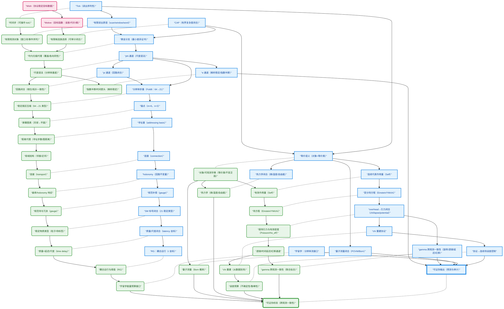

# z128 大架构图：数学–物理双骨架 DAG

- **实线有向边（`-->`）**：直接推导 / 依赖（保持无环）
- **虚线无向边（`-.-`）**：数学概念 ↔ 物理概念的对应（字典映射；无箭头）

## 图例

- **数学节点（Math）**：
  - **命名**：以 `M_` 开头
  - **外形**：矩形 `[...]`
  - **颜色**：蓝色系（`classDef math`）
  - **含义**：闭合层的对象/构造/命题链（Tick+CAP 约束下的有限构造、折叠、锚点、连续代表等）
- **物理节点（Physics / Iface）**：
  - **命名**：以 `P_` 开头
  - **外形**：圆角矩形 `(...)`
  - **颜色**：绿色系（`classDef phys`）
  - **含义**：可操作量与观测链（协议化的可观测/可拟合/可证伪代理）
- **接口目标节点（Wish/Motive）**：
  - **外形**：圆角矩形 `(...)`
  - **颜色**：粉色系（`classDef iface`）
  - **含义**：组织语言与审计目标（不作为数学层前提，仅用于接口层/审计层叙事与选择说明）
- **对应关系（Math ↔ Physics）**：
  - **形式**：每对相邻的 `M_*` 与 `P_*` 用 **`-.-`** 连接
  - **含义**：字典式对应（无箭头，避免反向依赖误读）
- **推导关系（同骨架内部）**：
  - **形式**：用 **`-->`** 串联
  - **含义**：依赖/推导顺序（保持有向无环）

