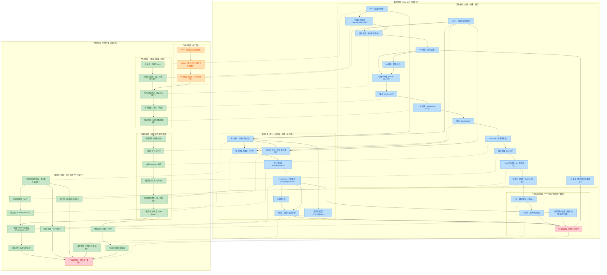

# z128 大架构图：数学–物理双骨架 DAG

- **实线有向边（`-->`）**：直接推导 / 依赖（保持无环）
- **虚线无向边（`-.-`）**：数学概念 ↔ 物理概念的对应（字典映射；无箭头）

```mermaid
flowchart TB

  %% =========================
  %% Math spine (closed-theory)
  %% =========================
  subgraph M["“数学骨架（Tick+CAP 的闭合链）”"]
    direction TB

    subgraph M0["“离散脊柱（读出→折叠→锚点）”"]
      direction TB
      M_tick["“Tick（读出序列性）”"]
      M_cap["“CAP（有界复杂度闭合）”"]
      M_readout["“有限读出原语（scan/window/word）”"]
      M_golden["“黄金分支（最小差异证书）”"]
      M_phi["“phi 通道（尺度语法）”"]
      M_pi["“pi 通道（回路闭合）”"]
      M_e["“e 通道（解析稳定/指数半群）”"]
      M_fold["“分辨率折叠（Fold6：64→21）”"]
      M_anchor["“锚点（m=6，n=3）”"]
      M_addr["“寻址基（addressing basis）”"]
      M_conn["“连接（connection）”"]
      M_holo["“holonomy（回路不变量）”"]
      M_gauge["“规范补偿（gauge）”"]
      M_sm["“SM 标号闭合（21 稳定类型）”"]
      M_mass["“质量/尺度闭合（latency 坐标）”"]

      M_tick --> M_readout
      M_cap --> M_golden
      M_readout --> M_golden
      M_golden --> M_phi
      M_phi --> M_pi
      M_phi --> M_e
      M_phi --> M_fold
      M_pi --> M_fold
      M_fold --> M_anchor
      M_anchor --> M_addr
      M_addr --> M_conn
      M_conn --> M_holo
      M_holo --> M_gauge
      M_gauge --> M_sm
      M_sm --> M_mass
    end

    subgraph M1["“连续代表（等价→作用量→方程→动力学）”"]
      direction TB
      M_equiv["“等价语义（对象=等价类）”"]
      M_action["“连续代表作用量（Seff）”"]
      M_eom["“变分场方程（Einstein/YM/chi）”"]
      M_thermo["“热力学闭合（熵/温度/自由能）”"]
      M_grav["“overhead→引力闭合（chi/lapse/potential）”"]
      M_recon["“χ 重建协议”"]
      M_err["“协议→连续场误差控制”"]
      M_qm["“量子测量闭合（POVM/Born）”"]

      M_tick --> M_equiv
      M_cap --> M_equiv
      M_equiv --> M_action
      M_cap --> M_action
      M_action --> M_eom
      M_equiv --> M_thermo
      M_cap --> M_thermo
      M_eom --> M_grav
      M_grav --> M_recon
      M_recon --> M_err
      M_grav --> M_err
      M_equiv --> M_qm
    end

    subgraph M2["“尺度流与检验（RG/宇宙学/跨观测一致性）”"]
      direction TB
      M_rg["“RG：耦合运行（r 坐标）”"]
      M_cosmo["“宇宙学：分辨率流接口”"]
      M_gamma["“γ 跨观测一致性（旋转/透镜/延迟/红移）”"]
      M_test["“可证伪输出（预测与审计）”"]

      M_mass --> M_rg
      M_rg --> M_cosmo
      M_cosmo --> M_test
      M_err --> M_test
      M_qm --> M_test
      M_grav --> M_gamma
      M_gamma --> M_test
      M_e --> M_test
    end
  end

  %% ==================================
  %% Physics spine (operational/iface)
  %% ==================================
  subgraph P["“物理骨架（可操作量与观测链）”"]
    direction TB

    subgraph P0["“目标与选择（接口层）”"]
      direction TB
      P_wish["“Wish（协议稳定目标数据）”"]
      P_motive["“Motive（误差+代价+熵的目标函数）”"]
      P_select["“有限候选族选择（可审计闭合）”"]
      P_wish --> P_motive --> P_select
    end

    subgraph P1["“观测协议（读出→屏幕→寻址）”"]
      direction TB
      P_dt["“时间步（可操作 tick）”"]
      P_obs["“有限观测对象（窗口词/事件序列）”"]
      P_scan["“均匀扫描代理（覆盖/各向同性）”"]
      P_screen["“屏幕图表（天球→平面）”"]
      P_addr["“距离代理（寻址步数/图距离）”"]

      P_dt --> P_obs --> P_scan --> P_screen --> P_addr
      P_select --> P_scan
    end

    subgraph P2["“结构与物质（局域/规范/类型/质量）”"]
      direction TB
      P_local["“局域结构（邻接/近邻）”"]
      P_conn["“连接（transport）”"]
      P_holo["“曲率/holonomy 响应”"]
      P_gauge["“规范场与冗余（gauge）”"]
      P_types["“稳定物质类型（粒子/场标签）”"]
      P_mass["“质量=延迟/尺度（time delay）”"]

      P_addr --> P_local
      P_local --> P_conn --> P_holo --> P_gauge
      P_gauge --> P_types --> P_mass
    end

    subgraph P3["“动力学与检验（引力/量子/RG/宇宙学）”"]
      direction TB
      P_equiv["“对象/可观测字典（等价类/不变泛函）”"]
      P_action["“有效作用量（Seff）”"]
      P_eom["“场方程（Einstein/YM/chi）”"]
      P_thermo["“热力学（熵/温度/自由能）”"]
      P_err["“误差预算（不确定性/鲁棒性）”"]
      P_dyn["“弱场引力与有效密度（Poisson/rho_eff）”"]
      P_lens["“透镜/时间延迟/红移通道”"]
      P_qm["“量子测量（Born 概率）”"]
      P_rg["“耦合运行与阈值（RG）”"]
      P_cosmo["“宇宙学能量预算接口”"]
      P_test["“可证伪检验（跨观测一致性）”"]

      P_equiv --> P_action --> P_eom --> P_dyn --> P_lens --> P_test
      P_equiv --> P_qm --> P_test
      P_equiv --> P_thermo --> P_test
      P_err --> P_test
      P_mass --> P_dyn
      P_mass --> P_rg
      P_rg --> P_cosmo --> P_test
    end
  end

  %% =========================
  %% Math ↔ Physics correspondences
  %% =========================
  M_tick -.- P_dt
  M_readout -.- P_obs
  M_cap -.- P_select
  M_golden -.- P_scan
  M_anchor -.- P_screen
  M_addr -.- P_addr
  M_conn -.- P_conn
  M_holo -.- P_holo
  M_gauge -.- P_gauge
  M_sm -.- P_types
  M_mass -.- P_mass
  M_equiv -.- P_equiv
  M_action -.- P_action
  M_eom -.- P_eom
  M_thermo -.- P_thermo
  M_grav -.- P_dyn
  M_err -.- P_err
  M_qm -.- P_qm
  M_rg -.- P_rg
  M_cosmo -.- P_cosmo
  M_test -.- P_test

  %% =========================
  %% Styling (Material Design palette)
  %% =========================
  classDef math fill:#BBDEFB,stroke:#1E88E5,color:#0D47A1;
  classDef phys fill:#C8E6C9,stroke:#43A047,color:#1B5E20;
  classDef iface fill:#FFE0B2,stroke:#FB8C00,color:#E65100;
  classDef out fill:#FFCDD2,stroke:#E53935,color:#B71C1C;

  class M_tick,M_cap,M_readout,M_golden,M_phi,M_pi,M_e,M_fold,M_anchor,M_addr,M_conn,M_holo,M_gauge,M_sm,M_mass,M_equiv,M_action,M_eom,M_thermo,M_grav,M_recon,M_err,M_qm,M_rg,M_cosmo,M_gamma math;
  class P_dt,P_obs,P_scan,P_screen,P_addr,P_local,P_conn,P_holo,P_gauge,P_types,P_mass,P_equiv,P_action,P_eom,P_thermo,P_err,P_dyn,P_lens,P_qm,P_rg,P_cosmo phys;
  class P_wish,P_motive,P_select iface;
  class M_test,P_test out;
```

