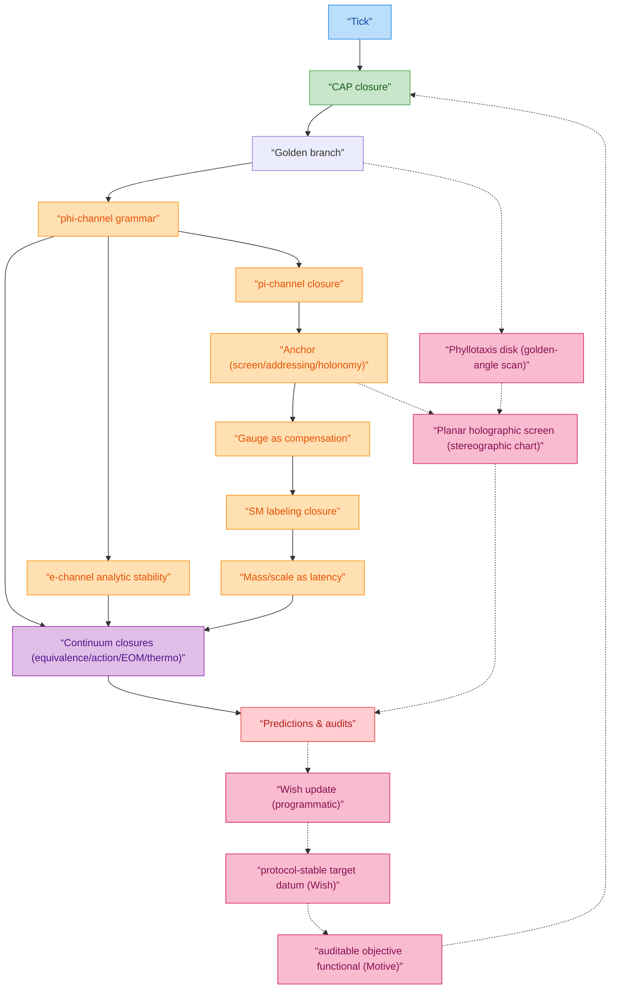

# z128 论文最终目标大纲（Wish）

本文档定义本论文最终成稿时的结构与层纪律（closed-theory / interface / programmatic）。本文档不包含过渡实施方案。

目标是把现有两条“骨架”统一为一条读者可追踪的因果链：

$$
\text{Wish} \Rightarrow \text{Motive} \Rightarrow (\text{Tick}+\text{CAP}) \Rightarrow (\varphi,\pi,\mathrm{e})\text{ 三通道} \Rightarrow
\text{结构（物质/规范）与动力学闭合} \Rightarrow \text{反馈更新 Wish}.
$$

注意：本大纲不要求改变任何已闭合定理/定义/审计输出；它只规定“先讲什么、后讲什么、哪些内容必须显式标注状态标签”。

此外，本大纲允许在主文中使用一个解释性统一图景（\AuditTag；not used in proofs）以改善读者路径：**“黄金角扫描的平面全息球”**。其作用是把 Part B 的 golden branch（最难逼近/差异证书）与 Part D 的 screen/addressing（显示图表）拼接成一个可视化模型（叶序几何/向日葵盘），用于组织“均匀覆盖/各向同性代理”“距离=寻址步数”“质量=局部延迟/密度”等接口句子；该图景不引入新公理，也不得反向支撑任何 theorem-level 结论。

---

## 0. 不变约束（成稿时必须保持）

- **两原语不变**：tick（Axiom~readout sequentiality）与 CAP（bounded-complexity closure）仍是唯一原始输入；Wish/Motive 只能作为接口层对象或闭合目标函数，不得被当作新增公理。【论文位置：`sections/I_00_introduction.tex`（\label{ax:readout_sequentiality}，\label{ax:cap}），`sections/appendices/19_tick_cap_derivation.tex`（\label{app:tick_cap_derivation}）】
- **层级不变**：保持 \MathTag/\InterfaceTag/\MatchTag/\AuditTag 的语义边界，并采用与其他论文一致的层纪律：【论文位置：`sections/PA_contract.tex`（层纪律契约），`sections/appendices/11_inference_ledger.tex`（\label{app:inference_ledger}）】
  - **closed-theory / closed layer**：只允许显式定义、有限构造、可审计的定理链（对应 [Math]/[Prot]/[CAP] 的闭合内容）。
  - **interface layer**：把 closed invariants 连接到可操作物理量/实验代理的最小字典（在主文中对应 \InterfaceTag 与 \MatchTag 的边界）。
  - **interpretation / programmatic layer**：叙事映射与模型建议（主文中用 \AuditTag 明确标注 not used in proofs），不得作为 closed 证明链前提。
- **不得把接口/匹配层语句“升级”为数学层前提**：任何物理语义必须明确标注并保持单向依赖（可注释 closed 链，但不可反向支撑它）。
- **复用优先（避免重复造轮子）**：凡 `docs/papers/` 中已有的 Definition/Theorem/Proposition/模板化 lemma，一律先对齐其写法与符号，再在 z128 中落地；若 z128 需要特殊化，仅允许在不改变语义的前提下做命名/记号层面的改写，并在符号表中提供对照。
- **审计不变**：`sections/appendices/23_audit_overview.tex` 的契约与 `sections/appendices/11_inference_ledger.tex` 的状态台账必须继续成立；任何新叙事段落应能回指到台账条目。【论文位置：`sections/appendices/23_audit_overview.tex`（\label{app:audit_overview}，\label{fig:inference_map}），`sections/appendices/11_inference_ledger.tex`（\label{app:inference_ledger}，\label{subsec:ledger_open_problems}）】
- **生成物不手改**：`sections/generated/` 目录下的 `.tex` 为脚本输出；脚本为真源；重构只允许改“引用/组织”，不允许改生成文件内容。【论文位置：`sections/generated/`（已接入编译链路；表格总入口：`sections/appendices/02_generated_tables.tex`（\label{app:generated_tables}）；复现入口：`sections/appendices/03_reproducibility.tex`（\label{app:reproducibility}））】
- **标签不破坏**：尽量不改 `\label{...}`；若必须移动段落，优先保持 label 名称并检查交叉引用。
- **依赖关系不反转**：主文重排可以改变“阅读顺序”，但不得改变 `fig:inference_map` 的依赖箭头语义（solid/dashed/dotted 的含义不变）。【论文位置：`sections/appendices/23_audit_overview.tex`（\label{fig:inference_map}）】

---

## 1. 推理关系总览（按依赖，而非叙事顺序）

本论文已经有一张正式推理图（Appendix `audit_overview` 的 `fig:inference_map`）。新大纲只是在该推理图上，选择一个更强的叙事入口（Wish/Motive）与更直观的主线（周期三通道）。

### 1.1 依赖类型（建议在新主文中继续沿用）

为避免标签膨胀，建议把“主文标签”与“台账状态”分开：

- **主文标签（保持现状：四个）**：
  - **\MathTag**：定理级有限构造/证明链（含必要的有限对象定义）。
  - **\InterfaceTag**：接口层语义字典（物理识别/可观测的协议化声明）。
  - **\MatchTag**：外部匹配输入（PDG/CODATA、单位、阈值、方案约定）；只用于对比/校准，不得反向支撑闭合链。
  - **\AuditTag**：审计/候选族/闭合边界与 not used in proofs 的显式标注（含“唯一性仅在有限候选族内成立”的声明）。

- **台账状态（Appendix `inference_ledger` 已有：五个；不是主文新标签）**：
  - **[Math]**：theorem-level statement in the mathematical layer。
  - **[Prot]**：finite protocol construction。
  - **[Iface]**：physical identification statement (dictionary)。
  - **[CAP]**：bounded-complexity closure。
  - **[Open]**：explicitly recorded open problem。

### 1.2 “Wish→Motive→CAP”的位置（不增新公理的写法）

- **Wish（Iface；更学术表述：protocol-stable target datum/structure）**：协议稳定目标对象（不是心理学），在本论文中建议具体化为“可重复、可局域、可跨点一致”的稳定读出类型与周期不变量集合；对象是“数据结构/不变量族”，而非单一数值。【论文位置：`sections/appendices/00_wish_motive_definitions.tex`（\label{app:wish_motive_definitions}，\label{def:wish_protocol_stable_data}）】
- **Motive（Iface+CAP）**：由 Wish 诱导的审计目标函数族：误差证书（mismatch）+ 实现代价（overhead/Comp）+（可选）熵/不确定性项；CAP 即在显式有限候选族上对该 Motive 的确定性最小化。【论文位置：`sections/appendices/00_wish_motive_definitions.tex`（\label{def:motive_objective_functional}，\label{def:motive_cap_closure}），CAP 审计模板：`sections/appendices/13_cap_audit_template.tex`（\label{app:cap_audit_template}）】
- **保持不变点**：tick 与 CAP 仍是原语；Wish/Motive 只在接口层“解释” CAP 选择序列为何与周期三通道一致，不作为数学层前提。【论文位置：`sections/PA_contract.tex`（层纪律声明），`sections/appendices/11_inference_ledger.tex`（\label{app:inference_ledger}）】

### 1.3 依赖图（叙事版，保持与 `fig:inference_map` 一致）

#### 1.3.1 逻辑一致性备注（避免“叙事覆盖证明链”）

- **实线边**：表示可以成为 closed-theory 的证明链骨架（与 `fig:inference_map` 的 solid/dashed/dotted 语义对齐）。
- **虚线边**：表示 interface/programmatic 叙事覆盖（必须显式标注 not used in proofs），用于解释“为什么 CAP 的闭合序列看起来像在追逐某个 target”。
- **关键约束**：Wish/Motive/更新算子不得被用作 folding core、holonomy 构造、或任何 theorem-level 结论的前提；它们只能作为对已闭合链条的组织与命名。

#### 1.3.2 刚性提升连通性：把每一步写成“rigidity bridge”（可审计的强连接）

为把“叙事连贯”升级为“推理连通”，建议将主链每个跳跃都落实为以下可审计形态之一，并在相应章节显式声明其证书与最小输入：

- **RB-A（有限候选族唯一极小化）**：有限候选族 $\mathcal{C}$、目标函数 $J$、确定性 tie-break；结论为 $\arg\min_{\mathcal{C}}J$ 的唯一性或近唯一性（含 gap）。
- **RB-B（障碍式刚性：不相容性）**：若出现某类“坏模态/坏结构”，则与已确立的解析域/稳定性证书不相容（例如“单位圆盘全纯 vs 内点极点”）。
- **RB-C（计数/分类刚性）**：有限对象的分类/计数/像-原像结构（例如 $64\to 21$、$18\oplus 3$）给出唯一分解或唯一小结构。
- **RB-D（稳定性/鲁棒性）**：gap-stability、sensitivity bounds、反事实族残差传播界；用于把“偶然对齐”提升为“可扰动仍保持”的闭合。

建议把下表作为未来重构时的“连通性检查单”：每一行对应主链一条实线边，必须落到某个 RB-* 的证书形态（否则该边只能画成虚线叙事边）。【论文位置：`sections/appendices/43_rigidity_bridge_checklist.tex`（\label{app:rigidity_bridge_checklist}）】

| 主链跳跃（实线） | 目标闭合输出 | 证书形态（RB） | 最小输入核（第一性 + 标准事实） | 必读参考（先对齐再写） |
|---|---|---|---|---|
| Tick $\to$ CAP | 可审计的确定性闭合算子 | RB-A | tick + 有界复杂度 + tie-break | `2025_protocol_stable_period_data_computational_teleology/sections/05_selection_principle.tex`【外部参考（源文）】；【论文位置：`sections/I_00_introduction.tex`（\label{ax:readout_sequentiality}，\label{ax:cap}），`sections/appendices/19_tick_cap_derivation.tex`（\label{app:tick_cap_derivation}），`sections/appendices/13_cap_audit_template.tex`（\label{app:cap_audit_template}）】 |
| Tick $\to$ Abel 核/指数半群 | “记忆无关权重 $\Rightarrow$ 指数核”与模态语言的统一 | RB-C | tick 的单向半群 + Abel-first 纪律 | `2025_holographic_hilbert_universe_hpa_omega/sections/appendices/03_abel_finite_part_notes.tex`；`2025_riemann_ground_state_hpa_omega/sections/05_trace_formula_rigidity.tex`【外部参考（源文）】；【论文位置：`sections/F_00_arrow_of_time_semigroup.tex`（\label{app:arrow_of_time_semigroup_notes}），`sections/appendices/40_abel_finite_part_resolvent_notes.tex`（\label{app:abel_finite_part_notes}），`sections/appendices/41_trace_formula_pole_barrier_template.tex`（\label{app:trace_pole_barrier_template}）】 |
| CAP $\to$ golden branch | bounded-type/最难逼近扫描的选择刚性 | RB-A/RB-D | discrepancy 证书 + 有限复杂度代理 | `2025_motive_at_infinity_holographic_scanning_principle/sections/07_selection_principle.tex`【外部参考（源文）】；【论文位置：`sections/C_10_hpa_readout_dynamics.tex`（\label{sec:hpa_readout}，\label{prop:golden_least_discrepancy}，\label{subsubsec:discrepancy_certificates}），`sections/appendices/28_discrepancy_ostrowski_bounds.tex`（\label{app:discrepancy_ostrowski}）】 |
| golden branch $\to$ $\varphi$-grammar | admissible set $X_m$ 与 Fold$_m$ 的总论化 | RB-C | Fibonacci/Zeckendorf 标准事实 | `2025_resolution_folding_phi_pi_e_hpa_omega/sections/06_resolution_folding_map.tex`【外部参考（源文）】；【论文位置：`sections/C_11_resolution_folding_64_to_21.tex`（\label{subsec:phi_channel}，\label{lem:xm_fib}，\label{subsec:foldm_uplift}）】 |
| $\varphi$-grammar $\to$ $\pi$-closure | cyclic closure 与 $18\oplus 3$ 的刚性分解 | RB-C | wrap-around 约束 + adjacency/trace 标准事实 | `2025_resolution_folding_phi_pi_e_hpa_omega/sections/04_pi_constraint_discrete_monodromy.tex`【外部参考（源文）】；【论文位置：`sections/C_11_resolution_folding_64_to_21.tex`（\label{subsec:pi_channel}，\label{prop:cyc_bdry_size}，\label{prop:cyc_bdry_6}）】 |
| $\varphi,\pi$ $\to$ $\mathrm{e}$-stability | pole barrier / Abel 域稳定模板 | RB-B/RB-D | 归一化变量（$r$）+ Abel-first/finite part 纪律（作为协议规则而非新公理） | `2025_resolution_folding_phi_pi_e_hpa_omega/sections/05_e_constraint_abel_zeta_pole_barrier.tex`；`2025_holographic_hilbert_universe_hpa_omega/sections/appendices/03_abel_finite_part_notes.tex`【外部参考（源文）】；【论文位置：`sections/C_11_resolution_folding_64_to_21.tex`（\label{subsec:e_channel}），`sections/appendices/12_protocol_primitives.tex`（\label{app:protocol_primitives}），`sections/appendices/40_abel_finite_part_resolvent_notes.tex`（\label{app:abel_finite_part_notes}），`sections/appendices/41_trace_formula_pole_barrier_template.tex`（\label{app:trace_pole_barrier_template}）】 |
| $\pi$-closure $\to$ anchor | 最小非平凡闭合/最小可审计锚点 | RB-A/RB-C | 有限候选族 + 最小性/唯一性证书 | `2025_physical_constants_geometry_hpa_omega/sections/05_alpha_anchor.tex`（“anchored worked example + gap”写法模板）【外部参考（源文）】；【论文位置：`sections/C_11_resolution_folding_64_to_21.tex`（\label{sec:folding_core}，\label{rem:balanced_coupling_convention}），`sections/I_10_hilbert_addressing_chirality.tex`（\label{sec:hilbert_addressing}，\label{tab:addressing_selection}）】 |
| anchor $\to$ gauge/holonomy | 连接/holonomy 作为补偿数据（forced-by-mismatch） | RB-C/RB-D | 局部一致性/运输补偿的最小结构 | `2025_physical_constants_geometry_hpa_omega/sections/appendices/05_holonomy.tex`【外部参考（源文）】；【论文位置：`sections/I_21_protocol_connections_holonomy.tex`（\label{sec:protocol_connections_holonomy}），`sections/appendices/15_holonomy_sweeps_extended.tex`（\label{app:holonomy_sweeps_extended}）】 |
| gauge $\to$ SM labeling/mass | 有限候选族上的标号闭合与刚性深度/延迟字典 | RB-A/RB-D | 有限搜索 + gap-stability + 残差传播界 | `2025_physical_constants_geometry_hpa_omega/sections/06_running_couplings.tex`；`2025_physical_constants_geometry_hpa_omega/sections/07_masses_mixing.tex`【外部参考（源文）】；【论文位置：`sections/V_30_sm_field_labeling_closure.tex`（\label{sec:sm_labeling_closure}），`sections/I_25_mass_latency_coordinate.tex`（\label{sec:mass_latency_coordinate}），`sections/V_31_mass_spectrum_closure.tex`（\label{sec:mass_spectrum_closure}），`sections/appendices/17_closure_audit_details.tex`（\label{app:closure_audit_details}）】 |
| mismatch/overhead $\to$ gravity/dynamics | 以可审计开销场导出 lapse/potential 模板 | RB-B/RB-D | compilation overhead 定义 + 误差预算 + Poisson/Dirichlet 标准事实 | `2025_holographic_hilbert_universe_hpa_omega/sections/07_computational_lapse_gravity.tex`；`2025_holographic_hilbert_universe_hpa_omega/sections/08_minimal_discrepancy_dynamics.tex`【外部参考（源文）】；【论文位置：`sections/F_40_overhead_to_gravity_closure.tex`（\label{app:overhead_to_gravity_closure}），`sections/F_41_chi_reconstruction_protocol.tex`（\label{app:chi_reconstruction_protocol}），`sections/appendices/33_protocol_to_continuum_error_control.tex`（\label{app:protocol_to_continuum_error_control}），`sections/F_20_cap_continuum_action_closure.tex`（\label{app:cap_continuum_action_closure}）】 |

#### 1.3.3 直觉如何“数学化/物理化”：最小输入核 + 四标签写法模板（工作指令）

本小节给出一套可重复的写作模板：把解释性直觉压缩为可审计的数学陈述，并在不增新公理的前提下把它连接到可操作物理代理。每次引入新直觉或新“解释统一句”，都应按此流程落地。

- **Step 0（选目标；先定层）**
  - **目标句**：把直觉写成一句“可检验”的目标句：它究竟要解释什么（唯一性/不可逆/尺度律/误差传播/可证伪差异）？
  - **层定位**：先判断目标句属于哪一层：
    - **\MathTag**：可以写成 Definition/Lemma/Proposition 并可在两原语+标准事实下证明；
    - **\InterfaceTag**：是“如何把闭合对象读成物理量/观测代理”的字典；
    - **\MatchTag**：是时间零点/单位/外部基准/阈值等校准输入；
    - **\AuditTag**：候选族/目标函数/tie-break/脚本复现/以及 not used in proofs 的解释段落。

- **Step 1（数学化：把直觉改写成最小陈述）**
  - **对象化**：先引入一个最小对象（函数/半群/候选族/距离/误差预算），明确其定义域与输出域。
  - **约束化**：把直觉中的“无记忆/自驱/稳定/唯一”等词替换为可写成条件的约束（函数方程、最小化、gap、不可相容性）。
  - **证书化（RB）**：为这一步选择一个 RB 证书形态并写清最小输入核：
    - RB-A：有限候选族 + 目标函数 + tie-break；
    - RB-B：与解析域/稳定性证书不相容；
    - RB-C：计数/分类/像-原像结构迫使唯一形态；
    - RB-D：gap-stability/误差传播界迫使鲁棒性。
  - **输出**：形成一个可以放进主文的“最小 Lemma/Proposition”（可引用外部论文模板，但不得引入额外公理）。

- **Step 2（物理化：把数学对象连接到可操作代理）**
  - **接口字典**：用 \InterfaceTag 给出最小字典：哪个数学对象对应哪个实验代理/可操作量（例如 delay/lapse、Wigner--Smith、POVM、红移、谱模态）。
  - **误差预算**：明确代理误差与 coarse-graining 的非可逆性来自哪里（非单射、截断、噪声模型、有限分辨率），并把“单调性/不可逆”落到一个可计算的证书（Lyapunov/相对熵/界）。
  - **避免反向依赖**：接口段落只能解释闭合链，不能反过来支撑闭合链。

- **Step 3（校准化：把“积分常数/初值/单位”收口到 \MatchTag）**
  - 把所有“起点信息/尺度因子/时间零点/单位换算”统一收敛为 \MatchTag（或协议约定），并在审计中记录它们的作用域。
  - 目标是让最终可证伪输出尽可能只依赖比值/差分等不变组合。

- **Step 4（审计化：把可复现与边界写清）**
  - 用 \AuditTag 明确：候选族、目标函数、tie-break、脚本/数据入口、以及“哪些段落 not used in proofs”。
  - 若该直觉对应未闭合项，必须在台账中落为 [Open] 并给出未来闭合路径。

- **Step 5（台账化：把结果写回 inference ledger）**
  - 将该模块拆成台账条目：[Math]/[Prot]/[Iface]/[CAP]/[Open] 五类之一或组合，并给出依赖指针（在哪一节定义、在哪一节使用）。

**示范（时间箭头的直觉）**：

- **数学化（\MathTag；RB-C）**：把“无记忆/自驱”改写为半群条件 $w_{t+s}=w_t w_s$ 与 $w_0=1$，结论是离散 tick 上 $w_t=r^t$；连续外延在温和正则性条件下给出 $w(t)=\exp(-\lambda t)$（对应 C.3/F.0 的闭合骨架）。
- **物理化（\InterfaceTag）**：把 $w_t$ 解释为 coarse-graining/Abel 权重或演化算子族的权重；“箭头”由（i）单向半群 $t\ge 0$ 与（ii）coarse-graining 的非可逆性（信息丢失）共同给出，并通过 Lyapunov/熵单调性证书呈现（对应 F.0/F.3）。
- **校准化（\MatchTag）**：把 $C\,\exp(\lambda t)$ 中的 $C$（或 $t_0$）视为时间零点/尺度校准输入；主文闭合链只使用比值/差分等不变组合（对应 C.3/F.0 与 2.2）。
- **审计化（\AuditTag）**：把“自指/本征态/光滑扫描”这类解释性句子放在 \AuditTag 且标注 not used in proofs（已在 F.0 与 2.3(III) 落点）。

#### 1.3.4 “黄金角扫描的平面全息球”（叶序几何）在本大纲中的层定位与挂接点

- **数学核（\MathTag）**：对应 “CAP $\to$ golden branch” 的差异/Diophantine 刚性证书（RB-A/RB-D）以及旋转点列的差异界/均匀分布模板；黄金角不是外部输入，而是 CAP 在有限候选族上闭合出的优选角增量。【论文位置：`sections/C_10_hpa_readout_dynamics.tex`（\label{prop:golden_least_discrepancy}，\label{subsubsec:discrepancy_certificates}），`sections/appendices/28_discrepancy_ostrowski_bounds.tex`（\label{app:discrepancy_ostrowski}）】
- **接口核（\InterfaceTag）**：对应 “anchor / screen / addressing” 的显示坐标选择与距离度量约定；典型选择是把方向空间 $S^2$ 通过球极平面投影编码为复坐标 $z$（黎曼球 chart），再将 tick-indexed 事件映射为屏幕点列并给出可计算的均匀性/各向同性代理指标。【论文位置：`sections/I_09_planar_screen_chart.tex`（\label{subsec:planar_screen_chart}），`sections/I_10_hilbert_addressing_chirality.tex`（\label{sec:hilbert_addressing}，\label{subsubsec:space_from_ticks_dictionary}）】
- **解释核（\AuditTag；not used in proofs）**：把上述两核拼接成“向日葵盘/叶序”图像，用于叙事地解释均匀覆盖（各向同性代理）、稀疏/密集区域（真空/质量的视觉代理）与步数差（距离代理），但不进入任何 theorem-level 推理前提。【论文位置：`sections/I_04_golden_angle_phyllotaxis_overlay.tex`（\label{subsec:phyllotaxis_overlay}）】
- **匹配提醒（\MatchTag/\AuditTag）**：黄金角约为 $137.5^\circ$（角度单位），而 $1/\alpha_{\mathrm{em}}\approx 137.0$（无量纲比值）；任何将二者联系的句子必须显式标注层级与误差口径，且不得作为闭合链前提。【论文位置：`sections/I_04_golden_angle_phyllotaxis_overlay.tex`（\label{subsec:phyllotaxis_overlay}）】
- **落点建议（主文）**：B.2（数学证书与 CAP 选择）、B.3（点列与均匀覆盖代理）、D.1（平面球/显示坐标与距离度量）、E.2（mass-as-latency 与密度代理对齐）、F.6/H.4（宇宙学/递归叙事中的解释性统一图景）。【论文位置：B.2=`sections/C_10_hpa_readout_dynamics.tex`（\label{prop:golden_least_discrepancy}）；B.3=`sections/I_04_golden_angle_phyllotaxis_overlay.tex`（\label{subsec:phyllotaxis_overlay}）；D.1=`sections/I_09_planar_screen_chart.tex`（\label{subsec:planar_screen_chart}）+`sections/I_10_hilbert_addressing_chirality.tex`（\label{subsubsec:space_from_ticks_dictionary}）；E.2=`sections/I_25_mass_latency_coordinate.tex`（\label{sec:mass_latency_coordinate}）；F.6=`sections/appendices/32_cosmology_resolution_flow.tex`（\label{app:cosmology_resolution_flow}）；H.4=`sections/V_45_interpretive_unification.tex`（\label{subsec:interpretive_unification_complex_exp}）】

### 1.4 参考论文：可直接移植的 Wish/Motive 数学闭合模块（外部参考（源文）；本论文已吸收其核心点，落地位置见各条【论文位置】）

本重构计划将显式复用同仓库中已完成的 Wish/Motive 严格数学表述，以避免在 z128 中重复发明概念，并把叙事层的 Wish/Motive 直接落到可审计的定义/命题上。

- **层纪律与“not used in proofs”写法**
  - 参考：`docs/papers/2025_motive_at_infinity_holographic_scanning_principle/sections/02_audit_layers.tex`
  - 参考：`docs/papers/2025_stairway_to_infinity_holographic_renormalization_flow/sections/02_layers_axioms.tex`
  - 参考：`docs/papers/2025_ramanujan_holographic_scanning_principle_hpa_omega/sections/02_layers_axioms.tex`
  - 要点：显式区分 Layer 0/1/2（或 closed/protocol/interpretation），并把 programmatic 段落标注为 not used in proofs。
- **Wish 作为“数据对象而非数字”**
  - 参考：`docs/papers/2025_protocol_stable_period_data_computational_teleology/sections/03_wish_protocol_stable_period_data.tex`
  - 要点：Wish 被定义为“协议稳定目标数据”，强调有限资源稳定性（证书化误差预算）与协议等价不变性。
- **Motive 作为可审计目标函数（stability + cost + optional height）**
  - 参考：`docs/papers/2025_protocol_stable_period_data_computational_teleology/sections/05_selection_principle.tex`
  - 要点：把“选择”写成显式 functional（证书化稳定性 + 实现复杂度 + 可选高度惩罚），并给出可操作的“近极小化者检验”流程。
- **Teleological dynamics（Motive 诱导的耗散变分动力学模板）**
  - 参考：`docs/papers/2025_protocol_stable_period_data_computational_teleology/sections/06_variational_dynamics.tex`
  - 要点：对任意目标函数 $U_N$ 给出阻尼惯性梯度流与 Lyapunov 单调性；在 z128 中可作为“协议空间/闭合自由度”的数学模板，但不进入 folding 的 theorem-level 依赖链。
- **黄金分支为何出现（从直觉升级为稳定性证书）**
  - 参考：`docs/papers/2025_motive_at_infinity_holographic_scanning_principle/sections/07_selection_principle.tex`
  - 要点：将黄金分支的 Diophantine 极值性质与 discrepancy 证书、稳定性 bound、选择 functional 的常数因子联系起来。
- **motive 语言的边界（不污染闭合链）**
  - 参考：`docs/papers/2025_motive_at_infinity_holographic_scanning_principle/sections/03_periods_motives_wishes.tex`
  - 要点：motive 只作为组织 period/稳定目标之间关系的 programmatic 语言；闭合链保持在可审计的协议/数据层内。
- **“有限候选族 + 目标函数 + 唯一极小化”作为主叙事引擎**
  - 参考：`docs/papers/biology/2025_arithmetic_origin_genetic_code_hpa_omega/sections/01_introduction.tex`
  - 要点：把识别问题写成有限搜索/闭合问题（例如 24 个编码的 exhaustive search），并把“唯一极小化/不可实现性界”写成定理或命题；物理/生物/化学解释只在解释层出现。

### 1.5 其他“硬数学结构”库（建议纳入闭合；按 z128 相关性排序）

下面这些结构在 `docs/papers` 中已经被写成较硬的数学闭合/模板。为保持论文之间一致并避免重复造轮子，建议在 z128 的闭合工作中直接对齐并纳入（至少作为附录级模板），再决定其是否进入主干叙事。

- **Abel 轨道计算 / finite part / resolvent-视角（加强 $\mathrm{e}$ 通道与解析稳定）**
  - 参考：`docs/papers/2025_holographic_hilbert_universe_hpa_omega/sections/appendices/03_abel_finite_part_notes.tex`【外部参考（源文）】
  - 参考：`docs/papers/2025_riemann_ground_state_hpa_omega/sections/appendices/03_orbit_calculus_abel_fp.tex`【外部参考（源文）】
  - 价值：提供统一的 Abel-first/finite-part 纪律与“单位圆盘解析性/极点障碍”语言，可与 z128 的 zeta/Abel 稳定模板对齐并增强其严密性。【论文位置：`sections/appendices/40_abel_finite_part_resolvent_notes.tex`（\label{app:abel_finite_part_notes}），`sections/F_00_arrow_of_time_semigroup.tex`（\label{app:arrow_of_time_semigroup_notes}）】
- **HTF / trace-formula rigidity 框架（更硬的“极点障碍→谱约束”模板）**
  - 参考：`docs/papers/2025_riemann_ground_state_hpa_omega/sections/05_trace_formula_rigidity.tex`【外部参考（源文）】
  - 参考：`docs/papers/2025_holographic_hilbert_universe_hpa_omega/sections/09_trace_formula_rigidity.tex`【外部参考（源文）】
  - 价值：把“bounded readout $\Rightarrow$ 单位圆盘全纯”与“谱侧 resolvent 模态 $\Rightarrow$ 内点极点”组织成可复用的刚性论证范式；对 z128 来说可作为更一般的 $\mathrm{e}$-通道解析闭合模板（不必引入 RH 主题本身）。【论文位置：`sections/appendices/41_trace_formula_pole_barrier_template.tex`（\label{app:trace_pole_barrier_template}；抽象 pole-barrier 模板）；源文完整 HTF/trace-formula 框架未整段并入本论文】
- **专门的 $\varphi$-$\pi$-$\mathrm{e}$ 分辨率折叠总论文（fold map、像/原像结构、退化度）**
  - 参考：`docs/papers/2025_resolution_folding_phi_pi_e_hpa_omega/sections/06_resolution_folding_map.tex`【外部参考（源文）】
  - 参考：`docs/papers/2025_resolution_folding_phi_pi_e_hpa_omega/sections/05_e_constraint_abel_zeta_pole_barrier.tex`【外部参考（源文）】
  - 价值：提供更系统的 Fold$_m$ 定义与原像结构、退化度增长、以及更清晰的 $\mathrm{e}$-通道“极点障碍”解释；可用来把 z128 的 folding core 与 uplift/高 $m$ 结构写得更“总论化”。【论文位置：`sections/C_11_resolution_folding_64_to_21.tex`（\label{subsec:fold6_map}，\label{subsec:foldm_uplift}，\label{subsec:e_channel}），`sections/appendices/14_folding_core_proofs.tex`（\label{app:folding_core_proofs}）】
- **Hecke prime skeleton（把“跨尺度离散闭合”写成可检查约束族）**
  - 参考：`docs/papers/2025_ramanujan_holographic_scanning_principle_hpa_omega/sections/06_hecke_dynamics_prime_skeleton.tex`【外部参考（源文）】
  - 参考：`docs/papers/2025_stairway_to_infinity_holographic_renormalization_flow/sections/06_hecke_dynamics_prime_skeleton.tex`【外部参考（源文）】
  - 价值：提供一个“素数索引一致性约束族”的可审计模板；若 z128 希望把 RG/阈值跃迁写成更硬的“离散骨架闭合”，可借鉴其结构形式。【论文位置：`sections/appendices/39_hecke_prime_skeleton.tex`（\label{app:hecke_prime_skeleton}）】
- **modular flow / Gauss-map renormalization（跨尺度的动力学母体）**
  - 参考：`docs/papers/2025_ramanujan_holographic_scanning_principle_hpa_omega/sections/03_modular_curve_stage.tex`【外部参考（源文）】
  - 参考：`docs/papers/2025_ramanujan_holographic_scanning_principle_hpa_omega/sections/04_scanning_as_modular_flow.tex`【外部参考（源文）】
  - 参考：`docs/papers/2025_stairway_to_infinity_holographic_renormalization_flow/sections/04_modular_flow_renormalization.tex`【外部参考（源文）】
  - 价值：若 z128 要把 “RG in $r$” 的来源进一步数学化，这套“母空间+流+符号编码”的结构可作为外部但很硬的可迁移模板。【论文位置：`sections/appendices/38_modular_flow_gauss_map_notes.tex`（\label{app:modular_flow_gauss_map}）】
- **Morita 等价 / Fourier exchange（等价语义的更强版本；对偶与尺度交换）**
  - 参考：`docs/papers/2025_stairway_to_infinity_holographic_renormalization_flow/sections/08_S_duality_morita_equivalence.tex`【外部参考（源文）】
  - 价值：可作为 `equivalence_semantics` 的增强版背景：把某些“协议等价/基变换/对偶”提升到范畴与 Morita 等价层级；是否引入取决于 z128 是否需要强对偶叙事。【论文位置：`sections/appendices/37_morita_fourier_exchange.tex`（\label{app:morita_fourier_exchange}）】
- **CAP-II 的正则化注记（统一 regularization 纪律）**
  - 参考：`docs/papers/2025_computational_action_principle_ii_dynamics_hpa_omega/sections/appendices/03_regularization_notes.tex`【外部参考（源文）】
  - 价值：把正则化/有限部分/极限路径作为可审计对象统一描述，可与 z128 的 delay/lapse/Abel 模块互相对齐。【论文位置：`sections/appendices/12_protocol_primitives.tex`（\label{app:protocol_primitives}），`sections/appendices/33_protocol_to_continuum_error_control.tex`（\label{app:protocol_to_continuum_error_control}）；源文 CAP-II 正则化注记全文未整段并入本论文】

---

## 2. 终稿主文大纲（目标结构；每节注明开工前必读参考）

本大纲以“叙事主线最短闭合链”为优先：读者先看到 Wish/Motive，再看到三通道周期骨架，再看到物质/规范/动力学为何被迫出现，最后看到反馈与可证伪。

### Part A — Contract: Wish, Motive, and the two-axiom spine

- **A.0 Reader-facing contract（Iface+Audit）**【论文位置：`sections/PA_contract.tex`；关键引用：`sections/appendices/23_audit_overview.tex`（\label{fig:inference_map}），`sections/appendices/11_inference_ledger.tex`（\label{app:inference_ledger}）；RB 清单：`sections/appendices/43_rigidity_bridge_checklist.tex`（\label{app:rigidity_bridge_checklist}）】
  - 目的：把 `audit_overview` 的契约与 `inference_ledger` 的状态标签前置到主文，成为阅读协议。
  - 输出：读者知道主文四标签（\MathTag/\InterfaceTag/\MatchTag/\AuditTag）的边界，并知道台账五状态（[Math]/[Prot]/[Iface]/[CAP]/[Open]）只用于审计与依赖追踪。
  - **开工前必读（避免不一致）**：【外部参考（源文；用于符号/层纪律写法对齐）】
    - `docs/papers/2025_motive_at_infinity_holographic_scanning_principle/sections/02_audit_layers.tex`
    - `docs/papers/2025_ramanujan_holographic_scanning_principle_hpa_omega/sections/02_layers_axioms.tex`
    - `docs/papers/2025_stairway_to_infinity_holographic_renormalization_flow/sections/02_layers_axioms.tex`
    - `docs/papers/2025_ramanujan_holographic_scanning_principle_hpa_omega/sections/appendices/01_audit_dependency_chain.tex`
- **A.1 Wish（Iface）**【论文位置：`sections/appendices/00_wish_motive_definitions.tex`（\label{def:wish_protocol_stable_data}），`sections/F_10_equivalence_semantics.tex`（\label{app:equivalence_semantics}）】
  - 定义：Wish 作为“协议稳定的周期数据对象”（结构而非单一数值）。
  - 强制包含：协议等价不变性 + 有限资源稳定性（证书/误差预算存在）。
  - **开工前必读（定义与边界）**：【外部参考（源文；用于定义边界对齐）】
    - `docs/papers/2025_protocol_stable_period_data_computational_teleology/sections/03_wish_protocol_stable_period_data.tex`
    - `docs/papers/2025_motive_at_infinity_holographic_scanning_principle/sections/03_periods_motives_wishes.tex`
- **A.2 Motive（Iface+CAP）**【论文位置：`sections/appendices/00_wish_motive_definitions.tex`（\label{def:motive_objective_functional}，\label{def:motive_cap_closure}），`sections/appendices/13_cap_audit_template.tex`（\label{app:cap_audit_template}）】
  - 定义：Wish 诱导的总目标函数（mismatch + overhead + optional entropy）。
  - 说明：Motive 的“能量/自由能”读法只是一种结构对应（保持接口层定位）。
  - **开工前必读（functional 形式与审计写法）**：【外部参考（源文；用于写法对齐）】
    - `docs/papers/2025_protocol_stable_period_data_computational_teleology/sections/05_selection_principle.tex`
    - `docs/papers/2025_motive_at_infinity_holographic_scanning_principle/sections/07_selection_principle.tex`
- **A.3 三通道作为 Wish 可实现性的最小分解（Iface）**【论文位置：`sections/PA_contract.tex`（三通道主线声明），`sections/C_11_resolution_folding_64_to_21.tex`（\label{subsec:phi_channel}，\label{subsec:pi_channel}，\label{subsec:e_channel}）】
  - 预告：$\varphi$（语法/增长率）、$\pi$（闭合/回路/拓扑一致性）、$\mathrm{e}$（解析稳定/极限/半群单向性）。
  - **\AuditTag 叙事补充（not used in proofs）**：
    - **统一视角（加法 $\to$ 乘法）**：三通道可被理解为同一条“加法结构如何在可审计约束下变成乘法/闭合结构”的分解：$\varphi$ 提供离散尺度基底（对数坐标）、$\pi$ 提供相位闭合（回路/旋转）、$\mathrm{e}$ 提供指数半群（连续代表/解析稳定）。该统一视角只用于组织读者直觉，不进入闭合链前提。
- **A.4 Motive 的数学模板：目标函数、闭合、与耗散单调性（Math；不作为 folding 前提）**【论文位置：`sections/appendices/00_wish_motive_definitions.tex`（\label{subsec:wish_motive_generic_dynamics}，\label{prop:wish_motive_generic_lyapunov}）】
  - 目的：把 Wish→Motive→选择/演化 的语言落到可证明的泛型数学陈述上（teleological dynamics 作为模板）。
  - 约束：该模板只服务于审计 objective 的结构说明，不得被当作 folding core 的额外输入。
  - **开工前必读（动力学模板）**：【外部参考（源文；用于模板对齐）】
    - `docs/papers/2025_protocol_stable_period_data_computational_teleology/sections/06_variational_dynamics.tex`

### Part B — Tick-first: from scan to finite observables (periodic readout)

- **B.1 Tick 与窗口词（Tick→Math）**【论文位置：`sections/C_10_hpa_readout_dynamics.tex`（\label{sec:hpa_readout}，\label{subsec:weyl_scan}，\label{subsec:window_projection}），`sections/I_05_tick_calculus.tex`（\label{sec:tick_calculus}）】
  - 内容：scan 迭代、window projection、有限观测对象类型（tick, word）。
  - **开工前必读（最小读出接口写法参考；不引入新公理）**：【外部参考（源文；用于接口写法对齐）】
    - 说明：仅对齐“读出诱导概率/有限分辨率/协议层定义时间”的写法；z128 closed-theory 仍以 tick+CAP 为唯一原语，不引入 O5/O6 作为新增前提。
    - `docs/papers/chemistry/2025_geometric_origin_chemical_bond_hpa_omega/sections/02_minimal_interface.tex`
    - `docs/papers/2025_ramanujan_holographic_scanning_principle_hpa_omega/sections/02_layers_axioms.tex`
- **B.2 黄金分支与“最难逼近”稳定性（CAP→Math）**【论文位置：`sections/C_10_hpa_readout_dynamics.tex`（\label{subsec:zeckendorf_coding}，\label{prop:golden_least_discrepancy}），`sections/appendices/28_discrepancy_ostrowski_bounds.tex`（\label{app:discrepancy_ostrowski}）】
  - 内容：golden branch 的 CAP 选择（有限深度代理/差异证书），解释为何 $\log\varphi$ 成为尺度基底。
  - 注意：这是 CAP 在候选族中闭合，不是外部输入。
  - **开工前必读（discrepancy/证书化稳定性）**：【外部参考（源文；用于证书写法对齐）】
    - `docs/papers/2025_motive_at_infinity_holographic_scanning_principle/sections/07_selection_principle.tex`

- **B.3 黄金角点列与均匀覆盖代理（Iface+Audit）**【论文位置：`sections/I_04_golden_angle_phyllotaxis_overlay.tex`（\label{subsec:phyllotaxis_overlay}），差异界回指：`sections/appendices/28_discrepancy_ostrowski_bounds.tex`（\label{app:discrepancy_ostrowski}）】
  - 目的：把 B.2 的 golden branch 选择与后续的 screen/addressing（C.4/D.1）预先连起来，让读者在进入 folding core 前就能把“最难逼近”读成“最小共振/最均匀覆盖”的可操作图像。
  - **接口陈述（\InterfaceTag）**：
    - 以 golden branch 诱导的角增量（黄金角）生成 tick-indexed 的屏幕点列；其均匀覆盖可作为各向同性/无特殊方向的审计代理（并非 theorem-level 结论）。
    - “距离”可协议化为寻址图上的路径长度或扫描序列上的步数差；“质量”可协议化为局部 revisit/延迟（与 E.2 的 mass-as-latency 字典对齐）。
  - **审计陈述（\AuditTag；not used in proofs）**：
    - 叶序几何（phyllotaxis）作为可视化：点列在盘上呈现近最优填充，用于组织稀疏/密集区域与尺度增长的直觉。
    - 若以角度单位报告黄金角（约 $137.5^\circ$），或讨论与 $1/\alpha_{\mathrm{em}}$ 的数值接近，必须显式标注 \MatchTag/\AuditTag 的口径与误差预算；默认不建立同一性断言。
  - **开工前必读（差异界与点列审计）**：
    - `sections/appendices/28_discrepancy_ostrowski_bounds.tex`
    - `docs/papers/2025_motive_at_infinity_holographic_scanning_principle/sections/07_selection_principle.tex`【外部参考（源文）】

### Part C — Periodic core: the (phi, pi, e) channels and the anchor

- **C.1 $\varphi$ 通道：语法与 Fibonacci 稳定扇区（Math）**【论文位置：`sections/C_11_resolution_folding_64_to_21.tex`（\label{subsec:phi_channel}，\label{lem:xm_fib}）】
  - 输出：$|X_m|=F_{m+2}$，$64\to 21$ 的第一步压缩来源。
  - **开工前必读（fold map 总论化写法）**：【外部参考（源文；用于总论化写法对齐）】
    - `docs/papers/2025_resolution_folding_phi_pi_e_hpa_omega/sections/06_resolution_folding_map.tex`【外部参考（源文）】
- **C.2 $\pi$ 通道：wrap-around 闭合与 $18\oplus 3$（Math）**【论文位置：`sections/C_11_resolution_folding_64_to_21.tex`（\label{subsec:pi_channel}，\label{prop:cyc_bdry_size}，\label{prop:cyc_bdry_6}）】
  - 输出：cyclic/boundary split 的刚性结构；这是“物质/规范闭合”的入口。
  - **开工前必读（$\pi$-约束与 cyclic/boundary 的统一表述）**：【外部参考（源文；用于写法对齐）】
    - `docs/papers/2025_resolution_folding_phi_pi_e_hpa_omega/sections/06_resolution_folding_map.tex`【外部参考（源文）】
    - `docs/papers/2025_resolution_folding_phi_pi_e_hpa_omega/sections/04_pi_constraint_discrete_monodromy.tex`【外部参考（源文）】
- **C.3 $\mathrm{e}$ 通道：Abel--zeta 解析稳定、指数半群、与时间箭头（Math→Iface）**【论文位置：`sections/C_11_resolution_folding_64_to_21.tex`（\label{subsec:e_channel}），`sections/appendices/12_protocol_primitives.tex`（\label{app:protocol_primitives}），`sections/F_00_arrow_of_time_semigroup.tex`（\label{app:arrow_of_time_semigroup_notes}），`sections/appendices/40_abel_finite_part_resolvent_notes.tex`（\label{app:abel_finite_part_notes}），`sections/appendices/41_trace_formula_pole_barrier_template.tex`（\label{app:trace_pole_barrier_template}）】
  - 输出：把“解析稳定/极限/单向性语言”与后续动力学闭合对齐，并把“时间箭头”的数学骨架落到可审计模板上。
  - **闭合点（Math；最小输入核：tick 的单向半群 + 正则化纪律）**：
    - **记忆无关（memoryless）权重 $\Rightarrow$ 指数核**：若权重满足 $w_{t+s}=w_t w_s$ 与 $w_0=1$，则离散 tick 上必有 $w_t=r^t$；在连续外延与温和正则性条件下必有 $w(t)=\exp(-\lambda t)$。这解释了 Abel 权重 $r^t=\exp(t\log r)$ 的“唯一自然性”。
    - **指数模态是差分/导数算子的本征态**：离散上 $f_{t+1}=a f_t$ 给出 $f_t=a^t$；连续上 $f'=\lambda f$ 给出 $f(t)=C\,\exp(\lambda t)$。该结构是后续 resolvent/trace 公式中“模态 $\leftrightarrow$ 极点位置”的基础。
    - **离散 $\to$ 连续的桥（极限复利/半群外延）**：指数核可被读作离散乘法迭代的连续代表：把“每 tick 乘以 $(1+\delta)$”在极限 $\delta\to 0$、tick 密度 $\to\infty$ 的外延下收敛为 $\exp(\lambda t)$。该条只需标准极限与半群外延的正则性，不引入新的物理输入。
  - **接口点（Iface；不进入 theorem-level folding 依赖链）**：
    - **时间箭头不是“$\exp$ 本身”，而是“单向半群 + 可审计遗忘”**：tick 只取 $t\ge 0$；Abel-first 以 $0<r<1$ 的收敛核先行；readout/coarse-graining 只保留有限信息，使某些函数量只可单调而不可可逆（与 F.0/F.3 的熵与 Lyapunov 证书对齐）。
    - **积分常数/初值作为匹配输入**：$C\,\exp(\lambda t)$ 中的 $C$ 对应时间零点/尺度的校准选择；在审计上应作为 \MatchTag 或协议约定出现，而非闭合链内生推出。
  - **\AuditTag 叙事补充（not used in proofs）**：
    - **“抗锯齿”读法**：从离散 tick 递推到连续代表时，$\exp(\lambda t)$ 可被视为“离散迭代在粗粒化/极限下的平滑渲染核”；该句仅为解释性命名，数学上对应“半群外延 + 正则性”。
  - **开工前必读（pole barrier / Abel-first 纪律）**：【外部参考（源文；用于变量/正则化/解析域语言对齐）】
    - `docs/papers/2025_resolution_folding_phi_pi_e_hpa_omega/sections/05_e_constraint_abel_zeta_pole_barrier.tex`【外部参考（源文）】
    - `docs/papers/2025_holographic_hilbert_universe_hpa_omega/sections/appendices/03_abel_finite_part_notes.tex`【外部参考（源文）】
    - `docs/papers/2025_riemann_ground_state_hpa_omega/sections/appendices/03_orbit_calculus_abel_fp.tex`【外部参考（源文）】
    - `docs/papers/2025_riemann_ground_state_hpa_omega/sections/05_trace_formula_rigidity.tex`【外部参考（源文）】
    - `docs/papers/2025_holographic_hilbert_universe_hpa_omega/sections/08_minimal_discrepancy_dynamics.tex`【外部参考（源文）】
- **C.4 Anchor：屏幕、寻址、balanced coupling、最小非平凡 holonomy（CAP→Prot）**【论文位置：`sections/C_11_resolution_folding_64_to_21.tex`（\label{sec:folding_core}，\label{rem:balanced_coupling_convention}），`sections/I_10_hilbert_addressing_chirality.tex`（\label{sec:hilbert_addressing}，\label{tab:addressing_selection}），`sections/I_21_protocol_connections_holonomy.tex`（\label{sec:protocol_connections_holonomy}）】
  - 输出：$(m,n)=(6,3)$ 作为最小可审计锚点的必然性。
  - **接口提示（Iface；不进入 theorem-level 前提）**：anchor 的 “screen/addressing” 可用一张具体图表来呈现（例如将方向空间 $S^2$ 通过球极平面投影编码为复坐标 $z$ 的黎曼球 chart），供 D.1 的空间显示字典引用。

- **C.5 Kernel view：跨尺度可迭代核与协议 RG 算子闭合（Math/Iface/Audit）**【论文位置：`sections/C_12_kernel_view.tex`（\label{sec:kernel_view}，\label{subsec:kernel_operator_closure}），算子闭合细节：`sections/appendices/68_protocol_rg_operator_closure.tex`（\label{app:protocol_rg_operator_closure}），生成表：`sections/appendices/02_generated_tables.tex`（\label{tab:kernel_rg_flow_balanced}，\label{tab:kernel_rg_operator_sanity}，\label{tab:kernel_rg_operator_backreaction}，\label{tab:kernel_rg_operator_error_budget}，\label{tab:kernel_rg_operator_spectral_gap}，\label{tab:kernel_rg_operator_covariance}，\label{tab:kernel_rg_operator_layout_sensitivity}，\label{tab:kernel_rg_resolvent_trace_audit}，\label{tab:kernel_rg_weighted_pole_barrier}，\label{tab:kernel_rg_weighted_doob}，\label{tab:kernel_rg_weighted_pressure}，\label{tab:kernel_rg_covariant_transport_anchor}，\label{tab:kernel_rg_covariant_transport_reduction}，\label{tab:kernel_rg_operator_covariant_spectral_gap}，\label{tab:kernel_rg_operator_covariant_reduction}，\label{tab:kernel_rg_operator_covariant_gauge_audit}，\label{tab:kernel_rg_operator_covariant_internal_resolvent}，\label{tab:kernel_rg_operator_covariant_internal_gauge_audit}）】
  - 内容：把 uplift+coarse-graining 在 balanced chain 上明确化为 $16\\times16$ 的协议 RG 算子 $F_n$ 与加权族 $\widehat F_n(t)$；并用二点核/张量母空间的 resolvent-trace 口径把 $\mu$ 与 Var 统一写成同一类母空间读出对象。

### Part D — Structure: locality, gauge, chirality, antimatter (forced by consistency)

- **D.1 空间作为显示结构（Iface）**【论文位置：`sections/I_10_hilbert_addressing_chirality.tex`（\label{sec:hilbert_addressing}，\label{subsubsec:space_from_ticks_dictionary}），`sections/I_09_planar_screen_chart.tex`（\label{subsec:planar_screen_chart}），距离/速度字典：`sections/I_05_tick_calculus.tex`（\label{sec:tick_calculus}）】
  - 内容：addressing basis、display graph、距离/速度字典。
  - **平面球（planar sphere；\InterfaceTag）**：把方向空间 $S^2$ 通过球极平面投影（stereographic projection）编码为屏幕平面上的复坐标 $z$；该 chart 只是一种显示选择，用于把“天球/视网膜”语言压缩为可计算的寻址坐标，不引入新公理。
  - **距离代理（\InterfaceTag）**：在给定 addressing basis 与 display graph 后，将距离协议化为图上的最短路径长度、或扫描序列上的步数差（与 B.3 对齐）；速度/红移等由该距离代理与 tick 组合得到，并在 \MatchTag 中记录必要的单位/校准输入。
  - **密度代理（\InterfaceTag）**：将屏幕点列的局部密度/回访频率读作延迟/开销的视觉代理；其可证伪版本应通过延迟/散射/红移等观测通道给出（与 E.2/F.4 对齐）。
  - **开工前必读（constructive spacetime 模板；避免重复造轮子）**：【外部参考（源文）】
    - `docs/papers/2025_holographic_hilbert_universe_hpa_omega/sections/05_constructive_spacetime.tex`【外部参考（源文）】
- **D.2 规范作为补偿（Prot→Iface）**【论文位置：`sections/I_21_protocol_connections_holonomy.tex`（\label{sec:protocol_connections_holonomy}），扩展扫掠：`sections/appendices/15_holonomy_sweeps_extended.tex`（\label{app:holonomy_sweeps_extended}）】
  - 内容：fiber mismatch 强迫引入 transport data；局部重标记给出 gauge 冗余；holonomy 给出曲率不变量。
  - **开工前必读（holonomy 模板与“需要刚性才可预测”的提醒）**：【外部参考（源文）】
    - `docs/papers/2025_physical_constants_geometry_hpa_omega/sections/appendices/05_holonomy.tex`【外部参考（源文）】
- **D.3 手性/反物质/CPT 的协议几何（Prot→Iface）**【论文位置：`sections/I_30_chirality_antimatter_cpt.tex`（\label{sec:chirality_antimatter}）】
  - 内容：orientation class bit、$\chi_H$ 符号律、conjugation-as-reversal 与 antimatter dual。

### Part E — Matter: Standard Model interface closures at the anchor

- **E.1 SM labeling closure（Iface+CAP）**【论文位置：接口入口：`sections/I_20_standard_model_interface.tex`（\label{sec:sm_interface}）；闭合主体：`sections/V_30_sm_field_labeling_closure.tex`（\label{sec:sm_labeling_closure}）】
  - 内容：$21$ stable types 的唯一标号闭合与最小 anomaly-neutral 扩展（$\nu_R$）。
- **E.2 Mass as latency（Iface+CAP）**【论文位置：`sections/I_25_mass_latency_coordinate.tex`（\label{sec:mass_latency_coordinate}），`sections/V_31_mass_spectrum_closure.tex`（\label{sec:mass_spectrum_closure}），匹配字典：`sections/appendices/34_unified_delay_closure.tex`（\label{app:time_mass_delay}）】
  - 内容：log-time 坐标 $r(\mu)$、整数深度假设与刚性证书、延迟/钟慢字典作为观测接口。
  - **接口提示（Iface）**：mass-as-latency 可在屏幕点列上呈现为局部 revisit/密度（D.1 的密度代理），但量化与可证伪口径仍以延迟/钟慢/散射等实验代理为准，不以图像本身为前提。
  - **开工前必读（mass/scale 的几何化与刚性搜索模板）**：【外部参考（源文）】
    - `docs/papers/2025_physical_constants_geometry_hpa_omega/sections/07_masses_mixing.tex`【外部参考（源文）】
- **E.3 Couplings / CP / mixing closures（Iface+CAP+Match）**【论文位置：`sections/V_32_couplings_cp_summary.tex`（\label{sec:couplings_cp}），`sections/V_33_pmns_neutrino_summary.tex`（\label{sec:pmns_neutrino_closure}），细节审计：`sections/appendices/17_closure_audit_details.tex`（\label{app:closure_audit_details}）】
  - 内容：所有数值闭合必须明确标注：哪些来自 CAP 候选族最小化，哪些是匹配层对比输入。
  - **开工前必读（running/mixing 的对齐；避免不同论文用不同 $r(\mu)$ 约定）**：【外部参考（源文）】
    - `docs/papers/2025_physical_constants_geometry_hpa_omega/sections/06_running_couplings.tex`【外部参考（源文）】
    - `docs/papers/2025_physical_constants_geometry_hpa_omega/sections/07_masses_mixing.tex`【外部参考（源文）】

### Part F — Dynamics: continuum representatives, free energy, RG, cosmology

- **F.0 时间箭头（闭合版）：指数半群、遗忘常数、与单调性证书（Math+Iface）**【论文位置：`sections/F_00_arrow_of_time_semigroup.tex`（\label{app:arrow_of_time_semigroup_notes}），`sections/appendices/40_abel_finite_part_resolvent_notes.tex`（\label{app:abel_finite_part_notes}），`sections/appendices/41_trace_formula_pole_barrier_template.tex`（\label{app:trace_pole_barrier_template}），Lyapunov 模板：`sections/appendices/00_wish_motive_definitions.tex`（\label{prop:wish_motive_generic_lyapunov}），热力学接口：`sections/appendices/27_thermodynamics_from_equivalence.tex`（\label{app:thermodynamics_from_equivalence}）】
  - 目标：把“时间只向前”从叙事口号压缩为最小可审计结构，并与 $\mathrm{e}$ 通道与热力学闭合对齐。
  - **闭合骨架（Math；不引入新公理）**：
    - **半群与指数核**：tick 的组合律是加法半群；任何满足 $w_{t+s}=w_t w_s$ 的“记忆无关”权重在离散 tick 上必为 $r^t$，其连续外延为 $\exp(-\lambda t)$（与 C.3 对齐）。
    - **内点极点障碍**：若谱侧包含指数增长模态，则在 Abel 坐标产生 $|r|<1$ 的内点极点，与“有界读出 $\Rightarrow$ 单位圆盘全纯域”不相容（RB-B；与 C.3 的 pole barrier 模板对齐）。
  - **单调性证书（Iface；作为时间箭头的可审计后果）**：
    - **Lyapunov 证书**：在协议空间上，选择/更新规则若保证某个可计算目标函数单调下降，则该单调性提供“箭头”证书（与 A.4 的 teleological dynamics 模板对齐）。
    - **熵/信息证书**：有限分辨率读出作为 coarse-graining 通道时，出现标准的熵单调性结构（与 F.3 的 ASM/相对熵数据处理不等式对齐）。
    - **遗忘常数**：指数解的积分常数等价于时间原点/尺度的校准；在审计与比较中应被显式记录为协议约定或 \MatchTag 输入，而非当作闭合推理结果。
  - **\AuditTag 叙事补充（not used in proofs；用于直觉，不作为前提）**：
    - **导数即本体（自指/本征态）**：指数模态 $x(t)=\exp(\lambda t)$ 满足 $x'=\lambda x$，即“状态”与“变化率”成比例；可将其读作“无外部指令的自驱动演化”的最小连续原型。离散对应为 $x_{t+1}=a\,x_t$，解为 $x_t=a^t$（与 C.3 的“指数模态”一致）。
    - **积分的困境（历史的丢失）**：$\int \exp(\lambda t)\,dt=(1/\lambda)\exp(\lambda t)+C$；回溯起点需要额外的 $C$ 或等价的时间零点 $t_0$。在本论文中，这类“起点信息”必须落在 \MatchTag/\AuditTag（协议约定/校准记录），而不是闭合链内部生推出；其可观测后果体现为 coarse-graining 下的不可逆信息丢失（与上面的熵单调性证书对齐）。
    - **扫描的光滑版（加法变乘法）**：时间组合律 $t+s$ 对应权重乘法 $w_{t+s}=w_t w_s$；指数核把“加法的时间流逝”变成“乘法的状态扩增”。这可被视为离散 tick 迭代的连续代表：从步进式递推到平滑的指数半群（与 C.3 的 memoryless/Abel-first 模板对齐）。
  - **开工前必读（时间箭头模板的对齐）**：【外部参考（源文）】
    - `docs/papers/2025_holographic_hilbert_universe_hpa_omega/sections/08_minimal_discrepancy_dynamics.tex`【外部参考（源文）】
    - `docs/papers/2025_holographic_phase_thermodynamics_hpa_omega/sections/03_asm.tex`【外部参考（源文）】
    - `docs/papers/2025_riemann_ground_state_hpa_omega/sections/05_trace_formula_rigidity.tex`【外部参考（源文）】

- **F.1 等价语义与频率优先字典（Iface）**【论文位置：`sections/F_10_equivalence_semantics.tex`（\label{app:equivalence_semantics}，\label{subsec:frequency_first_spine}），Morita/Fourier：`sections/appendices/37_morita_fourier_exchange.tex`（\label{app:morita_fourier_exchange}）】
  - 内容：物理对象=等价类；可观测=不变泛函；频率作为派生首量。
  - **\AuditTag 叙事补充（not used in proofs）**：
    - **复指数把"时间箭头"与"量子相位"放在同一语法里**：把频率读作"每 tick 的相位增量"，则 $e^{\mathrm{i}\omega t}$ 表达幺正旋转（相位），而 $e^{\lambda t}$ 表达半群权重（单向/耗散）；二者同属于指数半群/指数模态语言。该统一句只用于把 F.0（箭头）与 F.5（量子测量接口）连接成同一阅读体验，不进入 theorem-level 前提。
  - **开工前必读（等价/对偶与 scan-readout 交换模板）**：【外部参考（源文）】
    - `docs/papers/2025_stairway_to_infinity_holographic_renormalization_flow/sections/08_S_duality_morita_equivalence.tex`【外部参考（源文）】
- **F.2 CAP 闭合作用量与场方程（CAP→Math）**【论文位置：`sections/F_20_cap_continuum_action_closure.tex`（\label{app:cap_continuum_action_closure}），`sections/F_21_variational_field_equations.tex`（\label{app:variational_field_equations}），误差控制：`sections/appendices/33_protocol_to_continuum_error_control.tex`（\label{app:protocol_to_continuum_error_control}）】
  - 内容：最小作用量骨架与变分 EOM（Einstein/YM/chi）。
  - **开工前必读（正则化与极限路径可审计化）**：【外部参考（源文）】
    - `docs/papers/2025_computational_action_principle_ii_dynamics_hpa_omega/sections/appendices/03_regularization_notes.tex`【外部参考（源文）】
- **F.3 热力学闭合：CAP 作为自由能原则（Iface+CAP）**【论文位置：`sections/appendices/27_thermodynamics_from_equivalence.tex`（\label{app:thermodynamics_from_equivalence}），熵/复杂度底座：`sections/appendices/26_sturmian_entropy.tex`（\label{app:sturmian_entropy}）】
  - 内容：$\mathcal{F}=E-TS$ 与 CAP objective 的统一形式；力作为响应。
  - **\AuditTag 叙事补充（not used in proofs）**：
    - **以 $\mathrm{e}$ 为底的熵（nat）与指数分布的“自然性”**：当以自然对数计量信息时，最大熵（在给定均值/能量约束下）导出指数族（Boltzmann 权重 $e^{-\beta E}$）是标准结论；在本论文中它只用于解释“为何 F.0 的指数半群语言与 F.3 的自由能/熵语言天然兼容”，不作为闭合链前提。
  - **开工前必读（ASM/phase friction；热力学结构对齐）**：【外部参考（源文）】
    - `docs/papers/2025_holographic_phase_thermodynamics_hpa_omega/sections/03_asm.tex`【外部参考（源文）】
- **F.4 overhead→gravity 与 $\chi$ 重建（Iface+Prot）**【论文位置：`sections/F_40_overhead_to_gravity_closure.tex`（\label{app:overhead_to_gravity_closure}），`sections/F_41_chi_reconstruction_protocol.tex`（\label{app:chi_reconstruction_protocol}），延迟统一：`sections/appendices/34_unified_delay_closure.tex`（\label{app:time_mass_delay}）】
  - 内容：$\chi\to N\to g_{00}\to\Phi$ 与误差控制；为跨观测 $\gamma$ 一致性准备统一接口。
  - 内容补充：预算触发的 $\chi$-视界（$\chi_\star,\ \partial\mathcal R_\star$）与 $\chi$-云域容量→面积代表 $A_\chi$ 的接口闭合（\InterfaceTag/\MatchTag；主文 `F_41` 内新增小节 \label{subsec:chi_budget_horizon_area_law}），并与 Appendix `protocol horizon`（\label{app:protocol_horizon_tick_trap}）与 BH 容量校准（\label{app:bh_planck_capacity_calibration}）形成闭环指针。
  - **开工前必读（lapse/overhead/Poisson closure 与 time-delay 观测代理）**：【外部参考（源文）】
    - `docs/papers/2025_holographic_hilbert_universe_hpa_omega/sections/07_computational_lapse_gravity.tex`【外部参考（源文）】
    - `docs/papers/2025_holographic_hilbert_universe_hpa_omega/sections/08_minimal_discrepancy_dynamics.tex`【外部参考（源文）】
    - `docs/papers/2025_computational_action_principle_ii_dynamics_hpa_omega/sections/09_scattering_wigner_smith.tex`【外部参考（源文）】
- **F.5 量子测量与 Born（Iface）**【论文位置：`sections/appendices/30_quantum_measurement_born.tex`（\label{app:quantum_measurement_born}），解释性统一：`sections/V_45_interpretive_unification.tex`（\label{subsec:interpretive_unification_complex_exp}）】
  - 内容：POVM/仪器与 Born 规则闭合路线。
  - **开工前必读（POVM/instrument 的最小接口写法对齐）**：【外部参考（源文）】
    - `docs/papers/2025_computational_action_principle_ii_dynamics_hpa_omega/sections/08_quantum_interfaces.tex`【外部参考（源文）】
- **F.6 RG 与宇宙学（Iface）**【论文位置：`sections/appendices/31_running_couplings_resolution_flow.tex`（\label{app:running_couplings_resolution_flow}），`sections/appendices/32_cosmology_resolution_flow.tex`（\label{app:cosmology_resolution_flow}），modular flow：`sections/appendices/38_modular_flow_gauss_map_notes.tex`（\label{app:modular_flow_gauss_map}），Hecke skeleton：`sections/appendices/39_hecke_prime_skeleton.tex`（\label{app:hecke_prime_skeleton}）】
  - 内容：$r$ 坐标的运行耦合；宇宙学作为分辨率初始化/流。
  - **\AuditTag 解释性图景（not used in proofs）**：把“随 tick 增长的分辨率/有效视界”画成盘的径向增长，把黄金角点列画成盘面事件分布（叶序/向日葵盘）；用于组织均匀性、尺度流与观测窗口的直觉，不作为宇宙学拟合与参数闭合的前提。
  - **接口落地要求（Iface+Audit）**：若要将该图景用于可证伪宇宙学陈述，必须落到可复现拟合脚本、数据协议与误差预算（与 G.1/G.3 对齐）。
  - **开工前必读（跨尺度母体与离散骨架）**：【外部参考（源文）】
    - `docs/papers/2025_ramanujan_holographic_scanning_principle_hpa_omega/sections/03_modular_curve_stage.tex`【外部参考（源文）】
    - `docs/papers/2025_ramanujan_holographic_scanning_principle_hpa_omega/sections/04_scanning_as_modular_flow.tex`【外部参考（源文）】
    - `docs/papers/2025_ramanujan_holographic_scanning_principle_hpa_omega/sections/06_hecke_dynamics_prime_skeleton.tex`【外部参考（源文）】

### Part G — Validation and falsifiability (and open closures)

- **G.1 可证伪命题与协议化实验通道（Iface+Audit）**【论文位置：`sections/V_40_falsifiability_predictions.tex`（\label{sec:falsifiability}），审计表格：`sections/appendices/02_generated_tables.tex`（\label{app:generated_tables}）】
  - 内容：P1–P6 作为主文的收束，不作为推理前提。
  - **开工前必读（可证伪写法与误差预算的组织方式）**：【外部参考（源文）】
    - `docs/papers/2025_physical_constants_geometry_hpa_omega/sections/10_falsifiability.tex`【外部参考（源文）】
- **G.2 鲁棒性/反事实族/局限性（Audit+Open）**【论文位置：`sections/V_41_limitations_related_work.tex`（\label{sec:limitations_related_work}），族敏感性：`sections/appendices/24_fold_family_sensitivity.tex`（\label{app:fold_family_sensitivity}），`sections/appendices/25_gauge_complexity_sensitivity.tex`（\label{app:gauge_complexity_sensitivity}）】
  - 内容：counterfactual sweeps、look-elsewhere、family sensitivity。
  - **开工前必读（gap-stability 与鲁棒性模板）**：【外部参考（源文）】
    - `docs/papers/2025_motive_at_infinity_holographic_scanning_principle/sections/07_selection_principle.tex`【外部参考（源文）】
- **G.3 下一步闭合（Open）**【论文位置：`sections/appendices/04_next_steps.tex`（\label{app:next_steps}），Open 台账：`sections/appendices/11_inference_ledger.tex`（\label{subsec:ledger_open_problems}）】
  - 必须显式列出：跨观测 $\gamma$ 一致性（透镜/时间延迟/红移）、宇宙学拟合脚本与数据协议等。

### Part H — Recursive closure: self-read/write, active renormalization, Wish update

- **H.1 观察者作为自读写头（Iface）**【论文位置：`sections/V_43_final_synthesis.tex`（\label{subsec:self_read_write_head}）】
- **H.2 主动重整化（colliders as forced zoom）（Iface）**【论文位置：`sections/V_43_final_synthesis.tex`（\label{subsec:active_renormalization_synthesis}）】
- **H.3 Wish 更新算子（Iface+Open）**【论文位置：`sections/V_44_wish_update.tex`（\label{subsec:wish_update_programmatic}），Open 清单：`sections/appendices/04_next_steps.tex`（\label{app:next_steps}）】
  - 给出最小形式：结构出现→可观测/可控协议族改变→Wish 约束域改变→新的 CAP 闭合序列。
  - **开工前必读（teleology 的接口写法）**：【外部参考（源文）】
    - `docs/papers/biology/2025_biological_computational_teleology_hpa_omega/sections/09_evolution_teleology.tex`【外部参考（源文）】
- **H.4 解释层统一图景：复指数、幺正球面与“扫描轨迹”（\AuditTag；not used in proofs）**【论文位置：`sections/V_45_interpretive_unification.tex`（\label{subsec:interpretive_unification_complex_exp}），屏幕/叶序回指：`sections/I_09_planar_screen_chart.tex`（\label{subsec:planar_screen_chart}）+`sections/I_04_golden_angle_phyllotaxis_overlay.tex`（\label{subsec:phyllotaxis_overlay}）】
   - 目的：收束“$\mathrm{e}$ 通道”的解释性直觉，把 F.0（箭头）、F.1（频率/相位）、F.5（量子态与测量接口）串成一个不进入证明链的统一语言。
   - 解释性命题（必须标注 not used in proofs）：
     - **复指数分解**：把演化写成 $\exp((\lambda+\mathrm{i}\omega)t)$：实部对应尺度/权重的单向半群语言（箭头/耗散），虚部对应相位旋转语言（干涉/幺正）。
     - **平面全息屏幕与叶序点列**：将 anchor 的 screen/addressing 视作一张平面 chart，将 golden branch 诱导的角增量视作扫描步长，则 tick-indexed 事件在屏幕上形成叶序点列；该图像只用于连接 Part B/D/F 的阅读体验，不进入证明链。
     - **数值对照必须分层**：黄金角的角度数值与 $1/\alpha_{\mathrm{em}}$ 的数值接近属于匹配/解释层现象；精细结构常数的闭合与误差口径属于 Part C.4/E.3/G.1，不与角度单位混用。
     - **幺正球面**：在复 Hilbert 空间中，幺正演化保持范数，态可读作单位球面上的轨道；本论文只把它当作对 F.5 的表述方式，而不把“宇宙本体=Hilbert 球”当作新公理。
     - **稠密/遍历是额外假设**：若要把“扫描轨迹在态空间稠密/遍历”当作结论，需要额外输入（动力系统假设、谱条件等），在本论文中应显式列为 \AuditTag 的解释性假设或 [Open]，不得暗中作为前提使用。

---

## 2.1 数学层“可闭合清单”（优先把能变成定义/命题的先变成定义/命题）

本节列出：在不改变两原语与审计边界的前提下，哪些内容可以从“叙事描述/接口直觉”提升为数学层定义/命题，并给出落点与依赖。

- **Wish 的数学化（定义闭合）**【论文位置：`sections/appendices/00_wish_motive_definitions.tex`（\label{def:wish_protocol_stable_data}），等价语义底座：`sections/F_10_equivalence_semantics.tex`（\label{app:equivalence_semantics}，\label{subsec:equivalence_relations_minimal}）】
  - **目标**：把 Wish 写成“协议稳定的周期数据对象”的严格定义（对象是数据结构而非单一数值）。
  - **落点**：主文 Part A（A.1）给出定义与最小例子；附录保留完整审计语义（复用 `equivalence_semantics` 的等价关系作为 Wish 的不变性条件）。
  - **状态**：定义本身为 [Math]；Wish 的物理解释仍为 [Iface]。
  - **开工前必读**：`docs/papers/2025_protocol_stable_period_data_computational_teleology/sections/03_wish_protocol_stable_period_data.tex`【外部参考（源文）】
- **Motive 的数学化（functional 闭合）**【论文位置：`sections/appendices/00_wish_motive_definitions.tex`（\label{def:motive_objective_functional}，\label{def:motive_cap_closure}），审计模板：`sections/appendices/13_cap_audit_template.tex`（\label{app:cap_audit_template}）】
  - **目标**：把 CAP 的选择目标写成显式 functional：稳定性证书/误差预算 + 实现复杂度 +（可选）高度/熵项，并明确 tie-break。
  - **落点**：主文 Part A（A.2/A.4）给出一般式；具体实例分别对应 z128 已有的 CAP 审计模板与自由能闭合模板。
  - **状态**：[Math]（functional 的定义）+ [CAP]（在有限候选族上最小化的闭合输出）。
  - **开工前必读**：`docs/papers/2025_protocol_stable_period_data_computational_teleology/sections/05_selection_principle.tex`【外部参考（源文）】
- **Teleological dynamics 的数学化（不依赖具体物理）**【论文位置：`sections/appendices/00_wish_motive_definitions.tex`（\label{subsec:wish_motive_generic_dynamics}，\label{prop:wish_motive_generic_lyapunov}）】
  - **目标**：给出“对任意目标函数 $U$，阻尼惯性梯度流使能量 $E(t)$ 单调下降”的泛型定理；用来承载“Wish→Motive→演化”的叙事骨架。
  - **落点**：主文 A.4 或 Part H（作为协议空间动力学模板）；不进入任何 theorem-level folding 依赖链。
  - **状态**：[Math]（动力学定理）+ [Iface]（把 $\theta$ 解释为协议参数/闭合自由度的映射）。
  - **开工前必读**：`docs/papers/2025_protocol_stable_period_data_computational_teleology/sections/06_variational_dynamics.tex`【外部参考（源文）】
- **黄金分支的稳定性证书闭合（从直觉升级为 bound）**【论文位置：`sections/C_10_hpa_readout_dynamics.tex`（\label{prop:golden_least_discrepancy}，\label{subsubsec:discrepancy_certificates}），`sections/appendices/28_discrepancy_ostrowski_bounds.tex`（\label{app:discrepancy_ostrowski}）】
  - **目标**：在 z128 的 golden branch 选择（已给出有限深度代理）之上，补充 discrepancy/Diophantine 的硬证书版本，用于支撑“有限资源稳定性”的数学地位。
  - **落点**：Part B（B.2）作为 remark/lemma；更完整的证明放在与 `discrepancy_ostrowski_bounds` 相邻的附录。
  - **状态**：[Math]（差异界）+ [CAP]（选择候选族与目标函数）。
  - **开工前必读**：`docs/papers/2025_motive_at_infinity_holographic_scanning_principle/sections/07_selection_principle.tex`【外部参考（源文）】
- **“刚性=gap-stability”模板（鲁棒性数学化）**【论文位置：RB-D 证书形态：`sections/appendices/43_rigidity_bridge_checklist.tex`（\label{subsec:rb_certificate_forms}）；gap/反事实审计表：`sections/appendices/02_generated_tables.tex`（\label{app:audit_uncertainty}，\label{app:audit_counterfactual}）；讨论与 Open 项：`sections/V_41_limitations_related_work.tex`（\label{subsec:open_problems_audit_tagged}）】
  - **目标**：把“唯一极小化 + 二名差距”写成一般引理，用于解释各类 rigidity certificate 的抗扰动性（不需要新的物理输入）。
  - **落点**：Part G.2 或作为 CAP 审计模板的补充 lemma。
  - **状态**：[Math]。
  - **开工前必读**：`docs/papers/2025_motive_at_infinity_holographic_scanning_principle/sections/07_selection_principle.tex`【外部参考（源文）】
- **Abel-first / finite part / resolvent 纪律（解析闭合的通用底座）**【论文位置：`sections/appendices/40_abel_finite_part_resolvent_notes.tex`（\label{app:abel_finite_part_notes}）】
  - **目标**：把 Abel 路径、finite part 提取、以及 resolvent/单位圆盘全纯等价语言写成可复用的 lemma/definition 组合（作为 $\mathrm{e}$ 通道与 delay/lapse 模块的统一底座）。
  - **落点**：建议作为附录级通用模板，并在 C.3/F.4 等处引用。
  - **状态**：[Math]（定义/引理模板）。
  - **开工前必读**：【外部参考（源文）】
    - `docs/papers/2025_holographic_hilbert_universe_hpa_omega/sections/appendices/03_abel_finite_part_notes.tex`【外部参考（源文）】
    - `docs/papers/2025_riemann_ground_state_hpa_omega/sections/appendices/03_orbit_calculus_abel_fp.tex`【外部参考（源文）】
- **指数半群模板（记忆无关权重；时间箭头的最小数学核）**【论文位置：`sections/F_00_arrow_of_time_semigroup.tex`（\label{app:arrow_of_time_semigroup_notes}），`sections/appendices/40_abel_finite_part_resolvent_notes.tex`（\label{app:abel_finite_part_notes}）】
  - **目标**：把“$f'=f$（或 $f_{t+1}=a f_t$）的自指性”改写为可审计的半群陈述：在 tick 的组合律上，记忆无关权重满足 $w_{t+s}=w_t w_s$，从而迫使 $w_t=r^t$；在连续外延与温和正则性条件下，迫使 $w(t)=\exp(-\lambda t)$。该模板用于统一 Abel 核、指数模态、与“遗忘常数/初值”的审计位置。
  - **落点**：主文 C.3（$\mathrm{e}$ 通道）与 F.0（时间箭头）；不进入 folding theorem-level 依赖链。
  - **状态**：台账为 [Math]（functional equation/差分方程的标准结论）；主文用 \MathTag 给出数学骨架，并用 \MatchTag/\AuditTag 明确标注初值/校准常数的地位（不作为前提）。
  - **开工前必读（对齐符号与模态语言）**：【外部参考（源文）】
    - `docs/papers/2025_riemann_ground_state_hpa_omega/sections/05_trace_formula_rigidity.tex`【外部参考（源文）】
    - `docs/papers/2025_holographic_hilbert_universe_hpa_omega/sections/appendices/03_abel_finite_part_notes.tex`【外部参考（源文）】
- **Trace-formula pole barrier 模板（“全纯域”与“内点极点”不相容）**【论文位置：`sections/appendices/41_trace_formula_pole_barrier_template.tex`（\label{app:trace_pole_barrier_template}）】
  - **目标**：把“bounded readout $\Rightarrow$ 单位圆盘全纯”与“指数增长模态 $\Rightarrow$ 内点极点”组织成一般刚性模板，作为 $\mathrm{e}$ 通道的强化版论证范式（不引入 RH 叙事，只复用其复合结构）。
  - **落点**：建议作为附录级模板；主文 C.3 可给出简要版本与引用。
  - **状态**：[Math]（模板定理/引理）。
  - **开工前必读**：【外部参考（源文）】
    - `docs/papers/2025_riemann_ground_state_hpa_omega/sections/05_trace_formula_rigidity.tex`【外部参考（源文）】
    - `docs/papers/2025_holographic_hilbert_universe_hpa_omega/sections/09_trace_formula_rigidity.tex`【外部参考（源文）】
- **Fold$_m$ 的总论化（像/原像、退化度、窗口族一致性）**【论文位置：`sections/C_11_resolution_folding_64_to_21.tex`（\label{subsec:foldm_uplift}），证明细节：`sections/appendices/14_folding_core_proofs.tex`（\label{app:folding_core_proofs}）】
  - **目标**：把 z128 的 folding core 提升为一般 $m$ 的可审计映射结构，显式记录像/原像与退化度增长的定理级陈述，避免在各论文中重复定义 Fold$_m$。
  - **落点**：主文 C.1/C.2 只保留 $m=6$ 主线；总论化版本作为附录或背景章节。
  - **状态**：[Math]（定义/命题/定理）。
  - **开工前必读**：`docs/papers/2025_resolution_folding_phi_pi_e_hpa_omega/sections/06_resolution_folding_map.tex`【外部参考（源文）】
- **Hecke prime skeleton（一致性约束族的可审计模板）**【论文位置：`sections/appendices/39_hecke_prime_skeleton.tex`（\label{app:hecke_prime_skeleton}）】
  - **目标**：把“素数索引一致性约束族 + 残差传播界”作为通用审计模板，供 RG/跨尺度一致性引用。
  - **落点**：主文 F.6 或其附录支撑；只要采用 prime-skeleton 叙事，就必须对齐该模板。
  - **状态**：台账为 [Math]（算子/残差界）；可检验流程用 \AuditTag 组织。
  - **开工前必读**：【外部参考（源文）】
    - `docs/papers/2025_ramanujan_holographic_scanning_principle_hpa_omega/sections/06_hecke_dynamics_prime_skeleton.tex`【外部参考（源文）】
    - `docs/papers/2025_stairway_to_infinity_holographic_renormalization_flow/sections/06_hecke_dynamics_prime_skeleton.tex`【外部参考（源文）】
- **Morita 等价与 Fourier exchange（等价语义的硬底座）**【论文位置：`sections/appendices/37_morita_fourier_exchange.tex`（\label{app:morita_fourier_exchange}）】
  - **目标**：把"$\mathrm{SL}_2(\mathbb{Z})$ 作用、Morita 等价分类、scan/readout 交换"的硬结构作为 `equivalence_semantics` 的可复用数学底座，避免在多篇论文中重复给出同一命题。
  - **落点**：主文 F.1 作为背景定理/命题引用；详细证明可外置到附录。
  - **状态**：[Math]（定理/命题模板）。
  - **开工前必读**：`docs/papers/2025_stairway_to_infinity_holographic_renormalization_flow/sections/08_S_duality_morita_equivalence.tex`【外部参考（源文）】
- **正则化注记（统一 regularization 路径的审计语义）**【论文位置：`sections/appendices/12_protocol_primitives.tex`（\label{app:protocol_primitives}），误差控制桥：`sections/appendices/33_protocol_to_continuum_error_control.tex`（\label{app:protocol_to_continuum_error_control}）】
  - **目标**：把“极限顺序/正则化路径/finite part 规则”写成可审计对象，形成全篇统一纪律。
  - **落点**：建议在 A.0 的契约中声明，并在涉及极限/连续代表的章节统一引用。
  - **状态**：用 \AuditTag 声明极限顺序/正则化路径纪律，并配套 [Math] 注记/lemma（必要时）。
  - **开工前必读**：`docs/papers/2025_computational_action_principle_ii_dynamics_hpa_omega/sections/appendices/03_regularization_notes.tex`【外部参考（源文）】

## 2.2 “最大闭合”的边界：不可升级为 [Math] 的最小接口/匹配清单

为避免“最大闭合”被误读为“所有物理识别都可定理化”，建议在主文明确列出**不可消去的接口与匹配输入**，并把它们压缩到最小集合（其余尽量推导/闭合）。

- **接口字典（Iface；不可定理化但可被严格声明与审计）**
  - **rigid-frame coarse-lock 约定**：例如“每自由度两箱”的最小 coarse-lock 标准（它决定了由 $m=6$ 推出 $d=3$ 的接口读法）。
  - **“稳定类型 ↔ 物理对象/场”语义**：例如粒子=稳定读出类型、gauge=补偿连接等语义映射（可被协议化与可证伪，但不是纯数学结论）。
  - **观测代理选择**：例如 Wigner--Smith delay、redshift/lapse、lensing proxy 的接口选取（属于“如何测”的协议声明）。
  - **屏幕图表与投影约定**：例如将方向空间 $S^2$ 通过球极平面投影（stereographic chart）读成屏幕坐标 $z$；该选择影响“均匀覆盖/各向同性代理”与距离度量的计算口径，必须在 \InterfaceTag 中显式声明。
  - **距离度量约定**：例如 addressing graph 的路径长度/步数差作为距离代理；其与单位/校准的关系必须在 \MatchTag 中明示。
- **匹配输入（Match；外部基准只作为对比，不得反向支撑闭合链）**
  - **单位与常数校准**：$c,\hbar,k_B$、能标换算等。
  - **时间零点/尺度校准**：指数解 $C\,\exp(\lambda t)$ 中的 $C$（或等价的 $t\mapsto t+t_0$）属于校准/约定；闭合链只使用比值与差分等不变组合。
  - **PDG/CODATA 对照与阈值锚点**：用于报告 mismatch、定义对比尺度、或选择校准（例如 $r_{\mathrm{step}}$ 的锚点）。
  - **角度/坐标约定（如需）**：若以黄金角的角度数值或屏幕坐标归一化做任何跨模块对照，必须将单位/归一化/误差口径作为 \MatchTag 输入记录。
- **开放项（Open；必须在主文明示）**
  - **跨观测 $\gamma$ 一致性**：把旋转曲线之外的透镜/时间延迟/红移联合拟合纳入同一接口协议。
  - **宇宙学能量预算拟合脚本**：将接口假设落成可复现拟合与图表。

## 2.3 终稿结构（layer-first；与其它论文写法一致）

为获得最终阅读体验与最大闭合呈现，建议把主文组织为三段式（而不是按“题材”分散叙事），并保持每段的审计边界清晰。

- **(I) closed-theory / closed layer（可进入证明链）**
  - Axioms/definitions（tick 与 CAP；有限对象类型）
  - 三通道与 folding core（$\varphi,\pi,\mathrm{e}$）
  - anchor 与最小非平凡 holonomy（含离散连接/holonomy 的可执行构造）
  - 关键唯一性与鲁棒性 lemma（gap-stability、有限候选族唯一极小化）
- **(II) interface + matching（最小字典；可证伪陈述集中呈现）**
  - 等价语义（对象=等价类；可观测=不变泛函）
  - 空间/局域/速度、质量/尺度/延迟、overhead→gravity、量子测量接口、RG/宇宙学接口
  - 统一列出所有 \MatchTag 输入与作用域
- **(III) programmatic / interpretation（not used in proofs）**
  - Wish/Motive 作为组织语言：把 CAP 闭合序列写成“目标函数最小化链”的一种解释
  - Wish update：self-read/write、forced zoom、生命/观察者等递归叙事
  - 时间箭头的直觉叙事（用 \AuditTag 标注；不进入证明链）：
    - **自指**：指数模态满足 $x'=\lambda x$（离散对应 $x_{t+1}=a x_t$），可作为“变化算子本征态”的最小直觉模型（C.3/F.0）。
    - **遗忘**：积分常数/初值只以校准形式残留（\MatchTag/\AuditTag），解释“观测到增长但难以反推起点”的结构性原因（F.0）。
    - **光滑扫描**：指数半群把加法时间变成乘法权重，可视为离散 tick 迭代的连续代表（C.3/F.0）。
  - 叶序几何/向日葵盘的解释性图景（用 \AuditTag 标注；不进入证明链）：
    - **均匀覆盖**：golden branch 诱导的黄金角点列在盘上的近最优填充，用于组织“各向同性代理”的读者直觉（B.3）。
    - **平面球显示**：将方向空间用一张平面 chart 表示（例如球极投影），把“天球”语言压缩为屏幕坐标的可计算模型（D.1）。
    - **距离/质量代理**：步数差/图距离与局部密度/延迟作为可视化代理，但其可证伪版本必须落到明确观测通道与误差预算（D.1/E.2/G.1）。
  - 明确哪些是可证伪建议，哪些仅为解释性命名

---

## 3. 开工前必读索引（按闭合模块；用于未来重构）

为降低跨论文不一致风险，建议未来每次闭合/重构都先按下表完成对齐阅读，再动笔落地到 z128。

对齐阅读的目的仅是复用定义/记号/lemma/审计写法与刚性模板，避免重复造轮子；**不自动继承**参考论文中的额外公理或宪法性假设。z128 的最小输入核仍由第 0 节约束。

| 模块（z128） | 必读参考（优先级：高） | 主要对齐点（不一致风险） |
|---|---|---|
| 层纪律与审计契约（A.0） | `2025_motive_at_infinity_holographic_scanning_principle/sections/02_audit_layers.tex`；`2025_ramanujan_holographic_scanning_principle_hpa_omega/sections/02_layers_axioms.tex`；`2025_stairway_to_infinity_holographic_renormalization_flow/sections/02_layers_axioms.tex` | closed/interface/programmatic 的边界；not used in proofs 的标注方式；依赖链表述 |
| Wish 定义（A.1；2.1） | `2025_protocol_stable_period_data_computational_teleology/sections/03_wish_protocol_stable_period_data.tex` | Wish 是数据对象/不变量族；协议等价不变性；有限资源稳定性证书 |
| Motive functional（A.2；2.1） | `2025_protocol_stable_period_data_computational_teleology/sections/05_selection_principle.tex` | functional 组成项（Stab/Comp/Height/Reg）；tie-break；近极小化检验 |
| Teleological dynamics 模板（A.4；2.1） | `2025_protocol_stable_period_data_computational_teleology/sections/06_variational_dynamics.tex` | Lyapunov 单调性陈述；与闭合链的逻辑隔离 |
| $\varphi$/$\pi$ folding 总论化（C.1/C.2；2.1） | `2025_resolution_folding_phi_pi_e_hpa_omega/sections/06_resolution_folding_map.tex` | Fold$_m$ 的定义与像/原像结构；退化度表述方式 |
| $\pi$ 通道离散 monodromy（C.2） | `2025_resolution_folding_phi_pi_e_hpa_omega/sections/04_pi_constraint_discrete_monodromy.tex` | cyclic closure vs endpoint closure；$18\oplus 3$ 的来源；trace/图表示法一致性 |
| $\mathrm{e}$ 通道 pole barrier（C.3；2.1） | `2025_resolution_folding_phi_pi_e_hpa_omega/sections/05_e_constraint_abel_zeta_pole_barrier.tex`；`2025_holographic_hilbert_universe_hpa_omega/sections/appendices/03_abel_finite_part_notes.tex` | 变量与归一化（$r$、$z$、$s$）；Abel-first/finite part 纪律；全纯域语言 |
| 时间箭头（F.0；与 C.3/F.3 对齐） | `2025_holographic_hilbert_universe_hpa_omega/sections/08_minimal_discrepancy_dynamics.tex`；`2025_holographic_phase_thermodynamics_hpa_omega/sections/03_asm.tex` | 指数半群（记忆无关核）+ 单调性证书（Lyapunov/熵）；初值/时间零点作为校准输入的标注位置 |
| 平面球 chart 与叶序点列（B.3/D.1/H.4） | `2025_holographic_hilbert_universe_hpa_omega/sections/05_constructive_spacetime.tex`；`2025_motive_at_infinity_holographic_scanning_principle/sections/07_selection_principle.tex` | 投影/坐标约定的接口边界；差异界与“均匀覆盖代理”的审计口径；距离度量与单位/归一化的匹配输入 |
| trace-formula pole barrier 模板（2.1） | `2025_riemann_ground_state_hpa_omega/sections/05_trace_formula_rigidity.tex` | “全纯 vs 内点极点”刚性模板的抽象层次；避免引入多余主题输入 |
| anchored worked example + gap 模板（anchor/刚性写法） | `2025_physical_constants_geometry_hpa_omega/sections/05_alpha_anchor.tex` | 有限搜索域 + 唯一极小化 + gap-robustness 的呈现方式；与 gap-stability lemma 对齐 |
| holonomy 数学模板（D.2） | `2025_physical_constants_geometry_hpa_omega/sections/appendices/05_holonomy.tex` | holonomy 形式上“什么都能实现”，因此必须靠刚性/最小性约束获得预测性（避免自由拟合） |
| constructive spacetime / lapse / Poisson closure（D.1/F.4） | `2025_holographic_hilbert_universe_hpa_omega/sections/05_constructive_spacetime.tex`；`2025_holographic_hilbert_universe_hpa_omega/sections/07_computational_lapse_gravity.tex`；`2025_holographic_hilbert_universe_hpa_omega/sections/08_minimal_discrepancy_dynamics.tex` | overhead $\to$ lapse/potential；universality class 的可审计定义；误差传播与可证伪观测量组织方式 |
| thermodynamics / ASM（F.3） | `2025_holographic_phase_thermodynamics_hpa_omega/sections/03_asm.tex` | discrepancy/phase friction $\to$ 熵与第二定律接口；与 CAP objective 的结构对应边界 |
| quantum interfaces / Born（F.5） | `2025_computational_action_principle_ii_dynamics_hpa_omega/sections/08_quantum_interfaces.tex` | POVM/instrument 写法；哪些是接口假设，哪些是表象选择；带宽/误差界的声明方式 |
| running/masses/mixing 的对齐（E.2/E.3/F.6） | `2025_physical_constants_geometry_hpa_omega/sections/06_running_couplings.tex`；`2025_physical_constants_geometry_hpa_omega/sections/07_masses_mixing.tex` | $r(\mu)$ 约定一致；matching vs closure 的边界；低复杂度刚性搜索模板复用 |
| Hecke prime skeleton（F.6；2.1） | `2025_ramanujan_holographic_scanning_principle_hpa_omega/sections/06_hecke_dynamics_prime_skeleton.tex` | 素数一致性约束族的形式；残差传播界；可审计检查流程 |
| Morita / Fourier exchange（F.1；2.1） | `2025_stairway_to_infinity_holographic_renormalization_flow/sections/08_S_duality_morita_equivalence.tex` | $\mathrm{SL}_2(\mathbb{Z})$ 作用与等价分类；scan/readout 交换的写法 |
| regularization 纪律（A.0/F.*；2.1） | `2025_computational_action_principle_ii_dynamics_hpa_omega/sections/appendices/03_regularization_notes.tex` | 极限顺序与正则化路径的统一声明；审计表述 |