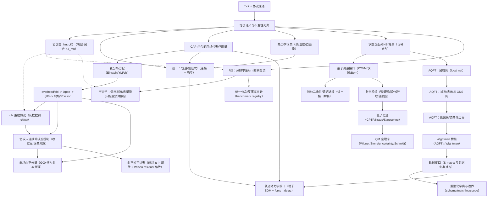
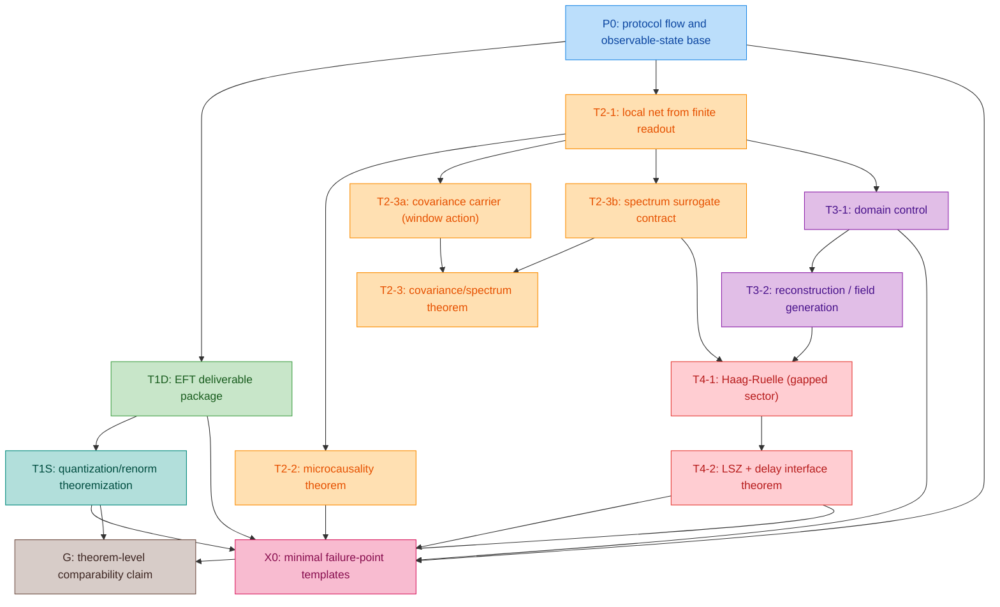

# z128 理论闭合追踪（Tick+CAP，自包含）

本文件用于追踪 `docs/papers/2025_z128_standard_model_stable_sector_hpa_omega` 内部的“理论闭合”进度：哪些概念已在 **数学层（Tick+CAP）** 与 **物理层（可操作定义/接口）** 之间完成一致的对应，哪些仍处于部分闭合或待闭合状态。

## 使用约定

- **闭合状态（建议维护）**
  - `[x]`：已按本追踪文档所定义的“交付闭合口径”完成（落地到文稿/附录，给出可引用的定义/定理/命题/误差模板，并接入编译链；若涉及量子化/重整化等强命题，则必须把剩余前提显式写成假设与失败点）。
  - `[~]`：部分闭合（核心对象与接口已明确，但仍缺关键定理化步骤或缺统一的失败点/误差预算）。
  - `[ ]`：待闭合。

- **强闭合 vs 交付闭合（重要口径）**
  - 本文档中的 `[x]` 目前默认采用“交付闭合”：把计划中的 theorem-facing 结构（有限候选族、选择规则、定理陈述、误差分解、失败点）写成可审计/可引用的文本。
  - 这不等价于“强闭合”（例如：无额外假设地构造相互作用 4D QFT、给出 BRST 不变量子化并控制 counterterms/连续极限）。强闭合若要宣称，必须额外列出对应的定理链与证明输入，并将其状态单列追踪。

- **`[Open]` 语义（与 `inference_ledger` 对齐）**
  - `[Open]`：未在 tick+CAP 的输入集下完成 theorem-level 闭合；即便该模块已作为 Iface/Audit 写入并可编译，也可标为 `[Open]` 以提示其“非定理闭合”的层级边界。
- **四层一致性（建议每项都标注）**
  - **Iface**：可操作/接口层（实验/协议可观测）
  - **CAP**：在有限候选族上的 CAP 闭合（选择/最小化/词典）
  - **Math**：数学层推导（不变性/定理/变分）
  - **Audit/Prot**：审计/复现实验/数据协议

## 跨论文模板对齐清单（Phase 0）

本节记录在进行结构重排/术语对齐时应优先参考的“模板文件”，用于确保层纪律与符号写法与仓库内其它论文一致；它不引入额外公理，也不改变 z128 的最小输入集（tick + CAP）。

- **层纪律与 not used in proofs 写法**
  - `docs/papers/2025_motive_at_infinity_holographic_scanning_principle/sections/02_audit_layers.tex`
  - `docs/papers/2025_stairway_to_infinity_holographic_renormalization_flow/sections/02_layers_axioms.tex`
  - `docs/papers/2025_ramanujan_holographic_scanning_principle_hpa_omega/sections/02_layers_axioms.tex`
- **Wish / Motive 的定义与目标函数模板**
  - `docs/papers/2025_protocol_stable_period_data_computational_teleology/sections/03_wish_protocol_stable_period_data.tex`
  - `docs/papers/2025_protocol_stable_period_data_computational_teleology/sections/05_selection_principle.tex`
  - `docs/papers/2025_protocol_stable_period_data_computational_teleology/sections/06_variational_dynamics.tex`
  - `docs/papers/2025_motive_at_infinity_holographic_scanning_principle/sections/03_periods_motives_wishes.tex`
  - `docs/papers/2025_motive_at_infinity_holographic_scanning_principle/sections/07_selection_principle.tex`
- **$\varphi$-$\pi$-$\mathrm{e}$ 折叠总论与极点障碍模板**
  - `docs/papers/2025_resolution_folding_phi_pi_e_hpa_omega/sections/06_resolution_folding_map.tex`
  - `docs/papers/2025_resolution_folding_phi_pi_e_hpa_omega/sections/04_pi_constraint_discrete_monodromy.tex`
  - `docs/papers/2025_resolution_folding_phi_pi_e_hpa_omega/sections/05_e_constraint_abel_zeta_pole_barrier.tex`
- **Abel / finite part / trace-formula 刚性模板（用于 e-通道与解析稳定的统一口径）**
  - `docs/papers/2025_holographic_hilbert_universe_hpa_omega/sections/appendices/03_abel_finite_part_notes.tex`
  - `docs/papers/2025_riemann_ground_state_hpa_omega/sections/appendices/03_orbit_calculus_abel_fp.tex`
  - `docs/papers/2025_riemann_ground_state_hpa_omega/sections/05_trace_formula_rigidity.tex`
  - `docs/papers/2025_holographic_hilbert_universe_hpa_omega/sections/09_trace_formula_rigidity.tex`
  - `docs/papers/2025_z128_standard_model_stable_sector_hpa_omega/sections/appendices/59_operator_mother_space.tex`

## 闭合依赖图（模块级）

说明：上图是**依赖关系**而非叙事顺序；叙事可从 `B`（等价语义+频率优先词典）开始，也可从 `A`（协议/读出）开始。

## 隐含约束注册表（Implicit constraint registry）

本节记录在 DAG 中以虚线边呈现、并在正文/附录中已明确化的“隐含几何约束/刚性门槛”。它们不是新增原语，而是把分散在不同模块的约束收口为可复用的**结构门禁**与**最小失败点**。

### IC-1：dyadic baseline ↔ cosmology 离散匹配的一致性 pin（Z128–cosmo pin）

- **内容**：在 dyadic baseline 取 $p=7$（$\ZZ_{128}$）的前提下，内部低复杂度关系 $m_b^\ast=2p+1$ 给出 $m_b^\ast=15$，与 cosmology 离散匹配得到的 $m_\ast\approx 15$ 形成跨模块一致性 pin。若不一致，必须显式暴露“改 baseline/改关系/扩展假设类”。  
- **文稿定位**：
  - `sections/I_00_introduction.tex`：`\ref{subsec:z128_label}`（Z128 baseline 叙事处给出跨模块指针）
  - `sections/F_12_rigidity_bridge_spine.tex`：`\ref{cor:dyadic_cosmology_consistency_pin}`
  - `sections/appendices/32_cosmology_resolution_flow.tex`：`m_\ast` 离散匹配段落（并回引 pin）
- **层级**：Audit/Iface（不提升为 theorem-level cosmology）
- **最小失败点**：pin 失配意味着 cosmology 的“占据假设/拟合口径”或 dyadic baseline/关系式之一需要显式扩展，不能作为隐含旋钮。

### IC-2：QCD proxy↔Padé pole-barrier gate 属于同一 pole-barrier 证书体系（QCD gate ↔ mother-space/pressure spine）

- **内容**：QCD 的“pole-barrier pass”（Padé 分母在单位圆内无根）是 Abel-first/pole-barrier 纪律的有限短序列实例化；它在可定义 transfer-operator/矩阵包的情形下与谱半径/pressure 的门禁等价形式对齐（pole barrier = exp(-pressure) 的叙事骨架）。  
- **文稿定位**：
  - `sections/appendices/67_qcd_confinement_proxy_audit.tex`：`\ref{subsec:qcd_proxy_polebarrier_consistency_loop}`
  - `sections/appendices/68_qcd_confinement_pade_pole_barrier_audit.tex`：开头（显式挂回母空间/pressure spine）
  - `sections/F_12_rigidity_bridge_spine.tex`：`\ref{cor:pole_barrier_equals_exp_minus_pressure}`
  - `sections/appendices/59_operator_mother_space.tex`：母空间口径（resolvent/det 的解析域门禁）
- **层级**：Audit（明确“非 confinement/mass gap 定理闭合”）
- **最小失败点**：短/稀疏级数 + 有界 Padé 阶族导致的假极点/阶不稳定，必须继续以 bounded extension + stability gates 方式升级，不能直接升格为强结论。

### IC-3：CAP 在等价类上良定义 ⇒ tie-break 必须不变量（legality threshold）

- **内容**：任何希望作为“语义对象/不变量 verdict”输出的 CAP 选择，都要求目标函数与 tie-break key 在声明的等价关系下不变；否则即便目标函数不变也会违约。  
- **文稿定位**：
  - `sections/F_12_rigidity_bridge_spine.tex`：`\ref{prop:rigidity_legality_invariant_verdicts}`
  - `sections/I_21_protocol_connections_holonomy.tex`：tie-break 段落显式引用该门槛
  - `sections/appendices/15_holonomy_sweeps_extended.tex`：bounded sweeps 的合法性注记
  - `sections/appendices/76_scheme_invariance_audit_contract.tex`：scheme 合同（哪些量允许变化）
- **层级**：Audit/Prot（用于防止“隐藏自由度”）
- **最小失败点**：一旦 tie-break 依赖坐标/表示/未声明约定，则输出不再是等价类上的对象，需降级为“representation-dependent diagnostic”或补充合同。

### IC-4：holonomy cycle-type-only summaries 的可识别性边界（identifiability boundary）

- **内容**：若观测/汇总仅给出 cycle-type histogram（或等价地仅给出 class-function/trace summaries），则它对内部实现的区分能力存在硬边界：同 histogram 的两实现对所有 class functions 不可区分。要区分必须扩大 loop family 或引入非 class-function readout。  
- **文稿定位**：
  - `sections/F_12_rigidity_bridge_spine.tex`：`\ref{prop:cycle_type_identifiability_boundary}`
  - `sections/I_21_protocol_connections_holonomy.tex`：`\ref{rem:holonomy_identifiability_boundary}`
  - `sections/V_40_falsifiability_predictions.tex`：`\ref{subsec:p5_quantified_predictions}`（P5 的 applicability/failure-point）
- **层级**：Audit（信息论边界/适用范围）
- **最小失败点**：若数据可用信息退化为 cycle-type-only，则任何声称“提取更多 CP/相位结构”的结论都超出该可观测族的信息含量，必须改变读出对象或扩大 loop family。

### IC-5：phase-lift 是 holonomy 的读出分支（保持 conjugacy 结构）

- **内容**：phase-lift 不应被理解为“另起炉灶的 CP 模块”，而是对同一 loop holonomy 的一种读出提升；因此它继承 cycle-type/conjugacy 的结构约束与可识别性边界。  
- **文稿定位**：
  - `sections/I_21_protocol_connections_holonomy.tex`：phase-lift 定义段与上述可识别性边界 remark
  - `sections/V_40_falsifiability_predictions.tex`：P5 的边界说明（cycle-type-only）
- **层级**：Audit/Iface（诊断管线的结构说明）

### IC-6：容量 bits ↔ 计数熵（capacity = log-count entropy）与折叠挤压约束

- **内容**：在本文口径里，容量（bits）与计数熵（log-count entropy）是同一对象的两种刻度；凡以容量作为控制参数（screen capacity、$\chi$-cloud capacity、BH capacity matching），都应与“有限可观测折叠”产生的挤压界相容，尤其是纤维熵/相对熵挤压（RB‑E 型）给出的非均匀性 $O(1)$ 约束。  
- **文稿定位**：
  - `sections/F_12_rigidity_bridge_spine.tex`：`\ref{rem:rigidity_capacity_bits_entropy}`（capacity bits = entropy 的统一口径）
  - `sections/F_12_rigidity_bridge_spine.tex`：`\ref{prop:fiber_entropy_relative_entropy_squeezing}`（RB‑E squeezing）
  - `sections/appendices/09_bh_planck_capacity_calibration.tex`：容量校准与 area representative
  - `sections/appendices/27_thermodynamics_from_equivalence.tex`：计数熵字典（$S=\log|\Gamma|$）
- **层级**：Iface/Audit（不把 BH/热力学当作 folding 定理前提）
- **最小失败点**：若某处用容量数值推出“熵/均匀性/稳定性”而未声明其对应的 coarse-graining/quotient 与适用窗口（或将可观测挤压界当作可调旋钮），则应降级为 matching-only，并显式扩大候选族或补充误差预算。

### IC-7：scheme reparam ↔ \texorpdfstring{$r$}{r} 原点平移 ↔ tick-origin shift（坐标规约几何）

- **内容**：在 $\mu(r)=\mu_0\varphi^{\,r}$ 的分辨率坐标里，$\mu_0$ 选择只是 $r$ 的原点选择；而 RG 字典中的 $\Lambda$ 重标定 $\Lambda'\!=c\Lambda$ 等价于 $r$ 的加法平移。它与等价语义中的 tick-origin shift（E1）属于同一类“坐标规约自由度”，必须通过 scheme contract 显式管理（不变/允许变）。  
- **文稿定位**：
  - `sections/F_12_rigidity_bridge_spine.tex`：`\ref{cor:rigidity_scheme_shift_origin_r}`
  - `sections/F_10_equivalence_semantics.tex`：tick-origin shift（E1）与 CAP-on-quotients 语义
  - `sections/appendices/31_running_couplings_resolution_flow.tex`：`\ref{lem:lambda_rescaling_shift_r}`
  - `sections/appendices/76_scheme_invariance_audit_contract.tex`：scheme invariance contract
- **层级**：Audit/Match（EFT/RG 仍是字典层）
- **最小失败点**：若某数值闭合对 scheme/$\mu_0$ 敏感但未在合同中显式记账，则必须回退为“bounded scheme family + sensitivity envelope”，禁止把坐标自由度当作隐含调参。

### IC-8：WS delay ↔ \texorpdfstring{$\log\det S$}{logdet S} ↔ \texorpdfstring{$\log\det$}{logdet}/trace bookkeeping（实验侧解析证书接口）

- **内容**：在 unitary band 上，Wigner–Smith 延迟满足 $\Tr Q(\omega)=-i\,\dd(\log\det S)/\dd\omega$，因此 delay 是 log-determinant 的频率导数。它把“实验可观测的 delay”与本文的 determinant/trace/解析域证书体系对齐，使得 delay audit 能以同一类 logdet 证书语言挂回 pole-barrier/mother-space 口径（但前提窗口必须显式）。  
- **文稿定位**：
  - `sections/F_12_rigidity_bridge_spine.tex`：`\ref{lem:wigner_smith_trace_logdet}` 与 `\ref{rem:rigidity_ws_logdet_bridge}`
  - `sections/appendices/34_unified_delay_closure.tex`：WS delay 字典与 logdet identity（接口层）
  - `sections/appendices/59_operator_mother_space.tex`：logdet/trace 与 pole-barrier 口径
  - `sections/appendices/65_scattering_haag_ruelle_lsz_interface.tex`：散射接口与失败点（S1 等）
- **层级**：Iface/Audit
- **最小失败点**：若 $S(\omega)$ 在声明带宽内不近似幺正/不可微/unwrap 不稳定（S1），则必须把 WS delay 降级为 proxy，并停止任何“解析证书升级”的叙事提升。

### IC-9：CPTP/DPI ↔ 第二定律证书 ↔ 多体反馈（单调性约束面）

- **内容**：把 coarse-graining/forgetting 表述为 channel（Markov 或 CPTP）时，DPI（相对熵单调性）提供可审计的不可逆证书；热力学“第二定律”在本文口径下应理解为“在声明 channel family 上的 DPI 证书”，并能与多体+测量反馈（instrument/control loop）接口同构对齐。  
- **文稿定位**：
  - `sections/F_12_rigidity_bridge_spine.tex`：`\ref{cor:rigidity_dpi_irreversibility_certificate}`
  - `sections/appendices/30e_quantum_channels_cptp_stinespring.tex`：`\ref{thm:z128_quantum_dpi_channel}`
  - `sections/appendices/27_thermodynamics_from_equivalence.tex`：thermo 的 channel/单调性口径
  - `sections/appendices/77_orbit_gauge_force_manybody_measurement_feedback.tex`：多体反馈接口
- **层级**：Math/Iface（DPI 为数学定理；物理解释为接口）
- **最小失败点**：若实际 pipeline 不满足声明的 CPTP/Markov 条件、或 channel family 未界定，则“第二定律证书”必须回退为经验叙述并显式记录误差/违约项。

### IC-10：MDL 全局 look-elsewhere ↔ CAP 局部选择（扩族记账约束）

- **内容**：CAP 在单一有限族内给出局部闭合；跨族比较必须通过显式 family registry 与 prefix-code prior（MDL）记账。任何“扩族/多重扫描/更换核族”都必须进入 registry（或显式 union/mixture 修正），否则属于未记账的 look-elsewhere。  
- **文稿定位**：
  - `sections/appendices/42_global_model_selection_mdl.tex`：`\ref{app:global_model_selection_mdl}`（registry + mixture bound）
  - `sections/appendices/11_inference_ledger.tex`：外部输入/候选族口径与 joint protocol-state scan 记账
  - `architecture_dag.md`：Fig.9 的 MDL↔kernel-view 约束边（见 IC-10 的虚线）
- **层级**：Audit
- **最小失败点**：出现未登记的 family enlargement（增加候选表达式/核族/阈值扫描）时，必须回退为“within-family 结果”并补齐 registry 与全局上界。

### IC-11：\texorpdfstring{$r_m$}{r_m}（最大纤维）↔ 最小 slot gauge ↔ gauge 复杂度敏感性

- **内容**：$r_m$ 不仅是折叠冗余的最大退化，它还强迫最小截断自由的 uniform slot gauge 至少为 $S_{r_m}$；因此任何 gauge-复杂度/内部维度的敏感性声明都必须与 $r_m$ 的增长率以及 RB‑E squeezing 的非均匀性控制一致。  
- **文稿定位**：
  - `sections/I_21_protocol_connections_holonomy.tex`：`\ref{prop:max_fiber_deg_forces_perm_gauge}` 与 `\ref{cor:rm_growth_rate}`
  - `sections/F_12_rigidity_bridge_spine.tex`：`\ref{prop:fiber_entropy_relative_entropy_squeezing}`
  - `sections/C_12_kernel_view.tex`：$r_m$ 与 kernel 视角的冗余率解释
- **层级**：Math/Prot（$r_m$ 与 gauge 最小性为定理/构造；物理解释为接口）
- **最小失败点**：若实际构造对纤维进行了 truncation/非声明 padding，或把 representation-dependent tie-break 当作 gauge invariant，则必须降级为“表示依赖诊断”，并重新声明 slot/gauge 约束。

### IC-12：kernel weighted pressure monotonicity ↔ thermodynamic pressure ↔ pole barrier

- **内容**：kernel view 的 weighted pressure proxy $P_n(t)=\log\rho(\widehat F_n(t))$ 与 thermodynamic-formalism 的 pressure $P(\phi)=\log\rho(\mathcal{L}_\phi)$ 是同一类 $\log$-谱半径对象；其 pole-barrier 统一为 $\exp(-P)$ 的解析域证书。  
- **文稿定位**：
  - `sections/F_12_rigidity_bridge_spine.tex`：`\ref{cor:rigidity_kernel_pressure_polebarrier_alignment}`
  - `sections/C_12_kernel_view.tex`：weighted operator family 与 P8 单调性
  - `sections/appendices/44_thermodynamic_formalism_pressure.tex`：pressure=spectral radius（标准）
  - `sections/appendices/59_operator_mother_space.tex`：det/resolvent 的 pole-barrier 口径
- **层级**：Audit/Math（对齐为证书体系，不引入新物理前提）
- **最小失败点**：若 weighted potential 或 operator assembly 导致 PF 单调性/非负性违约，则 P8/pressure 解释必须回退为“表格级 audit 输出”，并记录违约触发条件。

## 已引入的“自包含闭合模块”（Part F 主文 + 附录）

- [x] **时间箭头（指数半群/Abel-first）**：`Part F.0`  
  - 位置：`sections/F_00_arrow_of_time_semigroup.tex`（`\label{app:arrow_of_time_semigroup_notes}`）
  - 要点：指数半群骨架、遗忘常数、与 Abel-first/pole-barrier 语言对齐；连续半群的 Cauchy 方程解采用标准结果并给出引用；作为后续单调性与不可逆证书的最小数学核。
- [x] **等价语义与频率优先词典**：`Part F.1`  
  - 位置：`sections/F_10_equivalence_semantics.tex`（`\label{app:equivalence_semantics}`）
  - 要点：物理对象=等价类；物理量=不变泛函；频率作为优先派生量；力/曲率/熵等作为不变性或闭合输出。
- [x] **算子母空间字典入口（resolvent/determinant；观察者/意识口径）**：`Part F.1`  
  - 位置：`sections/F_05_operator_mother_space_dictionary.tex`（`\label{app:operator_mother_space_dictionary}`）
  - 要点：以 trace-class 源算子 $F$、读出核 $K$ 与 Fredholm 行列式为统一 bookkeeping 层，把 Abel-first/pole-barrier、prime-cycle 生成函数、以及 CAP 的有限族更新 $F\mapsto F+\Delta$ 放进同一字典口径；其中 observer:=kernel choice、consciousness:=finite-rank update 仅作为接口字典，不进入 theorem-level folding 依赖链。
- [x] **CAP-闭合连续代表作用量**：`Part F.2`  
  - 位置：`sections/F_20_cap_continuum_action_closure.tex`（`\label{app:cap_continuum_action_closure}`）
  - 要点：在有限候选族上闭合局域协变不变量项，输出最小骨架 `S_eff`。
- [x] **变分场方程（Einstein/YM/chi）**：`Part F.2`  
  - 位置：`sections/F_21_variational_field_equations.tex`（`\label{app:variational_field_equations}`）
  - 要点：由 `S_eff` 推出场方程、守恒与弱场模板。
- [x] **热力学（从等价/粗粒化到熵/温度/自由能）**：`appendix 27`  
  - 位置：`sections/appendices/27_thermodynamics_from_equivalence.tex`（`\label{app:thermodynamics_from_equivalence}`）
  - 要点：熵=计数；温度=频率共轭尺度；CAP=自由能原则；三定律；熵力与引力词典对齐。
  - 边界：温度标尺（尤其 $T_{\mathrm{eff}}$）与第二定律的“可审计单调性证书”需要额外的匹配/算子族前提；见本文末“热力学统一（口径边界与最小失败点）”追踪条目。
- [x] **overhead/chi -> 引力闭合链**：`Part F.4`  
  - 位置：`sections/F_40_overhead_to_gravity_closure.tex`（`\label{app:overhead_to_gravity_closure}`）
  - 要点：$\kappa \to \chi \to N \to g_{00} \to \Phi$；弱场下 $\rho_{\mathrm{eff}} \propto -\Delta \chi$；$\gamma$ 拟合模板。
- [x] **chi 重建协议**：`Part F.4`  
  - 位置：`sections/F_41_chi_reconstruction_protocol.tex`（`\label{app:chi_reconstruction_protocol}`）
  - 要点：Hilbert 分箱→窗口词→折叠统计→$\chi(x)$ 重建→测试与拟合。
- [x] **协议层→连续场误差控制**：`appendix 33`  
  - 位置：`sections/appendices/33_protocol_to_continuum_error_control.tex`（`\label{app:protocol_to_continuum_error_control}`）
  - 要点：误差度量与分解；集中界→log 误差传播；差分算子截断误差与噪声放大；$\gamma$ 的 WLS 方差与 $\rho_{\mathrm{eff}}/\Phi$ 的误差预算。
- [x] **弱场曲率分量（从 $\chi$ 到 $G_{00}$；离散估计与误差预算）**：`appendix 60`  
  - 位置：`sections/appendices/60_weak_field_curvature_from_chi.tex`（`\label{app:weak_field_curvature_from_chi}`）
  - 要点：在标准弱场规约下给出 $G_{00}$ 的拉普拉斯形式，并通过 $\Phi=-\gamma c^2(\chi-\chi_0)$ 将其写成 $\Delta\chi$ 的曲率代理；定义离散曲率估计量 $\widehat G_{00,h}=-2\widehat\gamma\,\Delta_h\widehat\chi_h$，并将 Appendix~\ref{app:protocol_to_continuum_error_control} 的截断/噪声放大界接入误差预算。
- [x] **量子测量与 Born 闭合**：`appendix 30`  
  - 位置：`sections/appendices/30_quantum_measurement_born.tex`（`\label{app:quantum_measurement_born}`）
  - 要点：POVM/仪器；Born 规则两条闭合路线（计数模板与 Gleason–Busch 唯一性）。
- [x] **复合系统（张量积/部分迹/联合读出）**：`appendix 30d`  
  - 位置：`sections/appendices/30d_composite_systems_tensor_products.tex`（`\label{app:composite_systems_tensor_products}`）
  - 要点：张量积、部分迹与联合读出（product POVM）作为最小复合系统接口；为纠缠与局域性讨论提供结构底座。
- [x] **量子信道（CPTP/Kraus/Stinespring；单调性证书）**：`appendix 30e`  
  - 位置：`sections/appendices/30e_quantum_channels_cptp_stinespring.tex`（`\label{app:quantum_channels_cptp_stinespring}`）
  - 要点：CPTP/Kraus/Stinespring 结构与最小可审计不可逆证书（trace-distance contraction）；为时间箭头/热力学单调性提供硬桥。
- [x] **QM 定理库（核心结构定理）**：`appendix 30f`  
  - 位置：`sections/appendices/30f_qm_theorem_library_core.tex`（`\label{app:qm_theorem_library_core}`）
  - 要点：Wigner/Stone、不确定性、Schmidt 等核心结构定理，以“定理 vs 接口读法”分层记录。
- [x] **AQFT：局域网与公理包（结构）**：`appendix 61`  
  - 位置：`sections/appendices/61_aqft_axioms_local_nets.tex`（`\label{app:aqft_axioms_local_nets}`）
  - 要点：局域网、微因果、协变/谱条件的结构打包；作为混合 AQFT↔Wightman 桥的底座（接口层约束，不反哺 folding 证明链）。
- [x] **AQFT：状态/表示与 GNS 网**：`appendix 62`  
  - 位置：`sections/appendices/62_states_representations_gns_nets.tex`（`\label{app:aqft_states_representations_gns_nets}`）
  - 要点：把 state/GNS 背景升级到局域网：由准局域代数上的状态诱导 GNS net（局域 von Neumann 代数族）。
- [x] **AQFT：微因果/谱条件边界与开放项**：`appendix 63`  
  - 位置：`sections/appendices/63_microcausality_spectrum_covariance.tex`（`\label{app:microcausality_spectrum_covariance}`）
  - 要点：明确微因果/谱条件作为接口层承诺；场域重建与相互作用构造作为显式边界项。
- [~] **Wightman 桥接（hybrid）**：`appendix 64`（[Open]：非 theorem-level）  
  - 位置：`sections/appendices/64_wightman_bridge_and_reconstruction.tex`（`\label{app:wightman_bridge_and_reconstruction}`）
  - 要点：AQFT→Wightman 与 Wightman→AQFT 的桥接路线与前提边界（域/正则性/生成域问题不偷渡）。
- [~] **散射接口（Haag–Ruelle/LSZ 前提显式）**：`appendix 65`（[Open]：非 theorem-level）  
  - 位置：`sections/appendices/65_scattering_haag_ruelle_lsz_interface.tex`（`\label{app:scattering_haag_ruelle_lsz_interface}`）
  - 要点：散射对象以接口层语言记录，并与统一延迟字典（Wigner–Smith）对齐；必要前提作为审计边界显式列出。
- [x] **Toy 等价审计：散射延迟队列 ↔ 黑洞饱和队列 ↔ Page-surrogate（同一记录代数语言）**：`appendix 8ac`  
  - 位置：`sections/appendices/8ac_scattering_bh_toy_equivalence_audits.tex`（`\label{app:scattering_bh_toy_equivalence_audits}`）
  - 层级：Iface/Audit（CS 语言 toy），不提升为 theorem-level 等价。
  - 关键对齐：
    - 外部记录代数统一为单一 emitted stream：散射 toy 与 BH toy 均使用稳定字母表 $X_6$，并用显式 token \texttt{X} 表示 loss/leak（便于并排压缩率/饱和度审计）。
    - 散射侧的 loss 门禁采用 S1 风格 $\eta_{\min}$；BH 侧引入可饱和的 batch 吸收与 queue-length 驱动的 leak_amp（以同一 token \texttt{X} 对齐 loss 语义）。
    - 散射载体的 Match 边界：散射 toy 的 $S(\omega)$ 载体仅以 \texttt{proxy\_E} benchmark 的 linewidth-proxy 约定作锚定；对于 MeV 等真实单位的数据集，只有“数据集内 triangle 审计”被使用（见 `app:scattering_delay_linewidth_triangle_audit` 的 Match boundary 段落），不做跨单位聚合的 CAP carrier 选择。
    - 散射载体工件化（Audit/Match）：当 M2 的匹配字典覆盖满足门禁时，跨数据集 CAP-selected carrier 会被物化为 registry 工件 `data/k4_matching/scattering_carrier_registry.json`，并由 `scripts/exp_scattering_carrier_registry_generate.py` 生成，同时在 Appendix~\ref{app:scattering_delay_linewidth_triangle_audit} 输出对应的 summary/table。下游 toy（散射队列、散射↔BH 并排审计）优先读取该 registry；缺失时回退为 M2 在线选择，再回退为 M1。
  - 生成脚本（可复现生成物接入编译链）：
    - `scripts/exp_scattering_process_delay_queue_sim.py`（`sections/generated/scattering_process_delay_queue_*`）
    - `scripts/exp_scattering_bh_queue_equivalence_audit.py`（`sections/generated/scattering_bh_queue_equivalence_*`）
    - `scripts/exp_scattering_bh_page_surrogate_equivalence.py`（`sections/generated/scattering_bh_page_surrogate_*`）
- [~] **重整化字典与边界（scheme/matching）**：`appendix 66`（[Open]：非 theorem-level）  
  - 位置：`sections/appendices/66_renormalization_dictionary_and_boundaries.tex`（`\label{app:renormalization_dictionary_and_boundaries}`）
  - 要点：把 scheme/scale 依赖收口为 Match/Iface 边界；不主张 4D 相互作用构造性重整化的 theorem-level 闭合。
- [x] **轨道动力学接口 + force↔delay 桥接（粒子EOM）**：`appendix 68`  
  - 位置：`sections/appendices/68_orbit_dynamics_and_force_scattering_bridge.tex`（`\label{app:orbit_dynamics_and_force_scattering_bridge}`）
  - 要点：给出最小 worldline reduction 与 Lorentz-force 形式的接口模板，并把“力的响应扰动→相位扰动→WS 延迟扰动”写成最小闭环桥。
- [x] **统一/非统一分岔 + 反事实候选审计（registry）**：`appendix 69`  
  - 位置：`sections/appendices/69_unification_branching_counterfactual_audit.tex`（`\label{app:unification_branching_counterfactual_audit}`）
  - 要点：分离 (U1) 群结构统一、(U2) 耦合统一、(U3) 归一化约定，并登记有界反事实候选与“no tuning from global fits”的审计契约。
- [x] **力→相位→延迟审计闭环（稳定性与误差预算模板）**：`appendix 70`  
  - 位置：`sections/appendices/70_force_phase_delay_audit.tex`（`\label{app:force_phase_delay_audit}`）
  - 要点：把 phase→delay 的数值微分、相位解缠与噪声放大问题显式化为 bounded sweep + envelope 报告；给出 $O(\Delta\omega^2)+O(\sigma/\Delta\omega)$ 的误差拆分模板，并与 `app:protocol_to_continuum_error_control` 的审计纪律对齐。
- [x] **耦合统一（U2）：$r$ 坐标的有界匹配审计**：`appendix 71`  
  - 位置：`sections/appendices/71_coupling_unification_audit_in_r.tex`（`\label{app:coupling_unification_audit_in_r}`）
  - 要点：在 one-loop affine running 字典下，把“是否存在统一尺度”变成显式的有限候选族审计问题（电弱锚点由 `thm:weinberg_angle` 闭合，$\alpha_3^{-1}(\mu_Z)$ 作为 $n\pi^2$ 的有界族登记），输出 intersection mismatch 表并给出确定性选择。
- [x] **U1 单群候选 registry（SU(5)/SO(10)/E6）**：`appendix 72`  
  - 位置：`sections/appendices/72_u1_simple_group_registry_audit.tex`（`\label{app:u1_simple_group_registry_audit}`）
  - 要点：以有界 registry 的方式记录常见单群候选，并用显式 complexity keys（$\dim\mathfrak g$, $d_{\min}$）说明其在当前 H2/H3 的最小性键下并非 CAP-minimal；保持 benchmark/audit 语义，不提升为 theorem-level U1。
- [x] **U3 归一化/嵌入约定 registry**：`appendix 73`  
  - 位置：`sections/appendices/73_u3_normalization_embedding_registry.tex`（`\label{app:u3_normalization_embedding_registry}`）
  - 要点：将超荷归一化/嵌入的约定差异登记为有界 registry（如 $c^2\in\{1,5/3\}$），作为 U2 审计输出跨文献口径对齐的台账，不引入 fit 目标。
- [x] **U1→U2 可证伪接口链（最小失败点）**：`appendix 74`  
  - 位置：`sections/appendices/74_u1_to_u2_falsifiable_interface_chains.tex`（`\label{app:u1_to_u2_falsifiable_interface_chains}`）
  - 要点：把“单群→耦合关系”的叙述拆成 C1–C3 三条可审计链，并列出每条的最小失败点；保持 audit/iface 语义，不升级 U1。
- [x] **散射反向一致性审计（phase→delay→phase）**：`appendix 75`  
  - 位置：`sections/appendices/75_scattering_inverse_consistency_audit.tex`（`\label{app:scattering_inverse_consistency_audit}`）
  - 要点：在 vendored 相移点云上，对有限估计族（CD/LL + smoothing）执行“导数→积分”反向一致性检查，输出残差范数表。
- [x] **scheme 不变性契约（字典层）**：`appendix 76`  
  - 位置：`sections/appendices/76_scheme_invariance_audit_contract.tex`（`\label{app:scheme_invariance_audit_contract}`）
  - 要点：明确 scheme reparam 下哪些量必须视为不变量、哪些允许变化，并给出未来 audit 的最小 checklist。
- [x] **QCD proxy↔Padé pole-barrier 一致性/互否 gate**：`appendix 67/68` 补充  
  - 位置：`sections/appendices/67_qcd_confinement_proxy_audit.tex`（`\label{subsec:qcd_proxy_polebarrier_consistency_loop}`）
  - 要点：把两种有限诊断压缩成 gate 表（area-signal vs interior-poles），明确冲突/一致的 failure labels；保持“严格未解”状态不变。
- [x] **多体+观测反馈的 orbit/gauge/force 接口**：`appendix 77`  
  - 位置：`sections/appendices/77_orbit_gauge_force_manybody_measurement_feedback.tex`（`\label{app:orbit_gauge_force_manybody_measurement_feedback}`）
  - 要点：用 instrument/CPTP 语言闭合“测量/反馈→有效泛函→响应力→轨道偏离”的接口闭环。
- [x] **统一：轨道/规范/力（connection + response）**：`appendix 67`  
  - 位置：`sections/appendices/67_unified_orbit_gauge_force.tex`（`\label{app:unified_orbit_gauge_force}`）
  - 要点：把“轨道=(基路径+内部态)”与“规范=协变运输/平行运输结构”以及“力=action/自由能响应导致的偏离”合并为一条接口层闭合链；不新增原语，不反哺 folding 证明链。
- [x] **状态泛函/GNS 背景（记号对齐；不计为新增原语）**：`appendix 30c`  
  - 位置：`sections/appendices/30c_state_gns_background.tex`（`\label{app:state_gns_background}`）
  - 要点：状态 $\omega$ 作为正且归一的线性泛函；GNS 表示给出 $\omega(A)=\langle\Omega|\pi(A)\Omega\rangle$；并将 $P(E)=\omega(E)$ 与 $P=\Tr(\rho E)$ 的等价关系写成纯数学口径，用于与本论文的 POVM/Born 写法对齐。
- [x] **波粒二象性/延迟选择/量子擦除（接口解释）**：`appendix 30b`  
  - 位置：`sections/appendices/30b_wave_particle_delayed_choice.tex`（`\label{app:wave_particle_delayed_choice}`）
  - 要点：以 Born 概率的交叉项/去相干混合（`lem:z128_interference_vs_mixture`）为最小代数核，给出互补性界 $V^2+D^2\le 1$、Mach–Zehnder delayed-choice、delayed-choice quantum eraser 与 Wheeler “Great Smoky Dragon” 的可审计口径，并与 Q 输入包对齐（`prop:qcomp_implies_qwave_weak`）。
- [x] **RG：分辨率坐标 r 的耦合流**：`appendix 31`  
  - 位置：`sections/appendices/31_running_couplings_resolution_flow.tex`（`\label{app:running_couplings_resolution_flow}`）
  - 要点：$\mu(r)=\mu_0\varphi^r$ 与链式法则；QED/QCD 一环；阈值匹配的离散解释；并把“$\Lambda$ 方案缩放 $\Leftrightarrow r$ 平移”提升为自包含引理（`\label{lem:lambda_rescaling_shift_r}`）。
- [x] **宇宙学：分辨率流与能量预算接口**：`appendix 32`  
  - 位置：`sections/appendices/32_cosmology_resolution_flow.tex`（`\label{app:cosmology_resolution_flow}`，`\label{ass:occupancy_energy_z128}`）
  - 要点：big bang 作为分辨率初始化；inflation=稳定容量增长；隐藏/稳定份额；能量预算部分以显式接口假设（占据计数）给出，使用 Planck-2018 的 $\Omega_{\mathrm{b},0}$ 作为紧凑目标，并提供可复现拟合脚本与图；离散匹配采用 log-mismatch 且 Voronoi 边界为几何均值（`\label{lem:log_voronoi_geometric_mean}`）；脚本同时生成 summary/stability 片段用于审计与敏感性口径统一。
- [x] **散射时间延迟的统一闭合（相位/频率/WS/红移/GR 参考）**：`appendix 34`  
  - 位置：`sections/appendices/34_unified_delay_closure.tex`（`\label{app:time_mass_delay}`，`\label{app:time_mass_delay_reference}`）
  - 要点：相位-频率-延迟统一接口；Wigner--Smith 延迟（含 trace/logdet 与校准/损耗处理）；delay→$\kappa$→lapse→redshift/Shapiro 的一致词典；相移/截面与时延同源的接口注记。
- [x] **边界–普朗克容量校准（黑洞信息→$(m,n)$ 分辨率；扩展审计模块）**：`appendix 09`  
  - 位置：`sections/appendices/09_bh_planck_capacity_calibration.tex`（`\label{app:bh_planck_capacity_calibration}`）
  - 要点：引入显式物理输入包的最小子集（Planck 单位与面积律/熵界，见 `app:physics_consensus_inputs` 的 PBH1–PBH5），把黑洞边界信息容量 $I_{\mathrm{BH}}$ 与协议屏幕容量 $I_{\mathrm{prot}}(m,n)=m4^n$ 在有限候选族上做确定性 CAP 校准，并输出一个可复现的 capacity-calibrated uplift path $(m,n(m))$ 供 uplift 依赖模块对齐（与 `sec:kernel_view` 的可迭代 $(m,n)$ 视角兼容）。
  - 生成脚本：`scripts/exp_bh_planck_capacity_calibration.py`（已接入 `scripts/run_all.py`）
  - 生成物：
    - `sections/generated/bh_planck_capacity_rows.tex`
    - `sections/generated/bh_planck_capacity_summary.tex`
    - `sections/generated/bh_capacity_calibrated_uplift_path_rows.tex`

- [x] **分辨率提升/融合/视界形成统一模块（有限容量；CAP 选择；高能≃融合阶段）**：`appendix 79`  
  - 位置：`sections/appendices/79_resolution_uplift_fusion_horizon_unification.tex`（`\label{app:resolution_uplift_fusion_horizon_unification}`）
  - 要点：在不新增 theorem-level 原语的前提下，把“高能过程=分辨率提升/信息聚集导致的融合阶段”翻译为一个有限容量模块：定义协议屏幕容量 $I_{\mathrm{prot}}(m,n)=m4^n$ 与目标需求 $I_{\mathrm{tar}}$，并用可审计的 CAP lexicographic key 在显式有限候选族上确定性选取 $(m^\ast,n^\ast)$；给出存在唯一性、随 $I_{\mathrm{tar}}$ 的单调性与阈值跳变命题，并形式化 “$n$ 被锁死 $\Rightarrow m$ 扩张” 的刚性情形。同时补充 staging dictionary：把已闭合的 $m_{\mathrm{eff}}(\mu)$ 阶梯（resolution-first）与 capacity-first 的 $I_{\mathrm{tar}}$ 视角并列，并记录从 $\chi$-云容量/观察者预算/延迟代理到 $I_{\mathrm{tar}}$ 的接口钩子，用于把黑洞/视界词汇组织为预算饱和阶段，而不预设 GR 事件视界。
  - 生成脚本：`scripts/exp_resolution_uplift_cap_choice.py`（已接入 `scripts/run_all.py`）
  - 生成物：
    - `sections/generated/resolution_uplift_cap_choice_summary.tex`
    - `sections/generated/resolution_uplift_cap_choice_rows.tex`

- [x] **协议视界（tick-trap；相对黑洞判据；K4 入口）**：`appendix 08`  
  - 位置：`sections/appendices/08_protocol_horizon_tick_trap.tex`（`\label{app:protocol_horizon_tick_trap}`）
  - 要点：把“黑洞/视界”降格为观察者预算下的协议不可分辨边界（H2），并把“质量=延迟”的接口字典接入相对判据；不预设 GR 事件视界（H1），只在 PBH* 条件下允许对齐。
  - 生成脚本：`scripts/exp_protocol_horizon_tick_trap_examples.py`（已接入 `scripts/run_all.py`）
  - 生成物：
    - `sections/generated/protocol_horizon_examples_rows.tex`
    - `sections/generated/protocol_horizon_examples_summary.tex`

- [x] **泄漏核（衰变/蒸发统一为 exit；18-trap/3-exit）**：`appendix 08b`  
  - 位置：`sections/appendices/08b_leakage_kernel_decay_evaporation.tex`（`\label{app:leakage_kernel}`）
  - 要点：用有限候选族生存核 $P(t)$ 与 $\Gamma/\tau$ 代理把“衰变/蒸发/辐射”统一为泄漏过程；在 $m=6$ 特例中，把 18 个 cyclic types 视为 trap categories，把 3 个 boundary types 视为 exit channels（并在 SM labeling 闭合下读作 $U(1),SU(2),SU(3)$ 通道族，而非直接等同“光子”）。
  - 生成脚本：`scripts/exp_leakage_kernel_demo.py`，`scripts/exp_leakage_kernel_m6_trap_exit.py`（已接入 `scripts/run_all.py`）
  - 生成物：
    - `sections/generated/leakage_kernel_demo_rows.tex`
    - `sections/generated/leakage_kernel_m6_trap_exit_rows.tex`
    - `sections/generated/leakage_kernel_m6_trap_exit_summary.tex`

- [x] **低温=受保护低泄漏相（主签名A；派生诊断B）**：`appendix 08d`  
  - 位置：`sections/appendices/08d_protected_low_leakage_phase.tex`（`\label{app:protected_low_leakage_phase}`）
  - 要点：把“低温/超导/晶体态”统一翻译为“低泄漏相”：$\Gamma$ 极小、$\tau_{\mathrm{WS}}$ 极大；“近无耗散传输”只作为派生诊断；若要进一步把低泄漏映射到温度语言，必须显式引用 `app:physics_consensus_inputs` 的 PDR/PPL 可选字典包。
  - 生成脚本：`scripts/exp_low_leakage_phase_signatures.py`（已接入 `scripts/run_all.py`）
  - 生成物：
    - `sections/generated/low_leakage_phase_rows.tex`
    - `sections/generated/low_leakage_phase_summary.tex`

- [x] **K4→数据匹配审计（delay / PDG leakage / alpha link）**：`appendix 08e/08f/08g`
  - 位置：
    - `sections/appendices/08e_k4_delay_audit.tex`（`\label{app:k4_delay_audit}`）
    - `sections/appendices/08f_k4_pdg_leakage_audit.tex`（`\label{app:k4_pdg_leakage_audit}`）
    - `sections/appendices/08g_k4_alpha_link_audit.tex`（`\label{app:k4_alpha_link_audit}`）
  - 要点：
    - **delay**：复用 vendored 引力时间延迟相关通道（solar-system + strong-lensing），在有限 mapping/reference 家族上对单一无量纲尺度 $\kappa$ 做一致性审计（候选族+确定性 tie-break）。
    - **PDG leakage**：以最小寿命 mini-set（vendored）把 $\Gamma=1/\tau$ 作为泄漏率代理，引入有限解释族（离散深度/通道偏置等）并做 CAP/MDL 选择。
    - **alpha link**：用 $m=6$ trap/exit 的 $U(1)$ 权重做低复杂度聚合映射审计，检验其是否提供除既有阻抗闭合之外的额外一致性证据（audit-only）。
  - 数据：
    - `data/k4_matching/delay_channel_registry.json`
    - `data/k4_matching/pdg_decay_miniset.json`
  - 生成脚本（均已接入 `scripts/run_all.py`）：
    - `scripts/exp_k4_delay_dictionary_audit.py`
    - `scripts/exp_k4_pdg_leakage_audit.py`
    - `scripts/exp_k4_alpha_link_audit.py`
  - 生成物：
    - `sections/generated/k4_delay_audit_rows.tex`, `sections/generated/k4_delay_audit_summary.tex`
    - `sections/generated/k4_pdg_leakage_rows.tex`, `sections/generated/k4_pdg_leakage_summary.tex`
    - `sections/generated/k4_alpha_link_rows.tex`, `sections/generated/k4_alpha_link_summary.tex`
- [x] **算子母空间（resolvent/determinant + finite-rank 更新；统一口径）**：`appendix 59`  
  - 位置：`sections/appendices/59_operator_mother_space.tex`（`\label{app:operator_mother_space}`）
  - 要点：以 trace-class resolvent 与 Fredholm 行列式为最小算子底座，对齐 Abel-first 的 pole-barrier 语言，并为 pointer-jump（虫洞类通道）与有限候选族 CAP 选择提供统一的纯数学 bookkeeping 层；该模块是审计/叙事统一层，不进入 theorem-level folding 依赖链。

## 概念级闭合矩阵（频率优先）

下表只做“定位与状态”追踪；具体定义/公式以对应附录/章节为准。

| 概念/物理量 | 数学对象/闭合输出（概要） | 主依赖 | 位置（LaTeX label） | 状态 |
|---|---|---|---|---|
| 时间（time） | tick 差分 $\Delta t$ | Iface/Math | `sec:tick_calculus`（主文） | [x] |
| 相位/频率（phase/frequency） | $\omega=\Delta\theta/\Delta t$ 等价定义族 | Iface/Math | `def:frequency_from_phase`, `rem:frequency_alt_definitions` | [x] |
| 等价语义（objects/observables） | 物理对象=等价类；可观测=不变泛函 | Math | `subsec:equivalence_physical_objects`, `subsec:equivalence_relations_minimal` | [x] |
| 曲率（curvature） | 回路/holonomy 的不变响应 | Math | `subsec:curvature_as_loops` | [x] |
| holonomy$\to$连续 YM（CL1--CL4） | refinement 兼容（含 TV/Max$\Delta$ 收敛审计） + 尺度映射有限族（归一化到锚点） + 正则性 bundle（RC3/谱代理挂钩） + 变分收敛（$\Gamma$-limit；外部输入点显式化） | Math/Audit | `app:discrete_connection_family_and_refinement`, `tab:holonomy_balanced_chain_convergence_audit`, `app:scale_map_and_small_loop_regularity_contract`, `tab:scale_map_balanced_chain_family`, `app:holonomy_to_connection_convergence_theorems`, `def:curvature_estimator_log_holonomy`, `app:gamma_convergence_wilson_to_yang_mills`, `app:variation_limit_exchange_and_yang_mills_eom` | [~] |
| 弱场曲率（weak-field curvature） | $G_{00}$ 的拉普拉斯代理与 $\chi$-曲率桥（含离散估计与误差预算） | Math/Audit | `app:weak_field_curvature_from_chi`, `thm:weak_field_G00_laplacian`, `cor:discrete_G00_error_budget` | [x] |
| 力（force） | 响应/梯度/变分（不变性下） | Math/CAP | `subsec:force_as_response` | [x] |
| 连续代表作用量 $S_{\mathrm{eff}}$ | CAP 在候选族中选最小骨架 | CAP/Math | `prop:cap_minimal_action_skeleton` | [x] |
| Einstein 方程 | $G_{\mu\nu}=8\pi G\,T^{\mathrm{tot}}_{\mu\nu}$ | Math | `thm:einstein_equation_total_stress` | [x] |
| Yang–Mills 方程 | $D_\mu F^{\mu\nu}=J^\nu$（模板） | Math | `prop:ym_equation` | [x] |
| $\chi$ 方程 | 标量/信息项的 EOM（模板） | Math | `prop:chi_eom` | [x] |
| 守恒/红移 | $\nabla_\mu T^{\mu\nu}_{\mathrm{tot}}=0$ + 频率词典 | Math/Iface | `eq:total_stress_conservation`, `subsec:conservation_redshift` | [x] |
| 弱场 Poisson | $\Delta\Phi \propto \rho_{\mathrm{eff}}$ | Math | `subsec:weak_field_poisson`, `subsec:z128_poisson_template` | [x] |
| overhead→引力 | $\chi\to N\to g_{00}\to\Phi$ | CAP/Math/Iface | `app:overhead_to_gravity_closure` | [x] |
| $\rho_{\mathrm{eff}}$ | $\rho_{\mathrm{eff}}\propto-\Delta\chi$ | Math/Iface | `eq:z128_rho_eff_from_chi` | [x] |
| 误差控制（协议→连续场） | 误差分解 + 收敛/稳定性界 + 误差传播预算 | Iface/Math/Audit/Prot | `app:protocol_to_continuum_error_control` | [x] |
| 熵（entropy） | 粗粒化计数/通道容量 | Math/CAP | `eq:counting_entropy` | [x] |
| 分辨率提升/融合（capacity-first） | 以 $I_{\mathrm{prot}}(m,n)=m4^n$ 与 $I_{\mathrm{tar}}$ 为接口量，在有限候选族上用 CAP key 确定性选取 $(m^\ast,n^\ast)$；并给出单调性/阈值跳变与 “$n$-blocked$\Rightarrow m$-expand” 刚性命题；补充 resolution-first vs capacity-first 的 staging dictionary 与 $\chi$/预算/延迟钩子 | Iface/CAP/Math/Audit | `app:resolution_uplift_fusion_horizon_unification`, `tab:resolution_uplift_cap_choice` | [x] |
| 温度（temperature） | 频率共轭尺度（共轭定义；需指定 $E(M)$ 与一参数可微族） | Iface/Math | `def:temperature_conjugate` | [x] |
| 有效温度映射（$T_{\mathrm{eff}}$） | 泄漏/辐射强度/寿命宽度代理 $\to$ 温度语言的可证伪匹配字典（比较类/映射族/失败点；外部输入包） | Match/Audit | `app:effective_temperature_mapping`, `app:physics_consensus_inputs`（PDR/PPL） | [x] |
| CAP 自由能原则 | 以自由能形式重述 CAP 选择（有限候选族 + tie-break 模板） | CAP | `prop:cap_free_energy_closure` | [x] |
| CAP 权重 $\leftrightarrow T$ 标尺 | $\beta_{\mathrm{CAP}}=\kappa/\kappa_S$（无量纲自由能口径）+ 单位约定收口到匹配层（$k_B,\hbar$） | Iface/Match/Audit | `app:thermodynamics_from_equivalence`, `app:physics_consensus_inputs`（PDR0） | [x] |
| 第二定律（单调性证书） | 在声明的粗粒化/信道族下，以 DPI/收缩证书给出可审计单调性骨架（避免把计数熵的单调性偷渡为无条件定理） | Math/Iface/Audit | `app:thermodynamics_from_equivalence`, `app:quantum_channels_cptp_stinespring`, `app:arrow_of_time_semigroup_notes` | [x] |
| pressure（Ruelle/转移算子）$\leftrightarrow$ CAP | 以有限 pressure 候选族把 $-P$ 读作自由能型目标并由 CAP 闭合；极限/无穷对象升级需额外输入（边界显式） | Math/Audit | `app:thermodynamic_formalism_pressure` | [x] |
| Born 概率 | $P_k=\mathrm{Tr}(\rho E_k)$ | Iface/Math | `eq:z128_born_povm` | [x] |
| 复合系统（composite） | 张量积/部分迹/联合读出（最小接口包） | Iface/Math | `app:composite_systems_tensor_products` | [x] |
| 量子信道（channel） | CPTP/Kraus/Stinespring + trace-distance 收缩证书 | Iface/Math/Audit | `app:quantum_channels_cptp_stinespring` | [x] |
| QM 定理库（core） | Wigner/Stone/不确定性/Schmidt（结构定理条目） | Math/Audit | `app:qm_theorem_library_core` | [x] |
| AQFT：局域网（net） | O↦A(O)；微因果/协变/谱条件打包（结构） | Iface/Audit | `app:aqft_axioms_local_nets` | [x] |
| AQFT：GNS 网（net realization） | state→representation；M_ω(O)=π(A(O))'' | Math/Audit | `app:aqft_states_representations_gns_nets` | [x] |
| Wightman 桥接 | AQFT↔Wightman 桥（前提边界显式；[Open]：非 theorem-level） | Iface/Audit | `app:wightman_bridge_and_reconstruction` | [~] |
| 散射接口 | S-matrix 与延迟字典对齐（前提显式；[Open]：非 theorem-level） | Iface/Audit | `app:scattering_haag_ruelle_lsz_interface` | [~] |
| 轨道动力学接口（particle orbit） | worldline reduction + Lorentz-force 模板；EOM 与曲率/连接对齐 | Iface/Audit | `app:orbit_dynamics_and_force_scattering_bridge` | [x] |
| force↔phase/delay 桥 | action 响应扰动→相位扰动→WS 延迟扰动（频率导数闭环） | Iface/Audit | `app:orbit_dynamics_and_force_scattering_bridge` | [x] |
| force→phase→delay 审计闭环 | 相位解缠+数值微分稳定性 sweep；误差拆分 $O(\Delta\omega^2)+O(\sigma/\Delta\omega)$ | Audit | `app:force_phase_delay_audit`, `tab:force_phase_delay_audit_knobs` | [x] |
| 重整化边界 | scheme/matching/scope 字典与限制（[Open]：非 theorem-level） | Match/Iface/Audit | `app:renormalization_dictionary_and_boundaries` | [~] |
| 统一分岔/反事实审计 | (U1) 群结构 vs (U2) 耦合统一 vs (U3) 归一化；有界 registry + no-fit 契约 | Audit/Match | `app:unification_branching_counterfactual_audit` | [x] |
| 耦合统一（U2）审计 | one-loop affine running（r 坐标）+ 有界 $\alpha_3^{-1}(\mu_Z)=n\pi^2$；intersection mismatch 最小化 | Match/Audit | `app:coupling_unification_audit_in_r`, `tab:coupling_unification_audit_in_r` | [x] |
| U1 单群候选 registry | SU(5)/SO(10)/E6 的有界表；complexity keys 用于 benchmark/audit（非 theorem-level） | Audit/Match | `app:u1_simple_group_registry_audit`, `tab:u1_simple_group_registry` | [x] |
| U3 归一化/嵌入 registry | 超荷归一化/嵌入约定台账（α_Y↔α_1） | Audit/Match | `app:u3_normalization_embedding_registry` | [x] |
| U1→U2 可证伪接口链 | C1–C3 最小失败点（不升级 U1） | Audit/Iface | `app:u1_to_u2_falsifiable_interface_chains` | [x] |
| 散射反向一致性审计 | phase→delay→phase 反演一致性残差范数表 | Audit | `app:scattering_inverse_consistency_audit`, `tab:scattering_inverse_consistency_audit` | [x] |
| 散射坐标变换 sign gate | 坐标族 $y(x)$ 下导数符号守恒（Jacobian>0）gate | Audit | `tab:scattering_inverse_coord_gate` | [x] |
| 相位-延迟-线宽三角审计 | $\tau_{\mathrm{phase}}$ vs $\tau_\gamma$ 的有界一致性表 | Audit | `app:scattering_delay_linewidth_triangle_audit`, `tab:scattering_delay_linewidth_triangle_audit` | [x] |
| scheme 不变性契约 | scheme reparam 下 invariants/allowed non-invariants + checklist | Match/Audit | `app:scheme_invariance_audit_contract` | [x] |
| QCD proxy↔pole-barrier gate | area-signal vs interior-poles 的互否式 gate 表（未解不变） | Audit | `subsec:qcd_proxy_polebarrier_consistency_loop`, `tab:qcd_proxy_polebarrier_failure` | [x] |
| 多体+观测反馈接口 | instrument/feedback channel→有效泛函→响应力→轨道偏离 | Iface | `app:orbit_gauge_force_manybody_measurement_feedback` | [x] |
| 算子母空间字典入口（operator mother space dictionary） | source operator + readout kernels + determinant bookkeeping；finite-rank 更新闭合（字典层） | Iface/Audit | `app:operator_mother_space_dictionary` | [x] |
| 算子母空间（operator mother space） | trace-class resolvent/行列式 bookkeeping；finite-rank 更新闭合（字典层） | Math/Audit | `app:operator_mother_space` | [x] |
| 波粒二象性/延迟选择 | 相干交叉项 vs 事件化/去相干混合；互补性界 $V^2+D^2\le 1$；delayed-choice/eraser | Iface/Audit | `app:wave_particle_delayed_choice` | [x] |
| RG 运行 | $\mathrm{d}g/\mathrm{d}r=(\log\varphi)\beta(g)$ | Math | `eq:rg_in_r` | [x] |
| 稳定扇区计数（grammar/counts） | $X_m\subset\Omega_m$；$|X_m|=F_{m+2}$ | Math | `lem:xm_fib` | [x] |
| $\pi$-split（$18\oplus 3$） | $X_m=X_m^{\mathrm{cyc}}\sqcup X_m^{\mathrm{bdry}}$；$m=6$ 时 $21=18\oplus 3$ | Math | `prop:cyc_bdry_size`, `prop:cyc_bdry_6` | [x] |
| Fold 映射（离散折叠） | $\mathrm{Fold}_m:\{0,\dots,2^m-1\}\twoheadrightarrow X_m$；退化度统计/全表 | Math/Audit/Prot | `prop:foldm_surjective`, `thm:fold6_stats`, `app:fold6_full_table` | [x] |
| 协议 RG 内核（Kernel view） | 语言核（golden-mean shift）+折叠核（Fold$_m$/纤维退化）+uplift/coarse-graining 的可迭代算子视角；跨尺度计算入口 | Math/Iface/Audit | `sec:kernel_view`, `tab:fractal_kernel_sweep`, `tab:kernel_mu_r_bridge`, `tab:kernel_rg_flow_balanced`, `tab:folding_entropy_decomposition`, `tab:ext_boundary_operator_check` | [x] |
| 协议 RG 流动证书（balanced chain） | 沿 $m=2n$ 的 Hilbert screen 上，把稳定类型内生标量做 $4\times4$ block coarse-graining，输出跨尺度统计（$\mu$,Var） | Audit/Prot | `tab:kernel_rg_flow_balanced` | [x] |
| 协议 RG 算子闭合（operator closure） | 把 uplift+coarse-graining 明确化为 $16\\times16$ 的协议 RG 算子 $F_n=P_{n+1}T_{n+1}U_nP_n^\\ast$ 与加权族 $\widehat F_n(t)=P_{n+1}T_{n+1}U_n\\e^{tM_{\\varphi_n}}P_n^\\ast$；其中 $T_{n+1}$ 是屏幕图上的协议局部“平行运输/扩散”核（lazy nearest-neighbor random walk）。锚点 $(m,n)=(6,3)$ 进一步给出 $S_4$ 连接诱导的协变平行运输 lift $T^\\nabla$，并审计：(i) 4-slot 表示与 3 维标准表示（扭转到 $SO(3)$）下的 gauge 共轭，(ii) 标量 transport 是协变算子的平凡表示约化（slot-average）。此外，在 $n\\in\\{3,4\\}$ 构造带内部态的协变 RG 算子 $F_n^\\nabla$（内部维度由 Fold$_{2(n+1)}$ 纤维退化 $r_{2(n+1)}$ 内生给出），并审计其混合/谱隙诊断、“标量为平凡表示约化”的约化分解证书与 blockwise relabeling 下的构造级 gauge 共轭证书。internal 标准表示下把“正交共轭 + 二次型读出不变 + quadratic resolvent-trace 恒等式”打包为单一 triplet 审计，并给出 internal 欧氏范数收缩（奇异值）证书；同时给出协变加权算子族的 pole-barrier、Doob 与 pressure 口径（anchor $n\\in\\{3,4\\}$）。并用张量母空间给出二点核/方差与跨 observable 相关的 resolvent-trace 口径；配套给出可复现的谱半径/极点屏障、误差预算分解、谱隙/混合诊断、D4 布局共轭与 Doob/pressure 词典 | Math/Audit/Prot | `subsec:kernel_operator_closure`, `app:protocol_rg_operator_closure`, `tab:kernel_rg_operator_sanity`, `tab:kernel_rg_operator_backreaction`, `tab:kernel_rg_operator_error_budget`, `tab:kernel_rg_operator_spectral_gap`, `tab:kernel_rg_operator_covariance`, `tab:kernel_rg_operator_layout_sensitivity`, `tab:kernel_rg_resolvent_trace_audit`, `tab:kernel_rg_weighted_pole_barrier`, `tab:kernel_rg_weighted_doob`, `tab:kernel_rg_weighted_pressure`, `tab:kernel_rg_covariant_transport_anchor`, `tab:kernel_rg_covariant_transport_reduction`, `tab:kernel_rg_operator_covariant_spectral_gap`, `tab:kernel_rg_operator_covariant_reduction`, `tab:kernel_rg_operator_covariant_gauge_audit`, `tab:kernel_rg_operator_covariant_internal_closure_triplet`, `tab:kernel_rg_operator_covariant_internal_sigma`, `tab:kernel_rg_weighted_covariant_pole_barrier`, `tab:kernel_rg_weighted_covariant_doob`, `tab:kernel_rg_weighted_covariant_pressure` | [x] |
| uplift refinement 的算子核对（Ext/边界子集） | Ext$_m(u)$ 与末位/边界子集计数的 $2\times2$ 矩阵幂评估公式，与 $X_m$ 枚举核对（误差为 0） | Math/Audit/Prot | `app:protocol_hecke_operators`, `tab:ext_boundary_operator_check` | [x] |
| folding 信息论分解证书 | 数值验证恒等式 $H(N|W)=\\log d_m + D(\\mu_m\\Vert u_m)$（diff≈0），并给出 KL 修正规模 | Math/Audit/Prot | `prop:folding_relative_entropy_decomposition`, `tab:folding_entropy_decomposition` | [x] |
| weighted pressure / pole-barrier toy（审计） | $2\\times2$ weighted transfer-matrix 的谱半径/pressure sweep 与极点屏障阈值 toy，用于对齐 Abel-first 归一化语言 | Audit | `tab:weighted_pressure_sweep`, `tab:pole_barrier_mode_toy` | [x] |
| 协议态（$m,n,K$；联合 CAP 主线） | 把“分辨率/寻址/读出加权”统一为协议态 $(m,n,K)$，并在显式有限候选族 $\mathcal{F}_\mu\subset\mathcal{M}\times\mathcal{N}\times\mathcal{K}$ 上用联合 key $J_\mu$ 一次性闭合 $(m^\ast(\mu),n^\ast(\mu),K^\ast(\mu))$；同时将选中态固化为可复现工件（`sections/generated/protocol_state_selected.json` 与 `sections/generated/protocol_state_selected.tex`，脚本 `scripts/protocol_state_selection.py`），并将既有的 holonomy anchor、resolution-first 阶梯与 capacity-first uplift 归并为该联合 key 的特例/约束极限 | Iface/CAP/Audit | `subsec:tick_cap_joint_key_contract`, `subsec:tick_cap_joint_protocol_state` | [x] |
| 读出核家族闭合（kernel-family CAP closure） | 将“加权读出/期望/有效份额”所依赖的读出核 $K$ 明确为有限候选族并由 CAP 闭合；提供推前/细化一致性口径，并以电弱归一化为首个完整示例（分辨率推前 sweep + kernel-family sweep） | Iface/CAP/Audit/Prot | `app:kernel_family_cap_closure`, `tab:ew_kernel_resolution_weighted`, `tab:ew_kernel_family_anchor` | [x] |
| 电弱归一化（kernel-closed；审计表） | 以 $W_Y(K)$ 的 kernel-dependent 有效超荷平方权重闭合 $\alpha^{-1}(\mu_Z)$ 与 $\sin^2\theta_W(\mu_Z)$；并提供分辨率推前与有限 kernel-family 的 mismatch/stability 表 | Iface/CAP/Match/Audit | `def:ew_volumes`, `tab:ew_kernel_resolution_weighted`, `tab:ew_kernel_family_anchor` | [x] |
| Hilbert 手性指标（chirality index） | $\chi$ 的反射/反向翻转律（符号律） | Math/Audit/Prot | `prop:chi_flip` | [x] |
| 规范补偿（gauge as compensation） | 纤维非平凡 $\Rightarrow$ 需要 transport；局部重标记 $\Rightarrow$ gauge 冗余 | Iface | `prop:gauge_compensation` | [x] |
| 轨道/平行运输/偏离（orbit/parallel-transport/deflection） | 轨道 $(x_t,\psi_t)$；规范=协变运输（平行运输）结构；力=响应导致的偏离 | Iface/Math/CAP | `app:unified_orbit_gauge_force` | [x] |
| 三因子 gauge 闭合（holonomy 接口规则内） | 由 holonomy/phase-lift 诊断供给候选族来源，在有界紧致候选族内 CAP 最小闭合 $U(1)\times SU(2)\times SU(3)$（up to quotient） | Iface/CAP/Audit | `prop:channel_to_gauge`, `app:gauge3_holonomy_candidate_closure` | [x] |
| SM 标号闭合（$21\to$SM labeling） | $\mathcal{L}_{\mathrm{SM}}$ 的唯一闭合（给定排序键/语义约定） | Iface/CAP/Math | `sec:sm_labeling_closure`, `thm:labeling_unique` | [x] |
| Higgs/标量扇区（uplift 依赖） | $21$ 稳定类型不包含 Higgs；标量作为 uplift/coarse-graining 依赖的接口闭合/审计 | Iface/CAP/Audit | `rem:higgs_not_in_21`, `app:scalar_interface_audits` | [x] |
|| 质量谱/深度刚性（mass-depth rigidity） | 有界整数 ansatz 下系数 $(2,5,1)$ 的刚性闭合；并在主线把 $\Delta r$ 明确读作 matching-layer 的时间/尺度接口缝隙（clock-ratio / Compton-clock dictionary），不作为拟合误差项 | CAP/Audit | `sec:mass_spectrum_closure`, `prop:rhat_rigidity` | [x] |
|| 质量流（uplift mass-flow; CAP vs free-energy） | 在 lift 纤维 Ext$_m(u)$ 上用内生不变量池化，输出 $\widehat r_{\mathrm{CAP}}(u;m)$ 与 $\widehat r_{\mathrm{FE}}(u;m)$（审计窗口 $m\in\{6,8,10,12,14,16\}$） | Audit/Prot | `app:mass_flow_under_uplift`, `tab:mass_flow_uplift` | [x] |
|| 中微子质量机制候选族注册表（审计） | 并行推演 C1--C4 桥接假设（ghost repair cost / ξ 可见性 / uplift dilution / parity overhead），给出 CAP 最优与外部审计可行最优，并输出失败原因计分板 | Audit/Iface | `app:neutrino_mass_mechanism_candidates`, `tab:neutrino_mechanism_candidates`, `tab:neutrino_mechanism_scoreboard` | [x] |
|| Majorana 相位闭合（审计） | 在有界相位候选族（有界分母的 $\pi$ 有理倍数）内，结合 $m_{\beta\beta}$ 外部上界作为可行性过滤，给出确定性选择（CAP/tie-break）与输出表 | Audit/Iface | `app:neutrino_majorana_phase_closure`, `tab:neutrino_majorana_phase_closure` | [x] |
|| 中微子分裂（$\Delta m^2$）的有界有理 $r$-offset 尝试（审计） | 在 $q\le 12$ 的有界有理偏移族 $\Delta r=k/q$ 内，分别给出 protocol-only 的 CAP 最小者（通常被振荡数据排除）与 match-minimizer（对记录的 $\Delta m^2$ 压缩为低复杂度偏移） | Audit/Iface | `app:neutrino_splitting_depth_closure`, `tab:neutrino_splitting_depth_closure` | [x] |
|| Weinberg 维五算符尺度（审计/接口） | 采用标准 EFT Weinberg 算符，给出由 $m_{\nu,\max}$ 推出的 $\Lambda_W$ 尺度估计，并对照分辨率阶梯阈值 $\mu_{\mathrm{th}}(m)$ 的最近邻 | Audit/Iface | `app:neutrino_weinberg_operator_closure`, `tab:neutrino_weinberg_scale` | [x] |
|| Type-I seesaw 尺度（审计/接口） | 采用标准 Type-I seesaw，给出 $M_R=v^2y_{\nu,\mathrm{eff}}^2/(2m_{\nu,\max})$ 的尺度估计；并以 \texttt{cap}（协议侧复杂度）与 \texttt{match}（阈值对齐）两种模式展示最小不定性 | Audit/Iface | `app:neutrino_typeI_seesaw_closure`, `tab:neutrino_seesaw_scale` | [x] |
| 夸克参考质量（scheme 依赖；matching layer） | 夸克参考值作为重整化方案/尺度约定，仅用于报告 $\Delta r$ 与 $\mu/\mu_{\mathrm{pred}}=\varphi^{\Delta r}$ 的匹配层偏移 | Match/Audit | `app:quark_mass_scheme_notes`, `tab:mass_spectrum_quark_refs` | [x] |
| 耦合/CP/混合闭合（rigidity targets） | 规范化词典与有界复杂度闭合（含审计表）；中微子绝对质量仅作最小尺度接口（nearest-integer depth），并追加一段显式标注的接口假说解释“为何微小”（不进入 theorem 前提） | Iface/CAP/Match/Audit | `sec:couplings_cp`, `sec:pmns_neutrino_closure`, `subsec:neutrino_mass_interface`, `subsec:neutrino_interface_hypothesis` | [x] |
| 分辨率阶梯标定 | 在有界族内闭合 $r_{\mathrm{step}}=2\pi$（匹配层锚点仅作对比输入） | CAP/Match/Audit | `prop:r_step_2pi` | [x] |
| 宇宙学接口 | 分辨率初始化/容量增长/能量预算拟合 | Iface/CAP | `app:cosmology_resolution_flow`, `ass:occupancy_energy_z128` | [x] |
| $\gamma$ 跨观测审计（proxy/direct 分离） | $\gamma_{\mathrm{proxy}}$ 的代理通道压缩一致性检验 + $\gamma_{\mathrm{dict}}$ 的旋转曲线直接标定（两套内部一致性诊断与稳定性扫掠） | Iface/Audit/Prot | `app:gamma_crossobs_consistency` | [x] |

## “待闭合/高风险”清单（建议后续继续追踪）

- [x] **从协议层到连续场的误差控制**：离散→连续代表的收敛界/稳定性与误差预算（见 `sections/appendices/33_protocol_to_continuum_error_control.tex`，`\label{app:protocol_to_continuum_error_control}`）。
- [x] **散射时间延迟的统一闭合**：已在 `appendix 34` 统一为单一接口模块（`app:time_mass_delay` / `app:time_mass_delay_reference`），把“相位延迟/频率红移/散射相移”与 delay→lapse→GR 参考的匹配层词典集中闭合。
- [x] **$\gamma$ 审计（proxy 与 direct 分离）**：弱场代理通道的 $\gamma_{\mathrm{proxy}}$ 压缩一致性检验 + 旋转曲线通道的 $\gamma_{\mathrm{dict}}$ 直接标定（含数据协议与脚本/表格/图）。
  - 位置（接口附录）：`sections/appendices/35_gamma_cross_observation_consistency.tex`（`\label{app:gamma_crossobs_consistency}`）
  - 生成脚本：`scripts/exp_gamma_cross_observation.py`（已接入 `scripts/run_all.py`）
  - kernel-family 敏感性（direct $\widehat\gamma_{\mathrm{dict}}$；有限族）：`scripts/exp_gamma_kernel_family_sweep.py`（已接入 `scripts/run_all.py`）
  - kernel-family 敏感性（$\widehat\chi$ 重建统计；有限族）：`scripts/exp_chi_kernel_family_sweep.py`（已接入 `scripts/run_all.py`）
  - 数据协议/小体量数据：`data/gamma_crossobs/`（`solar_system/`, `sparc/`, `strong_lensing/`, `weak_lensing/`）
  - 生成物：
    - `sections/generated/gamma_crossobs_proxy_rows.tex`
    - `sections/generated/gamma_crossobs_proxy_diagnostics.tex`
    - `sections/generated/gamma_crossobs_proxy_stability_rows.tex`
    - `figures/gamma_crossobs_proxy.png`
    - `sections/generated/gamma_crossobs_direct_rows.tex`
    - `sections/generated/gamma_crossobs_direct_diagnostics.tex`
    - `sections/generated/gamma_crossobs_direct_stability_rows.tex`
    - `sections/generated/gamma_crossobs_direct_kernel_family_rows.tex`
    - `sections/generated/chi_kernel_family_sweep_rows.tex`
    - `figures/gamma_crossobs_direct.png`
- [x] **宇宙学能量预算拟合的可复现脚本**：生成器 `scripts/exp_cosmology_energy_budget_fit.py`（已接入 `scripts/run_all.py`）
  - 入口：`sections/appendices/32_cosmology_resolution_flow.tex`（`app:cosmology_resolution_flow` / `ass:occupancy_energy_z128`，图 `fig:cosmology_energy_budget_fit`）
  - 生成物：
    - `sections/generated/cosmology_energy_budget_fit_equation.tex`
    - `sections/generated/cosmology_energy_budget_fit_summary.tex`
    - `sections/generated/cosmology_energy_budget_fit_stability.tex`
    - `figures/cosmology_energy_budget_fit.png`
- [~] **宇宙学能量预算的占据假设（Iface）**：`Assumption~\ref{ass:occupancy_energy_z128}` 将"能量份额"与读出微态集合的长期占据率做比例对应；该假设已被显式标注为接口假设并给出可证伪路径，但不属于 tick+CAP 的数学闭合输出（见 `app:cosmology_resolution_flow` / `subsec:cosmo_energy_budget_fit`）。
  - 备注：离散匹配采用 log-mismatch，Voronoi 分界为几何均值（`lem:log_voronoi_geometric_mean`）；暗/可见比值的可证伪口径以 $d_{m_\ast}-1$ 的 log-mismatch 形式写明（见 `app:cosmology_resolution_flow` 的 "Status and falsifiability" 段）。

- [x] **有限连接 transport rule 的反事实稳定性（look-elsewhere 审计）**：padding/truncation/tie-break 的有界反事实族对 gauge-invariant holonomy cycle-type 统计的影响包络（TV 距离、3/4-cycle 分数、边代价分位）。
  - 位置（补充附录）：`sections/appendices/15_holonomy_sweeps_extended.tex`（`subsec:holonomy_transport_rule_sensitivity`，表 `tab:holonomy_transport_rule_sensitivity`）
  - 生成脚本：`scripts/exp_holonomy_transport_rule_sensitivity.py`（已接入 `scripts/run_all.py`）
  - 生成物：`sections/generated/holonomy_transport_rule_sensitivity_rows.tex`

- [x] **（OP1）规范群候选族来源与三因子字典（holonomy 接口规则内闭合）**：在有限 holonomy/phase-lift 诊断的审计输出之上，候选族来源以接口规则方式内生化，并在有界紧致候选族内用确定性 CAP/tie-break 给出 $U(1)\times SU(2)\times SU(3)$ 的最小闭合（`prop:channel_to_gauge`；`app:gauge3_holonomy_candidate_closure`，`def:holonomy_to_candidate_family_rule`）。入口：`subsec:ledger_open_problems`，讨论：`subsec:open_problems_audit_tagged`（`sec:limitations_related_work`）。
  - 生成证书：`sections/generated/gauge3_holonomy_candidate_closure_rows.tex`（脚本 `scripts/exp_gauge3_holonomy_candidate_closure.py`）。
  - 可选 corroboration：物理共识输入（`app:physics_consensus_inputs`，`ass:consensus_three_factor_gauge`）与内部纤维微观路线（`app:internal_fiber_g2_optional` + `app:quantum_measurement_born`）可作为替代 underwrite，但不与本接口规则互推。
- [x] **（OP2）Fold 家族的唯一性/不可避免性（协议局部口径闭合）**：在“value-consistency + dyadic uplift 下的无回写局部性”这一最小可实现性契约下，Fold 家族被唯一强迫为 Zeckendorf-truncation `\mathrm{Fold}_m`（Theorem `thm:fold_family_uniqueness`）。  
  - 位置：`sections/appendices/44_fold_family_uniqueness.tex`（`\label{app:fold_family_uniqueness}`）  
  - 主依赖：折叠定义 `eq:foldm_def`；value-consistency `def:value_consistency_m`；前缀投影/可函子 uplift（`app:functorial_refinement`）；反事实族审计 `app:fold_family_sensitivity`。
- [x] **（OP3）有限连接→连续 Yang--Mills/EFT 的代表闭合**：已在本文以“代表闭合”的口径完成：从有限 holonomy/loop 不变量出发给出曲率与局域 gauge 动能项的接口字典，并在 CAP-候选族内选出连续 Yang--Mills/EFT 的最小代表。  
  - 位置：`sections/appendices/36_continuum_yang_mills_from_holonomy.tex`（`\label{app:continuum_yang_mills_from_holonomy}`，表 `tab:holonomy_balanced_chain_wilson`）  
  - 主依赖：有限 holonomy 诊断 `sec:protocol_connections_holonomy`；扩展 sweep `app:holonomy_sweeps_extended`（含 `tab:holonomy_wilson_loop`）；曲率语义 `subsec:curvature_as_loops`；连续代表作用量 `app:cap_continuum_action_closure`；场方程 `app:variational_field_equations`。
  - 定理级桥：Wilson 小环展开已作为标准定理条目纳入（`thm:wilson_small_plaquette_expansion`），用于把 $1-\frac1N\Re\Tr(U_\square)$ 与 $\Tr(F_{\mu\nu}F^{\mu\nu})$ 的局域动能密度联系到可控余项阶。
  - 生成脚本：
    - `scripts/exp_holonomy_balanced_chain_sweep.py`（已接入 `scripts/run_all.py`）
    - `scripts/exp_curvature_bridge_audit.py`（已接入 `scripts/run_all.py`；生成曲率桥缩放审计表）
  - 生成物：
    - `sections/generated/holonomy_balanced_chain_wilson_rows.tex`
    - `sections/generated/curvature_bridge_wilson_rows.tex`, `sections/generated/curvature_bridge_wilson_summary.tex`
- [x] **（OP4）跨家族的全局模型选择（MDL / prefix-code；registry 内闭合）**：已在“声明家族注册表（主线候选族 + 已审计 baselines）”的口径内闭合：用前缀码/MDL 为家族分配显式权重，并把家族内的 $N_{\le\epsilon}/|\Theta|$ 升级为跨家族的加权 look-elsewhere 上界。  
  - 位置：`sections/appendices/42_global_model_selection_mdl.tex`（`\label{app:global_model_selection_mdl}`，表 `tab:audit_global_mdl_family_registry`）  
  - 生成脚本：`scripts/exp_audit_global_model_selection_mdl.py`（已接入 `scripts/run_all.py`）  
  - 生成物：`sections/generated/audit_global_mdl_family_rows.tex`，`sections/generated/audit_global_mdl_summary.tex`  
  - 备注：对 kernel-dependent 闭合，registry 内将有限 kernel-family 扫描的 look-elsewhere 扩张显式计入（保守 union bound：$N_{\le\epsilon}\mapsto\min(|\Theta|,|\mathcal{K}|N_{\le\epsilon})$），避免把 $K$ 作为隐含自由度。
  - 主依赖：家族内审计表 `app:generated_tables`（含 `tab:audit_closure_metrics` / `tab:audit_counterfactual` / `tab:audit_pi_poly_null`）与 CAP 审计模板 `app:cap_audit_template`。
- [x] **（OP5）标量/Yukawa 与 RG running 的闭合（接口口径）**：标量在本论文中作为 uplift/coarse-graining 依赖接口处理（`app:scalar_interface_audits`；并明确 $21$ 类型不含 Higgs：`rem:higgs_not_in_21`）。Yukawa 可观测量（本征谱与混合矩阵）及 SM $\beta$-函数系数已在接口口径内闭合（`app:yukawa_beta_protocol_closure`）：本征值由深度模板给出，混合矩阵由 holonomy 机制固定，$\beta$-系数由闭合标号上的表示计数导出。VEV $v$（等价 $y_e$）由 $m_Z$ 与闭合电弱归一化字典固定（`prop:vev_from_mz_closed_ew`）；最小 Higgs 计数 $N_H=1$ 在有界候选族内以 CAP 最小化固定（`prop:minimal_higgs_doublet_count`）。右手旋转仍作为不可观测冗余处理。入口：`subsec:ledger_open_problems`，讨论：`subsec:open_problems_audit_tagged`。

### 热力学统一（口径边界与最小失败点）

- [~] **温度的可用域（共轭定义的适用条件）**：`def:temperature_conjugate` 以 $1/T=\partial S/\partial E$ 定义温度，但需要（i）明确的宏观能量泛函 $E(M)$，（ii）沿一参数族把 $E$ 视为 $S$ 的函数，且（iii）可微结构在所用粗粒化/参数化上成立。若缺少这些条件，温度仅是词典级符号而非可比较量。  
  - 位置：`sections/appendices/27_thermodynamics_from_equivalence.tex`（`def:temperature_conjugate`）
  - 最小失败点：无法在声明的宏态空间上给出一致的 $E$ 或无法规约到一参数可微族（导数无意义/多参歧义）。

- [~] **有效温度 $T_{\mathrm{eff}}$ 的外部字典边界**：将泄漏率/辐射强度代理（如 $\Gamma$、功率 proxy）翻译为温度语言需要额外匹配输入包（PDR/PPL）；该映射不由协议结构内生。  
  - 位置：`sections/appendices/08c_effective_temperature_mapping.tex`（`app:effective_temperature_mapping`），`sections/appendices/49_physics_consensus_inputs.tex`（`ass:pdr_lifetime_width`, `ass:pdr_thermal_proxy`, `ass:ppl_low_leakage_low_temp`, `ass:ppl_gap_suppression_model`）
  - 最小失败点：比较类/报告约定未声明，或泄漏 proxy 与温度 proxy 的单调关系在数据上不成立。

- [~] **CAP 自由能模板的标尺对齐**：`prop:cap_free_energy_closure` 给出 $J=\kappa E+\kappa_S(-S)+\kappa_c\mathrm{Comp}$ 的有限族闭合模板；若要把其读作 $E-TS$ 的物理自由能，需要在匹配层显式给出 $(\kappa,\kappa_S)\leftrightarrow T$ 的标尺/单位字典（含 $k_B,\hbar$ 的换算约定）。  
  - 位置：`sections/appendices/27_thermodynamics_from_equivalence.tex`（`prop:cap_free_energy_closure`），`sections/appendices/49_physics_consensus_inputs.tex`（匹配层输入包）
  - 最小失败点：权重与单位/约定不闭合，导致不同模块之间的“温度/自由能”不可比较。

- [~] **第二定律的可审计单调性证书**：当前“不可逆”主要由粗粒化多对一与 CAP 选择的叙述给出；需要把允许的粗粒化/信道族明确为可审计对象，并在所选熵/自由能函数类上给出单调性或收缩证书（可复用量子信道的收缩证书作为硬桥，但需明确熵函数与通道类）。  
  - 位置：`sections/appendices/27_thermodynamics_from_equivalence.tex`（第二定律叙述），`sections/appendices/30e_quantum_channels_cptp_stinespring.tex`（收缩证书），`sections/F_00_arrow_of_time_semigroup.tex`（半群骨架）
  - 最小失败点：粗粒化算子族未声明或不满足所需的收缩/单调性条件；熵函数类不匹配（计数熵/相对熵/可区分性代理混用）。

- [~] **pressure/转移算子与 CAP 的桥接**：`app:thermodynamic_formalism_pressure` 给出 pressure/转移算子/变分原理的标准形式（无限对象：不变测度的上确界），但本文 CAP 纪律是有限候选族闭合。二者要形成“统一”，需要一个显式的极限化/一致性桥：有限族离散化如何逼近 pressure 口径、误差如何控制、以及何时只应当保留审计类比而不升级为 theorem-level 前提。  
  - 位置：`sections/appendices/44_thermodynamic_formalism_pressure.tex`（`app:thermodynamic_formalism_pressure`）
  - 最小失败点：缺少一致的离散化族/正则性条件或误差界，导致 pressure 语言只能作为审计叙述而无法与 CAP 闭合互认。

### 热力学统一（更强口径：仍待闭合）

- [x] **自由能/熵产生的动力学单调性（而非仅 DPI）**：在本论文口径下把“热力学单调性”落实为一个\emph{可审计的粗粒化半群} $(\Phi_t)_{t\ge 0}$（CPTP/Markov；接口声明）与其不动参考态 $\sigma$（Gibbs 或固定点）。在该声明之下，DPI 直接给出 $t\mapsto D(\Phi_t(\rho)\Vert\sigma)$ 的 Lyapunov 单调性（从而在 Gibbs 情形等价于自由能差的单调性）。  
  - 位置：`sections/appendices/27_thermodynamics_from_equivalence.tex`（`subsec:second_law_data_processing`，Definition~`def:z128_cg_semigroup_reference_state`，Prop.~`prop:z128_dpi_lyapunov_semigroup`，Prop.~`prop:z128_relative_entropy_free_energy_identity`），`sections/appendices/30e_quantum_channels_cptp_stinespring.tex`（`subsec:z128_quantum_relative_entropy_dpi`）
  - 最小失败点：若所用动力学不属于声明的粗粒化半群、或参考态并非不动点/比较类不闭合，则只能保留 DPI 的“不可逆最小证书”而不升级为物理自由能叙事。  

- [~] **$\beta_{\mathrm{CAP}}$ 的绝对温标闭合（无模型可预测）**：已闭合 $\beta_{\mathrm{CAP}}=\kappa/\kappa_S$ 的内部标尺与单位约定（PDR0）；但“无需额外校准输入即可确定物理温度 $T$ 的绝对标定”尚未闭合。  
  - 位置：`sections/appendices/27_thermodynamics_from_equivalence.tex`（CAP weights 段），`sections/appendices/49_physics_consensus_inputs.tex`（`ass:pdr_entropy_energy_temperature_units`）
  - 最小失败点：缺少外部校准目标/参考（或缺少把 $E$ 固化为可测能量的匹配层字典），导致只能得到无量纲温标而非绝对温标。

- [~] **pressure↔CAP 的极限等价（sup over measures 的逼近）**：已闭合有限 pressure 候选族上的 CAP 选择桥；若要进一步主张“随着候选族细化，CAP 恢复 pressure 的无穷变分上确界/谱半径口径”，需要显式的候选族穷尽序列、正则性与误差控制。  
  - 位置（现有桥）：`sections/appendices/44_thermodynamic_formalism_pressure.tex`（`subsec:pressure_cap_bridge`）
  - 最小失败点：缺少穷尽/紧性/误差界，导致极限等价只能停留在审计类比而非定理。

- [~] **$T_{\mathrm{eff}}$ 的“跨比较类规范化”**：已闭合 $T_{\mathrm{eff}}$ 的比较类/映射族/失败点口径（可证伪字典）；但“哪一个比较类是规范且跨模块唯一”的选择仍是匹配层约定问题。  
  - 位置：`sections/appendices/08c_effective_temperature_mapping.tex`（`subsec:teff_comparison_class`，`subsec:teff_failure_points`）
  - 最小失败点：不同模块采用不同泄漏 proxy/估计器/单位约定或 baseline，导致 $T_{\mathrm{eff}}$ 数值不可比。

### 经典未决问题：本文覆盖范围对照（建议单列追踪）

#### 已在本文给出自包含闭合/可复现审计路径（在本文声明口径内）

- [x] **SM 稳定扇区与 $21$ 类型标号闭合（含最小手性内容与 $\nu_R$）**：锚点 $64\to 21$ 与 $18\oplus 3$ 之上闭合 $\mathcal{L}_{\mathrm{SM}}$（`sec:folding_core`，`sec:sm_labeling_closure`，`thm:labeling_unique`，`prop:anomaly_nur`）。
- [x] **手性/反物质/CPT 的协议几何字典**：orientation class、conjugation-as-reversal、antimatter dual（`sec:chirality_antimatter`）。
- [x] **CP 破坏与混合（CKM/PMNS）作为有限 holonomy 的有界闭合与审计**：`sec:couplings_cp`，`sec:pmns_neutrino_closure`（配套 `app:closure_audit_details` 生成表）。
- [x] **质量谱/尺度（mass-as-latency）接口闭合**：`sec:mass_latency_coordinate`，`sec:mass_spectrum_closure`（含刚性证书与审计表；并把 $\Delta r$ 作为 matching-layer 的 clock-ratio 接口量而非拟合误差显式入主线）。
- [x] **时间箭头与热力学接口闭合**：指数半群模板与 CAP 自由能模板（`app:arrow_of_time_semigroup_notes`，`app:thermodynamics_from_equivalence`）。
- [x] **量子测量与 Born 概率规则（POVM/instrument + 两条闭合路线）**：计数模板与 Gleason–Busch 唯一性（`app:quantum_measurement_born`）。
- [x] **波粒二象性/延迟选择/量子擦除（接口解释）**：以 Born 概率的交叉项/去相干混合为最小核（`lem:z128_interference_vs_mixture`），并用 readout-interface 语言给出 delayed-choice/eraser 与 Wheeler “Great Smoky Dragon” 的审计口径（`app:wave_particle_delayed_choice`）。
- [x] **弱场引力可检验接口链（overhead→lapse→potential + 反演与误差预算）**：`app:overhead_to_gravity_closure`，`app:chi_reconstruction_protocol`，`app:protocol_to_continuum_error_control`，`app:gamma_crossobs_consistency`。
- [x] **宇宙学接口（分辨率初始化/容量增长/隐藏分数骨架）**：`app:cosmology_resolution_flow`（其中能量预算拟合条目见下方“部分闭合/接口假设”）。

#### 已提及但未在当前闭合链内完成（显式假设/外部输入/指针/仅匹配层口径）

- [x] **可选：内部纤维微观路线（相对 Q 扩展输入包）**：以 Hurwitz 分类与三通道最小记录为核心，给出候选族来源的另一条 underwrite（见 `app:internal_fiber_g2_optional` 与 `app:quantum_measurement_born`）；该路线在本论文中作为可选 corroboration，不进入主闭合链的必要输入。
- [~] **标量/Higgs/Yukawa 与 RG $\beta$-函数**：标量作为 uplift/coarse-graining 依赖接口处理；Yukawa 与 $\beta$-函数闭合为 OP5（`app:scalar_interface_audits`；`subsec:ledger_open_problems`）。
- [~] **暗部门能量预算（暗物质/暗能量口径）**：以占据计数假设把 $f_{\mathrm{stab}}(m),f_{\mathrm{hid}}(m)$ 映射到 $\Omega_{\mathrm{vis},0},\Omega_{\mathrm{dark},0}$；该条被显式标注为接口假设并提供可复现拟合（`ass:occupancy_energy_z128`；离散匹配采用 log-mismatch，Voronoi 边界为几何均值见 `lem:log_voronoi_geometric_mean`；并在生成摘要中区分 “dark=DM-only vs dark=total hidden” 的匹配口径）。
- [x] **宇宙学常数/真空能密度（$\Lambda$；e-通道 pressure 审计闭合）**：以 e-通道 pressure 常数构造有限候选族 $\Omega_{\Lambda,0}\in\{s_k,\,1-s_k:\ k\in\{0,1,\dots,8\}\}$（$s_k=\log_2\lambda_k$，$\lambda_k=(1+\sqrt{1+4\cdot 2^{-k}})/2$），并按有限族的复杂度优先规则选取最小 $k$ 的 share 候选（$\widehat\Omega_{\Lambda,0}=s_{k_\ast}$，$k_\ast=\min\{0,1,\dots,8\}=0$；其余候选作为有界反事实基线）。数值审计层面：用 Planck-2018 的 $\Omega_{\Lambda,0},\Omega_{m,0},\Omega_{b,0}$ 做 mismatch 报告（含 mismatch-minimizer 的 $\pm1\sigma$ 稳健性诊断与 MDL 惩罚诊断）；$H_0$ 由有限候选族（Planck/H0LiCOW/SH0ES）按最小相对不确定度 $\sigma_{H_0}/H_0$ 的确定性规则选出 $\widehat H_0$（`data/cosmology_lambda/h0_candidates.json`），再由 $\Lambda=\frac{3\widehat H_0^2}{c^2}\widehat\Omega_{\Lambda,0}$ 定标输出，并在 $H_0$ 家族内给出敏感性对照；DM split 诊断使用 Z128 固定 $m_b^\ast=2p+1$（$p=7$）得到 $\widehat\Omega_{b,0}=f_{\mathrm{stab}}(m_b^\ast)$ 并对比 $\Omega_{\mathrm{DM}}/\Omega_b$ 的参考值（`app:lambda_pressure_closure`；脚本 `scripts/exp_lambda_pressure_closure.py` 生成片段，Planck 目标来自 `data/cosmology_lambda/planck2018_targets.json`）。
- [~] **黑洞面积律/虫洞类通道的指针性结构**：以标准外部输入与接口指针记录（面积律、ER throat、pointer-jump 模型），不作为 tick+CAP 证明链前提；并在附录中显式写明“指针模块/不进入证明链”的审计边界（`app:bh_wormholes_pointer`）。与之配套的“黑洞信息→$(m,n)$ 分辨率”的有限族容量校准已作为扩展审计模块给出（`app:bh_planck_capacity_calibration`）。
- [x] **中微子质量机制与 Majorana 相位（条件闭合：审计/接口）**：本文以振荡可观测为主；Majorana 相位不进入振荡概率（见 `lem:majorana_phases_cancel`），因此以显式候选族 + 可行性过滤的方式在接口层给出确定性输出。
  - 外部审计通道（Match/Audit）：0$\nu\beta\beta$、$\Sigma m_\nu$、$m_\beta$、sterile/N$_\mathrm{eff}$ 约束已在 `app:neutrino_external_audit_channels` 给出定义/失败条件，并由脚本生成外部输入账本（`tab:neutrino_external_audit_ledger`）。
  - 机制候选族注册表（Audit）：并行推演的桥接假设与失败点计分板见 `app:neutrino_mass_mechanism_candidates`（表 `tab:neutrino_mechanism_candidates` / `tab:neutrino_mechanism_scoreboard`）。
  - Majorana 相位闭合（Audit）：有界分母相位族 + $m_{\beta\beta}$ 上界可行性过滤 + 确定性 tie-break 见 `app:neutrino_majorana_phase_closure`（表 `tab:neutrino_majorana_phase_closure`）。
  - $\Delta m^2$ 偏移压缩（Audit）：有界有理 $r$-offset 的 protocol-only vs match 对照见 `app:neutrino_splitting_depth_closure`（表 `tab:neutrino_splitting_depth_closure`）。
  - Weinberg 维五算符尺度（Audit）：由 $m_{\nu,\max}$ 给出 $\Lambda_W$ 并对照分辨率阶梯阈值，见 `app:neutrino_weinberg_operator_closure`（表 `tab:neutrino_weinberg_scale`）。
  - Type-I seesaw 尺度（Audit）：给出 $M_R$ 的 \texttt{cap} vs \texttt{match} 两种模式，见 `app:neutrino_typeI_seesaw_closure`（表 `tab:neutrino_seesaw_scale`）。
- [~] **QCD 禁闭/质量隙相关的严格问题**：本文在闭合链中只给出 Yang--Mills/EFT 的\emph{代表闭合}（`app:continuum_yang_mills_from_holonomy`），并在多处显式声明“不触及 Yang--Mills 质量隙/禁闭机制”（`sec:introduction` 的分辨率谱；`sec:falsifiability` 的阈值预测；`sec:limitations_related_work` 的 OP3 讨论）。作为补充，本文记录了一个基于有限 Wilson-loop 诊断的\AuditTag{}禁闭代理审计（面积/周长 proxy；`app:qcd_confinement_proxy_audit`），用于提供非微扰敏感的有限统计量，而不作为 theorem-level 前提。
- [~] **大统一/质子衰变等高能结构**：仅作为 benchmark 口径提及（如 $SU(5)$ 的 $\sin^2\theta_W=3/8$），未进入闭合链或可证伪审计；并在限制章节交叉指向 benchmark 的尺度/匹配层边界（`rem:gutsin2_benchmark`）。

#### 本文未覆盖（未进入正文论证与审计链路）

- [ ] **重子不对称/重子生成（Sakharov 条件、$\Delta B\neq 0$）**：未讨论出平衡、$\Delta B$ 机制与对观测 $\eta_B$ 的闭合/拟合；建议参考与入口：Sakharov 条件 \cite{Sakharov1967ViolationCAndBaryogenesis}，电弱鞍点与 $B+L$ 非守恒 \cite{KuzminRubakovShaposhnikov1985AnomalousBNonconservation}；本文对应范围边界与引用指针已集中放在 `sec:limitations_related_work` 的 `subsec:open_problems_audit_tagged`。
- [ ] **强 CP 问题与 $\theta_{\mathrm{QCD}}$（Peccei–Quinn/轴子）**：未建立 $\theta_{\mathrm{QCD}}$ 的协议变量与选择机制；亦未纳入 EDM 约束链路；建议参考与入口：PQ 机制与轴子原始文献 \cite{PecceiQuinn1977CPConservationPseudoparticles,PecceiQuinn1977ConstraintsCPConservation,Weinberg1978NewLightBoson,Wilczek1978StrongPTInstantons}，精密 EDM 约束（电子/中子/原子）\cite{ACME2018ElectronEDM,AbelEtAl2020NeutronEDM,GranerChenLindahlHeckel2016HgEDM}；本文对应范围边界与引用指针已集中放在 `sec:limitations_related_work` 的 `subsec:open_problems_audit_tagged`。
- [~] **黑洞信息悖论（蒸发、信息回收、Page 曲线等）— Track 路线图（BH0–BH6）**：已完成 BH0/BH4/BH5/BH6 的 Iface+Audit 条款、脚本与生成物接入；尚未推进到引力路径积分/岛公式的物理无条件推导（保留为 CP 或外部输入包）。入口指针仍见 `sec:limitations_related_work` 的 `subsec:open_problems_audit_tagged`；黑洞/虫洞的外部目标与接口指针见 `app:bh_wormholes_pointer`。
  - BH0（范围契约 / 不可达性语义 / 幺正路线）[x]：落点：`app:bh_scope_contract`（`sections/appendices/10a_bh_scope_contract.tex`）。
  - BH1（黑洞对象定义：协议视界 + 预算判据）[x]：把“黑洞/视界”降格为观察者预算下的协议不可分辨边界，并接入“质量=延迟”的接口字典；不预设 GR 事件视界。位置：`sections/appendices/08_protocol_horizon_tick_trap.tex`（`\label{app:protocol_horizon_tick_trap}`），脚本：`scripts/exp_protocol_horizon_tick_trap_examples.py`（生成 `sections/generated/protocol_horizon_examples_*`）。
  - BH2（边界–普朗克容量校准：黑洞信息→$(m,n)$ uplift path）[x]：用面积律/熵界的最小外部输入包把黑洞边界信息容量 $I_{\mathrm{BH}}$ 与协议屏幕容量 $I_{\mathrm{prot}}(m,n)=m4^n$ 在有限候选族上做 CAP 校准，并输出 capacity-calibrated uplift path。位置：`sections/appendices/09_bh_planck_capacity_calibration.tex`（`\label{app:bh_planck_capacity_calibration}`），脚本：`scripts/exp_bh_planck_capacity_calibration.py`（生成 `sections/generated/bh_planck_capacity_*`）。
  - BH3（capacity-first 融合/视界 staging：高能≃融合阶段的有限容量统一）[x]：把“高能过程=分辨率提升/信息聚集导致的融合阶段”翻译为有限容量模块，并给出 CAP 选取 $(m^\ast,n^\ast)$ 的确定性规则与阈值跳变命题。位置：`sections/appendices/79_resolution_uplift_fusion_horizon_unification.tex`（`\label{app:resolution_uplift_fusion_horizon_unification}`）。
  - BH4（蒸发/泄漏动力学：辐射记录 + 资源账本 + 合法吸收机制候选）[~]：落点：`app:bh_evaporation_leak_channel`（`sections/appendices/10b_bh_evaporation_leak_channel.tex`）。生成物：`scripts/exp_bh_evaporation_leak_channel.py`（`bh_evaporation_rate_rows.tex`/`bh_leak_channel_summary.tex`），`scripts/exp_bh_legal_absorption_registry.py`（`bh_legal_absorption_registry_*`），`scripts/exp_bh_absorption_mode_sweep.py`（`bh_absorption_mode_sweep_*`），`scripts/exp_bh_capacity_calibrated_queue_params.py`（`bh_capacity_calibrated_queue_params_*`）。失败点模板：`app:minimal_failure_point_templates`。
  - BH5（Page surrogate：单一 $w$ 记录的可恢复性/相关性闭合）[~]：落点：`app:bh_page_surrogate`（`sections/appendices/10c_bh_page_surrogate.tex`）。生成物：`scripts/exp_bh_page_surrogate.py`、`scripts/exp_bh_page_surrogate_mixed_stream.py`、`scripts/exp_bh_page_surrogate_u_curve.py`（`bh_page_surrogate_u_curve_*`，`figures/bh_page_surrogate_u_curve.png`）、`scripts/exp_bh_page_surrogate_robustness_audit.py`（`bh_page_surrogate_rb_d_*`）、`scripts/exp_bh_page_surrogate_record_noise_audit.py`（`bh_page_record_noise_audit_*`）、`scripts/exp_bh_page_surrogate_record_noise_ecc_audit.py`（`bh_page_record_noise_ecc_audit_*`）、`scripts/exp_bh_page_surrogate_record_noise_ecc_cap_select.py`（`bh_page_record_noise_ecc_cap_select_*`）。RB-A：CAP 选参（有限族）+ 纠错冗余 $r^\*(p)$ 的有限族选择；RB-D：跨 $(m,\texttt{mode},\texttt{seed})$ 与 record-noise 的鲁棒性已给出审计表；PT（接口层）补充：块有界扰动下重复码多数表决的确定性精确恢复引理（见 `app:bh_page_surrogate` 的 block-bounded 段落）。
  - BH6（等价岛机制 / 不双计数的代数重建）[~]：落点：`app:bh_island_equiv`（`sections/appendices/10d_bh_island_equivalent_reconstruction.tex`）。生成物：`scripts/exp_bh_island_equivalent_reconstruction.py`（toy），`scripts/exp_bh_island_equiv_sweep.py`（`bh_island_equiv_sweep_*`）。失败点：若重建需隐藏 knobs 或违反预算，则回退为 BH4+BH5 的 Iface/Audit 口径（见 `app:bh_scope_contract`）。
  - BH-P0（可逆黑盒队列原型：单一 $w$ 流 + 合法吸收 + Page-like surrogate）[x]：`scripts/exp_black_hole_queue_equivalence.py`（单一稳定类型记录、CAP 选参、合法吸收子字母表、零先验自解码与可逆恢复；并内置 absorption-mode sweep）。

- [~] **全息等价（Holographic equivalence）— Track 路线图（Holo0–Holo6）**：本文将“全息等价”作为可选强桥接追踪：它不是默认公理，也不等价于 AdS/CFT 的无条件对偶；它的交付闭合口径是把“边界可观测代数/记录代数”与“体相（bulk）连续代表/算子母空间 bookkeeping”之间的对应写成条件包（S=CP）+ 失败点 + 可复现审计。若触发失败点，则回退为现有 Iface/Audit 口径（delay 字典、记录代数 surrogate、AQFT 账本、matching envelope），不提升为 theorem-level 对偶宣称。
  - Holo0（范围契约/术语口径/允许宣称句式）[x]：
    - 目标：给出本文内部可审计的“全息等价”最小定义：指定边界对象 $\mathcal{A}_{\partial}$（可观测/记录代数族）、体相对象 $\mathcal{O}_{\mathrm{bulk}}$（连续代表/算子母空间可报告量族），以及一组在声明窗口内的对应关系 $\mathfrak{D}_{\mathrm{holo}}$（dictionary），并把“等价”限定为在有限观测注册表上可比的关系（带误差预算/门禁），而非“所有相关函数完全一致”的无条件宣称。
    - 依赖：`app:equivalence_semantics`（对象=等价类）、`app:operator_mother_space`（det/resolvent bookkeeping）、`app:observable_algebra_state_base`（代数/状态底座）。
    - 落点：`sections/appendices/10e_holographic_equivalence_scope_contract.tex`（`\label{app:holo_scope_contract}`；并在 `sec:limitations_related_work` 交叉指针）。
    - 最小失败点：H0a（词典依赖隐藏 knobs/未声明约定）；H0b（比较类不闭合导致数值不可比）。
  - Holo1（边界代数：屏幕/区域/子代数族与可识别性边界）[x]：
    - 目标：把“边界”在本文中落实为 Hilbert screen/读出窗口的代数子族：$R\mapsto\mathcal{A}_{\partial}(R)$（或记录代数 $\mathcal{A}_{\mathrm{out}}(R)$），并把可识别性边界（cycle-type-only 等）作为全息重构的硬门禁（复用 IC-4/IC-5）。
    - 依赖：`sec:kernel_view`、`subsec:kernel_operator_closure`（屏幕与读出核）、IC-4/IC-5（identifiability boundary）。
    - 落点：`sections/appendices/10f_boundary_algebra_from_screens.tex`（`\label{app:holo_boundary_algebra_from_screens}`）。
    - 最小失败点：H1-1（边界读出退化为 class-function summaries，导致重构不可识别）；H1-2（代数族随表示/约定漂移，违背 IC-3 合法性门禁）。
  - Holo2（体相对象：连续代表/母空间变量的可报告集合）[x]：
    - 目标：明确 $\mathcal{O}_{\mathrm{bulk}}$ 的范围：优先选择在本文已闭合链内出现的量（例如 $\chi$、弱场曲率代理 $\widehat G_{00}$、pressure/pole-barrier 证书、有限 EFT 代表项的系数与其 envelope），并把它们写成算子母空间/核读出语言中的不变泛函。
    - 依赖：`app:overhead_to_gravity_closure`、`app:weak_field_curvature_from_chi`、`app:thermodynamic_formalism_pressure`、`app:operator_mother_space_dictionary`/`app:operator_mother_space`。
    - 落点：`sections/appendices/10g_bulk_observables_registry.tex`（`\label{app:holo_bulk_observables_registry}`）。
    - 最小失败点：H2-1（体相量需要超出本文 window 的额外结构/无界极限，触发 R3 类非微扰边界）；H2-2（不同 scheme 下该量并非不变量，违反 `app:scheme_invariance_audit_contract`）。
  - Holo3（RT/面积律的协议版本：容量上界与单位锚定）[x]：
    - 目标：在本文口径下把“面积律/RT”降格为容量上界命题：对边界子代数/记录流的熵或歧义量 $S_{\partial}(R)$，给出 $S_{\partial}(R)\le I_{\mathrm{prot}}(m,n;R)$（或在 PBH 输入包下 $\le I_{\mathrm{BH}}$）的可审计上界，并把“等号/系数”类主张全部放入匹配层字典与失败点（不偷渡）。
    - 依赖：`app:thermodynamics_from_equivalence`（计数熵）、`app:bh_planck_capacity_calibration`（单位锚定）、`app:resolution_uplift_fusion_horizon_unification`（容量阶段）。
    - 落点：`sections/appendices/10h_holographic_capacity_bound.tex`（`\label{app:holo_capacity_bound}`）。
    - 最小失败点：H3-1（所用熵函数/歧义代理与容量定义不匹配）；H3-2（边界字母表/噪声模型未声明，导致上界不可审计）。
  - Holo4（重构/纠错的协议版本：从边界到体相的有限误差命题）[x]：
    - 目标：把“重构/纠错”写成窗口化可审计命题：在固定协议态 $(m,n,K)$ 与有限观测注册表 $\mathfrak{Obs}_{\le N}$ 下，存在从边界记录/子代数到体相可报告量的重构映射 $\mathcal{R}$，使得对 $\mathcal{O}\in\mathfrak{Obs}_{\le N}$ 有 $\left|\langle\mathcal{O}\rangle_{\mathrm{bulk}}-\langle\mathcal{R}(\mathcal{O})\rangle_{\partial}\right|\le \epsilon_N(m,n,K)$；其中 $\epsilon_N$ 只能由有限族 envelope/误差预算给出（复用 QG9-M1 的口径）。
    - 依赖：QG9-M1（窗口化可比性/误差预算）、BH5/BH6（record-algebra recovery surrogate，可选启用）、`app:quantum_channels_cptp_stinespring`（收缩/纠错证书）。
    - 落点：`sections/appendices/10i_holographic_reconstruction_surrogate.tex`（`\label{app:holo_reconstruction_surrogate}`；并已登记到 `app:minimal_failure_point_templates` 的 H* 门禁表）。
    - 最小失败点：H4-1（重构需隐藏旋钮/超预算资源）；H4-2（误差预算不可控或依赖未声明外部输入）。
  - Holo5（散射/边界相关：将散射接口作为边界可观测的条件化输出）[x]：
    - 目标：把“散射数据编码 bulk 几何/黑洞通道”等表述统一降格为：在满足 S1–S3 的散射前提与 matching 词典前提下，$S(\omega)$/延迟不变量可被纳入 $\mathcal{A}_{\partial}$ 的可观测族，并与 Holo2/Holo4 的体相可报告量形成可审计对照；失败则回退为 `app:time_mass_delay` 的 delay-as-proxy 管线与 AQFT 账本。
    - 依赖：`app:scattering_haag_ruelle_lsz_interface`（S1–S3 门禁）、`app:time_mass_delay`（延迟字典）、`app:scattering_bh_toy_equivalence_audits`（toy 并排证据）。
    - 落点：`sections/appendices/10j_holographic_scattering_boundary_notes.tex`（`\label{app:holo_scattering_boundary_notes}`）。
  - Holo6（可证伪与复现：最小工件与审计表）[x]：
    - 目标：给出最小可复现工件集合：边界代数样本、体相可报告量注册表、Holo3 上界表、Holo4 重构误差表；并明确哪些证据只属于 Iface/Audit（toy）不能升级。
    - 依赖：`scripts/run_all.py` 管线、`app:scheme_invariance_audit_contract`、`app:matching_envelope_theoremization`。
    - 生成脚本：`scripts/exp_holo_boundary_algebra_sample.py`、`scripts/exp_holo_bulk_registry_sample.py`、`scripts/exp_holo_capacity_bound_audit.py`、`scripts/exp_holo_reconstruction_surrogate_audit.py`（均接入 `scripts/run_all.py`，输出 `sections/generated/holo_*` 片段并被 10f/10g/10h/10i 引用）。
    - 验收标准：每一项都必须给出（i）依赖链，（ii）失败点触发条件与回退，（iii）可复现表/summary 片段引用位置。
- [ ] **量子引力（普朗克尺度闭合）**：未给出普朗克尺度的统一闭合动力学与可计算的普适检验。
  - **已完成的前置“接口闭合实验族”（QG‑IF / Full‑Fusion）**：以下条目属于 Iface/Audit/CAP 的可审计闭合，它们把“量子引力问题”拆成可复现、可对照、可记账的接口模块；但不把强闭合（非微扰完备、4D 相互作用构造、强场量子化）偷换为定理结论。
    - QG‑IF0（工件/依赖闭环：内容哈希 registry + run_all 强制刷新）[x]：
      - **目标**：把“结果来自哪个脚本/依赖/输入、是否过期、是否可复现”固化为内容寻址 registry，避免 mtime 缓存造成的静默陈旧。
      - **入口**：`scripts/run_all.py`（内置 registry step + post-run refresh）；`scripts/exp_artifact_hash_registry.py`
      - **生成物**：`sections/generated/artifact_hash_registry.json`，`sections/generated/artifact_hash_registry_summary.tex`
      - **验收**：每次执行 `run_all.py` 后 registry 必定刷新；registry 记录（i）脚本哈希，（ii）依赖闭包 fingerprint，（iii）预期输出与实际输出哈希。
      - **层级**：Audit/Prot（基础设施门禁；不涉及物理宣称）
    - QG‑IF1（chi 重建→弱场曲率代理→误差预算：端到端流水线）[x]：
      - **目标**：以“从数据读出到 $\widehat\chi(x)$ 再到 $\widehat G_{00}$”的端到端可复现链条，给出弱场曲率代理与误差预算的可审计实现。
      - **入口**：`scripts/exp_qg_interface_suite.py`（复用 `exp_curvature_bridge_end_to_end.py` 的 $\chi$ 重建管线）
      - **输出**：生成表/图（suite 内部生成；并以 summary 片段写入 `sections/generated/`）
      - **验收**：曲率代理 $\widehat G_{00,h}=-2\widehat\gamma\,\Delta_h\widehat\chi_h$ 与误差预算条款一致（对齐 `app:weak_field_curvature_from_chi` 与 `app:protocol_to_continuum_error_control`）。
      - **层级**：Iface/Audit（桥接到弱场 GR 仅为接口词典）
    - QG‑IF2（预算触发“协议视界云”诊断：面积/周长/峰值一致性）[x]：
      - **目标**：把“视界/黑洞”以观察者预算下的协议不可分辨边界落实为可审计对象，并输出几何诊断（面积分数、周长、曲率峰等）。
      - **入口**：`scripts/exp_qg_interface_suite.py`（budget-triggered horizon cloud）
      - **验收**：视界判据、可行性检查、边界几何诊断输出齐备；不把其等同 GR 事件视界（对齐 `app:protocol_horizon_tick_trap`）。
      - **层级**：Iface/Audit
    - QG‑IF3（散射延迟基准：WS delay↔lapse 的可审计 proxy）[x]：
      - **目标**：用 unitary 基准模型输出可比的延迟量，并把延迟作为 lapse/overhead 的接口 proxy（避免把载体细节偷渡为强结论）。
      - **入口**：`scripts/exp_qg_interface_suite.py`（one-channel Breit–Wigner benchmark）
      - **验收**：幺正性、unwrap 稳定性与带宽门禁显式；延迟 proxy 与 `app:time_mass_delay` 的字典一致。
      - **层级**：Iface/Audit
    - QG‑IF4（Full‑Fusion：force propagation + BH-like trap + leakage + WH pointer-jump + measurement）[x]：
      - **目标**：把“力导致偏离→传播→散射/延迟→泄漏/蒸发→新周期轨道”与“虫洞类指针跳跃/观测读出”统一到一个能量台账闭合的模拟里，并给出反事实对照（wormhole on/off）。
      - **入口**：`scripts/exp_full_fusion_bh_wormhole_measurement.py`
      - **生成物**：`sections/generated/full_fusion_rows.tex`，`sections/generated/full_fusion_summary.tex`，以及 nowh/compare 对照表（见 `run_all.py` step 列表）
      - **验收（硬门禁）**：
        - 台账闭合：$E_{\mathrm{tot}}=E_{\mathrm{part}}+E_{\mathrm{field}}+E_{\mathrm{emit}}+E_{\mathrm{wh}}$（wormhole 不是能量源）
        - 互补性证书：$V^2+D^2\le 1$（可见度/可区分度的标准读出）
        - 反事实一致性：wormhole off 作为基线；报告 $\Delta$-指标（delay/leak/jump）不得混用未声明旋钮
      - **层级**：Iface/Audit（wormhole/black hole 均为指针/协议层对象；不升级为 GR 几何实体）
    - QG‑IF5（虫洞参数扫描：Pareto 前沿与预算内最优推荐）[x]：
      - **目标**：在显式预算 $E_{\mathrm{wh}}$ 下做多目标权衡：提升可观测增益（延迟/泄漏/跳跃等）同时控制成本，并输出 Pareto 前沿与预算内推荐点。
      - **入口**：`scripts/exp_full_fusion_wormhole_sweep.py`（全量扫描，含心跳）；`scripts/exp_full_fusion_wormhole_adaptive_search.py`（预算内自适应搜索 + 生成 full runs）
      - **生成物**：`sections/generated/full_fusion_wormhole_*` 系列表；`figures/full_fusion_wormhole_pareto_multi.png`，`figures/full_fusion_opt_delay.png`，`figures/full_fusion_opt_emit.png`
      - **验收**：Pareto 规则与指标定义固定；sweep 与 adaptive 的推荐点在预算内可复现；所有输出进入 hash registry。
      - **层级**：Audit/CAP（多目标选择=显式候选族 + 规则；不把“选得好”混同为定理）
  - **最小交付口径（建议作为“可审计的普适检验”定义）**：
    - 在一个显式声明的“普朗克窗口/UV 窗口”内，固定协议态 $(m,n,K)$（见 `subsec:tick_cap_joint_protocol_state`），并固定一个有限可观测注册表 $\mathfrak{Obs}_{\le N}$（见 T1 路线图与 `app:observable_algebra_state_base`）。
    - 给出窗口化可比性命题（EFT 级最小目标）：
      $$
      \forall\,\mathcal{O}\in\mathfrak{Obs}_{\le N},\qquad
      \left|\langle\mathcal{O}\rangle_{\mathrm{prot}}-\langle\mathcal{O}\rangle_{\mathrm{EFT}\le N}\right|
      \le \epsilon_N(m,n,K),
      $$
      其中 $\epsilon_N$ 的每一项都必须能在本文的有限族/脚本框架下被审计（而不是口头“高阶小/方案可忽略”）。
  - **最短强闭合里程碑（建议 M1–M3；失败点全部走 `app:minimal_failure_point_templates` 的统一门禁）**：
    - QG9-M1（窗口化可比性 + 误差预算闭合）[~]：
      - 目标：把“UV/普朗克尺度问题”改写成“窗口内、有限观测类上的误差预算命题”，并将 scheme/threshold 不确定性显式并入 $\epsilon_N$。
      - 依赖：`app:matching_envelope_theoremization`（有限 scheme/threshold 家族 envelope；对应失败点 R1/R2）、`app:eft_error_bounds`（误差分解骨架）。
      - 落点：`sections/appendices/8ad_qg9_m1_windowed_comparability.tex`（`\label{app:qg9_m1_windowed_comparability}`）；相关生成片段 `sections/generated/qg9_windowed_comparability_*.tex`（统一入口脚本 `scripts/exp_qg9_windowed_comparability_pack.py`）。
      - 验收门禁（可审计交付口径）：默认实例/注册表/预算映射/证据指针/验收清单均以生成片段形式固化在 `sections/generated/`，并由 `scripts/run_all.py` 统一再生与校验（见 `qg9_windowed_comparability_{default_instance,registry,budget,evidence,acceptance_checklist}.tex`）。
      - 回退：若触发 R3（需要非微扰存在性/完备性等）则降级为 proxy/audit-level（仅保留窗口内可复现审计与 envelope 上界，不作 UV 完备宣称）。
    - QG9-M2（量子化/重整化强闭合载体：EG + BRST/Ward 门禁）[ ]：
      - 目标：在声明的截断阶与窗口内，把“量子化/重整化满足 BRST/Ward/异常过滤”推进为强闭合条件包（S=CP），并把任何破坏项写成显式预算项进入 $\epsilon_N$。
      - 依赖：`app:eg_causal_perturbation_framework`（EG 载体）、`app:strong_eft_remainder_bounds`（截断余项 envelope；对应 WBR3）、`app:renormalization_dictionary_and_boundaries`（范围边界；对应 R3）。
      - 回退：触发 WBR1/WBR2/WBR3 时必须按门禁降级（BRST 仅作接口假设/修改 registry/显式 remainder budget），不得将失败点“隐含消去”。
    - QG9-M3（强场/黑洞信息的可证伪表述：记录代数 + recovery surrogate +（可选）BH6）[ ]：
      - 目标：把“黑洞信息/强场量子引力”的宣称统一表述为外部记录代数 $\mathcal{A}_{\mathrm{out}}$ 上的可恢复性命题（而不是热谱/几何直觉），并给出可审计的 surrogate 与失败点。
      - 依赖：`app:bh_scope_contract`（BH 信息闭合契约与 CP→PT 门禁）、`app:bh_page_surrogate`（BH5）、`app:bh_island_equiv`（BH6，若启用）。
      - 回退：若 island-equivalent 重建需要隐藏 knobs 或违反预算，则回退为 BH4+BH5 的 Iface/Audit 口径，不宣称 BH6 机制成立。
      - 交付闭合补丁（toy 级）[x]：已给出“散射延迟队列↔黑洞饱和队列↔Page-surrogate”的同语言并排审计产物（见 `app:scattering_bh_toy_equivalence_audits`），用于将“强场/回收”叙述严格降格为记录代数上的可审计 toy 命题；但这不等价于 QG9-M3 的普朗克尺度强场动力学闭合。
    - 依赖关系（文本版 DAG；用于写作与宣称门禁对齐）：
      - QG9-M1 $\rightarrow$ QG9-M2：以 $\epsilon_N$ 预算为承载，把 R1/R2 的 matching envelope 与 WBR1–WBR3 的量子化/余项破坏项统一入账；触发 R3 时在此处截断并降级为 proxy/audit-level。
      - QG9-M2 $\rightarrow$（可选）散射/场论普适检验：若需要以散射/场作为检验载体，则必须显式通过 S1–S3 与 W1–W3 门禁；失败即回退到 delay 字典或 AQFT 账本。
      -（QG9-M1 或 QG9-M2）$\rightarrow$ QG9-M3：强场/黑洞信息只允许以记录代数上的 recovery surrogate 表述，并受 `app:bh_scope_contract` 的 CP→PT gate 管控；BH6 失败点触发则回退 BH4+BH5。
  - **最小门禁集合（用于“是否允许宣称量子引力闭合”的统一判定）**：
    - **R3（非微扰边界）**：一旦主张需要“4D 相互作用 QFT 存在性/质量隙/渐近完备性/非微扰完备性”等控制，则必须降级为 proxy/audit-level（见 `app:renormalization_dictionary_and_boundaries`）。
    - **WBR1–WBR3（Ward/BRST）**：量子化/重整化若破坏 BRST、异常不消、或截断余项不可控，则必须降级并显式预算（见 `app:eg_causal_perturbation_framework` 与 `app:strong_eft_remainder_bounds`）。
    - **CL1–CL4（离散→连续极限桥）**：若把有限 holonomy/loop 升级为“连续场动力学是其极限”，必须通过 refinement/尺度映射/正则性/\Gamma-limit 门禁；否则只能保留“连续代表（representative）闭合”（见 `app:minimal_failure_point_templates`）。
    - **S1–S3（散射层）与 W1–W3（场/桥接层）**：任何以散射/场为“普适检验”载体的表述都必须显式声明前提与失败点；失败即回退为 delay 字典或 AQFT 账本（见 `app:scattering_haag_ruelle_lsz_interface` 与 `app:wightman_bridge_and_reconstruction`）。
  - **宣称句式门禁（建议写入主文的固定句式）**：
    - 允许：在“声明窗口 + 有限观测类 + 显式 $\epsilon_N$ 预算 + 失败点门禁”口径下陈述结果；scheme/threshold 仅以有限族 envelope 进入误差预算（R1/R2）。
    - 禁止：无条件宣称“量子引力已解决/黑洞信息悖论已解决/4D 相互作用 QFT 非微扰完备已证明/渐近完备性已建立”等（触发 R3 或 BH 合同门禁即自动不满足）。
- [ ] **现代宇宙学张力（$H_0$ tension、$S_8/\sigma_8$ tension）**：未讨论相关张力问题及其数据/系统误差模型；建议参考与入口：Planck-2018 参数 \cite{Planck2018Parameters2020AandA}，SH0ES 距离梯 \cite{RiessEtAl2022SH0ESApJL}，弱透镜/多探针基准 \cite{AsgariEtAl2021KiDS1000CosmicShear,DESY3Cosmo2022PRD}，综述 \cite{VerdeTreuRiess2019TensionsReview}；本文对应范围边界与引用指针已集中放在 `sec:limitations_related_work` 的 `subsec:open_problems_audit_tagged`（并已在正文该段补充引用以确保 bib 键被实际使用）。
- [ ] **更高能 BSM 框架（SUSY/弦论等）与质子衰变**：未进入闭合推导链或审计化可证伪预测。

## 快速入口（给维护者）

- **“概念→定义/闭合输出”总入口**：`tab:concept_index`（`app:equivalence_semantics` 内）
- **“推导脊柱（Tick+CAP）”入口**：`sections/appendices/19_tick_cap_derivation.tex`
- **“推断账本（哪些是 Iface/CAP/Math）”入口**：`sections/appendices/11_inference_ledger.tex`
- **“外部 matching 输入清单”入口**：`subsec:external_inputs_inventory` / `tab:external_inputs_inventory`（位于 `sections/appendices/11_inference_ledger.tex`）
- **“Open problems 清单”入口**：`subsec:ledger_open_problems`（并在 `sec:limitations_related_work` 的 `subsec:open_problems_audit_tagged` 提供更详细讨论）
- **“协议→连续场误差控制”入口**：`sections/appendices/33_protocol_to_continuum_error_control.tex`

---

## 定理级闭合路线图（强闭合主口径；交付闭合作为并行轨）

本节把“定理级闭合”拆成两条并行口径：**强闭合（S）** 是主标准；**交付闭合（D）** 用于把 theorem-facing 结构写成可引用、可审计、可复用的文本与接口（但不把量子化/重整化等强命题的证明偷换成“已完成”）。

### 0. 口径与状态记号（全表统一使用）

- **D（交付闭合 / deliverable closure）**：写出可引用的定义/命题/定理陈述、依赖链、失败点与误差模板，并接入本文编译链；若某结论依赖强输入（量子化/重整化/构造性存在等），必须把该输入显式写为假设并标注最小失败点。
- **S（强闭合 / strong closure）**：在声明的框架与最小假设包内，把上述强输入进一步定理化（给出证明或可执行的构造流程与可检验条件），使结论不再依赖“未证明的量子化/重整化假设”。

- **状态符号**：
  - `[x]`：已完成该口径下的闭合要求
  - `[~]`：部分完成（主体已就绪，但仍缺关键引理/失败点/统一误差预算或缺关键构造步骤）
  - `[ ]`：未完成

- **S 完成类型（必须显式标注，避免“看起来像无条件完全证明”）**：
  - `S=PT`：已在本文声明的数学框架内给出可引用的证明链（定理/引理/证明闭合到可复核程度）。
  - `S=CP`：已完成“条件包/模板定理闭合”（把不可无条件闭合的部分明确写成最小假设包 + 失败点 + 可证伪检查/回退口径；不伪造证明）。  
    注：在 max\_S 口径下，若某子问题属于目前公开难题或超出本文范围，允许以 `S=CP` 视为“强闭合完成”，但必须把未决定点写成条件包而不是隐含前提。

- **S=PT 门禁模板（统一判据，后续所有 CP→PT 都按此验收）**：
  - **(PT1) 定理链闭合**：给出“定义/引理/定理/推论”的可追溯链条；每个节点都明确依赖与使用范围（窗口/阶/类）。
  - **(PT2) 外部引用精确化**：引用外部结果时，必须写明其被使用的精确形式（定理陈述、条件、常数/界）与可复核位置；不得只写“标准结果/众所周知”。
  - **(PT3) 假设包穷尽**：若仍需假设，必须进入显式“最小假设包”，并标注最小失败点（触发条件、影响范围、回退策略）。
  - **(PT4) 证据指针**：每个关键假设/失败点必须对应证据指针（本文位置/表格/脚本输出/外部引用），形成可审计闭环。
  - **(PT5) 与复现管线一致**：凡涉及候选族/清单/误差预算，必须接入 `scripts/run_all.py` 生成并在文中引用生成片段。

### 1. 目标层级（以 S 为主线的台阶）

- **Level T1（EFT 级强闭合）**：给出有限阶 EFT 连续代表，并在选定的量子化/重整化框架内把 Ward/BRST、一致性与异常过滤从“假设”推进到“可证明/可构造”。典型结论目标：

$$
\forall\,\mathcal{O}\in\mathfrak{Obs}_{\le N},\qquad
\left|\langle\mathcal{O}\rangle_{\mathrm{prot}}-\langle\mathcal{O}\rangle_{\mathrm{SM,EFT}\le N}\right|
\le \epsilon_N(m,n).
$$

- **Level T2（AQFT 网的强闭合）**：从 uplift/coarse-graining 的有向系统构造局域代数网，并在声明的动力学类中证明（至少）isotony、microcausality、（弱形式）协变/谱条件。
- **Level T3（Wightman/场域桥接）**：在可检查条件下实现 net↔field 的桥接定理（含域控制、能量界与生成性）。
- **Level T4（散射与可比性）**：在质量隙/渐近完备等条件下实现 Haag–Ruelle/LSZ 层面的散射定理，并把“延迟/相移/截面”等接口关系提升为定理层。
- **Level T5（构造性重整化/非微扰完备性）**：目标最强、代价最高；通常需要受控子类或额外结构，不建议作为近期主线。

### 2. 依赖 DAG（强闭合主线 + 交付轨输入）

### 3. 可执行任务清单（D/S 双轨；强闭合为主标准）

说明：
- **状态栏**：`D=...` 表示交付闭合进度；`S=...` 表示强闭合进度。
- **依赖**：写最小前提（必须先做什么）。
- **可并行**：同一并行组内逻辑上互不阻塞，只需对齐符号与接口。

#### P0：把动态分辨率与读出写成可组合的数学对象（基础设施）

- **P0-1 协议流的有向系统化（Math）**
  - **状态**：D=[x]，S=[x]
  - **依赖**：现有 uplift/coarse-graining 定义与表。
  - **落点文件**：`sections/appendices/80_protocol_flow_directed_system.tex`
  - **可并行**：与 T1/T2 并行（先冻结对象/态/观测接口）。

- **P0-2 观测代数与状态的统一底座（Math）**
  - **状态**：D=[x]，S=[x]
  - **依赖**：GNS/POVM/CPTP/AQFT 记号背景。
  - **落点文件**：`sections/appendices/81_observable_algebra_state_base.tex`
  - **可并行**：与 T2-1 并行。

#### T1D：EFT 交付闭合（theorem-facing 结构已落地；不等于强闭合）

- **T1-1 EFT 代表构造（Math）**
  - **状态**：D=[x]，S=[ ]
  - **依赖**：P0-1/P0-2（接口与记号冻结）。
  - **落点文件**：`sections/appendices/82_eft_representative_construction.tex`

- **T1-2 Ward/BRST 一致性定理（Math）**
  - **状态**：D=[x]，S=[ ]
  - **依赖**：T1-1。
  - **落点文件**：`sections/appendices/83_ward_brst_consistency.tex`

- **T1-3 异常约束的 theorem-level 过滤（Math）**
  - **状态**：D=[x]，S=[ ]
  - **依赖**：T1-1（表述对象一致）。
  - **落点文件**：`sections/appendices/84_anomaly_theorem_filters.tex`

- **T1-4 误差界 $\epsilon_N(m,n)$ 的定理化（Math/Audit）**
  - **状态**：D=[x]，S=[ ]
  - **依赖**：T1-1（观测类与截断阶）、现有误差控制附录。
  - **落点文件**：`sections/appendices/85_eft_error_bounds.tex`

#### T1S：EFT 强闭合（把“量子化/重整化假设”变成定理/构造）

- **T1S-1 BRST 不变量子化的定理化（选定框架）**
  - **状态**：D=[x]，S=[x]
  - **S 类型**：S=CP（EG 框架下的 theorem template + 可审计前提/失败点；不宣称无条件构造 4D 非微扰相互作用 QFT）
  - **PT 缺口清单**：
    - (缺口1) EG 构造中“允许的局域泛函空间/配置空间/对角线分解/缩放度”的精确定义仍需补齐到可复核程度。
    - (缺口2) ST/BRST 归一化条件与“逐阶恢复算法”需给出明确的归纳步骤与可引用定理（含适用条件/阶数）。
    - (缺口3) 把 `app:anomaly_theorem_filters` 的 anomaly 系数与 EG/BRST 同调障碍之间的映射写成严格命题（含引用形式与符号对齐）。
  - **依赖**：T1-2（BRST/Ward 的交付层陈述）。
  - **交付要求（D）**：明确所选框架（例如 BPHZ/DimReg+MS/EG 等）与最小假设包，给出可引用的定理陈述与失败点模板。
  - **强闭合要求（S）**：在该框架内证明（或给出可执行构造）使 BRST 不变性在给定阶成立。
  - **落点文件**：`sections/appendices/86_eg_causal_perturbation_framework.tex`，`sections/appendices/87_eg_brst_st_consistency.tex`

- **T1S-2 反常消除与 counterterm 恢复（cohomology → construction）**
  - **状态**：D=[x]，S=[x]
  - **S 类型**：S=CP（以 anomaly-filter + cohomology obstruction 的条件化 theorem template 形式闭合）
  - **PT 缺口清单**：
    - (缺口1) 给出“障碍类为零 ⇒ 存在局域 counterterm 恢复 ST”的精确版本（阶数、允许的局域项空间、归一化自由度），并标注外部引用的精确形式。
    - (缺口2) 把“可移除 breaking term”的构造写成可执行步骤（或在已选框架下引用可复核构造定理）。
  - **依赖**：T1-3（异常过滤条件）。
  - **落点文件**：`sections/appendices/88_eg_anomaly_counterterm_restoration.tex`

- **T1S-3 截断余项的可证明上界（EFT remainder bounds）**
  - **状态**：D=[x]，S=[x]
  - **S 类型**：S=CP（显式 remainder envelope 假设下的定理化预算；未宣称无条件 remainder 定理）
  - **PT 缺口清单**：
    - (缺口1) 把 remainder envelope 从“假设”拆成可证的充分条件族（至少在受限观测类/尺度窗口），并把不可证部分明确标注为公开难题接口。
    - (缺口2) 给出常数/界的来源与可审计估计路径（幂计数、尺度比、scheme/threshold envelope）。
  - **依赖**：T1-4（误差分解模板）与所选量子化/匹配方案。
  - **落点文件**：`sections/appendices/89_strong_eft_remainder_bounds.tex`

- **T1S-4 scheme/threshold 有界族 envelope（matching theoremization）**
  - **状态**：D=[x]，S=[x]
  - **S 类型**：S=PT（有限族上界本身为无条件命题；其物理充分性仍依赖“所选有限族是否覆盖目标不确定性”的 Match/Audit 口径）
  - **依赖**：T1-1（代表族/观测类）、T1-4（误差预算口径）。
  - **落点文件**：`sections/appendices/8r_matching_envelope_theoremization.tex`

#### T2：AQFT 网的定理闭合（中期主线）

- **T2-1 从有限读出构造局域网（Math）**
  - **状态**：D=[x]，S=[x]
  - **S 类型**：S=PT（在“读出窗口→区域族/代数”的抽象化定义下，构造与 isotony 证明闭合）
  - **依赖**：P0-1/P0-2。
  - **落点文件**：`sections/appendices/8k_construct_local_net_from_protocol.tex`

- **T2-2 microcausality 从可构造非扰动性推出（Math）**
  - **状态**：D=[x]，S=[x]
  - **S 类型**：S=CP（在显式“因果可分/可交换子代数”假设包下闭合；不宣称 tick-only 核心自动推出微因果）
  - **PT 缺口清单**：
    - (缺口1) 选定一个明确“协议子类”（例如张量积读出/局域信道组合规则），在该子类内把假设转为构造性命题（由结构保证可交换性）。
    - (缺口2) 明确“operationally disjoint/union”与 addressing/tick calculus 的绑定定义，避免抽象层引入不可检验自由度。
  - **依赖**：T2-1。
  - **落点文件**：`sections/appendices/8l_microcausality_from_protocol_non_disturbance.tex`

- **T2-3 协变/谱条件的可证明版本与最小动力学假设包（Math）**
  - **状态**：D=[x]，S=[x]
  - **S 类型**：S=CP（协变已可 PT 化为“窗口作用→自同构”载体；谱条件仍为条件化/替代契约）
  - **PT/CP 分解**：
    - covariance：PT（载体见 `sections/appendices/8v_covariance_from_window_action.tex`）
    - spectrum：CP（模板见 `sections/appendices/8m_covariance_spectrum_from_protocol_dynamics.tex`；替代契约见 `sections/appendices/8x_spectrum_surrogate_contract.tex`）
  - **PT 缺口清单**：
    - (缺口1) 给出动力学类的可构造实现（在协议/粗粒化层面如何产生 $^\ast$-自同构作用与其 GNS 实现）。
    - (缺口2) 把谱条件拆成可审计的替代条件族（半群谱约束、能量界、窗口化正能）并给出充要/充分链条。
  - **依赖**：T2-1。
  - **落点文件**：`sections/appendices/8m_covariance_spectrum_from_protocol_dynamics.tex`

#### T3：Wightman/场域桥接（高难度，建议先做受限版）

- **T3-1 域控制（Math）**
  - **状态**：D=[x]，S=[x]
  - **S 类型**：S=CP（共同不变域假设包 + theorem template；失败点 W1 明确）
  - **PT 缺口清单**：
    - (缺口1) 选定可控生成元类（例如 Weyl 代数/有界生成元）以消除“共同不变域”的非构造性依赖，或给出能量界推出共同域的定理链。
    - (缺口2) 把域稳定性需要的具体闭包/估计写成可核查条件（并映射到证据指针）。
  - **依赖**：T2-1、T2-3。
  - **落点文件**：`sections/appendices/8n_domain_control_for_generators.tex`

- **T3-2 重构/场生成定理（Math）**
  - **状态**：D=[x]，S=[x]
  - **S 类型**：S=CP（重构条件包 RC1–RC3 + theorem template；失败点 W2 明确）
  - **依赖**：T3-1。
  - **PT 缺口清单**：
    - (缺口1) 指定可引用的重构定理版本（所需的核条件/能量界/正则性），并把 RC1–RC3 精确化为该定理的条件。
    - (缺口2) 在本文选择的受控类中，尽可能把 RC 条件以可验证方式落地（证据表/脚本输出/已知定理适用性检查）。
  - **落点文件**：`sections/appendices/8o_field_reconstruction_theorems.tex`

#### T4：散射与等价性（依赖重；建议先锁定“可比性口径”）

- **T4-1 质量隙子扇区的 Haag–Ruelle 散射定理（Math）**
  - **状态**：D=[x]，S=[x]
  - **S 类型**：S=CP（质量隙/稳定一粒子扇区等条件包下的 theorem template；失败点 S2/S3 明确）
  - **PT 缺口清单**：
    - (缺口1) 把“质量隙/稳定一粒子扇区”的条件写成可审计证据链：哪些谱隔离诊断/窗口化证据足以支持 HR 定理的适用。
    - (缺口2) 指定 HR 定理的精确版本（假设/结论/常数）并与本文 net/谱条件口径对齐。
  - **依赖**：T3-2（或等价假设包）、T2-3。
  - **落点文件**：`sections/appendices/8p_scattering_haag_ruelle_theorems.tex`

- **T4-2 LSZ/时间延迟等价接口的定理化（Math/Iface）**
  - **状态**：D=[x]，S=[x]
  - **S 类型**：S=CP（LSZ 适用性条件包下的 theorem template；S1–S3 失败点明确）
  - **PT 缺口清单**：
    - (缺口1) 固化 LSZ 适用性条件的精确版本（场正则性/插值场存在/能量界），并与本文重构/域控制条件对接。
    - (缺口2) 把 delay 等价中的校准/损耗误差模型写成可复核界，并并入 $\epsilon_N$ 或 failure-point evidence map。
  - **依赖**：T4-1、现有延迟字典。
  - **落点文件**：`sections/appendices/8q_lsz_delay_theorem_layer.tex`

#### X0：跨任务的“最小失败点”模板（并行协调器）

- **X0-1 失败点 → 定理条件模板（Audit → Math）**
  - **状态**：D=[x]，S=[x]
  - **S 类型**：S=PT（模板语义与规范化已闭合；并配套可复现表格输出）
  - **依赖**：桥接失败点词典与 renorm 边界词典（已有附录/章节）。
  - **目标**：统一每个失败点的“可验证条件/反例触发/影响范围/回退策略”。
  - **落点文件**：`sections/appendices/8z_minimal_failure_point_templates.tex`（含可复现表 `tab:failure_point_registry`）

### 4. 并行分组与阻塞点（按强闭合瓶颈组织）

- **并行组 A（基础设施）**：P0-1、P0-2、X0-1
- **并行组 B（EFT 交付轨）**：T1-1～T1-4（已完成 D，但 S 仍阻塞在 T1S）
- **并行组 C（EFT 强闭合瓶颈）**：T1S-1～T1S-4（这是“把 T1 真正做完”的关键路径）
- **并行组 D（AQFT 主线）**：T2-1～T2-3（与组 C 可并行推进；最终 G 需要两边都成熟）
- **并行组 E（桥接/散射）**：T3-1～T4-2（强依赖 T2 链）

### 5. “完成”的判定规则（新主标准）

- **T1 在强闭合口径下完成** 当且仅当：P0-1/P0-2 与 T1-1～T1-4 的 D 已完成，且 T1S-1～T1S-4 的 S 已完成。
- **任何层级宣称 S 完成** 必须同时给出：
  - 可引用的定理链（定义/引理/定理/推论）；
  - 最小假设包（不可再隐含）；
  - 失败点与回退策略（可证伪）；
  - 误差预算（若涉及可观测等价/近似）。
