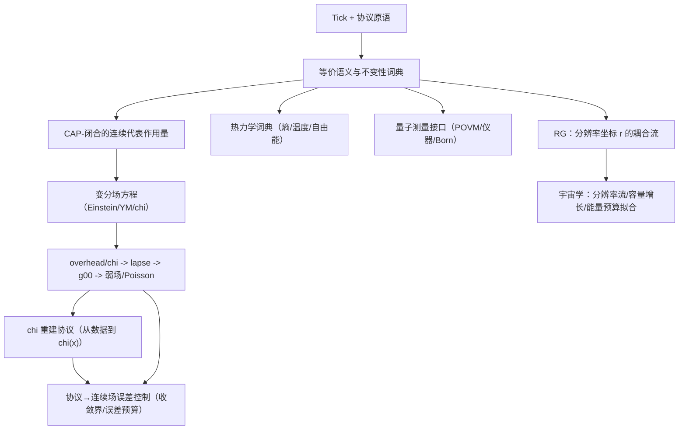

# z128 理论闭合追踪（Tick+CAP，自包含）

本文件用于追踪 `docs/papers/2025_z128_standard_model_stable_sector_hpa_omega` 内部的“理论闭合”进度：哪些概念已在 **数学层（Tick+CAP）** 与 **物理层（可操作定义/接口）** 之间完成一致的对应，哪些仍处于部分闭合或待闭合状态。

## 使用约定

- **闭合状态（建议维护）**
  - `[x]`：已闭合（给出定义/闭合输出 + 关键方程/命题 + 指向明确位置）
  - `[~]`：部分闭合（定义明确但推导/审计/匹配仍缺）
  - `[ ]`：待闭合（缺定义或缺闭合输出/接口）
- **四层一致性（建议每项都标注）**
  - **Iface**：可操作/接口层（实验/协议可观测）
  - **CAP**：在有限候选族上的 CAP 闭合（选择/最小化/词典）
  - **Math**：数学层推导（不变性/定理/变分）
  - **Audit/Prot**：审计/复现实验/数据协议

## 跨论文模板对齐清单（Phase 0）

本节记录在进行结构重排/术语对齐时应优先参考的“模板文件”，用于确保层纪律与符号写法与仓库内其它论文一致；它不引入额外公理，也不改变 z128 的最小输入集（tick + CAP）。

- **层纪律与 not used in proofs 写法**
  - `docs/papers/2025_motive_at_infinity_holographic_scanning_principle/sections/02_audit_layers.tex`
  - `docs/papers/2025_stairway_to_infinity_holographic_renormalization_flow/sections/02_layers_axioms.tex`
  - `docs/papers/2025_ramanujan_holographic_scanning_principle_hpa_omega/sections/02_layers_axioms.tex`
- **Wish / Motive 的定义与目标函数模板**
  - `docs/papers/2025_protocol_stable_period_data_computational_teleology/sections/03_wish_protocol_stable_period_data.tex`
  - `docs/papers/2025_protocol_stable_period_data_computational_teleology/sections/05_selection_principle.tex`
  - `docs/papers/2025_protocol_stable_period_data_computational_teleology/sections/06_variational_dynamics.tex`
  - `docs/papers/2025_motive_at_infinity_holographic_scanning_principle/sections/03_periods_motives_wishes.tex`
  - `docs/papers/2025_motive_at_infinity_holographic_scanning_principle/sections/07_selection_principle.tex`
- **$\varphi$-$\pi$-$\mathrm{e}$ 折叠总论与极点障碍模板**
  - `docs/papers/2025_resolution_folding_phi_pi_e_hpa_omega/sections/06_resolution_folding_map.tex`
  - `docs/papers/2025_resolution_folding_phi_pi_e_hpa_omega/sections/04_pi_constraint_discrete_monodromy.tex`
  - `docs/papers/2025_resolution_folding_phi_pi_e_hpa_omega/sections/05_e_constraint_abel_zeta_pole_barrier.tex`
- **Abel / finite part / trace-formula 刚性模板（用于 e-通道与解析稳定的统一口径）**
  - `docs/papers/2025_holographic_hilbert_universe_hpa_omega/sections/appendices/03_abel_finite_part_notes.tex`
  - `docs/papers/2025_riemann_ground_state_hpa_omega/sections/appendices/03_orbit_calculus_abel_fp.tex`
  - `docs/papers/2025_riemann_ground_state_hpa_omega/sections/05_trace_formula_rigidity.tex`
  - `docs/papers/2025_holographic_hilbert_universe_hpa_omega/sections/09_trace_formula_rigidity.tex`

## 闭合依赖图（模块级）

说明：上图是**依赖关系**而非叙事顺序；叙事可从 `B`（等价语义+频率优先词典）开始，也可从 `A`（协议/读出）开始。

## 已引入的“自包含闭合模块”（Part F 主文 + 附录）

- [x] **时间箭头（指数半群/Abel-first）**：`Part F.0`  
  - 位置：`sections/F_00_arrow_of_time_semigroup.tex`（`\label{app:arrow_of_time_semigroup_notes}`）
  - 要点：指数半群骨架、遗忘常数、与 Abel-first/pole-barrier 语言对齐；作为后续单调性与不可逆证书的最小数学核。
- [x] **等价语义与频率优先词典**：`Part F.1`  
  - 位置：`sections/F_10_equivalence_semantics.tex`（`\label{app:equivalence_semantics}`）
  - 要点：物理对象=等价类；物理量=不变泛函；频率作为优先派生量；力/曲率/熵等作为不变性或闭合输出。
- [x] **CAP-闭合连续代表作用量**：`Part F.2`  
  - 位置：`sections/F_20_cap_continuum_action_closure.tex`（`\label{app:cap_continuum_action_closure}`）
  - 要点：在有限候选族上闭合局域协变不变量项，输出最小骨架 `S_eff`。
- [x] **变分场方程（Einstein/YM/chi）**：`Part F.2`  
  - 位置：`sections/F_21_variational_field_equations.tex`（`\label{app:variational_field_equations}`）
  - 要点：由 `S_eff` 推出场方程、守恒与弱场模板。
- [x] **热力学（从等价/粗粒化到熵/温度/自由能）**：`appendix 27`  
  - 位置：`sections/appendices/27_thermodynamics_from_equivalence.tex`（`\label{app:thermodynamics_from_equivalence}`）
  - 要点：熵=计数；温度=频率共轭尺度；CAP=自由能原则；三定律；熵力与引力词典对齐。
- [x] **overhead/chi -> 引力闭合链**：`Part F.4`  
  - 位置：`sections/F_40_overhead_to_gravity_closure.tex`（`\label{app:overhead_to_gravity_closure}`）
  - 要点：$\kappa \to \chi \to N \to g_{00} \to \Phi$；弱场下 $\rho_{\mathrm{eff}} \propto -\Delta \chi$；$\gamma$ 拟合模板。
- [x] **chi 重建协议**：`Part F.4`  
  - 位置：`sections/F_41_chi_reconstruction_protocol.tex`（`\label{app:chi_reconstruction_protocol}`）
  - 要点：Hilbert 分箱→窗口词→折叠统计→$\chi(x)$ 重建→测试与拟合。
- [x] **协议层→连续场误差控制**：`appendix 33`  
  - 位置：`sections/appendices/33_protocol_to_continuum_error_control.tex`（`\label{app:protocol_to_continuum_error_control}`）
  - 要点：误差度量与分解；集中界→log 误差传播；差分算子截断误差与噪声放大；$\gamma$ 的 WLS 方差与 $\rho_{\mathrm{eff}}/\Phi$ 的误差预算。
- [x] **量子测量与 Born 闭合**：`appendix 30`  
  - 位置：`sections/appendices/30_quantum_measurement_born.tex`（`\label{app:quantum_measurement_born}`）
  - 要点：POVM/仪器；Born 规则两条闭合路线（计数模板与 Gleason–Busch 唯一性）。
- [x] **RG：分辨率坐标 r 的耦合流**：`appendix 31`  
  - 位置：`sections/appendices/31_running_couplings_resolution_flow.tex`（`\label{app:running_couplings_resolution_flow}`）
  - 要点：$\mu(r)=\mu_0\varphi^r$ 与链式法则；QED/QCD 一环；阈值匹配的离散解释。
- [x] **宇宙学：分辨率流与能量预算接口**：`appendix 32`  
  - 位置：`sections/appendices/32_cosmology_resolution_flow.tex`（`\label{app:cosmology_resolution_flow}`，`\label{ass:occupancy_energy_z128}`）
  - 要点：big bang 作为分辨率初始化；inflation=稳定容量增长；隐藏/稳定份额；能量预算部分以显式接口假设（占据计数）给出，使用 Planck-2018 的 $\Omega_{\mathrm{b},0}$ 作为紧凑目标，并提供可复现拟合脚本与图；脚本同时生成 summary/stability 片段用于审计与敏感性口径统一。
- [x] **散射时间延迟的统一闭合（相位/频率/WS/红移/GR 参考）**：`appendix 34`  
  - 位置：`sections/appendices/34_unified_delay_closure.tex`（`\label{app:time_mass_delay}`，`\label{app:time_mass_delay_reference}`）
  - 要点：相位-频率-延迟统一接口；Wigner--Smith 延迟（含 trace/logdet 与校准/损耗处理）；delay→$\kappa$→lapse→redshift/Shapiro 的一致词典；相移/截面与时延同源的接口注记。

## 概念级闭合矩阵（频率优先）

下表只做“定位与状态”追踪；具体定义/公式以对应附录/章节为准。

| 概念/物理量 | 数学对象/闭合输出（概要） | 主依赖 | 位置（LaTeX label） | 状态 |
|---|---|---|---|---|
| 时间（time） | tick 差分 $\Delta t$ | Iface/Math | `sec:tick_calculus`（主文） | [x] |
| 相位/频率（phase/frequency） | $\omega=\Delta\theta/\Delta t$ 等价定义族 | Iface/Math | `def:frequency_from_phase`, `rem:frequency_alt_definitions` | [x] |
| 等价语义（objects/observables） | 物理对象=等价类；可观测=不变泛函 | Math | `subsec:equivalence_physical_objects`, `subsec:equivalence_relations_minimal` | [x] |
| 曲率（curvature） | 回路/holonomy 的不变响应 | Math | `subsec:curvature_as_loops` | [x] |
| 力（force） | 响应/梯度/变分（不变性下） | Math/CAP | `subsec:force_as_response` | [x] |
| 连续代表作用量 $S_{\mathrm{eff}}$ | CAP 在候选族中选最小骨架 | CAP/Math | `prop:cap_minimal_action_skeleton` | [x] |
| Einstein 方程 | $G_{\mu\nu}=8\pi G\,T^{\mathrm{tot}}_{\mu\nu}$ | Math | `thm:einstein_equation_total_stress` | [x] |
| Yang–Mills 方程 | $D_\mu F^{\mu\nu}=J^\nu$（模板） | Math | `prop:ym_equation` | [x] |
| $\chi$ 方程 | 标量/信息项的 EOM（模板） | Math | `prop:chi_eom` | [x] |
| 守恒/红移 | $\nabla_\mu T^{\mu\nu}_{\mathrm{tot}}=0$ + 频率词典 | Math/Iface | `eq:total_stress_conservation`, `subsec:conservation_redshift` | [x] |
| 弱场 Poisson | $\Delta\Phi \propto \rho_{\mathrm{eff}}$ | Math | `subsec:weak_field_poisson`, `subsec:z128_poisson_template` | [x] |
| overhead→引力 | $\chi\to N\to g_{00}\to\Phi$ | CAP/Math/Iface | `app:overhead_to_gravity_closure` | [x] |
| $\rho_{\mathrm{eff}}$ | $\rho_{\mathrm{eff}}\propto-\Delta\chi$ | Math/Iface | `eq:z128_rho_eff_from_chi` | [x] |
| 误差控制（协议→连续场） | 误差分解 + 收敛/稳定性界 + 误差传播预算 | Iface/Math/Audit/Prot | `app:protocol_to_continuum_error_control` | [x] |
| 熵（entropy） | 粗粒化计数/通道容量 | Math/CAP | `eq:counting_entropy` | [x] |
| 温度（temperature） | 频率共轭尺度 | Iface/Math | `def:temperature_conjugate` | [x] |
| CAP 自由能原则 | 以自由能形式重述 CAP 选择 | CAP | `prop:cap_free_energy_closure` | [x] |
| Born 概率 | $P_k=\mathrm{Tr}(\rho E_k)$ | Iface/Math | `eq:z128_born_povm` | [x] |
| RG 运行 | $\mathrm{d}g/\mathrm{d}r=(\log\varphi)\beta(g)$ | Math | `eq:rg_in_r` | [x] |
| 稳定扇区计数（grammar/counts） | $X_m\subset\Omega_m$；$|X_m|=F_{m+2}$ | Math | `lem:xm_fib` | [x] |
| $\pi$-split（$18\oplus 3$） | $X_m=X_m^{\mathrm{cyc}}\sqcup X_m^{\mathrm{bdry}}$；$m=6$ 时 $21=18\oplus 3$ | Math | `prop:cyc_bdry_size`, `prop:cyc_bdry_6` | [x] |
| Fold 映射（离散折叠） | $\mathrm{Fold}_m:\{0,\dots,2^m-1\}\twoheadrightarrow X_m$；退化度统计/全表 | Math/Audit/Prot | `prop:foldm_surjective`, `thm:fold6_stats`, `app:fold6_full_table` | [x] |
| Hilbert 手性指标（chirality index） | $\chi$ 的反射/反向翻转律（符号律） | Math/Audit/Prot | `prop:chi_flip` | [x] |
| 规范补偿（gauge as compensation） | 纤维非平凡 $\Rightarrow$ 需要 transport；局部重标记 $\Rightarrow$ gauge 冗余 | Iface | `prop:gauge_compensation` | [x] |
| 三因子 gauge 闭合（条件性） | 在显式候选族内 CAP 最小闭合 $U(1)\times SU(2)\times SU(3)$（up to quotient） | Iface/CAP | `prop:channel_to_gauge` | [~] |
| SM 标号闭合（$21\to$SM labeling） | $\mathcal{L}_{\mathrm{SM}}$ 的唯一闭合（给定排序键/语义约定） | Iface/CAP/Math | `sec:sm_labeling_closure`, `thm:labeling_unique` | [x] |
| Higgs/标量扇区（uplift 依赖） | $21$ 稳定类型不包含 Higgs；标量作为 uplift/coarse-graining 依赖的接口闭合/审计 | Iface/CAP/Audit | `rem:higgs_not_in_21`, `app:scalar_interface_audits` | [~] |
| 质量谱/深度刚性（mass-depth rigidity） | 有界整数 ansatz 下系数 $(2,5,1)$ 的刚性闭合 | CAP/Audit | `sec:mass_spectrum_closure`, `prop:rhat_rigidity` | [x] |
| 耦合/CP/混合闭合（rigidity targets） | 规范化词典与有界复杂度闭合（含审计表） | Iface/CAP/Match/Audit | `sec:couplings_cp`, `sec:pmns_neutrino_closure` | [x] |
| 分辨率阶梯标定 | 在有界族内闭合 $r_{\mathrm{step}}=2\pi$（匹配层锚点仅作对比输入） | CAP/Match/Audit | `prop:r_step_2pi` | [x] |
| 宇宙学接口 | 分辨率初始化/容量增长/能量预算拟合 | Iface/CAP | `app:cosmology_resolution_flow`, `ass:occupancy_energy_z128` | [x] |

## “待闭合/高风险”清单（建议后续继续追踪）

- [x] **从协议层到连续场的误差控制**：离散→连续代表的收敛界/稳定性与误差预算（见 `sections/appendices/33_protocol_to_continuum_error_control.tex`，`\label{app:protocol_to_continuum_error_control}`）。
- [x] **散射时间延迟的统一闭合**：已在 `appendix 34` 统一为单一接口模块（`app:time_mass_delay` / `app:time_mass_delay_reference`），把“相位延迟/频率红移/散射相移”与 delay→lapse→GR 参考的匹配层词典集中闭合。
- [x] **$\gamma$ 的跨观测一致性**：旋转曲线/透镜/时间延迟/红移的联合拟合与一致性检验（含数据协议与脚本/表格/图）。
  - 位置（接口附录）：`sections/appendices/35_gamma_cross_observation_consistency.tex`（`\label{app:gamma_crossobs_consistency}`）
  - 生成脚本：`scripts/exp_gamma_cross_observation.py`（已接入 `scripts/run_all.py`）
  - 数据协议/小体量数据：`data/gamma_crossobs/`（`solar_system/`, `sparc/`, `strong_lensing/`, `weak_lensing/`）
  - 生成物：
    - `sections/generated/gamma_crossobs_rows.tex`
    - `sections/generated/gamma_crossobs_stability_rows.tex`
    - `sections/generated/gamma_crossobs_diagnostics.tex`
    - `figures/gamma_crossobs_consistency.png`
- [x] **宇宙学能量预算拟合的可复现脚本**：生成器 `scripts/exp_cosmology_energy_budget_fit.py`（已接入 `scripts/run_all.py`）
  - 入口：`sections/appendices/32_cosmology_resolution_flow.tex`（`app:cosmology_resolution_flow` / `ass:occupancy_energy_z128`，图 `fig:cosmology_energy_budget_fit`）
  - 生成物：
    - `sections/generated/cosmology_energy_budget_fit_equation.tex`
    - `sections/generated/cosmology_energy_budget_fit_summary.tex`
    - `sections/generated/cosmology_energy_budget_fit_stability.tex`
    - `figures/cosmology_energy_budget_fit.png`
- [~] **宇宙学能量预算的占据假设（Iface）**：`Assumption~\ref{ass:occupancy_energy_z128}` 将“能量份额”与读出微态集合的长期占据率做比例对应；该假设已被显式标注为接口假设并给出可证伪路径，但不属于 tick+CAP 的数学闭合输出（见 `app:cosmology_resolution_flow` / `subsec:cosmo_energy_budget_fit`）。

- [x] **有限连接 transport rule 的反事实稳定性（look-elsewhere 审计）**：padding/truncation/tie-break 的有界反事实族对 gauge-invariant holonomy cycle-type 统计的影响包络（TV 距离、3/4-cycle 分数、边代价分位）。
  - 位置（补充附录）：`sections/appendices/15_holonomy_sweeps_extended.tex`（`subsec:holonomy_transport_rule_sensitivity`，表 `tab:holonomy_transport_rule_sensitivity`）
  - 生成脚本：`scripts/exp_holonomy_transport_rule_sensitivity.py`（已接入 `scripts/run_all.py`）
  - 生成物：`sections/generated/holonomy_transport_rule_sensitivity_rows.tex`

- [ ] **（OP1）超出候选族的规范群唯一性**：当前仅在显式有界候选族（紧致/三因子可交换分解/复杂度标签）内由 CAP 闭合（`prop:channel_to_gauge`）；候选族本身的第一性导出或无家族唯一性仍未闭合。入口：`subsec:ledger_open_problems`，讨论：`subsec:open_problems_audit_tagged`（`sec:limitations_related_work`）。
- [ ] **（OP2）Fold 家族的唯一性/不可避免性（或 universality）**：已在有界反事实族内给出部分选择（`app:fold_family_sensitivity`；`prop:value_consistency_selects_foldz` / `prop:value_consistency_forbids_shift`），但全局唯一性与“桥不敏感”的操作性 universality 仍未闭合。入口：`subsec:ledger_open_problems`，讨论：`subsec:open_problems_audit_tagged`。
- [ ] **（OP3）有限连接的连续极限：Yang--Mills/EFT 涌现**：已闭合有限 connection/holonomy 诊断（`sec:protocol_connections_holonomy`），但从有限骨架推出连续 YM 作用量/动力学与低能参数稳定性仍未闭合。入口：`subsec:ledger_open_problems`，讨论：`subsec:open_problems_audit_tagged`。
- [ ] **（OP4）跨家族的全局模型选择（look-elsewhere）**：当前提供“家族内”审计（域大小/gap/反事实/量化表格，见 `app:generated_tables`），但比较不同候选家族的全局 prior/MDL 量化原则仍未闭合。入口：`subsec:ledger_open_problems`，讨论：`subsec:open_problems_audit_tagged`。
- [ ] **（OP5）标量/Yukawa 与 RG running 的闭合**：标量在本论文中作为 uplift/coarse-graining 依赖接口处理（`app:scalar_interface_audits`；并明确 $21$ 类型不含 Higgs：`rem:higgs_not_in_21`），但从有限协议导出 Yukawa 结构与 SM $\beta$-函数仍未闭合。入口：`subsec:ledger_open_problems`，讨论：`subsec:open_problems_audit_tagged`。

## 快速入口（给维护者）

- **“概念→定义/闭合输出”总入口**：`tab:concept_index`（`app:equivalence_semantics` 内）
- **“推导脊柱（Tick+CAP）”入口**：`sections/appendices/19_tick_cap_derivation.tex`
- **“推断账本（哪些是 Iface/CAP/Math）”入口**：`sections/appendices/11_inference_ledger.tex`
- **“外部 matching 输入清单”入口**：`subsec:external_inputs_inventory` / `tab:external_inputs_inventory`（位于 `sections/appendices/11_inference_ledger.tex`）
- **“Open problems 清单”入口**：`subsec:ledger_open_problems`（并在 `sec:limitations_related_work` 的 `subsec:open_problems_audit_tagged` 提供更详细讨论）
- **“协议→连续场误差控制”入口**：`sections/appendices/33_protocol_to_continuum_error_control.tex`

