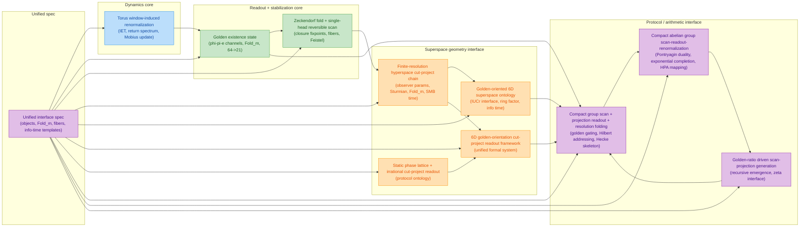

### `auric-golden-phi` 论文集总览

本目录汇集一组围绕“黄金分支（$\varphi$）驱动的扫描—投影读出—稳定化—重整化”主题的可审计论文工程。共同关注点是：在**有限分辨率观测**下，如何把连续/高维本体（紧群平移、环面旋转、超空间 cut-and-project）通过**二值符号化（Sturmian）**与**规范形稳定化（Zeckendorf / golden-mean 语言、`Fold_m`）**压缩为可计算、可验证的离散不变量（计数、退化谱、熵率、闭包/固定点结构等）。

---

### 快速开始（编译与产物）

每篇论文目录均为独立 LaTeX 工程，入口为 `main.tex`（`ctexart` + `xelatex`）。

```bash
cd docs/papers/auric-golden-phi/<paper_dir>
latexmk -xelatex -interaction=nonstopmode -halt-on-error main.tex
```

输出 `main.pdf`（若未被版本控制跟踪，则本地编译生成）。

---

### 论文清单（按目录）

- **`2026_auric_golden_phi_unified_interface_spec/`**
  - **标题**：The Omega / Auric-Golden-$\varphi$ 论文集统一接口规范（总论）
  - **要点**：抽象并固定跨论文共用接口（读出、`Fold_m` 稳定化、纤维、信息论时间、cut-and-project/诱导重整化端口），并标注每篇论文的实例化位置。

- **`2026_torus_translation_window_induced_renormalization_return_spectrum_quadratic_irrational_reflector_exchange/`**
  - **标题**：环面平移的窗口诱导重整化：返回时间谱、二次无理数周期点与反射子交换框架
  - **要点**：从一维无理旋转区间诱导的“两/三值返回时间谱”出发，给出 Möbius 更新、二次无理数周期重整化与高维闭包维数公式，并提出反射子—诱导交换模板。

- **`2026_golden_existence_state_phi_pi_e_stable_channels_scan_projection_readout_computable_model/`**
  - **标题**：黄金存在态与 $\varphi$–$\pi$–$e$ 稳定通道：扫描–投影读出框架下的可计算模型
  - **要点**：把“存在/不存在”表述为稳定投影条件化，并用 golden-mean 语法（无相邻 11）与 Zeckendorf 折叠给出可复核压缩。
  
  $$
  64\to 21.
  $$

- **`2026_finite_resolution_hyperspace_cut_project_sturmian_binary_readout_zeckendorf_stabilization_auditable_chain/`**
  - **标题**：有限分辨率观测下的超空间切投影、Sturmian 二值读出与 Zeckendorf 稳定化：一条可审计的统一推理链
  - **要点**：将六维 cut-and-project、本体/观察者参数、环旋转因子、Sturmian 读出、Zeckendorf 稳定化与 SMB 熵率时间箭头串成闭合推理链。

- **`2026_zeckendorf_fold_observation_kernel_single_head_reversible_scan_fixed_point_semantics_golden_visibility_model_deep_revision/`**
  - **标题**：Zeckendorf 折叠观测核与单头可逆扫描：基于固定点语义的黄金态可见现实模型（深度修订稿）
  - **要点**：构造“可逆本体—不可逆观测”的最小离散模型：`Fold_m`/纤维/闭包固定点 + Feistel 单头扫描置换，并对 $m=6$ 给出退化谱与数值协议。

- **`2026_golden_oriented_six_dim_superspace_ontology_fiberized_readout_ring_factor_symbolization_zeckendorf_normal_form_information_theoretic_time/`**
  - **标题**：黄金取向的六维超空间周期本体与纤维化读出：环因子符号化、Zeckendorf 规范形与信息论时间
  - **要点**：将 IUCr 超空间词典与 6D 周期密度/接受域/原子面条目对接到环因子符号化与 Zeckendorf 稳定化，并用 KS/SMB 给出信息论时间定义。

- **`2026_six_dimensional_golden_orientation_cut_project_readout_framework/`**
  - **标题**：六维黄金取向切—投影读出框架——从超晶格模型集、符号稳定化到信息论时间纤维的统一形式体系
  - **要点**：以 6D 超晶格与黄金取向作为几何生成原语，系统化组织 cut-project、Sturmian/Fibonacci、`Fold_m` 与“时间纤维/熵率”定义及可证伪指纹。

- **`2026_static_phase_lattice_irrational_cut_project_finite_resolution_readout/`**
  - **标题**：六维静态相位格的无理切投影与有限分辨率读出：一种将空间表象、时间序列与物质稳定性统一为信息投影的形式化框架
  - **要点**：把“静态本体 + 读出协议”作为第一性原理：切投影/扫描读出/稳定扇区折叠，并讨论自指观测闭环与光锥边界读出接口。

- **`2026_golden_ratio_driven_scan_projection_generation_recursive_emergence/`**
  - **标题**：黄金比例驱动的扫描—投影生成：由群作用与统计稳定性递归涌现的算术与概念层级
  - **要点**：将“概念/地址/可定义性”写成递归读出机制，给出 Fibonacci/Zeckendorf 折叠、稳定地址空间上的算术构造与 $\zeta$ 型统一接口。

- **`2026_compact_group_scan_projection_readout_resolution_folding/`**
  - **标题**：紧群扫描—投影读出与分辨率折叠：从概念可定义性到黄金门控、Hilbert 编址与素数骨架的统一框架
  - **要点**：引入三值存在逻辑与 Weyl 对扫描，构造黄金门控与分辨率折叠，并把“计算—几何字典/Hecke 骨架”作为可审计接口。
  
  $$
  2^m\to F_{m+2}.
  $$

- **`2026_compact_abelian_group_scan_readout_renormalization_exponential_completion_hpa/`**
  - **标题**：紧阿贝尔群上的扫描—读出—重整化统一框架：黄金参数、符号动力学与指数完备化（与 HPA 的协议层对应）
  - **要点**：在紧阿贝尔群/环面平移上统一模 $L$ 共轭、多维等分布退化、Sturmian/Fibonacci 重整化、Pontryagin 对偶可观测，并解释常数 $e$ 的“指数完备化”角色。

---

### 主题谱系（如何阅读更省力）

- **从动力系统到符号/重整化**：先读 `2026_torus_translation_window_induced_renormalization_.../`（返回时间谱、Möbius 更新、黄金不动点），再看各篇如何把该结构嵌入“读出协议”。
- **从读出协议到可计算稳定化**：读 `2026_golden_existence_state_.../`（`X_m`、`Fold_m`、$\varphi$–$\pi$–$e$ 通道），再读 `2026_zeckendorf_fold_observation_kernel_.../`（闭包固定点 + 可逆微观置换）。
- **从几何超空间到纤维化读出**：读 `2026_finite_resolution_hyperspace_cut_project_.../` 或 `2026_golden_oriented_six_dim_superspace_.../`，把 cut-and-project / 接受域 / 原子面与“环因子 + 符号化 + 纤维”对齐。
- **从总框架到算术接口**：读 `2026_compact_group_scan_projection_readout_resolution_folding/` 与 `2026_compact_abelian_group_scan_readout_renormalization_exponential_completion_hpa/`，看“差异度证书 / Hecke 骨架 / $\zeta$ 生成函数”等审计点如何接入。

---

### 关系图（论文之间的依赖/对齐）



### 统一记号（跨论文复用频繁）

- **`X_m` / `X_m^{\mathrm Z}`**：长度 $m$ 的黄金均值合法语言（禁止子串 `11`），其计数为
  
  $$
  |X_m|=F_{m+2}.
  $$

- **`Fold_m`**：将原始有限分辨率读出（窗口词或整数标签）规范化到 `X_m` 的稳定化核；其**预像纤维**用于对象化“不可见自由度/时间纤维”：
  
  $$
  \mathcal{F}_m(x)=\mathrm{Fold}_m^{-1}(x).
  $$

- **信息论时间**：在生成分割条件下，柱集后验测度的指数收缩率由 SMB 定理给出并等于 KS 熵率。

