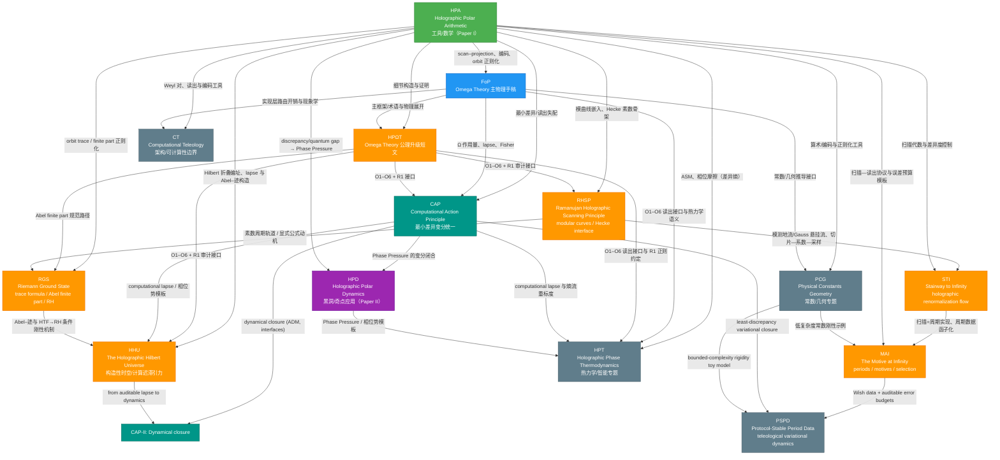

## `docs/papers` 论文索引与关系图

本目录包含多篇相互关联的手稿（均以 `main.tex` 作为入口）。它们共享一条核心机制链：**unitary scan（幺正扫描）→ projection/readout（有限分辨率投影读出）→ canonical coding（Ostrowski/Zeckendorf 等规范编码）→ mismatch/discrepancy（读出失配）→ regulated-to-continuum（orbit trace/finite part 正则化）**，并在不同层级上展开（工具/公理/主物理/变分统一/应用/专题）。

### 论文总览

| 目录 | 论文名（title） | PDF | TeX | 定位 | 主要依赖 |
|---|---|---|---|---|---|
| `2025_holographic_polar_arithmetic/` | Holographic Polar Arithmetic: Multiplicative Ontology, Unitary Scanning, and the Geometric Origin of Quantum Uncertainty (HPA) | [`main.pdf`](./2025_holographic_polar_arithmetic/main.pdf) | [`main.tex`](./2025_holographic_polar_arithmetic/main.tex) | **工具/数学论文（Paper I）**：scan–projection、Sturmian/Fibonacci、Ostrowski/Zeckendorf、orbit 正则化 | — |
| `2025_foundations_of_physics_submission/` | Omega Theory: Axiomatic Foundations of Holographic Spacetime and Interactive Evolution (FoP) | [`main.pdf`](./2025_foundations_of_physics_submission/main.pdf) | [`main.tex`](./2025_foundations_of_physics_submission/main.tex) | **主物理手稿**：全局静态态 + 有限信息/全息映射 + QCA/准晶 + 现象学/宇宙学模板 | HPA（O5/O6 等工具链） |
| `2025_holographic_polar_omega_theory/` | Holographic Polar Omega Theory: An Axiomatic Upgrade and the Continuous--Discrete Bridge (HPΩT) | [`main.pdf`](./2025_holographic_polar_omega_theory/main.pdf) | [`main.tex`](./2025_holographic_polar_omega_theory/main.tex) | **短文/公理接口**：抽取并固定 O1–O6 + R1 的最短推论链 | HPA + FoP |
| `2025_holographic_hilbert_universe_hpa_omega/` | The Holographic Hilbert Universe: Constructive Spacetime, Computational-Lapse Gravity, and a Conditional Riemann Critical-Line Rigidity Theorem in HPA--Ω (HHU) | [`main.pdf`](./2025_holographic_hilbert_universe_hpa_omega/main.pdf) | [`main.tex`](./2025_holographic_hilbert_universe_hpa_omega/main.tex) | **综合/构造性时空篇**：Hilbert 折叠编址 → 路由开销 lapse 引力 → Abel 有限部 →（HTF 下）RH 条件刚性 | HPA + HPΩT + CAP + RGS |
| `2025_resolution_folding_phi_pi_e_hpa_omega/` | Resolution Folding under φ–π–e Triple-Operator Constraints: A Zeckendorf–Hilbert–Abel Framework for the 64→21 Projection and Recursive Uplift | [`main.pdf`](./2025_resolution_folding_phi_pi_e_hpa_omega/main.pdf) | [`main.tex`](./2025_resolution_folding_phi_pi_e_hpa_omega/main.tex) | **纯数学/符号动力学—拓扑—复分析接口篇**：Zeckendorf 过滤（21）、循环闭合分裂（18+3）、Abel–ζ 极点屏障、Hilbert address family；含可复现实验脚本 | HHU（Hilbert 折叠）+ HPA（Zeckendorf shift） |
| `2025_z128_standard_model_stable_sector_hpa_omega/` | A Standard Model of Stable Sectors for $\ZZ_{128}$ Scanning Readout: $\varphi$--$\pi$--$\e$ Resolution Folding, Hilbert-Chiral Addressing, and Antimatter Duality | — | [`main.tex`](./2025_z128_standard_model_stable_sector_hpa_omega/main.tex) | **粒子物理接口篇**：在 $64\to 21$ 与 $18\oplus 3$ 的可证核心上，给出可复现的 **21→SM 场层标注**、**质量谱（含 W/Z/H）**，并提供 **20 轮有界复杂度刚性搜索** 与 **审计通过/失败汇总表** | RF + HHU + CAP + PCG |
| `2025_ramanujan_holographic_scanning_principle_hpa_omega/` | Ramanujan Holographic Scanning Principle: Modular Curves, Hecke Dynamics, and an Arithmetic Constitution for HPA--Ω (RHSP) | [`main.pdf`](./2025_ramanujan_holographic_scanning_principle_hpa_omega/main.pdf) | [`main.tex`](./2025_ramanujan_holographic_scanning_principle_hpa_omega/main.tex) | **算术几何接口篇**：模曲线/Hecke 为 scan–projection 提供母体与素数骨架；附可复现实验（Fibonacci/Sturmian、τ(n)、j 不变量） | HPA + HPΩT |
| `2025_riemann_ground_state_hpa_omega/` | Riemann Ground State: Holographic Trace Formulas, Abel Finite Parts, and a Protocol Derivation of the Riemann Hypothesis in HPA--Omega (RGS) | [`main.pdf`](./2025_riemann_ground_state_hpa_omega/main.pdf) | [`main.tex`](./2025_riemann_ground_state_hpa_omega/main.tex) | **专题篇（RH / trace）**：把显式公式协议化为 Abel–迹，并在 Ω+HTF 下给出 RH 的协议推论；附可复现数值实验（差异度稳定与阈值爆炸） | HPA + HPΩT（+ RHSP） |
| `2025_stairway_to_infinity_holographic_renormalization_flow/` | The Stairway to Infinity: A Holographic Renormalization Flow from Noncommutative Scanning to the Langlands Program (STI) | [`main.pdf`](./2025_stairway_to_infinity_holographic_renormalization_flow/main.pdf) | [`main.tex`](./2025_stairway_to_infinity_holographic_renormalization_flow/main.tex) | **攀登/重整化流篇**：把“向上抽象”形式化为模曲面测地流/Gauss 悬挂流；给出切片—系数—采样与差异度/Ostrowski 的有限 $N$ 误差界；以 $S$-反演 + Morita/傅里叶交换作为尺度互换模板，并给出朗兰兹函子化任务 | RHSP + HPA |
| `2025_motive_at_infinity_holographic_scanning_principle/` | The Motive at Infinity: Functorialization of the Holographic Scanning Principle, Period Realizations, and a Selection Principle (MAI) | [`main.pdf`](./2025_motive_at_infinity_holographic_scanning_principle/main.pdf) | [`main.tex`](./2025_motive_at_infinity_holographic_scanning_principle/main.tex) | **周期/动机升维篇**：在不破坏 Layer 0/1 审计纪律下把扫描协议函子化到 KZ 周期数据；证明“扫描平均=周期积分”；给出可审计误差预算与可复现实验，并提出有限资源下的选择原则 | STI + HPA（+ PCG 的常数刚性示例） |
| `2025_protocol_stable_period_data_computational_teleology/` | Protocol-Stable Period Data in Computational Teleology: From Holographic Scanning Protocols to Variational Dynamics of Minimal Computational Discrepancy and Constant Selection (PSPD) | [`main.pdf`](./2025_protocol_stable_period_data_computational_teleology/main.pdf) | [`main.tex`](./2025_protocol_stable_period_data_computational_teleology/main.tex) | **专题篇（Wish/period + 变分动力学）**：协议稳定周期数据（Wish）、差异度×变差的有限资源证书、协议空间的带阻尼惯性梯度流、以及常数刚性/唯一性间隙玩具模型 | MAI + CAP（+ PCG） |
| `2025_computational_action_principle_hpa_omega/` | Computational Action Principle: Least-Discrepancy Dynamics and Field Unification in HPA--Ω (CAP) | [`main.pdf`](./2025_computational_action_principle_hpa_omega/main.pdf) | [`main.tex`](./2025_computational_action_principle_hpa_omega/main.tex) | **变分统一篇（CAP）**：最小差异原理 → Ω 作用量（Fisher + 路由开销）→ GR+信息应力；规范/物质为相位误差补偿与拓扑缺陷 | HPA + FoP + HPΩT |
| `2025_computational_action_principle_ii_dynamics_hpa_omega/` | Computational Action Principle II: Dynamical Einstein Gravity and Quantum Interfaces from Routing Overhead in HPA--Ω (CAP-II) | [`main.pdf`](./2025_computational_action_principle_ii_dynamics_hpa_omega/main.pdf) | [`main.tex`](./2025_computational_action_principle_ii_dynamics_hpa_omega/main.tex) | **变分统一续篇（CAP-II）**：从路由开销 lapse 的审计量出发，给出 ADM 动力学闭合与量子/散射校准接口 | CAP + HHU + HPA + HPΩT（+ FoP） |
| `2025_holographic_phase_thermodynamics_hpa_omega/` | Holographic Phase Thermodynamics: Arithmetic Statistical Mechanics, Computational Lapse, and the Geometric Origin of Intelligence in HPA--Ω (HPT) | [`main.pdf`](./2025_holographic_phase_thermodynamics_hpa_omega/main.pdf) | [`main.tex`](./2025_holographic_phase_thermodynamics_hpa_omega/main.tex) | **专题篇（热力学/智能）**：算术统计力学、相位摩擦（差异熵）、计算时延与熵流重标度、智能作为主动纠错相变 | HPA + FoP + HPΩT + CAP（+ HPD 的 Phase Pressure 模板） |
| `2025_holographic_polar_dynamics/` | Holographic Polar Dynamics: Topological Inversion of the Schwarzschild Singularity and the Phase Origin of Gravity (HPD) | [`main.pdf`](./2025_holographic_polar_dynamics/main.pdf) | [`main.tex`](./2025_holographic_polar_dynamics/main.tex) | **应用篇（Paper II）**：把 HPA 的失配/差异度量用于黑洞/奇点与信息悖论模板（Phase Pressure） | HPA（+ CAP 作为统一视角） |
| `2025_physical_constants_geometry_hpa_omega/` | The Geometry of Physical Constants in HPA--Ω: From the Fine-Structure Constant to Particle Spectra and Black-Hole/Cosmological Invariants (PCG) | [`main.pdf`](./2025_physical_constants_geometry_hpa_omega/main.pdf) | [`main.tex`](./2025_physical_constants_geometry_hpa_omega/main.tex) | **专题篇（常数/几何）**：把 HPA–Ω 的几何/信息结构用于常数关系与数值验证 | HPA + FoP |
| `chemistry/2025_geometric_origin_chemical_bond_hpa_omega/` | Geometric Origin of Chemical Bonding in HPA--Ω: Deriving Molecular Stability from the Three-Channel Geometric Impedance α and the Internal Phase Volume μ (Chem) | [`main.pdf`](./chemistry/2025_geometric_origin_chemical_bond_hpa_omega/main.pdf) | [`main.tex`](./chemistry/2025_geometric_origin_chemical_bond_hpa_omega/main.tex) | **专题篇（化学/成键）**：由 α、μ 的几何不变量锁定原子单位与 BO 分离，导出分子稳定与谱学接口 | PCG + HPΩT + HHU + HPT + CAP |
| `biology/2025_biological_computational_teleology_hpa_omega/` | Biological Computational Teleology in HPA--Ω: Life as Predictive Active Error Correction Against Phase Friction (BioCT) | [`main.pdf`](./biology/2025_biological_computational_teleology_hpa_omega/main.pdf) | [`main.tex`](./biology/2025_biological_computational_teleology_hpa_omega/main.tex) | **专题篇（生物/目的论）**：生命=预测性主动纠错相；相位摩擦、几何 Landauer、生存不等式与黄金分支反锁相控制律 | HPT + CT + PSPD |
| `biology/2025_arithmetic_origin_genetic_code_hpa_omega/` | Zeckendorf--Hilbert Folding Characterization of the Genetic Code: Start--Stop Topological Symmetry and Z-Spectrum Analysis Centered on 6-Bit Resolution Folding | [`main.pdf`](./biology/2025_arithmetic_origin_genetic_code_hpa_omega/main.pdf) | [`main.tex`](./biology/2025_arithmetic_origin_genetic_code_hpa_omega/main.tex) | **专题篇（生物/遗传密码反编译）**：将密码子视为 6 位微观态并以 Fold\_6 做 64→21 折叠压缩；在控制集合 \{AUG,UAA,UAG,UGA\} 的边界命中最大化目标下对 24 种二比特编码穷举反编译，得到唯一最优编码与 14/48 起止边界对称，并给出转录本级 Z‑谱与可复现实验工具链 | RF + BioCT |
| `2025_computational_teleology_hpa_omega/` | Computational Teleology in Holographic Polar Arithmetic: Scan Complexity, Readout Resolution, and an Undecidable Quantum-Cellular Universe (CT) | [`main.pdf`](./2025_computational_teleology_hpa_omega/main.pdf) | [`main.tex`](./2025_computational_teleology_hpa_omega/main.tex) | **专题篇（架构/可计算性）**：复杂性–几何–观测同构、路由开销与计算 lapse、可判定性边界 | HPA + FoP |

说明：若目录内存在 `main.pdf` 则可直接打开；若尚未生成，可按下文编译生成。

### 关系图（依赖/承接）



### 各论文简介（含与其他论文的接口）

### `2025_holographic_polar_arithmetic/`（HPA，Paper I）

- **核心问题**：把“旋转/相位/乘法”作为本体层，解释为什么线性加法与连续合成在离散读出下不可兼得，并把不闭合的残差结构化为可计算对象。
- **核心构件**：
  - **multiplicative skeleton**：从乘法幺半群出发构造极坐标式嵌入。
  - **unitary scan**：以 Koopman 型幺正扫描与窗口投影得到读出序列。
  - **canonical coding**：irrational rotation → Sturmian；黄金分支 → Fibonacci；Ostrowski → Zeckendorf。
  - **orbit calculus / finite part**：orbit trace 与 Abel finite part，作为受控离散到连续极限的固定正规化约定。
- **对其他论文的作用**：
  - 为 FoP 的 O5/O6 提供具体模型与可复用证明/工具。
  - 为 HPD 提供 discrepancy/quantum gap 的数学对象与“可累积失配”的定量语言。
- **入口链接**：[`main.pdf`](./2025_holographic_polar_arithmetic/main.pdf)、[`main.tex`](./2025_holographic_polar_arithmetic/main.tex)、[`references.bib`](./2025_holographic_polar_arithmetic/references.bib)

### `2025_foundations_of_physics_submission/`（FoP，Omega Theory 主物理手稿）

- **核心问题**：在“无外参时间”的前提下，把宇宙描述为一个静态全局态，并以有限信息/全息映射为约束，构造一个可产生有效时空与动力学的受控微观框架。
- **主要层级**：
  - **公理层（O1–O6）**：静态全局态、有限信息、因果局域、全息映射、scan–projection 读出、Weyl 对。
  - **模型层（M1–M3 等）**：QCA/准晶基底、内部代数结构、golden-spectrum 更新与张量网络全息编码。
  - **现象学层**：信息几何作用量（Omega Action）、常数/色散/噪声模板与宇宙学推论。
- **与其他论文关系**：
  - O5/O6、Sturmian/Zeckendorf tick、orbit 正则化等“连续—离散桥”直接引用/调用 HPA 的工具链。
  - HPΩT 是对 FoP + HPA 的公共公理接口抽取。
- **入口链接**：[`main.pdf`](./2025_foundations_of_physics_submission/main.pdf)、[`main.tex`](./2025_foundations_of_physics_submission/main.tex)、[`references.bib`](./2025_foundations_of_physics_submission/references.bib)

### `2025_holographic_polar_omega_theory/`（HPΩT，公理升级短文）

- **定位**：把 Omega Theory 的连续—离散连接“写成可引用的公理接口”。
- **做了什么**：
  - 保留 O1–O4，明确升级 O5–O6（scan–projection + Weyl pair）与 Convention R1（orbit trace/finite part）。
  - 给出最短推论链：scan–projection → 规范编码（黄金分支 Zeckendorf）→ 不相容性/不确定性来源 → 读出诱导概率（instrument/POVM）→ 正则化约定。
- **与其他论文关系**：
  - 把 HPA（构造/证明）与 FoP（完整物理展开）之间的接口固定下来，便于在后续应用篇引用。
- **入口链接**：[`main.pdf`](./2025_holographic_polar_omega_theory/main.pdf)、[`main.tex`](./2025_holographic_polar_omega_theory/main.tex)、[`references.bib`](./2025_holographic_polar_omega_theory/references.bib)

### `2025_holographic_hilbert_universe_hpa_omega/`（HHU，The Holographic Hilbert Universe）

- **定位**：把 “一维扫描协议如何构造多维空间局域性” 写成可审计的构造链，并将其与计算迟滞（lapse）引力模板与 Abel–迹的（HTF 下）RH 条件刚性统一到同一篇主文中。
- **做了什么**：
  - **Hilbert 折叠公理（H1）**：在每个分辨率层级 $n$ 上用离散 Hilbert 编址把 tick 时间映射到全息屏晶格，令“空间局域性”成为可检验的编址/编译效应。
  - **计算迟滞引力**：以路由开销 $\kappa$ 定义 lapse $\mathcal{N}=\kappa_0/\kappa$，给出红移模板，并以 Poisson 闭合展示近场 $1/r$ 相位势数值验证。
  - **临界线刚性（条件性）**：在 HTF 桥接假设下，用 Abel 单位圆盘内的全纯性排除临界线外零点的内点极点，从而得到 RH 的协议后果定理。
  - **可复现实验脚本**：Hilbert 局部性检查、黄金分支星偏差界、Abel 极点屏障 toy 模型、Poisson 求解与 Wigner--Smith $\kappa(E)$ 接口。
- **与其他论文关系**：
  - 继承 HPΩT 的 O5/O6 + R1 审计接口，并将“空间构造”补足为 Hilbert 折叠这一明确编址机制；
  - 与 CAP/HPD 的 lapse/相位势模板一致，并把其落到可复现脚本层；
  - 与 RGS 在 HTF→RH 条件刚性机制上同构，但本篇把该机制嵌入“构造性时空 + 计算迟滞引力”的统一叙事中。
- **入口链接**：[`main.pdf`](./2025_holographic_hilbert_universe_hpa_omega/main.pdf)、[`main.tex`](./2025_holographic_hilbert_universe_hpa_omega/main.tex)、[`references.bib`](./2025_holographic_hilbert_universe_hpa_omega/references.bib)、[`scripts/`](./2025_holographic_hilbert_universe_hpa_omega/scripts/)

### `2025_ramanujan_holographic_scanning_principle_hpa_omega/`（RHSP，Ramanujan Holographic Scanning Principle）

- **定位**：将 scan–projection（O5/O6）置于模曲线 $X(1)$ 与 Hecke 代数的算术几何母体中，形成可审计的“算术—全息—计算宪法”。
- **做了什么**：
  - **母体几何**：给出 $\mathrm{PSL}_2(\mathbb{Z})$ 基本域、尖点与 $0\sim\infty$ cusp 识别，作为尺度互换的几何模板。
  - **离散接口**：以 cusp 的 $q$-展开作为连续→离散系数接口，并用判别式模形式 $\Delta$ 的 $\tau(n)$ 作为可计算示例。
  - **素数骨架**：澄清 Hecke 算子对所有 $n$ 定义、但由素数生成，并给出素数幂递推与本征形式的稳定谱解释。
  - **规范编码**：continued fraction → Ostrowski；黄金分支 → Zeckendorf（Fibonacci/Sturmian）提供“整数时间—比特读出”接口。
  - **可复现验证**：附纯标准库 Python 代码验证 Fibonacci 词、差异、$\tau(n)$ 递推、以及 $j$-不变量的 $S$-不变性。
- **与其他论文关系**：
  - 继承并引用 HPA 的 scan–projection 与编码工具链，在算术几何层面给出母体与素数骨架。
  - 与 HPΩT 的 O1–O6 + R1 审计接口对齐，便于在 FoP/CAP 等论文中作为算术接口引用。
- **入口链接**：[`main.pdf`](./2025_ramanujan_holographic_scanning_principle_hpa_omega/main.pdf)、[`main.tex`](./2025_ramanujan_holographic_scanning_principle_hpa_omega/main.tex)、[`references.bib`](./2025_ramanujan_holographic_scanning_principle_hpa_omega/references.bib)

### `2025_riemann_ground_state_hpa_omega/`（RGS，Riemann Ground State）

- **定位**：以 HPA–Ω 的 scan–readout 与 Abel finite part 为闭层规范，把 ζ 的显式公式读作“全息迹公式”，并在 Ω + HTF 假设下给出 RH 的协议性推导链。
- **做了什么**：
  - **闭层推导链**：Omega 的 “(0<r<1) Abel–迹全域可定义 + 规范路径有限部存在” 与 HTF 的 “零点指数模态进入谱侧” 组合，给出 Abel 收敛半径障碍并排除 $\Re(\rho)\neq 1/2$。
  - **可复现机制验证**：黄金分支一维星差异度呈对数级稳定；玩具零点模态中引入实部偏移会触发 Abel 阈值与能量爆炸。
- **与其他论文关系**：
  - 直接复用 HPA 的 orbit calculus/finite part 与 HPΩT 的公理接口（O5/O6 + R1）。
  - 与 RHSP 的 “素数=周期轨道” 视角兼容，但本篇闭层证明只依赖 HTF 结构性桥梁。
- **入口链接**：[`main.pdf`](./2025_riemann_ground_state_hpa_omega/main.pdf)、[`main.tex`](./2025_riemann_ground_state_hpa_omega/main.tex)、[`references.bib`](./2025_riemann_ground_state_hpa_omega/references.bib)、[`scripts/`](./2025_riemann_ground_state_hpa_omega/scripts/)

### `2025_stairway_to_infinity_holographic_renormalization_flow/`（STI，The Stairway to Infinity）

- **定位**：把 RHSP 的“静态宪法”推进到“攀登过程”本身：将跨尺度提升严格形式化为模曲面测地流（连续尺度）及其 Gauss 悬挂流/继续分数数字（离散尺度）。
- **做了什么**：
  - **重整化流对象**：以 Series 定理把模测地流与 Gauss 映射连接起来，令屋顶函数提供可计算的尺度时间。
  - **切片—系数—采样**：给出任意高度 $y>0$ 的切片上恢复 $q$-展开系数的投影公式，并把积分替换为扫描轨道采样，得到由星差异与 Ostrowski 数位控制的有限 $N$ 误差界。
  - **尺度互换模板**：把 $S$-反演（端点识别、深浅互换）与非交换环面 Morita 等价/傅里叶交换并列为同一“尺度交换”的严格数学模板。
  - **朗兰兹升级任务**：以函子化方式陈述从扫描协议范畴到自守表示范畴的研究目标。
- **与其他论文关系**：
  - 继承 RHSP 的模曲线/Hecke 素数骨架接口，同时更强调“攀登/跨尺度”的动力学与误差预算。
  - 复用 HPA 的扫描—投影与差异度工具，作为切片采样误差控制的底层模块。
- **入口链接**：[`main.pdf`](./2025_stairway_to_infinity_holographic_renormalization_flow/main.pdf)、[`main.tex`](./2025_stairway_to_infinity_holographic_renormalization_flow/main.tex)、[`references.bib`](./2025_stairway_to_infinity_holographic_renormalization_flow/references.bib)

### `2025_motive_at_infinity_holographic_scanning_principle/`（MAI，The Motive at Infinity）

- **定位**：在不破坏 Layer 0/1 审计纪律下，把“扫描—读出协议”严格锚定为 **Kontsevich–Zagier 周期** 的可计算实现，并在可控子范畴上完成“协议→周期数据”的函子化升级；选择原则以“有限资源下的稳定性—复杂度优化”形式提出（程序性命题，不作为闭合推理前提）。
- **做了什么**：
  - **可控协议子范畴**：定义 `Scan_alg`（Kronecker 扫描 + 有理核读出 + 显式正则/截断规则），把“有限分辨率”与“截断预算”作为协议对象的一部分编码。
  - **函子化升级**：构造全息扫描函子 `HSP: Scan_alg -> PerDatum`，将协议映射到周期数据对象（域 + 有理核 + 正则规则）。
  - **闭合主定理**：在无理/理性无关条件下，Birkhoff 平均收敛到对应周期积分；并补全共振（有理依赖）时“坍缩到子环面 Haar 平均”的标准替代结论。
  - **可审计误差预算**：把有限资源误差分解为“采样差异度项 + 正则/截断项”，并给出 $\zeta(2),\zeta(3)$ 的截断上界模板，支持误差在协议组合中传播。
  - **刚性信号示例**：在受限复杂度域内复现 $\alpha^{-1}$ 的低复杂度整数关系搜索，展示 $(4,1,1)$ 在给定预算内的唯一显著最优解（与 PCG 的常数刚性示例一致）。
- **与其他论文关系**：
  - 承接 STI 的“函子化升级/协议等价”目标，把其拆分为可落地的 `Scan_alg -> PerDatum` 第一箭头，并将“周期—动机—朗兰兹拼接”明确为后续交换图目标。
  - 与 HPA 共享扫描—读出语言与差异度/误差预算的审计框架；与 PCG 在“常数的低复杂度刚性信号”上形成互证接口。
- **入口链接**：[`main.pdf`](./2025_motive_at_infinity_holographic_scanning_principle/main.pdf)、[`main.tex`](./2025_motive_at_infinity_holographic_scanning_principle/main.tex)、[`references.bib`](./2025_motive_at_infinity_holographic_scanning_principle/references.bib)、[`scripts/`](./2025_motive_at_infinity_holographic_scanning_principle/scripts/)

### `2025_protocol_stable_period_data_computational_teleology/`（PSPD，Protocol-Stable Period Data）

- **定位**：把 MAI 的 “Wish=协议稳定周期数据” 与 CAP 的 “最小差异变分骨架” 在协议参数空间上闭合为一个可审计的动力学模型：证书化差异势能 + 显式复杂度代价 + 带阻尼惯性梯度流。
- **做了什么**：
  - **Wish 的公理性对象化**：把 Wish 固定为 protocol-stable period datum/data，并将其作为可复现的目标对象而非解释层语言。
  - **有限资源误差证书**：以 discrepancy × Hardy–Krause variation 给出采样误差证书，并与正则/截断误差分解组合成全误差预算。
  - **协议空间变分动力学**：把证书化差异势能与复杂度代价视为计算势能，在协议参数空间导出带阻尼惯性梯度流，并给出 Lyapunov 单调性。
  - **可复现验证**：纯 Python 实验复现 $\log 2,\pi,\zeta(2),\zeta(3)$ 的协议实现与证书，并给出 $\alpha^{-1}(0)$ 低复杂度搜索的显著唯一性间隙。
- **与其他论文关系**：
  - 继承 MAI 的 period/Wish/误差预算与审计纪律，并把其选择原则推进为显式动力学闭合。
  - 与 CAP 在 “最小差异/变分” 上结构同构，并与 PCG 的常数刚性示例形成互证接口。
- **入口链接**：[`main.pdf`](./2025_protocol_stable_period_data_computational_teleology/main.pdf)、[`main.tex`](./2025_protocol_stable_period_data_computational_teleology/main.tex)、[`references.bib`](./2025_protocol_stable_period_data_computational_teleology/references.bib)、[`scripts/`](./2025_protocol_stable_period_data_computational_teleology/scripts/)

### `2025_holographic_polar_dynamics/`（HPD，Omega Dynamics / Paper II）

- **核心问题**：把 GR 中的端点病态（如 Schwarzschild 的本质奇点）重新解释为“读出坐标的端点”，并给出一个由 scan–projection 失配驱动的宏观引力模板。
- **关键主张**：
  - **Phase Pressure**：把 HPA 的 discrepancy/quantum gap 的累积量在连续极限中粗粒化为相位势 $\Phi$ 的源（mismatch density），从而在弱场极限复现牛顿势，并在标准假设下闭合到 Schwarzschild 外部几何。
  - **Inversion continuation**：利用等方半径形式的反演对称，把 Einstein–Rosen throat 提升为“延拓规则”，以反演通道替换端点终止。
  - **信息悖论模板**：把蒸发看成粗粒化读出，热化边缘统计与相关性携带信息并存。
- **与其他论文关系**：
  - 直接以 HPA 为 Paper I，并把 HPA 的数论/符号读出语言用于“可解码相关性”的叙述模板。
  - 可作为与 FoP 兼容的应用模块阅读（同一 scan–projection 中轴），但文本层面主要引用 HPA。
- **入口链接**：[`main.pdf`](./2025_holographic_polar_dynamics/main.pdf)、[`main.tex`](./2025_holographic_polar_dynamics/main.tex)、[`references.bib`](./2025_holographic_polar_dynamics/references.bib)

### `2025_computational_action_principle_hpa_omega/`（CAP，Computational Action Principle）

- **核心问题**：把“定律 = 纠错/稳态机制”的叙事提升为可变分的封闭链条：最小差异（least discrepancy）作为变分原则，驱动从读出失配到场方程的统一表达。
- **关键主张**：
  - **最小差异原理**：把 discrepancy/失配累积作为“必须被压制到可持续水平”的代价项，并将其提升为连续源（相位势/应力源）。
  - **Ω 作用量骨架**：以 Fisher 信息（信息几何）+ 实现复杂性（路由开销/计算 lapse）为最小耦合表达，差异惩罚进入势项/源项。
  - **GR 唯一闭合**：在局域协变与二阶闭合条件下，宏观度规方程唯一收敛为爱因斯坦方程（含 $\Lambda$），差异/复杂性进入有效应力张量与势。
  - **规范/物质解释**：规范联络为局域相位误差补偿；物质为拓扑锁定的相位缺陷（需要持续预算维持）。
- **与其他论文关系**：
  - 以 HPA 的 scan–projection、编码与 discrepancy 工具链为输入；以 FoP/HPΩT 的公理与 Ω 作用量字典为骨架。
  - 为 HPD 的 Phase Pressure 模板提供一个可变分闭合视角。
- **入口链接**：[`main.pdf`](./2025_computational_action_principle_hpa_omega/main.pdf)、[`main.tex`](./2025_computational_action_principle_hpa_omega/main.tex)、[`references.bib`](./2025_computational_action_principle_hpa_omega/references.bib)

### `2025_physical_constants_geometry_hpa_omega/`（PCG，Physical Constants Geometry）

- **定位**：把 HPA–Ω 的几何/信息结构用于物理常数关系与数值验证的专题手稿。
- **入口链接**：[`main.pdf`](./2025_physical_constants_geometry_hpa_omega/main.pdf)、[`main.tex`](./2025_physical_constants_geometry_hpa_omega/main.tex)、[`references.bib`](./2025_physical_constants_geometry_hpa_omega/references.bib)

### `chemistry/2025_geometric_origin_chemical_bond_hpa_omega/`（Chem，化学/成键专题）

- **定位**：把 PCG 的常数几何（$\alpha,\mu$）作为闭层输入，映射到原子单位与 Born–Oppenheimer 分离，给出“化学可存在性”的协议几何解释，并提出可证伪的分子谱学接口。
- **包含内容**：
  - **三通道几何阻抗**：$\alpha^{-1}_{\mathrm{geo}}=4\pi^3+\pi^2+\pi$（引用 PCG 的闭层定理链）。
  - **内部相位体积**：$\mu_{\mathrm{geo}}=6\pi^5$（引用 PCG 的闭层定理链）。
  - **化学后果（解释层映射）**：原子单位标尺（$a_0,E_h$）与谱层级分离（$\mu^{-1/2}$），同位素效应作为界面推论。
  - **可复现实验**：$\mathrm{H}_2^+$ 的 BO 势能曲线（LCAO + Monte Carlo 矩阵元）与 $E_{\mathrm{ZPE}}\propto\mu^{-1/2}$ 的显式数值展示（含脚本）。
- **入口链接**：[`main.pdf`](./chemistry/2025_geometric_origin_chemical_bond_hpa_omega/main.pdf)、[`main.tex`](./chemistry/2025_geometric_origin_chemical_bond_hpa_omega/main.tex)、[`references.bib`](./chemistry/2025_geometric_origin_chemical_bond_hpa_omega/references.bib)、[`scripts/`](./chemistry/2025_geometric_origin_chemical_bond_hpa_omega/scripts/)

### `2025_computational_teleology_hpa_omega/`（CT，Computational Teleology）

- **定位**：复杂性–几何–观测的系统架构层：路由开销与计算 lapse、时间/空间互补性、以及可判定性边界（可计算性层面的开放性条件）。
- **入口链接**：[`main.pdf`](./2025_computational_teleology_hpa_omega/main.pdf)、[`main.tex`](./2025_computational_teleology_hpa_omega/main.tex)、[`references.bib`](./2025_computational_teleology_hpa_omega/references.bib)

### 推荐阅读顺序（两条路径）

- **路径 A（先抓总接口）**：HPΩT → HPA → STI → MAI → FoP → CAP → HPD（需要专题再读 PCG/CT）
- **路径 B（先看主物理叙事）**：FoP（看 O1–O6 与整体结构）→ HPΩT（对齐升级公理）→ HPA（补齐工具细节）→ STI → MAI → CAP → HPD（需要专题再读 PCG/CT）

### 生成 `main.pdf`（本地编译）

若需要让上面的 `main.pdf` 链接可点击打开，可在各目录内编译 `main.tex` 生成同名 PDF。

- **推荐**（有 `latexmk` 时）：

```bash
latexmk -pdf -interaction=nonstopmode -halt-on-error main.tex
```

- **无 `latexmk` 的通用方式**：

```bash
pdflatex -interaction=nonstopmode -halt-on-error main.tex
bibtex main
pdflatex -interaction=nonstopmode -halt-on-error main.tex
pdflatex -interaction=nonstopmode -halt-on-error main.tex
```
