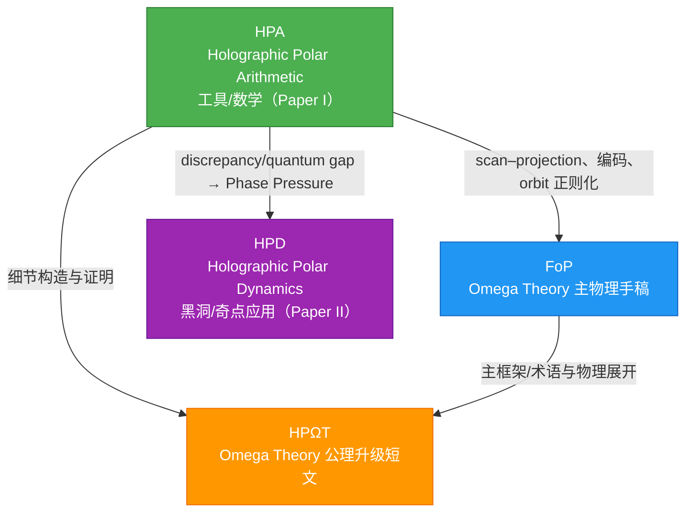

## `docs/papers` 论文索引与关系图

本目录包含 4 篇相互关联的手稿（均以 `main.tex` 作为入口）。它们共享一条核心机制链：**unitary scan（幺正扫描）→ projection/readout（有限分辨率投影读出）→ canonical coding（Ostrowski/Zeckendorf 等规范编码）→ mismatch/discrepancy（读出失配）→ regulated-to-continuum（orbit trace/finite part 正则化）**，并在不同层级上展开（工具/公理/主物理/应用）。

### 论文总览

| 目录 | 论文名（title） | PDF | TeX | 定位 | 主要依赖 |
|---|---|---|---|---|---|
| `2025_holographic_polar_arithmetic/` | Holographic Polar Arithmetic (HPA) | [`main.pdf`](./2025_holographic_polar_arithmetic/main.pdf) | [`main.tex`](./2025_holographic_polar_arithmetic/main.tex) | **工具/数学论文（Paper I）**：scan–projection、Sturmian/Fibonacci、Ostrowski/Zeckendorf、orbit 正则化 | — |
| `2025_holographic_polar_dynamics/` | Holographic Polar Dynamics (HPD) | [`main.pdf`](./2025_holographic_polar_dynamics/main.pdf) | [`main.tex`](./2025_holographic_polar_dynamics/main.tex) | **应用篇（Paper II）**：把 HPA 的失配/差异度量用于黑洞/奇点与信息悖论模板 | HPA |
| `2025_holographic_polar_omega_theory/` | Holographic Polar Omega Theory (HPΩT) | [`main.pdf`](./2025_holographic_polar_omega_theory/main.pdf) | [`main.tex`](./2025_holographic_polar_omega_theory/main.tex) | **短文/公理接口**：抽取并固定 O1–O6 + R1 的最短推论链 | HPA + FoP |
| `2025_foundations_of_physics_submission/` | Omega Theory: Axiomatic Foundations of Holographic Spacetime and Interactive Evolution (FoP) | [`main.pdf`](./2025_foundations_of_physics_submission/main.pdf) | [`main.tex`](./2025_foundations_of_physics_submission/main.tex) | **主物理手稿**：全局静态态 + 有限信息/全息映射 + QCA/准晶 + 现象学/宇宙学模板 | HPA（O5/O6 等工具链） |

说明：当前仓库内未提交 `main.pdf`，上表的 PDF 链接在生成对应 PDF 后即可直接打开。

### 关系图（依赖/承接）



### 各论文简介（含与其他论文的接口）

### `2025_holographic_polar_arithmetic/`（HPA，Paper I）

- **核心问题**：把“旋转/相位/乘法”作为本体层，解释为什么线性加法与连续合成在离散读出下不可兼得，并把不闭合的残差结构化为可计算对象。
- **核心构件**：
  - **multiplicative skeleton**：从乘法幺半群出发构造极坐标式嵌入。
  - **unitary scan**：以 Koopman 型幺正扫描与窗口投影得到读出序列。
  - **canonical coding**：irrational rotation → Sturmian；黄金分支 → Fibonacci；Ostrowski → Zeckendorf。
  - **orbit calculus / finite part**：orbit trace 与 Abel finite part，作为受控离散到连续极限的固定正规化约定。
- **对其他论文的作用**：
  - 为 FoP 的 O5/O6 提供具体模型与可复用证明/工具。
  - 为 HPD 提供 discrepancy/quantum gap 的数学对象与“可累积失配”的定量语言。
- **入口链接**：[`main.pdf`](./2025_holographic_polar_arithmetic/main.pdf)、[`main.tex`](./2025_holographic_polar_arithmetic/main.tex)、[`references.bib`](./2025_holographic_polar_arithmetic/references.bib)

### `2025_foundations_of_physics_submission/`（FoP，Omega Theory 主物理手稿）

- **核心问题**：在“无外参时间”的前提下，把宇宙描述为一个静态全局态，并以有限信息/全息映射为约束，构造一个可产生有效时空与动力学的受控微观框架。
- **主要层级**：
  - **公理层（O1–O6）**：静态全局态、有限信息、因果局域、全息映射、scan–projection 读出、Weyl 对。
  - **模型层（M1–M3 等）**：QCA/准晶基底、内部代数结构、golden-spectrum 更新与张量网络全息编码。
  - **现象学层**：信息几何作用量（Omega Action）、常数/色散/噪声模板与宇宙学推论。
- **与其他论文关系**：
  - O5/O6、Sturmian/Zeckendorf tick、orbit 正则化等“连续—离散桥”直接引用/调用 HPA 的工具链。
  - HPΩT 是对 FoP + HPA 的公共公理接口抽取。
- **入口链接**：[`main.pdf`](./2025_foundations_of_physics_submission/main.pdf)、[`main.tex`](./2025_foundations_of_physics_submission/main.tex)、[`references.bib`](./2025_foundations_of_physics_submission/references.bib)

### `2025_holographic_polar_omega_theory/`（HPΩT，公理升级短文）

- **定位**：把 Omega Theory 的连续—离散连接“写成可引用的公理接口”。
- **做了什么**：
  - 保留 O1–O4，明确升级 O5–O6（scan–projection + Weyl pair）与 Convention R1（orbit trace/finite part）。
  - 给出最短推论链：scan–projection → 规范编码（黄金分支 Zeckendorf）→ 不相容性/不确定性来源 → 读出诱导概率（instrument/POVM）→ 正则化约定。
- **与其他论文关系**：
  - 把 HPA（构造/证明）与 FoP（完整物理展开）之间的接口固定下来，便于在后续应用篇引用。
- **入口链接**：[`main.pdf`](./2025_holographic_polar_omega_theory/main.pdf)、[`main.tex`](./2025_holographic_polar_omega_theory/main.tex)、[`references.bib`](./2025_holographic_polar_omega_theory/references.bib)

### `2025_holographic_polar_dynamics/`（HPD，Omega Dynamics / Paper II）

- **核心问题**：把 GR 中的端点病态（如 Schwarzschild 的本质奇点）重新解释为“读出坐标的端点”，并给出一个由 scan–projection 失配驱动的宏观引力模板。
- **关键主张**：
  - **Phase Pressure**：把 HPA 的 discrepancy/quantum gap 的累积量在连续极限中粗粒化为相位势 $\Phi$ 的源（mismatch density），从而在弱场极限复现牛顿势，并在标准假设下闭合到 Schwarzschild 外部几何。
  - **Inversion continuation**：利用等方半径形式的反演对称，把 Einstein–Rosen throat 提升为“延拓规则”，以反演通道替换端点终止。
  - **信息悖论模板**：把蒸发看成粗粒化读出，热化边缘统计与相关性携带信息并存。
- **与其他论文关系**：
  - 直接以 HPA 为 Paper I，并把 HPA 的数论/符号读出语言用于“可解码相关性”的叙述模板。
  - 可作为与 FoP 兼容的应用模块阅读（同一 scan–projection 中轴），但文本层面主要引用 HPA。
- **入口链接**：[`main.pdf`](./2025_holographic_polar_dynamics/main.pdf)、[`main.tex`](./2025_holographic_polar_dynamics/main.tex)、[`references.bib`](./2025_holographic_polar_dynamics/references.bib)

### 推荐阅读顺序（两条路径）

- **路径 A（先抓总接口）**：HPΩT → HPA → FoP → HPD
- **路径 B（先看主物理叙事）**：FoP（看 O1–O6 与整体结构）→ HPΩT（对齐升级公理）→ HPA（补齐工具细节）→ HPD（看黑洞应用）

### 生成 `main.pdf`（本地编译）

若需要让上面的 `main.pdf` 链接可点击打开，可在各目录内编译 `main.tex` 生成同名 PDF。

- **推荐**（有 `latexmk` 时）：

```bash
latexmk -pdf -interaction=nonstopmode -halt-on-error main.tex
```

- **无 `latexmk` 的通用方式**：

```bash
pdflatex -interaction=nonstopmode -halt-on-error main.tex
bibtex main
pdflatex -interaction=nonstopmode -halt-on-error main.tex
pdflatex -interaction=nonstopmode -halt-on-error main.tex
```
