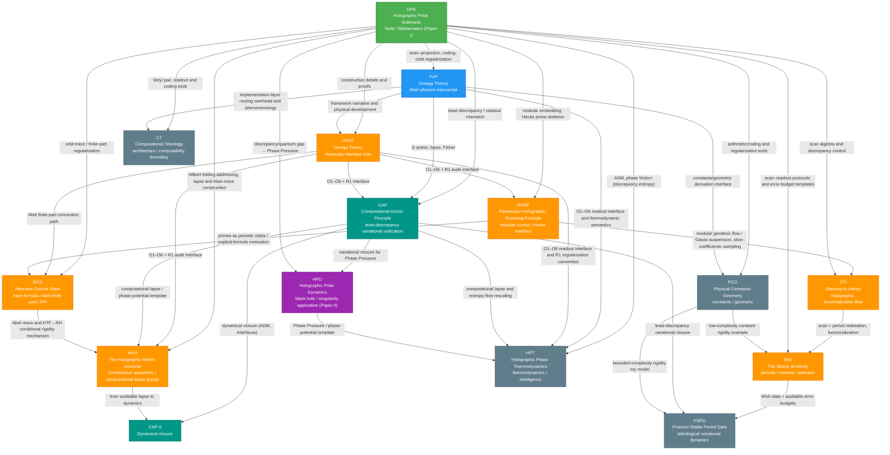

## `docs/papers` Paper Index and Dependency Graph

This directory contains a set of interconnected manuscripts (each uses `main.tex` as the entry point). They share a common mechanism chain:
**unitary scan → projection/readout (finite resolution) → canonical coding (Ostrowski/Zeckendorf, etc.) → mismatch/discrepancy → regulated-to-continuum (orbit trace / finite part)**.

Back: [`docs/index.md`](../index.md) | [`docs/index_cn.md`](../index_cn.md)

Chinese version: [`index.md`](./index.md)

### Paper Overview

Grouped by role (each item uses `main.tex` as the entry; if `main.pdf` exists you can open it directly).

#### Core Interfaces (Tools / Axioms / Main Physics)

- **`2025_holographic_polar_arithmetic/` (HPA)**: Holographic Polar Arithmetic: Multiplicative Ontology, Unitary Scanning, and the Geometric Origin of Quantum Uncertainty (HPA)
  - **PDF**: [`main.pdf`](./2025_holographic_polar_arithmetic/main.pdf)
  - **TeX**: [`main.tex`](./2025_holographic_polar_arithmetic/main.tex)
  - **Role**: **tools / mathematics (Paper I)** — scan–projection, Sturmian/Fibonacci, Ostrowski/Zeckendorf, orbit regularization
  - **Depends on**: —

- **`2025_foundations_of_physics_submission/` (FoP)**: Omega Theory: Axiomatic Foundations of Holographic Spacetime and Interactive Evolution (FoP)
  - **PDF**: [`main.pdf`](./2025_foundations_of_physics_submission/main.pdf)
  - **TeX**: [`main.tex`](./2025_foundations_of_physics_submission/main.tex)
  - **Role**: **main physics manuscript** — global static state, finite information / holographic mapping, QCA/quasicrystal substrate, phenomenology/cosmology templates
  - **Depends on**: HPA (toolchain for O5/O6)

- **`2025_holographic_polar_omega_theory/` (HPΩT)**: Holographic Polar Omega Theory: An Axiomatic Upgrade and the Continuous--Discrete Bridge (HPΩT)
  - **PDF**: [`main.pdf`](./2025_holographic_polar_omega_theory/main.pdf)
  - **TeX**: [`main.tex`](./2025_holographic_polar_omega_theory/main.tex)
  - **Role**: **axiomatic interface note** — minimal derivation chain fixing O1–O6 + R1 as a reusable interface
  - **Depends on**: HPA + FoP

#### Constructive Spacetime, Resolution Folding, and Particle Interface

- **`2025_holographic_hilbert_universe_hpa_omega/` (HHU)**: The Holographic Hilbert Universe: Constructive Spacetime, Computational-Lapse Gravity, and a Conditional Riemann Critical-Line Rigidity Theorem in HPA--Ω (HHU)
  - **PDF**: [`main.pdf`](./2025_holographic_hilbert_universe_hpa_omega/main.pdf)
  - **TeX**: [`main.tex`](./2025_holographic_hilbert_universe_hpa_omega/main.tex)
  - **Role**: **constructive spacetime** — Hilbert folding addressing, routing-overhead lapse gravity, Abel finite parts, (under HTF) conditional RH rigidity
  - **Depends on**: HPA + HPΩT + CAP + RGS

- **`2025_resolution_folding_phi_pi_e_hpa_omega/` (RF)**: Resolution Folding under φ–π–e Triple-Operator Constraints: A Zeckendorf–Hilbert–Abel Framework for the 64→21 Projection and Recursive Uplift
  - **PDF**: [`main.pdf`](./2025_resolution_folding_phi_pi_e_hpa_omega/main.pdf)
  - **TeX**: [`main.tex`](./2025_resolution_folding_phi_pi_e_hpa_omega/main.tex)
  - **Role**: **pure math / symbolic dynamics–topology–complex analysis interface** — Zeckendorf filtering (21), loop-closure split (18+3), Abel–ζ pole barrier, Hilbert address family; includes reproducible scripts
  - **Depends on**: HHU (Hilbert folding) + HPA (Zeckendorf shift)

- **`2025_z128_standard_model_stable_sector_hpa_omega/` (Z128/SM)**: A Standard Model of Stable Sectors for $\mathbb{Z}_{128}$ Scanning Readout: $\varphi$--$\pi$--$e$ Resolution Folding, Hilbert-Chiral Addressing, and Antimatter Duality
  - **PDF**: [`main.pdf`](./2025_z128_standard_model_stable_sector_hpa_omega/main.pdf)
  - **TeX**: [`main.tex`](./2025_z128_standard_model_stable_sector_hpa_omega/main.tex)
  - **Role**: **particle interface** — reproducible 21→SM field labeling, mass spectrum (incl. W/Z/H), 20-round bounded-complexity rigidity search and audit summaries
  - **Depends on**: RF + HHU + CAP + PCG

#### Variational Unification and Dynamical Closure

- **`2025_computational_action_principle_hpa_omega/` (CAP)**: Computational Action Principle: Least-Discrepancy Dynamics and Field Unification in HPA--Ω (CAP)
  - **PDF**: [`main.pdf`](./2025_computational_action_principle_hpa_omega/main.pdf)
  - **TeX**: [`main.tex`](./2025_computational_action_principle_hpa_omega/main.tex)
  - **Role**: **variational unification** — least-discrepancy principle → Ω action (Fisher + routing overhead) → GR + information stress; gauge/matter as phase-error compensation and topological defects
  - **Depends on**: HPA + FoP + HPΩT

- **`2025_computational_action_principle_ii_dynamics_hpa_omega/` (CAP-II)**: Computational Action Principle II: Dynamical Einstein Gravity and Quantum Interfaces from Routing Overhead in HPA--Ω (CAP-II)
  - **PDF**: [`main.pdf`](./2025_computational_action_principle_ii_dynamics_hpa_omega/main.pdf)
  - **TeX**: [`main.tex`](./2025_computational_action_principle_ii_dynamics_hpa_omega/main.tex)
  - **Role**: **dynamical closure** — ADM closure from auditable lapse (routing overhead) and interfaces for quantum/scattering calibration
  - **Depends on**: CAP + HHU + HPA + HPΩT (+ FoP)

#### Arithmetic Geometry, “Climbing”, and Periods/Motives

- **`2025_ramanujan_holographic_scanning_principle_hpa_omega/` (RHSP)**: Ramanujan Holographic Scanning Principle: Modular Curves, Hecke Dynamics, and an Arithmetic Constitution for HPA--Ω (RHSP)
  - **PDF**: [`main.pdf`](./2025_ramanujan_holographic_scanning_principle_hpa_omega/main.pdf)
  - **TeX**: [`main.tex`](./2025_ramanujan_holographic_scanning_principle_hpa_omega/main.tex)
  - **Role**: **arithmetic-geometry interface** — modular curves/Hecke as the “mother geometry” and prime skeleton for scan–projection; includes reproducible experiments
  - **Depends on**: HPA + HPΩT

- **`2025_stairway_to_infinity_holographic_renormalization_flow/` (STI)**: The Stairway to Infinity: A Holographic Renormalization Flow from Noncommutative Scanning to the Langlands Program (STI)
  - **PDF**: [`main.pdf`](./2025_stairway_to_infinity_holographic_renormalization_flow/main.pdf)
  - **TeX**: [`main.tex`](./2025_stairway_to_infinity_holographic_renormalization_flow/main.tex)
  - **Role**: **renormalization “climbing”** — modular geodesic flow / Gauss suspension; finite-$N$ error bounds via star discrepancy and Ostrowski digits; scale-exchange templates (S-inversion, Morita/Fourier)
  - **Depends on**: RHSP + HPA

- **`2025_motive_at_infinity_holographic_scanning_principle/` (MAI)**: The Motive at Infinity: Functorialization of the Holographic Scanning Principle, Period Realizations, and a Selection Principle (MAI)
  - **PDF**: [`main.pdf`](./2025_motive_at_infinity_holographic_scanning_principle/main.pdf)
  - **TeX**: [`main.tex`](./2025_motive_at_infinity_holographic_scanning_principle/main.tex)
  - **Role**: **periods/motives** — functorialize scan protocols to Kontsevich–Zagier period data with auditable error budgets; includes reproducible examples
  - **Depends on**: STI + HPA (+ PCG rigidity example)

- **`2025_protocol_stable_period_data_computational_teleology/` (PSPD)**: Protocol-Stable Period Data in Computational Teleology: From Holographic Scanning Protocols to Variational Dynamics of Minimal Computational Discrepancy and Constant Selection (PSPD)
  - **PDF**: [`main.pdf`](./2025_protocol_stable_period_data_computational_teleology/main.pdf)
  - **TeX**: [`main.tex`](./2025_protocol_stable_period_data_computational_teleology/main.tex)
  - **Role**: **teleological variational dynamics** — Wish data, discrepancy×variation certificates, damped inertial gradient flow on protocol space; constant rigidity/uniqueness-gap toy model
  - **Depends on**: MAI + CAP (+ PCG)

#### RH / Trace-Formula Topic

- **`2025_riemann_ground_state_hpa_omega/` (RGS)**: Riemann Ground State: Holographic Trace Formulas, Abel Finite Parts, and a Protocol Derivation of the Riemann Hypothesis in HPA--Omega (RGS)
  - **PDF**: [`main.pdf`](./2025_riemann_ground_state_hpa_omega/main.pdf)
  - **TeX**: [`main.tex`](./2025_riemann_ground_state_hpa_omega/main.tex)
  - **Role**: **RH / trace** — protocolize explicit formulas as Abel-traces; under Ω+HTF derive RH as a protocol consequence; includes reproducible experiments
  - **Depends on**: HPA + HPΩT (+ RHSP)

#### Applications and Topics (Black Holes, Thermodynamics, Constants, Architecture, Bio/Chem)

- **`2025_holographic_polar_dynamics/` (HPD)**: Holographic Polar Dynamics: Topological Inversion of the Schwarzschild Singularity and the Phase Origin of Gravity (HPD)
  - **PDF**: [`main.pdf`](./2025_holographic_polar_dynamics/main.pdf)
  - **TeX**: [`main.tex`](./2025_holographic_polar_dynamics/main.tex)
  - **Role**: **application (Paper II)** — apply HPA discrepancy/quantum gap to black-hole/singularity and information-paradox templates (Phase Pressure)
  - **Depends on**: HPA (+ CAP as a unifying lens)

- **`2025_holographic_phase_thermodynamics_hpa_omega/` (HPT)**: Holographic Phase Thermodynamics: Arithmetic Statistical Mechanics, Computational Lapse, and the Geometric Origin of Intelligence in HPA--Ω (HPT)
  - **PDF**: [`main.pdf`](./2025_holographic_phase_thermodynamics_hpa_omega/main.pdf)
  - **TeX**: [`main.tex`](./2025_holographic_phase_thermodynamics_hpa_omega/main.tex)
  - **Role**: **topic (thermodynamics/intelligence)** — arithmetic statistical mechanics, phase friction (discrepancy entropy), computational lapse and entropy-flow rescaling, intelligence as active error-correction phase transition
  - **Depends on**: HPA + FoP + HPΩT + CAP (+ HPD Phase Pressure template)

- **`2025_physical_constants_geometry_hpa_omega/` (PCG)**: The Geometry of Physical Constants in HPA--Ω: From the Fine-Structure Constant to Particle Spectra and Black-Hole/Cosmological Invariants (PCG)
  - **PDF**: [`main.pdf`](./2025_physical_constants_geometry_hpa_omega/main.pdf)
  - **TeX**: [`main.tex`](./2025_physical_constants_geometry_hpa_omega/main.tex)
  - **Role**: **topic (constants/geometry)** — constants relations and numerical verification under HPA–Ω
  - **Depends on**: HPA + FoP

- **`2025_computational_teleology_hpa_omega/` (CT)**: Computational Teleology in Holographic Polar Arithmetic: Scan Complexity, Readout Resolution, and an Undecidable Quantum-Cellular Universe (CT)
  - **PDF**: [`main.pdf`](./2025_computational_teleology_hpa_omega/main.pdf)
  - **TeX**: [`main.tex`](./2025_computational_teleology_hpa_omega/main.tex)
  - **Role**: **topic (architecture/decidability)** — complexity–geometry–observation, routing overhead and computational lapse, and computability boundaries
  - **Depends on**: HPA + FoP

- **`chemistry/2025_geometric_origin_chemical_bond_hpa_omega/` (Chem)**: Geometric Origin of Chemical Bonding in HPA--Ω: Deriving Molecular Stability from the Three-Channel Geometric Impedance α and the Internal Phase Volume μ (Chem)
  - **PDF**: [`main.pdf`](./chemistry/2025_geometric_origin_chemical_bond_hpa_omega/main.pdf)
  - **TeX**: [`main.tex`](./chemistry/2025_geometric_origin_chemical_bond_hpa_omega/main.tex)
  - **Role**: **topic (chemistry/bonding)** — atomic units and BO separation from geometric invariants ($\\alpha$, $\\mu$); includes scripts
  - **Depends on**: PCG + HPΩT + HHU + HPT + CAP

- **`biology/2025_biological_computational_teleology_hpa_omega/` (BioCT)**: Biological Computational Teleology in HPA--Ω: Life as Predictive Active Error Correction Against Phase Friction (BioCT)
  - **PDF**: [`main.pdf`](./biology/2025_biological_computational_teleology_hpa_omega/main.pdf)
  - **TeX**: [`main.tex`](./biology/2025_biological_computational_teleology_hpa_omega/main.tex)
  - **Role**: **topic (biology/teleology)** — life as predictive active error correction; phase friction, geometric Landauer, survival inequalities and control laws
  - **Depends on**: HPT + CT + PSPD

- **`biology/2025_arithmetic_origin_genetic_code_hpa_omega/` (GenCode)**: Zeckendorf--Hilbert Folding Characterization of the Genetic Code: Start--Stop Topological Symmetry and Z-Spectrum Analysis Centered on 6-Bit Resolution Folding
  - **PDF**: [`main.pdf`](./biology/2025_arithmetic_origin_genetic_code_hpa_omega/main.pdf)
  - **TeX**: [`main.tex`](./biology/2025_arithmetic_origin_genetic_code_hpa_omega/main.tex)
  - **Role**: **topic (genetic code decompilation)** — codons as 6-bit microstates; Fold$_6$ as 64→21 compression; exhaustive search over 2-bit encodings under boundary constraints; Z-spectrum tooling
  - **Depends on**: RF + BioCT

Note: if `main.pdf` is not present in a directory, compile `main.tex` locally to generate it (instructions below).

### Dependency Graph (Papers)



### Paper Briefs (Interfaces with Other Papers)

### `2025_holographic_polar_arithmetic/` (HPA, Paper I)

- **Core question**: treat “rotation/phase/multiplication” as the ontological layer; explain why linear additivity and continuous composition cannot both be preserved under discrete readout; turn non-closure residuals into computable objects.
- **Key components**:
  - **multiplicative skeleton**: polar-style embedding from a multiplicative monoid.
  - **unitary scan**: Koopman-type unitary scan + window projection readout.
  - **canonical coding**: irrational rotation → Sturmian; golden branch → Fibonacci; Ostrowski → Zeckendorf.
  - **orbit calculus / finite part**: orbit trace and Abel finite part as fixed conventions for controlled discrete→continuous limits.
- **Role in the series**:
  - provides concrete models and reusable tools/proofs for FoP O5/O6.
  - provides discrepancy/quantum-gap objects and quantitative language for HPD.
- **Entry points**: [`main.pdf`](./2025_holographic_polar_arithmetic/main.pdf), [`main.tex`](./2025_holographic_polar_arithmetic/main.tex), [`references.bib`](./2025_holographic_polar_arithmetic/references.bib)

### `2025_foundations_of_physics_submission/` (FoP, Omega Theory main physics manuscript)

- **Core question**: under “no external time”, describe the universe as a static global state; impose finite-information / holographic constraints; construct a controlled microscopic framework that generates effective spacetime and dynamics.
- **Main layers**:
  - **axioms (O1–O6)**: static global state, finite information, causal locality, holographic map, scan–projection readout, Weyl pairs.
  - **models (M1–M3, etc.)**: QCA/quasicrystal substrates, internal algebraic structures, golden-spectrum updates, tensor-network holographic coding.
  - **phenomenology**: information-geometric action (Omega Action), constants/dispersion/noise templates, cosmological consequences.
- **Interfaces**:
  - uses HPA toolchain for O5/O6, Sturmian/Zeckendorf ticks, and orbit regularization.
  - HPΩT extracts the common axiomatic interface between FoP and HPA.
- **Entry points**: [`main.pdf`](./2025_foundations_of_physics_submission/main.pdf), [`main.tex`](./2025_foundations_of_physics_submission/main.tex), [`references.bib`](./2025_foundations_of_physics_submission/references.bib)

### `2025_holographic_polar_omega_theory/` (HPΩT, axiomatic interface note)

- **Positioning**: a minimal, citable axiomatic interface for the continuous–discrete bridge in Omega Theory.
- **What it does**:
  - keeps O1–O4 and upgrades O5–O6 (scan–projection + Weyl pair) and Convention R1 (orbit trace / finite part).
  - provides a shortest derivation chain: scan–projection → canonical coding (golden-branch Zeckendorf) → incompatibility/uncertainty → readout-induced probability (instrument/POVM) → regularization convention.
- **Interfaces**: fixes the interface between HPA (constructions/proofs) and FoP (full physical narrative) for later applications.
- **Entry points**: [`main.pdf`](./2025_holographic_polar_omega_theory/main.pdf), [`main.tex`](./2025_holographic_polar_omega_theory/main.tex), [`references.bib`](./2025_holographic_polar_omega_theory/references.bib)

### `2025_holographic_hilbert_universe_hpa_omega/` (HHU, The Holographic Hilbert Universe)

- **Positioning**: an auditable construction chain for “how a 1D scan protocol yields multi-dimensional spatial locality”, unified with computational-lapse gravity templates and Abel–trace (under HTF) conditional RH rigidity in one manuscript.
- **What it does**:
  - **Hilbert folding axiom (H1)**: at each resolution level $n$, map tick-time to a holographic-screen lattice via discrete Hilbert addressing; locality becomes an address/compile effect.
  - **computational-lapse gravity**: define lapse $\mathcal{N}=\kappa_0/\\kappa$ from routing overhead $\\kappa$; give redshift templates and Poisson closures verifying near-field $1/r$ phase potential.
  - **critical-line rigidity (conditional)**: under HTF, use holomorphy inside the Abel unit disk to rule out interior poles corresponding to off-line zeros; derive RH as a protocol consequence.
  - **reproducible scripts**: locality checks, star-discrepancy bounds, Abel pole-barrier toy models, Poisson solving, Wigner–Smith $\\kappa(E)$ interfaces.
- **Interfaces**: follows HPΩT O5/O6+R1 and completes “spacetime construction” via explicit Hilbert folding; aligns with CAP/HPD lapse/phase-potential templates; structurally matches RGS’s HTF→RH conditional rigidity mechanism.
- **Entry points**: [`main.pdf`](./2025_holographic_hilbert_universe_hpa_omega/main.pdf), [`main.tex`](./2025_holographic_hilbert_universe_hpa_omega/main.tex), [`references.bib`](./2025_holographic_hilbert_universe_hpa_omega/references.bib), [`scripts/`](./2025_holographic_hilbert_universe_hpa_omega/scripts/)

### `2025_resolution_folding_phi_pi_e_hpa_omega/` (RF, Resolution Folding)

- **Positioning**: an auditable Zeckendorf–Hilbert–Abel framework for the $64\\to 21$ projection consistent with the $\\varphi$–$\\pi$–$e$ triple-operator constraints; includes reproducible experiments.
- **What it does**:
  - **Zeckendorf filtering (21)**: compress discrete readout to a stable 21-sector core via canonical coding.
  - **closure split (18+3)**: provide a loop-closure split as the core input for later field-layer labeling.
  - **Abel–ζ pole barrier**: present controlled regularization and pole-barrier mechanisms in an Abel viewpoint.
  - **Hilbert address family**: align with HHU Hilbert-folding addressing.
- **Interfaces**: provides the provable core input for Z128’s 21→SM labeling and audit scripts.
- **Entry points**: [`main.pdf`](./2025_resolution_folding_phi_pi_e_hpa_omega/main.pdf), [`main.tex`](./2025_resolution_folding_phi_pi_e_hpa_omega/main.tex), [`references.bib`](./2025_resolution_folding_phi_pi_e_hpa_omega/references.bib), [`scripts/`](./2025_resolution_folding_phi_pi_e_hpa_omega/scripts/)

### `2025_z128_standard_model_stable_sector_hpa_omega/` (Z128, Stable Sectors → Standard Model)

- **Positioning**: on top of the provable $64\\to 21$ and $18\\oplus 3$ core, provide reproducible **21→SM field labeling** and **mass-spectrum closure**, together with bounded-complexity audits demonstrating uniqueness gaps and failure baselines.
- **What it does**:
  - **field-layer labeling**: auditable labeling rules for chirality/antimatter/family structures over 21 stable sectors.
  - **mass spectrum and mixing closure**: fits including W/Z/H, and CKM/PMNS interface closures (with scripts and audit summaries).
  - **rigidity audit**: fixed-budget multi-round searches with counterfactual baselines and pass/fail statistics.
- **Interfaces**: RF+HHU provide folding/addressing inputs; CAP/PCG provide variational and constant-geometry templates.
- **Entry points**: [`main.pdf`](./2025_z128_standard_model_stable_sector_hpa_omega/main.pdf), [`main.tex`](./2025_z128_standard_model_stable_sector_hpa_omega/main.tex), [`references.bib`](./2025_z128_standard_model_stable_sector_hpa_omega/references.bib), [`scripts/`](./2025_z128_standard_model_stable_sector_hpa_omega/scripts/)

### `2025_ramanujan_holographic_scanning_principle_hpa_omega/` (RHSP, Ramanujan Holographic Scanning Principle)

- **Positioning**: place scan–projection (O5/O6) into the arithmetic-geometry “mother space” of modular curves $X(1)$ and the Hecke algebra, yielding an auditable “arithmetic–holographic–computational constitution”.
- **What it does**:
  - **mother geometry**: fundamental domain of $\\mathrm{PSL}_2(\\mathbb{Z})$, cusps, and $0\\sim\\infty$ cusp identification as a scale-exchange template.
  - **discrete interface**: cusp $q$-expansions as continuous→discrete coefficient interfaces; $\\tau(n)$ from $\\Delta$ as a computable example.
  - **prime skeleton**: Hecke operators are defined for all $n$ but generated by primes; prime-power recursions and stable spectrum interpretations.
  - **canonical coding**: continued fractions → Ostrowski; golden branch → Zeckendorf; “integer time → bit readout” interfaces.
  - **reproducible checks**: pure-standard-library Python verifying Fibonacci words, discrepancy, $\\tau(n)$ recursions, and $j$-invariant S-invariance.
- **Interfaces**: reuses HPA scan/coding toolchain and aligns with HPΩT’s O1–O6+R1 interface for use in FoP/CAP and beyond.
- **Entry points**: [`main.pdf`](./2025_ramanujan_holographic_scanning_principle_hpa_omega/main.pdf), [`main.tex`](./2025_ramanujan_holographic_scanning_principle_hpa_omega/main.tex), [`references.bib`](./2025_ramanujan_holographic_scanning_principle_hpa_omega/references.bib)

### `2025_riemann_ground_state_hpa_omega/` (RGS, Riemann Ground State)

- **Positioning**: with HPA–Ω scan–readout and Abel finite parts as closed-layer conventions, read ζ’s explicit formula as a “holographic trace formula”; under Ω+HTF provide a protocol derivation chain for RH.
- **What it does**:
  - **closed-layer derivation**: combine Omega’s “Abel-trace defined for $0<r<1$ + existence of finite parts along a canonical path” with HTF’s “zero-index modes enter the spectral side”, yielding an Abel radius barrier excluding $\\Re(\\rho)\\neq 1/2$.
  - **reproducible mechanism checks**: golden-branch 1D star discrepancy remains logarithmically stable; shifting toy zero modes’ real parts triggers Abel thresholds and energy blow-up.
- **Interfaces**: directly reuses HPA orbit calculus/finite parts and HPΩT’s axiomatic interface; compatible with RHSP’s “primes = periodic orbits” view, but the closed-layer argument only needs HTF as a structural bridge.
- **Entry points**: [`main.pdf`](./2025_riemann_ground_state_hpa_omega/main.pdf), [`main.tex`](./2025_riemann_ground_state_hpa_omega/main.tex), [`references.bib`](./2025_riemann_ground_state_hpa_omega/references.bib), [`scripts/`](./2025_riemann_ground_state_hpa_omega/scripts/)

### `2025_stairway_to_infinity_holographic_renormalization_flow/` (STI, The Stairway to Infinity)

- **Positioning**: advance RHSP’s “static constitution” into the “climbing process” itself: formalize cross-scale lifting via modular geodesic flow (continuous scale) and its Gauss suspension / continued-fraction digits (discrete scale).
- **What it does**:
  - **renormalization-flow object**: connect modular geodesic flow and the Gauss map via a series theorem; roof functions provide computable scale-time.
  - **slice–coefficients–sampling**: projection formulas recovering $q$-coefficients from slices at height $y>0$; replace integrals by scan-orbit sampling; derive finite-$N$ bounds via star discrepancy and Ostrowski digits.
  - **scale-exchange templates**: place S-inversion (endpoint identification, deep/shallow swap) alongside noncommutative-torus Morita equivalence / Fourier exchange as unified templates.
  - **Langlands upgrade tasks**: articulate the functorialization goal from scan-protocol categories to automorphic-representation categories.
- **Interfaces**: inherits modular/Hecke prime skeleton from RHSP and reuses HPA discrepancy tools as the bottom layer for sampling error control.
- **Entry points**: [`main.pdf`](./2025_stairway_to_infinity_holographic_renormalization_flow/main.pdf), [`main.tex`](./2025_stairway_to_infinity_holographic_renormalization_flow/main.tex), [`references.bib`](./2025_stairway_to_infinity_holographic_renormalization_flow/references.bib)

### `2025_motive_at_infinity_holographic_scanning_principle/` (MAI, The Motive at Infinity)

- **Positioning**: without breaking Layer 0/1 audit discipline, anchor “scan–readout protocols” as computable realizations of **Kontsevich–Zagier periods**, and functorialize protocols to period-data objects on a controllable subcategory; state selection as a finite-resource stability/complexity optimization principle (programmatic, not a closure premise).
- **What it does**:
  - **controllable protocol subcategory**: define `Scan_alg` (Kronecker scan + rational-kernel readout + explicit regularization/truncation rules), encoding finite resolution and truncation budgets into protocol objects.
  - **functorial upgrade**: construct a holographic scanning functor `HSP: Scan_alg -> PerDatum` mapping protocols to period-data objects (field + rational kernel + regularization rule).
  - **main closed theorem**: under irrational/rational independence, Birkhoff averages converge to the target period integral; under resonance, collapse to Haar averages on subtori as the standard alternative.
  - **auditable error budgets**: decompose finite-resource errors into “sampling discrepancy” + “regularization/truncation”; provide truncation bounds templates for $\\zeta(2),\\zeta(3)$ with error propagation across protocol composition.
  - **rigidity signal example**: bounded-complexity integer-relation search for $\\alpha^{-1}$ showing $(4,1,1)$ as the uniquely significant optimum under a given budget (consistent with PCG).
- **Interfaces**: continues STI’s functorialization program and aligns with HPA’s audit language; forms a mutual-check interface with PCG on “low-complexity rigidity signals”.
- **Entry points**: [`main.pdf`](./2025_motive_at_infinity_holographic_scanning_principle/main.pdf), [`main.tex`](./2025_motive_at_infinity_holographic_scanning_principle/main.tex), [`references.bib`](./2025_motive_at_infinity_holographic_scanning_principle/references.bib), [`scripts/`](./2025_motive_at_infinity_holographic_scanning_principle/scripts/)

### `2025_protocol_stable_period_data_computational_teleology/` (PSPD, Protocol-Stable Period Data)

- **Positioning**: close MAI’s “Wish = protocol-stable period data” and CAP’s “least-discrepancy variational skeleton” into an auditable dynamics model on protocol parameter space: certified discrepancy potential + explicit complexity costs + damped inertial gradient flow.
- **What it does**:
  - **axiomatic objectification of Wish**: fix Wish as protocol-stable period data, treated as a reproducible target object rather than interpretive language.
  - **finite-resource error certificates**: sampling-error certificate via discrepancy × Hardy–Krause variation, combined with regularization/truncation error decomposition into a total auditable budget.
  - **variational dynamics on protocol space**: treat certified discrepancy potential and complexity costs as computational potential; derive damped inertial gradient flow and show Lyapunov monotonicity.
  - **reproducible verification**: pure Python protocols for $\\log 2,\\pi,\\zeta(2),\\zeta(3)$; low-complexity search for $\\alpha^{-1}(0)$ with a visible uniqueness gap.
- **Interfaces**: inherits MAI’s audit discipline and advances the selection principle into explicit dynamical closure; mutually checks with PCG via constant rigidity examples.
- **Entry points**: [`main.pdf`](./2025_protocol_stable_period_data_computational_teleology/main.pdf), [`main.tex`](./2025_protocol_stable_period_data_computational_teleology/main.tex), [`references.bib`](./2025_protocol_stable_period_data_computational_teleology/references.bib), [`scripts/`](./2025_protocol_stable_period_data_computational_teleology/scripts/)

### `2025_computational_action_principle_hpa_omega/` (CAP, Computational Action Principle)

- **Core question**: elevate “laws = error-correction / steady-state mechanisms” into a closed variational chain: least discrepancy drives a unified expression from readout mismatch to field equations.
- **Key claims**:
  - **least-discrepancy principle**: treat accumulated discrepancy/mismatch as a cost that must be suppressed to sustainable levels; promote it to a continuous source (phase potential / stress source).
  - **Ω action skeleton**: Fisher information (information geometry) + implementation complexity (routing overhead / computational lapse) as minimal coupling; discrepancy penalty enters as potential/source terms.
  - **unique GR closure**: under local covariance and second-order closure conditions, the macroscopic metric equation uniquely converges to Einstein equations (incl. $\\Lambda$), with discrepancy/complexity entering effective stress and potential.
  - **gauge/matter interpretation**: gauge connections as local phase-error compensation; matter as topologically locked phase defects (requiring sustained budgets).
- **Interfaces**: takes HPA scan/coding/discrepancy tools as inputs and uses FoP/HPΩT axioms and the Ω-action dictionary as the backbone; offers a variational closure perspective for HPD’s Phase Pressure template.
- **Entry points**: [`main.pdf`](./2025_computational_action_principle_hpa_omega/main.pdf), [`main.tex`](./2025_computational_action_principle_hpa_omega/main.tex), [`references.bib`](./2025_computational_action_principle_hpa_omega/references.bib)

### `2025_computational_action_principle_ii_dynamics_hpa_omega/` (CAP-II, Computational Action Principle II)

- **Positioning**: from auditable routing-overhead / computational-lapse quantities, provide ADM-type dynamical closure and consistent calibration paths for quantum/scattering interfaces.
- **Interfaces**: continues CAP’s variational skeleton, reuses HHU’s lapse construction, and maintains compatibility with HPA/HPΩT readout interfaces.
- **Entry points**: [`main.pdf`](./2025_computational_action_principle_ii_dynamics_hpa_omega/main.pdf), [`main.tex`](./2025_computational_action_principle_ii_dynamics_hpa_omega/main.tex), [`references.bib`](./2025_computational_action_principle_ii_dynamics_hpa_omega/references.bib)

### `2025_holographic_phase_thermodynamics_hpa_omega/` (HPT, Holographic Phase Thermodynamics)

- **Positioning**: take HPA–Ω readout mismatch and computational-lapse inputs to build arithmetic statistical mechanics and a “phase-friction” thermodynamics, and interpret intelligence as an active error-correction phase transition.
- **Interfaces**: reuses HPD’s Phase Pressure viewpoint with variational closure via CAP; connects to CT/BioCT on teleological active-correction applications.
- **Entry points**: [`main.pdf`](./2025_holographic_phase_thermodynamics_hpa_omega/main.pdf), [`main.tex`](./2025_holographic_phase_thermodynamics_hpa_omega/main.tex), [`references.bib`](./2025_holographic_phase_thermodynamics_hpa_omega/references.bib)

### `2025_holographic_polar_dynamics/` (HPD, Omega Dynamics / Paper II)

- **Core question**: reinterpret GR endpoint pathologies (e.g., Schwarzschild essential singularity) as “readout coordinate endpoints”, and propose a macroscopic gravity template driven by scan–projection mismatch.
- **Key claims**:
  - **Phase Pressure**: coarse-grain accumulated discrepancy/quantum gap into a phase potential $\\Phi$ source, reproducing Newtonian potential in the weak-field limit and closing to the Schwarzschild exterior geometry under standard assumptions.
  - **inversion continuation**: use the isotropic-radius inversion symmetry to elevate the Einstein–Rosen throat into an “extension rule”, replacing endpoint termination with an inversion channel.
  - **information-paradox template**: treat evaporation as coarse-grained readout; thermalization-edge statistics and correlation-carrying information coexist.
- **Interfaces**: uses HPA as Paper I and borrows its arithmetic/symbolic readout language; can be read as an application module compatible with FoP (same scan–projection axis) though it mainly cites HPA.
- **Entry points**: [`main.pdf`](./2025_holographic_polar_dynamics/main.pdf), [`main.tex`](./2025_holographic_polar_dynamics/main.tex), [`references.bib`](./2025_holographic_polar_dynamics/references.bib)

### `2025_physical_constants_geometry_hpa_omega/` (PCG, Physical Constants Geometry)

- **Positioning**: a topical manuscript using HPA–Ω geometric/information structure for physical-constant relations and numerical checks.
- **Entry points**: [`main.pdf`](./2025_physical_constants_geometry_hpa_omega/main.pdf), [`main.tex`](./2025_physical_constants_geometry_hpa_omega/main.tex), [`references.bib`](./2025_physical_constants_geometry_hpa_omega/references.bib)

### `chemistry/2025_geometric_origin_chemical_bond_hpa_omega/` (Chem, chemistry/bonding topic)

- **Positioning**: take constant-geometry invariants ($\\alpha,\\mu$) from PCG as closed-layer inputs; map to atomic units and BO separation; propose falsifiable spectroscopy interfaces; includes scripts.
- **Entry points**: [`main.pdf`](./chemistry/2025_geometric_origin_chemical_bond_hpa_omega/main.pdf), [`main.tex`](./chemistry/2025_geometric_origin_chemical_bond_hpa_omega/main.tex), [`references.bib`](./chemistry/2025_geometric_origin_chemical_bond_hpa_omega/references.bib), [`scripts/`](./chemistry/2025_geometric_origin_chemical_bond_hpa_omega/scripts/)

### `biology/2025_biological_computational_teleology_hpa_omega/` (BioCT, biology/teleology topic)

- **Positioning**: with HPT’s phase friction and CT’s architectural language, treat “life” as a predictive active error-correction phase and provide auditable templates for survival inequalities and control laws.
- **Entry points**: [`main.pdf`](./biology/2025_biological_computational_teleology_hpa_omega/main.pdf), [`main.tex`](./biology/2025_biological_computational_teleology_hpa_omega/main.tex), [`references.bib`](./biology/2025_biological_computational_teleology_hpa_omega/references.bib)

### `biology/2025_arithmetic_origin_genetic_code_hpa_omega/` (Genetic-code decompilation topic)

- **Positioning**: treat codons as 6-bit microstates and implement Fold$_6$ as 64→21 folding; exhaustively decompile 2-bit encodings under start/stop boundary constraints, yielding a unique optimum and transcript-level Z-spectrum tooling.
- **Entry points**: [`main.pdf`](./biology/2025_arithmetic_origin_genetic_code_hpa_omega/main.pdf), [`main.tex`](./biology/2025_arithmetic_origin_genetic_code_hpa_omega/main.tex), [`references.bib`](./biology/2025_arithmetic_origin_genetic_code_hpa_omega/references.bib)

### `2025_computational_teleology_hpa_omega/` (CT, Computational Teleology)

- **Positioning**: system architecture layer for complexity–geometry–observation: routing overhead and computational lapse, time/space complementarity, and decidability boundaries (open conditions at the computability level).
- **Entry points**: [`main.pdf`](./2025_computational_teleology_hpa_omega/main.pdf), [`main.tex`](./2025_computational_teleology_hpa_omega/main.tex), [`references.bib`](./2025_computational_teleology_hpa_omega/references.bib)

### Recommended Reading Order (Two Paths)

- **Path A (interfaces first)**: HPΩT → HPA → STI → MAI → FoP → CAP → HPD (read PCG/CT as needed)
- **Path B (main physics narrative first)**: FoP (O1–O6 and global structure) → HPΩT (axiom interface) → HPA (tool details) → STI → MAI → CAP → HPD (read PCG/CT as needed)

Supplement: if you care about dynamical closure and applications, add CAP-II (dynamics) → HPT (thermo/intelligence) → PSPD (teleological variational dynamics) → BioCT/GenCode (bio topics) after CAP; if you care about the particle interface, read Z128 after HHU/RF.

### Building `main.pdf` Locally

To make the `main.pdf` links available, compile `main.tex` in each paper directory.

- **Recommended (with `latexmk`)**:

```bash
latexmk -pdf -interaction=nonstopmode -halt-on-error main.tex
```

- **Generic (without `latexmk`)**:

```bash
pdflatex -interaction=nonstopmode -halt-on-error main.tex
bibtex main
pdflatex -interaction=nonstopmode -halt-on-error main.tex
pdflatex -interaction=nonstopmode -halt-on-error main.tex
```

